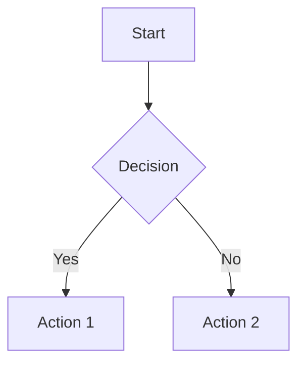

# BlockBlog - Technical Blog

A modern technical blog website built with Next.js 15, featuring Markdown support, Mermaid diagrams, and a beautiful responsive design.

## ✨ Features

- **🚀 Next.js 15** - Latest version with App Router
- **📝 Markdown Support** - Write blog posts in Markdown
- **📊 Mermaid Diagrams** - Create flowcharts, sequences, and other diagrams
- **🎨 Tailwind CSS** - Custom typography configuration with Inter and JetBrains Mono fonts
- **📱 Responsive Design** - Mobile-first responsive layout
- **🔍 SEO Optimized** - Proper meta tags and structured content
- **⚡ Fast Performance** - Static site generation with optimized builds
- **🔤 Syntax Highlighting** - Beautiful code blocks with GitHub Dark theme
- **🏷️ Tag System** - Organize posts with tags

## 🛠️ Tech Stack

- **Framework**: Next.js 15
- **Styling**: Tailwind CSS with @tailwindcss/typography
- **Content**: Markdown with gray-matter frontmatter parsing
- **Diagrams**: Mermaid.js
- **Syntax Highlighting**: rehype-highlight
- **Typography**: Inter (sans-serif) & JetBrains Mono (monospace)

## 🚀 Getting Started

### Prerequisites

- Node.js 18+ 
- npm or yarn

### Installation

1. Clone the repository:
   ```bash
   git clone <your-repo-url>
   cd BlockBlog
   ```

2. Install dependencies:
   ```bash
   npm install
   ```

3. Start the development server:
   ```bash
   npm run dev
   ```

4. Open [http://localhost:3000](http://localhost:3000) in your browser

## 📝 Writing Blog Posts

Create new blog posts by adding Markdown files to the `content/posts/` directory.

### File Structure
```
content/
  posts/
    my-awesome-post.md
    another-great-post.md
```

### Frontmatter Format
```yaml
---
title: "Your Post Title"
description: "A brief description of your post"
date: "2024-10-31"
tags: ["nextjs", "web-development", "tutorial"]
---

# Your blog content here

Write your content in Markdown format...
```

### Supported Features

#### Code Blocks
```javascript
const greeting = "Hello, World!";
console.log(greeting);
```

#### Mermaid Diagrams


#### Tables, Lists, and More
- All GitHub Flavored Markdown features
- Automatic heading anchors
- Responsive images
- Custom typography styling

## 🎨 Customization

### Tailwind Configuration

The project uses a custom Tailwind configuration with:
- Custom font families (Inter, JetBrains Mono)
- Typography plugin with custom prose styling
- Color scheme optimized for readability

### Adding New Fonts

1. Import fonts in `src/app/globals.css`
2. Update `tailwind.config.js` fontFamily configuration
3. Use in your components with Tailwind classes

## 📁 Project Structure

```
BlockBlog/
├── content/
│   └── posts/           # Blog post Markdown files
├── src/
│   ├── app/
│   │   ├── blog/
│   │   │   └── [slug]/  # Dynamic blog post pages
│   │   ├── globals.css  # Global styles
│   │   ├── layout.tsx   # Root layout
│   │   └── page.tsx     # Homepage
│   ├── components/
│   │   └── Mermaid.tsx  # Mermaid diagram component
│   └── lib/
│       ├── blog.ts      # Blog utilities
│       └── markdown.ts  # Markdown processing
├── .github/
│   └── copilot-instructions.md
├── package.json
├── tailwind.config.js
├── tsconfig.json
└── next.config.js
```

## 🚦 Available Scripts

```bash
# Development server with Turbopack
npm run dev

# Build for production
npm run build

# Start production server
npm run start

# Run ESLint
npm run lint
```

## 🔧 Development

### Adding New Features

1. **New components**: Add to `src/components/`
2. **Utility functions**: Add to `src/lib/`
3. **Styling**: Use Tailwind classes or extend in `tailwind.config.js`
4. **Content processing**: Extend `src/lib/markdown.ts`

### VS Code Integration

The project includes VS Code tasks for development:
- Use `Ctrl/Cmd + Shift + P` → "Tasks: Run Task" → "Dev Server" to start development

## 📦 Dependencies

### Core Dependencies
- `next` - React framework
- `react` & `react-dom` - React library
- `tailwindcss` - Utility-first CSS framework
- `@tailwindcss/typography` - Typography plugin

### Content Processing
- `gray-matter` - Frontmatter parsing
- `unified` - Content processing pipeline
- `remark-*` - Markdown processing
- `rehype-*` - HTML processing
- `mermaid` - Diagram rendering

## 🚀 Deployment

### Build for Production
```bash
npm run build
npm run start
```

### Deploy to Vercel
```bash
# Install Vercel CLI
npm i -g vercel

# Deploy
vercel
```

### Deploy to Other Platforms
The project generates a static build compatible with:
- Netlify
- GitHub Pages
- AWS S3 + CloudFront
- Any static hosting provider

## 🎯 Performance

- ✅ Static generation for fast loading
- ✅ Optimized images and assets
- ✅ Tree-shaking for minimal bundle size
- ✅ CSS purging in production
- ✅ Font optimization

## 🤝 Contributing

1. Fork the repository
2. Create your feature branch (`git checkout -b feature/amazing-feature`)
3. Commit your changes (`git commit -m 'Add some amazing feature'`)
4. Push to the branch (`git push origin feature/amazing-feature`)
5. Open a Pull Request

## 📄 License

This project is open source and available under the [MIT License](LICENSE).

## 🆘 Support

If you have any questions or need help:

1. Check the existing blog posts in `content/posts/` for examples
2. Review the component implementations in `src/components/`
3. Look at the utility functions in `src/lib/`

---

Built with ❤️ using Next.js 15 and modern web technologies.