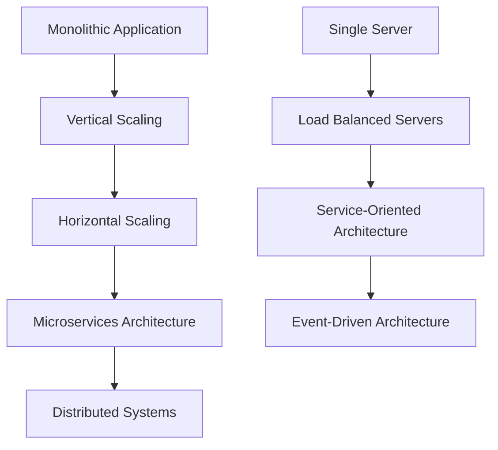
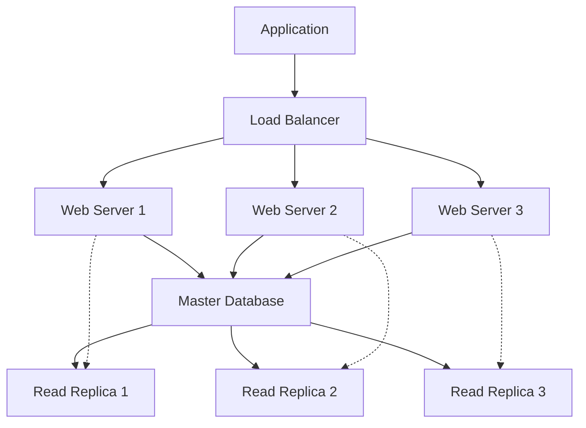

# Scalable Web Architecture Fundamentals: Building Systems That Scale

Building scalable web applications is one of the most challenging aspects of modern software engineering. As your user base grows from hundreds to millions, your architecture needs to evolve to handle increased load, maintain performance, and ensure reliability. This comprehensive guide explores the fundamental principles and patterns for building scalable web architectures.

## Understanding Scale: From Monolith to Distributed Systems

### The Evolution of Web Architecture



The journey from a simple monolithic application to a distributed system involves several architectural transformations, each addressing specific scalability challenges.

### Vertical vs. Horizontal Scaling

**Vertical Scaling (Scale Up)**
- Adding more power (CPU, RAM) to existing machines
- Simpler to implement initially
- Has physical and economic limits
- Single point of failure

**Horizontal Scaling (Scale Out)**
- Adding more machines to the resource pool
- More complex but unlimited growth potential
- Better fault tolerance
- Requires careful architecture design

## Load Balancing: The Foundation of Scalability

### Load Balancing Algorithms

#### Round Robin
```python
class RoundRobinBalancer:
    def __init__(self, servers):
        self.servers = servers
        self.current = 0
    
    def get_server(self):
        server = self.servers[self.current]
        self.current = (self.current + 1) % len(self.servers)
        return server
```

#### Weighted Round Robin
```python
class WeightedRoundRobinBalancer:
    def __init__(self, servers_weights):
        self.servers_weights = servers_weights
        self.current_weights = {server: 0 for server, _ in servers_weights}
    
    def get_server(self):
        # Increment current weights
        for server, weight in self.servers_weights:
            self.current_weights[server] += weight
        
        # Find server with highest current weight
        selected_server = max(self.current_weights.items(), 
                            key=lambda x: x[1])[0]
        
        # Reduce selected server's current weight
        total_weight = sum(weight for _, weight in self.servers_weights)
        self.current_weights[selected_server] -= total_weight
        
        return selected_server
```

#### Least Connections
```python
import heapq

class LeastConnectionsBalancer:
    def __init__(self, servers):
        self.server_connections = [(0, server) for server in servers]
        heapq.heapify(self.server_connections)
    
    def get_server(self):
        connections, server = heapq.heappop(self.server_connections)
        heapq.heappush(self.server_connections, (connections + 1, server))
        return server
    
    def release_connection(self, server):
        # Find and update the server's connection count
        for i, (connections, srv) in enumerate(self.server_connections):
            if srv == server:
                self.server_connections[i] = (max(0, connections - 1), srv)
                heapq.heapify(self.server_connections)
                break
```

### Layer 4 vs. Layer 7 Load Balancing

**Layer 4 (Transport Layer)**
- Routes based on IP and port
- Faster, lower latency
- Cannot inspect application data
- Good for TCP/UDP traffic

**Layer 7 (Application Layer)**
- Routes based on application data (HTTP headers, URLs)
- More intelligent routing decisions
- Higher latency due to packet inspection
- Enables advanced features like SSL termination

## Database Scaling Strategies

### Read Replicas and Master-Slave Architecture



#### Implementation Example with Connection Routing
```python
class DatabaseRouter:
    def __init__(self, master_conn, replica_conns):
        self.master = master_conn
        self.replicas = replica_conns
        self.replica_index = 0
    
    def get_connection(self, operation_type):
        if operation_type in ['INSERT', 'UPDATE', 'DELETE']:
            return self.master
        else:  # SELECT operations
            replica = self.replicas[self.replica_index]
            self.replica_index = (self.replica_index + 1) % len(self.replicas)
            return replica

# Usage
db_router = DatabaseRouter(master_db, [replica1, replica2, replica3])

# Write operations go to master
write_conn = db_router.get_connection('INSERT')
write_conn.execute("INSERT INTO users (name, email) VALUES (?, ?)", 
                  ('John Doe', 'john@example.com'))

# Read operations go to replicas
read_conn = db_router.get_connection('SELECT')
users = read_conn.execute("SELECT * FROM users WHERE active = 1").fetchall()
```

### Database Sharding

Sharding involves partitioning data across multiple database instances based on a shard key.

#### Horizontal Sharding by User ID
```python
class UserShardRouter:
    def __init__(self, shard_configs):
        self.shards = shard_configs
        self.shard_count = len(shard_configs)
    
    def get_shard(self, user_id):
        shard_index = hash(user_id) % self.shard_count
        return self.shards[shard_index]
    
    def get_user(self, user_id):
        shard = self.get_shard(user_id)
        return shard.execute(
            "SELECT * FROM users WHERE user_id = ?", 
            (user_id,)
        ).fetchone()
    
    def create_user(self, user_data):
        user_id = user_data['user_id']
        shard = self.get_shard(user_id)
        return shard.execute(
            "INSERT INTO users (user_id, name, email) VALUES (?, ?, ?)",
            (user_id, user_data['name'], user_data['email'])
        )
```

#### Range-based Sharding
```python
class RangeShardRouter:
    def __init__(self, shard_ranges):
        # shard_ranges = [(0, 1000, shard1), (1001, 2000, shard2), ...]
        self.shard_ranges = sorted(shard_ranges, key=lambda x: x[0])
    
    def get_shard(self, key):
        for min_val, max_val, shard in self.shard_ranges:
            if min_val <= key <= max_val:
                return shard
        raise ValueError(f"No shard found for key: {key}")
```

## Caching Strategies for Performance

### Cache Patterns

#### Cache-Aside (Lazy Loading)
```python
import redis
import json

class CacheAside:
    def __init__(self, redis_client, database):
        self.cache = redis_client
        self.db = database
        self.ttl = 3600  # 1 hour
    
    def get_user(self, user_id):
        cache_key = f"user:{user_id}"
        
        # Try to get from cache first
        cached_user = self.cache.get(cache_key)
        if cached_user:
            return json.loads(cached_user)
        
        # Not in cache, get from database
        user = self.db.get_user(user_id)
        if user:
            # Store in cache for future requests
            self.cache.setex(cache_key, self.ttl, json.dumps(user))
        
        return user
    
    def update_user(self, user_id, user_data):
        # Update database
        self.db.update_user(user_id, user_data)
        
        # Invalidate cache
        cache_key = f"user:{user_id}"
        self.cache.delete(cache_key)
```

#### Write-Through Cache
```python
class WriteThrough:
    def __init__(self, redis_client, database):
        self.cache = redis_client
        self.db = database
        self.ttl = 3600
    
    def update_user(self, user_id, user_data):
        # Update database first
        self.db.update_user(user_id, user_data)
        
        # Update cache
        cache_key = f"user:{user_id}"
        self.cache.setex(cache_key, self.ttl, json.dumps(user_data))
    
    def get_user(self, user_id):
        cache_key = f"user:{user_id}"
        cached_user = self.cache.get(cache_key)
        
        if cached_user:
            return json.loads(cached_user)
        
        # If not in cache, get from DB and cache it
        user = self.db.get_user(user_id)
        if user:
            self.cache.setex(cache_key, self.ttl, json.dumps(user))
        
        return user
```

#### Write-Behind (Write-Back) Cache
```python
import threading
import time
from queue import Queue

class WriteBehind:
    def __init__(self, redis_client, database):
        self.cache = redis_client
        self.db = database
        self.write_queue = Queue()
        self.ttl = 3600
        
        # Start background writer thread
        self.writer_thread = threading.Thread(target=self._background_writer)
        self.writer_thread.daemon = True
        self.writer_thread.start()
    
    def update_user(self, user_id, user_data):
        # Update cache immediately
        cache_key = f"user:{user_id}"
        self.cache.setex(cache_key, self.ttl, json.dumps(user_data))
        
        # Queue database update for later
        self.write_queue.put(('update_user', user_id, user_data))
    
    def _background_writer(self):
        while True:
            try:
                operation, user_id, user_data = self.write_queue.get(timeout=1)
                if operation == 'update_user':
                    self.db.update_user(user_id, user_data)
            except:
                continue
```

### Distributed Caching with Consistent Hashing

```python
import hashlib
import bisect

class ConsistentHashRing:
    def __init__(self, nodes=None, replicas=3):
        self.replicas = replicas
        self.ring = {}
        self.sorted_keys = []
        
        if nodes:
            for node in nodes:
                self.add_node(node)
    
    def _hash(self, key):
        return int(hashlib.md5(key.encode('utf-8')).hexdigest(), 16)
    
    def add_node(self, node):
        for i in range(self.replicas):
            virtual_key = self._hash(f"{node}:{i}")
            self.ring[virtual_key] = node
            bisect.insort(self.sorted_keys, virtual_key)
    
    def remove_node(self, node):
        for i in range(self.replicas):
            virtual_key = self._hash(f"{node}:{i}")
            if virtual_key in self.ring:
                del self.ring[virtual_key]
                self.sorted_keys.remove(virtual_key)
    
    def get_node(self, key):
        if not self.ring:
            return None
        
        hash_key = self._hash(key)
        idx = bisect.bisect_right(self.sorted_keys, hash_key)
        
        if idx == len(self.sorted_keys):
            idx = 0
        
        return self.ring[self.sorted_keys[idx]]

# Usage
cache_ring = ConsistentHashRing(['cache1:6379', 'cache2:6379', 'cache3:6379'])

class DistributedCache:
    def __init__(self, cache_clients, hash_ring):
        self.clients = cache_clients  # dict of node_name -> redis_client
        self.ring = hash_ring
    
    def get(self, key):
        node = self.ring.get_node(key)
        client = self.clients[node]
        return client.get(key)
    
    def set(self, key, value, ttl=3600):
        node = self.ring.get_node(key)
        client = self.clients[node]
        return client.setex(key, ttl, value)
```

## Microservices Architecture Patterns

### Service Discovery

```python
import requests
import random
import threading
import time

class ServiceRegistry:
    def __init__(self):
        self.services = {}
        self.lock = threading.Lock()
    
    def register(self, service_name, host, port, health_check_url=None):
        with self.lock:
            if service_name not in self.services:
                self.services[service_name] = []
            
            service_instance = {
                'host': host,
                'port': port,
                'health_check_url': health_check_url,
                'healthy': True,
                'last_heartbeat': time.time()
            }
            self.services[service_name].append(service_instance)
    
    def discover(self, service_name):
        with self.lock:
            if service_name in self.services:
                healthy_instances = [
                    instance for instance in self.services[service_name]
                    if instance['healthy']
                ]
                return random.choice(healthy_instances) if healthy_instances else None
        return None
    
    def health_check(self):
        while True:
            with self.lock:
                for service_name, instances in self.services.items():
                    for instance in instances:
                        if instance['health_check_url']:
                            try:
                                response = requests.get(
                                    instance['health_check_url'], 
                                    timeout=5
                                )
                                instance['healthy'] = response.status_code == 200
                            except:
                                instance['healthy'] = False
            time.sleep(30)  # Health check every 30 seconds

# Service Discovery Client
class ServiceClient:
    def __init__(self, registry):
        self.registry = registry
    
    def call_service(self, service_name, endpoint, method='GET', **kwargs):
        instance = self.registry.discover(service_name)
        if not instance:
            raise Exception(f"No healthy instances for service: {service_name}")
        
        url = f"http://{instance['host']}:{instance['port']}{endpoint}"
        response = requests.request(method, url, **kwargs)
        return response
```

### Circuit Breaker Pattern

```python
import time
import threading
from enum import Enum

class CircuitState(Enum):
    CLOSED = "CLOSED"
    OPEN = "OPEN"
    HALF_OPEN = "HALF_OPEN"

class CircuitBreaker:
    def __init__(self, failure_threshold=5, timeout=60, expected_exception=Exception):
        self.failure_threshold = failure_threshold
        self.timeout = timeout
        self.expected_exception = expected_exception
        
        self.failure_count = 0
        self.last_failure_time = None
        self.state = CircuitState.CLOSED
        self.lock = threading.Lock()
    
    def call(self, func, *args, **kwargs):
        with self.lock:
            if self.state == CircuitState.OPEN:
                if time.time() - self.last_failure_time > self.timeout:
                    self.state = CircuitState.HALF_OPEN
                else:
                    raise Exception("Circuit breaker is OPEN")
            
            try:
                result = func(*args, **kwargs)
                self._on_success()
                return result
            except self.expected_exception as e:
                self._on_failure()
                raise e
    
    def _on_success(self):
        self.failure_count = 0
        self.state = CircuitState.CLOSED
    
    def _on_failure(self):
        self.failure_count += 1
        self.last_failure_time = time.time()
        
        if self.failure_count >= self.failure_threshold:
            self.state = CircuitState.OPEN

# Usage
def unreliable_service_call():
    # Simulate a service that might fail
    import random
    if random.random() < 0.3:  # 30% failure rate
        raise requests.RequestException("Service unavailable")
    return "Success"

circuit_breaker = CircuitBreaker(failure_threshold=3, timeout=30)

try:
    result = circuit_breaker.call(unreliable_service_call)
    print(f"Service call result: {result}")
except Exception as e:
    print(f"Service call failed: {e}")
```

## Event-Driven Architecture

### Message Queue Implementation

```python
import json
import threading
import time
from queue import Queue, Empty
from typing import Callable, Dict, List

class MessageBroker:
    def __init__(self):
        self.topics = {}
        self.subscribers = {}
        self.lock = threading.Lock()
    
    def create_topic(self, topic_name: str):
        with self.lock:
            if topic_name not in self.topics:
                self.topics[topic_name] = Queue()
                self.subscribers[topic_name] = []
    
    def publish(self, topic_name: str, message: dict):
        with self.lock:
            if topic_name in self.topics:
                self.topics[topic_name].put(message)
    
    def subscribe(self, topic_name: str, callback: Callable):
        with self.lock:
            if topic_name not in self.subscribers:
                self.subscribers[topic_name] = []
            self.subscribers[topic_name].append(callback)
    
    def start_consuming(self):
        for topic_name in self.topics:
            consumer_thread = threading.Thread(
                target=self._consume_messages, 
                args=(topic_name,)
            )
            consumer_thread.daemon = True
            consumer_thread.start()
    
    def _consume_messages(self, topic_name: str):
        while True:
            try:
                message = self.topics[topic_name].get(timeout=1)
                for callback in self.subscribers[topic_name]:
                    try:
                        callback(message)
                    except Exception as e:
                        print(f"Error processing message: {e}")
            except Empty:
                continue

# Event Sourcing Example
class EventStore:
    def __init__(self):
        self.events = []
        self.snapshots = {}
        self.lock = threading.Lock()
    
    def append_event(self, aggregate_id: str, event: dict):
        with self.lock:
            event['aggregate_id'] = aggregate_id
            event['timestamp'] = time.time()
            event['version'] = len([e for e in self.events 
                                 if e['aggregate_id'] == aggregate_id]) + 1
            self.events.append(event)
    
    def get_events(self, aggregate_id: str, from_version: int = 0):
        return [event for event in self.events 
                if event['aggregate_id'] == aggregate_id 
                and event['version'] > from_version]
    
    def create_snapshot(self, aggregate_id: str, version: int, state: dict):
        self.snapshots[aggregate_id] = {
            'version': version,
            'state': state,
            'timestamp': time.time()
        }

class UserAggregate:
    def __init__(self, user_id: str, event_store: EventStore):
        self.user_id = user_id
        self.event_store = event_store
        self.version = 0
        self.state = {}
        self._load_from_events()
    
    def _load_from_events(self):
        # Load from snapshot if available
        if self.user_id in self.event_store.snapshots:
            snapshot = self.event_store.snapshots[self.user_id]
            self.state = snapshot['state'].copy()
            self.version = snapshot['version']
        
        # Apply events after snapshot
        events = self.event_store.get_events(self.user_id, self.version)
        for event in events:
            self._apply_event(event)
    
    def _apply_event(self, event):
        event_type = event['type']
        
        if event_type == 'UserCreated':
            self.state = {
                'user_id': event['data']['user_id'],
                'name': event['data']['name'],
                'email': event['data']['email'],
                'active': True
            }
        elif event_type == 'UserUpdated':
            self.state.update(event['data'])
        elif event_type == 'UserDeactivated':
            self.state['active'] = False
        
        self.version = event['version']
    
    def create_user(self, name: str, email: str):
        event = {
            'type': 'UserCreated',
            'data': {
                'user_id': self.user_id,
                'name': name,
                'email': email
            }
        }
        self.event_store.append_event(self.user_id, event)
        self._apply_event({**event, 'version': self.version + 1})
```

## Performance Monitoring and Observability

### Distributed Tracing

```python
import time
import uuid
import threading
from contextvars import ContextVar

# Context variable to store trace information
trace_context: ContextVar = ContextVar('trace_context', default=None)

class Span:
    def __init__(self, operation_name: str, parent_span=None):
        self.span_id = str(uuid.uuid4())
        self.operation_name = operation_name
        self.start_time = time.time()
        self.end_time = None
        self.parent_span = parent_span
        self.trace_id = parent_span.trace_id if parent_span else str(uuid.uuid4())
        self.tags = {}
        self.logs = []
    
    def set_tag(self, key: str, value):
        self.tags[key] = value
        return self
    
    def log(self, message: str):
        self.logs.append({
            'timestamp': time.time(),
            'message': message
        })
    
    def finish(self):
        self.end_time = time.time()
        # In a real implementation, this would send to a tracing backend
        self._report_span()
    
    def _report_span(self):
        duration = self.end_time - self.start_time
        print(f"Span: {self.operation_name} | Duration: {duration:.3f}s | Trace: {self.trace_id}")

class Tracer:
    def start_span(self, operation_name: str, parent_span=None):
        if parent_span is None:
            parent_span = trace_context.get()
        
        span = Span(operation_name, parent_span)
        trace_context.set(span)
        return span
    
    def start_active_span(self, operation_name: str):
        return self.ActiveSpan(self, operation_name)
    
    class ActiveSpan:
        def __init__(self, tracer, operation_name):
            self.tracer = tracer
            self.operation_name = operation_name
            self.span = None
        
        def __enter__(self):
            self.span = self.tracer.start_span(self.operation_name)
            return self.span
        
        def __exit__(self, exc_type, exc_val, exc_tb):
            if exc_type:
                self.span.set_tag('error', True)
                self.span.log(f"Exception: {exc_val}")
            self.span.finish()

# Usage example
tracer = Tracer()

def database_operation(query: str):
    with tracer.start_active_span('database_query') as span:
        span.set_tag('db.statement', query)
        span.set_tag('db.type', 'postgresql')
        
        # Simulate database work
        time.sleep(0.1)
        return f"Results for: {query}"

def service_handler(user_id: str):
    with tracer.start_active_span('user_service') as span:
        span.set_tag('user.id', user_id)
        
        # Simulate service work
        result = database_operation(f"SELECT * FROM users WHERE id = {user_id}")
        
        span.log("User data retrieved successfully")
        return result
```

## Conclusion

Building scalable web architectures requires careful consideration of multiple factors:

1. **Start Simple**: Begin with a monolithic architecture and scale horizontally before breaking into microservices
2. **Measure Everything**: Implement comprehensive monitoring and observability from day one
3. **Cache Strategically**: Use appropriate caching patterns based on your data access patterns
4. **Design for Failure**: Implement circuit breakers, retries, and graceful degradation
5. **Evolve Gradually**: Make architectural changes incrementally based on actual bottlenecks

The patterns and implementations shown in this article provide a solid foundation for building systems that can scale from thousands to millions of users. Remember that premature optimization can be as harmful as no optimization - always measure before optimizing and choose the right tool for the right job.

Each architectural decision comes with trade-offs in complexity, performance, and maintainability. The key is to understand these trade-offs and make informed decisions based on your specific requirements and constraints.