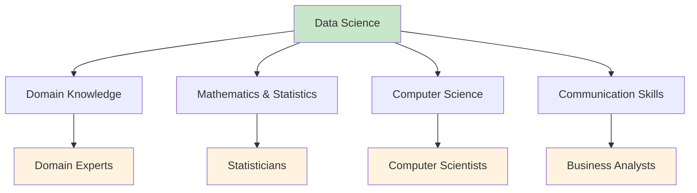
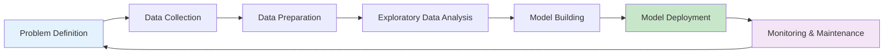

# What is Data Science: The Complete Landscape

Data science is an interdisciplinary field that combines statistical analysis, programming, domain expertise, and business acumen to extract meaningful insights from structured and unstructured data. It's the practice of discovering knowledge and insights from data to support decision-making and drive innovation.

## Table of Contents
1. [Defining Data Science](#defining-data-science)
2. [The Data Science Lifecycle](#the-data-science-lifecycle)
3. [Core Components of Data Science](#core-components-of-data-science)
4. [Data Science vs Related Fields](#data-science-vs-related-fields)
5. [Key Roles in Data Science](#key-roles-in-data-science)
6. [The Data Science Process](#the-data-science-process)
7. [Tools and Technologies](#tools-and-technologies)
8. [Business Applications](#business-applications)
9. [Skills Required](#skills-required)
10. [Future of Data Science](#future-of-data-science)

## Defining Data Science {#defining-data-science}

Data science is the extraction of knowledge from data using scientific methods, processes, algorithms, and systems. It encompasses techniques from statistics, machine learning, data mining, and predictive analytics to understand and analyze real-world phenomena.

### The Data Science Definition Framework



Data science is not just about analyzing data; it's about creating a complete pipeline from data collection to actionable insights:

- **Data Collection**: Gathering relevant information from multiple sources
- **Data Processing**: Cleaning, transforming, and preparing data for analysis
- **Data Analysis**: Applying statistical and machine learning techniques
- **Insight Generation**: Extracting meaningful patterns and relationships
- **Visualization**: Communicating findings effectively
- **Decision Support**: Providing actionable recommendations

## The Data Science Lifecycle {#the-data-science-lifecycle}

The data science lifecycle represents the iterative process of transforming raw data into insights. Understanding this lifecycle is crucial for successful data science projects.

### The 6-Stage Data Science Lifecycle



### 1. Problem Definition
- Define clear, answerable questions
- Identify business objectives and success metrics
- Understand constraints and requirements
- Establish project scope and timeline

### 2. Data Collection
- Identify relevant data sources
- Extract data from databases, APIs, files
- Ensure data quality and completeness
- Document data collection process

### 3. Data Preparation
- Clean and preprocess data
- Handle missing values and outliers
- Transform variables as needed
- Create derived features

### 4. Exploratory Data Analysis (EDA)
- Understand data distributions
- Identify patterns and relationships
- Generate hypotheses for testing
- Visualize key insights

### 5. Model Building
- Select appropriate algorithms
- Train and validate models
- Tune hyperparameters
- Evaluate model performance

### 6. Model Deployment
- Integrate models into production systems
- Monitor model performance
- Update models as needed
- Communicate results to stakeholders

## Core Components of Data Science {#core-components-of-data-science}

### 1. Statistics and Mathematics
Statistics provides the theoretical foundation for data science, enabling us to make inferences and predictions from data.

```python
import numpy as np
import pandas as pd
from scipy import stats

# Example: Statistical analysis of sample data
np.random.seed(42)
sample_data = np.random.normal(loc=100, scale=15, size=1000)

# Descriptive statistics
mean = np.mean(sample_data)
std = np.std(sample_data)
median = np.median(sample_data)

print(f"Sample Statistics:")
print(f"Mean: {mean:.2f}")
print(f"Standard Deviation: {std:.2f}")
print(f"Median: {median:.2f}")

# Hypothesis testing
t_stat, p_value = stats.ttest_1samp(sample_data, popmean=100)
print(f"T-statistic: {t_stat:.4f}")
print(f"P-value: {p_value:.4f}")
```

### 2. Programming and Tools
Programming skills are essential for automating data processing and analysis tasks.

```python
# Example: Data cleaning and preparation pipeline
import pandas as pd

def data_cleaning_pipeline(df):
    """
    Comprehensive data cleaning pipeline
    """
    # Remove duplicates
    df = df.drop_duplicates()
    
    # Handle missing values
    df = df.fillna(df.mean(numeric_only=True))  # Fill numeric with mean
    df = df.fillna(df.mode().iloc[0])  # Fill categorical with mode
    
    # Remove outliers using IQR method
    Q1 = df.select_dtypes(include=[np.number]).quantile(0.25)
    Q3 = df.select_dtypes(include=[np.number]).quantile(0.75)
    IQR = Q3 - Q1
    df = df[~((df.select_dtypes(include=[np.number]) < (Q1 - 1.5 * IQR)) | 
              (df.select_dtypes(include=[np.number]) > (Q3 + 1.5 * IQR))).any(axis=1)]
    
    return df

# Example usage
sample_df = pd.DataFrame({
    'feature1': [1, 2, 3, 4, 5, 100],  # 100 is an outlier
    'feature2': [10, 20, 30, 40, 50, 60],
    'category': ['A', 'B', 'A', 'C', 'B', 'A']
})

cleaned_df = data_cleaning_pipeline(sample_df)
print("Data shape before cleaning:", sample_df.shape)
print("Data shape after cleaning:", cleaned_df.shape)
```

### 3. Domain Knowledge
Understanding the business context is crucial for asking the right questions and interpreting results correctly.

```python
# Example: Domain-specific feature engineering in retail
def retail_features(df):
    """
    Create domain-specific features for retail data
    """
    # Time-based features
    df['day_of_week'] = pd.to_datetime(df['date']).dt.dayofweek
    df['month'] = pd.to_datetime(df['date']).dt.month
    df['quarter'] = pd.to_datetime(df['date']).dt.quarter
    df['is_weekend'] = (pd.to_datetime(df['date']).dt.dayofweek >= 5).astype(int)
    
    # Price-based features
    df['price_category'] = pd.cut(df['price'], bins=[0, 25, 50, 100, float('inf')], 
                                 labels=['Low', 'Medium', 'High', 'Premium'])
    
    # Customer features
    df['customer_spend_segment'] = pd.qcut(df['total_spend'], 
                                          q=4, labels=['Bronze', 'Silver', 'Gold', 'Platinum'])
    
    return df
```

### 4. Communication and Visualization
Effectively communicating insights to stakeholders is as important as generating them.

```python
import matplotlib.pyplot as plt
import seaborn as sns

def visualize_insights(df, target_col, feature_col):
    """
    Create meaningful visualizations
    """
    fig, axes = plt.subplots(2, 2, figsize=(12, 10))
    
    # Scatter plot
    axes[0, 0].scatter(df[feature_col], df[target_col], alpha=0.6)
    axes[0, 0].set_xlabel(feature_col)
    axes[0, 0].set_ylabel(target_col)
    axes[0, 0].set_title(f'{target_col} vs {feature_col}')
    
    # Distribution plot
    sns.histplot(data=df, x=target_col, ax=axes[0, 1])
    axes[0, 1].set_title(f'Distribution of {target_col}')
    
    # Box plot
    sns.boxplot(data=df, y=target_col, ax=axes[1, 0])
    axes[1, 0].set_title(f'Box Plot of {target_col}')
    
    # Correlation heatmap for numeric columns
    numeric_cols = df.select_dtypes(include=[np.number]).columns
    sns.heatmap(df[numeric_cols].corr(), annot=True, cmap='coolwarm', ax=axes[1, 1])
    axes[1, 1].set_title('Correlation Heatmap')
    
    plt.tight_layout()
    plt.show()
```

## Data Science vs Related Fields {#data-science-vs-related-fields}

Understanding how data science differs from and overlaps with related fields is important for career planning and project scoping.

### Data Science vs Data Analytics

| Aspect | Data Science | Data Analytics |
|--------|--------------|----------------|
| **Focus** | Prediction & insight generation | Descriptive analysis & reporting |
| **Tools** | Advanced ML, statistical modeling | SQL, BI tools, basic statistics |
| **Approach** | Hypothesis testing & experimentation | Pattern identification & reporting |
| **Skills** | Programming, ML, deep learning | Statistical analysis, visualization |
| **Output** | Predictive models, algorithms | Reports, dashboards, KPIs |

### Data Science vs Data Engineering

| Aspect | Data Science | Data Engineering |
|--------|--------------|------------------|
| **Focus** | Analysis & modeling | Data pipeline & infrastructure |
| **Tools** | Python, R, Jupyter | Spark, Hadoop, SQL |
| **Approach** | Model development | Data storage & processing |
| **Skills** | Statistics, ML | ETL, architecture, optimization |
| **Output** | Insights & models | Data pipelines & warehouses |

### Data Science vs Machine Learning

| Aspect | Data Science | Machine Learning |
|--------|--------------|------------------|
| **Scope** | End-to-end process | Specific modeling techniques |
| **Focus** | Business insights | Algorithm optimization |
| **Process** | Data → Analysis → Insights | Data → Model → Predictions |
| **Skills** | Multi-disciplinary | Deep technical modeling |
| **Application** | Broad applications | Specific prediction tasks |

## Key Roles in Data Science {#key-roles-in-data-science}

### 1. Data Scientist
- **Responsibilities**: Statistical modeling, ML implementation, insight generation
- **Skills**: Statistics, ML, programming, domain knowledge
- **Tools**: Python, R, SQL, Jupyter, cloud platforms

### 2. Data Analyst
- **Responsibilities**: Data visualization, reporting, business intelligence
- **Skills**: SQL, Excel, visualization tools, statistics
- **Tools**: Tableau, Power BI, SQL, Excel

### 3. Machine Learning Engineer
- **Responsibilities**: Model deployment, MLOps, scaling algorithms
- **Skills**: Software engineering, ML, cloud computing
- **Tools**: Python, TensorFlow, cloud platforms, Docker

### 4. Data Engineer
- **Responsibilities**: Data pipeline development, ETL processes
- **Skills**: Database management, big data tools, programming
- **Tools**: Spark, Kafka, SQL, cloud platforms

### 5. Business Intelligence Analyst
- **Responsibilities**: Dashboard creation, KPI tracking, reporting
- **Skills**: SQL, visualization, business acumen
- **Tools**: Tableau, Power BI, SQL, Excel

## The Data Science Process {#the-data-science-process}

### CRISP-DM Framework
CRISP-DM (Cross-Industry Standard Process for Data Mining) is a widely-used methodology in data science:

1. **Business Understanding**: Understand project objectives and requirements
2. **Data Understanding**: Collect initial data and explore it
3. **Data Preparation**: Create final dataset for modeling
4. **Modeling**: Select and apply modeling techniques
5. **Evaluation**: Evaluate model thoroughly
6. **Deployment**: Plan for model deployment

```python
class DataScienceProject:
    """
    Framework for managing data science projects
    """
    def __init__(self, project_name, business_objective):
        self.project_name = project_name
        self.business_objective = business_objective
        self.steps_completed = []
    
    def business_understanding(self):
        print(f"Project: {self.project_name}")
        print(f"Objective: {self.business_objective}")
        print("Identifying stakeholders and success metrics...")
        self.steps_completed.append("business_understanding")
    
    def data_understanding(self):
        print("Collecting and exploring initial data...")
        print("Understanding data sources and quality...")
        self.steps_completed.append("data_understanding")
    
    def data_preparation(self):
        print("Cleaning data...")
        print("Transforming variables...")
        print("Handling missing values...")
        self.steps_completed.append("data_preparation")
    
    def modeling(self):
        print("Selecting appropriate algorithms...")
        print("Training and validating models...")
        print("Tuning hyperparameters...")
        self.steps_completed.append("modeling")
    
    def evaluation(self):
        print("Evaluating model performance...")
        print("Validating against business objectives...")
        self.steps_completed.append("evaluation")
    
    def deployment(self):
        print("Deploying model to production...")
        print("Setting up monitoring...")
        self.steps_completed.append("deployment")
    
    def execute_crisp_dm(self):
        self.business_understanding()
        self.data_understanding()
        self.data_preparation()
        self.modeling()
        self.evaluation()
        self.deployment()
        print(f"Project {self.project_name} completed!")

# Example usage
project = DataScienceProject(
    project_name="Customer Churn Prediction",
    business_objective="Predict customers likely to churn to improve retention"
)
project.execute_crisp_dm()
```

## Tools and Technologies {#tools-and-technologies}

### Programming Languages
- **Python**: Most popular for data science, extensive libraries
- **R**: Statistical computing and graphics
- **SQL**: Database querying and manipulation
- **Scala/Java**: Big data processing

### Libraries and Frameworks
- **Data Manipulation**: pandas, dplyr
- **Visualization**: matplotlib, seaborn, ggplot2, D3.js
- **ML**: scikit-learn, TensorFlow, PyTorch, caret
- **Big Data**: Spark, Hadoop, Dask

### Platforms and Tools
- **IDEs**: Jupyter, RStudio, VS Code
- **Cloud Platforms**: AWS, Azure, Google Cloud
- **Visualization**: Tableau, Power BI, Looker
- **Version Control**: Git, DVC for data versioning

```python
# Example: Complete data science workflow with key libraries

import pandas as pd
import numpy as np
from sklearn.model_selection import train_test_split
from sklearn.ensemble import RandomForestRegressor
from sklearn.metrics import mean_squared_error, r2_score
import matplotlib.pyplot as plt
import seaborn as sns

def complete_data_science_workflow(data_path):
    """
    Complete data science workflow example
    """
    # 1. Data loading (assuming CSV)
    df = pd.read_csv(data_path)
    
    # 2. Exploratory data analysis
    print("Dataset shape:", df.shape)
    print("Dataset info:")
    print(df.info())
    print("Missing values:")
    print(df.isnull().sum())
    
    # 3. Data preprocessing
    # Handle missing values
    df = df.fillna(df.mean(numeric_only=True))
    
    # Separate features and target
    # This assumes the last column is the target variable
    X = df.iloc[:, :-1]  # All columns except the last
    y = df.iloc[:, -1]   # Last column (target)
    
    # Convert categorical variables to numerical
    X_encoded = pd.get_dummies(X, drop_first=True)
    
    # 4. Split data
    X_train, X_test, y_train, y_test = train_test_split(
        X_encoded, y, test_size=0.2, random_state=42
    )
    
    # 5. Model building
    model = RandomForestRegressor(n_estimators=100, random_state=42)
    model.fit(X_train, y_train)
    
    # 6. Model evaluation
    y_pred = model.predict(X_test)
    mse = mean_squared_error(y_test, y_pred)
    r2 = r2_score(y_test, y_pred)
    
    print(f"Mean Squared Error: {mse:.4f}")
    print(f"R² Score: {r2:.4f}")
    
    # 7. Feature importance
    feature_importance = pd.DataFrame({
        'feature': X_encoded.columns,
        'importance': model.feature_importances_
    }).sort_values('importance', ascending=False)
    
    print("Top 10 Most Important Features:")
    print(feature_importance.head(10))
    
    # 8. Visualization of results
    plt.figure(figsize=(12, 4))
    
    plt.subplot(1, 2, 1)
    plt.scatter(y_test, y_pred, alpha=0.6)
    plt.plot([y_test.min(), y_test.max()], [y_test.min(), y_test.max()], 'r--', lw=2)
    plt.xlabel('Actual')
    plt.ylabel('Predicted')
    plt.title('Actual vs Predicted Values')
    
    plt.subplot(1, 2, 2)
    top_features = feature_importance.head(10)
    plt.barh(top_features['feature'], top_features['importance'])
    plt.xlabel('Feature Importance')
    plt.title('Top 10 Feature Importances')
    
    plt.tight_layout()
    plt.show()
    
    return model, X_test, y_test, y_pred

# This would be used with actual data:
# model, X_test, y_test, y_pred = complete_data_science_workflow('your_data.csv')
```

## Business Applications {#business-applications}

### 1. Marketing & Customer Analytics
- Customer segmentation and targeting
- Churn prediction and retention
- Recommendation systems
- Campaign optimization

### 2. Finance & Risk Management
- Credit scoring and fraud detection
- Algorithmic trading
- Risk assessment
- Portfolio optimization

### 3. Healthcare & Life Sciences
- Patient outcome prediction
- Drug discovery
- Medical imaging analysis
- Epidemiological modeling

### 4. Retail & E-commerce
- Demand forecasting
- Price optimization
- Inventory management
- Personalized recommendations

### 5. Manufacturing & Operations
- Quality control and defect detection
- Predictive maintenance
- Supply chain optimization
- Process improvement

## Skills Required {#skills-required}

### Technical Skills
- **Programming**: Python/R, SQL, Bash
- **Statistics**: Hypothesis testing, probability, distributions
- **Machine Learning**: Supervised/unsupervised learning, model evaluation
- **Data Visualization**: Charts, graphs, dashboards
- **Big Data**: Spark, Hadoop, cloud platforms
- **Software Engineering**: Version control, testing, deployment

### Soft Skills
- **Domain Knowledge**: Understanding of business context
- **Communication**: Explaining complex concepts simply
- **Problem Solving**: Breaking down complex problems
- **Critical Thinking**: Evaluating approaches and results
- **Project Management**: Managing time and resources

```python
# Example: Assessing data science skills
def assess_data_science_skills():
    """
    Self-assessment framework for data science skills
    """
    skills = {
        "Programming": 0,
        "Statistics": 0,
        "Machine_Learning": 0,
        "Visualization": 0,
        "Big_Data": 0,
        "Software_Engineering": 0,
        "Domain_Knowledge": 0,
        "Communication": 0
    }
    
    print("Rate your proficiency in each area (1-5):")
    for skill in skills.keys():
        rating = input(f"{skill}: ")
        try:
            skills[skill] = int(rating)
        except ValueError:
            print("Please enter a number between 1-5")
            continue
    
    # Calculate overall score
    total_score = sum(skills.values())
    average_score = total_score / len(skills)
    
    print(f"\nYour data science skill assessment:")
    print(f"Total Score: {total_score}/40")
    print(f"Average Score: {average_score:.2f}/5")
    
    # Identify areas for improvement
    weak_areas = [skill for skill, score in skills.items() if score < 3]
    if weak_areas:
        print(f"Areas to focus on: {', '.join(weak_areas)}")
    
    return skills

# Uncomment to run assessment
# assessment = assess_data_science_skills()
```

## Future of Data Science {#future-of-data-science}

### Emerging Trends
- **AutoML**: Automated machine learning
- **MLOps**: Machine learning operations
- **Explainable AI**: Understanding model decisions
- **Edge Computing**: Processing data closer to source
- **Ethical AI**: Fairness and bias mitigation

### Challenges and Opportunities
- **Data Privacy**: GDPR, CCPA compliance
- **Real-time Analytics**: Streaming data processing
- **Multi-modal Data**: Text, image, audio integration
- **Quantum Computing**: New computational possibilities

## Conclusion {#conclusion}

Data science is a rapidly evolving field that combines technical skills with domain expertise to extract insights from data. Key takeaways include:

### Core Understanding:
- Data science is interdisciplinary, requiring multiple skill sets
- The process follows a structured lifecycle from problem definition to deployment
- Communication and visualization are as important as technical skills

### Career Pathways:
- Multiple roles with different specializations
- Continuous learning is essential due to rapid evolution
- Domain expertise enhances technical capabilities

### Future Outlook:
- Increasing automation through AutoML
- Growing importance of ethical considerations
- Integration with business operations becoming more critical

**🎯 Next Steps**: With this foundational understanding of data science, you're ready to explore the essential tools and technologies that form the backbone of the data science ecosystem.

The field continues to evolve, with new techniques, tools, and applications emerging regularly. Success in data science requires a combination of technical skills, domain knowledge, and the ability to communicate insights effectively to stakeholders.

---

*Next in series: [Data Science Tools](/blog/data-science/introduction/data-science-tools) | Previous: None*