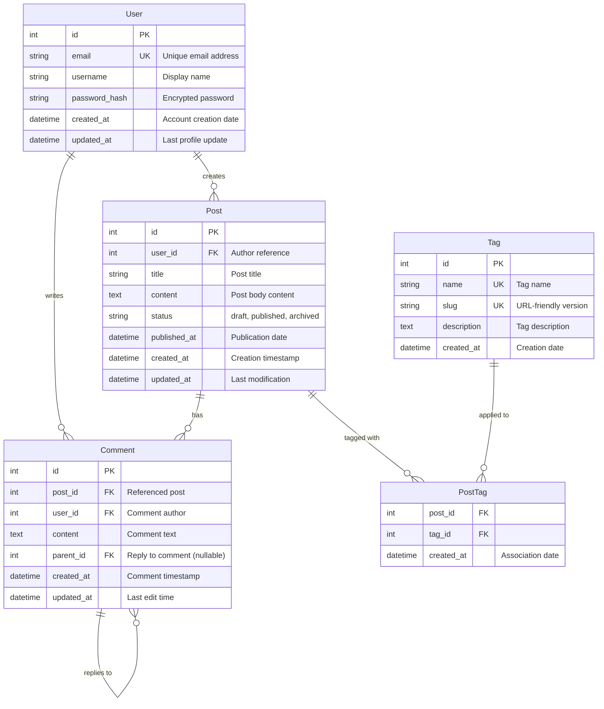
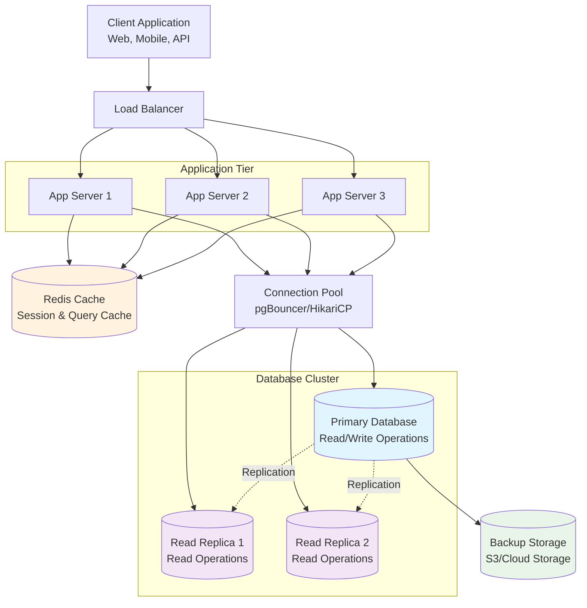

# Understanding Database Design Patterns

Database design is crucial for building scalable and maintainable applications. Let's explore some fundamental patterns and best practices.

## Entity Relationship Modeling

A well-designed database starts with proper entity relationships. The following diagram shows a typical blog application structure:



This ER diagram illustrates several key relationships:
- **One-to-Many**: Users create multiple posts, posts have multiple comments
- **Many-to-Many**: Posts can have multiple tags, tags can be applied to multiple posts
- **Self-Referencing**: Comments can reply to other comments (threaded discussions)

## Common Design Patterns

### 1. One-to-Many Relationships

The most common relationship type:

```sql
-- Users table
CREATE TABLE users (
    id SERIAL PRIMARY KEY,
    email VARCHAR(255) UNIQUE NOT NULL,
    username VARCHAR(50) NOT NULL,
    created_at TIMESTAMP DEFAULT CURRENT_TIMESTAMP
);

-- Posts table (belongs to user)
CREATE TABLE posts (
    id SERIAL PRIMARY KEY,
    user_id INTEGER REFERENCES users(id),
    title VARCHAR(255) NOT NULL,
    content TEXT,
    published_at TIMESTAMP
);
```

### 2. Many-to-Many Relationships

For complex associations, use junction tables:

```sql
-- Tags table
CREATE TABLE tags (
    id SERIAL PRIMARY KEY,
    name VARCHAR(50) UNIQUE NOT NULL
);

-- Junction table for posts and tags
CREATE TABLE post_tags (
    post_id INTEGER REFERENCES posts(id),
    tag_id INTEGER REFERENCES tags(id),
    PRIMARY KEY (post_id, tag_id)
);
```

## Database Architecture Flow

Here's how data flows in a modern scalable web application:



**Key Components:**
- **Load Balancer**: Distributes traffic across multiple app servers
- **Connection Pool**: Manages database connections efficiently
- **Primary Database**: Handles all write operations and critical reads
- **Read Replicas**: Scale read operations and reduce primary load
- **Cache Layer**: Stores frequently accessed data for faster response times

## Normalization Guidelines

### First Normal Form (1NF)
- Each column contains atomic values
- No repeating groups

### Second Normal Form (2NF)  
- Must be in 1NF
- No partial dependencies on composite keys

### Third Normal Form (3NF)
- Must be in 2NF
- No transitive dependencies

## Indexing Strategy

```sql
-- Primary key index (automatic)
-- Unique constraint index (automatic)

-- Query optimization indexes
CREATE INDEX idx_posts_user_id ON posts(user_id);
CREATE INDEX idx_posts_published_at ON posts(published_at);

-- Composite index for common query patterns
CREATE INDEX idx_posts_user_published ON posts(user_id, published_at);
```

## Performance Considerations

- **Use appropriate data types**: `INT` vs `BIGINT`, `VARCHAR` vs `TEXT`
- **Index strategically**: Don't over-index, impacts write performance  
- **Denormalize when necessary**: For read-heavy workloads
- **Partition large tables**: By date, region, or other logical divisions

## Best Practices

1. **Follow naming conventions**: Consistent, descriptive names
2. **Use constraints**: Ensure data integrity at the database level
3. **Plan for growth**: Consider future scalability needs
4. **Document relationships**: Maintain clear documentation
5. **Regular maintenance**: Monitor performance and optimize queries

Well-designed databases form the foundation of reliable, scalable applications. Take time to plan your schema carefully!