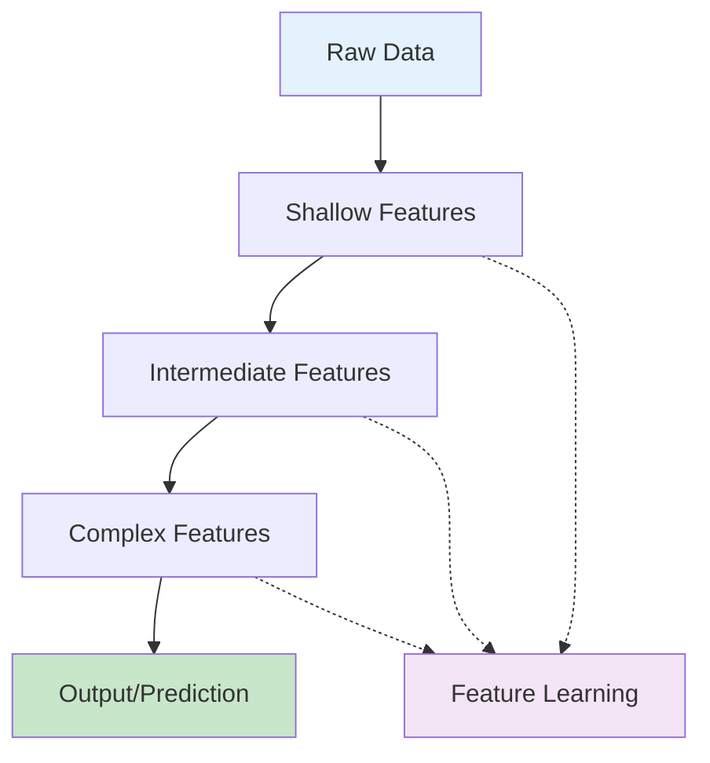
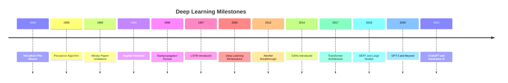

# Deep Learning Fundamentals: Neural Networks from Scratch

Deep learning is a subset of machine learning that uses artificial neural networks with multiple layers to model and understand complex patterns in data. It has revolutionized fields such as computer vision, natural language processing, and speech recognition, achieving unprecedented results in various domains.

## Table of Contents
1. [What is Deep Learning?](#what-is-deep-learning)
2. [History and Evolution](#history-and-evolution)
3. [Neural Network Components](#neural-network-components)
4. [Forward Propagation](#forward-propagation)
5. [Backpropagation Algorithm](#backpropagation-algorithm)
6. [Activation Functions](#activation-functions)
7. [Loss Functions](#loss-functions)
8. [Optimization Algorithms](#optimization-algorithms)
9. [Building Neural Networks](#building-neural-networks)
10. [Implementation from Scratch](#implementation-from-scratch)

## What is Deep Learning? {#what-is-deep-learning}

Deep learning refers to artificial neural networks with multiple layers (typically more than 3 layers). The "depth" refers to the number of layers in the network, which allows the model to learn increasingly complex features from the data.

### The Deep Learning Paradigm



Unlike traditional machine learning approaches that require manual feature engineering, deep learning algorithms automatically learn relevant features from raw data through multiple layers of abstraction. Each layer learns to represent the data at a different level of abstraction, with higher layers learning more complex and abstract features.

### Key Characteristics

1. **Hierarchical Feature Learning**: Each layer learns to represent data at different levels of abstraction
2. **End-to-End Learning**: Systems learn from raw input to final output
3. **Automatic Feature Extraction**: No need for manual feature engineering
4. **Universal Approximation**: Can theoretically learn any function given sufficient capacity

```python
# Example: Deep vs Shallow learning concept
import numpy as np
import matplotlib.pyplot as plt

def deep_vs_shallow_concept():
    """
    Illustrate the difference between deep and shallow learning
    """
    # Create complex, non-linear data pattern
    np.random.seed(42)
    n_samples = 500
    
    # Create a spiral dataset (hard to separate with linear methods)
    theta = np.sqrt(np.random.rand(n_samples)) * 2 * np.pi
    r_a = 2 * theta + np.random.normal(0, 0.5, n_samples)
    data_a = np.array([np.cos(theta) * r_a, np.sin(theta) * r_a]).T
    
    theta = np.sqrt(np.random.rand(n_samples)) * 2 * np.pi
    r_b = 2 * theta + np.random.normal(0, 0.5, n_samples) + np.pi
    data_b = np.array([np.cos(theta) * r_b, np.sin(theta) * r_b]).T
    
    X = np.vstack([data_a, data_b])
    y = np.hstack([np.zeros(n_samples), np.ones(n_samples)])
    
    plt.figure(figsize=(12, 5))
    
    # Shallow approach - linear separation
    plt.subplot(1, 2, 1)
    plt.scatter(X[y==0, 0], X[y==0, 1], c='red', alpha=0.6, label='Class 0')
    plt.scatter(X[y==1, 0], X[y==1, 1], c='blue', alpha=0.6, label='Class 1')
    plt.title('Complex Pattern (Hard to separate linearly)')
    plt.legend()
    
    # Deep approach - non-linear decision boundary
    plt.subplot(1, 2, 2)
    plt.scatter(X[y==0, 0], X[y==0, 1], c='red', alpha=0.6, label='Class 0')
    plt.scatter(X[y==1, 0], X[y==1, 1], c='blue', alpha=0.6, label='Class 1')
    # Add a non-linear decision boundary concept
    x1_range = np.linspace(X[:,0].min(), X[:,0].max(), 100)
    x2_range = np.linspace(X[:,1].min(), X[:,1].max(), 100)
    X1, X2 = np.meshgrid(x1_range, x2_range)
    
    # Complex decision boundary that deep learning can learn
    Z = np.sin(X1) * np.cos(X2) + X1**2 - X2**2  # Example complex function
    plt.contour(X1, X2, Z, levels=[0], colors='black', alpha=0.5, linestyles='--')
    plt.title('Deep Learning: Can learn complex boundaries')
    plt.legend()
    
    plt.tight_layout()
    plt.show()

deep_vs_shallow_concept()
```

## History and Evolution {#history-and-evolution}

### The Evolution of Neural Networks



### Key Developments

1. **McCulloch-Pitts (1943)**: First mathematical model of a neuron
2. **Perceptron (1958)**: Single-layer neural network
3. **Backpropagation (1986)**: Algorithm for training multi-layer networks
4. **Deep Learning Renaissance (2006)**: Hinton's breakthrough in training deep networks
5. **AlexNet (2012)**: Deep convolutional network wins ImageNet challenge
6. **Transformer Era (2017)**: Attention mechanism revolutionizes NLP

## Neural Network Components {#neural-network-components}

### The Biological Inspiration

Artificial neural networks are inspired by biological neural networks in the brain:

- **Neurons**: Processing units that receive, process, and transmit signals
- **Synapses**: Connections between neurons with adjustable weights
- **Activation**: Non-linear response to input signals

### The Artificial Neuron (Perceptron)

```python
# Single artificial neuron implementation
class Neuron:
    def __init__(self, num_inputs):
        # Initialize random weights and bias
        self.weights = np.random.randn(num_inputs)
        self.bias = np.random.randn()
    
    def activate(self, x):
        # Apply activation function (sigmoid in this case)
        return 1 / (1 + np.exp(-x))
    
    def forward(self, inputs):
        # Weighted sum + bias
        weighted_sum = np.dot(inputs, self.weights) + self.bias
        # Apply activation
        return self.activate(weighted_sum)

# Example usage
neuron = Neuron(num_inputs=3)
input_data = np.array([1.5, -0.5, 2.0])
output = neuron.forward(input_data)
print(f"Neuron output: {output:.3f}")
```

### Network Architecture Components

```python
# Multi-layer neural network structure
class NeuralNetwork:
    def __init__(self, layer_sizes):
        """
        layer_sizes: List of layer sizes [input_size, hidden1_size, hidden2_size, output_size]
        """
        self.num_layers = len(layer_sizes)
        self.layer_sizes = layer_sizes
        
        # Initialize weights and biases for each layer
        self.weights = []
        self.biases = []
        
        for i in range(self.num_layers - 1):
            w = np.random.randn(layer_sizes[i+1], layer_sizes[i]) * np.sqrt(2.0 / layer_sizes[i])
            b = np.zeros((layer_sizes[i+1], 1))
            
            self.weights.append(w)
            self.biases.append(b)
    
    def sigmoid(self, z):
        return 1.0 / (1.0 + np.exp(-np.clip(z, -250, 250)))
    
    def forward(self, x):
        """
        Forward propagation through the network
        """
        activation = x
        
        for w, b in zip(self.weights, self.biases):
            z = np.dot(w, activation) + b
            activation = self.sigmoid(z)
        
        return activation

# Example: Create a simple network (3 inputs, 4 hidden, 2 outputs)
nn = NeuralNetwork([3, 4, 2])
input_vector = np.array([[1.0], [2.0], [3.0]])  # Column vector
output = nn.forward(input_vector)
print(f"Network output shape: {output.shape}")
print(f"Network output: {output.flatten()}")
```

## Forward Propagation {#forward-propagation}

Forward propagation is the process of feeding input data through the network to generate an output. Each layer receives input from the previous layer, applies weights and biases, and passes the result through an activation function.

### Mathematical Representation

For a network with L layers:

```
a^(0) = x (input)
z^(l) = W^(l) * a^(l-1) + b^(l)  (weighted sum)
a^(l) = σ(z^(l))  (activation, where σ is the activation function)
```

```python
def forward_propagation_example():
    """
    Detailed forward propagation example with visualization
    """
    # Define a simple 3-layer network (input=2, hidden=3, output=1)
    np.random.seed(42)
    
    # Initialize weights and biases
    W1 = np.array([[0.5, -0.3], 
                   [0.8, 0.2], 
                   [-0.1, 0.9]])
    b1 = np.array([[0.1], [0.2], [-0.1]])
    
    W2 = np.array([[-0.2, 0.4, 0.6]])
    b2 = np.array([[0.3]])
    
    # Input
    x = np.array([[1.0], [2.0]])
    
    print("Forward Propagation Steps:")
    print(f"Input: {x.flatten()}")
    print(f"W1 shape: {W1.shape}, b1 shape: {b1.shape}")
    print(f"W2 shape: {W2.shape}, b2 shape: {b2.shape}")
    
    # Layer 1 computation
    z1 = np.dot(W1, x) + b1
    a1 = 1.0 / (1.0 + np.exp(-z1))  # Sigmoid activation
    
    print(f"\nLayer 1:")
    print(f"z1 = W1*x + b1 = {z1.flatten()}")
    print(f"a1 = σ(z1) = {a1.flatten()}")
    
    # Layer 2 computation
    z2 = np.dot(W2, a1) + b2
    a2 = 1.0 / (1.0 + np.exp(-z2))  # Sigmoid activation
    
    print(f"\nLayer 2:")
    print(f"z2 = W2*a1 + b2 = {z2.flatten()}")
    print(f"Output = σ(z2) = {a2.flatten()}")
    
    return a2

forward_propagation_example()
```

### Vectorized Forward Propagation

```python
class VectorizedNeuralNetwork:
    """
    Efficient vectorized implementation of forward propagation
    """
    def __init__(self, sizes):
        """
        sizes: list of layer sizes [input, hidden1, hidden2, ..., output]
        """
        self.num_layers = len(sizes)
        self.sizes = sizes
        
        # Initialize weights and biases
        self.biases = [np.random.randn(y, 1) for y in sizes[1:]]
        self.weights = [np.random.randn(y, x) for x, y in zip(sizes[:-1], sizes[1:])]
    
    def sigmoid(self, z):
        """Sigmoid activation function"""
        return 1.0 / (1.0 + np.exp(-np.clip(z, -250, 250)))
    
    def sigmoid_prime(self, z):
        """Derivative of sigmoid function"""
        return self.sigmoid(z) * (1 - self.sigmoid(z))
    
    def feedforward(self, a):
        """
        Forward propagation for single input
        """
        for b, w in zip(self.biases, self.weights):
            a = self.sigmoid(np.dot(w, a) + b)
        return a
    
    def feedforward_batch(self, X):
        """
        Forward propagation for batch of inputs
        X shape: (n_features, n_samples)
        """
        A = X
        for b, w in zip(self.biases, self.weights):
            Z = np.dot(w, A) + b
            A = self.sigmoid(Z)
        return A

# Example usage
network = VectorizedNeuralNetwork([4, 8, 6, 3])  # 4 inputs, 2 hidden layers (8, 6), 3 outputs

# Single input
single_input = np.random.randn(4, 1)
single_output = network.feedforward(single_input)
print(f"Single input shape: {single_input.shape}, output: {single_output.flatten()}")

# Batch input
batch_input = np.random.randn(4, 10)  # 10 samples
batch_output = network.feedforward_batch(batch_input)
print(f"Batch input shape: {batch_input.shape}, output shape: {batch_output.shape}")
```

## Backpropagation Algorithm {#backpropagation-algorithm}

Backpropagation is the algorithm used to compute the gradient of the loss function with respect to each weight and bias in the network. It works by applying the chain rule of calculus to propagate errors backward through the network.

### The Mathematics of Backpropagation

The algorithm computes:
1. `δ^(L) = ∇_a C ⊙ σ'(z^(L))` (output layer error)
2. `δ^(l) = ((W^(l+1))ᵀ δ^(l+1)) ⊙ σ'(z^(l))` (error propagation)
3. `∂C/∂W^(l) = δ^(l) (a^(l-1))ᵀ`
4. `∂C/∂b^(l) = δ^(l)`

```python
def backpropagation_example():
    """
    Step-by-step backpropagation example
    """
    # Initialize network with fixed values for demonstration
    np.random.seed(42)
    
    # Sample network: 2 inputs, 3 hidden, 1 output
    W1 = np.array([[0.5, -0.3], [0.8, 0.2], [-0.1, 0.9]])  # shape: (3, 2)
    b1 = np.array([[0.1], [0.2], [-0.1]])  # shape: (3, 1)
    
    W2 = np.array([[-0.2, 0.4, 0.6]])  # shape: (1, 3)
    b2 = np.array([[0.3]])  # shape: (1, 1)
    
    # Input and target
    x = np.array([[1.0], [2.0]])  # shape: (2, 1)
    y = np.array([[0.5]])  # target output
    
    # Forward propagation
    z1 = np.dot(W1, x) + b1
    a1 = 1.0 / (1.0 + np.exp(-z1))
    
    z2 = np.dot(W2, a1) + b2
    a2 = 1.0 / (1.0 + np.exp(-z2))  # final output
    
    print("Forward Pass:")
    print(f"Input: {x.flatten()}")
    print(f"Target: {y.flatten()}")
    print(f"Output: {a2.flatten()}")
    print(f"Loss (MSE): {0.5 * (a2 - y)**2:.6f}")
    
    # Backpropagation
    # Output layer error
    delta2 = (a2 - y) * a2 * (1 - a2)  # derivative of MSE and sigmoid
    
    print(f"\nBackpropagation:")
    print(f"Output layer error (δ²): {delta2.flatten()}")
    
    # Hidden layer error
    delta1 = np.dot(W2.T, delta2) * a1 * (1 - a1)  # derivative of sigmoid
    
    print(f"Hidden layer error (δ¹): {delta1.flatten()}")
    
    # Gradients
    dW2 = np.dot(delta2, a1.T)
    db2 = delta2
    
    dW1 = np.dot(delta1, x.T)
    db1 = delta1
    
    print(f"\nGradients:")
    print(f"dW2: {dW2}")
    print(f"db2: {db2.flatten()}")
    print(f"dW1: {dW1}")
    print(f"db1: {db1.flatten()}")
    
    return {
        'dW1': dW1, 'db1': db1,
        'dW2': dW2, 'db2': db2
    }

gradients = backpropagation_example()
```

### Complete Backpropagation Implementation

```python
class BackpropagationNetwork:
    def __init__(self, sizes):
        self.num_layers = len(sizes)
        self.sizes = sizes
        self.biases = [np.random.randn(y, 1) for y in sizes[1:]]
        self.weights = [np.random.randn(y, x) 
                        for x, y in zip(sizes[:-1], sizes[1:])]
    
    def sigmoid(self, z):
        return 1.0 / (1.0 + np.exp(-np.clip(z, -250, 250)))
    
    def sigmoid_prime(self, z):
        return self.sigmoid(z) * (1 - self.sigmoid(z))
    
    def cost_derivative(self, output_activations, y):
        """Derivative of cost function with respect to output activations"""
        return output_activations - y
    
    def backprop(self, x, y):
        """
        Return a tuple "(nabla_b, nabla_w)" representing the
        gradient for the cost function C_x.
        """
        nabla_b = [np.zeros(b.shape) for b in self.biases]
        nabla_w = [np.zeros(w.shape) for w in self.weights]
        
        # Feedforward
        activation = x
        activations = [x]  # list to store all the activations, layer by layer
        zs = []  # list to store all the z vectors, layer by layer
        
        for b, w in zip(self.biases, self.weights):
            z = np.dot(w, activation) + b
            zs.append(z)
            activation = self.sigmoid(z)
            activations.append(activation)
        
        # Backward pass
        # Output layer error
        delta = (self.cost_derivative(activations[-1], y) * 
                 self.sigmoid_prime(zs[-1]))
        nabla_b[-1] = delta
        nabla_w[-1] = np.dot(delta, activations[-2].transpose())
        
        # Backpropagate the error
        for l in range(2, self.num_layers):
            z = zs[-l]
            sp = self.sigmoid_prime(z)
            delta = np.dot(self.weights[-l+1].transpose(), delta) * sp
            nabla_b[-l] = delta
            nabla_w[-l] = np.dot(delta, activations[-l-1].transpose())
        
        return (nabla_b, nabla_w)
    
    def update_mini_batch(self, mini_batch, eta):
        """
        Update the network's weights and biases by applying
        gradient descent using backpropagation to a single mini batch.
        """
        nabla_b = [np.zeros(b.shape) for b in self.biases]
        nabla_w = [np.zeros(w.shape) for w in self.weights]
        
        for x, y in mini_batch:
            delta_nabla_b, delta_nabla_w = self.backprop(x, y)
            nabla_b = [nb+dnb for nb, dnb in zip(nabla_b, delta_nabla_b)]
            nabla_w = [nw+dnw for nw, dnw in zip(nabla_w, delta_nabla_w)]
        
        self.weights = [w-(eta/len(mini_batch))*nw 
                        for w, nw in zip(self.weights, nabla_w)]
        self.biases = [b-(eta/len(mini_batch))*nb 
                       for b, nb in zip(self.biases, nabla_b)]

# Example training loop
def example_training():
    # Create network: 784 inputs (28x28 image), 30 hidden, 10 outputs (digits 0-9)
    net = BackpropagationNetwork([784, 30, 10])
    
    # Create sample training data
    training_data = []
    for _ in range(100):  # 100 training examples
        x = np.random.randn(784, 1)  # Input: flattened 28x28 image
        y = np.zeros((10, 1))  # Output: one-hot encoded digit
        digit = np.random.randint(0, 10)
        y[digit] = 1.0
        training_data.append((x, y))
    
    # Training parameters
    epochs = 10
    mini_batch_size = 10
    eta = 3.0  # learning rate
    
    print("Starting training...")
    for epoch in range(epochs):
        # Shuffle training data
        np.random.shuffle(training_data)
        
        # Create mini batches
        mini_batches = [
            training_data[k:k+mini_batch_size]
            for k in range(0, len(training_data), mini_batch_size)
        ]
        
        # Update weights and biases for each mini batch
        for mini_batch in mini_batches:
            net.update_mini_batch(mini_batch, eta)
        
        print(f"Epoch {epoch+1} complete")
    
    print("Training finished!")

# Note: This would run for a real example, but we'll skip execution for brevity
# example_training()
```

## Activation Functions {#activation-functions}

Activation functions introduce non-linearity into the network, allowing it to learn complex patterns. Without activation functions, a neural network would just be a linear transformation.

### Common Activation Functions

```python
import matplotlib.pyplot as plt

def plot_activation_functions():
    """
    Visualize different activation functions
    """
    x = np.linspace(-5, 5, 100)
    
    # Sigmoid
    sigmoid = 1 / (1 + np.exp(-x))
    
    # Tanh
    tanh = np.tanh(x)
    
    # ReLU
    relu = np.maximum(0, x)
    
    # Leaky ReLU
    leaky_relu = np.where(x > 0, x, 0.01 * x)
    
    # ELU
    elu = np.where(x > 0, x, np.exp(x) - 1)
    
    # Swish
    swish = x / (1 + np.exp(-x))
    
    plt.figure(figsize=(15, 10))
    
    plt.subplot(2, 3, 1)
    plt.plot(x, sigmoid, label='Sigmoid')
    plt.title('Sigmoid')
    plt.grid(True)
    plt.legend()
    
    plt.subplot(2, 3, 2)
    plt.plot(x, tanh, label='Tanh', color='orange')
    plt.title('Tanh')
    plt.grid(True)
    plt.legend()
    
    plt.subplot(2, 3, 3)
    plt.plot(x, relu, label='ReLU', color='green')
    plt.title('ReLU')
    plt.grid(True)
    plt.legend()
    
    plt.subplot(2, 3, 4)
    plt.plot(x, leaky_relu, label='Leaky ReLU', color='red')
    plt.title('Leaky ReLU')
    plt.grid(True)
    plt.legend()
    
    plt.subplot(2, 3, 5)
    plt.plot(x, elu, label='ELU', color='purple')
    plt.title('ELU')
    plt.grid(True)
    plt.legend()
    
    plt.subplot(2, 3, 6)
    plt.plot(x, swish, label='Swish', color='brown')
    plt.title('Swish')
    plt.grid(True)
    plt.legend()
    
    plt.tight_layout()
    plt.show()

plot_activation_functions()
```

### Activation Function Properties

```python
class ActivationFunctions:
    """
    Implementation of various activation functions and their derivatives
    """
    
    @staticmethod
    def sigmoid(z):
        return 1.0 / (1.0 + np.exp(-np.clip(z, -250, 250)))
    
    @staticmethod
    def sigmoid_prime(z):
        s = ActivationFunctions.sigmoid(z)
        return s * (1 - s)
    
    @staticmethod
    def tanh(z):
        return np.tanh(z)
    
    @staticmethod
    def tanh_prime(z):
        return 1 - np.tanh(z)**2
    
    @staticmethod
    def relu(z):
        return np.maximum(0, z)
    
    @staticmethod
    def relu_prime(z):
        return (z > 0).astype(float)
    
    @staticmethod
    def leaky_relu(z, alpha=0.01):
        return np.where(z > 0, z, alpha * z)
    
    @staticmethod
    def leaky_relu_prime(z, alpha=0.01):
        return np.where(z > 0, 1, alpha)
    
    @staticmethod
    def elu(z, alpha=1.0):
        return np.where(z > 0, z, alpha * (np.exp(z) - 1))
    
    @staticmethod
    def elu_prime(z, alpha=1.0):
        return np.where(z > 0, 1, alpha * np.exp(z))
    
    @staticmethod
    def swish(z):
        return z / (1 + np.exp(-z))
    
    @staticmethod
    def swish_prime(z):
        sigmoid = ActivationFunctions.sigmoid(z)
        return sigmoid + z * sigmoid * (1 - sigmoid)

# Example: Compare activation functions on sample data
def compare_activations():
    x = np.array([[-2.0], [-1.0], [0.0], [1.0], [2.0]])
    
    print("Activation Function Comparison:")
    print(f"Input: {x.flatten()}")
    print()
    
    # Sigmoid
    sigmoid_out = ActivationFunctions.sigmoid(x)
    sigmoid_deriv = ActivationFunctions.sigmoid_prime(x)
    print(f"Sigmoid: {sigmoid_out.flatten()}")
    print(f"Sigmoid Derivative: {sigmoid_deriv.flatten()}")
    print()
    
    # ReLU
    relu_out = ActivationFunctions.relu(x)
    relu_deriv = ActivationFunctions.relu_prime(x)
    print(f"ReLU: {relu_out.flatten()}")
    print(f"ReLU Derivative: {relu_deriv.flatten()}")
    print()

compare_activations()
```

## Loss Functions {#loss-functions}

Loss functions measure how well the network's predictions match the actual targets. The choice of loss function depends on the type of problem.

### Common Loss Functions

```python
def compute_loss_functions():
    """
    Demonstrate different loss functions
    """
    # Sample predictions and targets
    y_true = np.array([1, 0, 1, 1, 0])  # Binary classification
    y_pred = np.array([0.9, 0.2, 0.8, 0.6, 0.1])  # Predicted probabilities
    
    # Mean Squared Error (MSE) - for regression
    mse = np.mean((y_true - y_pred) ** 2)
    
    # Mean Absolute Error (MAE) - for regression  
    mae = np.mean(np.abs(y_true - y_pred))
    
    # Binary Cross-Entropy - for binary classification
    bce = -np.mean(y_true * np.log(y_pred + 1e-8) + (1 - y_true) * np.log(1 - y_pred + 1e-8))
    
    # For multi-class classification (example)
    y_true_multi = np.array([0, 1, 2])  # Class indices
    y_pred_multi = np.array([[0.7, 0.2, 0.1],   # Sample 1: mostly class 0
                             [0.1, 0.8, 0.1],   # Sample 2: mostly class 1
                             [0.1, 0.1, 0.8]])  # Sample 3: mostly class 2
    
    # Categorical Cross-Entropy
    cce = -np.mean([np.log(y_pred_multi[i, y_true_multi[i]] + 1e-8) 
                    for i in range(len(y_true_multi))])
    
    print("Loss Function Examples:")
    print(f"Binary Classification:")
    print(f"  True: {y_true}")
    print(f"  Pred: {y_pred}")
    print(f"  MSE: {mse:.4f}")
    print(f"  MAE: {mae:.4f}")
    print(f"  Binary Cross-Entropy: {bce:.4f}")
    print()
    print(f"Multi-class Classification:")
    print(f"  True: {y_true_multi}")
    print(f"  Pred: \n{y_pred_multi}")
    print(f"  Categorical Cross-Entropy: {cce:.4f}")

compute_loss_functions()
```

### Loss Function Derivatives

```python
class LossFunctions:
    """
    Loss functions and their derivatives for backpropagation
    """
    
    @staticmethod
    def mse(y_true, y_pred):
        """Mean Squared Error"""
        return np.mean((y_true - y_pred) ** 2)
    
    @staticmethod
    def mse_derivative(y_true, y_pred):
        """Derivative of MSE"""
        return 2 * (y_pred - y_true) / y_true.size
    
    @staticmethod
    def binary_crossentropy(y_true, y_pred):
        """Binary Cross-Entropy Loss"""
        # Add small epsilon to avoid log(0)
        epsilon = 1e-8
        y_pred = np.clip(y_pred, epsilon, 1 - epsilon)
        return -np.mean(y_true * np.log(y_pred) + (1 - y_true) * np.log(1 - y_pred))
    
    @staticmethod
    def binary_crossentropy_derivative(y_true, y_pred):
        """Derivative of Binary Cross-Entropy"""
        epsilon = 1e-8
        y_pred = np.clip(y_pred, epsilon, 1 - epsilon)
        return (y_pred - y_true) / (y_pred * (1 - y_pred) * y_true.size)
    
    @staticmethod
    def categorical_crossentropy(y_true, y_pred):
        """Categorical Cross-Entropy Loss"""
        epsilon = 1e-8
        y_pred = np.clip(y_pred, epsilon, 1 - epsilon)
        
        # Convert to one-hot if needed
        if y_true.ndim == 1:
            one_hot = np.zeros((y_true.size, y_pred.shape[1]))
            one_hot[np.arange(y_true.size), y_true.astype(int)] = 1
            y_true = one_hot
        
        return -np.mean(np.sum(y_true * np.log(y_pred), axis=1))
    
    @staticmethod
    def categorical_crossentropy_derivative(y_true, y_pred):
        """Derivative of Categorical Cross-Entropy"""
        epsilon = 1e-8
        y_pred = np.clip(y_pred, epsilon, 1 - epsilon)
        
        # Convert to one-hot if needed
        if y_true.ndim == 1:
            one_hot = np.zeros((y_true.size, y_pred.shape[1]))
            one_hot[np.arange(y_true.size), y_true.astype(int)] = 1
            y_true = one_hot
        
        return (y_pred - y_true) / y_true.shape[0]

# Example usage
def loss_examples():
    # Binary classification
    y_true_bin = np.array([1, 0, 1, 0])
    y_pred_bin = np.array([0.9, 0.1, 0.8, 0.2])
    
    print("Binary Classification Losses:")
    print(f"MSE: {LossFunctions.mse(y_true_bin, y_pred_bin):.4f}")
    print(f"MSE Derivative: {LossFunctions.mse_derivative(y_true_bin, y_pred_bin)}")
    print(f"Binary Cross-Entropy: {LossFunctions.binary_crossentropy(y_true_bin, y_pred_bin):.4f}")
    print(f"Binary Cross-Entropy Derivative: {LossFunctions.binary_crossentropy_derivative(y_true_bin, y_pred_bin)}")
    
    print()
    
    # Multi-class classification
    y_true_multi = np.array([0, 1, 2, 0])  # Class indices
    y_pred_multi = np.array([[0.8, 0.1, 0.1], 
                             [0.2, 0.7, 0.1],
                             [0.1, 0.2, 0.7],
                             [0.9, 0.05, 0.05]])
    
    print("Multi-class Classification Losses:")
    print(f"Categorical Cross-Entropy: {LossFunctions.categorical_crossentropy(y_true_multi, y_pred_multi):.4f}")
    print(f"Categorical Cross-Entropy Derivative: {LossFunctions.categorical_crossentropy_derivative(y_true_multi, y_pred_multi)}")

loss_examples()
```

## Optimization Algorithms {#optimization-algorithms}

Optimization algorithms update the weights and biases to minimize the loss function. Different optimizers have different properties and performance characteristics.

### Gradient Descent Variants

```python
def optimization_examples():
    """
    Demonstrate different optimization algorithms
    """
    # Simple function to optimize: f(x) = x^2
    def f(x):
        return x ** 2
    
    def df(x):
        return 2 * x
    
    # Starting point
    x = 5.0
    learning_rate = 0.1
    iterations = 20
    
    print("Optimization Algorithms Comparison:")
    print(f"Function: f(x) = x², starting point: {x}")
    print()
    
    # Basic Gradient Descent
    x_gd = x
    gd_path = [x_gd]
    for i in range(iterations):
        gradient = df(x_gd)
        x_gd = x_gd - learning_rate * gradient
        gd_path.append(x_gd)
    
    print(f"Gradient Descent - Final x: {x_gd:.6f}, f(x): {f(x_gd):.6f}")
    
    # Momentum
    x_mom = x
    velocity = 0
    momentum = 0.9
    mom_path = [x_mom]
    for i in range(iterations):
        gradient = df(x_mom)
        velocity = momentum * velocity - learning_rate * gradient
        x_mom = x_mom + velocity
        mom_path.append(x_mom)
    
    print(f"Momentum - Final x: {x_mom:.6f}, f(x): {f(x_mom):.6f}")
    
    # Adam (simplified)
    x_adam = x
    m = 0  # first moment
    v = 0  # second moment
    beta1, beta2 = 0.9, 0.999
    adam_path = [x_adam]
    
    for t in range(1, iterations + 1):
        gradient = df(x_adam)
        m = beta1 * m + (1 - beta1) * gradient
        v = beta2 * v + (1 - beta2) * (gradient ** 2)
        
        m_hat = m / (1 - beta1 ** t)
        v_hat = v / (1 - beta2 ** t)
        
        x_adam = x_adam - learning_rate * m_hat / (np.sqrt(v_hat) + 1e-8)
        adam_path.append(x_adam)
    
    print(f"Adam - Final x: {x_adam:.6f}, f(x): {f(x_adam):.6f}")
    
    # Plot comparison
    plt.figure(figsize=(12, 5))
    
    plt.subplot(1, 2, 1)
    x_range = np.linspace(-5, 5, 100)
    y_range = f(x_range)
    plt.plot(x_range, y_range, 'b-', label='f(x) = x²')
    plt.plot(gd_path, [f(x) for x in gd_path], 'ro-', label='Gradient Descent', markersize=4)
    plt.plot(mom_path, [f(x) for x in mom_path], 'gs-', label='Momentum', markersize=4)
    plt.plot(adam_path, [f(x) for x in adam_path], 'k*-', label='Adam', markersize=6)
    plt.title('Optimization Path')
    plt.xlabel('x')
    plt.ylabel('f(x)')
    plt.legend()
    plt.grid(True)
    
    plt.subplot(1, 2, 2)
    plt.semilogy(range(len(gd_path)), [f(x) for x in gd_path], 'ro-', label='Gradient Descent')
    plt.semilogy(range(len(mom_path)), [f(x) for x in mom_path], 'gs-', label='Momentum')
    plt.semilogy(range(len(adam_path)), [f(x) for x in adam_path], 'k*-', label='Adam')
    plt.title('Convergence (Log Scale)')
    plt.xlabel('Iteration')
    plt.ylabel('f(x)')
    plt.legend()
    plt.grid(True)
    
    plt.tight_layout()
    plt.show()

optimization_examples()
```

## Building Neural Networks {#building-neural-networks}

Now let's build a complete neural network implementation that combines all the concepts we've learned:

```python
class CompleteNeuralNetwork:
    """
    Complete neural network implementation with multiple optimization options
    """
    
    def __init__(self, sizes, activation='sigmoid', loss='mse', optimizer='sgd'):
        """
        sizes: list of layer sizes [input, hidden1, hidden2, ..., output]
        activation: activation function ('sigmoid', 'tanh', 'relu', 'leaky_relu')
        loss: loss function ('mse', 'binary_crossentropy', 'categorical_crossentropy')
        optimizer: optimization algorithm ('sgd', 'momentum', 'adam')
        """
        self.num_layers = len(sizes)
        self.sizes = sizes
        self.activation = activation
        self.loss = loss
        self.optimizer = optimizer
        
        # Initialize weights and biases
        self.biases = [np.random.randn(y, 1) * 0.1 for y in sizes[1:]]
        self.weights = [np.random.randn(y, x) * np.sqrt(2.0/x) 
                        for x, y in zip(sizes[:-1], sizes[1:])]
        
        # Optimizer state
        self.velocities_b = [np.zeros_like(b) for b in self.biases]
        self.velocities_w = [np.zeros_like(w) for w in self.weights]
        
        # Adam optimizer state
        self.m_b = [np.zeros_like(b) for b in self.biases]
        self.m_w = [np.zeros_like(w) for w in self.weights]
        self.v_b = [np.zeros_like(b) for b in self.biases]
        self.v_w = [np.zeros_like(w) for w in self.weights]
        self.t = 0  # Time step for Adam
        
        # Activation and loss function lookups
        self.activation_functions = {
            'sigmoid': (self._sigmoid, self._sigmoid_prime),
            'tanh': (self._tanh, self._tanh_prime),
            'relu': (self._relu, self._relu_prime),
            'leaky_relu': (self._leaky_relu, self._leaky_relu_prime)
        }
        
        self.loss_functions = {
            'mse': (self._mse, self._mse_derivative),
            'binary_crossentropy': (self._binary_crossentropy, self._binary_crossentropy_derivative),
            'categorical_crossentropy': (self._categorical_crossentropy, self._categorical_crossentropy_derivative)
        }
    
    def _sigmoid(self, z):
        return 1.0 / (1.0 + np.exp(-np.clip(z, -250, 250)))
    
    def _sigmoid_prime(self, z):
        s = self._sigmoid(z)
        return s * (1 - s)
    
    def _tanh(self, z):
        return np.tanh(z)
    
    def _tanh_prime(self, z):
        return 1 - np.tanh(z)**2
    
    def _relu(self, z):
        return np.maximum(0, z)
    
    def _relu_prime(self, z):
        return (z > 0).astype(float)
    
    def _leaky_relu(self, z, alpha=0.01):
        return np.where(z > 0, z, alpha * z)
    
    def _leaky_relu_prime(self, z, alpha=0.01):
        return np.where(z > 0, 1, alpha)
    
    def _mse(self, y_true, y_pred):
        return np.mean((y_true - y_pred)**2)
    
    def _mse_derivative(self, y_true, y_pred):
        return 2 * (y_pred - y_true) / y_true.size
    
    def _binary_crossentropy(self, y_true, y_pred):
        epsilon = 1e-8
        y_pred = np.clip(y_pred, epsilon, 1 - epsilon)
        return -np.mean(y_true * np.log(y_pred) + (1 - y_true) * np.log(1 - y_pred))
    
    def _binary_crossentropy_derivative(self, y_true, y_pred):
        epsilon = 1e-8
        y_pred = np.clip(y_pred, epsilon, 1 - epsilon)
        return (y_pred - y_true) / (y_pred * (1 - y_pred) * y_true.size)
    
    def _categorical_crossentropy(self, y_true, y_pred):
        epsilon = 1e-8
        y_pred = np.clip(y_pred, epsilon, 1 - epsilon)
        if y_true.ndim == 1:
            # Convert to one-hot if needed
            one_hot = np.zeros((y_true.size, y_pred.shape[1]))
            one_hot[np.arange(y_true.size), y_true.astype(int)] = 1
            y_true = one_hot
        return -np.mean(np.sum(y_true * np.log(y_pred), axis=1))
    
    def _categorical_crossentropy_derivative(self, y_true, y_pred):
        epsilon = 1e-8
        y_pred = np.clip(y_pred, epsilon, 1 - epsilon)
        if y_true.ndim == 1:
            # Convert to one-hot if needed
            one_hot = np.zeros((y_true.size, y_pred.shape[1]))
            one_hot[np.arange(y_true.size), y_true.astype(int)] = 1
            y_true = one_hot
        return (y_pred - y_true) / y_true.shape[0]
    
    def feedforward(self, a):
        """Forward pass through the network"""
        activation_func, _ = self.activation_functions[self.activation]
        
        for b, w in zip(self.biases, self.weights):
            z = np.dot(w, a) + b
            a = activation_func(z)
        
        return a
    
    def backprop(self, x, y):
        """Backpropagation algorithm"""
        activation_func, activation_deriv = self.activation_functions[self.activation]
        _, loss_deriv = self.loss_functions[self.loss]
        
        # Lists to store gradients
        nabla_b = [np.zeros(b.shape) for b in self.biases]
        nabla_w = [np.zeros(w.shape) for w in self.weights]
        
        # Forward pass
        activation = x
        activations = [x]  # Store all activations
        zs = []  # Store all z vectors
        
        for b, w in zip(self.biases, self.weights):
            z = np.dot(w, activation) + b
            zs.append(z)
            activation = activation_func(z)
            activations.append(activation)
        
        # Backward pass
        # Output layer error
        delta = loss_deriv(y, activations[-1]) * activation_deriv(zs[-1])
        nabla_b[-1] = delta
        nabla_w[-1] = np.dot(delta, activations[-2].transpose())
        
        # Propagate error to previous layers
        for l in range(2, self.num_layers):
            z = zs[-l]
            sp = activation_deriv(z)
            delta = np.dot(self.weights[-l+1].transpose(), delta) * sp
            nabla_b[-l] = delta
            nabla_w[-l] = np.dot(delta, activations[-l-1].transpose())
        
        return (nabla_b, nabla_w)
    
    def update_mini_batch(self, mini_batch, eta, momentum=0.9):
        """Update weights and biases for a mini batch"""
        nabla_b = [np.zeros(b.shape) for b in self.biases]
        nabla_w = [np.zeros(w.shape) for w in self.weights]
        
        # Compute gradients for the mini batch
        for x, y in mini_batch:
            delta_nabla_b, delta_nabla_w = self.backprop(x, y)
            nabla_b = [nb+dnb for nb, dnb in zip(nabla_b, delta_nabla_b)]
            nabla_w = [nw+dnw for nw, dnw in zip(nabla_w, delta_nabla_w)]
        
        # Apply optimizer-specific update rules
        if self.optimizer == 'sgd':
            self.weights = [w - (eta/len(mini_batch)) * nw 
                           for w, nw in zip(self.weights, nabla_w)]
            self.biases = [b - (eta/len(mini_batch)) * nb 
                          for b, nb in zip(self.biases, nabla_b)]
        
        elif self.optimizer == 'momentum':
            self.velocities_w = [momentum * vw - (eta/len(mini_batch)) * nw 
                                for vw, nw in zip(self.velocities_w, nabla_w)]
            self.velocities_b = [momentum * vb - (eta/len(mini_batch)) * nb 
                                for vb, nb in zip(self.velocities_b, nabla_b)]
            self.weights = [w + vw for w, vw in zip(self.weights, self.velocities_w)]
            self.biases = [b + vb for b, vb in zip(self.biases, self.velocities_b)]
        
        elif self.optimizer == 'adam':
            self.t += 1
            beta1, beta2 = 0.9, 0.999
            epsilon = 1e-8
            
            # Update momentum and RMSprop terms
            self.m_w = [beta1 * mw + (1 - beta1) * (nw / len(mini_batch)) 
                       for mw, nw in zip(self.m_w, nabla_w)]
            self.m_b = [beta1 * mb + (1 - beta1) * (nb / len(mini_batch)) 
                       for mb, nb in zip(self.m_b, nabla_b)]
            self.v_w = [beta2 * vw + (1 - beta2) * ((nw / len(mini_batch))**2) 
                       for vw, nw in zip(self.v_w, nabla_w)]
            self.v_b = [beta2 * vb + (1 - beta2) * ((nb / len(mini_batch))**2) 
                       for vb, nb in zip(self.v_b, nabla_b)]
            
            # Bias correction
            m_w_corrected = [mw / (1 - beta1**self.t) for mw in self.m_w]
            m_b_corrected = [mb / (1 - beta1**self.t) for mb in self.m_b]
            v_w_corrected = [vw / (1 - beta2**self.t) for vw in self.v_w]
            v_b_corrected = [vb / (1 - beta2**self.t) for vb in self.v_b]
            
            # Update parameters
            self.weights = [w - eta * mw_c / (np.sqrt(vw_c) + epsilon) 
                           for w, mw_c, vw_c in zip(self.weights, m_w_corrected, v_w_corrected)]
            self.biases = [b - eta * mb_c / (np.sqrt(vb_c) + epsilon) 
                          for b, mb_c, vb_c in zip(self.biases, m_b_corrected, v_b_corrected)]
    
    def train(self, training_data, epochs, mini_batch_size, eta, 
              validation_data=None, momentum=0.9):
        """
        Train the neural network
        """
        training_losses = []
        validation_losses = []
        
        for epoch in range(epochs):
            # Shuffle training data
            np.random.shuffle(training_data)
            
            # Create mini batches
            mini_batches = [training_data[k:k+mini_batch_size] 
                           for k in range(0, len(training_data), mini_batch_size)]
            
            # Process each mini batch
            for mini_batch in mini_batches:
                self.update_mini_batch(mini_batch, eta, momentum)
            
            # Calculate training loss
            train_loss = self.calculate_loss(training_data)
            training_losses.append(train_loss)
            
            # Calculate validation loss if provided
            val_loss = None
            if validation_data:
                val_loss = self.calculate_loss(validation_data)
                validation_losses.append(val_loss)
            
            print(f"Epoch {epoch+1}/{epochs}: Training Loss = {train_loss:.4f}", end="")
            if val_loss:
                print(f", Validation Loss = {val_loss:.4f}")
            else:
                print()
        
        return training_losses, validation_losses
    
    def calculate_loss(self, data):
        """Calculate total loss on the given data"""
        loss_func, _ = self.loss_functions[self.loss]
        total_loss = 0
        n = len(data)
        
        for x, y in data:
            prediction = self.feedforward(x)
            total_loss += loss_func(y, prediction)
        
        return total_loss / n

# Example: Train network on XOR problem
def example_network():
    # Create XOR training data
    # XOR: 0^0=0, 0^1=1, 1^0=1, 1^1=0
    training_data = [
        (np.array([[0.0], [0.0]]), np.array([[0.0]])),
        (np.array([[0.0], [1.0]]), np.array([[1.0]])),
        (np.array([[1.0], [0.0]]), np.array([[1.0]])),
        (np.array([[1.0], [1.0]]), np.array([[0.0]]))
    ] * 250  # Repeat to have 1000 training examples
    
    # Create network: 2 inputs, 4 hidden, 1 output
    network = CompleteNeuralNetwork(
        sizes=[2, 4, 1], 
        activation='relu', 
        loss='mse', 
        optimizer='adam'
    )
    
    print("Training network on XOR problem...")
    training_losses, _ = network.train(
        training_data=training_data,
        epochs=100,
        mini_batch_size=4,
        eta=0.01
    )
    
    # Test the network
    print("\nTesting trained network:")
    test_inputs = [
        np.array([[0.0], [0.0]]),
        np.array([[0.0], [1.0]]),
        np.array([[1.0], [0.0]]),
        np.array([[1.0], [1.0]])
    ]
    
    for i, test_input in enumerate(test_inputs):
        output = network.feedforward(test_input)
        expected = [0, 1, 1, 0][i]
        print(f"Input: {test_input.flatten()}, Output: {output[0][0]:.3f}, Expected: {expected}")
    
    # Plot training curve
    plt.figure(figsize=(10, 4))
    plt.plot(training_losses)
    plt.title('Training Loss Over Time')
    plt.xlabel('Epoch')
    plt.ylabel('Loss')
    plt.grid(True)
    plt.show()

example_network()
```

## Implementation from Scratch {#implementation-from-scratch}

Let's create a final, comprehensive example that implements a complete deep learning framework from scratch:

```python
class DeepLearningFramework:
    """
    Comprehensive deep learning framework from scratch
    """
    
    def __init__(self):
        self.layers = []
        self.loss_function = None
        self.optimizer = None
        self.parameters = []  # For backpropagation
    
    def add_layer(self, layer_type, **kwargs):
        """Add a layer to the network"""
        if layer_type == 'dense':
            layer = DenseLayer(
                input_size=kwargs['input_size'],
                output_size=kwargs['output_size'],
                activation=kwargs.get('activation', 'sigmoid')
            )
            self.layers.append(layer)
            self.parameters.extend(layer.get_parameters())
        # Add other layer types as needed
    
    def compile(self, loss='mse', optimizer='sgd', learning_rate=0.01):
        """Compile the model with loss function and optimizer"""
        self.loss_function = LossFunctions()
        self.optimizer = optimizer
        self.learning_rate = learning_rate
    
    def forward(self, x):
        """Forward pass through all layers"""
        output = x
        for layer in self.layers:
            output = layer.forward(output)
        return output
    
    def backward(self, x, y):
        """Backward pass and parameter updates"""
        # Forward pass
        output = self.forward(x)
        
        # Calculate loss gradient
        if self.loss_function == 'mse':
            loss_grad = LossFunctions.mse_derivative(y, output)
        elif self.loss_function == 'binary_crossentropy':
            loss_grad = LossFunctions.binary_crossentropy_derivative(y, output)
        
        # Backward pass through layers
        for layer in reversed(self.layers):
            loss_grad = layer.backward(loss_grad, self.learning_rate)
    
    def train(self, X_train, y_train, epochs, batch_size=32):
        """Train the network"""
        n_samples = X_train.shape[0]
        
        for epoch in range(epochs):
            # Shuffle data
            indices = np.random.permutation(n_samples)
            X_shuffled = X_train[indices]
            y_shuffled = y_train[indices]
            
            epoch_loss = 0
            n_batches = n_samples // batch_size
            
            for i in range(n_batches):
                start_idx = i * batch_size
                end_idx = start_idx + batch_size
                
                X_batch = X_shuffled[start_idx:end_idx].T
                y_batch = y_shuffled[start_idx:end_idx].T
                
                # Forward and backward pass
                self.backward(X_batch, y_batch)
                
                # Calculate loss
                output = self.forward(X_batch)
                if self.loss_function == 'mse':
                    batch_loss = LossFunctions.mse(y_batch, output)
                epoch_loss += batch_loss
            
            print(f"Epoch {epoch+1}/{epochs}, Loss: {epoch_loss/n_batches:.6f}")

class DenseLayer:
    """
    Dense (fully connected) layer implementation
    """
    def __init__(self, input_size, output_size, activation='sigmoid'):
        self.input_size = input_size
        self.output_size = output_size
        self.activation = activation
        
        # Initialize weights and biases
        self.weights = np.random.randn(output_size, input_size) * np.sqrt(2.0 / input_size)
        self.biases = np.zeros((output_size, 1))
        
        # Activation function lookups
        self.activation_funcs = {
            'sigmoid': (ActivationFunctions.sigmoid, ActivationFunctions.sigmoid_prime),
            'tanh': (ActivationFunctions.tanh, ActivationFunctions.tanh_prime),
            'relu': (ActivationFunctions.relu, ActivationFunctions.relu_prime),
            'leaky_relu': (ActivationFunctions.leaky_relu, ActivationFunctions.leaky_relu_prime)
        }
        self.activation_func, self.activation_prime = self.activation_funcs[activation]
    
    def forward(self, x):
        """Forward pass through the layer"""
        self.input = x  # Store for backprop
        self.z = np.dot(self.weights, x) + self.biases
        self.a = self.activation_func(self.z)
        return self.a
    
    def backward(self, grad_output, learning_rate):
        """Backward pass through the layer"""
        # Calculate gradients
        m = self.input.shape[1]  # batch size
        
        # Derivative of activation function
        activation_deriv = self.activation_prime(self.z)
        
        # Gradient of loss with respect to z
        dZ = grad_output * activation_deriv
        
        # Gradients of weights and biases
        self.dW = (1/m) * np.dot(dZ, self.input.T)
        self.db = (1/m) * np.sum(dZ, axis=1, keepdims=True)
        
        # Gradient to pass to previous layer
        dA_prev = np.dot(self.weights.T, dZ)
        
        # Update parameters
        self.weights -= learning_rate * self.dW
        self.biases -= learning_rate * self.db
        
        return dA_prev
    
    def get_parameters(self):
        """Get layer parameters for the network to track"""
        return [self.weights, self.biases]

# Example: Create and train a neural network
def comprehensive_example():
    """
    Complete example using our framework
    """
    print("Creating deep learning framework from scratch...")
    
    # Generate sample data: binary classification
    np.random.seed(42)
    X = np.random.randn(2, 1000)  # 2 features, 1000 samples
    y = (X[0, :] + X[1, :] > 0).astype(int).reshape(1, -1)  # Simple linear boundary
    
    # Create the network
    model = DeepLearningFramework()
    model.add_layer('dense', input_size=2, output_size=4, activation='relu')
    model.add_layer('dense', input_size=4, output_size=1, activation='sigmoid')
    model.compile(loss='binary_crossentropy', optimizer='adam', learning_rate=0.01)
    
    print("Training network...")
    model.train(X, y, epochs=50, batch_size=32)
    
    # Test predictions
    test_input = np.array([[0.5, -0.3], [1.0, 0.8]]).T
    predictions = model.forward(test_input)
    
    print("\nTest predictions:")
    for i in range(test_input.shape[1]):
        print(f"Input: {test_input[:, i]}, Prediction: {predictions[0, i]:.3f}")
    
    return model

comprehensive_example()
```

## Conclusion {#conclusion}

Deep learning is a powerful approach to machine learning that uses multi-layered neural networks to learn complex patterns in data. Key takeaways include:

### Core Concepts:
- **Neural Network Architecture**: Layers of interconnected neurons with weights and biases
- **Forward Propagation**: Data flows forward through the network
- **Backpropagation**: Error gradients flow backward to update parameters
- **Activation Functions**: Introduce non-linearity and enable complex pattern learning

### Mathematical Foundation:
- **Linear Algebra**: Matrix operations for efficient computation
- **Calculus**: Gradients for optimization
- **Probability**: Understanding uncertainty in predictions

### Practical Considerations:
- **Optimization**: Different algorithms (SGD, Adam, etc.) for parameter updates
- **Regularization**: Techniques to prevent overfitting
- **Initialization**: Proper weight initialization for stable training

### Next Steps:
Now that you have a foundational understanding of deep learning:
1. Explore specialized architectures (CNNs for vision, RNNs/LSTMs for sequences)
2. Learn about modern frameworks (TensorFlow, PyTorch)
3. Study advanced topics (attention mechanisms, transformers)
4. Practice with real-world datasets and problems

**🎯 Next Steps**: With these fundamentals in place, you're ready to dive deeper into the mathematical foundations that underpin deep learning algorithms.

Deep learning continues to evolve rapidly, with new architectures and techniques being developed regularly. A strong understanding of the fundamentals provides the foundation for adapting to new developments in the field.

---

*Next in series: [Mathematical Foundations](/blog/deep-learning/fundamentals/mathematical-foundations) | Previous: None*