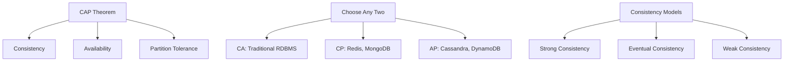

# Distributed System Consensus: Raft, Paxos, and Byzantine Fault Tolerance

Consensus is one of the fundamental problems in distributed systems. How do you get multiple nodes in a network to agree on a single value, especially when nodes can fail, messages can be lost, and network partitions can occur? This comprehensive guide explores the most important consensus algorithms used in modern distributed systems.

## The Consensus Problem

### CAP Theorem and Consistency Models



The CAP theorem states that in the presence of network partitions, you must choose between consistency and availability. Consensus algorithms help us achieve strong consistency in distributed systems.

### The FLP Impossibility Result

The Fischer-Lynch-Paterson impossibility result proves that in an asynchronous network, consensus is impossible if even one process can fail. However, practical consensus algorithms work around this limitation by:

1. Using timeouts and failure detectors
2. Assuming partial synchrony
3. Requiring majority agreement

## Raft Consensus Algorithm

Raft is designed to be more understandable than Paxos while providing the same guarantees. It breaks consensus into three sub-problems:

1. **Leader Election**: Select a leader to manage replication
2. **Log Replication**: Replicate log entries across followers
3. **Safety**: Ensure consistency even during failures

### Raft Implementation

```python
import random
import time
import threading
import json
from enum import Enum
from typing import Dict, List, Optional, Tuple

class NodeState(Enum):
    FOLLOWER = "follower"
    CANDIDATE = "candidate"
    LEADER = "leader"

class LogEntry:
    def __init__(self, term: int, index: int, command: str, data: dict = None):
        self.term = term
        self.index = index
        self.command = command
        self.data = data or {}
        self.timestamp = time.time()
    
    def to_dict(self):
        return {
            'term': self.term,
            'index': self.index,
            'command': self.command,
            'data': self.data,
            'timestamp': self.timestamp
        }

class RaftNode:
    def __init__(self, node_id: str, cluster_nodes: List[str]):
        self.node_id = node_id
        self.cluster_nodes = cluster_nodes
        self.other_nodes = [node for node in cluster_nodes if node != node_id]
        
        # Persistent state
        self.current_term = 0
        self.voted_for = None
        self.log: List[LogEntry] = []
        
        # Volatile state
        self.commit_index = 0
        self.last_applied = 0
        
        # Leader state (reinitialized after election)
        self.next_index: Dict[str, int] = {}
        self.match_index: Dict[str, int] = {}
        
        # Node state
        self.state = NodeState.FOLLOWER
        self.leader_id = None
        self.votes_received = set()
        
        # Timing
        self.election_timeout = self._random_election_timeout()
        self.heartbeat_interval = 0.05  # 50ms
        self.last_heartbeat = time.time()
        
        # Threading
        self.running = False
        self.lock = threading.Lock()
        
        # Network simulation (in practice, this would be actual RPC)
        self.network = {}  # Will be set externally
    
    def _random_election_timeout(self) -> float:
        return random.uniform(0.15, 0.3)  # 150-300ms
    
    def start(self):
        self.running = True
        self.election_timer = threading.Thread(target=self._election_timer_loop)
        self.election_timer.daemon = True
        self.election_timer.start()
        
        if self.state == NodeState.LEADER:
            self.heartbeat_timer = threading.Thread(target=self._heartbeat_loop)
            self.heartbeat_timer.daemon = True
            self.heartbeat_timer.start()
    
    def stop(self):
        self.running = False
    
    def _election_timer_loop(self):
        while self.running:
            with self.lock:
                if (self.state != NodeState.LEADER and 
                    time.time() - self.last_heartbeat > self.election_timeout):
                    self._start_election()
            time.sleep(0.01)  # 10ms precision
    
    def _heartbeat_loop(self):
        while self.running and self.state == NodeState.LEADER:
            self._send_heartbeats()
            time.sleep(self.heartbeat_interval)
    
    def _start_election(self):
        """Start a new election"""
        self.state = NodeState.CANDIDATE
        self.current_term += 1
        self.voted_for = self.node_id
        self.votes_received = {self.node_id}
        self.last_heartbeat = time.time()
        self.election_timeout = self._random_election_timeout()
        
        print(f"Node {self.node_id} starting election for term {self.current_term}")
        
        # Send RequestVote RPCs to all other nodes
        for node_id in self.other_nodes:
            threading.Thread(
                target=self._send_request_vote,
                args=(node_id,)
            ).start()
    
    def _send_request_vote(self, node_id: str):
        """Send RequestVote RPC to a specific node"""
        last_log_index = len(self.log)
        last_log_term = self.log[-1].term if self.log else 0
        
        request = {
            'type': 'RequestVote',
            'term': self.current_term,
            'candidate_id': self.node_id,
            'last_log_index': last_log_index,
            'last_log_term': last_log_term
        }
        
        response = self._send_rpc(node_id, request)
        if response and response.get('vote_granted'):
            with self.lock:
                if (self.state == NodeState.CANDIDATE and 
                    self.current_term == request['term']):
                    self.votes_received.add(node_id)
                    
                    # Check if we have majority votes
                    if len(self.votes_received) > len(self.cluster_nodes) // 2:
                        self._become_leader()
    
    def _become_leader(self):
        """Become the leader for current term"""
        self.state = NodeState.LEADER
        self.leader_id = self.node_id
        
        # Initialize leader state
        last_log_index = len(self.log)
        for node_id in self.other_nodes:
            self.next_index[node_id] = last_log_index + 1
            self.match_index[node_id] = 0
        
        print(f"Node {self.node_id} became leader for term {self.current_term}")
        
        # Start sending heartbeats
        if self.running:
            self.heartbeat_timer = threading.Thread(target=self._heartbeat_loop)
            self.heartbeat_timer.daemon = True
            self.heartbeat_timer.start()
    
    def _send_heartbeats(self):
        """Send heartbeat (empty AppendEntries) to all followers"""
        for node_id in self.other_nodes:
            threading.Thread(
                target=self._send_append_entries,
                args=(node_id,)
            ).start()
    
    def _send_append_entries(self, node_id: str):
        """Send AppendEntries RPC to a specific follower"""
        with self.lock:
            next_idx = self.next_index.get(node_id, 1)
            prev_log_index = next_idx - 1
            prev_log_term = 0
            
            if prev_log_index > 0 and prev_log_index <= len(self.log):
                prev_log_term = self.log[prev_log_index - 1].term
            
            # Determine entries to send
            entries = []
            if next_idx <= len(self.log):
                entries = [entry.to_dict() for entry in self.log[next_idx - 1:]]
            
            request = {
                'type': 'AppendEntries',
                'term': self.current_term,
                'leader_id': self.node_id,
                'prev_log_index': prev_log_index,
                'prev_log_term': prev_log_term,
                'entries': entries,
                'leader_commit': self.commit_index
            }
        
        response = self._send_rpc(node_id, request)
        
        with self.lock:
            if response and self.state == NodeState.LEADER:
                if response.get('term', 0) > self.current_term:
                    self._step_down(response['term'])
                elif response.get('success'):
                    # Update next_index and match_index for follower
                    self.match_index[node_id] = prev_log_index + len(entries)
                    self.next_index[node_id] = self.match_index[node_id] + 1
                    
                    # Update commit_index if majority replicated
                    self._update_commit_index()
                else:
                    # Decrement next_index and retry
                    if self.next_index[node_id] > 1:
                        self.next_index[node_id] -= 1
    
    def _update_commit_index(self):
        """Update commit index based on majority replication"""
        if self.state != NodeState.LEADER:
            return
        
        # Find the highest index replicated on majority of servers
        indices = [self.match_index[node] for node in self.other_nodes]
        indices.append(len(self.log))  # Leader's log length
        indices.sort(reverse=True)
        
        majority_index = indices[len(self.cluster_nodes) // 2]
        
        # Only commit entries from current term
        if (majority_index > self.commit_index and
            majority_index <= len(self.log) and
            self.log[majority_index - 1].term == self.current_term):
            
            self.commit_index = majority_index
            print(f"Leader {self.node_id} committed up to index {self.commit_index}")
    
    def _step_down(self, term: int):
        """Step down from leadership and update term"""
        if term > self.current_term:
            self.current_term = term
            self.voted_for = None
        
        if self.state == NodeState.LEADER:
            print(f"Leader {self.node_id} stepping down")
        
        self.state = NodeState.FOLLOWER
        self.leader_id = None
        self.last_heartbeat = time.time()
    
    # RPC Handlers
    def handle_request_vote(self, request: dict) -> dict:
        """Handle RequestVote RPC"""
        with self.lock:
            term = request['term']
            candidate_id = request['candidate_id']
            last_log_index = request['last_log_index']
            last_log_term = request['last_log_term']
            
            # Update term if necessary
            if term > self.current_term:
                self._step_down(term)
            
            vote_granted = False
            
            if (term == self.current_term and
                (self.voted_for is None or self.voted_for == candidate_id)):
                
                # Check if candidate's log is at least as up-to-date
                our_last_log_term = self.log[-1].term if self.log else 0
                our_last_log_index = len(self.log)
                
                log_ok = (last_log_term > our_last_log_term or
                         (last_log_term == our_last_log_term and
                          last_log_index >= our_last_log_index))
                
                if log_ok:
                    vote_granted = True
                    self.voted_for = candidate_id
                    self.last_heartbeat = time.time()
                    print(f"Node {self.node_id} voted for {candidate_id} in term {term}")
            
            return {
                'term': self.current_term,
                'vote_granted': vote_granted
            }
    
    def handle_append_entries(self, request: dict) -> dict:
        """Handle AppendEntries RPC"""
        with self.lock:
            term = request['term']
            leader_id = request['leader_id']
            prev_log_index = request['prev_log_index']
            prev_log_term = request['prev_log_term']
            entries = request['entries']
            leader_commit = request['leader_commit']
            
            # Update term if necessary
            if term > self.current_term:
                self._step_down(term)
            
            success = False
            
            if term == self.current_term:
                self.state = NodeState.FOLLOWER
                self.leader_id = leader_id
                self.last_heartbeat = time.time()
                
                # Check if log matches at prev_log_index
                log_match = (prev_log_index == 0 or
                           (prev_log_index <= len(self.log) and
                            self.log[prev_log_index - 1].term == prev_log_term))
                
                if log_match:
                    success = True
                    
                    # Remove conflicting entries
                    if prev_log_index < len(self.log):
                        self.log = self.log[:prev_log_index]
                    
                    # Append new entries
                    for entry_dict in entries:
                        entry = LogEntry(
                            entry_dict['term'],
                            entry_dict['index'],
                            entry_dict['command'],
                            entry_dict['data']
                        )
                        self.log.append(entry)
                    
                    # Update commit index
                    if leader_commit > self.commit_index:
                        self.commit_index = min(leader_commit, len(self.log))
                        print(f"Follower {self.node_id} committed up to index {self.commit_index}")
            
            return {
                'term': self.current_term,
                'success': success
            }
    
    def append_log_entry(self, command: str, data: dict = None) -> bool:
        """Client interface to append a log entry (leader only)"""
        if self.state != NodeState.LEADER:
            return False
        
        with self.lock:
            entry = LogEntry(
                term=self.current_term,
                index=len(self.log) + 1,
                command=command,
                data=data or {}
            )
            self.log.append(entry)
            print(f"Leader {self.node_id} appended entry: {command}")
        
        return True
    
    def _send_rpc(self, node_id: str, request: dict) -> Optional[dict]:
        """Simulate sending RPC to another node"""
        if node_id in self.network:
            target_node = self.network[node_id]
            if request['type'] == 'RequestVote':
                return target_node.handle_request_vote(request)
            elif request['type'] == 'AppendEntries':
                return target_node.handle_append_entries(request)
        return None

# Cluster simulation
class RaftCluster:
    def __init__(self, node_count: int = 5):
        self.node_ids = [f"node_{i}" for i in range(node_count)]
        self.nodes = {}
        
        # Create nodes
        for node_id in self.node_ids:
            self.nodes[node_id] = RaftNode(node_id, self.node_ids)
        
        # Set up network connections
        for node in self.nodes.values():
            node.network = self.nodes
    
    def start_cluster(self):
        """Start all nodes in the cluster"""
        for node in self.nodes.values():
            node.start()
    
    def stop_cluster(self):
        """Stop all nodes in the cluster"""
        for node in self.nodes.values():
            node.stop()
    
    def get_leader(self) -> Optional[RaftNode]:
        """Find the current leader"""
        for node in self.nodes.values():
            if node.state == NodeState.LEADER:
                return node
        return None
    
    def simulate_network_partition(self, partition1: List[str], partition2: List[str]):
        """Simulate network partition between two groups of nodes"""
        # Remove cross-partition connections
        for node_id in partition1:
            node = self.nodes[node_id]
            for other_id in partition2:
                if other_id in node.network:
                    del node.network[other_id]
        
        for node_id in partition2:
            node = self.nodes[node_id]
            for other_id in partition1:
                if other_id in node.network:
                    del node.network[other_id]
    
    def heal_network_partition(self):
        """Heal network partition"""
        for node in self.nodes.values():
            node.network = self.nodes

# Usage example
if __name__ == "__main__":
    # Create and start cluster
    cluster = RaftCluster(5)
    cluster.start_cluster()
    
    time.sleep(2)  # Allow leader election
    
    # Find leader and append some entries
    leader = cluster.get_leader()
    if leader:
        print(f"Current leader: {leader.node_id}")
        leader.append_log_entry("SET", {"key": "user:1", "value": "John Doe"})
        leader.append_log_entry("SET", {"key": "user:2", "value": "Jane Smith"})
    
    time.sleep(1)  # Allow replication
    
    # Print cluster state
    for node_id, node in cluster.nodes.items():
        print(f"Node {node_id}: Term={node.current_term}, "
              f"State={node.state.value}, LogLen={len(node.log)}, "
              f"CommitIndex={node.commit_index}")
    
    cluster.stop_cluster()
```

### Raft Safety Properties

Raft guarantees several important safety properties:

1. **Election Safety**: At most one leader per term
2. **Leader Append-Only**: Leaders never overwrite or delete entries
3. **Log Matching**: If two logs have entries with same index and term, then logs are identical up to that index
4. **Leader Completeness**: If entry is committed in a term, it will be present in leaders of all higher terms
5. **State Machine Safety**: If a server applies entry at index i, no other server applies different entry at index i

## Paxos Algorithm

Paxos is more complex than Raft but handles more general scenarios. Basic Paxos consists of two phases:

### Phase 1: Prepare
1. Proposer selects proposal number n and sends Prepare(n) to majority of acceptors
2. Acceptors respond with Promise(n) if n > highest seen proposal number

### Phase 2: Accept
1. If majority responds, proposer sends Accept(n, v) to acceptors
2. Acceptors accept if no higher-numbered proposal received since Promise

```python
import threading
import time
from typing import Dict, Set, Optional, Tuple
from dataclasses import dataclass

@dataclass
class Proposal:
    number: int
    value: any
    
@dataclass
class Promise:
    proposal_number: int
    accepted_proposal: Optional[Proposal] = None

class PaxosAcceptor:
    def __init__(self, acceptor_id: str):
        self.acceptor_id = acceptor_id
        self.promised_proposal = 0
        self.accepted_proposal: Optional[Proposal] = None
        self.lock = threading.Lock()
    
    def prepare(self, proposal_number: int) -> Optional[Promise]:
        """Handle Prepare request"""
        with self.lock:
            if proposal_number > self.promised_proposal:
                self.promised_proposal = proposal_number
                return Promise(
                    proposal_number=proposal_number,
                    accepted_proposal=self.accepted_proposal
                )
            return None
    
    def accept(self, proposal: Proposal) -> bool:
        """Handle Accept request"""
        with self.lock:
            if proposal.number >= self.promised_proposal:
                self.promised_proposal = proposal.number
                self.accepted_proposal = proposal
                return True
            return False

class PaxosProposer:
    def __init__(self, proposer_id: str, acceptors: List[PaxosAcceptor]):
        self.proposer_id = proposer_id
        self.acceptors = acceptors
        self.proposal_number = 0
        self.lock = threading.Lock()
    
    def propose(self, value: any) -> bool:
        """Propose a value using Paxos protocol"""
        with self.lock:
            self.proposal_number += 1
            proposal_num = int(f"{self.proposal_number}{hash(self.proposer_id) % 1000}")
        
        # Phase 1: Prepare
        promises = self._send_prepare(proposal_num)
        
        if len(promises) <= len(self.acceptors) // 2:
            return False  # No majority
        
        # Choose value based on highest numbered accepted proposal
        chosen_value = value
        highest_proposal_num = -1
        
        for promise in promises:
            if (promise.accepted_proposal and 
                promise.accepted_proposal.number > highest_proposal_num):
                highest_proposal_num = promise.accepted_proposal.number
                chosen_value = promise.accepted_proposal.value
        
        # Phase 2: Accept
        proposal = Proposal(proposal_num, chosen_value)
        accepts = self._send_accept(proposal)
        
        return len(accepts) > len(self.acceptors) // 2
    
    def _send_prepare(self, proposal_number: int) -> List[Promise]:
        """Send Prepare requests to all acceptors"""
        promises = []
        for acceptor in self.acceptors:
            promise = acceptor.prepare(proposal_number)
            if promise:
                promises.append(promise)
        return promises
    
    def _send_accept(self, proposal: Proposal) -> List[bool]:
        """Send Accept requests to all acceptors"""
        accepts = []
        for acceptor in self.acceptors:
            if acceptor.accept(proposal):
                accepts.append(True)
        return accepts

class MultiPaxos:
    """Multi-Paxos for deciding sequence of values"""
    def __init__(self, node_id: str, nodes: List[str]):
        self.node_id = node_id
        self.nodes = nodes
        self.acceptors = {node: PaxosAcceptor(node) for node in nodes}
        self.proposer = PaxosProposer(node_id, list(self.acceptors.values()))
        
        self.log: Dict[int, any] = {}  # slot -> value
        self.next_slot = 1
        self.lock = threading.Lock()
    
    def propose_value(self, value: any) -> Optional[int]:
        """Propose a value for the next available slot"""
        with self.lock:
            slot = self.next_slot
        
        success = self.proposer.propose(value)
        
        if success:
            with self.lock:
                self.log[slot] = value
                self.next_slot += 1
            return slot
        
        return None
```

## Byzantine Fault Tolerance

Byzantine fault tolerance handles nodes that may behave arbitrarily (maliciously or due to corruption). The Byzantine Generals Problem requires (3f + 1) nodes to tolerate f Byzantine failures.

### Practical Byzantine Fault Tolerance (PBFT)

```python
import hashlib
import json
from typing import Dict, List, Set, Optional
from dataclasses import dataclass
from enum import Enum

class MessageType(Enum):
    REQUEST = "request"
    PRE_PREPARE = "pre-prepare"
    PREPARE = "prepare"
    COMMIT = "commit"
    REPLY = "reply"

@dataclass
class Message:
    msg_type: MessageType
    view: int
    sequence: int
    digest: str
    node_id: str
    timestamp: float
    client_id: Optional[str] = None
    operation: Optional[str] = None

class PBFTNode:
    def __init__(self, node_id: str, nodes: List[str], f: int):
        self.node_id = node_id
        self.nodes = nodes
        self.f = f  # Number of Byzantine nodes we can tolerate
        self.n = len(nodes)  # Total number of nodes (should be 3f + 1)
        
        assert self.n >= 3 * f + 1, "Need at least 3f+1 nodes for f Byzantine failures"
        
        self.view = 0
        self.sequence = 0
        self.primary_id = self._get_primary(self.view)
        
        # Message logs
        self.message_log: Dict[str, Message] = {}
        self.pre_prepare_log: Dict[Tuple[int, int], Message] = {}
        self.prepare_log: Dict[Tuple[int, int], Set[str]] = {}
        self.commit_log: Dict[Tuple[int, int], Set[str]] = {}
        
        # Client request handling
        self.client_table: Dict[str, Tuple[int, str]] = {}  # client_id -> (timestamp, result)
        
        self.lock = threading.Lock()
    
    def _get_primary(self, view: int) -> str:
        """Determine primary node for given view"""
        return self.nodes[view % len(self.nodes)]
    
    def _compute_digest(self, message: str) -> str:
        """Compute cryptographic digest of message"""
        return hashlib.sha256(message.encode()).hexdigest()
    
    def _is_primary(self) -> bool:
        """Check if this node is the current primary"""
        return self.node_id == self.primary_id
    
    def handle_client_request(self, client_id: str, operation: str, timestamp: float):
        """Handle client request (primary only)"""
        if not self._is_primary():
            return None
        
        # Check for replay attacks
        with self.lock:
            if client_id in self.client_table:
                last_timestamp, last_result = self.client_table[client_id]
                if timestamp <= last_timestamp:
                    return last_result  # Return cached result
            
            self.sequence += 1
            digest = self._compute_digest(f"{client_id}:{operation}:{timestamp}")
            
            # Create pre-prepare message
            pre_prepare_msg = Message(
                msg_type=MessageType.PRE_PREPARE,
                view=self.view,
                sequence=self.sequence,
                digest=digest,
                node_id=self.node_id,
                timestamp=timestamp,
                client_id=client_id,
                operation=operation
            )
            
            # Log pre-prepare message
            key = (self.view, self.sequence)
            self.pre_prepare_log[key] = pre_prepare_msg
            
            # Send pre-prepare to all backups
            self._broadcast_message(pre_prepare_msg, exclude_self=True)
            
            return f"Request {self.sequence} accepted"
    
    def handle_pre_prepare(self, message: Message) -> bool:
        """Handle pre-prepare message (backup nodes)"""
        with self.lock:
            # Verify message is from current primary
            if message.node_id != self.primary_id:
                return False
            
            # Verify view and sequence numbers
            if message.view != self.view:
                return False
            
            key = (message.view, message.sequence)
            
            # Check if we already have a pre-prepare for this view/sequence
            if key in self.pre_prepare_log:
                existing = self.pre_prepare_log[key]
                if existing.digest != message.digest:
                    # Different digest for same view/sequence - Byzantine behavior
                    return False
                return True  # Already processed
            
            # Accept pre-prepare
            self.pre_prepare_log[key] = message
            
            # Send prepare message
            prepare_msg = Message(
                msg_type=MessageType.PREPARE,
                view=message.view,
                sequence=message.sequence,
                digest=message.digest,
                node_id=self.node_id,
                timestamp=time.time()
            )
            
            self._broadcast_message(prepare_msg, exclude_self=False)
            return True
    
    def handle_prepare(self, message: Message) -> bool:
        """Handle prepare message"""
        with self.lock:
            key = (message.view, message.sequence)
            
            # Verify we have matching pre-prepare
            if key not in self.pre_prepare_log:
                return False
            
            pre_prepare = self.pre_prepare_log[key]
            if pre_prepare.digest != message.digest:
                return False
            
            # Add to prepare log
            if key not in self.prepare_log:
                self.prepare_log[key] = set()
            
            self.prepare_log[key].add(message.node_id)
            
            # Check if we have enough prepare messages (2f)
            if len(self.prepare_log[key]) >= 2 * self.f:
                # Send commit message
                commit_msg = Message(
                    msg_type=MessageType.COMMIT,
                    view=message.view,
                    sequence=message.sequence,
                    digest=message.digest,
                    node_id=self.node_id,
                    timestamp=time.time()
                )
                
                self._broadcast_message(commit_msg, exclude_self=False)
            
            return True
    
    def handle_commit(self, message: Message) -> bool:
        """Handle commit message"""
        with self.lock:
            key = (message.view, message.sequence)
            
            # Verify we have matching pre-prepare
            if key not in self.pre_prepare_log:
                return False
            
            pre_prepare = self.pre_prepare_log[key]
            if pre_prepare.digest != message.digest:
                return False
            
            # Add to commit log
            if key not in self.commit_log:
                self.commit_log[key] = set()
            
            self.commit_log[key].add(message.node_id)
            
            # Check if we have enough commit messages (2f + 1)
            if len(self.commit_log[key]) >= 2 * self.f + 1:
                # Execute the operation
                result = self._execute_operation(pre_prepare)
                
                # Send reply to client (if primary)
                if self._is_primary() and pre_prepare.client_id:
                    reply_msg = Message(
                        msg_type=MessageType.REPLY,
                        view=message.view,
                        sequence=message.sequence,
                        digest=message.digest,
                        node_id=self.node_id,
                        timestamp=time.time(),
                        client_id=pre_prepare.client_id
                    )
                    
                    # Cache result for client
                    self.client_table[pre_prepare.client_id] = (
                        pre_prepare.timestamp, 
                        result
                    )
                
                return True
            
            return False
    
    def _execute_operation(self, pre_prepare: Message) -> str:
        """Execute the operation (state machine)"""
        # This would contain actual business logic
        operation = pre_prepare.operation
        print(f"Node {self.node_id} executing: {operation}")
        return f"Executed: {operation}"
    
    def _broadcast_message(self, message: Message, exclude_self: bool = True):
        """Broadcast message to all nodes"""
        # In practice, this would send over network
        for node_id in self.nodes:
            if exclude_self and node_id == self.node_id:
                continue
            # Simulate message delivery
            pass
    
    def initiate_view_change(self):
        """Initiate view change (when primary is suspected to be faulty)"""
        with self.lock:
            self.view += 1
            self.primary_id = self._get_primary(self.view)
            
            # Clear state for new view
            self.prepare_log.clear()
            self.commit_log.clear()
            
            print(f"Node {self.node_id} initiated view change to {self.view}")

# Blockchain consensus example using PBFT
class BlockchainPBFT:
    def __init__(self, nodes: List[str], f: int):
        self.nodes = {node_id: PBFTNode(node_id, nodes, f) for node_id in nodes}
        self.blockchain: List[Dict] = []
        self.pending_transactions: List[Dict] = []
        self.lock = threading.Lock()
    
    def add_transaction(self, transaction: Dict):
        """Add transaction to pending pool"""
        with self.lock:
            self.pending_transactions.append(transaction)
    
    def create_block(self, primary_node: str) -> Optional[Dict]:
        """Create new block (primary only)"""
        if primary_node not in self.nodes:
            return None
        
        node = self.nodes[primary_node]
        if not node._is_primary():
            return None
        
        with self.lock:
            if not self.pending_transactions:
                return None
            
            # Create block with pending transactions
            block = {
                'index': len(self.blockchain),
                'transactions': self.pending_transactions[:10],  # Max 10 transactions
                'previous_hash': self._get_last_block_hash(),
                'timestamp': time.time(),
                'proposer': primary_node
            }
            
            # Clear processed transactions
            self.pending_transactions = self.pending_transactions[10:]
            
            # Use PBFT to reach consensus on block
            operation = json.dumps(block, sort_keys=True)
            result = node.handle_client_request("blockchain", operation, time.time())
            
            if result:
                self.blockchain.append(block)
                return block
        
        return None
    
    def _get_last_block_hash(self) -> str:
        """Get hash of last block"""
        if not self.blockchain:
            return "0" * 64
        
        last_block = json.dumps(self.blockchain[-1], sort_keys=True)
        return hashlib.sha256(last_block.encode()).hexdigest()
```

## Performance Comparison

### Consensus Algorithm Trade-offs

| Algorithm | Fault Model | Message Complexity | Latency | Throughput | Implementation |
|-----------|-------------|-------------------|---------|------------|----------------|
| Raft | Crash-only | O(n) | 2 RTT | High | Simple |
| Paxos | Crash-only | O(n²) | 2 RTT | Medium | Complex |
| PBFT | Byzantine | O(n²) | 3 RTT | Low | Very Complex |
| Tendermint | Byzantine | O(n²) | 3+ RTT | Medium | Complex |

### When to Use Each Algorithm

**Use Raft when:**
- Building distributed systems with crash-only failures
- Simplicity and understandability are important
- You need efficient log replication
- Examples: etcd, Consul, Redis Sentinel

**Use Paxos when:**
- You need to handle more general failure scenarios
- Network partitions are common
- You're building a distributed database
- Examples: Google Spanner, Apache Cassandra

**Use PBFT when:**
- You need to tolerate malicious/arbitrary failures
- Building blockchain or cryptocurrency systems
- Security is more important than performance
- Examples: Hyperledger Fabric, some blockchain networks

## Practical Implementation Considerations

### Network Partitions and Split-Brain

```python
class PartitionTolerantRaft(RaftNode):
    def __init__(self, *args, **kwargs):
        super().__init__(*args, **kwargs)
        self.partition_detector = NetworkPartitionDetector(self)
    
    def handle_network_partition(self):
        """Handle network partition detection"""
        reachable_nodes = self._count_reachable_nodes()
        
        if reachable_nodes < (len(self.cluster_nodes) // 2 + 1):
            # We're in minority partition - step down
            print(f"Node {self.node_id} detected minority partition, stepping down")
            self._step_down(self.current_term)
            self.state = NodeState.FOLLOWER
    
    def _count_reachable_nodes(self) -> int:
        """Count number of nodes we can communicate with"""
        reachable = 1  # Count self
        
        for node_id in self.other_nodes:
            if self._can_reach_node(node_id):
                reachable += 1
        
        return reachable
    
    def _can_reach_node(self, node_id: str) -> bool:
        """Check if we can reach a specific node"""
        try:
            # Send heartbeat and wait for response
            request = {
                'type': 'Ping',
                'timestamp': time.time()
            }
            response = self._send_rpc(node_id, request, timeout=1.0)
            return response is not None
        except:
            return False

class NetworkPartitionDetector:
    def __init__(self, node: RaftNode):
        self.node = node
        self.running = False
    
    def start(self):
        self.running = True
        self.detector_thread = threading.Thread(target=self._detection_loop)
        self.detector_thread.daemon = True
        self.detector_thread.start()
    
    def _detection_loop(self):
        while self.running:
            self.node.handle_network_partition()
            time.sleep(5)  # Check every 5 seconds
```

### Performance Optimizations

```python
class OptimizedRaft(RaftNode):
    def __init__(self, *args, **kwargs):
        super().__init__(*args, **kwargs)
        self.batch_size = 100
        self.batch_timeout = 0.01  # 10ms
        self.pending_entries = []
        self.last_batch_time = time.time()
    
    def append_log_entry_batched(self, command: str, data: dict = None) -> bool:
        """Batched log entry appending for better throughput"""
        if self.state != NodeState.LEADER:
            return False
        
        with self.lock:
            self.pending_entries.append({
                'command': command,
                'data': data or {}
            })
            
            # Flush batch if size limit reached or timeout exceeded
            if (len(self.pending_entries) >= self.batch_size or
                time.time() - self.last_batch_time > self.batch_timeout):
                self._flush_batch()
        
        return True
    
    def _flush_batch(self):
        """Flush pending entries as a single batch"""
        if not self.pending_entries:
            return
        
        # Create batch entry
        batch_entry = LogEntry(
            term=self.current_term,
            index=len(self.log) + 1,
            command="BATCH",
            data={'entries': self.pending_entries}
        )
        
        self.log.append(batch_entry)
        self.pending_entries = []
        self.last_batch_time = time.time()
        
        print(f"Leader {self.node_id} flushed batch of {len(batch_entry.data['entries'])} entries")

    def _pipeline_append_entries(self):
        """Pipeline AppendEntries for better performance"""
        # Send multiple AppendEntries in parallel without waiting
        for node_id in self.other_nodes:
            threading.Thread(
                target=self._send_append_entries_pipelined,
                args=(node_id,)
            ).start()
    
    def _send_append_entries_pipelined(self, node_id: str):
        """Send pipelined AppendEntries"""
        # Implementation would send multiple entries without waiting
        # for acknowledgment of each one
        pass
```

## Conclusion

Consensus algorithms are the foundation of distributed systems, each with specific trade-offs:

- **Raft** provides simplicity and efficiency for crash-failure scenarios
- **Paxos** offers theoretical elegance and handles more general failure cases  
- **PBFT** enables Byzantine fault tolerance at the cost of complexity and performance

The choice depends on your specific requirements for fault tolerance, performance, and implementation complexity. Understanding these algorithms deeply is crucial for building reliable distributed systems that can handle the complexities of real-world network environments.

Modern systems often combine multiple consensus mechanisms or use variations like Multi-Raft for better scalability. The key is to understand the fundamental principles and adapt them to your specific use case.