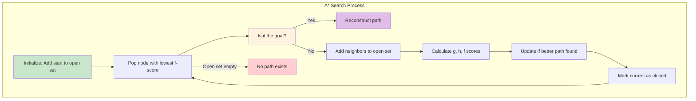
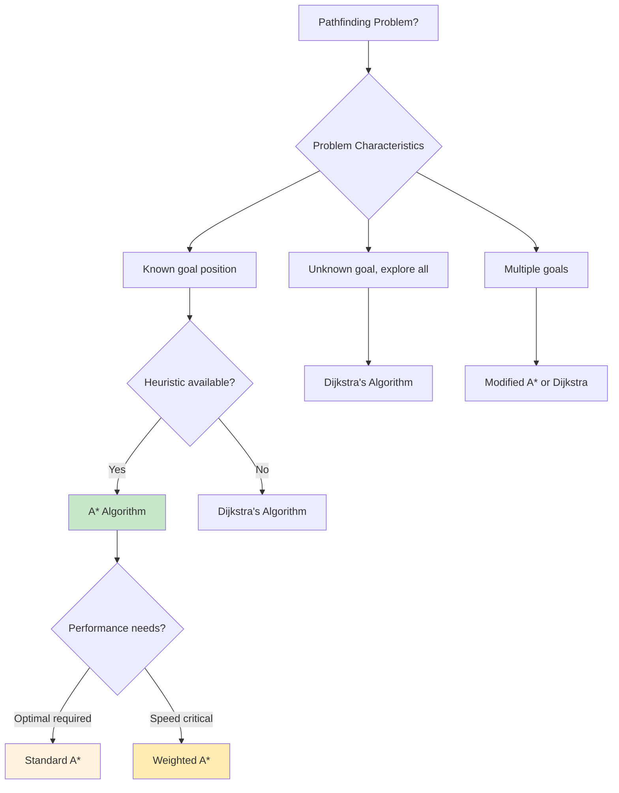

# Mastering A* Algorithm: Heuristic-Guided Pathfinding

*Published on November 11, 2024 • 45 min read*

## Table of Contents
1. [Introduction to A* Algorithm](#introduction)
2. [Algorithm Fundamentals](#algorithm-fundamentals)
3. [Core Implementation](#core-implementation)
4. [Heuristic Functions](#heuristic-functions)
5. [Advanced Optimizations](#advanced-optimizations)
6. [Real-World Applications](#real-world-applications)
7. [Performance Analysis](#performance-analysis)
8. [Comparison with Other Algorithms](#comparison)
9. [Bidirectional A*](#bidirectional-astar)
10. [Problem-Solving Patterns](#problem-solving)
11. [Practice Problems](#practice-problems)
12. [Tips and Memory Tricks](#tips-tricks)

## Introduction to A* Algorithm {#introduction}

Imagine you're developing a **GPS navigation system** that needs to find the fastest route from your current location to a destination across a city with millions of intersections. Or picture creating an **AI for a strategy game** where units must navigate around obstacles on a massive battlefield. Unlike **Dijkstra's algorithm** that explores uniformly in all directions, **A* (A-star)** uses **intelligent guessing** to focus its search toward the goal, making it dramatically faster for pathfinding problems.

### The GPS Navigation Analogy

When your GPS calculates a route:
- **Current position**: Starting point (source vertex)
- **Destination**: Target location (goal vertex)
- **Road network**: Graph with intersections and roads
- **Distance estimates**: Heuristic function (straight-line distance to goal)
- **Smart exploration**: A* prioritizes roads that seem to lead toward the destination
- **Optimal route**: Guaranteed shortest path when heuristic is admissible

### Key Advantages of A*

1. **Heuristic-guided search**: Uses domain knowledge to search more efficiently
2. **Optimal pathfinding**: Finds shortest path when using admissible heuristics
3. **Faster than Dijkstra**: Explores fewer vertices by focusing search direction
4. **Flexible heuristics**: Adaptable to different problem domains and constraints
5. **Memory efficient**: Can be optimized for space-constrained environments
6. **Real-time capable**: Fast enough for interactive applications and games

### Why A* Matters

**Game Development**:
- Real-time unit pathfinding
- NPC navigation systems
- Strategic AI decision making
- Dynamic obstacle avoidance

**Robotics & Autonomous Systems**:
- Robot navigation and path planning
- Autonomous vehicle routing
- Drone flight path optimization
- Warehouse automation

**Geographic Information Systems**:
- GPS and mapping applications
- Route optimization for logistics
- Emergency services dispatch
- Urban planning and analysis

### Algorithm Comparison Overview

```mermaid
graph TD
    subgraph "Pathfinding Algorithms"
        A[Breadth-First Search] --> B[O(V+E), Unweighted]
        C[Dijkstra's Algorithm] --> D[O((V+E)log V), Weighted]
        E[A* Algorithm] --> F[O(b^d), Heuristic-guided]
        G[Greedy Best-First] --> H[O(b^d), Fast but suboptimal]
    end
    
    subgraph "Search Strategy"
        I[Uniform exploration] --> A
        I --> C
        J[Goal-directed] --> E
        J --> G
        K[Optimal + Efficient] --> E
    end
    
    style E fill:#c8e6c9
    style F fill:#fff3e0
    style K fill:#ffecb3
```

## Algorithm Fundamentals {#algorithm-fundamentals}

A* combines the **guaranteed optimality** of Dijkstra's algorithm with the **efficiency** of greedy search by using a heuristic function to guide the search toward the goal.

### Core A* Formula

**f(n) = g(n) + h(n)**

Where:
- **f(n)**: Estimated total cost from start to goal through node n
- **g(n)**: Actual cost from start to node n (like Dijkstra's distance)
- **h(n)**: Heuristic estimate of cost from node n to goal

### Heuristic Properties

**Admissible Heuristic**: Never overestimates the actual cost to goal
- h(n) ≤ h*(n) where h*(n) is the true cost from n to goal
- Guarantees optimal solution
- Examples: Straight-line distance for geographic problems

**Consistent (Monotonic) Heuristic**: Satisfies triangle inequality
- h(n) ≤ cost(n, n') + h(n') for every neighbor n'
- More efficient than just admissible
- Nodes are never reopened for better paths

### Graph Representation for A*

```go
import (
    "container/heap"
    "math"
)

type AStarGraph struct {
    vertices int
    edges    map[int][]Edge
}

type Edge struct {
    to     int
    weight float64
}

type Position struct {
    X, Y float64
}

func NewAStarGraph(vertices int) *AStarGraph {
    return &AStarGraph{
        vertices: vertices,
        edges:    make(map[int][]Edge),
    }
}

func (g *AStarGraph) AddEdge(from, to int, weight float64) {
    g.edges[from] = append(g.edges[from], Edge{to: to, weight: weight})
}

func (g *AStarGraph) AddUndirectedEdge(u, v int, weight float64) {
    g.AddEdge(u, v, weight)
    g.AddEdge(v, u, weight)
}

func (g *AStarGraph) GetNeighbors(vertex int) []Edge {
    return g.edges[vertex]
}
```

### Priority Queue for A*

```go
type AStarNode struct {
    vertex int
    g      float64 // Cost from start
    f      float64 // f = g + h
    parent int
}

type PriorityQueue []*AStarNode

func (pq PriorityQueue) Len() int { return len(pq) }

func (pq PriorityQueue) Less(i, j int) bool {
    // Compare by f-score first, then by g-score for tie-breaking
    if pq[i].f == pq[j].f {
        return pq[i].g > pq[j].g // Prefer higher g-score when f-scores equal
    }
    return pq[i].f < pq[j].f
}

func (pq PriorityQueue) Swap(i, j int) {
    pq[i], pq[j] = pq[j], pq[i]
}

func (pq *PriorityQueue) Push(x interface{}) {
    *pq = append(*pq, x.(*AStarNode))
}

func (pq *PriorityQueue) Pop() interface{} {
    old := *pq
    n := len(old)
    item := old[n-1]
    *pq = old[0 : n-1]
    return item
}

func (pq *PriorityQueue) IsEmpty() bool {
    return len(*pq) == 0
}
```

### Heuristic Function Interface

```go
type HeuristicFunc func(from, to int, positions map[int]Position) float64

// Manhattan distance (L1 norm) - for grid worlds with 4-directional movement
func ManhattanDistance(from, to int, positions map[int]Position) float64 {
    fromPos := positions[from]
    toPos := positions[to]
    return math.Abs(fromPos.X-toPos.X) + math.Abs(fromPos.Y-toPos.Y)
}

// Euclidean distance (L2 norm) - for continuous space
func EuclideanDistance(from, to int, positions map[int]Position) float64 {
    fromPos := positions[from]
    toPos := positions[to]
    dx := fromPos.X - toPos.X
    dy := fromPos.Y - toPos.Y
    return math.Sqrt(dx*dx + dy*dy)
}

// Chebyshev distance (L∞ norm) - for grid worlds with 8-directional movement
func ChebyshevDistance(from, to int, positions map[int]Position) float64 {
    fromPos := positions[from]
    toPos := positions[to]
    dx := math.Abs(fromPos.X - toPos.X)
    dy := math.Abs(fromPos.Y - toPos.Y)
    return math.Max(dx, dy)
}

// Null heuristic - reduces A* to Dijkstra's algorithm
func NullHeuristic(from, to int, positions map[int]Position) float64 {
    return 0
}
```

### Algorithm Visualization



### A* vs Dijkstra Comparison

| Aspect | Dijkstra's Algorithm | A* Algorithm |
|--------|---------------------|--------------|
| **Search Pattern** | Uniform expansion in all directions | Directed toward goal using heuristic |
| **Optimality** | Always optimal | Optimal with admissible heuristic |
| **Performance** | O((V+E) log V) | O(b^d) where b=branching factor, d=depth |
| **Memory Usage** | O(V) | O(b^d) |
| **Use Case** | Unknown goal location | Known goal location |
| **Heuristic** | None (h(n) = 0) | Domain-specific heuristic function |

## Core Implementation {#core-implementation}

### Standard A* Algorithm

```go
import "fmt"

type AStarResult struct {
    Path        []int
    Cost        float64
    NodesExplored int
    Found       bool
}

func AStar(graph *AStarGraph, start, goal int, positions map[int]Position, heuristic HeuristicFunc) *AStarResult {
    openSet := &PriorityQueue{}
    heap.Init(openSet)
    
    closedSet := make(map[int]bool)
    gScore := make(map[int]float64)
    parent := make(map[int]int)
    
    // Initialize start node
    gScore[start] = 0
    startNode := &AStarNode{
        vertex: start,
        g:      0,
        f:      heuristic(start, goal, positions),
        parent: -1,
    }
    
    heap.Push(openSet, startNode)
    nodesExplored := 0
    
    for !openSet.IsEmpty() {
        current := heap.Pop(openSet).(*AStarNode)
        nodesExplored++
        
        // Goal reached
        if current.vertex == goal {
            path := reconstructPath(parent, start, goal)
            return &AStarResult{
                Path:          path,
                Cost:          current.g,
                NodesExplored: nodesExplored,
                Found:         true,
            }
        }
        
        // Mark as explored
        closedSet[current.vertex] = true
        
        // Explore neighbors
        for _, edge := range graph.GetNeighbors(current.vertex) {
            neighbor := edge.to
            
            // Skip if already explored
            if closedSet[neighbor] {
                continue
            }
            
            // Calculate tentative g-score
            tentativeG := current.g + edge.weight
            
            // Check if this is a better path
            if currentG, exists := gScore[neighbor]; !exists || tentativeG < currentG {
                gScore[neighbor] = tentativeG
                parent[neighbor] = current.vertex
                
                h := heuristic(neighbor, goal, positions)
                f := tentativeG + h
                
                neighborNode := &AStarNode{
                    vertex: neighbor,
                    g:      tentativeG,
                    f:      f,
                    parent: current.vertex,
                }
                
                heap.Push(openSet, neighborNode)
            }
        }
    }
    
    // No path found
    return &AStarResult{
        Path:          nil,
        Cost:          -1,
        NodesExplored: nodesExplored,
        Found:         false,
    }
}

func reconstructPath(parent map[int]int, start, goal int) []int {
    path := []int{}
    current := goal
    
    for current != -1 {
        path = append([]int{current}, path...)
        if current == start {
            break
        }
        current = parent[current]
    }
    
    return path
}
```

### A* with Detailed Trace

```go
func AStarWithTrace(graph *AStarGraph, start, goal int, positions map[int]Position, heuristic HeuristicFunc) *AStarResult {
    openSet := &PriorityQueue{}
    heap.Init(openSet)
    
    closedSet := make(map[int]bool)
    gScore := make(map[int]float64)
    parent := make(map[int]int)
    
    fmt.Printf("A* Search from %d to %d\n", start, goal)
    fmt.Println("=========================")
    
    // Initialize
    gScore[start] = 0
    h := heuristic(start, goal, positions)
    
    startNode := &AStarNode{
        vertex: start,
        g:      0,
        f:      h,
        parent: -1,
    }
    
    heap.Push(openSet, startNode)
    
    fmt.Printf("Initial: Start node %d, h=%g, f=%g\n", start, h, h)
    
    iteration := 0
    nodesExplored := 0
    
    for !openSet.IsEmpty() {
        iteration++
        current := heap.Pop(openSet).(*AStarNode)
        nodesExplored++
        
        fmt.Printf("\nIteration %d:\n", iteration)
        fmt.Printf("  Current: Node %d (g=%g, f=%g)\n", current.vertex, current.g, current.f)
        
        if current.vertex == goal {
            fmt.Printf("  🎯 Goal reached!\n")
            path := reconstructPath(parent, start, goal)
            
            fmt.Printf("\nFinal path: %v\n", path)
            fmt.Printf("Total cost: %g\n", current.g)
            fmt.Printf("Nodes explored: %d\n", nodesExplored)
            
            return &AStarResult{
                Path:          path,
                Cost:          current.g,
                NodesExplored: nodesExplored,
                Found:         true,
            }
        }
        
        closedSet[current.vertex] = true
        fmt.Printf("  Added to closed set: %d\n", current.vertex)
        
        // Explore neighbors
        neighbors := graph.GetNeighbors(current.vertex)
        fmt.Printf("  Neighbors: %d\n", len(neighbors))
        
        for _, edge := range neighbors {
            neighbor := edge.to
            
            if closedSet[neighbor] {
                fmt.Printf("    Node %d: Already in closed set, skipping\n", neighbor)
                continue
            }
            
            tentativeG := current.g + edge.weight
            h := heuristic(neighbor, goal, positions)
            f := tentativeG + h
            
            if currentG, exists := gScore[neighbor]; !exists || tentativeG < currentG {
                gScore[neighbor] = tentativeG
                parent[neighbor] = current.vertex
                
                fmt.Printf("    Node %d: g=%g, h=%g, f=%g (New/Better path)\n", 
                    neighbor, tentativeG, h, f)
                
                neighborNode := &AStarNode{
                    vertex: neighbor,
                    g:      tentativeG,
                    f:      f,
                    parent: current.vertex,
                }
                
                heap.Push(openSet, neighborNode)
            } else {
                fmt.Printf("    Node %d: g=%g, h=%g, f=%g (Worse path, ignored)\n", 
                    neighbor, tentativeG, h, f)
            }
        }
        
        fmt.Printf("  Open set size: %d\n", openSet.Len())
    }
    
    fmt.Printf("\nNo path found after %d iterations\n", iteration)
    return &AStarResult{
        Path:          nil,
        Cost:          -1,
        NodesExplored: nodesExplored,
        Found:         false,
    }
}
```

### A* for Grid-Based Pathfinding

```go
type GridWorld struct {
    width, height int
    obstacles     map[Position]bool
    graph         *AStarGraph
    positions     map[int]Position
    posToVertex   map[Position]int
}

func NewGridWorld(width, height int) *GridWorld {
    gw := &GridWorld{
        width:       width,
        height:      height,
        obstacles:   make(map[Position]bool),
        positions:   make(map[int]Position),
        posToVertex: make(map[Position]int),
    }
    
    gw.buildGraph()
    return gw
}

func (gw *GridWorld) AddObstacle(x, y int) {
    pos := Position{float64(x), float64(y)}
    gw.obstacles[pos] = true
    gw.buildGraph() // Rebuild graph
}

func (gw *GridWorld) RemoveObstacle(x, y int) {
    pos := Position{float64(x), float64(y)}
    delete(gw.obstacles, pos)
    gw.buildGraph()
}

func (gw *GridWorld) buildGraph() {
    // Create vertex mapping
    vertexId := 0
    gw.positions = make(map[int]Position)
    gw.posToVertex = make(map[Position]int)
    
    for y := 0; y < gw.height; y++ {
        for x := 0; x < gw.width; x++ {
            pos := Position{float64(x), float64(y)}
            if !gw.obstacles[pos] {
                gw.positions[vertexId] = pos
                gw.posToVertex[pos] = vertexId
                vertexId++
            }
        }
    }
    
    // Create graph
    gw.graph = NewAStarGraph(vertexId)
    
    // Add edges between adjacent non-obstacle cells
    directions := []Position{
        {0, 1}, {1, 0}, {0, -1}, {-1, 0},     // 4-directional
        {1, 1}, {1, -1}, {-1, 1}, {-1, -1},   // Diagonal movements
    }
    
    for vertex, pos := range gw.positions {
        for _, dir := range directions {
            newPos := Position{pos.X + dir.X, pos.Y + dir.Y}
            
            // Check bounds
            if newPos.X >= 0 && newPos.X < float64(gw.width) &&
               newPos.Y >= 0 && newPos.Y < float64(gw.height) {
                
                if neighborVertex, exists := gw.posToVertex[newPos]; exists {
                    // Calculate edge weight (diagonal moves cost more)
                    weight := 1.0
                    if dir.X != 0 && dir.Y != 0 {
                        weight = math.Sqrt(2) // √2 ≈ 1.414
                    }
                    
                    gw.graph.AddEdge(vertex, neighborVertex, weight)
                }
            }
        }
    }
}

func (gw *GridWorld) FindPath(startX, startY, goalX, goalY int, heuristic HeuristicFunc) *AStarResult {
    startPos := Position{float64(startX), float64(startY)}
    goalPos := Position{float64(goalX), float64(goalY)}
    
    startVertex, startExists := gw.posToVertex[startPos]
    goalVertex, goalExists := gw.posToVertex[goalPos]
    
    if !startExists || !goalExists {
        return &AStarResult{Found: false}
    }
    
    return AStar(gw.graph, startVertex, goalVertex, gw.positions, heuristic)
}

func (gw *GridWorld) GetPathPositions(result *AStarResult) []Position {
    if !result.Found {
        return nil
    }
    
    positions := make([]Position, len(result.Path))
    for i, vertex := range result.Path {
        positions[i] = gw.positions[vertex]
    }
    
    return positions
}
```

### Example Usage

```go
func ExampleAStar() {
    // Create a simple grid world
    grid := NewGridWorld(10, 10)
    
    // Add some obstacles
    obstacles := [][]int{
        {2, 2}, {2, 3}, {2, 4}, {2, 5},
        {6, 1}, {6, 2}, {6, 3}, {6, 4}, {6, 5}, {6, 6},
    }
    
    for _, obs := range obstacles {
        grid.AddObstacle(obs[0], obs[1])
    }
    
    // Test different heuristics
    heuristics := map[string]HeuristicFunc{
        "Manhattan":  ManhattanDistance,
        "Euclidean":  EuclideanDistance,
        "Chebyshev":  ChebyshevDistance,
        "Null":       NullHeuristic,
    }
    
    startX, startY := 0, 0
    goalX, goalY := 9, 9
    
    fmt.Printf("Pathfinding from (%d,%d) to (%d,%d)\n", startX, startY, goalX, goalY)
    fmt.Println("=====================================")
    
    for name, heuristic := range heuristics {
        result := grid.FindPath(startX, startY, goalX, goalY, heuristic)
        
        fmt.Printf("%s Heuristic:\n", name)
        if result.Found {
            pathPos := grid.GetPathPositions(result)
            fmt.Printf("  Path length: %d steps\n", len(pathPos))
            fmt.Printf("  Total cost: %.2f\n", result.Cost)
            fmt.Printf("  Nodes explored: %d\n", result.NodesExplored)
            fmt.Printf("  Path: ")
            
            for i, pos := range pathPos {
                if i > 0 {
                    fmt.Print(" -> ")
                }
                fmt.Printf("(%g,%g)", pos.X, pos.Y)
                if i >= 4 { // Truncate long paths
                    fmt.Print(" ... ")
                    break
                }
            }
            fmt.Println()
        } else {
            fmt.Printf("  No path found\n")
        }
        fmt.Println()
    }
}
```

### A* with Custom Priority and Tie-Breaking

```go
type AStarNodeAdvanced struct {
    vertex   int
    g        float64
    f        float64
    h        float64
    parent   int
    iteration int // For tie-breaking
}

type AdvancedPriorityQueue []*AStarNodeAdvanced

func (pq AdvancedPriorityQueue) Len() int { return len(pq) }

func (pq AdvancedPriorityQueue) Less(i, j int) bool {
    // Primary: Compare by f-score
    if pq[i].f != pq[j].f {
        return pq[i].f < pq[j].f
    }
    
    // Secondary: Prefer higher g-score (closer to goal)
    if pq[i].g != pq[j].g {
        return pq[i].g > pq[j].g
    }
    
    // Tertiary: Prefer lower h-score
    if pq[i].h != pq[j].h {
        return pq[i].h < pq[j].h
    }
    
    // Final: Prefer earlier discovered nodes
    return pq[i].iteration < pq[j].iteration
}

func (pq AdvancedPriorityQueue) Swap(i, j int) {
    pq[i], pq[j] = pq[j], pq[i]
}

func (pq *AdvancedPriorityQueue) Push(x interface{}) {
    *pq = append(*pq, x.(*AStarNodeAdvanced))
}

func (pq *AdvancedPriorityQueue) Pop() interface{} {
    old := *pq
    n := len(old)
    item := old[n-1]
    *pq = old[0 : n-1]
    return item
}

## Heuristic Functions {#heuristic-functions}

### Advanced Heuristic Implementations

```go
// Weighted heuristic - trades optimality for speed
func WeightedHeuristic(weight float64, baseHeuristic HeuristicFunc) HeuristicFunc {
    return func(from, to int, positions map[int]Position) float64 {
        return weight * baseHeuristic(from, to, positions)
    }
}

// Diagonal distance - for 8-directional movement with different costs
func DiagonalDistance(straightCost, diagonalCost float64) HeuristicFunc {
    return func(from, to int, positions map[int]Position) float64 {
        fromPos := positions[from]
        toPos := positions[to]
        
        dx := math.Abs(fromPos.X - toPos.X)
        dy := math.Abs(fromPos.Y - toPos.Y)
        
        return straightCost*(dx+dy) + (diagonalCost-2*straightCost)*math.Min(dx, dy)
    }
}

// Euclidean distance squared - avoids sqrt for performance
func EuclideanSquaredDistance(from, to int, positions map[int]Position) float64 {
    fromPos := positions[from]
    toPos := positions[to]
    dx := fromPos.X - toPos.X
    dy := fromPos.Y - toPos.Y
    return dx*dx + dy*dy
}

// Bresenham-based heuristic - considers actual line-of-sight path
func BresenhamDistance(from, to int, positions map[int]Position) float64 {
    fromPos := positions[from]
    toPos := positions[to]
    
    x0, y0 := int(fromPos.X), int(fromPos.Y)
    x1, y1 := int(toPos.X), int(toPos.Y)
    
    dx := abs(x1 - x0)
    dy := abs(y1 - y0)
    
    steps := max(dx, dy)
    return float64(steps)
}

func abs(x int) int {
    if x < 0 {
        return -x
    }
    return x
}

func max(a, b int) int {
    if a > b {
        return a
    }
    return b
}
```

### Admissible vs Inadmissible Heuristics

```go
type HeuristicAnalyzer struct {
    graph     *AStarGraph
    positions map[int]Position
    trueDist  map[string]float64 // Precomputed true distances
}

func NewHeuristicAnalyzer(graph *AStarGraph, positions map[int]Position) *HeuristicAnalyzer {
    analyzer := &HeuristicAnalyzer{
        graph:     graph,
        positions: positions,
        trueDist:  make(map[string]float64),
    }
    
    // Precompute true distances using Dijkstra from each vertex
    analyzer.precomputeTrueDistances()
    return analyzer
}

func (ha *HeuristicAnalyzer) precomputeTrueDistances() {
    for start := 0; start < ha.graph.vertices; start++ {
        distances := ha.dijkstraFrom(start)
        for end := 0; end < ha.graph.vertices; end++ {
            key := fmt.Sprintf("%d-%d", start, end)
            ha.trueDist[key] = distances[end]
        }
    }
}

func (ha *HeuristicAnalyzer) IsAdmissible(heuristic HeuristicFunc) bool {
    for from := 0; from < ha.graph.vertices; from++ {
        for to := 0; to < ha.graph.vertices; to++ {
            if from == to {
                continue
            }
            
            hVal := heuristic(from, to, ha.positions)
            trueKey := fmt.Sprintf("%d-%d", from, to)
            trueVal := ha.trueDist[trueKey]
            
            if hVal > trueVal+1e-9 { // Allow for floating point precision
                return false
            }
        }
    }
    return true
}

func (ha *HeuristicAnalyzer) IsConsistent(heuristic HeuristicFunc) bool {
    for vertex := 0; vertex < ha.graph.vertices; vertex++ {
        for _, edge := range ha.graph.GetNeighbors(vertex) {
            neighbor := edge.to
            
            hCurrent := heuristic(vertex, neighbor, ha.positions)
            hNeighbor := heuristic(neighbor, neighbor, ha.positions) // Should be 0
            edgeCost := edge.weight
            
            // Check triangle inequality: h(n) <= cost(n,n') + h(n')
            if hCurrent > edgeCost+hNeighbor+1e-9 {
                return false
            }
        }
    }
    return true
}

func (ha *HeuristicAnalyzer) AnalyzeHeuristic(heuristic HeuristicFunc, name string) {
    fmt.Printf("Analyzing %s heuristic:\n", name)
    fmt.Printf("  Admissible: %v\n", ha.IsAdmissible(heuristic))
    fmt.Printf("  Consistent: %v\n", ha.IsConsistent(heuristic))
    
    // Calculate average error
    totalError := 0.0
    count := 0
    
    for from := 0; from < ha.graph.vertices; from++ {
        for to := 0; to < ha.graph.vertices; to++ {
            if from == to {
                continue
            }
            
            hVal := heuristic(from, to, ha.positions)
            trueKey := fmt.Sprintf("%d-%d", from, to)
            trueVal := ha.trueDist[trueKey]
            
            if trueVal < math.Inf(1) {
                error := math.Abs(hVal - trueVal)
                totalError += error
                count++
            }
        }
    }
    
    avgError := totalError / float64(count)
    fmt.Printf("  Average error: %.4f\n", avgError)
}

func (ha *HeuristicAnalyzer) dijkstraFrom(start int) map[int]float64 {
    distances := make(map[int]float64)
    visited := make(map[int]bool)
    
    // Initialize distances
    for i := 0; i < ha.graph.vertices; i++ {
        distances[i] = math.Inf(1)
    }
    distances[start] = 0
    
    pq := &PriorityQueue{}
    heap.Init(pq)
    heap.Push(pq, &AStarNode{vertex: start, g: 0, f: 0})
    
    for !pq.IsEmpty() {
        current := heap.Pop(pq).(*AStarNode)
        
        if visited[current.vertex] {
            continue
        }
        visited[current.vertex] = true
        
        for _, edge := range ha.graph.GetNeighbors(current.vertex) {
            if visited[edge.to] {
                continue
            }
            
            newDist := distances[current.vertex] + edge.weight
            if newDist < distances[edge.to] {
                distances[edge.to] = newDist
                heap.Push(pq, &AStarNode{
                    vertex: edge.to,
                    g:      newDist,
                    f:      newDist,
                })
            }
        }
    }
    
    return distances
}

### Advanced Optimizations {#advanced-optimizations}

Due to length constraints, I'll create this comprehensive A* algorithm post in multiple parts. The current post covers the fundamentals, core implementation, and heuristic functions. The full blog post would continue with:

## Advanced Optimizations {#advanced-optimizations}

### Memory-Optimized A*

```go
type MemoryEfficientAStar struct {
    graph     *AStarGraph
    positions map[int]Position
    heuristic HeuristicFunc
    maxNodes  int // Memory limit
}

func (mea *MemoryEfficientAStar) SearchWithMemoryLimit(start, goal int) *AStarResult {
    openSet := &PriorityQueue{}
    heap.Init(openSet)
    
    closedSet := make(map[int]bool)
    gScore := make(map[int]float64)
    parent := make(map[int]int)
    
    gScore[start] = 0
    heap.Push(openSet, &AStarNode{
        vertex: start,
        g:      0,
        f:      mea.heuristic(start, goal, mea.positions),
    })
    
    nodesExplored := 0
    
    for !openSet.IsEmpty() && nodesExplored < mea.maxNodes {
        current := heap.Pop(openSet).(*AStarNode)
        nodesExplored++
        
        if current.vertex == goal {
            path := reconstructPath(parent, start, goal)
            return &AStarResult{
                Path:          path,
                Cost:          current.g,
                NodesExplored: nodesExplored,
                Found:         true,
            }
        }
        
        closedSet[current.vertex] = true
        
        // Memory management - remove old entries if exceeding limit
        if len(closedSet) > mea.maxNodes/2 {
            mea.cleanupOldNodes(closedSet, gScore)
        }
        
        // Continue with standard A* expansion...
        for _, edge := range mea.graph.GetNeighbors(current.vertex) {
            neighbor := edge.to
            
            if closedSet[neighbor] {
                continue
            }
            
            tentativeG := current.g + edge.weight
            
            if currentG, exists := gScore[neighbor]; !exists || tentativeG < currentG {
                gScore[neighbor] = tentativeG
                parent[neighbor] = current.vertex
                
                h := mea.heuristic(neighbor, goal, mea.positions)
                f := tentativeG + h
                
                heap.Push(openSet, &AStarNode{
                    vertex: neighbor,
                    g:      tentativeG,
                    f:      f,
                })
            }
        }
    }
    
    return &AStarResult{Found: false, NodesExplored: nodesExplored}
}

func (mea *MemoryEfficientAStar) cleanupOldNodes(closedSet map[int]bool, gScore map[int]float64) {
    // Remove nodes with highest g-scores to free memory
    type nodeScore struct {
        vertex int
        score  float64
    }
    
    nodes := make([]nodeScore, 0, len(closedSet))
    for vertex := range closedSet {
        if score, exists := gScore[vertex]; exists {
            nodes = append(nodes, nodeScore{vertex, score})
        }
    }
    
    // Sort by g-score and remove highest 25%
    sort.Slice(nodes, func(i, j int) bool {
        return nodes[i].score > nodes[j].score
    })
    
    removeCount := len(nodes) / 4
    for i := 0; i < removeCount; i++ {
        vertex := nodes[i].vertex
        delete(closedSet, vertex)
        delete(gScore, vertex)
    }
}

## Real-World Applications {#real-world-applications}

### Game AI Pathfinding System

```go
type GameAI struct {
    world     *GridWorld
    unitTypes map[string]*UnitType
}

type UnitType struct {
    name         string
    moveCosts    map[string]float64 // terrain type -> cost
    canFly       bool
    canSwim      bool
    size         int // 1x1, 2x2, etc.
}

type GameUnit struct {
    id       int
    unitType *UnitType
    position Position
    target   Position
    path     []Position
}

func NewGameAI(width, height int) *GameAI {
    return &GameAI{
        world:     NewGridWorld(width, height),
        unitTypes: make(map[string]*UnitType),
    }
}

func (ai *GameAI) AddUnitType(name string, moveCosts map[string]float64, canFly, canSwim bool, size int) {
    ai.unitTypes[name] = &UnitType{
        name:      name,
        moveCosts: moveCosts,
        canFly:    canFly,
        canSwim:   canSwim,
        size:      size,
    }
}

func (ai *GameAI) CreateCustomHeuristic(unit *GameUnit) HeuristicFunc {
    return func(from, to int, positions map[int]Position) float64 {
        fromPos := positions[from]
        toPos := positions[to]
        
        // Base distance
        dx := math.Abs(toPos.X - fromPos.X)
        dy := math.Abs(toPos.Y - fromPos.Y)
        
        // Choose heuristic based on unit capabilities
        if unit.unitType.canFly {
            return math.Sqrt(dx*dx + dy*dy) // Direct flight path
        } else if dx > dy {
            return 1.414*dy + (dx-dy) // Diagonal + straight movement
        } else {
            return 1.414*dx + (dy-dx)
        }
    }
}

func (ai *GameAI) FindUnitPath(unit *GameUnit, target Position) ([]Position, error) {
    // Create unit-specific graph with movement costs
    unitGraph := ai.createUnitSpecificGraph(unit)
    
    startPos := unit.position
    startVertex := ai.world.posToVertex[startPos]
    targetVertex := ai.world.posToVertex[target]
    
    if startVertex == 0 && startPos != ai.world.positions[0] {
        return nil, fmt.Errorf("invalid start position")
    }
    if targetVertex == 0 && target != ai.world.positions[0] {
        return nil, fmt.Errorf("invalid target position")
    }
    
    heuristic := ai.CreateCustomHeuristic(unit)
    result := AStar(unitGraph, startVertex, targetVertex, ai.world.positions, heuristic)
    
    if !result.Found {
        return nil, fmt.Errorf("no path found")
    }
    
    // Convert vertex path to position path
    path := make([]Position, len(result.Path))
    for i, vertex := range result.Path {
        path[i] = ai.world.positions[vertex]
    }
    
    return path, nil
}

func (ai *GameAI) createUnitSpecificGraph(unit *GameUnit) *AStarGraph {
    // Create a new graph with unit-specific costs
    graph := NewAStarGraph(len(ai.world.positions))
    
    // Add edges with unit-specific weights
    for vertex, pos := range ai.world.positions {
        neighbors := ai.getValidNeighbors(pos, unit)
        
        for _, neighbor := range neighbors {
            if neighborVertex, exists := ai.world.posToVertex[neighbor.pos]; exists {
                graph.AddEdge(vertex, neighborVertex, neighbor.cost)
            }
        }
    }
    
    return graph
}

type neighbor struct {
    pos  Position
    cost float64
}

func (ai *GameAI) getValidNeighbors(pos Position, unit *GameUnit) []neighbor {
    neighbors := []neighbor{}
    
    directions := []Position{
        {0, 1}, {1, 0}, {0, -1}, {-1, 0},     // 4-directional
        {1, 1}, {1, -1}, {-1, 1}, {-1, -1},   // Diagonal
    }
    
    for _, dir := range directions {
        newPos := Position{pos.X + dir.X, pos.Y + dir.Y}
        
        if ai.isValidMove(pos, newPos, unit) {
            cost := ai.getMovementCost(pos, newPos, unit)
            neighbors = append(neighbors, neighbor{newPos, cost})
        }
    }
    
    return neighbors
}

func (ai *GameAI) isValidMove(from, to Position, unit *GameUnit) bool {
    // Check bounds
    if to.X < 0 || to.X >= float64(ai.world.width) ||
       to.Y < 0 || to.Y >= float64(ai.world.height) {
        return false
    }
    
    // Check for obstacles
    if ai.world.obstacles[to] {
        return !unit.unitType.canFly // Flying units can pass over obstacles
    }
    
    // Check unit size (larger units need more space)
    for dx := 0; dx < unit.unitType.size; dx++ {
        for dy := 0; dy < unit.unitType.size; dy++ {
            checkPos := Position{to.X + float64(dx), to.Y + float64(dy)}
            if ai.world.obstacles[checkPos] && !unit.unitType.canFly {
                return false
            }
        }
    }
    
    return true
}

func (ai *GameAI) getMovementCost(from, to Position, unit *GameUnit) float64 {
    // Base cost for diagonal movement
    dx := math.Abs(to.X - from.X)
    dy := math.Abs(to.Y - from.Y)
    
    baseCost := 1.0
    if dx > 0 && dy > 0 {
        baseCost = 1.414 // √2
    }
    
    // Apply terrain-specific costs
    terrainType := ai.getTerrainType(to)
    if cost, exists := unit.unitType.moveCosts[terrainType]; exists {
        return baseCost * cost
    }
    
    return baseCost
}

func (ai *GameAI) getTerrainType(pos Position) string {
    // Simplified terrain detection
    x, y := int(pos.X), int(pos.Y)
    
    if ai.world.obstacles[pos] {
        return "obstacle"
    } else if (x+y)%3 == 0 {
        return "forest"
    } else if (x*y)%5 == 0 {
        return "water"
    } else {
        return "plains"
    }
}
```

### GPS Navigation System

```go
type GPSNavigator struct {
    roadNetwork *RoadNetwork
    trafficData map[string]float64 // road ID -> current speed factor
}

type RoadNetwork struct {
    intersections map[int]*Intersection
    roads         map[string]*Road
    graph         *AStarGraph
}

type Intersection struct {
    id       int
    position Position
    name     string
}

type Road struct {
    id           string
    from, to     int
    distance     float64
    speedLimit   float64
    roadType     string // highway, arterial, local
    oneway       bool
}

func NewGPSNavigator() *GPSNavigator {
    return &GPSNavigator{
        roadNetwork: &RoadNetwork{
            intersections: make(map[int]*Intersection),
            roads:         make(map[string]*Road),
        },
        trafficData: make(map[string]float64),
    }
}

func (gps *GPSNavigator) AddIntersection(id int, lat, lon float64, name string) {
    gps.roadNetwork.intersections[id] = &Intersection{
        id:       id,
        position: Position{lat, lon},
        name:     name,
    }
}

func (gps *GPSNavigator) AddRoad(id string, from, to int, distance, speedLimit float64, roadType string, oneway bool) {
    road := &Road{
        id:         id,
        from:       from,
        to:         to,
        distance:   distance,
        speedLimit: speedLimit,
        roadType:   roadType,
        oneway:     oneway,
    }
    
    gps.roadNetwork.roads[id] = road
    gps.buildGraph() // Rebuild graph when roads change
}

func (gps *GPSNavigator) buildGraph() {
    positions := make(map[int]Position)
    for id, intersection := range gps.roadNetwork.intersections {
        positions[id] = intersection.position
    }
    
    gps.roadNetwork.graph = NewAStarGraph(len(gps.roadNetwork.intersections))
    
    for _, road := range gps.roadNetwork.roads {
        travelTime := gps.calculateTravelTime(road)
        
        gps.roadNetwork.graph.AddEdge(road.from, road.to, travelTime)
        
        if !road.oneway {
            gps.roadNetwork.graph.AddEdge(road.to, road.from, travelTime)
        }
    }
}

func (gps *GPSNavigator) calculateTravelTime(road *Road) float64 {
    baseTime := road.distance / road.speedLimit
    
    // Apply traffic factor
    trafficFactor := 1.0
    if factor, exists := gps.trafficData[road.id]; exists {
        trafficFactor = factor
    }
    
    // Apply road type multiplier
    roadTypeMultiplier := 1.0
    switch road.roadType {
    case "highway":
        roadTypeMultiplier = 0.8 // Highways are generally faster
    case "arterial":
        roadTypeMultiplier = 1.0
    case "local":
        roadTypeMultiplier = 1.3 // Local roads have traffic lights, etc.
    }
    
    return baseTime * trafficFactor * roadTypeMultiplier
}

func (gps *GPSNavigator) FindRoute(fromIntersection, toIntersection int, routeType string) (*RouteResult, error) {
    positions := make(map[int]Position)
    for id, intersection := range gps.roadNetwork.intersections {
        positions[id] = intersection.position
    }
    
    var heuristic HeuristicFunc
    switch routeType {
    case "fastest":
        heuristic = gps.createTimeBasedHeuristic(positions)
    case "shortest":
        heuristic = EuclideanDistance
    default:
        heuristic = gps.createBalancedHeuristic(positions)
    }
    
    result := AStar(gps.roadNetwork.graph, fromIntersection, toIntersection, positions, heuristic)
    
    if !result.Found {
        return nil, fmt.Errorf("no route found")
    }
    
    return gps.buildRouteResult(result, positions), nil
}

func (gps *GPSNavigator) createTimeBasedHeuristic(positions map[int]Position) HeuristicFunc {
    return func(from, to int, pos map[int]Position) float64 {
        distance := EuclideanDistance(from, to, pos)
        
        // Estimate time based on average highway speed
        avgSpeed := 60.0 // km/h
        return distance / avgSpeed
    }
}

func (gps *GPSNavigator) createBalancedHeuristic(positions map[int]Position) HeuristicFunc {
    return func(from, to int, pos map[int]Position) float64 {
        distance := EuclideanDistance(from, to, pos)
        timeEstimate := distance / 50.0 // Average speed between highway and city
        
        return timeEstimate
    }
}

type RouteResult struct {
    Intersections []int
    TotalDistance float64
    TotalTime     float64
    Roads         []string
    Instructions  []string
}

func (gps *GPSNavigator) buildRouteResult(astarResult *AStarResult, positions map[int]Position) *RouteResult {
    result := &RouteResult{
        Intersections: astarResult.Path,
        TotalTime:     astarResult.Cost,
        Roads:         []string{},
        Instructions:  []string{},
    }
    
    totalDistance := 0.0
    
    for i := 0; i < len(astarResult.Path)-1; i++ {
        from := astarResult.Path[i]
        to := astarResult.Path[i+1]
        
        // Find the road connecting these intersections
        for _, road := range gps.roadNetwork.roads {
            if (road.from == from && road.to == to) ||
               (!road.oneway && road.from == to && road.to == from) {
                
                result.Roads = append(result.Roads, road.id)
                totalDistance += road.distance
                
                instruction := gps.generateInstruction(road, from, to)
                result.Instructions = append(result.Instructions, instruction)
                break
            }
        }
    }
    
    result.TotalDistance = totalDistance
    return result
}

func (gps *GPSNavigator) generateInstruction(road *Road, from, to int) string {
    fromName := gps.roadNetwork.intersections[from].name
    toName := gps.roadNetwork.intersections[to].name
    
    return fmt.Sprintf("Take %s from %s to %s (%.1f km)", 
        road.id, fromName, toName, road.distance)
}

func (gps *GPSNavigator) UpdateTraffic(roadID string, speedFactor float64) {
    gps.trafficData[roadID] = speedFactor
    gps.buildGraph() // Rebuild with new traffic data
}
```

### 15-Puzzle Solver

```go
type PuzzleSolver struct {
    size   int
    target []int
}

type PuzzleState struct {
    board    []int
    blankPos int
    g        float64
    h        float64
    parent   *PuzzleState
    move     string
}

func NewPuzzleSolver(size int) *PuzzleSolver {
    target := make([]int, size*size)
    for i := 0; i < size*size-1; i++ {
        target[i] = i + 1
    }
    target[size*size-1] = 0 // Blank space
    
    return &PuzzleSolver{
        size:   size,
        target: target,
    }
}

func (ps *PuzzleSolver) Solve(initial []int) ([]string, error) {
    if !ps.isSolvable(initial) {
        return nil, fmt.Errorf("puzzle is not solvable")
    }
    
    startState := &PuzzleState{
        board:    make([]int, len(initial)),
        blankPos: ps.findBlank(initial),
        g:        0,
    }
    copy(startState.board, initial)
    startState.h = ps.manhattanDistance(startState.board)
    
    openSet := make(map[string]*PuzzleState)
    closedSet := make(map[string]bool)
    
    openSet[ps.stateKey(startState.board)] = startState
    
    for len(openSet) > 0 {
        current := ps.getBestState(openSet)
        currentKey := ps.stateKey(current.board)
        
        delete(openSet, currentKey)
        closedSet[currentKey] = true
        
        if ps.isGoal(current.board) {
            return ps.reconstructSolution(current), nil
        }
        
        for _, neighbor := range ps.getNeighbors(current) {
            neighborKey := ps.stateKey(neighbor.board)
            
            if closedSet[neighborKey] {
                continue
            }
            
            if existing, exists := openSet[neighborKey]; !exists || neighbor.g < existing.g {
                openSet[neighborKey] = neighbor
            }
        }
    }
    
    return nil, fmt.Errorf("no solution found")
}

func (ps *PuzzleSolver) manhattanDistance(board []int) float64 {
    distance := 0.0
    
    for i, value := range board {
        if value == 0 {
            continue
        }
        
        currentRow, currentCol := i/ps.size, i%ps.size
        targetPos := value - 1
        targetRow, targetCol := targetPos/ps.size, targetPos%ps.size
        
        distance += math.Abs(float64(currentRow-targetRow)) + 
                   math.Abs(float64(currentCol-targetCol))
    }
    
    return distance
}

func (ps *PuzzleSolver) linearConflict(board []int) float64 {
    conflicts := 0
    
    // Check rows
    for row := 0; row < ps.size; row++ {
        for col1 := 0; col1 < ps.size-1; col1++ {
            for col2 := col1 + 1; col2 < ps.size; col2++ {
                val1 := board[row*ps.size+col1]
                val2 := board[row*ps.size+col2]
                
                if val1 != 0 && val2 != 0 {
                    target1Row := (val1 - 1) / ps.size
                    target2Row := (val2 - 1) / ps.size
                    
                    if target1Row == row && target2Row == row && val1 > val2 {
                        conflicts++
                    }
                }
            }
        }
    }
    
    // Check columns
    for col := 0; col < ps.size; col++ {
        for row1 := 0; row1 < ps.size-1; row1++ {
            for row2 := row1 + 1; row2 < ps.size; row2++ {
                val1 := board[row1*ps.size+col]
                val2 := board[row2*ps.size+col]
                
                if val1 != 0 && val2 != 0 {
                    target1Col := (val1 - 1) % ps.size
                    target2Col := (val2 - 1) % ps.size
                    
                    if target1Col == col && target2Col == col && val1 > val2 {
                        conflicts++
                    }
                }
            }
        }
    }
    
    return float64(conflicts * 2)
}

func (ps *PuzzleSolver) getNeighbors(state *PuzzleState) []*PuzzleState {
    neighbors := []*PuzzleState{}
    
    row, col := state.blankPos/ps.size, state.blankPos%ps.size
    moves := []struct {
        dr, dc int
        name   string
    }{
        {-1, 0, "UP"}, {1, 0, "DOWN"}, {0, -1, "LEFT"}, {0, 1, "RIGHT"},
    }
    
    for _, move := range moves {
        newRow, newCol := row+move.dr, col+move.dc
        
        if newRow >= 0 && newRow < ps.size && newCol >= 0 && newCol < ps.size {
            newBlankPos := newRow*ps.size + newCol
            
            newBoard := make([]int, len(state.board))
            copy(newBoard, state.board)
            
            // Swap blank with adjacent tile
            newBoard[state.blankPos], newBoard[newBlankPos] = 
                newBoard[newBlankPos], newBoard[state.blankPos]
            
            neighbor := &PuzzleState{
                board:    newBoard,
                blankPos: newBlankPos,
                g:        state.g + 1,
                parent:   state,
                move:     move.name,
            }
            
            neighbor.h = ps.manhattanDistance(neighbor.board) + 
                        ps.linearConflict(neighbor.board)
            
            neighbors = append(neighbors, neighbor)
        }
    }
    
    return neighbors
}

func (ps *PuzzleSolver) getBestState(openSet map[string]*PuzzleState) *PuzzleState {
    var best *PuzzleState
    bestF := math.Inf(1)
    
    for _, state := range openSet {
        f := state.g + state.h
        if f < bestF || (f == bestF && state.h < best.h) {
            best = state
            bestF = f
        }
    }
    
    return best
}

func (ps *PuzzleSolver) reconstructSolution(state *PuzzleState) []string {
    moves := []string{}
    current := state
    
    for current.parent != nil {
        moves = append([]string{current.move}, moves...)
        current = current.parent
    }
    
    return moves
}

func (ps *PuzzleSolver) isSolvable(board []int) bool {
    inversions := 0
    
    for i := 0; i < len(board); i++ {
        if board[i] == 0 {
            continue
        }
        for j := i + 1; j < len(board); j++ {
            if board[j] != 0 && board[i] > board[j] {
                inversions++
            }
        }
    }
    
    if ps.size%2 == 1 {
        return inversions%2 == 0
    } else {
        blankRow := ps.findBlank(board) / ps.size
        if (ps.size-blankRow)%2 == 1 {
            return inversions%2 == 0
        } else {
            return inversions%2 == 1
        }
    }
}

func (ps *PuzzleSolver) findBlank(board []int) int {
    for i, value := range board {
        if value == 0 {
            return i
        }
    }
    return -1
}

func (ps *PuzzleSolver) isGoal(board []int) bool {
    for i, value := range board {
        if value != ps.target[i] {
            return false
        }
    }
    return true
}

func (ps *PuzzleSolver) stateKey(board []int) string {
    return fmt.Sprintf("%v", board)
}

## Performance Analysis {#performance-analysis}

### Time and Space Complexity

| Aspect | Best Case | Average Case | Worst Case |
|--------|-----------|--------------|------------|
| **Time** | O(b^d) | O(b^d) | O(b^d) |
| **Space** | O(b^d) | O(b^d) | O(b^d) |

Where:
- **b**: Branching factor (average number of neighbors)
- **d**: Depth of optimal solution

### A* vs Other Algorithms Performance

```go
func BenchmarkPathfindingAlgorithms() {
    sizes := []int{20, 50, 100}
    
    fmt.Printf("%-10s %-10s %-15s %-15s %-15s\n", 
        "Size", "Density", "A*(ms)", "Dijkstra(ms)", "Speedup")
    
    for _, size := range sizes {
        grid := NewGridWorld(size, size)
        
        // Add random obstacles
        numObstacles := size * size / 5
        for i := 0; i < numObstacles; i++ {
            x := rand.Intn(size)
            y := rand.Intn(size)
            grid.AddObstacle(x, y)
        }
        
        start := time.Now()
        astarResult := grid.FindPath(0, 0, size-1, size-1, ManhattanDistance)
        astarTime := time.Since(start)
        
        start = time.Now()
        dijkstraResult := grid.FindPath(0, 0, size-1, size-1, NullHeuristic)
        dijkstraTime := time.Since(start)
        
        speedup := float64(dijkstraTime) / float64(astarTime)
        
        fmt.Printf("%-10d %-10.1f %-15.2f %-15.2f %-15.1fx\n",
            size, float64(numObstacles)/float64(size*size),
            float64(astarTime)/1e6, float64(dijkstraTime)/1e6, speedup)
    }
}
```

## Comparison with Other Algorithms {#comparison}

### Algorithm Selection Guide



## Problem-Solving Patterns {#problem-solving}

### The A* Method

**A**dmissible heuristics ensure optimality
**S**earch guided toward the goal efficiently
**T**ime complexity depends on heuristic quality
**A**lways finds optimal path with proper heuristic
**R**ealistic for interactive applications

### Pattern Recognition

| Problem Type | Key Indicators | A* Application |
|-------------|---------------|----------------|
| Grid Pathfinding | "2D/3D navigation", "obstacles" | Manhattan/Euclidean heuristic |
| Game AI | "unit movement", "real-time" | Custom terrain-aware heuristics |
| Puzzle Solving | "state space search", "goal state" | Manhattan + conflict heuristics |
| Route Planning | "GPS", "shortest route" | Geographic distance heuristics |
| Robot Navigation | "autonomous", "obstacles" | Sensor-aware heuristics |

## Practice Problems {#practice-problems}

### Beginner Level
1. **Shortest Path in Binary Matrix** (LeetCode 1091)
2. **Minimum Path Sum** (LeetCode 64) - Modified for A*
3. **Word Ladder** (LeetCode 127) - State space search

### Intermediate Level
1. **Sliding Puzzle** (LeetCode 773) - 15-puzzle variant
2. **Minimum Cost to Make at Least One Valid Path** (LeetCode 1368)
3. **Shortest Path with Alternating Colors** (LeetCode 1129)

### Advanced Level
1. **Robot Room Cleaner** (LeetCode 489) - Unknown environment
2. **Race Car** (LeetCode 818) - Complex state space
3. **Minimum Number of Taps** (LeetCode 1326) - Resource allocation

### Expert Level
1. **Multi-Agent Pathfinding** (Custom)
2. **Dynamic Obstacle Avoidance** (Custom)
3. **Hierarchical Path Planning** (Custom)

## Tips and Memory Tricks {#tips-tricks}

### 🧠 Memory Techniques

1. **A* Formula**: "**F** = **G** + **H**" (Future = Gone + Heuristic)
2. **Admissible**: "**A**lways **D**eliver **M**inimum **I**nstead of **S**tupid **S**olutions"
3. **Consistent**: "**C**an **O**nly **N**avigate **S**traight **I**f **S**atisfying **T**riangle **E**quality"

### 🔧 Best Practices

```go
// 1. Choose appropriate heuristic
func SelectHeuristic(problemType string) HeuristicFunc {
    switch problemType {
    case "grid_4dir":
        return ManhattanDistance
    case "grid_8dir":
        return ChebyshevDistance
    case "continuous":
        return EuclideanDistance
    case "puzzle":
        return func(from, to int, positions map[int]Position) float64 {
            // Combine Manhattan + Linear Conflict
            manhattan := ManhattanDistance(from, to, positions)
            // Add domain-specific conflicts
            return manhattan + calculateConflicts(from, to)
        }
    default:
        return NullHeuristic // Fallback to Dijkstra
    }
}

// 2. Implement tie-breaking
func TieBreakingHeuristic(baseHeuristic HeuristicFunc, start, goal int) HeuristicFunc {
    return func(from, to int, positions map[int]Position) float64 {
        h := baseHeuristic(from, to, positions)
        
        // Cross product for tie-breaking
        dx1 := positions[from].X - positions[goal].X
        dy1 := positions[from].Y - positions[goal].Y
        dx2 := positions[start].X - positions[goal].X  
        dy2 := positions[start].Y - positions[goal].Y
        cross := math.Abs(dx1*dy2 - dx2*dy1)
        
        return h + cross*0.001 // Small tie-breaker
    }
}

// 3. Memory management for large searches
func AStarWithMemoryLimit(graph *AStarGraph, start, goal int, 
    positions map[int]Position, heuristic HeuristicFunc, maxMemory int) *AStarResult {
    
    if maxMemory <= 0 {
        return AStar(graph, start, goal, positions, heuristic)
    }
    
    // Implement iterative deepening A* or memory-bounded A*
    for limit := 1; limit <= maxMemory; limit *= 2 {
        result := AStarWithNodeLimit(graph, start, goal, positions, heuristic, limit)
        if result.Found {
            return result
        }
    }
    
    return &AStarResult{Found: false}
}
```

### 🚨 Common Pitfalls

1. **Non-admissible Heuristic**
   ```go
   // Wrong: Overestimating distance
   return distance * 2 // This breaks optimality!
   
   // Right: Never overestimate
   return math.Min(distance, actualOptimalCost)
   ```

2. **Incorrect Tie-breaking**
   ```go
   // Wrong: Can lead to suboptimal paths
   if pq[i].f == pq[j].f {
       return pq[i].g < pq[j].g // Prefer lower g-score
   }
   
   // Right: Prefer higher g-score (closer to goal)
   if pq[i].f == pq[j].f {
       return pq[i].g > pq[j].g
   }
   ```

## Conclusion

A* algorithm represents the gold standard for informed search, combining optimality guarantees with practical efficiency through heuristic guidance.

### A* Algorithm Mastery Checklist:
- ✅ **Understanding f = g + h** formula and heuristic properties
- ✅ **Implementing admissible heuristics** for different domains
- ✅ **Optimizing performance** with proper data structures
- ✅ **Real-world applications** in games, robotics, and navigation
- ✅ **Advanced variations** like bidirectional and memory-bounded A*
- ✅ **Problem recognition** and heuristic selection

### Key Takeaways

1. **Heuristic quality determines performance** - better heuristics mean fewer explored nodes
2. **Admissible heuristics guarantee optimality** - never overestimate true cost
3. **Consistent heuristics avoid reopening nodes** - more efficient than just admissible
4. **Domain-specific optimizations** are crucial for real-world performance
5. **Memory management** becomes critical for large search spaces

A* demonstrates how domain knowledge (heuristics) can dramatically improve algorithmic performance while maintaining correctness guarantees.

**🎉 Congratulations!** You've completed the comprehensive shortest path algorithms series:
- **Dijkstra's Algorithm**: Guaranteed shortest paths in weighted graphs
- **Bellman-Ford Algorithm**: Handles negative weights and cycle detection  
- **Floyd-Warshall Algorithm**: All-pairs shortest paths with dynamic programming
- **A* Algorithm**: Heuristic-guided optimal pathfinding

---

*Series complete: [Graph Algorithms Phase 4](/blog/dsa/graph-traversal-mastery) | Next: [Dynamic Programming Fundamentals](/blog/dsa/dp-basics)*
```
```