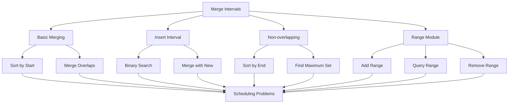
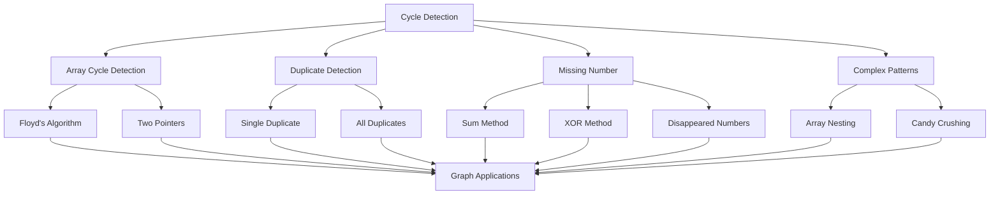

# Arrays Advanced Patterns: Dutch Flag, Kadane's, Merge Intervals & Cycle Detection

Building on our foundation of fundamental array patterns, this guide explores four advanced array techniques that are essential for solving complex coding interview problems. We'll cover **Dutch National Flag**, **Kadane's Algorithm**, **Merge Intervals**, and **Cycle Detection** - all with comprehensive Go implementations.

## Table of Contents
1. [Dutch National Flag Pattern](#dutch-national-flag-pattern)
2. [Kadane's Algorithm](#kadanes-algorithm)
3. [Merge Intervals](#merge-intervals)
4. [Cycle Detection](#cycle-detection)
5. [Combined Applications](#combined-applications)
6. [Practice Problems](#practice-problems)
7. [Real-World Applications](#real-world-applications)

---

## Dutch National Flag Pattern

The Dutch National Flag problem involves sorting an array containing three distinct values by partitioning them into three groups. This pattern is fundamental for three-way partitioning in quicksort and other sorting algorithms.

### Classic Dutch Flag Problem

```go
// Dutch National Flag - Sort Colors
package main

import (
	"fmt"
)

// SortColors sorts array with 0s, 1s, and 2s (red, white, blue)
// Time: O(n), Space: O(1)
func SortColors(nums []int) {
	// three pointers: low, mid, high
	low, mid, high := 0, 0, len(nums)-1
	
	for mid <= high {
		switch nums[mid] {
		case 0: // red
			nums[low], nums[mid] = nums[mid], nums[low]
			low++
			mid++
		case 1: // white
			mid++
		case 2: // blue
			nums[mid], nums[high] = nums[high], nums[mid]
			high--
		}
	}
}

// Example usage
func main() {
	nums := []int{2, 0, 2, 1, 1, 0}
	fmt.Printf("Original: %v\n", nums)
	SortColors(nums)
	fmt.Printf("Sorted: %v\n", nums)
	// Output: Sorted: [0 0 1 1 2 2]
}
```

### Partition with Pivot

```go
// Partition array based on pivot value
package main

import "fmt"

// PartitionArray partitions array into three parts: < pivot, = pivot, > pivot
// Returns [lowBoundary, highBoundary] indices
// Time: O(n), Space: O(1)
func PartitionArray(nums []int, pivot int) (int, int) {
	if len(nums) == 0 {
		return 0, -1
	}
	
	low, mid, high := 0, 0, len(nums)-1
	
	for mid <= high {
		if nums[mid] < pivot {
			nums[low], nums[mid] = nums[mid], nums[low]
			low++
			mid++
		} else if nums[mid] == pivot {
			mid++
		} else { // nums[mid] > pivot
			nums[mid], nums[high] = nums[high], nums[mid]
			high--
		}
	}
	
	return low - 1, high + 1
}

// Example usage
func main() {
	nums := []int{5, 2, 8, 1, 9, 3, 5, 7}
	pivot := 5
	
	lowBoundary, highBoundary := PartitionArray(nums, pivot)
	fmt.Printf("Array: %v, Pivot: %d\n", nums, pivot)
	fmt.Printf("Low boundary: %d, High boundary: %d\n", lowBoundary, highBoundary)
	fmt.Printf("Elements < %d: %v\n", pivot, nums[:lowBoundary+1])
	fmt.Printf("Elements = %d: %v\n", pivot, nums[lowBoundary+1:highBoundary])
	fmt.Printf("Elements > %d: %v\n", pivot, nums[highBoundary:])
}
```

### Segregate Elements

```go
// Segregate even and odd numbers
package main

import "fmt"

// SegregateEvenOdd segregates even and odd numbers
// All even numbers come before odd numbers
// Time: O(n), Space: O(1)
func SegregateEvenOdd(nums []int) {
	if len(nums) == 0 {
		return
	}
	
	left, right := 0, len(nums)-1
	
	for left < right {
		// Move left pointer to first odd number
		for left < right && nums[left]%2 == 0 {
			left++
		}
		
		// Move right pointer to first even number
		for left < right && nums[right]%2 == 1 {
			right--
		}
		
		// Swap if pointers haven't crossed
		if left < right {
			nums[left], nums[right] = nums[right], nums[left]
			left++
			right--
		}
	}
}

// Example usage
func main() {
	nums := []int{12, 34, 45, 9, 8, 90, 3}
	fmt.Printf("Original: %v\n", nums)
	SegregateEvenOdd(nums)
	fmt.Printf("Segregated: %v\n", nums)
	// Output: [12 34 8 90 9 45 3] (evens first, then odds)
}
```

### Visualization

```mermaid
graph TD
    A[Dutch National Flag] --> B[Three Way Partitioning]
    A --> C[Partition with Pivot]
    A --> D[Segregate Elements]
    
    B --> E[Sort Colors]
    B --> F[Quick Sort Partitioning]
    
    C --> G[Three Groups: < Pivot]
    C --> H[= Pivot]
    C --> I[> Pivot]
    
    D --> J[Even/Odd Segregation]
    D --> K[Positive/Negative]
    
    E --> L[0(1) Space]
    F --> L
    G --> L
    H --> L
    I --> L
    J --> L
    K --> L
```

---

## Kadane's Algorithm

Kadane's Algorithm efficiently finds the maximum subarray sum in O(n) time. It's one of the most elegant dynamic programming algorithms with applications in finance, signal processing, and optimization.

### Maximum Subarray Sum

```go
// Maximum Subarray Sum using Kadane's Algorithm
package main

import "fmt"

// MaxSubArraySum finds maximum sum of any contiguous subarray
// Time: O(n), Space: O(1)
func MaxSubArraySum(nums []int) int {
	if len(nums) == 0 {
		return 0
	}
	
	// Initialize current_max and global_max
	currentMax := nums[0]
	globalMax := nums[0]
	
	for i := 1; i < len(nums); i++ {
		// Either extend previous subarray or start new one
		currentMax = max(nums[i], currentMax+nums[i])
		
		// Update global maximum if current max is greater
		globalMax = max(globalMax, currentMax)
	}
	
	return globalMax
}

// Helper function for max of two integers
func max(a, b int) int {
	if a > b {
		return a
	}
	return b
}

// Find the actual subarray with maximum sum
func MaxSubArray(nums []int) []int {
	if len(nums) == 0 {
		return []int{}
	}
	
	currentMax := nums[0]
	globalMax := nums[0]
	start, end, currentStart := 0, 0, 0
	
	for i := 1; i < len(nums); i++ {
		// If adding current element decreases sum, start new subarray
		if currentMax+nums[i] < nums[i] {
			currentStart = i
			currentMax = nums[i]
		} else {
			currentMax += nums[i]
		}
		
		// Update global maximum and bounds
		if currentMax > globalMax {
			globalMax = currentMax
			start = currentStart
			end = i
		}
	}
	
	return nums[start : end+1]
}

// Example usage
func main() {
	nums := []int{-2, 1, -3, 4, -1, 2, 1, -5, 4}
	
	maxSum := MaxSubArraySum(nums)
	maxSubarray := MaxSubArray(nums)
	
	fmt.Printf("Array: %v\n", nums)
	fmt.Printf("Maximum subarray sum: %d\n", maxSum)
	fmt.Printf("Maximum subarray: %v\n", maxSubarray)
	// Output: Maximum subarray sum: 6
	//         Maximum subarray: [4 -1 2 1]
}
```

### Minimum Subarray Sum

```go
// Minimum Subarray Sum
package main

import "fmt"

// MinSubArraySum finds minimum sum of any contiguous subarray
// Time: O(n), Space: O(1)
func MinSubArraySum(nums []int) int {
	if len(nums) == 0 {
		return 0
	}
	
	currentMin := nums[0]
	globalMin := nums[0]
	
	for i := 1; i < len(nums); i++ {
		// Either extend previous subarray or start new one
		currentMin = min(nums[i], currentMin+nums[i])
		
		// Update global minimum if current min is smaller
		globalMin = min(globalMin, currentMin)
	}
	
	return globalMin
}

// Helper function for min of two integers
func min(a, b int) int {
	if a < b {
		return a
	}
	return b
}

// Example usage
func main() {
	nums := []int{-2, 1, -3, 4, -1, 2, 1, -5, 4}
	
	minSum := MinSubArraySum(nums)
	fmt.Printf("Array: %v\n", nums)
	fmt.Printf("Minimum subarray sum: %d\n", minSum)
	// Output: Minimum subarray sum: -6
}
```

### Maximum Product Subarray

```go
// Maximum Product Subarray
package main

import "fmt"

// MaxProductSubarray finds maximum product of any contiguous subarray
// Time: O(n), Space: O(1)
func MaxProductSubarray(nums []int) int {
	if len(nums) == 0 {
		return 0
	}
	
	maxProduct, minProduct, result := nums[0], nums[0], nums[0]
	
	for i := 1; i < len(nums); i++ {
		if nums[i] < 0 {
			// Swap max and min when number is negative
			maxProduct, minProduct = minProduct, maxProduct
		}
		
		// Update max and min products
		maxProduct = max(nums[i], maxProduct*nums[i])
		minProduct = min(nums[i], minProduct*nums[i])
		
		// Update result
		result = max(result, maxProduct)
	}
	
	return result
}

// Example usage
func main() {
	nums := []int{2, 3, -2, 4}
	
	maxProduct := MaxProductSubarray(nums)
	fmt.Printf("Array: %v\n", nums)
	fmt.Printf("Maximum product subarray: %d\n", maxProduct)
	// Output: Maximum product subarray: 6
}
```

### Circular Maximum Subarray

```go
// Circular Maximum Subarray Sum
package main

import "fmt"

// MaxCircularSubArraySum finds maximum sum in circular array
// Time: O(n), Space: O(1)
func MaxCircularSubArraySum(nums []int) int {
	if len(nums) == 0 {
		return 0
	}
	
	// Special case: all negative numbers
	if allNegative(nums) {
		return maxInArray(nums)
	}
	
	// Kadane's for normal case
	maxKadane := kadane(nums)
	
	// Calculate total sum and find minimum subarray sum
	total := 0
	minSubarray := 0
	for _, num := range nums {
		total += num
		minSubarray = min(minSubarray+num, num)
	}
	
	// Maximum circular sum = total - minimum subarray
	maxCircular := total - minSubarray
	
	// Return maximum of normal and circular
	return max(maxKadane, maxCircular)
}

func kadane(nums []int) int {
	currentMax, globalMax := nums[0], nums[0]
	
	for i := 1; i < len(nums); i++ {
		currentMax = max(nums[i], currentMax+nums[i])
		globalMax = max(globalMax, currentMax)
	}
	
	return globalMax
}

func allNegative(nums []int) bool {
	for _, num := range nums {
		if num > 0 {
			return false
		}
	}
	return true
}

func maxInArray(nums []int) int {
	maxVal := nums[0]
	for _, num := range nums {
		if num > maxVal {
			maxVal = num
		}
	}
	return maxVal
}

// Example usage
func main() {
	nums := []int{5, -3, 5}
	
	maxSum := MaxCircularSubArraySum(nums)
	fmt.Printf("Array: %v\n", nums)
	fmt.Printf("Maximum circular subarray sum: %d\n", maxSum)
	// Output: Maximum circular subarray sum: 10 (5 + 5)
}
```

### Visualization

```mermaid
graph TD
    A[Kadane's Algorithm] --> B[Maximum Subarray Sum]
    A --> C[Minimum Subarray Sum]
    A --> D[Maximum Product Subarray]
    A --> E[Circular Maximum Subarray]
    
    B --> F[O(n) Time]
    B --> G[O(1) Space]
    B --> H[DP Approach]
    
    C --> I[Similar to Maximum]
    D --> J[Track Both Max & Min]
    E --> K[Total - Min Subarray]
    
    F --> L[Financial Applications]
    G --> L
    H --> L
    I --> L
    J --> L
    K --> L
```

---

## Merge Intervals

The merge intervals pattern efficiently combines overlapping intervals. This pattern is crucial for scheduling problems, calendar management, and resource allocation.

### Basic Interval Merging

```go
// Basic Interval Merging
package main

import (
	"fmt"
	"sort"
)

// Interval represents a time interval [start, end]
type Interval struct {
	Start int
	End   int
}

// MergeIntervals merges overlapping intervals
// Time: O(n log n) due to sorting, Space: O(1) extra
func MergeIntervals(intervals []Interval) []Interval {
	if len(intervals) == 0 {
		return []Interval{}
	}
	
	// Sort intervals by start time
	sort.Slice(intervals, func(i, j int) bool {
		return intervals[i].Start < intervals[j].Start
	})
	
	merged := []Interval{}
	merged = append(merged, intervals[0])
	
	for i := 1; i < len(intervals); i++ {
		// Get the last interval in merged list
		last := &merged[len(merged)-1]
		current := intervals[i]
		
		// If current interval overlaps with last interval
		if current.Start <= last.End {
			// Merge by updating end time
			if current.End > last.End {
				last.End = current.End
			}
		} else {
			// No overlap, add current interval to result
			merged = append(merged, current)
		}
	}
	
	return merged
}

// Example usage
func main() {
	intervals := []Interval{
		{Start: 1, End: 3},
		{Start: 2, End: 6},
		{Start: 8, End: 10},
		{Start: 15, End: 18},
	}
	
	fmt.Printf("Original intervals: %v\n", intervals)
	merged := MergeIntervals(intervals)
	fmt.Printf("Merged intervals: %v\n", merged)
	// Output: Merged intervals: [{1 6} {8 10} {15 18}]
}
```

### Insert Interval

```go
// Insert Interval into existing merged intervals
package main

import "fmt"

// InsertInterval inserts a new interval into existing merged intervals
// Time: O(n), Space: O(1)
func InsertInterval(existing []Interval, newInterval Interval) []Interval {
	result := []Interval{}
	i := 0
	
	// Add all intervals that come before newInterval
	for i < len(existing) && existing[i].End < newInterval.Start {
		result = append(result, existing[i])
		i++
	}
	
	// Merge overlapping intervals
	for i < len(existing) && existing[i].Start <= newInterval.End {
		newInterval.Start = min(newInterval.Start, existing[i].Start)
		newInterval.End = max(newInterval.End, existing[i].End)
		i++
	}
	
	// Add the merged interval
	result = append(result, newInterval)
	
	// Add remaining intervals
	for i < len(existing) {
		result = append(result, existing[i])
		i++
	}
	
	return result
}

// Example usage
func main() {
	existing := []Interval{
		{Start: 1, End: 3},
		{Start: 6, End: 9},
	}
	newInterval := Interval{Start: 2, End: 5}
	
	fmt.Printf("Existing intervals: %v\n", existing)
	fmt.Printf("New interval: %v\n", newInterval)
	
	result := InsertInterval(existing, newInterval)
	fmt.Printf("Result after insertion: %v\n", result)
	// Output: Result after insertion: [{1 5} {6 9}]
}
```

### Non-overlapping Intervals

```go
// Non-overlapping Intervals - Find minimum removals
package main

import (
	"fmt"
	"sort"
)

// MinRemovalsToMakeIntervalsNonOverlapping finds minimum intervals to remove
// Time: O(n log n), Space: O(1)
func MinRemovalsToMakeIntervalsNonOverlapping(intervals []Interval) int {
	if len(intervals) <= 1 {
		return 0
	}
	
	// Sort by end time
	sort.Slice(intervals, func(i, j int) bool {
		return intervals[i].End < intervals[j].End
	})
	
	removals := 0
	lastEnd := intervals[0].End
	
	for i := 1; i < len(intervals); i++ {
		if intervals[i].Start < lastEnd {
			// Overlapping interval found, remove it
			removals++
		} else {
			// No overlap, update lastEnd
			lastEnd = intervals[i].End
		}
	}
	
	return removals
}

// FindNonOverlappingIntervals returns the maximum set of non-overlapping intervals
func FindNonOverlappingIntervals(intervals []Interval) []Interval {
	if len(intervals) == 0 {
		return []Interval{}
	}
	
	// Sort by end time
	sort.Slice(intervals, func(i, j int) bool {
		return intervals[i].End < intervals[j].End
	})
	
	result := []Interval{intervals[0]}
	lastEnd := intervals[0].End
	
	for i := 1; i < len(intervals); i++ {
		if intervals[i].Start >= lastEnd {
			result = append(result, intervals[i])
			lastEnd = intervals[i].End
		}
	}
	
	return result
}

// Example usage
func main() {
	intervals := []Interval{
		{Start: 1, End: 3},
		{Start: 2, End: 4},
		{Start: 3, End: 5},
		{Start: 7, End: 9},
	}
	
	minRemovals := MinRemovalsToMakeIntervalsNonOverlapping(intervals)
	nonOverlapping := FindNonOverlappingIntervals(intervals)
	
	fmt.Printf("Original intervals: %v\n", intervals)
	fmt.Printf("Minimum removals needed: %d\n", minRemovals)
	fmt.Printf("Maximum non-overlapping set: %v\n", nonOverlapping)
}
```

### Range Module

```go
// Range Module - Manage ranges with add and query operations
package main

import (
	"fmt"
	"sort"
)

// RangeModule manages a set of half-open intervals
type RangeModule struct {
	ranges []Interval
}

// NewRangeModule creates a new RangeModule
func NewRangeModule() *RangeModule {
	return &RangeModule{
		ranges: []Interval{},
	}
}

// AddRange adds the interval [left, right)
func (rm *RangeModule) AddRange(left, right int) {
	newInterval := Interval{Start: left, End: right}
	
	if len(rm.ranges) == 0 {
		rm.ranges = append(rm.ranges, newInterval)
		return
	}
	
	// Find position to insert and merge
	result := []Interval{}
	i := 0
	
	// Add intervals that come before new interval
	for i < len(rm.ranges) && rm.ranges[i].End < newInterval.Start {
		result = append(result, rm.ranges[i])
		i++
	}
	
	// Merge overlapping intervals
	start := newInterval.Start
	end := newInterval.End
	
	for i < len(rm.ranges) && rm.ranges[i].Start <= end {
		start = min(start, rm.ranges[i].Start)
		end = max(end, rm.ranges[i].End)
		i++
	}
	
	// Add merged interval
	result = append(result, Interval{Start: start, End: end})
	
	// Add remaining intervals
	for i < len(rm.ranges) {
		result = append(result, rm.ranges[i])
		i++
	}
	
	rm.ranges = result
}

// QueryRange checks if query interval is fully covered
func (rm *RangeModule) QueryRange(left, right int) bool {
	// Binary search to find the range that might contain left
	idx := sort.Search(len(rm.ranges), func(i int) bool {
		return rm.ranges[i].End >= left
	})
	
	if idx == len(rm.ranges) {
		return false
	}
	
	return rm.ranges[idx].Start <= left && rm.ranges[idx].End >= right
}

// RemoveRange removes the interval [left, right)
func (rm *RangeModule) RemoveRange(left, right int) {
	newRanges := []Interval{}
	
	for _, interval := range rm.ranges {
		if right <= interval.Start || left >= interval.End {
			// No overlap, keep as is
			newRanges = append(newRanges, interval)
		} else {
			// Overlap exists, split if necessary
			if left > interval.Start {
				// Left part remains
				newRanges = append(newRanges, Interval{Start: interval.Start, End: left})
			}
			if right < interval.End {
				// Right part remains
				newRanges = append(newRanges, Interval{Start: right, End: interval.End})
			}
		}
	}
	
	rm.ranges = newRanges
}

// GetRanges returns all current ranges
func (rm *RangeModule) GetRanges() []Interval {
	return rm.ranges
}

// Example usage
func main() {
	rm := NewRangeModule()
	
	// Add ranges
	rm.AddRange(10, 20)
	rm.AddRange(15, 25)
	rm.AddRange(30, 40)
	
	fmt.Printf("After adding ranges: %v\n", rm.GetRanges())
	
	// Query ranges
	fmt.Printf("Query [14, 16): %t\n", rm.QueryRange(14, 16))
	fmt.Printf("Query [16, 30): %t\n", rm.QueryRange(16, 30))
	
	// Remove range
	rm.RemoveRange(15, 17)
	fmt.Printf("After removing [15, 17): %v\n", rm.GetRanges())
}
```

### Visualization



---

## Cycle Detection

Cycle detection patterns are fundamental for detecting duplicates, finding loops, and identifying circular dependencies. These techniques are crucial in graph theory and linked list problems.

### Array Cycle Detection

```go
// Array Cycle Detection
package main

import "fmt"

// FindCycleInArray finds the start of a cycle in array where nums[i] = nums[j] implies i != j
// Uses Floyd's Tortoise and Hare algorithm
// Time: O(n), Space: O(1)
func FindCycleInArray(nums []int) int {
	if len(nums) == 0 {
		return -1
	}
	
	// Phase 1: Find intersection point
	slow, fast := nums[0], nums[0]
	
	for {
		slow = nums[slow]
		fast = nums[nums[fast]]
		if slow == fast {
			break
		}
	}
	
	// Phase 2: Find entrance to cycle
	slow = nums[0]
	for slow != fast {
		slow = nums[slow]
		fast = nums[fast]
	}
	
	return slow
}

// Example usage
func main() {
	// Example 1: nums[i] = nums[j] pattern
	nums1 := []int{3, 1, 3, 4, 2} // 3 at index 0 and 2
	cycle := FindCycleInArray(nums1)
	fmt.Printf("Array: %v, Cycle starts at index: %d\n", nums1, cycle)
	
	// Example 2: Duplicate detection in array
	nums2 := []int{1, 3, 4, 2, 2}
	duplicate := FindCycleInArray(nums2)
	fmt.Printf("Array: %v, Duplicate number: %d\n", nums2, duplicate)
}
```

### Duplicate Number Finding

```go
// Find Duplicate Number without modifying array
package main

import "fmt"

// FindDuplicateUsingCycle finds duplicate number using cycle detection
// Assumes exactly one duplicate exists
// Time: O(n), Space: O(1)
func FindDuplicateUsingCycle(nums []int) int {
	if len(nums) <= 1 {
		return -1
	}
	
	// Phase 1: Find intersection point
	slow, fast := nums[0], nums[0]
	
	for {
		slow = nums[slow]
		fast = nums[nums[fast]]
		if slow == fast {
			break
		}
	}
	
	// Phase 2: Find entrance to cycle (duplicate)
	slow = nums[0]
	for slow != fast {
		slow = nums[slow]
		fast = nums[fast]
	}
	
	return slow
}

// FindAllDuplicates finds all duplicate numbers in array
// Time: O(n), Space: O(1)
func FindAllDuplicates(nums []int) []int {
	duplicates := []int{}
	
	for i := 0; i < len(nums); i++ {
		index := abs(nums[i]) - 1
		
		if nums[index] < 0 {
			// Already visited, this is a duplicate
			duplicates = append(duplicates, abs(nums[i]))
		} else {
			nums[index] = -nums[index]
		}
	}
	
	return duplicates
}

func abs(x int) int {
	if x < 0 {
		return -x
	}
	return x
}

// Example usage
func main() {
	// Find single duplicate
	nums1 := []int{1, 3, 4, 2, 2}
	duplicate := FindDuplicateUsingCycle(nums1)
	fmt.Printf("Single duplicate in %v: %d\n", nums1, duplicate)
	
	// Find all duplicates
	nums2 := []int{4, 3, 2, 7, 8, 2, 3, 1}
	duplicates := FindAllDuplicates(nums2)
	fmt.Printf("All duplicates in %v: %v\n", nums2, duplicates)
}
```

### Missing Number

```go
// Find Missing Number
package main

import "fmt"

// FindMissingNumber finds the missing number in range [0, n]
// Time: O(n), Space: O(1)
func FindMissingNumber(nums []int) int {
	n := len(nums)
	expectedSum := n * (n + 1) / 2
	actualSum := 0
	
	for _, num := range nums {
		actualSum += num
	}
	
	return expectedSum - actualSum
}

// FindMissingNumberUsingXOR finds missing number using XOR
// Time: O(n), Space: O(1)
func FindMissingNumberUsingXOR(nums []int) int {
	n := len(nums)
	result := n
	
	for i := 0; i < n; i++ {
		result ^= i ^ nums[i]
	}
	
	return result
}

// FindDisappearedNumbers finds all numbers that disappeared
// Time: O(n), Space: O(1) extra space
func FindDisappearedNumbers(nums []int) []int {
	disappeared := []int{}
	
	// Mark numbers that are present
	for i := 0; i < len(nums); i++ {
		index := abs(nums[i]) - 1
		if nums[index] > 0 {
			nums[index] = -nums[index]
		}
	}
	
	// Find unmarked positions
	for i := 0; i < len(nums); i++ {
		if nums[i] > 0 {
			disappeared = append(disappeared, i+1)
		}
	}
	
	return disappeared
}

// Example usage
func main() {
	nums := []int{9, 6, 4, 2, 3, 5, 7, 0, 1}
	
	missing := FindMissingNumber(nums)
	missingXOR := FindMissingNumberUsingXOR(nums)
	disappeared := FindDisappearedNumbers(nums)
	
	fmt.Printf("Array: %v\n", nums)
	fmt.Printf("Missing number: %d\n", missing)
	fmt.Printf("Missing number (XOR): %d\n", missingXOR)
	fmt.Printf("Disappeared numbers: %v\n", disappeared)
}
```

### Complex Cycle Detection

```go
// Complex Cycle Detection Problems
package main

import "fmt"

// ArrayNesting performs array nesting problem
// Find longest set of indices forming nested array
// Time: O(n), Space: O(1)
func ArrayNesting(nums []int) int {
	maxSize := 0
	
	for i := 0; i < len(nums); i++ {
		if nums[i] >= 0 { // Not visited
			size := 0
			j := i
			
			for nums[j] >= 0 {
				nums[j] = -nums[j] - 1 // Mark as visited
				j = -nums[j] - 1
				size++
			}
			
			maxSize = max(maxSize, size)
		}
	}
	
	return maxSize
}

// CandyCrusher simulates candy crushing game
// Time: O(n^2) worst case, Space: O(1)
func CandyCrusher(candy []int) int {
	crushed := false
	
	for {
		crushed = false
		newCandy := []int{}
		
		i := 0
		for i < len(candy) {
			if i < len(candy)-2 && candy[i] == candy[i+1] && candy[i+1] == candy[i+2] {
				// Found three or more consecutive same candies
				crushed = true
				val := candy[i]
				
				// Skip all consecutive same candies
				for i < len(candy) && candy[i] == val {
					i++
				}
			} else {
				newCandy = append(newCandy, candy[i])
				i++
			}
		}
		
		candy = newCandy
		if !crushed {
			break
		}
	}
	
	return len(candy)
}

// Example usage
func main() {
	// Array nesting
	nums := []int{5, 4, 0, 3, 1, 6, 2}
	maxNesting := ArrayNesting(nums)
	fmt.Printf("Array: %v, Maximum nesting size: %d\n", nums, maxNesting)
	
	// Candy crushing
	candy := []int{1, 1, 1, 2, 2, 2, 1, 1, 1}
	remaining := CandyCrusher(candy)
	fmt.Printf("Candy: %v, Remaining after crushing: %d\n", candy, remaining)
}
```

### Visualization



---

## Combined Applications

### Advanced Problem: Meeting Scheduler

```go
// Advanced: Meeting Scheduler using Multiple Patterns
package main

import (
	"fmt"
	"sort"
)

// Meeting represents a meeting time
type Meeting struct {
	Start int
	End   int
}

// FindMeetingSlots finds slots where all attendees are available
// Uses merge intervals and binary search patterns
// Time: O(n log n), Space: O(n)
func FindMeetingSlots(meetings []Meeting, duration int) []Meeting {
	if len(meetings) == 0 || duration <= 0 {
		return []Meeting{}
	}
	
	// Sort meetings by start time
	sort.Slice(meetings, func(i, j int) bool {
		return meetings[i].Start < meetings[j].Start
	})
	
	// Merge overlapping meetings
	merged := mergeMeetingIntervals(meetings)
	
	// Find free slots of at least duration
	slots := []Meeting{}
	for i := 0; i < len(merged)-1; i++ {
		currentEnd := merged[i].End
		nextStart := merged[i+1].Start
		
		if nextStart-currentEnd >= duration {
			slots = append(slots, Meeting{Start: currentEnd, End: currentEnd + duration})
		}
	}
	
	return slots
}

func mergeMeetingIntervals(meetings []Meeting) []Meeting {
	if len(meetings) == 0 {
		return []Meeting{}
	}
	
	merged := []Interval{}
	for _, meeting := range meetings {
		merged = append(merged, Interval{Start: meeting.Start, End: meeting.End})
	}
	
	// Use our earlier merge intervals logic
	result := mergeIntervals(merged)
	
	converted := []Meeting{}
	for _, interval := range result {
		converted = append(converted, Meeting{Start: interval.Start, End: interval.End})
	}
	
	return converted
}

func mergeIntervals(intervals []Interval) []Interval {
	if len(intervals) == 0 {
		return []Interval{}
	}
	
	sort.Slice(intervals, func(i, j int) bool {
		return intervals[i].Start < intervals[j].Start
	})
	
	merged := []Interval{intervals[0]}
	
	for i := 1; i < len(intervals); i++ {
		last := &merged[len(merged)-1]
		current := intervals[i]
		
		if current.Start <= last.End {
			if current.End > last.End {
				last.End = current.End
			}
		} else {
			merged = append(merged, current)
		}
	}
	
	return merged
}

// Example usage
func main() {
	meetings := []Meeting{
		{Start: 0, End: 30},
		{Start: 5, End: 10},
		{Start: 15, End: 20},
		{Start: 30, End: 40},
	}
	duration := 15
	
	slots := FindMeetingSlots(meetings, duration)
	fmt.Printf("Meetings: %v\n", meetings)
	fmt.Printf("Free slots of duration %d: %v\n", duration, slots)
}
```

---

## Practice Problems

### Easy Problems
1. **Sort Colors** - Dutch National Flag problem
2. **Maximum Subarray** - Basic Kadane's algorithm
3. **Merge Intervals** - Basic interval merging
4. **Find Duplicate Number** - Simple cycle detection

### Medium Problems
1. **Maximum Product Subarray** - Kadane's with multiplication
2. **Insert Interval** - Complex interval manipulation
3. **Circular Array Maximum** - Kadane's for circular arrays
4. **Range Module** - Advanced interval operations

### Hard Problems
1. **Meeting Rooms II** - Merge intervals with multiple patterns
2. **Maximum Window Size** - Advanced sliding window with intervals
3. **Count Inversions** - Merge sort with cycle detection concepts
4. **Complex Cycle Detection** - Multiple array transformations

---

## Real-World Applications

### Dutch National Flag
- **Database Partitioning**: Partitioning data by categories
- **Image Processing**: Color segmentation algorithms
- **Load Balancing**: Distributing requests across different server types

### Kadane's Algorithm
- **Financial Analysis**: Maximum profit/loss analysis
- **Signal Processing**: Finding maximum signal segments
- **Inventory Management**: Optimal stock purchase decisions

### Merge Intervals
- **Calendar Systems**: Scheduling and booking systems
- **Resource Allocation**: CPU/memory usage optimization
- **Project Management**: Task scheduling and dependency resolution

### Cycle Detection
- **Version Control**: Detecting circular dependencies in git
- **Database Design**: Identifying circular references
- **Network Analysis**: Finding loops in network topology

---

## Performance Summary

| Pattern | Time Complexity | Space Complexity | Key Advantages |
|---------|----------------|------------------|----------------|
| Dutch National Flag | O(n) | O(1) | In-place, stable |
| Kadane's Algorithm | O(n) | O(1) | Linear time, optimal |
| Merge Intervals | O(n log n) | O(1) or O(n) | Handles overlaps |
| Cycle Detection | O(n) | O(1) | Memory efficient |

These advanced array patterns form the foundation for solving complex algorithmic problems. Mastering them will significantly enhance your ability to tackle challenging coding interviews and real-world optimization problems.
