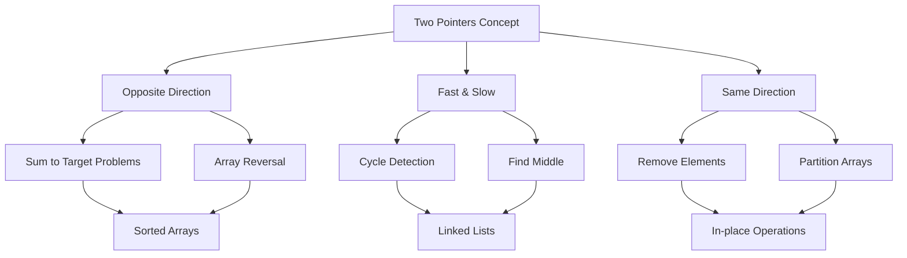
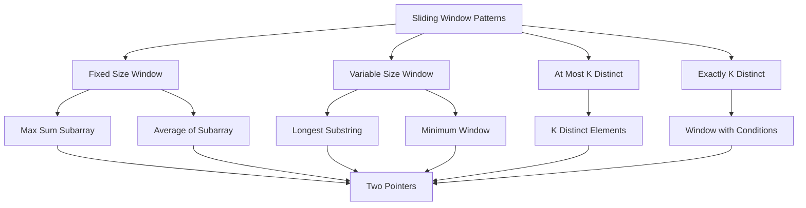

# Mastering Arrays & Two Pointers: Fundamental DSA Patterns

Arrays are the foundation of data structures, and mastering array manipulation techniques is crucial for technical interviews and competitive programming. In this comprehensive guide, we'll explore four essential array patterns: **Two Pointers**, **Sliding Window**, **Prefix Sum**, and **Binary Search in Arrays** - all implemented in Go.

## Table of Contents
1. [Two Pointers Pattern](#two-pointers-pattern)
2. [Sliding Window Technique](#sliding-window-technique)
3. [Prefix Sum Pattern](#prefix-sum-pattern)
4. [Binary Search in Arrays](#binary-search-in-arrays)
5. [Practice Problems](#practice-problems)
6. [Real-World Applications](#real-world-applications)

---

## Two Pointers Pattern

The two pointers technique uses two indices to traverse an array simultaneously, often from opposite ends or at different speeds. This pattern is extremely efficient for solving problems involving sorted arrays or string manipulation.

### Types of Two Pointers

#### 1. Opposite Direction Pointers
**Use Case**: When you need to find pairs that sum to a target or reverse an array.

```go
// Opposite Direction Pointers - Two Sum in Sorted Array
package main

import (
	"fmt"
)

// TwoSumSorted finds two numbers in sorted array that sum to target
// Time: O(n), Space: O(1)
func TwoSumSorted(arr []int, target int) (int, int) {
	left, right := 0, len(arr)-1
	
	for left < right {
		currentSum := arr[left] + arr[right]
		
		if currentSum == target {
			return left, right
		} else if currentSum < target {
			left++
		} else {
			right--
		}
	}
	
	return -1, -1
}

// Example usage
func main() {
	arr := []int{1, 2, 3, 4, 6, 8, 11}
	target := 10
	
	left, right := TwoSumSorted(arr, target)
	if left != -1 {
		fmt.Printf("Found indices: [%d, %d] -> %d + %d = %d\n", 
			left, right, arr[left], arr[right], target)
	} else {
		fmt.Println("No solution found")
	}
	
	// Output: Found indices: [3, 4] -> 4 + 6 = 10
}
```

#### 2. Fast and Slow Pointers
**Use Case**: Finding cycle in array, finding middle element, or finding intersection.

```go
// Fast and Slow Pointers - Find Duplicate Number
package main

import "fmt"

// FindDuplicate finds duplicate number using Floyd's Tortoise and Hare algorithm
// Time: O(n), Space: O(1)
func FindDuplicate(nums []int) int {
	// Phase 1: Find intersection point
	slow, fast := nums[0], nums[0]
	
	for {
		slow = nums[slow]
		fast = nums[nums[fast]]
		if slow == fast {
			break
		}
	}
	
	// Phase 2: Find entrance to cycle
	slow = nums[0]
	for slow != fast {
		slow = nums[slow]
		fast = nums[fast]
	}
	
	return slow
}

// Example usage
func main() {
	nums := []int{1, 3, 4, 2, 2}
	duplicate := FindDuplicate(nums)
	fmt.Printf("Duplicate number: %d\n", duplicate)
	// Output: Duplicate number: 2
}
```

#### 3. Same Direction Pointers
**Use Case**: Removing elements, partitioning arrays, or finding subarrays.

```go
// Same Direction Pointers - Remove Elements
package main

import "fmt"

// RemoveElements removes all instances of val in-place
// Returns new length of array
// Time: O(n), Space: O(1)
func RemoveElements(nums []int, val int) int {
	left := 0
	for right := 0; right < len(nums); right++ {
		if nums[right] != val {
			nums[left] = nums[right]
			left++
		}
	}
	return left
}

// Example usage
func main() {
	nums := []int{3, 2, 2, 3}
	val := 3
	newLength := RemoveElements(nums, val)
	fmt.Printf("New length: %d, Array: %v\n", newLength, nums[:newLength])
	// Output: New length: 2, Array: [2 2]
}
```

### Array Reversal

```go
// Reverse Array using Two Pointers
package main

import "fmt"

// ReverseArray reverses array in-place
// Time: O(n), Space: O(1)
func ReverseArray(arr []int) {
	left, right := 0, len(arr)-1
	
	for left < right {
		arr[left], arr[right] = arr[right], arr[left]
		left++
		right--
	}
}

// Example usage
func main() {
	arr := []int{1, 2, 3, 4, 5}
	fmt.Printf("Original: %v\n", arr)
	ReverseArray(arr)
	fmt.Printf("Reversed: %v\n", arr)
	// Output: Original: [1 2 3 4 5]
	//         Reversed: [5 4 3 2 1]
}
```

### Visualization



---

## Sliding Window Technique

The sliding window pattern maintains a "window" that slides over the data structure, allowing us to process subarrays/substrings efficiently. This technique is particularly powerful for substring and subarray problems.

### Fixed Size Window

```go
// Fixed Size Window - Maximum Sum of Subarray of Size K
package main

import (
	"fmt"
)

// MaxSumSubarray finds maximum sum of any subarray of size k
// Time: O(n), Space: O(1)
func MaxSumSubarray(arr []int, k int) int {
	if len(arr) < k {
		return 0
	}
	
	// Calculate sum of first window
	windowSum := 0
	for i := 0; i < k; i++ {
		windowSum += arr[i]
	}
	maxSum := windowSum
	
	// Slide the window
	for i := 0; i < len(arr)-k; i++ {
		windowSum = windowSum - arr[i] + arr[i+k]
		if windowSum > maxSum {
			maxSum = windowSum
		}
	}
	
	return maxSum
}

// Example usage
func main() {
	arr := []int{1, 4, 2, 9, 5, 10, 3}
	k := 3
	result := MaxSumSubarray(arr, k)
	fmt.Printf("Maximum sum of subarray of size %d: %d\n", k, result)
	// Output: Maximum sum of subarray of size 3: 19 (9 + 5 + 10)
}
```

### Variable Size Window - Longest Substring

```go
// Variable Size Window - Longest Substring Without Repeating Characters
package main

import "fmt"

// LengthOfLongestSubstring finds length of longest substring without repeating characters
// Time: O(n), Space: O(min(m,n)) where m is charset size
func LengthOfLongestSubstring(s string) int {
	if len(s) == 0 {
		return 0
	}
	
	charSet := make(map[byte]bool)
	left := 0
	maxLength := 0
	
	for right := 0; right < len(s); right++ {
		// If character is already in current window, shrink from left
		for charSet[s[right]] {
			delete(charSet, s[left])
			left++
		}
		
		// Add current character to set
		charSet[s[right]] = true
		
		// Update max length
		if right-left+1 > maxLength {
			maxLength = right - left + 1
		}
	}
	
	return maxLength
}

// Example usage
func main() {
	s := "abcabcbb"
	result := LengthOfLongestSubstring(s)
	fmt.Printf("Length of longest substring: %d\n", result)
	// Output: Length of longest substring: 3 ("abc")
}
```

### Minimum Window Substring

```go
// Minimum Window Substring - Advanced Sliding Window
package main

import (
	"fmt"
	"math"
)

// MinWindowSubstring finds minimum window containing all characters from t
// Time: O(n + m), Space: O(m) where m is charset size
func MinWindowSubstring(s, t string) string {
	if len(t) == 0 || len(s) == 0 {
		return ""
	}
	
	// Count frequency of characters in t
	dictT := make(map[byte]int)
	for i := 0; i < len(t); i++ {
		dictT[t[i]]++
	}
	
	required := len(dictT) // Number of unique characters in t with correct frequency
	
	// Left and right pointer
	left, right := 0, 0
	formed := 0 // Number of unique characters with correct frequency
	
	// Dictionary to keep count of characters in current window
	windowCounts := make(map[byte]int)
	
	// ans tuple stores (window length, left, right)
	ans := math.Inf(1), -1, -1
	
	for right < len(s) {
		// Add one character from the right to the window
		char := s[right]
		windowCounts[char]++
		
		// Check if the frequency of current character matches desired count
		if freq, exists := dictT[char]; exists && windowCounts[char] == freq {
			formed++
		}
		
		// Contract the window until it's no longer 'desirable'
		for left <= right && formed == required {
			char := s[left]
			
			// Save the smallest window
			if float64(right-left+1) < ans[0] {
				ans = float64(right-left+1), float64(left), float64(right)
			}
			
			// The character at the left pointer is no longer part of the window
			windowCounts[char]--
			if freq, exists := dictT[char]; exists && windowCounts[char] < freq {
				formed--
			}
			
			// Move the left pointer ahead for the next iteration
			left++
		}
		
		// Keep expanding the window once we are done contracting
		right++
	}
	
	if ans[0] == math.Inf(1) {
		return ""
	}
	
	start, end := int(ans[1]), int(ans[2])
	return s[start : end+1]
}

// Example usage
func main() {
	s := "ADOBECODEBANC"
	t := "ABC"
	result := MinWindowSubstring(s, t)
	fmt.Printf("Minimum window: '%s'\n", result)
	// Output: Minimum window: 'BANC'
}
```

### At Most K Distinct Elements

```go
// At Most K Distinct Elements
package main

import "fmt"

// LengthOfLongestSubstringKDistinct finds length of longest substring with at most k distinct characters
// Time: O(n), Space: O(k)
func LengthOfLongestSubstringKDistinct(s string, k int) int {
	if k == 0 || len(s) == 0 {
		return 0
	}
	
	charCount := make(map[byte]int)
	left := 0
	maxLength := 0
	
	for right := 0; right < len(s); right++ {
		char := s[right]
		charCount[char]++
		
		// If we have more than k distinct characters, shrink from left
		for len(charCount) > k {
			leftChar := s[left]
			charCount[leftChar]--
			if charCount[leftChar] == 0 {
				delete(charCount, leftChar)
			}
			left++
		}
		
		// Update max length
		if right-left+1 > maxLength {
			maxLength = right - left + 1
		}
	}
	
	return maxLength
}

// Example usage
func main() {
	s := "araaci"
	k := 2
	result := LengthOfLongestSubstringKDistinct(s, k)
	fmt.Printf("Length of longest substring with %d distinct chars: %d\n", k, result)
	// Output: Length of longest substring with 2 distinct chars: 4 ("araa")
}
```

### Visualization



---

## Prefix Sum Pattern

Prefix sum helps answer range queries efficiently by preprocessing the array into cumulative sums.

### Basic Prefix Sum

```go
// Prefix Sum Pattern
package main

import (
	"fmt"
)

// PreprocessPrefixSum creates prefix sum array
// Time: O(n), Space: O(n)
func PreprocessPrefixSum(arr []int) []int {
	prefix := make([]int, len(arr)+1)
	for i := 0; i < len(arr); i++ {
		prefix[i+1] = prefix[i] + arr[i]
	}
	return prefix
}

// RangeSumQuery gets sum of subarray from left to right (inclusive)
// Time: O(1), Space: O(1)
func RangeSumQuery(prefix []int, left, right int) int {
	return prefix[right+1] - prefix[left]
}

// Example usage
func main() {
	arr := []int{1, 2, 3, 4, 5}
	prefix := PreprocessPrefixSum(arr)
	
	// Query sum from index 1 to 3
	result := RangeSumQuery(prefix, 1, 3)
	fmt.Printf("Sum from index 1 to 3: %d\n", result)
	// Output: Sum from index 1 to 3: 9 (2 + 3 + 4)
}
```

### 2D Prefix Sum

```go
// 2D Prefix Sum Pattern
package main

import "fmt"

// Build2DPrefixSum builds 2D prefix sum matrix
// Time: O(m*n), Space: O(m*n)
func Build2DPrefixSum(matrix [][]int) [][]int {
	if len(matrix) == 0 || len(matrix[0]) == 0 {
		return [][]int{}
	}
	
	rows, cols := len(matrix), len(matrix[0])
	prefix := make([][]int, rows+1)
	for i := range prefix {
		prefix[i] = make([]int, cols+1)
	}
	
	for i := 1; i <= rows; i++ {
		for j := 1; j <= cols; j++ {
			prefix[i][j] = matrix[i-1][j-1] + prefix[i-1][j] + prefix[i][j-1] - prefix[i-1][j-1]
		}
	}
	
	return prefix
}

// Query2DSum gets sum of rectangle from (row1, col1) to (row2, col2) (inclusive)
// Time: O(1), Space: O(1)
func Query2DSum(prefix [][]int, row1, col1, row2, col2 int) int {
	return prefix[row2+1][col2+1] - prefix[row1][col2+1] - prefix[row2+1][col1] + prefix[row1][col1]
}

// Example usage
func main() {
	matrix := [][]int{
		{1, 2, 3},
		{4, 5, 6},
		{7, 8, 9},
	}
	prefix := Build2DPrefixSum(matrix)
	
	// Query sum of rectangle from (0,0) to (1,2)
	result := Query2DSum(prefix, 0, 0, 1, 2)
	fmt.Printf("Sum of rectangle (0,0) to (1,2): %d\n", result)
	// Output: Sum of rectangle (0,0) to (1,2): 21 (1+2+3+4+5+6)
}
```

### Subarray Sum Equals K

```go
// Subarray Sum Equals K
package main

import "fmt"

// SubarraySumEqualsK counts number of subarrays that sum to k
// Time: O(n), Space: O(n)
func SubarraySumEqualsK(nums []int, k int) int {
	count := 0
	prefixSum := 0
	prefixMap := make(map[int]int)
	prefixMap[0] = 1 // Empty subarray sum 0
	
	for _, num := range nums {
		prefixSum += num
		
		// If (prefixSum - k) exists in map, we found subarrays
		if freq, exists := prefixMap[prefixSum-k]; exists {
			count += freq
		}
		
		// Add current prefixSum to map
		prefixMap[prefixSum]++
	}
	
	return count
}

// Example usage
func main() {
	nums := []int{1, 1, 1}
	k := 2
	result := SubarraySumEqualsK(nums, k)
	fmt.Printf("Number of subarrays summing to %d: %d\n", k, result)
	// Output: Number of subarrays summing to 2: 2 ([1,1] at indices 0-1 and 1-2)
}
```

### Visualization

```mermaid
graph TD
    A[Prefix Sum Pattern] --> B[1D Prefix Sum]
    A --> C[2D Prefix Sum]
    A --> D[Subarray Problems]
    
    B --> E[Range Sum Query]
    B --> F[Subarray Sum Equals K]
    
    C --> G[Rectangle Sum Query]
    C --> H[2D Matrix Problems]
    
    D --> I[Running Sum]
    D --> J[Range Query with Updates]
    
    E --> K[O(1) Query]
    F --> K
    G --> K
    H --> K
    I --> K
    J --> K
```

---

## Binary Search in Arrays

Binary search is fundamental for efficient searching in sorted arrays. Let's explore different variations.

### Standard Binary Search

```go
// Binary Search Implementation
package main

import "fmt"

// BinarySearch finds target in sorted array
// Time: O(log n), Space: O(1)
func BinarySearch(arr []int, target int) int {
	left, right := 0, len(arr)-1
	
	for left <= right {
		mid := left + (right-left)/2
		
		if arr[mid] == target {
			return mid
		} else if arr[mid] < target {
			left = mid + 1
		} else {
			right = mid - 1
		}
	}
	
	return -1
}

// Example usage
func main() {
	arr := []int{1, 3, 5, 7, 9, 11, 13, 15}
	target := 7
	
	result := BinarySearch(arr, target)
	if result != -1 {
		fmt.Printf("Found %d at index %d\n", target, result)
	} else {
		fmt.Printf("%d not found in array\n", target)
	}
	// Output: Found 7 at index 3
}
```

### Lower Bound and Upper Bound

```go
// Lower and Upper Bound Binary Search
package main

import "fmt"

// LowerBound finds first index where element >= target
// Time: O(log n), Space: O(1)
func LowerBound(arr []int, target int) int {
	left, right := 0, len(arr)
	
	for left < right {
		mid := left + (right-left)/2
		
		if arr[mid] < target {
			left = mid + 1
		} else {
			right = mid
		}
	}
	
	return left
}

// UpperBound finds first index where element > target
// Time: O(log n), Space: O(1)
func UpperBound(arr []int, target int) int {
	left, right := 0, len(arr)
	
	for left < right {
		mid := left + (right-left)/2
		
		if arr[mid] <= target {
			left = mid + 1
		} else {
			right = mid
		}
	}
	
	return left
}

// Example usage
func main() {
	arr := []int{1, 3, 5, 7, 7, 7, 9, 11}
	target := 7
	
	lower := LowerBound(arr, target)
	upper := UpperBound(arr, target)
	
	fmt.Printf("Lower bound of %d: %d\n", target, lower)
	fmt.Printf("Upper bound of %d: %d\n", target, upper)
	fmt.Printf("Count of %d: %d\n", target, upper-lower)
	// Output: Lower bound of 7: 3
	//         Upper bound of 7: 6
	//         Count of 7: 3
}
```

### Search in Rotated Array

```go
// Search in Rotated Sorted Array
package main

import "fmt"

// SearchRotatedArray searches in rotated sorted array
// Time: O(log n), Space: O(1)
func SearchRotatedArray(arr []int, target int) int {
	left, right := 0, len(arr)-1
	
	for left <= right {
		mid := left + (right-left)/2
		
		if arr[mid] == target {
			return mid
		}
		
		// Check which side is normally sorted
		if arr[left] <= arr[mid] { // Left side is sorted
			if arr[left] <= target && target < arr[mid] {
				right = mid - 1
			} else {
				left = mid + 1
			}
		} else { // Right side is sorted
			if arr[mid] < target && target <= arr[right] {
				left = mid + 1
			} else {
				right = mid - 1
			}
		}
	}
	
	return -1
}

// Example usage
func main() {
	arr := []int{4, 5, 6, 7, 0, 1, 2}
	target := 0
	
	result := SearchRotatedArray(arr, target)
	if result != -1 {
		fmt.Printf("Found %d at index %d\n", target, result)
	} else {
		fmt.Printf("%d not found in array\n", target)
	}
	// Output: Found 0 at index 4
}
```

### Find Peak Element

```go
// Find Peak Element
package main

import "fmt"

// FindPeakElement finds a peak element (element greater than neighbors)
// Time: O(log n), Space: O(1)
func FindPeakElement(arr []int) int {
	left, right := 0, len(arr)-1
	
	for left < right {
		mid := left + (right-left)/2
		
		if arr[mid] < arr[mid+1] {
			left = mid + 1
		} else {
			right = mid
		}
	}
	
	return left
}

// Example usage
func main() {
	arr := []int{1, 3, 8, 12, 4, 2}
	peak := FindPeakElement(arr)
	fmt.Printf("Peak element at index %d with value %d\n", peak, arr[peak])
	// Output: Peak element at index 3 with value 12
}
```

### Visualization

```mermaid
graph TD
    A[Binary Search Patterns] --> B[Standard Binary Search]
    A --> C[Lower/Upper Bound]
    A --> D[Rotated Array Search]
    A --> E[Peak Element]
    A --> F[Search in Matrix]
    
    B --> G[Sorted Arrays]
    C --> G
    D --> G
    E --> G
    F --> G
    
    G --> H[O(log n) Time]
    I --> H
    J --> H
    K --> H
    L --> H
```

---

## Complete Working Examples

### Combined Demo Program

```go
// Complete Arrays & Two Pointers Demo
package main

import "fmt"

func main() {
	fmt.Println("=== ARRAYS & TWO POINTERS DEMO ===\n")
	
	// Two Pointers Demo
	fmt.Println("1. TWO POINTERS:")
	arr1 := []int{1, 2, 3, 4, 6, 8, 11}
	target := 10
	left, right := TwoSumSorted(arr1, target)
	fmt.Printf("Array: %v, Target: %d\n", arr1, target)
	fmt.Printf("Two Sum Result: indices [%d, %d] = %d + %d = %d\n\n", 
		left, right, arr1[left], arr1[right], target)
	
	// Sliding Window Demo
	fmt.Println("2. SLIDING WINDOW:")
	arr2 := []int{1, 4, 2, 9, 5, 10, 3}
	k := 3
	maxSum := MaxSumSubarray(arr2, k)
	fmt.Printf("Array: %v, Window size: %d\n", arr2, k)
	fmt.Printf("Maximum sum subarray: %d\n\n", maxSum)
	
	// Prefix Sum Demo
	fmt.Println("3. PREFIX SUM:")
	arr3 := []int{1, 2, 3, 4, 5}
	prefix := PreprocessPrefixSum(arr3)
	sum := RangeSumQuery(prefix, 1, 3)
	fmt.Printf("Array: %v\n", arr3)
	fmt.Printf("Prefix sum: %v\n", prefix)
	fmt.Printf("Sum from index 1 to 3: %d\n\n", sum)
	
	// Binary Search Demo
	fmt.Println("4. BINARY SEARCH:")
	arr4 := []int{1, 3, 5, 7, 9, 11, 13, 15}
	target4 := 7
	idx := BinarySearch(arr4, target4)
	fmt.Printf("Array: %v\n", arr4)
	fmt.Printf("Search for %d: found at index %d\n\n", target4, idx)
	
	// Unique Characters Demo
	fmt.Println("5. LONGEST UNIQUE SUBSTRING:")
	s := "abcabcbb"
	length := LengthOfLongestSubstring(s)
	fmt.Printf("String: %s\n", s)
	fmt.Printf("Longest substring without repeating characters: length = %d\n\n", length)
}

// Helper functions (would normally be in separate files)
func TwoSumSorted(arr []int, target int) (int, int) {
	left, right := 0, len(arr)-1
	
	for left < right {
		currentSum := arr[left] + arr[right]
		
		if currentSum == target {
			return left, right
		} else if currentSum < target {
			left++
		} else {
			right--
		}
	}
	
	return -1, -1
}

func MaxSumSubarray(arr []int, k int) int {
	if len(arr) < k {
		return 0
	}
	
	windowSum := 0
	for i := 0; i < k; i++ {
		windowSum += arr[i]
	}
	maxSum := windowSum
	
	for i := 0; i < len(arr)-k; i++ {
		windowSum = windowSum - arr[i] + arr[i+k]
		if windowSum > maxSum {
			maxSum = windowSum
		}
	}
	
	return maxSum
}

func PreprocessPrefixSum(arr []int) []int {
	prefix := make([]int, len(arr)+1)
	for i := 0; i < len(arr); i++ {
		prefix[i+1] = prefix[i] + arr[i]
	}
	return prefix
}

func RangeSumQuery(prefix []int, left, right int) int {
	return prefix[right+1] - prefix[left]
}

func BinarySearch(arr []int, target int) int {
	left, right := 0, len(arr)-1
	
	for left <= right {
		mid := left + (right-left)/2
		
		if arr[mid] == target {
			return mid
		} else if arr[mid] < target {
			left = mid + 1
		} else {
			right = mid - 1
		}
	}
	
	return -1
}

func LengthOfLongestSubstring(s string) int {
	if len(s) == 0 {
		return 0
	}
	
	charSet := make(map[byte]bool)
	left := 0
	maxLength := 0
	
	for right := 0; right < len(s); right++ {
		for charSet[s[right]] {
			delete(charSet, s[left])
			left++
		}
		
		charSet[s[right]] = true
		
		if right-left+1 > maxLength {
			maxLength = right - left + 1
		}
	}
	
	return maxLength
}
```

---

## Practice Problems

### Easy Problems
1. **Valid Palindrome** - Check if string is palindrome using two pointers
2. **Maximum Average Subarray** - Find subarray with maximum average using sliding window
3. **Running Sum** - Calculate prefix sums
4. **Find Pivot Index** - Use prefix sums to find equilibrium point

### Medium Problems
1. **3Sum** - Find all triplets that sum to zero using two pointers
2. **Subarray Sum Equals K** - Count subarrays with given sum using prefix sum
3. **Search in Rotated Array** - Binary search variation
4. **Longest Repeating Character Replacement** - Advanced sliding window

### Hard Problems
1. **Shortest Subarray with Sum at Least K** - Sliding window with prefix sums
2. **Median of Two Sorted Arrays** - Advanced binary search
3. **Trapping Rain Water** - Two pointers with stack concepts

---

## Real-World Applications

### Two Pointers
- **Database Optimization**: Finding overlapping ranges in database queries
- **Image Processing**: Finding matching features in computer vision
- **String Matching**: Efficient string algorithms in text editors

### Sliding Window
- **Network Traffic Analysis**: Monitoring network flows and packet analysis
- **Text Processing**: Finding patterns in large documents
- **Stock Trading**: Finding optimal buying/selling windows
- **Real-time Analytics**: Processing streaming data in sliding windows

### Prefix Sum
- **Database Indexing**: Efficient range queries
- **Financial Analytics**: Calculating cumulative returns
- **Image Processing**: Computing integral images for fast region sums
- **Time Series Analysis**: Moving averages and trend analysis

### Binary Search
- **Database Indexing**: B-tree and B+tree implementations
- **Search Engines**: Inverted index searching
- **Game Development**: Spatial partitioning for collision detection
- **Distributed Systems**: Load balancing and resource allocation

---

## Performance Summary

| Pattern | Time Complexity | Space Complexity | Key Use Cases |
|---------|----------------|------------------|---------------|
| Two Pointers | O(n) | O(1) | Sorted arrays, string problems |
| Sliding Window | O(n) | O(k) to O(n) | Subarray/substring problems |
| Prefix Sum | O(n) preprocess, O(1) query | O(n) | Range queries, subarray problems |
| Binary Search | O(log n) | O(1) | Sorted data, optimization problems |

---

## Go Best Practices

### Error Handling
```go
// Always handle potential errors
func BinarySearch(arr []int, target int) (int, error) {
	if len(arr) == 0 {
		return -1, errors.New("empty array")
	}
	// ... rest of implementation
}
```

### Slice Management
```go
// Be careful with slice capacity
func PreprocessPrefixSum(arr []int) []int {
	prefix := make([]int, len(arr)+1, len(arr)+1) // Pre-allocate capacity
	// ... rest of implementation
}
```

### Memory Efficiency
```go
// Use pass-by-reference for large structures
func UpdatePrefixSum(prefix []int, index, value int) {
	if index >= 0 && index < len(prefix) {
		prefix[index] += value
	}
}
```

Mastering these fundamental patterns will significantly improve your problem-solving skills and performance in technical interviews. The Go implementations provide a solid foundation for understanding these concepts with strong typing and efficient memory management. Practice each pattern with various problems to build intuition and recognize when to apply each technique.
