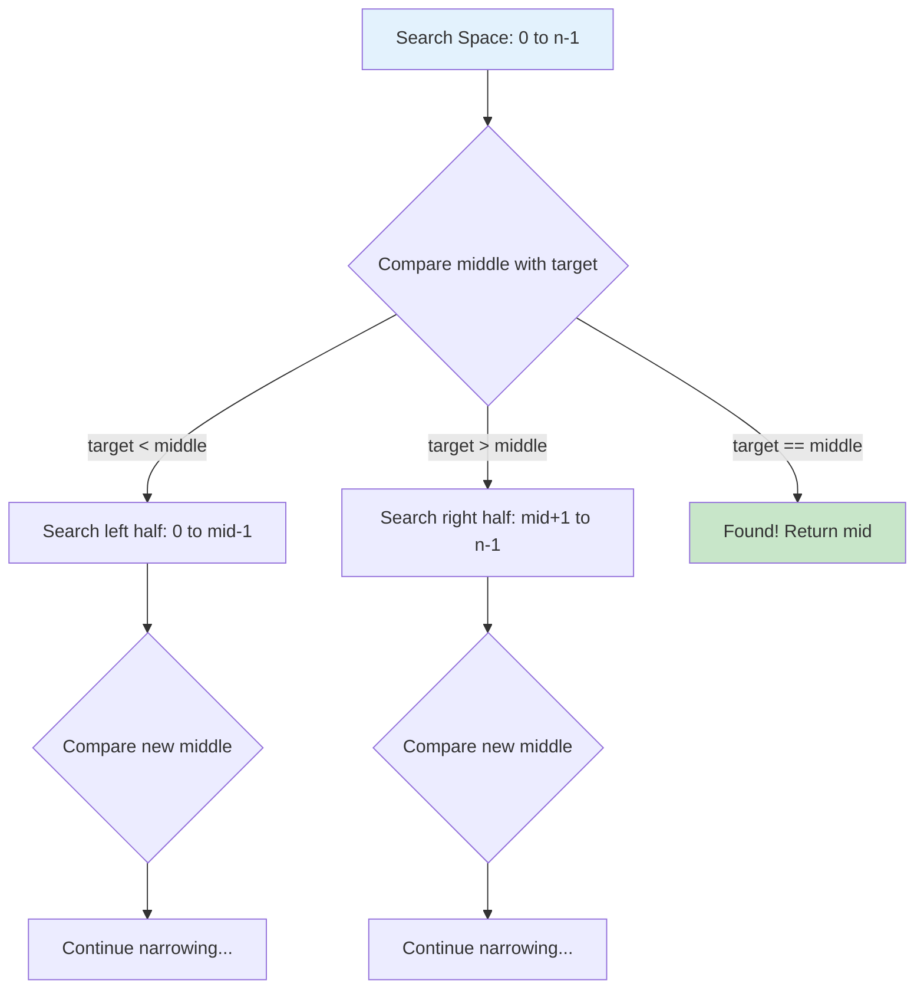
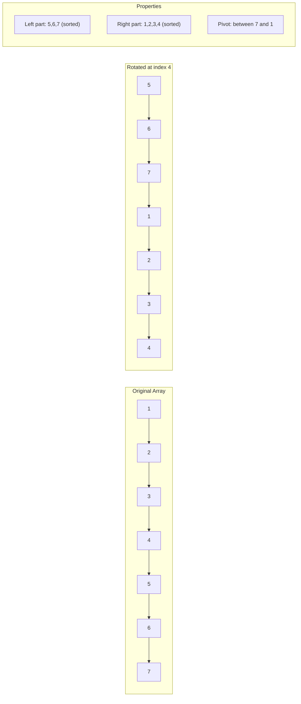
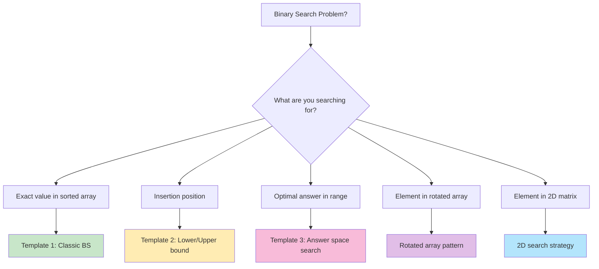

# Mastering Binary Search: From Basic Search to Answer Space Exploration

*Published on November 10, 2024 • 35 min read*

## Table of Contents
1. [Introduction to Binary Search](#introduction)
2. [The Binary Search Mindset](#mindset)
3. [Classic Binary Search Implementation](#classic-implementation)
4. [Search Space Variations](#search-space-variations)
5. [Binary Search on Answer Space](#answer-space)
6. [Rotated Array Patterns](#rotated-arrays)
7. [Matrix Search Techniques](#matrix-search)
8. [Advanced Binary Search Applications](#advanced-applications)
9. [Problem-Solving Framework](#problem-solving)
10. [Practice Problems](#practice-problems)
11. [Tips and Memory Tricks](#tips-tricks)

## Introduction to Binary Search {#introduction}

Imagine you're playing a number guessing game where someone thinks of a number between 1 and 100, and you have to guess it. What's the optimal strategy?

**Naive approach**: Start from 1, then 2, then 3... This could take up to 100 guesses.
**Smart approach**: Start with 50. If too high, try 25. If too low, try 75. With this strategy, you'll find any number in at most 7 guesses!

This is the essence of **binary search** – the most elegant divide-and-conquer algorithm that reduces search space by half in each step.

### Why Binary Search is Revolutionary

Binary search transforms a linear O(n) problem into a logarithmic O(log n) solution. But its true power lies not just in searching sorted arrays – it's a problem-solving paradigm that applies to:

- Finding exact matches in sorted data
- Locating insertion points  
- Searching in rotated/modified arrays
- Optimizing answers in a range
- 2D matrix searching
- Finding peaks and valleys

### Real-World Applications

1. **Database indexing**: Finding records in sorted databases
2. **Version control**: Git bisect to find bug-introducing commits
3. **Load balancing**: Finding optimal server capacity
4. **Resource allocation**: Determining minimum resources needed
5. **Game AI**: Minimax algorithm optimizations

## The Binary Search Mindset {#mindset}

### Core Principles

Before diving into code, understand these fundamental concepts:

1. **Invariant**: The answer (if exists) is always within our search bounds
2. **Elimination**: Each comparison eliminates half the remaining possibilities  
3. **Convergence**: The search space shrinks until we find the answer or determine it doesn't exist
4. **Monotonicity**: There's some property that changes monotonically across the search space

### The Three Questions Framework

For any binary search problem, ask:

1. **What am I searching for?** (target value, insertion point, optimal answer)
2. **What's my search space?** (array indices, value range, answer range)
3. **How do I eliminate half?** (comparison logic to narrow down)

### Visual Understanding



## Classic Binary Search Implementation {#classic-implementation}

### Template 1: Finding Exact Match

The most basic form – finding a target in a sorted array.

```go
func binarySearch(nums []int, target int) int {
    left, right := 0, len(nums)-1
    
    for left <= right {
        mid := left + (right-left)/2  // Prevents overflow
        
        if nums[mid] == target {
            return mid
        } else if nums[mid] < target {
            left = mid + 1
        } else {
            right = mid - 1
        }
    }
    
    return -1  // Target not found
}

// Example usage
func main() {
    nums := []int{1, 3, 5, 7, 9, 11, 13, 15}
    fmt.Println(binarySearch(nums, 7))   // Output: 3
    fmt.Println(binarySearch(nums, 4))   // Output: -1
}
```

### Template 2: Finding Insertion Point (Lower Bound)

Find the first position where target could be inserted to maintain sorted order.

```go
func searchInsert(nums []int, target int) int {
    left, right := 0, len(nums)  // Note: right = len(nums)
    
    for left < right {  // Note: left < right (not <=)
        mid := left + (right-left)/2
        
        if nums[mid] < target {
            left = mid + 1
        } else {
            right = mid  // Don't exclude mid, it could be the answer
        }
    }
    
    return left
}

// Example: [1,3,5,6], target = 5 → return 2
// Example: [1,3,5,6], target = 2 → return 1  
// Example: [1,3,5,6], target = 7 → return 4
```

### Template 3: Finding Upper Bound

Find the first position where element is greater than target.

```go
func upperBound(nums []int, target int) int {
    left, right := 0, len(nums)
    
    for left < right {
        mid := left + (right-left)/2
        
        if nums[mid] <= target {  // Note: <= instead of <
            left = mid + 1
        } else {
            right = mid
        }
    }
    
    return left
}

// Combined: Find range of target
func searchRange(nums []int, target int) []int {
    leftBound := searchInsert(nums, target)
    if leftBound >= len(nums) || nums[leftBound] != target {
        return []int{-1, -1}
    }
    
    rightBound := upperBound(nums, target) - 1
    return []int{leftBound, rightBound}
}
```

### Understanding the Boundary Conditions

The key to mastering binary search is understanding when to use `<=` vs `<` and when to include/exclude `mid`:

```go
// Pattern Recognition:
// 1. Finding exact match: while (left <= right), mid could be answer
// 2. Finding boundary: while (left < right), mid elimination is key
// 3. Search space: [left, right] vs [left, right)
```

## Search Space Variations {#search-space-variations}

### 1. Search in Sorted Array with Duplicates

Find first and last occurrence of target.

```go
func findFirstOccurrence(nums []int, target int) int {
    left, right := 0, len(nums)-1
    result := -1
    
    for left <= right {
        mid := left + (right-left)/2
        
        if nums[mid] == target {
            result = mid
            right = mid - 1  // Continue searching left for first occurrence
        } else if nums[mid] < target {
            left = mid + 1
        } else {
            right = mid - 1
        }
    }
    
    return result
}

func findLastOccurrence(nums []int, target int) int {
    left, right := 0, len(nums)-1
    result := -1
    
    for left <= right {
        mid := left + (right-left)/2
        
        if nums[mid] == target {
            result = mid
            left = mid + 1  // Continue searching right for last occurrence
        } else if nums[mid] < target {
            left = mid + 1
        } else {
            right = mid - 1
        }
    }
    
    return result
}
```

### 2. Find Peak Element

Find any peak element where `nums[i] > nums[i-1]` and `nums[i] > nums[i+1]`.

```go
func findPeakElement(nums []int) int {
    left, right := 0, len(nums)-1
    
    for left < right {
        mid := left + (right-left)/2
        
        if nums[mid] > nums[mid+1] {
            // Peak is on the left side (including mid)
            right = mid
        } else {
            // Peak is on the right side
            left = mid + 1
        }
    }
    
    return left
}

// Key insight: Always move towards the increasing direction
```

### 3. Find Minimum in Rotated Sorted Array

```go
func findMin(nums []int) int {
    left, right := 0, len(nums)-1
    
    for left < right {
        mid := left + (right-left)/2
        
        if nums[mid] > nums[right] {
            // Minimum is in right half
            left = mid + 1
        } else {
            // Minimum is in left half (including mid)
            right = mid
        }
    }
    
    return nums[left]
}

// With duplicates - handle the edge case
func findMinWithDuplicates(nums []int) int {
    left, right := 0, len(nums)-1
    
    for left < right {
        mid := left + (right-left)/2
        
        if nums[mid] > nums[right] {
            left = mid + 1
        } else if nums[mid] < nums[right] {
            right = mid
        } else {
            // nums[mid] == nums[right], can't decide, shrink right
            right--
        }
    }
    
    return nums[left]
}
```

## Binary Search on Answer Space {#answer-space}

This is where binary search becomes truly powerful – when we search for an optimal answer within a range of possibilities.

### Pattern Recognition

Use binary search on answer when:
1. You're looking for minimum/maximum value that satisfies a condition
2. The answer has a monotonic property (if x works, then x+1 also works)
3. You can verify if a given value is valid in reasonable time

### Template for Answer Space Search

```go
func binarySearchOnAnswer(condition func(int) bool, left, right int) int {
    for left < right {
        mid := left + (right-left)/2
        
        if condition(mid) {
            right = mid  // mid satisfies condition, try smaller
        } else {
            left = mid + 1  // mid doesn't work, try larger
        }
    }
    
    return left
}
```

### Example 1: Koko Eating Bananas

Koko can eat at most K bananas per hour. Find the minimum K such that she can finish all bananas within H hours.

```go
func minEatingSpeed(piles []int, h int) int {
    // Find the range of possible speeds
    maxPile := 0
    for _, pile := range piles {
        if pile > maxPile {
            maxPile = pile
        }
    }
    
    left, right := 1, maxPile
    
    // Check if we can finish with given speed k
    canFinish := func(k int) bool {
        hours := 0
        for _, pile := range piles {
            hours += (pile + k - 1) / k  // Ceiling division
        }
        return hours <= h
    }
    
    for left < right {
        mid := left + (right-left)/2
        
        if canFinish(mid) {
            right = mid  // Can finish with this speed, try slower
        } else {
            left = mid + 1  // Too slow, need faster speed
        }
    }
    
    return left
}
```

### Example 2: Capacity to Ship Packages

Find minimum capacity of ship to transport all packages within D days.

```go
func shipWithinDays(weights []int, days int) int {
    // Range: minimum capacity must fit largest package
    // Maximum: sum of all weights (ship in 1 day)
    left, right := 0, 0
    for _, weight := range weights {
        if weight > left {
            left = weight
        }
        right += weight
    }
    
    // Check if we can ship with given capacity
    canShip := func(capacity int) bool {
        daysNeeded := 1
        currentLoad := 0
        
        for _, weight := range weights {
            if currentLoad+weight > capacity {
                daysNeeded++
                currentLoad = weight
                if daysNeeded > days {
                    return false
                }
            } else {
                currentLoad += weight
            }
        }
        
        return true
    }
    
    for left < right {
        mid := left + (right-left)/2
        
        if canShip(mid) {
            right = mid
        } else {
            left = mid + 1
        }
    }
    
    return left
}
```

### Example 3: Split Array Largest Sum

Split array into m subarrays such that largest sum among subarrays is minimized.

```go
func splitArray(nums []int, m int) int {
    // Range: max element to sum of all elements
    left, right := 0, 0
    for _, num := range nums {
        if num > left {
            left = num
        }
        right += num
    }
    
    // Check if we can split with given max sum
    canSplit := func(maxSum int) bool {
        subarrays := 1
        currentSum := 0
        
        for _, num := range nums {
            if currentSum+num > maxSum {
                subarrays++
                currentSum = num
                if subarrays > m {
                    return false
                }
            } else {
                currentSum += num
            }
        }
        
        return true
    }
    
    for left < right {
        mid := left + (right-left)/2
        
        if canSplit(mid) {
            right = mid
        } else {
            left = mid + 1
        }
    }
    
    return left
}
```

## Rotated Array Patterns {#rotated-arrays}

Rotated sorted arrays are a classic binary search application. The key insight: at least one half is always sorted.

### Search in Rotated Sorted Array

```go
func search(nums []int, target int) int {
    left, right := 0, len(nums)-1
    
    for left <= right {
        mid := left + (right-left)/2
        
        if nums[mid] == target {
            return mid
        }
        
        // Determine which half is sorted
        if nums[left] <= nums[mid] {
            // Left half is sorted
            if nums[left] <= target && target < nums[mid] {
                right = mid - 1
            } else {
                left = mid + 1
            }
        } else {
            // Right half is sorted
            if nums[mid] < target && target <= nums[right] {
                left = mid + 1
            } else {
                right = mid - 1
            }
        }
    }
    
    return -1
}
```

### Visual Understanding of Rotation



### With Duplicates

When duplicates are present, we can't always determine which half is sorted:

```go
func searchInRotatedWithDuplicates(nums []int, target int) bool {
    left, right := 0, len(nums)-1
    
    for left <= right {
        mid := left + (right-left)/2
        
        if nums[mid] == target {
            return true
        }
        
        // Handle duplicates
        if nums[left] == nums[mid] && nums[mid] == nums[right] {
            left++
            right--
            continue
        }
        
        if nums[left] <= nums[mid] {
            if nums[left] <= target && target < nums[mid] {
                right = mid - 1
            } else {
                left = mid + 1
            }
        } else {
            if nums[mid] < target && target <= nums[right] {
                left = mid + 1
            } else {
                right = mid - 1
            }
        }
    }
    
    return false
}
```

## Matrix Search Techniques {#matrix-search}

### 1. Search in Row-wise and Column-wise Sorted Matrix

Each row is sorted, each column is sorted, but not globally sorted.

```go
func searchMatrix(matrix [][]int, target int) bool {
    if len(matrix) == 0 || len(matrix[0]) == 0 {
        return false
    }
    
    rows, cols := len(matrix), len(matrix[0])
    row, col := 0, cols-1  // Start from top-right corner
    
    for row < rows && col >= 0 {
        if matrix[row][col] == target {
            return true
        } else if matrix[row][col] > target {
            col--  // Move left
        } else {
            row++  // Move down
        }
    }
    
    return false
}
```

**Why top-right corner?** From any position:
- If current > target: move left (smaller values)
- If current < target: move down (larger values)
- This eliminates one row or column in each step

### 2. Search in Globally Sorted Matrix

Matrix is sorted both row-wise and the first element of each row is greater than the last element of the previous row.

```go
func searchMatrix2D(matrix [][]int, target int) bool {
    if len(matrix) == 0 || len(matrix[0]) == 0 {
        return false
    }
    
    rows, cols := len(matrix), len(matrix[0])
    left, right := 0, rows*cols-1
    
    for left <= right {
        mid := left + (right-left)/2
        midValue := matrix[mid/cols][mid%cols]  // Convert 1D index to 2D
        
        if midValue == target {
            return true
        } else if midValue < target {
            left = mid + 1
        } else {
            right = mid - 1
        }
    }
    
    return false
}
```

### 3. Find K-th Smallest Element in Sorted Matrix

```go
func kthSmallest(matrix [][]int, k int) int {
    n := len(matrix)
    left, right := matrix[0][0], matrix[n-1][n-1]
    
    // Count elements <= mid
    countLessEqual := func(mid int) int {
        count := 0
        row, col := n-1, 0  // Start from bottom-left
        
        for row >= 0 && col < n {
            if matrix[row][col] <= mid {
                count += row + 1  // All elements in this column up to row
                col++
            } else {
                row--
            }
        }
        
        return count
    }
    
    for left < right {
        mid := left + (right-left)/2
        
        if countLessEqual(mid) < k {
            left = mid + 1
        } else {
            right = mid
        }
    }
    
    return left
}
```

## Advanced Binary Search Applications {#advanced-applications}

### 1. Median of Two Sorted Arrays

Find median of two sorted arrays in O(log(min(m,n))) time.

```go
func findMedianSortedArrays(nums1 []int, nums2 []int) float64 {
    if len(nums1) > len(nums2) {
        nums1, nums2 = nums2, nums1  // Ensure nums1 is smaller
    }
    
    m, n := len(nums1), len(nums2)
    left, right := 0, m
    
    for left <= right {
        partitionX := (left + right) / 2
        partitionY := (m+n+1)/2 - partitionX
        
        // Handle edge cases
        maxLeftX := math.MinInt32
        if partitionX != 0 {
            maxLeftX = nums1[partitionX-1]
        }
        
        minRightX := math.MaxInt32
        if partitionX != m {
            minRightX = nums1[partitionX]
        }
        
        maxLeftY := math.MinInt32
        if partitionY != 0 {
            maxLeftY = nums2[partitionY-1]
        }
        
        minRightY := math.MaxInt32
        if partitionY != n {
            minRightY = nums2[partitionY]
        }
        
        if maxLeftX <= minRightY && maxLeftY <= minRightX {
            // Found correct partition
            if (m+n)%2 == 0 {
                return float64(max(maxLeftX, maxLeftY)+min(minRightX, minRightY)) / 2.0
            } else {
                return float64(max(maxLeftX, maxLeftY))
            }
        } else if maxLeftX > minRightY {
            right = partitionX - 1
        } else {
            left = partitionX + 1
        }
    }
    
    return 0.0
}

func max(a, b int) int {
    if a > b { return a }
    return b
}

func min(a, b int) int {
    if a < b { return a }
    return b
}
```

### 2. Find Minimum in Rotated Sorted Array II

With duplicates, worst case becomes O(n), but average case remains O(log n).

```go
func findMinII(nums []int) int {
    left, right := 0, len(nums)-1
    
    for left < right {
        mid := left + (right-left)/2
        
        if nums[mid] > nums[right] {
            left = mid + 1
        } else if nums[mid] < nums[right] {
            right = mid
        } else {
            // nums[mid] == nums[right], can't determine, reduce right
            right--
        }
    }
    
    return nums[left]
}
```

### 3. H-Index II

Find h-index efficiently from sorted citation array.

```go
func hIndex(citations []int) int {
    n := len(citations)
    left, right := 0, n-1
    
    for left <= right {
        mid := left + (right-left)/2
        
        if citations[mid] >= n-mid {
            right = mid - 1
        } else {
            left = mid + 1
        }
    }
    
    return n - left
}
```

## Problem-Solving Framework {#problem-solving}

### The BINARY Method

**B**oundaries: Define search space clearly
**I**nvariant: What property must always hold?
**N**arrow: How to eliminate half the space?
**A**nswer: What are we actually looking for?
**R**eview: Check boundary conditions
**Y**ield: Return the correct result

### Decision Tree for Binary Search Problems



### Common Patterns Recognition

| Problem Type | Key Indicators | Template Choice |
|-------------|---------------|----------------|
| Find exact match | "Find target in sorted array" | Classic Binary Search |
| Find boundary | "First/last occurrence", "insertion point" | Lower/Upper bound |
| Optimize answer | "Minimum/maximum value that satisfies" | Answer space search |
| Rotated array | "Sorted but rotated" | Modified classic with rotation check |
| Peak finding | "Find peak/valley" | Move toward increasing direction |
| Matrix search | "Row/column sorted matrix" | Coordinate elimination |

## Practice Problems by Difficulty {#practice-problems}

### Beginner Level
1. **Binary Search** (LeetCode 704)
2. **Search Insert Position** (LeetCode 35)
3. **Find First and Last Position** (LeetCode 34)
4. **Sqrt(x)** (LeetCode 69)

### Intermediate Level
1. **Search in Rotated Sorted Array** (LeetCode 33)
2. **Find Minimum in Rotated Sorted Array** (LeetCode 153)
3. **Find Peak Element** (LeetCode 162)
4. **Search a 2D Matrix** (LeetCode 74)
5. **Koko Eating Bananas** (LeetCode 875)

### Advanced Level
1. **Search in Rotated Sorted Array II** (LeetCode 81)
2. **Split Array Largest Sum** (LeetCode 410)
3. **Capacity to Ship Packages Within D Days** (LeetCode 1011)
4. **Search a 2D Matrix II** (LeetCode 240)
5. **Median of Two Sorted Arrays** (LeetCode 4)

### Expert Level
1. **Kth Smallest Element in Sorted Matrix** (LeetCode 378)
2. **Random Pick with Weight** (LeetCode 528)
3. **Count of Range Sum** (LeetCode 327)
4. **Maximum Average Subarray II** (LeetCode 644)

## Tips and Memory Tricks {#tips-tricks}

### 🧠 Memory Techniques

1. **"Divide and Conquer Sandwich"**: Split problem in half, pick the tasty side
2. **"Goldilocks Principle"**: Too big → go left, too small → go right, just right → found!
3. **"GPS Navigation"**: Eliminate wrong routes until you reach destination
4. **"Library Book Search"**: Start in middle, narrow down section by section

### 🔧 Implementation Best Practices

```go
// 1. Prevent integer overflow
mid := left + (right-left)/2  // Instead of (left+right)/2

// 2. Be consistent with boundaries
// Inclusive: [left, right] → while (left <= right)
// Exclusive right: [left, right) → while (left < right)

// 3. Template for different scenarios
func binarySearchTemplate(nums []int, target int) int {
    left, right := 0, len(nums)-1  // or len(nums)
    
    for left <= right {  // or left < right
        mid := left + (right-left)/2
        
        if nums[mid] == target {
            return mid
        } else if nums[mid] < target {
            left = mid + 1
        } else {
            right = mid - 1  // or mid
        }
    }
    
    return -1  // or left
}
```

### ⚡ Performance Optimizations

1. **Choose smaller array** for binary search when possible
2. **Early termination** for edge cases
3. **Iterative over recursive** to avoid stack overflow
4. **Bit shifting** for division by 2: `mid = (left + right) >> 1`

### 🎯 Debugging Strategies

```go
// Add debugging prints
func debugBinarySearch(nums []int, target int) int {
    left, right := 0, len(nums)-1
    iteration := 0
    
    for left <= right {
        mid := left + (right-left)/2
        fmt.Printf("Iteration %d: left=%d, right=%d, mid=%d, nums[mid]=%d\n", 
                   iteration, left, right, mid, nums[mid])
        
        if nums[mid] == target {
            return mid
        } else if nums[mid] < target {
            left = mid + 1
        } else {
            right = mid - 1
        }
        iteration++
    }
    
    return -1
}
```

### 🚨 Common Pitfalls and Solutions

1. **Integer Overflow**
   ```go
   // Wrong: mid = (left + right) / 2
   // Right: mid = left + (right - left) / 2
   ```

2. **Infinite Loop**
   ```go
   // Check if your update always changes the search space
   // Ensure left increases or right decreases in each iteration
   ```

3. **Off-by-One Errors**
   ```go
   // Be clear about inclusive vs exclusive boundaries
   // Test with arrays of size 0, 1, 2
   ```

4. **Wrong Template Choice**
   ```go
   // Finding exact match: left <= right, return -1 if not found
   // Finding boundary: left < right, return left
   ```

### 🧪 Testing Strategies

```go
func TestBinarySearch() {
    testCases := []struct {
        nums   []int
        target int
        expect int
    }{
        {[]int{}, 1, -1},                    // Empty array
        {[]int{1}, 1, 0},                    // Single element - found
        {[]int{1}, 2, -1},                   // Single element - not found
        {[]int{1, 2}, 1, 0},                 // Two elements - first
        {[]int{1, 2}, 2, 1},                 // Two elements - second
        {[]int{1, 3, 5, 7, 9}, 5, 2},       // Odd length - middle
        {[]int{1, 3, 5, 7}, 5, 2},          // Even length
        {[]int{1, 3, 5, 7, 9}, 0, -1},      // Less than all
        {[]int{1, 3, 5, 7, 9}, 10, -1},     // Greater than all
    }
    
    for _, tc := range testCases {
        result := binarySearch(tc.nums, tc.target)
        if result != tc.expect {
            fmt.Printf("FAIL: nums=%v, target=%d, got=%d, want=%d\n",
                      tc.nums, tc.target, result, tc.expect)
        }
    }
}
```

## Conclusion

Binary search is more than just finding elements in sorted arrays – it's a fundamental problem-solving paradigm. Master these key concepts:

### Binary Search Mastery Checklist:
- ✅ **Understand the three templates** and when to use each
- ✅ **Master boundary conditions** (inclusive vs exclusive)
- ✅ **Recognize answer space search** patterns
- ✅ **Handle rotated array variations** confidently
- ✅ **Apply 2D matrix search** strategies
- ✅ **Debug common pitfalls** (overflow, infinite loops, off-by-one)

### Key Takeaways

1. **Binary search works on any monotonic function**, not just sorted arrays
2. **The invariant is key**: maintain the property that your answer (if it exists) is always within your search bounds
3. **Template selection matters**: exact match vs boundary finding vs answer optimization
4. **Edge cases are crucial**: empty arrays, single elements, duplicates

### Real-World Applications Recap

- **System Design**: Load balancers, database sharding
- **Optimization**: Resource allocation, capacity planning  
- **Gaming**: AI decision trees, difficulty scaling
- **Finance**: Option pricing, risk assessment

The elegance of binary search lies in its simplicity and power. Once you master the mindset of "elimination by half," you'll see opportunities to apply it everywhere – from basic array searching to complex optimization problems.

Ready for trees? Let's explore **Tree Traversal** where we'll learn to navigate hierarchical data structures with systematic approaches!

---

*Next in series: [Tree Traversal: DFS, BFS, and Morris Traversal Mastery](/blog/dsa/tree-traversal-mastery)*