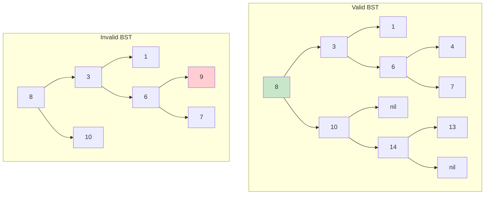
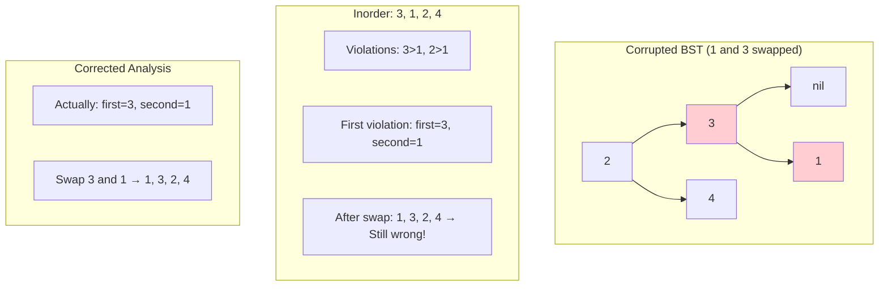
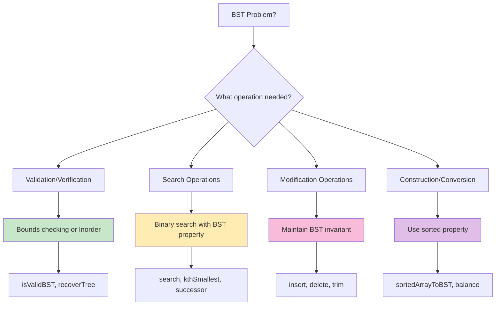

# Mastering BST Operations: Validation, Recovery, and Advanced Binary Search Tree Algorithms

*Published on November 10, 2024 • 45 min read*

## Table of Contents
1. [Introduction to Binary Search Trees](#introduction)
2. [BST Validation Techniques](#bst-validation)
3. [BST Recovery and Repair](#bst-recovery)
4. [Kth Smallest/Largest Elements](#kth-elements)
5. [Successor and Predecessor](#successor-predecessor)
6. [BST Construction and Conversion](#bst-construction)
7. [Range Queries and Updates](#range-operations)
8. [Advanced BST Operations](#advanced-operations)
9. [Problem-Solving Framework](#problem-solving)
10. [Practice Problems](#practice-problems)
11. [Tips and Memory Tricks](#tips-tricks)

## Introduction to Binary Search Trees {#introduction}

Imagine you're organizing a library where books must be arranged so that:
- Books with **smaller call numbers** go to the **left**
- Books with **larger call numbers** go to the **right** 
- You can **quickly find any book** by following this rule

This is exactly how a Binary Search Tree (BST) works – it's a binary tree with a special ordering property that enables efficient searching, insertion, and deletion operations.

### The BST Property

For every node in a BST:
- All nodes in the **left subtree** have values **less than** the current node
- All nodes in the **right subtree** have values **greater than** the current node
- This property holds **recursively** for all subtrees

### Why BSTs are Revolutionary

BSTs transform many O(n) operations into O(log n):
- **Search**: Find elements quickly using binary search principle
- **Insert/Delete**: Maintain sorted order while modifying structure
- **Range Queries**: Efficiently find elements within a range
- **Ordered Traversal**: Inorder traversal gives sorted sequence

### Real-World Applications

BSTs power:
- **Database indexing** (B-trees, B+ trees)
- **File system directories** (hierarchical organization)
- **Expression parsing** (operator precedence trees)
- **Auto-completion** (prefix trees with BST properties)
- **Game AI** (decision trees with value ordering)

### BST vs Regular Binary Tree



## BST Validation Techniques {#bst-validation}

Validating whether a binary tree is a valid BST is more subtle than it first appears. The key insight is that every node must satisfy constraints from all its ancestors, not just its immediate parent.

### Common Mistake: Only Checking Parent-Child

```go
// WRONG: This only checks immediate parent-child relationship
func isValidBSTWrong(root *TreeNode) bool {
    if root == nil {
        return true
    }
    
    if (root.Left != nil && root.Left.Val >= root.Val) ||
       (root.Right != nil && root.Right.Val <= root.Val) {
        return false
    }
    
    return isValidBSTWrong(root.Left) && isValidBSTWrong(root.Right)
}
```

**Why it's wrong**: Consider tree [5, 1, 4, nil, nil, 3, 6]. Node 3 is in the right subtree of 5 but is less than 5, violating BST property.

### Correct Approach 1: Bounds Checking

```go
type TreeNode struct {
    Val   int
    Left  *TreeNode
    Right *TreeNode
}

func isValidBST(root *TreeNode) bool {
    return validateBST(root, math.MinInt64, math.MaxInt64)
}

func validateBST(node *TreeNode, minVal, maxVal int64) bool {
    if node == nil {
        return true
    }
    
    val := int64(node.Val)
    
    // Check if current node violates bounds
    if val <= minVal || val >= maxVal {
        return false
    }
    
    // Recursively validate subtrees with updated bounds
    return validateBST(node.Left, minVal, val) &&
           validateBST(node.Right, val, maxVal)
}
```

### Correct Approach 2: Inorder Traversal

```go
func isValidBSTInorder(root *TreeNode) bool {
    prev := math.MinInt64
    
    var inorder func(*TreeNode) bool
    inorder = func(node *TreeNode) bool {
        if node == nil {
            return true
        }
        
        // Check left subtree
        if !inorder(node.Left) {
            return false
        }
        
        // Check current node
        if int64(node.Val) <= prev {
            return false
        }
        prev = int64(node.Val)
        
        // Check right subtree
        return inorder(node.Right)
    }
    
    return inorder(root)
}
```

### Iterative Inorder Validation

```go
func isValidBSTIterative(root *TreeNode) bool {
    stack := []*TreeNode{}
    prev := math.MinInt64
    current := root
    
    for len(stack) > 0 || current != nil {
        // Go to leftmost node
        for current != nil {
            stack = append(stack, current)
            current = current.Left
        }
        
        // Process current node
        current = stack[len(stack)-1]
        stack = stack[:len(stack)-1]
        
        if int64(current.Val) <= prev {
            return false
        }
        prev = int64(current.Val)
        
        current = current.Right
    }
    
    return true
}
```

### Morris Traversal Validation (O(1) Space)

```go
func isValidBSTMorris(root *TreeNode) bool {
    prev := math.MinInt64
    current := root
    
    for current != nil {
        if current.Left == nil {
            // Process current node
            if int64(current.Val) <= prev {
                return false
            }
            prev = int64(current.Val)
            current = current.Right
        } else {
            // Find inorder predecessor
            predecessor := current.Left
            for predecessor.Right != nil && predecessor.Right != current {
                predecessor = predecessor.Right
            }
            
            if predecessor.Right == nil {
                // Create thread
                predecessor.Right = current
                current = current.Left
            } else {
                // Remove thread and process current
                predecessor.Right = nil
                if int64(current.Val) <= prev {
                    return false
                }
                prev = int64(current.Val)
                current = current.Right
            }
        }
    }
    
    return true
}
```

## BST Recovery and Repair {#bst-recovery}

Sometimes BSTs get corrupted with exactly two nodes swapped. We need to identify and fix these swapped nodes.

### Understanding the Problem

In a valid BST, inorder traversal gives a sorted sequence. When two nodes are swapped:
- **Case 1**: Adjacent nodes swapped → One decreasing pair
- **Case 2**: Non-adjacent nodes swapped → Two decreasing pairs

### Recovery Algorithm

```go
func recoverTree(root *TreeNode) {
    var first, second, prev *TreeNode
    
    var inorder func(*TreeNode)
    inorder = func(node *TreeNode) {
        if node == nil {
            return
        }
        
        inorder(node.Left)
        
        // Check if current violates BST property
        if prev != nil && prev.Val > node.Val {
            if first == nil {
                // First violation found
                first = prev
            }
            // Always update second (handles both adjacent and non-adjacent cases)
            second = node
        }
        prev = node
        
        inorder(node.Right)
    }
    
    inorder(root)
    
    // Swap the values of the two nodes
    if first != nil && second != nil {
        first.Val, second.Val = second.Val, first.Val
    }
}
```

### Iterative Recovery

```go
func recoverTreeIterative(root *TreeNode) {
    stack := []*TreeNode{}
    var first, second, prev *TreeNode
    current := root
    
    for len(stack) > 0 || current != nil {
        // Go to leftmost node
        for current != nil {
            stack = append(stack, current)
            current = current.Left
        }
        
        current = stack[len(stack)-1]
        stack = stack[:len(stack)-1]
        
        // Check for violations
        if prev != nil && prev.Val > current.Val {
            if first == nil {
                first = prev
            }
            second = current
        }
        prev = current
        
        current = current.Right
    }
    
    // Swap values
    if first != nil && second != nil {
        first.Val, second.Val = second.Val, first.Val
    }
}
```

### Morris Traversal Recovery (O(1) Space)

```go
func recoverTreeMorris(root *TreeNode) {
    var first, second, prev *TreeNode
    current := root
    
    for current != nil {
        if current.Left == nil {
            // Process current node
            if prev != nil && prev.Val > current.Val {
                if first == nil {
                    first = prev
                }
                second = current
            }
            prev = current
            current = current.Right
        } else {
            // Find predecessor
            predecessor := current.Left
            for predecessor.Right != nil && predecessor.Right != current {
                predecessor = predecessor.Right
            }
            
            if predecessor.Right == nil {
                predecessor.Right = current
                current = current.Left
            } else {
                predecessor.Right = nil
                if prev != nil && prev.Val > current.Val {
                    if first == nil {
                        first = prev
                    }
                    second = current
                }
                prev = current
                current = current.Right
            }
        }
    }
    
    // Swap values
    if first != nil && second != nil {
        first.Val, second.Val = second.Val, first.Val
    }
}
```

### Visual Recovery Example



## Kth Smallest/Largest Elements {#kth-elements}

Finding the Kth smallest/largest element in a BST leverages the inorder traversal property.

### Kth Smallest Element

```go
func kthSmallest(root *TreeNode, k int) int {
    count := 0
    result := 0
    
    var inorder func(*TreeNode) bool
    inorder = func(node *TreeNode) bool {
        if node == nil {
            return false
        }
        
        // Search left subtree first
        if inorder(node.Left) {
            return true
        }
        
        // Process current node
        count++
        if count == k {
            result = node.Val
            return true
        }
        
        // Search right subtree
        return inorder(node.Right)
    }
    
    inorder(root)
    return result
}
```

### Iterative Kth Smallest

```go
func kthSmallestIterative(root *TreeNode, k int) int {
    stack := []*TreeNode{}
    current := root
    count := 0
    
    for len(stack) > 0 || current != nil {
        // Go to leftmost node
        for current != nil {
            stack = append(stack, current)
            current = current.Left
        }
        
        current = stack[len(stack)-1]
        stack = stack[:len(stack)-1]
        
        count++
        if count == k {
            return current.Val
        }
        
        current = current.Right
    }
    
    return -1 // Should never reach here for valid k
}
```

### Kth Largest Element

```go
func kthLargest(root *TreeNode, k int) int {
    count := 0
    result := 0
    
    // Reverse inorder: Right → Root → Left
    var reverseInorder func(*TreeNode) bool
    reverseInorder = func(node *TreeNode) bool {
        if node == nil {
            return false
        }
        
        // Search right subtree first
        if reverseInorder(node.Right) {
            return true
        }
        
        // Process current node
        count++
        if count == k {
            result = node.Val
            return true
        }
        
        // Search left subtree
        return reverseInorder(node.Left)
    }
    
    reverseInorder(root)
    return result
}
```

### Optimized with Node Count (for frequent queries)

```go
type TreeNodeWithCount struct {
    Val   int
    Count int  // Number of nodes in subtree
    Left  *TreeNodeWithCount
    Right *TreeNodeWithCount
}

func kthSmallestOptimized(root *TreeNodeWithCount, k int) int {
    leftCount := 0
    if root.Left != nil {
        leftCount = root.Left.Count
    }
    
    if k <= leftCount {
        // Kth smallest is in left subtree
        return kthSmallestOptimized(root.Left, k)
    } else if k == leftCount+1 {
        // Current node is the kth smallest
        return root.Val
    } else {
        // Kth smallest is in right subtree
        return kthSmallestOptimized(root.Right, k-leftCount-1)
    }
}

// Build tree with count information
func buildTreeWithCount(nums []int) *TreeNodeWithCount {
    if len(nums) == 0 {
        return nil
    }
    
    mid := len(nums) / 2
    root := &TreeNodeWithCount{
        Val:   nums[mid],
        Count: len(nums),
    }
    
    root.Left = buildTreeWithCount(nums[:mid])
    root.Right = buildTreeWithCount(nums[mid+1:])
    
    return root
}
```

## Successor and Predecessor {#successor-predecessor}

Finding the inorder successor/predecessor is a fundamental BST operation.

### Inorder Successor

The successor of a node is the next node in inorder traversal.

```go
func inorderSuccessor(root *TreeNode, p *TreeNode) *TreeNode {
    successor := (*TreeNode)(nil)
    
    for root != nil {
        if p.Val >= root.Val {
            root = root.Right
        } else {
            successor = root
            root = root.Left
        }
    }
    
    return successor
}

// Alternative: Using BST search property
func inorderSuccessorAlternative(root *TreeNode, p *TreeNode) *TreeNode {
    // Case 1: Node has right subtree
    if p.Right != nil {
        // Find leftmost node in right subtree
        current := p.Right
        for current.Left != nil {
            current = current.Left
        }
        return current
    }
    
    // Case 2: Node has no right subtree
    // Find first ancestor that is greater than p
    var successor *TreeNode
    current := root
    
    for current != nil {
        if p.Val < current.Val {
            successor = current
            current = current.Left
        } else if p.Val > current.Val {
            current = current.Right
        } else {
            break
        }
    }
    
    return successor
}
```

### Inorder Predecessor

```go
func inorderPredecessor(root *TreeNode, p *TreeNode) *TreeNode {
    predecessor := (*TreeNode)(nil)
    
    for root != nil {
        if p.Val <= root.Val {
            root = root.Left
        } else {
            predecessor = root
            root = root.Right
        }
    }
    
    return predecessor
}

// With parent pointers
type TreeNodeWithParent struct {
    Val    int
    Left   *TreeNodeWithParent
    Right  *TreeNodeWithParent
    Parent *TreeNodeWithParent
}

func inorderSuccessorWithParent(node *TreeNodeWithParent) *TreeNodeWithParent {
    if node == nil {
        return nil
    }
    
    // Case 1: Node has right subtree
    if node.Right != nil {
        current := node.Right
        for current.Left != nil {
            current = current.Left
        }
        return current
    }
    
    // Case 2: Go up until we find a node that is left child of its parent
    current := node
    for current.Parent != nil && current == current.Parent.Right {
        current = current.Parent
    }
    
    return current.Parent
}
```

### Successor/Predecessor in Range

```go
func successorInRange(root *TreeNode, target, upperBound int) *TreeNode {
    var result *TreeNode
    
    for root != nil {
        if root.Val > target && root.Val < upperBound {
            result = root
            root = root.Left  // Look for smaller successor
        } else if root.Val <= target {
            root = root.Right
        } else {
            root = root.Left
        }
    }
    
    return result
}
```

## BST Construction and Conversion {#bst-construction}

### Convert Sorted Array to BST

```go
func sortedArrayToBST(nums []int) *TreeNode {
    return buildBST(nums, 0, len(nums)-1)
}

func buildBST(nums []int, left, right int) *TreeNode {
    if left > right {
        return nil
    }
    
    mid := left + (right-left)/2
    root := &TreeNode{Val: nums[mid]}
    
    root.Left = buildBST(nums, left, mid-1)
    root.Right = buildBST(nums, mid+1, right)
    
    return root
}
```

### Convert BST to Sorted Doubly Linked List

```go
func treeToDoublyList(root *TreeNode) *TreeNode {
    if root == nil {
        return nil
    }
    
    var first, last *TreeNode
    
    var inorder func(*TreeNode)
    inorder = func(node *TreeNode) {
        if node == nil {
            return
        }
        
        inorder(node.Left)
        
        if last != nil {
            // Link previous node with current
            last.Right = node
            node.Left = last
        } else {
            // First node
            first = node
        }
        last = node
        
        inorder(node.Right)
    }
    
    inorder(root)
    
    // Close the circle
    last.Right = first
    first.Left = last
    
    return first
}
```

### Balance a BST

```go
func balanceBST(root *TreeNode) *TreeNode {
    // Step 1: Get inorder traversal (sorted values)
    var values []int
    inorderCollect(root, &values)
    
    // Step 2: Build balanced BST from sorted array
    return sortedArrayToBST(values)
}

func inorderCollect(node *TreeNode, values *[]int) {
    if node == nil {
        return
    }
    
    inorderCollect(node.Left, values)
    *values = append(*values, node.Val)
    inorderCollect(node.Right, values)
}
```

## Range Queries and Updates {#range-operations}

### Range Sum Query

```go
func rangeSumBST(root *TreeNode, low int, high int) int {
    if root == nil {
        return 0
    }
    
    sum := 0
    
    // If current node is in range, add it
    if root.Val >= low && root.Val <= high {
        sum += root.Val
    }
    
    // Recursively search left and right based on BST property
    if root.Val > low {
        sum += rangeSumBST(root.Left, low, high)
    }
    if root.Val < high {
        sum += rangeSumBST(root.Right, low, high)
    }
    
    return sum
}

// Iterative version
func rangeSumBSTIterative(root *TreeNode, low int, high int) int {
    if root == nil {
        return 0
    }
    
    sum := 0
    stack := []*TreeNode{root}
    
    for len(stack) > 0 {
        node := stack[len(stack)-1]
        stack = stack[:len(stack)-1]
        
        if node.Val >= low && node.Val <= high {
            sum += node.Val
        }
        
        if node.Left != nil && node.Val > low {
            stack = append(stack, node.Left)
        }
        if node.Right != nil && node.Val < high {
            stack = append(stack, node.Right)
        }
    }
    
    return sum
}
```

### Range Search (Find all nodes in range)

```go
func rangeSearch(root *TreeNode, low, high int) []int {
    result := []int{}
    
    var dfs func(*TreeNode)
    dfs = func(node *TreeNode) {
        if node == nil {
            return
        }
        
        // If current node is in range, add it
        if node.Val >= low && node.Val <= high {
            result = append(result, node.Val)
        }
        
        // Search left subtree if there might be values >= low
        if node.Val > low {
            dfs(node.Left)
        }
        
        // Search right subtree if there might be values <= high
        if node.Val < high {
            dfs(node.Right)
        }
    }
    
    dfs(root)
    return result
}
```

### Trim BST to Range

```go
func trimBST(root *TreeNode, low int, high int) *TreeNode {
    if root == nil {
        return nil
    }
    
    if root.Val < low {
        // Current node is too small, answer must be in right subtree
        return trimBST(root.Right, low, high)
    }
    
    if root.Val > high {
        // Current node is too large, answer must be in left subtree
        return trimBST(root.Left, low, high)
    }
    
    // Current node is in range, trim both subtrees
    root.Left = trimBST(root.Left, low, high)
    root.Right = trimBST(root.Right, low, high)
    
    return root
}
```

## Advanced BST Operations {#advanced-operations}

### BST Iterator

```go
type BSTIterator struct {
    stack []*TreeNode
}

func Constructor(root *TreeNode) BSTIterator {
    iterator := BSTIterator{stack: []*TreeNode{}}
    iterator.pushLeft(root)
    return iterator
}

func (it *BSTIterator) pushLeft(node *TreeNode) {
    for node != nil {
        it.stack = append(it.stack, node)
        node = node.Left
    }
}

func (it *BSTIterator) Next() int {
    node := it.stack[len(it.stack)-1]
    it.stack = it.stack[:len(it.stack)-1]
    
    // Push all left nodes of right subtree
    it.pushLeft(node.Right)
    
    return node.Val
}

func (it *BSTIterator) HasNext() bool {
    return len(it.stack) > 0
}
```

### Closest Value in BST

```go
func closestValue(root *TreeNode, target float64) int {
    closest := root.Val
    
    for root != nil {
        // Update closest if current is closer
        if abs(float64(root.Val)-target) < abs(float64(closest)-target) {
            closest = root.Val
        }
        
        // Move to appropriate subtree
        if target < float64(root.Val) {
            root = root.Left
        } else {
            root = root.Right
        }
    }
    
    return closest
}

func abs(x float64) float64 {
    if x < 0 {
        return -x
    }
    return x
}
```

### K Closest Values in BST

```go
func closestKValues(root *TreeNode, target float64, k int) []int {
    result := []int{}
    
    // Get inorder traversal
    var inorder func(*TreeNode)
    inorder = func(node *TreeNode) {
        if node == nil {
            return
        }
        
        inorder(node.Left)
        result = append(result, node.Val)
        inorder(node.Right)
    }
    
    inorder(root)
    
    // Find k closest using two pointers
    left, right := 0, len(result)-1
    
    // Shrink window to size k
    for right-left >= k {
        if abs(float64(result[left])-target) > abs(float64(result[right])-target) {
            left++
        } else {
            right--
        }
    }
    
    return result[left : right+1]
}

// Optimized O(k) space solution using two stacks
func closestKValuesOptimized(root *TreeNode, target float64, k int) []int {
    predecessors := []int{}
    successors := []int{}
    
    // Initialize predecessor and successor stacks
    initPredecessors(root, target, &predecessors)
    initSuccessors(root, target, &successors)
    
    result := []int{}
    
    for len(result) < k {
        if len(predecessors) == 0 {
            result = append(result, getSuccessor(&successors))
        } else if len(successors) == 0 {
            result = append(result, getPredecessor(&predecessors))
        } else {
            predDiff := abs(float64(predecessors[len(predecessors)-1]) - target)
            succDiff := abs(float64(successors[len(successors)-1]) - target)
            
            if predDiff < succDiff {
                result = append(result, getPredecessor(&predecessors))
            } else {
                result = append(result, getSuccessor(&successors))
            }
        }
    }
    
    return result
}

func initPredecessors(root *TreeNode, target float64, stack *[]int) {
    for root != nil {
        if float64(root.Val) <= target {
            *stack = append(*stack, root.Val)
            root = root.Right
        } else {
            root = root.Left
        }
    }
}

func initSuccessors(root *TreeNode, target float64, stack *[]int) {
    for root != nil {
        if float64(root.Val) > target {
            *stack = append(*stack, root.Val)
            root = root.Left
        } else {
            root = root.Right
        }
    }
}

func getPredecessor(stack *[]int) int {
    val := (*stack)[len(*stack)-1]
    *stack = (*stack)[:len(*stack)-1]
    return val
}

func getSuccessor(stack *[]int) int {
    val := (*stack)[len(*stack)-1]
    *stack = (*stack)[:len(*stack)-1]
    return val
}
```

## Problem-Solving Framework {#problem-solving}

### The BST Method

**B**ST property verification (does ordering hold?)
**S**earch strategy selection (bounds, inorder, binary search)  
**T**raversal approach (inorder for sorted, bounds for efficiency)

### BST Decision Tree



### Pattern Recognition Guide

| Problem Pattern | Key Indicators | Approach |
|----------------|---------------|----------|
| BST Validation | "valid BST", "verify structure" | Bounds checking or inorder |
| Kth Element | "kth smallest/largest" | Inorder traversal counting |
| Successor/Predecessor | "next/previous in order" | BST search with bounds |
| Range Operations | "sum/count in range" | Pruned BST traversal |
| Construction | "build BST", "convert to BST" | Recursive balanced building |
| Recovery | "two nodes swapped" | Inorder with violation detection |

## Practice Problems by Difficulty {#practice-problems}

### Beginner Level
1. **Validate Binary Search Tree** (LeetCode 98)
2. **Search in a Binary Search Tree** (LeetCode 700)
3. **Insert into a Binary Search Tree** (LeetCode 701)
4. **Range Sum of BST** (LeetCode 938)
5. **Minimum Absolute Difference in BST** (LeetCode 530)

### Intermediate Level
1. **Kth Smallest Element in BST** (LeetCode 230)
2. **Inorder Successor in BST** (LeetCode 285)
3. **Convert Sorted Array to BST** (LeetCode 108)
4. **Recover Binary Search Tree** (LeetCode 99)
5. **Trim a Binary Search Tree** (LeetCode 669)

### Advanced Level
1. **Binary Search Tree Iterator** (LeetCode 173)
2. **Closest Binary Search Tree Value** (LeetCode 270)
3. **Closest Binary Search Tree Value II** (LeetCode 272)
4. **Convert BST to Greater Tree** (LeetCode 538)
5. **Balance a Binary Search Tree** (LeetCode 1382)

### Expert Level
1. **Serialize and Deserialize BST** (LeetCode 449)
2. **Count of Smaller Numbers After Self** (LeetCode 315)
3. **Contains Duplicate III** (LeetCode 220)
4. **Data Stream as Disjoint Intervals** (LeetCode 352)

## Tips and Memory Tricks {#tips-tricks}

### 🧠 Memory Techniques

1. **BST Property**: "**B**igger on right, **S**maller on left, **T**rue for all"
2. **Inorder = Sorted**: "**I**norder gives **S**orted sequence"
3. **Bounds Checking**: "**B**ounds **C**heck = **B**etter **C**orrectness"
4. **Successor**: "**S**uccessor = **S**mallest in right or first bigger ancestor"

### 🔧 Implementation Best Practices

```go
// 1. Use proper bounds for validation
func isValidBST(root *TreeNode) bool {
    return validate(root, math.MinInt64, math.MaxInt64)
}

// 2. Leverage BST property for efficiency
func searchBST(root *TreeNode, val int) *TreeNode {
    for root != nil && root.Val != val {
        if val < root.Val {
            root = root.Left
        } else {
            root = root.Right
        }
    }
    return root
}

// 3. Use inorder for sorted operations
func kthSmallest(root *TreeNode, k int) int {
    count := 0
    var result int
    
    var inorder func(*TreeNode) bool
    inorder = func(node *TreeNode) bool {
        if node == nil {
            return false
        }
        
        if inorder(node.Left) { return true }
        
        count++
        if count == k {
            result = node.Val
            return true
        }
        
        return inorder(node.Right)
    }
    
    inorder(root)
    return result
}

// 4. Early termination in range queries
func rangeSumBST(root *TreeNode, low, high int) int {
    if root == nil {
        return 0
    }
    
    sum := 0
    if root.Val >= low && root.Val <= high {
        sum += root.Val
    }
    
    // Only recurse if there might be valid nodes
    if root.Val > low {
        sum += rangeSumBST(root.Left, low, high)
    }
    if root.Val < high {
        sum += rangeSumBST(root.Right, low, high)
    }
    
    return sum
}
```

### ⚡ Performance Optimizations

1. **Use BST Property**: Don't search both subtrees when one is guaranteed empty
2. **Iterative Approaches**: Avoid recursion stack for very deep trees
3. **Early Termination**: Stop searching when target found or impossible
4. **Morris Traversal**: O(1) space for inorder operations when needed

### 🎯 Problem-Solving Strategies

#### For BST Validation:
1. **Bounds method**: Track min/max constraints from ancestors
2. **Inorder method**: Previous value must be smaller than current
3. **Consider edge cases**: Equal values, integer overflow

#### For BST Search Operations:
1. **Binary search principle**: Eliminate half the tree at each step
2. **Inorder for sorted results**: Use when order matters
3. **Iterative when possible**: Better space complexity

#### For BST Modifications:
1. **Maintain BST property**: Every operation must preserve ordering
2. **Handle edge cases**: Empty tree, single node, root changes
3. **Balance considerations**: Unbalanced trees degrade to O(n)

### 🚨 Common Pitfalls

1. **Validation Mistakes**
   ```go
   // Wrong: Only checks immediate parent-child
   if root.Left != nil && root.Left.Val >= root.Val { return false }
   
   // Right: Use bounds from all ancestors
   return validate(node, minBound, maxBound)
   ```

2. **Integer Overflow in Bounds**
   ```go
   // Use int64 for bounds to avoid overflow
   func validate(node *TreeNode, min, max int64) bool {
       if node == nil { return true }
       val := int64(node.Val)
       return val > min && val < max && // ...
   }
   ```

3. **Recovery Algorithm Confusion**
   ```go
   // Always update second pointer on violation
   if prev != nil && prev.Val > node.Val {
       if first == nil {
           first = prev  // First violation
       }
       second = node     // Always update (handles both cases)
   }
   ```

4. **Range Query Inefficiency**
   ```go
   // Wrong: Always search both subtrees
   return rangeSumBST(root.Left) + rangeSumBST(root.Right)
   
   // Right: Use BST property to prune
   if root.Val > low { sum += rangeSumBST(root.Left) }
   if root.Val < high { sum += rangeSumBST(root.Right) }
   ```

### 🧪 Testing Strategies

```go
func TestBSTOperations() {
    tests := []struct {
        name     string
        tree     *TreeNode
        isValid  bool
        kth      int
        k        int
        expected int
    }{
        {"empty", nil, true, 1, 1, -1},
        {"single", &TreeNode{Val: 5}, true, 1, 1, 5},
        {"valid BST", createValidBST(), true, 3, 3, 4},
        {"invalid BST", createInvalidBST(), false, 0, 0, 0},
    }
    
    for _, tt := range tests {
        valid := isValidBST(tt.tree)
        if valid != tt.isValid {
            t.Errorf("%s validation: got %v, want %v", tt.name, valid, tt.isValid)
        }
        
        if tt.isValid && tt.tree != nil {
            kthVal := kthSmallest(tt.tree, tt.k)
            if kthVal != tt.expected {
                t.Errorf("%s kthSmallest: got %d, want %d", tt.name, kthVal, tt.expected)
            }
        }
    }
}
```

## Conclusion

Binary Search Tree operations leverage the fundamental ordering property to achieve efficient algorithms. Master these key concepts:

### BST Operations Mastery Checklist:
- ✅ **Validate BST correctly** using bounds checking or inorder traversal
- ✅ **Recover corrupted BSTs** by identifying swapped nodes
- ✅ **Find kth elements efficiently** using inorder traversal counting  
- ✅ **Navigate successor/predecessor** using BST search properties
- ✅ **Perform range operations** with BST property pruning
- ✅ **Convert and construct BSTs** maintaining balance when possible

### Key Takeaways

1. **BST property enables O(log n) operations** when tree is balanced
2. **Inorder traversal gives sorted sequence** - powerful for many algorithms
3. **Bounds checking is crucial** for correct BST validation
4. **Early termination** using BST property improves efficiency
5. **Balance matters** - unbalanced BSTs degrade to O(n) performance

### Real-World Applications Recap

- **Database systems**: B-tree indexes for efficient queries
- **File systems**: Directory structures with ordered access
- **Compiler design**: Symbol tables and expression trees
- **Auto-completion**: Prefix trees with BST ordering
- **Game development**: Spatial partitioning and decision trees

BST operations demonstrate how mathematical properties (ordering) enable elegant algorithmic solutions. The key insight is leveraging the BST invariant to eliminate impossible search spaces and maintain efficiency.

**🎉 Phase 3 Complete!** We've now mastered all fundamental tree algorithms from basic traversal to advanced BST operations. Ready to tackle graph algorithms in Phase 4?

---

*Next in series: [Graph Traversal: BFS, DFS, and Cycle Detection in Graphs](/blog/dsa/graph-traversal-mastery)*