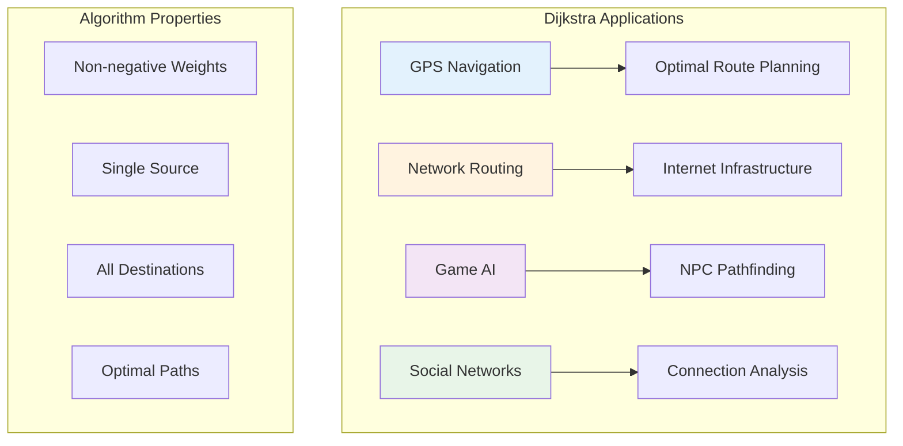
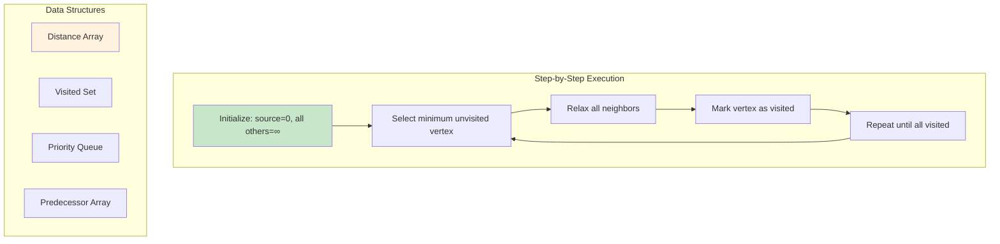
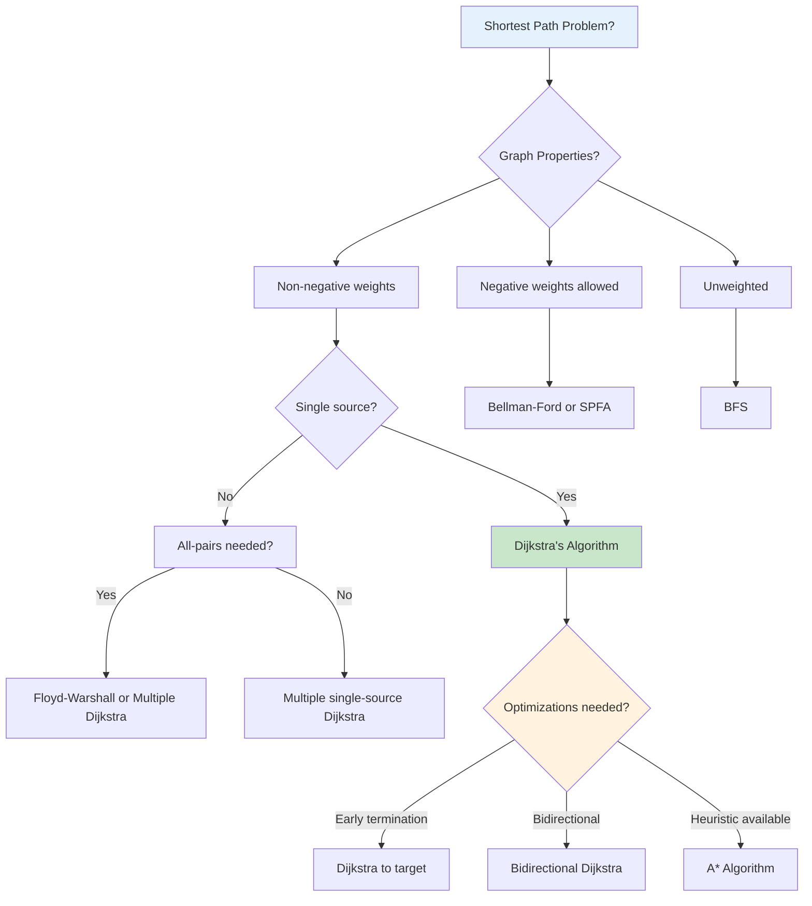

# Mastering Dijkstra's Algorithm: Single-Source Shortest Paths in Weighted Graphs

*Published on November 10, 2024 • 40 min read*

## Table of Contents
1. [Introduction to Dijkstra's Algorithm](#introduction)
2. [Algorithm Fundamentals](#algorithm-fundamentals)
3. [Basic Implementation](#basic-implementation)
4. [Priority Queue Optimization](#priority-queue-optimization)
5. [Advanced Variations](#advanced-variations)
6. [Path Reconstruction](#path-reconstruction)
7. [Real-World Applications](#real-world-applications)
8. [Performance Analysis](#performance-analysis)
9. [Common Optimizations](#optimizations)
10. [Problem-Solving Patterns](#problem-solving)
11. [Practice Problems](#practice-problems)
12. [Tips and Memory Tricks](#tips-tricks)

## Introduction to Dijkstra's Algorithm {#introduction}

Imagine you're planning the **fastest route** to work, considering traffic conditions on different roads. Some routes are highways (fast but longer), others are city streets (slower but shorter). **Dijkstra's algorithm** solves exactly this problem - finding the shortest path from one location to all other locations in a weighted graph.

### The GPS Navigation Analogy

When your GPS calculates a route, it's essentially running a variant of Dijkstra's algorithm:
- **Intersections** are vertices
- **Roads** are edges with travel time as weights
- **Starting point** is the source vertex
- **All possible destinations** get shortest path calculations

### Key Properties of Dijkstra's Algorithm

1. **Single-source shortest paths**: Finds shortest paths from one vertex to all others
2. **Non-negative weights only**: Cannot handle negative edge weights
3. **Greedy approach**: Always selects the closest unvisited vertex
4. **Optimal substructure**: Shortest paths contain shortest subpaths
5. **Time complexity**: O((V + E) log V) with priority queue

### Why Dijkstra's Algorithm Matters

**Navigation Systems**:
- GPS route calculation
- Flight path optimization
- Network packet routing

**Network Analysis**:
- Internet routing protocols (OSPF)
- Telecommunications infrastructure
- Social network analysis

**Game Development**:
- AI pathfinding
- Resource optimization
- Strategy game mechanics

### Real-World Impact



## Algorithm Fundamentals {#algorithm-fundamentals}

Dijkstra's algorithm uses a **greedy approach** with **relaxation** - it maintains distance estimates and improves them as it discovers shorter paths.

### Core Concepts

**Relaxation**: If we find a shorter path to a vertex through another vertex, we update the distance.

```
if distance[u] + weight(u, v) < distance[v]:
    distance[v] = distance[u] + weight(u, v)
    predecessor[v] = u
```

**Greedy Choice**: Always process the unvisited vertex with minimum distance first.

### Graph Representation for Dijkstra

```go
type WeightedGraph struct {
    vertices int
    adjList  [][]Edge
}

type Edge struct {
    to     int
    weight int
}

func NewWeightedGraph(vertices int) *WeightedGraph {
    return &WeightedGraph{
        vertices: vertices,
        adjList:  make([][]Edge, vertices),
    }
}

func (g *WeightedGraph) AddEdge(from, to, weight int) {
    g.adjList[from] = append(g.adjList[from], Edge{to, weight})
}

// For undirected graphs
func (g *WeightedGraph) AddUndirectedEdge(u, v, weight int) {
    g.AddEdge(u, v, weight)
    g.AddEdge(v, u, weight)
}
```

### Algorithm Visualization



## Basic Implementation {#basic-implementation}

Let's start with a simple O(V²) implementation using linear search to find the minimum distance vertex.

### Simple Dijkstra Implementation

```go
import "math"

func DijkstraSimple(graph *WeightedGraph, source int) ([]int, []int) {
    dist := make([]int, graph.vertices)
    prev := make([]int, graph.vertices)
    visited := make([]bool, graph.vertices)
    
    // Initialize distances
    for i := 0; i < graph.vertices; i++ {
        dist[i] = math.MaxInt32
        prev[i] = -1
    }
    dist[source] = 0
    
    for count := 0; count < graph.vertices; count++ {
        // Find minimum distance unvisited vertex
        u := findMinDistance(dist, visited)
        if u == -1 {
            break // No more reachable vertices
        }
        
        visited[u] = true
        
        // Relax neighbors
        for _, edge := range graph.adjList[u] {
            v, weight := edge.to, edge.weight
            if !visited[v] && dist[u] != math.MaxInt32 {
                newDist := dist[u] + weight
                if newDist < dist[v] {
                    dist[v] = newDist
                    prev[v] = u
                }
            }
        }
    }
    
    return dist, prev
}

func findMinDistance(dist []int, visited []bool) int {
    minDist := math.MaxInt32
    minIndex := -1
    
    for v := 0; v < len(dist); v++ {
        if !visited[v] && dist[v] < minDist {
            minDist = dist[v]
            minIndex = v
        }
    }
    
    return minIndex
}
```

### Example Usage

```go
func ExampleDijkstra() {
    // Create graph: 0-1-2
    //                \|/
    //                 3
    graph := NewWeightedGraph(4)
    graph.AddUndirectedEdge(0, 1, 1)
    graph.AddUndirectedEdge(1, 2, 3)
    graph.AddUndirectedEdge(0, 3, 4)
    graph.AddUndirectedEdge(1, 3, 2)
    graph.AddUndirectedEdge(2, 3, 1)
    
    distances, predecessors := DijkstraSimple(graph, 0)
    
    fmt.Printf("Distances from vertex 0: %v\n", distances)
    // Output: [0, 1, 4, 3]
    
    // Reconstruct path from 0 to 2
    path := ReconstructPath(predecessors, 0, 2)
    fmt.Printf("Path from 0 to 2: %v\n", path)
    // Output: [0, 1, 3, 2]
}

func ReconstructPath(prev []int, source, target int) []int {
    path := []int{}
    current := target
    
    for current != -1 {
        path = append([]int{current}, path...)
        if current == source {
            break
        }
        current = prev[current]
    }
    
    if len(path) == 0 || path[0] != source {
        return nil // No path exists
    }
    
    return path
}
```

### Step-by-Step Execution Trace

```go
func DijkstraWithTrace(graph *WeightedGraph, source int) {
    dist := make([]int, graph.vertices)
    visited := make([]bool, graph.vertices)
    
    // Initialize
    for i := 0; i < graph.vertices; i++ {
        dist[i] = math.MaxInt32
    }
    dist[source] = 0
    
    fmt.Printf("Initial: dist=%v\n", dist)
    
    for count := 0; count < graph.vertices; count++ {
        u := findMinDistance(dist, visited)
        if u == -1 {
            break
        }
        
        visited[u] = true
        fmt.Printf("Processing vertex %d (dist=%d)\n", u, dist[u])
        
        // Relax neighbors
        for _, edge := range graph.adjList[u] {
            v, weight := edge.to, edge.weight
            if !visited[v] && dist[u] != math.MaxInt32 {
                oldDist := dist[v]
                newDist := dist[u] + weight
                if newDist < dist[v] {
                    dist[v] = newDist
                    fmt.Printf("  Relaxed %d->%d: %d -> %d\n", u, v, oldDist, newDist)
                }
            }
        }
        
        fmt.Printf("  Current distances: %v\n", dist)
    }
}
```

## Priority Queue Optimization {#priority-queue-optimization}

The key optimization for Dijkstra's algorithm is using a **priority queue** (min-heap) to efficiently find the minimum distance vertex.

### Priority Queue Implementation

```go
import "container/heap"

type Item struct {
    vertex   int
    distance int
    index    int
}

type PriorityQueue []*Item

func (pq PriorityQueue) Len() int { return len(pq) }

func (pq PriorityQueue) Less(i, j int) bool {
    return pq[i].distance < pq[j].distance
}

func (pq PriorityQueue) Swap(i, j int) {
    pq[i], pq[j] = pq[j], pq[i]
    pq[i].index = i
    pq[j].index = j
}

func (pq *PriorityQueue) Push(x interface{}) {
    n := len(*pq)
    item := x.(*Item)
    item.index = n
    *pq = append(*pq, item)
}

func (pq *PriorityQueue) Pop() interface{} {
    old := *pq
    n := len(old)
    item := old[n-1]
    old[n-1] = nil
    item.index = -1
    *pq = old[0 : n-1]
    return item
}

func (pq *PriorityQueue) Update(item *Item, distance int) {
    item.distance = distance
    heap.Fix(pq, item.index)
}
```

### Optimized Dijkstra with Priority Queue

```go
func DijkstraPQ(graph *WeightedGraph, source int) ([]int, []int) {
    dist := make([]int, graph.vertices)
    prev := make([]int, graph.vertices)
    visited := make([]bool, graph.vertices)
    
    // Initialize distances
    for i := 0; i < graph.vertices; i++ {
        dist[i] = math.MaxInt32
        prev[i] = -1
    }
    dist[source] = 0
    
    // Initialize priority queue
    pq := make(PriorityQueue, 0)
    heap.Init(&pq)
    heap.Push(&pq, &Item{vertex: source, distance: 0})
    
    for pq.Len() > 0 {
        current := heap.Pop(&pq).(*Item)
        u := current.vertex
        
        if visited[u] {
            continue // Already processed
        }
        
        visited[u] = true
        
        // Relax neighbors
        for _, edge := range graph.adjList[u] {
            v, weight := edge.to, edge.weight
            if !visited[v] {
                newDist := dist[u] + weight
                if newDist < dist[v] {
                    dist[v] = newDist
                    prev[v] = u
                    heap.Push(&pq, &Item{vertex: v, distance: newDist})
                }
            }
        }
    }
    
    return dist, prev
}
```

### Simplified Priority Queue Version

```go
// Using built-in sort for simplicity
type VertexDist struct {
    vertex int
    dist   int
}

func DijkstraSimplePQ(graph *WeightedGraph, source int) []int {
    dist := make([]int, graph.vertices)
    visited := make([]bool, graph.vertices)
    
    // Initialize
    for i := 0; i < graph.vertices; i++ {
        dist[i] = math.MaxInt32
    }
    dist[source] = 0
    
    // Priority queue as slice
    pq := []VertexDist{{source, 0}}
    
    for len(pq) > 0 {
        // Get minimum distance vertex
        sort.Slice(pq, func(i, j int) bool {
            return pq[i].dist < pq[j].dist
        })
        
        current := pq[0]
        pq = pq[1:]
        
        u := current.vertex
        if visited[u] {
            continue
        }
        
        visited[u] = true
        
        // Relax neighbors
        for _, edge := range graph.adjList[u] {
            v, weight := edge.to, edge.weight
            if !visited[v] {
                newDist := dist[u] + weight
                if newDist < dist[v] {
                    dist[v] = newDist
                    pq = append(pq, VertexDist{v, newDist})
                }
            }
        }
    }
    
    return dist
}
```

## Advanced Variations {#advanced-variations}

### Dijkstra with Early Termination

```go
func DijkstraToTarget(graph *WeightedGraph, source, target int) (int, []int) {
    if source == target {
        return 0, []int{source}
    }
    
    dist := make([]int, graph.vertices)
    prev := make([]int, graph.vertices)
    visited := make([]bool, graph.vertices)
    
    for i := 0; i < graph.vertices; i++ {
        dist[i] = math.MaxInt32
        prev[i] = -1
    }
    dist[source] = 0
    
    pq := make(PriorityQueue, 0)
    heap.Init(&pq)
    heap.Push(&pq, &Item{vertex: source, distance: 0})
    
    for pq.Len() > 0 {
        current := heap.Pop(&pq).(*Item)
        u := current.vertex
        
        if visited[u] {
            continue
        }
        
        visited[u] = true
        
        // Early termination when target reached
        if u == target {
            path := ReconstructPath(prev, source, target)
            return dist[target], path
        }
        
        // Relax neighbors
        for _, edge := range graph.adjList[u] {
            v, weight := edge.to, edge.weight
            if !visited[v] {
                newDist := dist[u] + weight
                if newDist < dist[v] {
                    dist[v] = newDist
                    prev[v] = u
                    heap.Push(&pq, &Item{vertex: v, distance: newDist})
                }
            }
        }
    }
    
    return math.MaxInt32, nil // No path found
}
```

### Dijkstra with Multiple Sources

```go
func DijkstraMultiSource(graph *WeightedGraph, sources []int) []int {
    dist := make([]int, graph.vertices)
    visited := make([]bool, graph.vertices)
    
    // Initialize distances
    for i := 0; i < graph.vertices; i++ {
        dist[i] = math.MaxInt32
    }
    
    pq := make(PriorityQueue, 0)
    heap.Init(&pq)
    
    // Add all sources to priority queue
    for _, source := range sources {
        dist[source] = 0
        heap.Push(&pq, &Item{vertex: source, distance: 0})
    }
    
    for pq.Len() > 0 {
        current := heap.Pop(&pq).(*Item)
        u := current.vertex
        
        if visited[u] {
            continue
        }
        
        visited[u] = true
        
        // Relax neighbors
        for _, edge := range graph.adjList[u] {
            v, weight := edge.to, edge.weight
            if !visited[v] {
                newDist := dist[u] + weight
                if newDist < dist[v] {
                    dist[v] = newDist
                    heap.Push(&pq, &Item{vertex: v, distance: newDist})
                }
            }
        }
    }
    
    return dist
}
```

### Dijkstra with Path Constraints

```go
// Dijkstra with maximum path length constraint
func DijkstraWithMaxHops(graph *WeightedGraph, source, maxHops int) []int {
    // State: (vertex, hops_used)
    type State struct {
        vertex int
        hops   int
        dist   int
    }
    
    // dist[vertex][hops] = minimum distance to vertex using exactly hops edges
    dist := make([][]int, graph.vertices)
    for i := range dist {
        dist[i] = make([]int, maxHops+1)
        for j := range dist[i] {
            dist[i][j] = math.MaxInt32
        }
    }
    dist[source][0] = 0
    
    pq := []State{{source, 0, 0}}
    
    for len(pq) > 0 {
        // Simple priority queue using sort
        sort.Slice(pq, func(i, j int) bool {
            return pq[i].dist < pq[j].dist
        })
        
        current := pq[0]
        pq = pq[1:]
        
        u, hops, d := current.vertex, current.hops, current.dist
        
        if d > dist[u][hops] {
            continue
        }
        
        if hops >= maxHops {
            continue
        }
        
        // Relax neighbors
        for _, edge := range graph.adjList[u] {
            v, weight := edge.to, edge.weight
            newDist := dist[u][hops] + weight
            newHops := hops + 1
            
            if newDist < dist[v][newHops] {
                dist[v][newHops] = newDist
                pq = append(pq, State{v, newHops, newDist})
            }
        }
    }
    
    // Return minimum distance to each vertex using any number of hops <= maxHops
    result := make([]int, graph.vertices)
    for i := 0; i < graph.vertices; i++ {
        result[i] = math.MaxInt32
        for j := 0; j <= maxHops; j++ {
            if dist[i][j] < result[i] {
                result[i] = dist[i][j]
            }
        }
    }
    
    return result
}
```

### K Shortest Paths (Yen's Algorithm variant)

```go
type Path struct {
    vertices []int
    cost     int
}

func KShortestPaths(graph *WeightedGraph, source, target, k int) []Path {
    if k <= 0 {
        return []Path{}
    }
    
    // Find first shortest path
    dist, prev := DijkstraPQ(graph, source)
    if dist[target] == math.MaxInt32 {
        return []Path{} // No path exists
    }
    
    firstPath := ReconstructPath(prev, source, target)
    result := []Path{{vertices: firstPath, cost: dist[target]}}
    
    if k == 1 {
        return result
    }
    
    // For k > 1, we need more sophisticated algorithm (Yen's algorithm)
    // This is a simplified version
    candidates := make([]Path, 0)
    
    for i := 1; i < k; i++ {
        if len(result) == 0 {
            break
        }
        
        lastPath := result[len(result)-1]
        
        // Generate candidate paths by removing edges from last path
        for j := 0; j < len(lastPath.vertices)-1; j++ {
            // This is where full Yen's algorithm would modify the graph
            // and find alternative paths
            // Simplified implementation would go here
        }
        
        if len(candidates) == 0 {
            break
        }
        
        // Sort candidates and take the best one
        sort.Slice(candidates, func(a, b int) bool {
            return candidates[a].cost < candidates[b].cost
        })
        
        result = append(result, candidates[0])
        candidates = candidates[1:]
    }
    
    return result
}
```

## Path Reconstruction {#path-reconstruction}

### Basic Path Reconstruction

```go
func ReconstructPath(prev []int, source, target int) []int {
    if prev[target] == -1 && target != source {
        return nil // No path exists
    }
    
    path := []int{}
    current := target
    
    for current != -1 {
        path = append([]int{current}, path...)
        if current == source {
            break
        }
        current = prev[current]
    }
    
    return path
}
```

### Path Reconstruction with Details

```go
type PathInfo struct {
    Vertices []int
    Edges    []Edge
    TotalCost int
    Hops     int
}

func ReconstructDetailedPath(graph *WeightedGraph, dist, prev []int, source, target int) *PathInfo {
    if dist[target] == math.MaxInt32 {
        return nil // No path
    }
    
    vertices := ReconstructPath(prev, source, target)
    if vertices == nil {
        return nil
    }
    
    edges := []Edge{}
    totalCost := 0
    
    for i := 0; i < len(vertices)-1; i++ {
        from, to := vertices[i], vertices[i+1]
        
        // Find edge weight
        for _, edge := range graph.adjList[from] {
            if edge.to == to {
                edges = append(edges, edge)
                totalCost += edge.weight
                break
            }
        }
    }
    
    return &PathInfo{
        Vertices:  vertices,
        Edges:     edges,
        TotalCost: totalCost,
        Hops:      len(vertices) - 1,
    }
}
```

### All Paths Reconstruction

```go
func ReconstructAllPaths(prev []int, source int) map[int][]int {
    paths := make(map[int][]int)
    
    for target := 0; target < len(prev); target++ {
        if target == source {
            paths[target] = []int{source}
        } else {
            path := ReconstructPath(prev, source, target)
            if path != nil {
                paths[target] = path
            }
        }
    }
    
    return paths
}
```

## Real-World Applications {#real-world-applications}

### GPS Navigation System

```go
type GPSNavigator struct {
    roadNetwork *WeightedGraph
    locations   map[string]int
    coordinates map[int][2]float64 // lat, lng
}

func NewGPSNavigator() *GPSNavigator {
    return &GPSNavigator{
        locations:   make(map[string]int),
        coordinates: make(map[int][2]float64),
    }
}

func (gps *GPSNavigator) AddLocation(name string, lat, lng float64) int {
    id := len(gps.locations)
    gps.locations[name] = id
    gps.coordinates[id] = [2]float64{lat, lng}
    return id
}

func (gps *GPSNavigator) AddRoad(from, to string, travelTime int) {
    fromId := gps.locations[from]
    toId := gps.locations[to]
    gps.roadNetwork.AddUndirectedEdge(fromId, toId, travelTime)
}

func (gps *GPSNavigator) FindRoute(from, to string) (*PathInfo, error) {
    fromId, exists1 := gps.locations[from]
    toId, exists2 := gps.locations[to]
    
    if !exists1 || !exists2 {
        return nil, fmt.Errorf("location not found")
    }
    
    dist, prev := DijkstraPQ(gps.roadNetwork, fromId)
    path := ReconstructDetailedPath(gps.roadNetwork, dist, prev, fromId, toId)
    
    if path == nil {
        return nil, fmt.Errorf("no route found")
    }
    
    return path, nil
}

func (gps *GPSNavigator) FindAlternativeRoutes(from, to string, maxRoutes int) ([]PathInfo, error) {
    // Implementation would use K shortest paths algorithm
    return nil, fmt.Errorf("not implemented")
}
```

### Network Routing Protocol

```go
type Router struct {
    nodeId    int
    neighbors map[int]int // neighbor -> link cost
    network   *WeightedGraph
    routingTable map[int]int // destination -> next hop
}

func NewRouter(nodeId int) *Router {
    return &Router{
        nodeId:       nodeId,
        neighbors:    make(map[int]int),
        routingTable: make(map[int]int),
    }
}

func (r *Router) UpdateRoutingTable(network *WeightedGraph) {
    r.network = network
    dist, prev := DijkstraPQ(network, r.nodeId)
    
    // Build routing table
    for dest := 0; dest < network.vertices; dest++ {
        if dest == r.nodeId {
            continue
        }
        
        if dist[dest] == math.MaxInt32 {
            continue // Unreachable
        }
        
        // Find next hop
        current := dest
        for prev[current] != r.nodeId && prev[current] != -1 {
            current = prev[current]
        }
        
        if prev[current] == r.nodeId {
            r.routingTable[dest] = current
        }
    }
}

func (r *Router) GetNextHop(destination int) (int, bool) {
    nextHop, exists := r.routingTable[destination]
    return nextHop, exists
}

func (r *Router) GetShortestDistance(destination int) int {
    if r.network == nil {
        return math.MaxInt32
    }
    
    dist, _ := DijkstraPQ(r.network, r.nodeId)
    return dist[destination]
}
```

### Game AI Pathfinding

```go
type GameMap struct {
    width, height int
    obstacles     [][]bool
    graph         *WeightedGraph
    nodeMap       map[[2]int]int // (x,y) -> vertex id
}

func NewGameMap(width, height int) *GameMap {
    gm := &GameMap{
        width:     width,
        height:    height,
        obstacles: make([][]bool, height),
        nodeMap:   make(map[[2]int]int),
    }
    
    for i := range gm.obstacles {
        gm.obstacles[i] = make([]bool, width)
    }
    
    gm.buildGraph()
    return gm
}

func (gm *GameMap) SetObstacle(x, y int, isObstacle bool) {
    if x >= 0 && x < gm.width && y >= 0 && y < gm.height {
        gm.obstacles[y][x] = isObstacle
        gm.buildGraph() // Rebuild graph when obstacles change
    }
}

func (gm *GameMap) buildGraph() {
    // Map coordinates to vertex IDs
    nodeId := 0
    gm.nodeMap = make(map[[2]int]int)
    
    for y := 0; y < gm.height; y++ {
        for x := 0; x < gm.width; x++ {
            if !gm.obstacles[y][x] {
                gm.nodeMap[[2]int{x, y}] = nodeId
                nodeId++
            }
        }
    }
    
    gm.graph = NewWeightedGraph(nodeId)
    
    // Add edges between adjacent walkable cells
    directions := [][2]int{{0, 1}, {1, 0}, {0, -1}, {-1, 0}} // 4-directional
    
    for y := 0; y < gm.height; y++ {
        for x := 0; x < gm.width; x++ {
            if gm.obstacles[y][x] {
                continue
            }
            
            fromId := gm.nodeMap[[2]int{x, y}]
            
            for _, dir := range directions {
                nx, ny := x+dir[0], y+dir[1]
                
                if nx >= 0 && nx < gm.width && ny >= 0 && ny < gm.height && 
                   !gm.obstacles[ny][nx] {
                    toId := gm.nodeMap[[2]int{nx, ny}]
                    gm.graph.AddEdge(fromId, toId, 1) // Unit cost for adjacent cells
                }
            }
        }
    }
}

func (gm *GameMap) FindPath(startX, startY, endX, endY int) [][2]int {
    startId, exists1 := gm.nodeMap[[2]int{startX, startY}]
    endId, exists2 := gm.nodeMap[[2]int{endX, endY}]
    
    if !exists1 || !exists2 {
        return nil // Start or end position is blocked
    }
    
    dist, prev := DijkstraPQ(gm.graph, startId)
    if dist[endId] == math.MaxInt32 {
        return nil // No path exists
    }
    
    // Reconstruct path in coordinates
    pathIds := ReconstructPath(prev, startId, endId)
    path := make([][2]int, len(pathIds))
    
    // Convert vertex IDs back to coordinates
    coordMap := make(map[int][2]int)
    for coord, id := range gm.nodeMap {
        coordMap[id] = coord
    }
    
    for i, id := range pathIds {
        path[i] = coordMap[id]
    }
    
    return path
}
```

## Performance Analysis {#performance-analysis}

### Time Complexity Analysis

| Implementation | Time Complexity | Space Complexity | Best Use Case |
|---------------|-----------------|------------------|---------------|
| Simple (Linear Search) | O(V²) | O(V) | Dense graphs, small V |
| Priority Queue | O((V + E) log V) | O(V) | Sparse graphs, large V |
| Fibonacci Heap | O(E + V log V) | O(V) | Very sparse graphs |

### Empirical Performance Testing

```go
func BenchmarkDijkstra(b *testing.B) {
    sizes := []int{100, 500, 1000, 5000}
    
    for _, size := range sizes {
        b.Run(fmt.Sprintf("Simple_%d", size), func(b *testing.B) {
            graph := generateRandomGraph(size, size*2)
            b.ResetTimer()
            
            for i := 0; i < b.N; i++ {
                DijkstraSimple(graph, 0)
            }
        })
        
        b.Run(fmt.Sprintf("PQ_%d", size), func(b *testing.B) {
            graph := generateRandomGraph(size, size*2)
            b.ResetTimer()
            
            for i := 0; i < b.N; i++ {
                DijkstraPQ(graph, 0)
            }
        })
    }
}

func generateRandomGraph(vertices, edges int) *WeightedGraph {
    graph := NewWeightedGraph(vertices)
    rand.Seed(time.Now().UnixNano())
    
    for i := 0; i < edges; i++ {
        from := rand.Intn(vertices)
        to := rand.Intn(vertices)
        weight := rand.Intn(100) + 1
        
        if from != to {
            graph.AddEdge(from, to, weight)
        }
    }
    
    return graph
}
```

### Memory Usage Analysis

```go
func AnalyzeMemoryUsage(vertices int) {
    // Simple implementation
    simpleMemory := vertices * (3 * 8) // dist, prev, visited arrays
    
    // Priority queue implementation  
    pqMemory := vertices * (3 * 8) + vertices * 16 // additional PQ overhead
    
    fmt.Printf("Vertices: %d\n", vertices)
    fmt.Printf("Simple implementation: %d bytes\n", simpleMemory)
    fmt.Printf("Priority queue implementation: %d bytes\n", pqMemory)
    fmt.Printf("Memory overhead: %.2f%%\n", 
        float64(pqMemory-simpleMemory)/float64(simpleMemory)*100)
}
```

## Common Optimizations {#optimizations}

### Bidirectional Dijkstra

```go
func DijkstraBidirectional(graph *WeightedGraph, source, target int) (int, []int) {
    if source == target {
        return 0, []int{source}
    }
    
    // Forward search
    distForward := make([]int, graph.vertices)
    prevForward := make([]int, graph.vertices)
    visitedForward := make([]bool, graph.vertices)
    
    // Backward search  
    distBackward := make([]int, graph.vertices)
    prevBackward := make([]int, graph.vertices)
    visitedBackward := make([]bool, graph.vertices)
    
    // Initialize
    for i := 0; i < graph.vertices; i++ {
        distForward[i] = math.MaxInt32
        distBackward[i] = math.MaxInt32
        prevForward[i] = -1
        prevBackward[i] = -1
    }
    
    distForward[source] = 0
    distBackward[target] = 0
    
    pqForward := make(PriorityQueue, 0)
    pqBackward := make(PriorityQueue, 0)
    heap.Init(&pqForward)
    heap.Init(&pqBackward)
    
    heap.Push(&pqForward, &Item{vertex: source, distance: 0})
    heap.Push(&pqBackward, &Item{vertex: target, distance: 0})
    
    bestDistance := math.MaxInt32
    meetingPoint := -1
    
    for pqForward.Len() > 0 || pqBackward.Len() > 0 {
        // Alternate between forward and backward search
        if pqForward.Len() > 0 {
            if processDirection(&pqForward, graph, distForward, visitedForward, 
                               distBackward, &bestDistance, &meetingPoint) {
                break
            }
        }
        
        if pqBackward.Len() > 0 {
            // For backward search, we need reverse graph
            // This is a simplified version
            if processDirection(&pqBackward, graph, distBackward, visitedBackward,
                               distForward, &bestDistance, &meetingPoint) {
                break
            }
        }
    }
    
    if meetingPoint == -1 {
        return math.MaxInt32, nil
    }
    
    // Reconstruct path through meeting point
    path1 := ReconstructPath(prevForward, source, meetingPoint)
    path2 := ReconstructPath(prevBackward, target, meetingPoint)
    
    // Reverse path2 and combine
    for i := len(path2) - 1; i >= 0; i-- {
        if i == len(path2)-1 {
            continue // Skip meeting point duplicate
        }
        path1 = append(path1, path2[i])
    }
    
    return bestDistance, path1
}

func processDirection(pq *PriorityQueue, graph *WeightedGraph, dist []int, 
                     visited []bool, otherDist []int, bestDistance *int, 
                     meetingPoint *int) bool {
    current := heap.Pop(pq).(*Item)
    u := current.vertex
    
    if visited[u] {
        return false
    }
    
    visited[u] = true
    
    // Check if we've met the other search
    if otherDist[u] != math.MaxInt32 {
        totalDist := dist[u] + otherDist[u]
        if totalDist < *bestDistance {
            *bestDistance = totalDist
            *meetingPoint = u
        }
        return true
    }
    
    // Relax neighbors
    for _, edge := range graph.adjList[u] {
        v, weight := edge.to, edge.weight
        if !visited[v] {
            newDist := dist[u] + weight
            if newDist < dist[v] {
                dist[v] = newDist
                heap.Push(pq, &Item{vertex: v, distance: newDist})
            }
        }
    }
    
    return false
}
```

### Goal-Directed Search (A* preparation)

```go
type HeuristicFunc func(int, int) int

func DijkstraWithHeuristic(graph *WeightedGraph, source, target int, 
                          heuristic HeuristicFunc) (int, []int) {
    // This is essentially A* algorithm with h(n) = 0 for Dijkstra
    // When heuristic is admissible, it becomes A*
    
    dist := make([]int, graph.vertices)
    prev := make([]int, graph.vertices)
    visited := make([]bool, graph.vertices)
    
    for i := 0; i < graph.vertices; i++ {
        dist[i] = math.MaxInt32
        prev[i] = -1
    }
    dist[source] = 0
    
    type StateWithHeuristic struct {
        vertex   int
        gCost    int
        fCost    int // g + h
    }
    
    pq := []StateWithHeuristic{{source, 0, heuristic(source, target)}}
    
    for len(pq) > 0 {
        // Sort by f-cost (g + h)
        sort.Slice(pq, func(i, j int) bool {
            return pq[i].fCost < pq[j].fCost
        })
        
        current := pq[0]
        pq = pq[1:]
        
        u := current.vertex
        if visited[u] {
            continue
        }
        
        visited[u] = true
        
        if u == target {
            path := ReconstructPath(prev, source, target)
            return dist[target], path
        }
        
        for _, edge := range graph.adjList[u] {
            v, weight := edge.to, edge.weight
            if !visited[v] {
                newDist := dist[u] + weight
                if newDist < dist[v] {
                    dist[v] = newDist
                    prev[v] = u
                    fCost := newDist + heuristic(v, target)
                    pq = append(pq, StateWithHeuristic{v, newDist, fCost})
                }
            }
        }
    }
    
    return math.MaxInt32, nil
}
```

## Problem-Solving Patterns {#problem-solving}

### The Dijkstra Method

**D**etermine if single-source shortest path is needed
**I**nitialize distances and data structures  
**J**oin vertices to priority queue based on distance
**K**eep relaxing neighbors until all processed
**S**tore path information if reconstruction needed
**T**erminate early if specific target reached
**R**econstruct path from predecessor array
**A**nalyze time/space complexity for optimization needs

### Algorithm Selection Guide



### Pattern Recognition

| Problem Pattern | Key Indicators | Dijkstra Variant |
|----------------|---------------|------------------|
| Single target | "shortest path to specific destination" | Early termination |
| All destinations | "shortest paths from source to all" | Standard Dijkstra |
| Multiple sources | "nearest facility", "multi-source BFS" | Multi-source Dijkstra |
| Path reconstruction | "return the actual path" | Store predecessors |
| K shortest paths | "alternative routes" | Yen's algorithm |
| Constrained paths | "path length limit", "avoid nodes" | Modified state space |

## Practice Problems {#practice-problems}

### Beginner Level
1. **Network Delay Time** (LeetCode 743)
2. **Cheapest Flights Within K Stops** (LeetCode 787)
3. **Path With Minimum Effort** (LeetCode 1631)
4. **Swim in Rising Water** (LeetCode 778)
5. **Minimum Cost to Make at Least One Valid Path** (LeetCode 1368)

### Intermediate Level
1. **The Maze II** (LeetCode 505)
2. **Shortest Path in Binary Matrix** (LeetCode 1091)
3. **Find the City With the Smallest Number of Neighbors** (LeetCode 1334)
4. **Path with Maximum Probability** (LeetCode 1514)
5. **Minimum Weighted Subgraph With Required Paths** (LeetCode 2203)

### Advanced Level
1. **Shortest Path Visiting All Nodes** (LeetCode 847)
2. **K Highest Ranked Items Within a Price Range** (LeetCode 2146)
3. **Minimum Time to Reach All Nodes** (LeetCode 2045)
4. **Number of Ways to Arrive at Destination** (LeetCode 1976)

### Expert Level
1. **Shortest Path in Grid with Obstacles Elimination** (LeetCode 1293)
2. **Minimum Cost to Connect Two Groups of Points** (LeetCode 1595)
3. **Build Array Where You Can Find Maximum Exactly K Comparisons** (LeetCode 1420)

## Tips and Memory Tricks {#tips-tricks}

### 🧠 Memory Techniques

1. **Dijkstra**: "**D**istance **I**s **J**ust **K**ept **S**horter **T**ill **R**eached **A**ll"
2. **Relaxation**: "**R**educe **E**xisting **L**ength **A**nd **X**change if better"
3. **Priority Queue**: "**P**ick **Q**uickest, **U**pdate **E**verything **U**nprocessed **E**ach time"
4. **Non-negative**: "**N**o **N**egative weights for Dijkstra to work"

### 🔧 Implementation Best Practices

```go
// 1. Always check for negative weights
func ValidateGraph(graph *WeightedGraph) error {
    for u := 0; u < graph.vertices; u++ {
        for _, edge := range graph.adjList[u] {
            if edge.weight < 0 {
                return fmt.Errorf("negative weight found: %d -> %d (weight: %d)", 
                    u, edge.to, edge.weight)
            }
        }
    }
    return nil
}

// 2. Use appropriate infinity value
const INF = math.MaxInt32 // or 1e9 for contest problems

// 3. Handle unreachable vertices
func DijkstraWithValidation(graph *WeightedGraph, source int) ([]int, error) {
    if source < 0 || source >= graph.vertices {
        return nil, fmt.Errorf("invalid source vertex: %d", source)
    }
    
    if err := ValidateGraph(graph); err != nil {
        return nil, err
    }
    
    dist, _ := DijkstraPQ(graph, source)
    return dist, nil
}

// 4. Optimize for specific use cases
func DijkstraOptimized(graph *WeightedGraph, source int, target int) int {
    // Early termination when target is reached
    if source == target {
        return 0
    }
    
    dist := make([]int, graph.vertices)
    visited := make([]bool, graph.vertices)
    
    for i := range dist {
        dist[i] = INF
    }
    dist[source] = 0
    
    pq := make(PriorityQueue, 0)
    heap.Init(&pq)
    heap.Push(&pq, &Item{vertex: source, distance: 0})
    
    for pq.Len() > 0 {
        current := heap.Pop(&pq).(*Item)
        u := current.vertex
        
        if visited[u] {
            continue
        }
        
        visited[u] = true
        
        // Early termination
        if u == target {
            return dist[target]
        }
        
        // Relax neighbors
        for _, edge := range graph.adjList[u] {
            v, weight := edge.to, edge.weight
            if !visited[v] && dist[u] + weight < dist[v] {
                dist[v] = dist[u] + weight
                heap.Push(&pq, &Item{vertex: v, distance: dist[v]})
            }
        }
    }
    
    return INF // Target not reachable
}
```

### ⚡ Performance Tips

1. **Choose Right Data Structure**:
   ```go
   // For sparse graphs (E << V²): Priority Queue
   // For dense graphs (E ≈ V²): Simple linear search might be better
   
   func chooseDijkstraImplementation(vertices, edges int) string {
       if edges > vertices * vertices / 4 {
           return "simple" // Dense graph
       }
       return "priority_queue" // Sparse graph
   }
   ```

2. **Optimize Priority Queue**:
   ```go
   // Use indexed priority queue for decrease-key operations
   // Or simply add multiple entries and ignore processed ones
   
   if visited[u] {
       continue // Skip if already processed
   }
   ```

3. **Memory Optimization**:
   ```go
   // For very large graphs, consider:
   // - Using int32 instead of int for distances
   // - Bit manipulation for visited array
   // - Streaming algorithm for very large graphs
   ```

### 🚨 Common Pitfalls

1. **Negative Weight Edges**
   ```go
   // Wrong: Using Dijkstra with negative weights
   graph.AddEdge(0, 1, -5) // This breaks Dijkstra!
   
   // Right: Validate or use Bellman-Ford
   if err := ValidateGraph(graph); err != nil {
       // Use Bellman-Ford instead
   }
   ```

2. **Forgetting Early Termination**
   ```go
   // Inefficient: Always process all vertices
   for pq.Len() > 0 {
       // ... process all vertices
   }
   
   // Efficient: Stop when target reached
   if u == target {
       return dist[target], ReconstructPath(prev, source, target)
   }
   ```

3. **Incorrect Path Reconstruction**
   ```go
   // Wrong: Not checking if path exists
   path := ReconstructPath(prev, source, target)
   
   // Right: Check reachability first  
   if dist[target] == INF {
       return nil, fmt.Errorf("no path exists")
   }
   path := ReconstructPath(prev, source, target)
   ```

4. **Priority Queue Duplicates**
   ```go
   // Handle duplicate entries in priority queue
   if visited[u] {
       continue // Skip already processed vertices
   }
   visited[u] = true
   ```

### 🧪 Testing Strategies

```go
func TestDijkstra() {
    tests := []struct {
        name     string
        vertices int
        edges    [][]int // [from, to, weight]
        source   int
        expected []int
    }{
        {
            name:     "simple path",
            vertices: 3,
            edges:    [][]int{{0, 1, 4}, {0, 2, 2}, {1, 2, 1}},
            source:   0,
            expected: []int{0, 3, 2}, // distances from 0 to [0,1,2]
        },
        {
            name:     "unreachable vertex",
            vertices: 4,
            edges:    [][]int{{0, 1, 1}, {2, 3, 1}}, // disconnected
            source:   0,
            expected: []int{0, 1, INF, INF},
        },
    }
    
    for _, tt := range tests {
        t.Run(tt.name, func(t *testing.T) {
            graph := NewWeightedGraph(tt.vertices)
            for _, edge := range tt.edges {
                graph.AddEdge(edge[0], edge[1], edge[2])
            }
            
            distances, _ := DijkstraPQ(graph, tt.source)
            
            for i, expected := range tt.expected {
                if distances[i] != expected {
                    t.Errorf("Distance to vertex %d: got %d, want %d", 
                        i, distances[i], expected)
                }
            }
        })
    }
}
```

## Conclusion

Dijkstra's algorithm is a fundamental tool for finding shortest paths in weighted graphs with non-negative edge weights. Master these key concepts:

### Dijkstra's Algorithm Mastery Checklist:
- ✅ **Understanding the greedy approach** and relaxation principle
- ✅ **Priority queue optimization** for efficient minimum extraction  
- ✅ **Path reconstruction** using predecessor arrays
- ✅ **Early termination** for single-target scenarios
- ✅ **Real-world applications** in navigation and network routing
- ✅ **Performance considerations** and algorithm variants

### Key Takeaways

1. **Works only with non-negative weights** - use Bellman-Ford for negative weights
2. **Greedy choice is always optimal** due to optimal substructure property
3. **Priority queue reduces complexity** from O(V²) to O((V + E) log V)
4. **Early termination saves computation** when finding path to specific target
5. **Bidirectional search** can provide significant speedup for single-target queries

### Real-World Applications Recap

- **GPS Navigation**: Route planning with traffic considerations
- **Network Routing**: Internet packet routing protocols (OSPF)  
- **Game Development**: AI pathfinding and resource optimization
- **Social Networks**: Finding shortest connection paths
- **Logistics**: Delivery route optimization and supply chain management

Dijkstra's algorithm demonstrates how a simple greedy strategy, combined with efficient data structures, can solve complex optimization problems that appear in countless real-world scenarios.

**🎉 Next Up**: Ready to explore **Bellman-Ford Algorithm** for handling negative weights and cycle detection?

---

*Next in series: [Bellman-Ford Algorithm: Handling Negative Weights and Cycle Detection](/blog/dsa/bellman-ford-algorithm)*