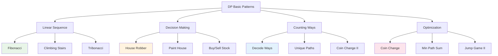

# Dynamic Programming Basic Patterns: Mastering the Foundation

Now that you understand DP fundamentals, let's explore the essential patterns that form the building blocks of more complex problems. These patterns appear repeatedly across different problem domains and mastering them gives you a powerful toolkit for solving DP challenges.

## Table of Contents
1. [Pattern Overview](#pattern-overview)
2. [Linear Sequence Patterns](#linear-sequence-patterns)
3. [Decision Making Patterns](#decision-making-patterns)
4. [Counting Patterns](#counting-patterns)
5. [Optimization Patterns](#optimization-patterns)
6. [Pattern Recognition Guide](#pattern-recognition-guide)
7. [Advanced Variations](#advanced-variations)
8. [Problem-Solving Framework](#problem-solving-framework)

## Pattern Overview {#pattern-overview}

### The Core DP Patterns



## Linear Sequence Patterns {#linear-sequence-patterns}

### Pattern 1: Fibonacci Family

The classic Fibonacci pattern where each element depends on previous elements.

```go
// Basic Fibonacci: F(n) = F(n-1) + F(n-2)
func fibonacci(n int) int {
    if n <= 1 {
        return n
    }
    
    prev2, prev1 := 0, 1
    
    for i := 2; i <= n; i++ {
        current := prev1 + prev2
        prev2 = prev1
        prev1 = current
    }
    
    return prev1
}

// Tribonacci: T(n) = T(n-1) + T(n-2) + T(n-3)
func tribonacci(n int) int {
    if n == 0 {
        return 0
    }
    if n <= 2 {
        return 1
    }
    
    a, b, c := 0, 1, 1
    
    for i := 3; i <= n; i++ {
        next := a + b + c
        a, b, c = b, c, next
    }
    
    return c
}
```

### Pattern 2: Climbing Stairs Variants

Classic step-counting problems with different constraints.

```go
// Basic: 1 or 2 steps at a time
func climbStairs(n int) int {
    if n <= 2 {
        return n
    }
    
    first, second := 1, 2
    
    for i := 3; i <= n; i++ {
        third := first + second
        first = second
        second = third
    }
    
    return second
}

// Advanced: Variable step sizes
func climbStairsVariableSteps(n int, steps []int) int {
    dp := make([]int, n+1)
    dp[0] = 1  // One way to stay at ground
    
    for i := 1; i <= n; i++ {
        for _, step := range steps {
            if i >= step {
                dp[i] += dp[i-step]
            }
        }
    }
    
    return dp[n]
}

// With cost: Each step has a cost
func minCostClimbingStairs(cost []int) int {
    n := len(cost)
    if n <= 1 {
        return 0
    }
    
    // dp[i] = min cost to reach step i
    prev2, prev1 := cost[0], cost[1]
    
    for i := 2; i < n; i++ {
        current := cost[i] + min(prev1, prev2)
        prev2 = prev1
        prev1 = current
    }
    
    // Can start from step 0 or 1, reach top (n) or (n-1)
    return min(prev1, prev2)
}

func min(a, b int) int {
    if a < b {
        return a
    }
    return b
}
```

## Decision Making Patterns {#decision-making-patterns}

### Pattern 3: House Robber Family

Binary choice problems: take it or leave it.

```go
// Basic House Robber: Adjacent houses can't both be robbed
func rob(nums []int) int {
    if len(nums) == 0 {
        return 0
    }
    if len(nums) == 1 {
        return nums[0]
    }
    
    // prev2 = max money up to house i-2
    // prev1 = max money up to house i-1
    prev2, prev1 := 0, nums[0]
    
    for i := 1; i < len(nums); i++ {
        // Either rob current house + prev2, or don't rob (prev1)
        current := max(prev1, prev2+nums[i])
        prev2 = prev1
        prev1 = current
    }
    
    return prev1
}

// House Robber II: Houses in a circle (first and last adjacent)
func robCircular(nums []int) int {
    n := len(nums)
    if n == 0 {
        return 0
    }
    if n == 1 {
        return nums[0]
    }
    if n == 2 {
        return max(nums[0], nums[1])
    }
    
    // Case 1: Rob houses 0 to n-2 (exclude last)
    case1 := robLinear(nums[:n-1])
    
    // Case 2: Rob houses 1 to n-1 (exclude first)
    case2 := robLinear(nums[1:])
    
    return max(case1, case2)
}

func robLinear(nums []int) int {
    prev2, prev1 := 0, nums[0]
    
    for i := 1; i < len(nums); i++ {
        current := max(prev1, prev2+nums[i])
        prev2 = prev1
        prev1 = current
    }
    
    return prev1
}

// House Robber III: Binary tree (parent-child can't both be robbed)
type TreeNode struct {
    Val   int
    Left  *TreeNode
    Right *TreeNode
}

func robTree(root *TreeNode) int {
    robbed, notRobbed := robTreeHelper(root)
    return max(robbed, notRobbed)
}

func robTreeHelper(node *TreeNode) (int, int) {
    if node == nil {
        return 0, 0
    }
    
    leftRobbed, leftNotRobbed := robTreeHelper(node.Left)
    rightRobbed, rightNotRobbed := robTreeHelper(node.Right)
    
    // If we rob this node, we can't rob its children
    robbed := node.Val + leftNotRobbed + rightNotRobbed
    
    // If we don't rob this node, we take max from each child
    notRobbed := max(leftRobbed, leftNotRobbed) + max(rightRobbed, rightNotRobbed)
    
    return robbed, notRobbed
}

func max(a, b int) int {
    if a > b {
        return a
    }
    return b
}
```

### Pattern 4: Paint House Variations

Multiple choice problems with constraints.

```go
// Paint House: 3 colors, no adjacent houses same color
func minCostPaintHouse(costs [][]int) int {
    if len(costs) == 0 {
        return 0
    }
    
    n := len(costs)
    
    // dp[color] = min cost to paint up to current house with that color
    red, blue, green := costs[0][0], costs[0][1], costs[0][2]
    
    for i := 1; i < n; i++ {
        newRed := costs[i][0] + min(blue, green)
        newBlue := costs[i][1] + min(red, green)
        newGreen := costs[i][2] + min(red, blue)
        
        red, blue, green = newRed, newBlue, newGreen
    }
    
    return min(red, min(blue, green))
}

// Paint House II: k colors
func minCostPaintHouseK(costs [][]int, k int) int {
    if len(costs) == 0 || k == 0 {
        return 0
    }
    
    n := len(costs)
    dp := make([]int, k)
    copy(dp, costs[0])
    
    for i := 1; i < n; i++ {
        newDP := make([]int, k)
        
        for j := 0; j < k; j++ {
            newDP[j] = costs[i][j] + minExcluding(dp, j)
        }
        
        dp = newDP
    }
    
    return minInSlice(dp)
}

func minExcluding(arr []int, excludeIdx int) int {
    minVal := math.MaxInt32
    for i, val := range arr {
        if i != excludeIdx && val < minVal {
            minVal = val
        }
    }
    return minVal
}

func minInSlice(arr []int) int {
    minVal := arr[0]
    for _, val := range arr[1:] {
        if val < minVal {
            minVal = val
        }
    }
    return minVal
}
```

## Counting Patterns {#counting-patterns}

### Pattern 5: Decode Ways

Counting valid interpretations or paths.

```go
// Decode Ways: "226" -> "BZ"(2,26), "VF"(22,6), "BBF"(2,2,6)
func numDecodings(s string) int {
    if len(s) == 0 || s[0] == '0' {
        return 0
    }
    
    n := len(s)
    
    // dp[i] = number of ways to decode s[0:i]
    prev2, prev1 := 1, 1  // prev2 = dp[i-2], prev1 = dp[i-1]
    
    for i := 1; i < n; i++ {
        current := 0
        
        // Single digit decode
        if s[i] != '0' {
            current += prev1
        }
        
        // Two digit decode
        twoDigit := (s[i-1]-'0')*10 + (s[i]-'0')
        if twoDigit >= 10 && twoDigit <= 26 {
            current += prev2
        }
        
        prev2 = prev1
        prev1 = current
    }
    
    return prev1
}

// Decode Ways II: With '*' wildcard
func numDecodingsII(s string) int {
    const MOD = 1e9 + 7
    n := len(s)
    
    prev2, prev1 := 1, waysForSingle(s[0])
    
    for i := 1; i < n; i++ {
        current := 0
        
        // Single character
        current = (current + prev1*waysForSingle(s[i])) % MOD
        
        // Two characters
        current = (current + prev2*waysForDouble(s[i-1], s[i])) % MOD
        
        prev2 = prev1
        prev1 = current
    }
    
    return prev1
}

func waysForSingle(c byte) int {
    if c == '*' {
        return 9  // 1-9
    }
    if c == '0' {
        return 0
    }
    return 1
}

func waysForDouble(c1, c2 byte) int {
    if c1 == '*' && c2 == '*' {
        return 15  // 11-19 (9) + 21-26 (6)
    }
    if c1 == '*' {
        if c2 >= '0' && c2 <= '6' {
            return 2  // 1c, 2c
        }
        return 1  // 1c only
    }
    if c2 == '*' {
        if c1 == '1' {
            return 9  // 11-19
        }
        if c1 == '2' {
            return 6  // 21-26
        }
        return 0
    }
    
    // Both specific digits
    num := int(c1-'0')*10 + int(c2-'0')
    if num >= 10 && num <= 26 {
        return 1
    }
    return 0
}
```

### Pattern 6: Unique Paths

Grid traversal counting problems.

```go
// Basic Unique Paths: Only right and down moves
func uniquePaths(m, n int) int {
    // Space-optimized version
    dp := make([]int, n)
    for i := 0; i < n; i++ {
        dp[i] = 1
    }
    
    for i := 1; i < m; i++ {
        for j := 1; j < n; j++ {
            dp[j] += dp[j-1]
        }
    }
    
    return dp[n-1]
}

// Unique Paths II: With obstacles
func uniquePathsWithObstacles(obstacleGrid [][]int) int {
    m, n := len(obstacleGrid), len(obstacleGrid[0])
    
    if obstacleGrid[0][0] == 1 {
        return 0
    }
    
    dp := make([]int, n)
    dp[0] = 1
    
    for i := 0; i < m; i++ {
        for j := 0; j < n; j++ {
            if obstacleGrid[i][j] == 1 {
                dp[j] = 0
            } else if j > 0 {
                dp[j] += dp[j-1]
            }
        }
    }
    
    return dp[n-1]
}

// Unique Paths III: Visit all empty squares exactly once
func uniquePathsIII(grid [][]int) int {
    m, n := len(grid), len(grid[0])
    startRow, startCol := 0, 0
    emptySquares := 0
    
    // Find start and count empty squares
    for i := 0; i < m; i++ {
        for j := 0; j < n; j++ {
            if grid[i][j] == 1 {
                startRow, startCol = i, j
                emptySquares++
            } else if grid[i][j] == 0 {
                emptySquares++
            }
        }
    }
    
    return dfsUniquePathsIII(grid, startRow, startCol, emptySquares)
}

func dfsUniquePathsIII(grid [][]int, row, col, remaining int) int {
    // Out of bounds or obstacle
    if row < 0 || row >= len(grid) || col < 0 || col >= len(grid[0]) || grid[row][col] == -1 {
        return 0
    }
    
    // Found end
    if grid[row][col] == 2 {
        if remaining == 1 {
            return 1  // Visited all squares
        }
        return 0
    }
    
    // Mark as visited
    originalValue := grid[row][col]
    grid[row][col] = -1
    
    // Explore all directions
    paths := 0
    directions := [][2]int{{-1, 0}, {1, 0}, {0, -1}, {0, 1}}
    
    for _, dir := range directions {
        newRow, newCol := row+dir[0], col+dir[1]
        paths += dfsUniquePathsIII(grid, newRow, newCol, remaining-1)
    }
    
    // Backtrack
    grid[row][col] = originalValue
    
    return paths
}
```

## Optimization Patterns {#optimization-patterns}

### Pattern 7: Coin Change Family

Classic optimization problems with unlimited resources.

```go
// Coin Change: Minimum coins to make amount
func coinChange(coins []int, amount int) int {
    dp := make([]int, amount+1)
    
    // Initialize with impossible value
    for i := 1; i <= amount; i++ {
        dp[i] = amount + 1
    }
    
    dp[0] = 0  // 0 coins for amount 0
    
    for i := 1; i <= amount; i++ {
        for _, coin := range coins {
            if coin <= i {
                dp[i] = min(dp[i], dp[i-coin]+1)
            }
        }
    }
    
    if dp[amount] > amount {
        return -1
    }
    return dp[amount]
}

// Coin Change II: Number of ways to make amount
func coinChangeII(amount int, coins []int) int {
    dp := make([]int, amount+1)
    dp[0] = 1  // One way to make amount 0
    
    // Process each coin type
    for _, coin := range coins {
        for i := coin; i <= amount; i++ {
            dp[i] += dp[i-coin]
        }
    }
    
    return dp[amount]
}

// Perfect Squares: Minimum squares to sum to n
func numSquares(n int) int {
    dp := make([]int, n+1)
    
    for i := 1; i <= n; i++ {
        dp[i] = i  // Worst case: all 1's
        
        for j := 1; j*j <= i; j++ {
            square := j * j
            dp[i] = min(dp[i], dp[i-square]+1)
        }
    }
    
    return dp[n]
}
```

### Pattern 8: Jump Game Variants

Optimization problems with movement constraints.

```go
// Jump Game II: Minimum jumps to reach end
func minJumps(nums []int) int {
    n := len(nums)
    if n <= 1 {
        return 0
    }
    
    jumps := 0
    currentEnd := 0
    farthest := 0
    
    for i := 0; i < n-1; i++ {
        // Update farthest reachable position
        farthest = max(farthest, i+nums[i])
        
        // If we've reached the end of current jump range
        if i == currentEnd {
            jumps++
            currentEnd = farthest
            
            // Early termination if we can reach the end
            if currentEnd >= n-1 {
                break
            }
        }
    }
    
    return jumps
}

// Jump Game VII: Can reach end with jump constraints
func canReach(s string, minJump, maxJump int) bool {
    n := len(s)
    if s[0] == '1' || s[n-1] == '1' {
        return false
    }
    
    dp := make([]bool, n)
    dp[0] = true
    
    reachableCount := 0
    
    for i := 1; i < n; i++ {
        // Update reachable count for sliding window
        if i >= minJump && dp[i-minJump] {
            reachableCount++
        }
        if i > maxJump && dp[i-maxJump-1] {
            reachableCount--
        }
        
        // Can reach position i if it's '0' and within jump range
        dp[i] = s[i] == '0' && reachableCount > 0
    }
    
    return dp[n-1]
}
```

## Pattern Recognition Guide {#pattern-recognition-guide}

### How to Identify Each Pattern

```go
type PatternRecognizer struct {
    patterns map[string][]string
}

func NewPatternRecognizer() *PatternRecognizer {
    return &PatternRecognizer{
        patterns: map[string][]string{
            "fibonacci": {
                "previous elements", "sequence", "nth term", 
                "depends on earlier terms", "recurrence relation",
            },
            "house_robber": {
                "adjacent", "can't choose both", "maximize profit",
                "binary choice", "non-adjacent elements",
            },
            "climbing_stairs": {
                "steps", "ways to reach", "1 or 2 steps",
                "count paths", "staircase",
            },
            "coin_change": {
                "minimum coins", "make amount", "unlimited use",
                "change", "denominations",
            },
            "decode_ways": {
                "decode", "interpretations", "valid combinations",
                "string to numbers", "ambiguous parsing",
            },
            "unique_paths": {
                "grid", "paths", "top-left to bottom-right",
                "only right/down", "obstacles",
            },
        },
    }
}

func (pr *PatternRecognizer) IdentifyPattern(problem string) string {
    problem = strings.ToLower(problem)
    
    maxMatches := 0
    bestPattern := "unknown"
    
    for pattern, keywords := range pr.patterns {
        matches := 0
        for _, keyword := range keywords {
            if strings.Contains(problem, keyword) {
                matches++
            }
        }
        
        if matches > maxMatches {
            maxMatches = matches
            bestPattern = pattern
        }
    }
    
    return bestPattern
}
```

### Pattern Selection Matrix

| Problem Characteristic | Likely Pattern | Key DP Relation |
|----------------------|---------------|-----------------|
| **Sequence dependency** | Fibonacci | `dp[i] = f(dp[i-1], dp[i-2])` |
| **Binary choice per step** | House Robber | `dp[i] = max(take, skip)` |
| **Count ways to reach** | Climbing Stairs | `dp[i] = sum(dp[i-steps])` |
| **Minimum/Maximum resource** | Coin Change | `dp[i] = opt(dp[i-cost] + 1)` |
| **String/Array interpretation** | Decode Ways | `dp[i] = ways(single) + ways(double)` |
| **Grid traversal counting** | Unique Paths | `dp[i][j] = dp[i-1][j] + dp[i][j-1]` |

## Advanced Variations {#advanced-variations}

### Pattern Combinations

```go
// House Robber + Paint House: Rob with color constraints
func robWithColorConstraints(houses [][]int) int {
    if len(houses) == 0 {
        return 0
    }
    
    n := len(houses)
    colors := len(houses[0])
    
    // prev[color][robbed] = max money with color and rob status
    prev := make([][]int, colors)
    for i := range prev {
        prev[i] = make([]int, 2)
        prev[i][1] = houses[0][i]  // Rob first house with color i
    }
    
    for i := 1; i < n; i++ {
        curr := make([][]int, colors)
        for j := range curr {
            curr[j] = make([]int, 2)
        }
        
        for color := 0; color < colors; color++ {
            // Don't rob current house
            for prevColor := 0; prevColor < colors; prevColor++ {
                if prevColor != color {  // Different color constraint
                    curr[color][0] = max(curr[color][0], 
                        max(prev[prevColor][0], prev[prevColor][1]))
                }
            }
            
            // Rob current house
            for prevColor := 0; prevColor < colors; prevColor++ {
                if prevColor != color {  // Different color constraint
                    curr[color][1] = max(curr[color][1], 
                        prev[prevColor][0] + houses[i][color])
                }
            }
        }
        
        prev = curr
    }
    
    result := 0
    for color := 0; color < colors; color++ {
        result = max(result, max(prev[color][0], prev[color][1]))
    }
    
    return result
}

// Climbing Stairs + Coin Change: Variable cost per step
func minCostVariableSteps(cost []int, steps []int) int {
    n := len(cost)
    dp := make([]int, n)
    
    for i := range dp {
        dp[i] = math.MaxInt32
    }
    
    dp[0] = cost[0]
    
    for i := 1; i < n; i++ {
        for _, step := range steps {
            if i >= step {
                dp[i] = min(dp[i], dp[i-step] + cost[i])
            }
        }
    }
    
    return dp[n-1]
}
```

## Problem-Solving Framework {#problem-solving-framework}

### The BASIC Method

**B**ase cases - What are the simplest subproblems?
**A**ssumption - What does dp[i] represent?
**S**tate transition - How do states connect?
**I**nitialization - What are the starting values?
**C**omputation order - In what sequence to fill the table?

```go
func solveBasicDP(input interface{}) int {
    // B - Base cases
    if len(input) == 0 {
        return 0
    }
    
    // A - Assumption: dp[i] = optimal solution for subproblem i
    n := getSize(input)
    dp := make([]int, n)
    
    // I - Initialization
    dp[0] = getBaseValue(input, 0)
    
    // C - Computation order & S - State transition
    for i := 1; i < n; i++ {
        dp[i] = computeTransition(dp, input, i)
    }
    
    return dp[n-1]
}
```

### Testing Framework

```go
func TestBasicPatterns() {
    testCases := []struct {
        name     string
        function func([]int) int
        input    []int
        expected int
    }{
        {"Fibonacci", fibonacci, []int{5}, 5},
        {"ClimbStairs", climbStairs, []int{5}, 8},
        {"HouseRobber", rob, []int{2, 7, 9, 3, 1}, 12},
        {"CoinChange", func(coins []int) int { return coinChange(coins, 11) }, 
         []int{1, 2, 5}, 3},
    }
    
    for _, tc := range testCases {
        result := tc.function(tc.input)
        if result != tc.expected {
            fmt.Printf("Test %s failed: got %d, expected %d\n", 
                tc.name, result, tc.expected)
        } else {
            fmt.Printf("Test %s passed\n", tc.name)
        }
    }
}
```

## Conclusion

These basic DP patterns form the foundation for solving complex optimization problems. Master these patterns and you'll be able to recognize and solve a wide variety of DP challenges.

### Pattern Mastery Checklist:
- ✅ **Fibonacci variants** - Understand sequence dependencies
- ✅ **House robber patterns** - Master binary choice optimization  
- ✅ **Climbing stairs** - Count paths with constraints
- ✅ **Coin change** - Optimize resource allocation
- ✅ **Decode ways** - Count valid interpretations
- ✅ **Unique paths** - Grid traversal optimization

### Key Insights:
1. **Pattern recognition is crucial** - Most DP problems are variations of these basic patterns
2. **State definition drives solution** - Clear state representation leads to correct transitions  
3. **Space optimization matters** - Many problems can use O(1) space instead of O(n)
4. **Edge cases are critical** - Empty inputs, single elements, and boundary conditions
5. **Multiple patterns can combine** - Complex problems often merge multiple basic patterns

**🚀 Next Steps**: With these patterns mastered, you're ready to tackle knapsack problems and sequence optimization challenges!

---

*Next in series: [DP Knapsack Patterns](/blog/dsa/dp-knapsack-patterns) | Previous: [DP Fundamentals](/blog/dsa/dp-fundamentals)*