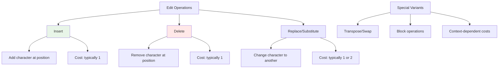

# Edit Distance Mastery: Dynamic Programming for String Transformation

Edit distance algorithms solve the fundamental problem of measuring how different two strings are and finding the minimum cost to transform one string into another. These algorithms power spell checkers, DNA sequence analysis, and many other real-world applications.

## Table of Contents
1. [Edit Distance Fundamentals](#edit-distance-fundamentals)
2. [Basic Levenshtein Distance](#levenshtein-distance)
3. [Weighted Edit Operations](#weighted-operations)
4. [Constrained Edit Distance](#constrained-edit-distance)
5. [Advanced Edit Distance Variants](#advanced-variants)
6. [Real-World Applications](#real-world-applications)
7. [Problem Recognition Framework](#problem-recognition)

## Edit Distance Fundamentals {#edit-distance-fundamentals}

Edit distance measures the minimum number of single-character operations needed to transform one string into another.

### Core Operations



### Problem Intuition

```go
// Demonstrate edit distance concept with examples
func demonstrateEditDistance() {
    examples := []struct {
        str1, str2 string
        expectedDistance int
        operations []string
    }{
        {
            str1: "kitten",
            str2: "sitting", 
            expectedDistance: 3,
            operations: []string{
                "substitute k→s", 
                "substitute e→i", 
                "insert g",
            },
        },
        {
            str1: "saturday",
            str2: "sunday",
            expectedDistance: 3,
            operations: []string{
                "delete s", 
                "delete a", 
                "delete t",
            },
        },
        {
            str1: "intention",
            str2: "execution",
            expectedDistance: 5,
            operations: []string{
                "delete i", 
                "substitute n→x", 
                "substitute t→e", 
                "substitute e→c", 
                "substitute n→u",
            },
        },
    }
    
    for _, example := range examples {
        distance := minEditDistance(example.str1, example.str2)
        fmt.Printf("'%s' → '%s': distance = %d\n", 
            example.str1, example.str2, distance)
        fmt.Printf("Expected: %d, Operations: %v\n\n", 
            example.expectedDistance, example.operations)
    }
}
```

## Basic Levenshtein Distance {#levenshtein-distance}

### Classic 2D DP Implementation

```go
// Standard Levenshtein distance - minimum edits to transform str1 to str2
func minEditDistance(str1, str2 string) int {
    m, n := len(str1), len(str2)
    
    // dp[i][j] = min edits to transform str1[0:i] to str2[0:j]
    dp := make([][]int, m+1)
    for i := range dp {
        dp[i] = make([]int, n+1)
    }
    
    // Base cases: transforming empty string
    for i := 0; i <= m; i++ {
        dp[i][0] = i  // Delete all characters from str1
    }
    for j := 0; j <= n; j++ {
        dp[0][j] = j  // Insert all characters to make str2
    }
    
    // Fill the DP table
    for i := 1; i <= m; i++ {
        for j := 1; j <= n; j++ {
            if str1[i-1] == str2[j-1] {
                // Characters match: no operation needed
                dp[i][j] = dp[i-1][j-1]
            } else {
                // Characters don't match: try all operations
                substitute := dp[i-1][j-1] + 1  // Replace str1[i-1] with str2[j-1]
                insert := dp[i][j-1] + 1        // Insert str2[j-1]
                delete := dp[i-1][j] + 1        // Delete str1[i-1]
                
                dp[i][j] = min3(substitute, insert, delete)
            }
        }
    }
    
    return dp[m][n]
}

func min3(a, b, c int) int {
    if a < b {
        if a < c {
            return a
        }
        return c
    }
    if b < c {
        return b
    }
    return c
}
```

### Edit Distance with Operation Tracking

```go
// Track the actual operations performed during edit distance calculation
type EditOperation struct {
    Type string  // "insert", "delete", "substitute", "match"
    Char1 byte   // Character from str1 (for delete/substitute)
    Char2 byte   // Character from str2 (for insert/substitute)
    Pos1 int     // Position in str1
    Pos2 int     // Position in str2
}

func minEditDistanceWithOperations(str1, str2 string) (int, []EditOperation) {
    m, n := len(str1), len(str2)
    
    // DP table
    dp := make([][]int, m+1)
    for i := range dp {
        dp[i] = make([]int, n+1)
    }
    
    // Fill base cases
    for i := 0; i <= m; i++ {
        dp[i][0] = i
    }
    for j := 0; j <= n; j++ {
        dp[0][j] = j
    }
    
    // Fill DP table
    for i := 1; i <= m; i++ {
        for j := 1; j <= n; j++ {
            if str1[i-1] == str2[j-1] {
                dp[i][j] = dp[i-1][j-1]
            } else {
                dp[i][j] = 1 + min3(
                    dp[i-1][j-1], // substitute
                    dp[i][j-1],   // insert
                    dp[i-1][j],   // delete
                )
            }
        }
    }
    
    // Backtrack to find operations
    operations := make([]EditOperation, 0)
    i, j := m, n
    
    for i > 0 || j > 0 {
        if i > 0 && j > 0 && str1[i-1] == str2[j-1] {
            // Characters match
            operations = append([]EditOperation{{
                Type: "match",
                Char1: str1[i-1],
                Char2: str2[j-1],
                Pos1: i-1,
                Pos2: j-1,
            }}, operations...)
            i--
            j--
        } else if i > 0 && j > 0 && 
                  dp[i][j] == dp[i-1][j-1] + 1 {
            // Substitute operation
            operations = append([]EditOperation{{
                Type: "substitute",
                Char1: str1[i-1],
                Char2: str2[j-1],
                Pos1: i-1,
                Pos2: j-1,
            }}, operations...)
            i--
            j--
        } else if j > 0 && dp[i][j] == dp[i][j-1] + 1 {
            // Insert operation
            operations = append([]EditOperation{{
                Type: "insert",
                Char2: str2[j-1],
                Pos1: i,
                Pos2: j-1,
            }}, operations...)
            j--
        } else {
            // Delete operation
            operations = append([]EditOperation{{
                Type: "delete",
                Char1: str1[i-1],
                Pos1: i-1,
                Pos2: j,
            }}, operations...)
            i--
        }
    }
    
    return dp[m][n], operations
}
```

### Space-Optimized Edit Distance

```go
// Space-optimized edit distance using only O(min(m,n)) space
func minEditDistanceOptimized(str1, str2 string) int {
    m, n := len(str1), len(str2)
    
    // Ensure str2 is the shorter string for optimal space usage
    if m < n {
        return minEditDistanceOptimized(str2, str1)
    }
    
    // Use only two rows instead of full matrix
    prev := make([]int, n+1)
    curr := make([]int, n+1)
    
    // Initialize first row
    for j := 0; j <= n; j++ {
        prev[j] = j
    }
    
    // Process each character of str1
    for i := 1; i <= m; i++ {
        curr[0] = i  // Cost of deleting i characters from str1
        
        for j := 1; j <= n; j++ {
            if str1[i-1] == str2[j-1] {
                curr[j] = prev[j-1]  // No operation needed
            } else {
                curr[j] = 1 + min3(
                    prev[j-1],  // substitute
                    curr[j-1],  // insert
                    prev[j],    // delete
                )
            }
        }
        
        // Swap rows
        prev, curr = curr, prev
    }
    
    return prev[n]
}
```

## Weighted Edit Operations {#weighted-operations}

### Custom Operation Costs

```go
// Edit distance with custom costs for different operations
type EditCosts struct {
    InsertCost     int
    DeleteCost     int
    SubstituteCost int
}

func minEditDistanceWeighted(str1, str2 string, costs EditCosts) int {
    m, n := len(str1), len(str2)
    
    dp := make([][]int, m+1)
    for i := range dp {
        dp[i] = make([]int, n+1)
    }
    
    // Base cases with custom costs
    for i := 0; i <= m; i++ {
        dp[i][0] = i * costs.DeleteCost
    }
    for j := 0; j <= n; j++ {
        dp[0][j] = j * costs.InsertCost
    }
    
    // Fill DP table with custom costs
    for i := 1; i <= m; i++ {
        for j := 1; j <= n; j++ {
            if str1[i-1] == str2[j-1] {
                dp[i][j] = dp[i-1][j-1]  // No cost for match
            } else {
                substitute := dp[i-1][j-1] + costs.SubstituteCost
                insert := dp[i][j-1] + costs.InsertCost
                delete := dp[i-1][j] + costs.DeleteCost
                
                dp[i][j] = min3(substitute, insert, delete)
            }
        }
    }
    
    return dp[m][n]
}
```

### Character-Specific Edit Costs

```go
// Edit distance with character-specific operation costs
type CharacterCosts struct {
    InsertCosts     map[byte]int
    DeleteCosts     map[byte]int
    SubstituteCosts map[[2]byte]int  // [from][to] -> cost
}

func minEditDistanceCharSpecific(str1, str2 string, costs CharacterCosts) int {
    m, n := len(str1), len(str2)
    
    dp := make([][]int, m+1)
    for i := range dp {
        dp[i] = make([]int, n+1)
    }
    
    // Base cases with character-specific costs
    for i := 1; i <= m; i++ {
        deleteCost := costs.DeleteCosts[str1[i-1]]
        if deleteCost == 0 {
            deleteCost = 1  // Default cost
        }
        dp[i][0] = dp[i-1][0] + deleteCost
    }
    
    for j := 1; j <= n; j++ {
        insertCost := costs.InsertCosts[str2[j-1]]
        if insertCost == 0 {
            insertCost = 1  // Default cost
        }
        dp[0][j] = dp[0][j-1] + insertCost
    }
    
    // Fill DP table
    for i := 1; i <= m; i++ {
        for j := 1; j <= n; j++ {
            if str1[i-1] == str2[j-1] {
                dp[i][j] = dp[i-1][j-1]
            } else {
                // Get character-specific costs
                substituteCost := costs.SubstituteCosts[[2]byte{str1[i-1], str2[j-1]}]
                if substituteCost == 0 {
                    substituteCost = 1
                }
                
                insertCost := costs.InsertCosts[str2[j-1]]
                if insertCost == 0 {
                    insertCost = 1
                }
                
                deleteCost := costs.DeleteCosts[str1[i-1]]
                if deleteCost == 0 {
                    deleteCost = 1
                }
                
                substitute := dp[i-1][j-1] + substituteCost
                insert := dp[i][j-1] + insertCost
                delete := dp[i-1][j] + deleteCost
                
                dp[i][j] = min3(substitute, insert, delete)
            }
        }
    }
    
    return dp[m][n]
}
```

## Constrained Edit Distance {#constrained-edit-distance}

### Edit Distance with Maximum Operations

```go
// Edit distance with constraint on maximum number of operations
func minEditDistanceConstrained(str1, str2 string, maxOps int) int {
    m, n := len(str1), len(str2)
    
    // If the difference in lengths exceeds maxOps, impossible
    if abs(m-n) > maxOps {
        return -1  // Impossible
    }
    
    // 3D DP: dp[i][j][k] = can transform str1[0:i] to str2[0:j] with k operations
    dp := make([][][]bool, m+1)
    for i := range dp {
        dp[i] = make([][]bool, n+1)
        for j := range dp[i] {
            dp[i][j] = make([]bool, maxOps+1)
        }
    }
    
    // Base case: empty strings
    dp[0][0][0] = true
    
    // Initialize first row and column
    for i := 1; i <= m && i <= maxOps; i++ {
        dp[i][0][i] = true  // i deletions
    }
    for j := 1; j <= n && j <= maxOps; j++ {
        dp[0][j][j] = true  // j insertions
    }
    
    // Fill DP table
    for i := 1; i <= m; i++ {
        for j := 1; j <= n; j++ {
            for k := 0; k <= maxOps; k++ {
                if str1[i-1] == str2[j-1] {
                    // No operation needed
                    dp[i][j][k] = dp[i-1][j-1][k]
                } else if k > 0 {
                    // Try all operations (each costs 1)
                    substitute := dp[i-1][j-1][k-1]
                    insert := dp[i][j-1][k-1]
                    delete := dp[i-1][j][k-1]
                    
                    dp[i][j][k] = substitute || insert || delete
                }
            }
        }
    }
    
    // Find minimum operations needed
    for k := 0; k <= maxOps; k++ {
        if dp[m][n][k] {
            return k
        }
    }
    
    return -1  // Impossible within maxOps operations
}

func abs(x int) int {
    if x < 0 {
        return -x
    }
    return x
}
```

### Edit Distance with Forbidden Operations

```go
// Edit distance where certain operations are forbidden
type ForbiddenOps struct {
    NoInsert     bool
    NoDelete     bool
    NoSubstitute bool
    ForbiddenChars map[byte]bool  // Characters that cannot be inserted/deleted
}

func minEditDistanceForbidden(str1, str2 string, forbidden ForbiddenOps) int {
    m, n := len(str1), len(str2)
    
    const INF = 1000000
    
    dp := make([][]int, m+1)
    for i := range dp {
        dp[i] = make([]int, n+1)
        for j := range dp[i] {
            dp[i][j] = INF
        }
    }
    
    dp[0][0] = 0
    
    // Base cases considering forbidden operations
    if !forbidden.NoDelete {
        for i := 1; i <= m; i++ {
            if !forbidden.ForbiddenChars[str1[i-1]] {
                dp[i][0] = dp[i-1][0] + 1
            }
        }
    }
    
    if !forbidden.NoInsert {
        for j := 1; j <= n; j++ {
            if !forbidden.ForbiddenChars[str2[j-1]] {
                dp[0][j] = dp[0][j-1] + 1
            }
        }
    }
    
    // Fill DP table
    for i := 1; i <= m; i++ {
        for j := 1; j <= n; j++ {
            if str1[i-1] == str2[j-1] {
                dp[i][j] = dp[i-1][j-1]
            } else {
                // Try substitute
                if !forbidden.NoSubstitute {
                    dp[i][j] = min(dp[i][j], dp[i-1][j-1] + 1)
                }
                
                // Try insert
                if !forbidden.NoInsert && !forbidden.ForbiddenChars[str2[j-1]] {
                    dp[i][j] = min(dp[i][j], dp[i][j-1] + 1)
                }
                
                // Try delete
                if !forbidden.NoDelete && !forbidden.ForbiddenChars[str1[i-1]] {
                    dp[i][j] = min(dp[i][j], dp[i-1][j] + 1)
                }
            }
        }
    }
    
    if dp[m][n] >= INF {
        return -1  // Impossible
    }
    return dp[m][n]
}

func min(a, b int) int {
    if a < b {
        return a
    }
    return b
}
```

## Advanced Edit Distance Variants {#advanced-variants}

### Damerau-Levenshtein Distance (with Transpositions)

```go
// Damerau-Levenshtein distance including transposition operations
func damerauLevenshteinDistance(str1, str2 string) int {
    m, n := len(str1), len(str2)
    
    // Create character alphabet for the strings
    alphabet := make(map[byte]bool)
    for i := 0; i < m; i++ {
        alphabet[str1[i]] = true
    }
    for i := 0; i < n; i++ {
        alphabet[str2[i]] = true
    }
    
    maxDist := m + n
    
    // Extended DP table to handle transpositions
    dp := make([][]int, m+2)
    for i := range dp {
        dp[i] = make([]int, n+2)
    }
    
    // Initialize with maximum distance
    dp[0][0] = maxDist
    for i := 0; i <= m; i++ {
        dp[i+1][0] = maxDist
        dp[i+1][1] = i
    }
    for j := 0; j <= n; j++ {
        dp[0][j+1] = maxDist
        dp[1][j+1] = j
    }
    
    // Track last occurrence of each character in str1
    lastMatch := make(map[byte]int)
    for char := range alphabet {
        lastMatch[char] = 0
    }
    
    for i := 1; i <= m; i++ {
        lastMatchJ := 0
        
        for j := 1; j <= n; j++ {
            k := lastMatch[str2[j-1]]
            l := lastMatchJ
            cost := 1
            
            if str1[i-1] == str2[j-1] {
                cost = 0
                lastMatchJ = j
            }
            
            dp[i+1][j+1] = min4(
                dp[i][j] + cost,           // substitution
                dp[i+1][j] + 1,            // insertion
                dp[i][j+1] + 1,            // deletion
                dp[k][l] + (i-k-1) + 1 + (j-l-1), // transposition
            )
        }
        
        lastMatch[str1[i-1]] = i
    }
    
    return dp[m+1][n+1]
}

func min4(a, b, c, d int) int {
    return min(min(a, b), min(c, d))
}
```

### Edit Distance with Block Operations

```go
// Edit distance allowing block copy/move operations
type BlockOperation struct {
    Type string  // "copy", "move", "insert", "delete"
    Src  int     // Source position
    Dst  int     // Destination position  
    Len  int     // Length of block
    Cost int     // Cost of operation
}

func editDistanceWithBlocks(str1, str2 string, blockCost int) int {
    m, n := len(str1), len(str2)
    
    const INF = 1000000
    
    dp := make([][]int, m+1)
    for i := range dp {
        dp[i] = make([]int, n+1)
        for j := range dp[i] {
            dp[i][j] = INF
        }
    }
    
    dp[0][0] = 0
    
    // Standard operations
    for i := 0; i <= m; i++ {
        dp[i][0] = i  // Delete all
    }
    for j := 0; j <= n; j++ {
        dp[0][j] = j  // Insert all
    }
    
    for i := 1; i <= m; i++ {
        for j := 1; j <= n; j++ {
            // Standard edit operations
            if str1[i-1] == str2[j-1] {
                dp[i][j] = dp[i-1][j-1]
            } else {
                dp[i][j] = 1 + min3(
                    dp[i-1][j-1], // substitute
                    dp[i][j-1],   // insert
                    dp[i-1][j],   // delete
                )
            }
            
            // Block operations: find matching substrings
            for len := 2; len <= min(i, j); len++ {
                if i >= len && j >= len {
                    // Check if there's a matching block
                    match := true
                    for k := 0; k < len; k++ {
                        if str1[i-len+k] != str2[j-len+k] {
                            match = false
                            break
                        }
                    }
                    
                    if match {
                        // Block copy operation
                        blockOp := dp[i-len][j-len] + blockCost
                        dp[i][j] = min(dp[i][j], blockOp)
                    }
                }
            }
        }
    }
    
    return dp[m][n]
}
```

## Real-World Applications {#real-world-applications}

### Spell Checker Implementation

```go
// Spell checker using edit distance for suggestions
type SpellChecker struct {
    dictionary map[string]bool
    words      []string
    maxSuggestions int
    maxDistance    int
}

type Suggestion struct {
    Word     string
    Distance int
    Confidence float64
}

func NewSpellChecker(words []string, maxSugg, maxDist int) *SpellChecker {
    dict := make(map[string]bool)
    for _, word := range words {
        dict[strings.ToLower(word)] = true
    }
    
    return &SpellChecker{
        dictionary: dict,
        words: words,
        maxSuggestions: maxSugg,
        maxDistance: maxDist,
    }
}

func (sc *SpellChecker) IsCorrect(word string) bool {
    return sc.dictionary[strings.ToLower(word)]
}

func (sc *SpellChecker) GetSuggestions(word string) []Suggestion {
    if sc.IsCorrect(word) {
        return []Suggestion{{word, 0, 1.0}}
    }
    
    word = strings.ToLower(word)
    var suggestions []Suggestion
    
    for _, dictWord := range sc.words {
        distance := minEditDistance(word, strings.ToLower(dictWord))
        
        if distance <= sc.maxDistance {
            confidence := 1.0 - float64(distance)/float64(max(len(word), len(dictWord)))
            suggestions = append(suggestions, Suggestion{
                Word: dictWord,
                Distance: distance,
                Confidence: confidence,
            })
        }
    }
    
    // Sort by distance, then by confidence
    sort.Slice(suggestions, func(i, j int) bool {
        if suggestions[i].Distance != suggestions[j].Distance {
            return suggestions[i].Distance < suggestions[j].Distance
        }
        return suggestions[i].Confidence > suggestions[j].Confidence
    })
    
    // Limit results
    if len(suggestions) > sc.maxSuggestions {
        suggestions = suggestions[:sc.maxSuggestions]
    }
    
    return suggestions
}

func (sc *SpellChecker) CheckText(text string) map[string][]Suggestion {
    words := strings.Fields(text)
    corrections := make(map[string][]Suggestion)
    
    for _, word := range words {
        cleanWord := strings.Trim(word, ".,!?;:")
        if !sc.IsCorrect(cleanWord) {
            corrections[cleanWord] = sc.GetSuggestions(cleanWord)
        }
    }
    
    return corrections
}
```

### DNA Sequence Analysis

```go
// DNA sequence analysis using edit distance for mutations
type DNAAnalyzer struct {
    reference string
    costs     EditCosts
}

type Mutation struct {
    Type     string  // "substitution", "insertion", "deletion"
    Position int
    From     string
    To       string
    Score    float64
}

func NewDNAAnalyzer(reference string) *DNAAnalyzer {
    return &DNAAnalyzer{
        reference: reference,
        costs: EditCosts{
            InsertCost: 2,     // Insertion mutations are more costly
            DeleteCost: 2,     // Deletion mutations are more costly  
            SubstituteCost: 1, // Point mutations are most common
        },
    }
}

func (dna *DNAAnalyzer) AnalyzeSequence(sequence string) (int, []Mutation) {
    distance := minEditDistanceWeighted(dna.reference, sequence, dna.costs)
    mutations := dna.findMutations(sequence)
    
    return distance, mutations
}

func (dna *DNAAnalyzer) findMutations(sequence string) []Mutation {
    _, operations := minEditDistanceWithOperations(dna.reference, sequence)
    
    var mutations []Mutation
    
    for _, op := range operations {
        if op.Type == "match" {
            continue
        }
        
        mutation := Mutation{
            Type: op.Type,
            Position: op.Pos1,
        }
        
        switch op.Type {
        case "substitute":
            mutation.From = string(op.Char1)
            mutation.To = string(op.Char2)
            mutation.Score = dna.calculateMutationScore(op.Char1, op.Char2)
        case "insert":
            mutation.To = string(op.Char2)
            mutation.Score = 0.3  // Insertion score
        case "delete":
            mutation.From = string(op.Char1)
            mutation.Score = 0.3  // Deletion score
        }
        
        mutations = append(mutations, mutation)
    }
    
    return mutations
}

func (dna *DNAAnalyzer) calculateMutationScore(from, to byte) float64 {
    // Transition vs transversion scoring
    transitions := map[[2]byte]bool{
        {'A', 'G'}: true, {'G', 'A'}: true,  // Purine to purine
        {'C', 'T'}: true, {'T', 'C'}: true,  // Pyrimidine to pyrimidine
    }
    
    if transitions[[2]byte{from, to}] {
        return 0.7  // Transitions are more likely
    }
    return 0.4  // Transversions are less likely
}

func (dna *DNAAnalyzer) FindSimilarSequences(database []string, threshold int) []string {
    var similar []string
    
    for _, seq := range database {
        if minEditDistanceWeighted(dna.reference, seq, dna.costs) <= threshold {
            similar = append(similar, seq)
        }
    }
    
    return similar
}
```

### Fuzzy String Matching

```go
// Fuzzy string matching for search applications
type FuzzyMatcher struct {
    threshold float64  // Similarity threshold (0-1)
}

func NewFuzzyMatcher(threshold float64) *FuzzyMatcher {
    return &FuzzyMatcher{threshold: threshold}
}

func (fm *FuzzyMatcher) Similarity(str1, str2 string) float64 {
    if str1 == str2 {
        return 1.0
    }
    
    maxLen := max(len(str1), len(str2))
    if maxLen == 0 {
        return 1.0
    }
    
    distance := minEditDistance(str1, str2)
    return 1.0 - float64(distance)/float64(maxLen)
}

func (fm *FuzzyMatcher) Match(query string, candidates []string) []string {
    var matches []string
    
    for _, candidate := range candidates {
        if fm.Similarity(strings.ToLower(query), strings.ToLower(candidate)) >= fm.threshold {
            matches = append(matches, candidate)
        }
    }
    
    return matches
}

func (fm *FuzzyMatcher) BestMatch(query string, candidates []string) (string, float64) {
    bestMatch := ""
    bestScore := 0.0
    
    for _, candidate := range candidates {
        score := fm.Similarity(strings.ToLower(query), strings.ToLower(candidate))
        if score > bestScore {
            bestScore = score
            bestMatch = candidate
        }
    }
    
    return bestMatch, bestScore
}

// Advanced fuzzy matching with phonetic similarity
func (fm *FuzzyMatcher) PhoneticSimilarity(str1, str2 string) float64 {
    // Simple phonetic transformation (can be extended with Soundex, Metaphone, etc.)
    phonetic1 := fm.simplePhonetic(str1)
    phonetic2 := fm.simplePhonetic(str2)
    
    return fm.Similarity(phonetic1, phonetic2)
}

func (fm *FuzzyMatcher) simplePhonetic(s string) string {
    // Basic phonetic transformations
    replacements := map[string]string{
        "ph": "f", "gh": "f", "ck": "k", "c": "k",
        "th": "t", "sh": "s", "ch": "s",
    }
    
    s = strings.ToLower(s)
    for old, new := range replacements {
        s = strings.ReplaceAll(s, old, new)
    }
    
    return s
}
```

## Problem Recognition Framework {#problem-recognition}

### Edit Distance Pattern Identification

```go
type EditDistanceClassifier struct {
    patterns map[string][]string
}

func NewEditDistanceClassifier() *EditDistanceClassifier {
    return &EditDistanceClassifier{
        patterns: map[string][]string{
            "basic_edit_distance": {
                "minimum operations", "transform string", "edit distance",
                "levenshtein", "string similarity",
            },
            "spell_checker": {
                "spell check", "auto-correct", "suggestions", "typo",
                "dictionary", "word correction",
            },
            "bioinformatics": {
                "DNA", "sequence alignment", "mutation", "genome",
                "protein", "biological sequence",
            },
            "version_control": {
                "diff", "patch", "merge", "conflict", "version",
                "file comparison", "code changes",
            },
            "fuzzy_search": {
                "approximate match", "search suggestions", "typo tolerance",
                "similar items", "fuzzy matching",
            },
        },
    }
}

func (edc *EditDistanceClassifier) ClassifyProblem(description string) string {
    desc := strings.ToLower(description)
    maxScore := 0
    bestMatch := "basic_edit_distance"
    
    for pattern, keywords := range edc.patterns {
        score := 0
        for _, keyword := range keywords {
            if strings.Contains(desc, keyword) {
                score++
            }
        }
        
        if score > maxScore {
            maxScore = score
            bestMatch = pattern
        }
    }
    
    return bestMatch
}
```

### Algorithm Selection Guide

| Use Case | Algorithm | Time | Space | Key Features |
|----------|-----------|------|-------|--------------|
| **Basic Edit Distance** | Standard DP | O(mn) | O(mn) | Simple, tracks operations |
| **Memory Constrained** | Space-optimized | O(mn) | O(min(m,n)) | Saves space |
| **Spell Checking** | Weighted costs | O(mn) | O(mn) | Custom operation costs |
| **DNA Analysis** | Damerau-Levenshtein | O(mn) | O(mn) | Includes transpositions |
| **Large Sequences** | Hirschberg | O(mn) | O(min(m,n)) | Divide and conquer |

## Conclusion

Edit distance algorithms provide powerful tools for measuring string similarity and are essential for many text processing applications.

### Edit Distance Mastery Framework:

**🔍 Core Concepts**
- **Three basic operations** - Insert, delete, substitute
- **DP formulation** - Optimal substructure with memoization
- **Operation tracking** - Reconstruct transformation sequence

**⚡ Optimization Techniques**
- **Space optimization** - Reduce from O(mn) to O(min(m,n))
- **Early termination** - Stop when distance exceeds threshold
- **Custom costs** - Adapt to domain-specific requirements

**🚀 Advanced Applications**
- **Spell checkers** - Suggestion generation and ranking
- **Bioinformatics** - DNA/protein sequence analysis
- **Fuzzy matching** - Approximate string search

### Key Implementation Strategies:

1. **Choose the right variant** - Standard, weighted, or constrained based on needs
2. **Consider space constraints** - Use optimized versions for large inputs
3. **Domain adaptation** - Customize costs for specific applications
4. **Performance tuning** - Early termination and pruning strategies

**🚀 Next Steps**: Master palindrome patterns to complete your sequence DP foundation and tackle complex string structure problems!

---

*Next in series: [Palindrome Patterns](/blog/dsa/dp-palindrome-patterns) | Previous: [LCS Patterns](/blog/dsa/dp-lcs-patterns)*