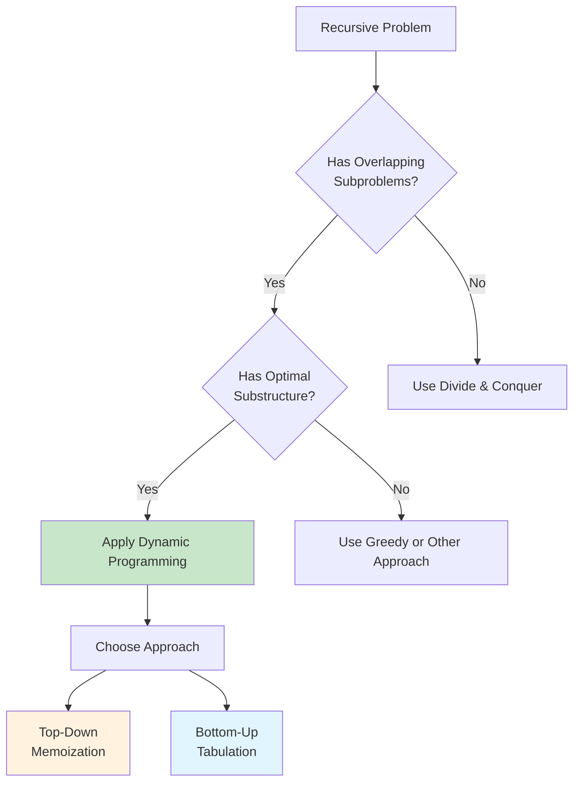

# Dynamic Programming Fundamentals: From Recursion to Optimization

Dynamic Programming (DP) is a powerful algorithmic paradigm that solves complex problems by breaking them into simpler subproblems and storing their solutions to avoid redundant calculations. It's the foundation for solving optimization problems where we need to find the best solution among many possibilities.

## Table of Contents
1. [What is Dynamic Programming?](#what-is-dp)
2. [Core Principles](#core-principles)
3. [Memoization vs Tabulation](#memoization-vs-tabulation)
4. [Designing DP Solutions](#designing-dp-solutions)
5. [State Transition Framework](#state-transition-framework)
6. [Classic Examples](#classic-examples)
7. [Problem Recognition](#problem-recognition)
8. [Implementation Patterns](#implementation-patterns)
9. [Optimization Techniques](#optimization-techniques)
10. [Common Pitfalls](#common-pitfalls)

## What is Dynamic Programming? {#what-is-dp}

Dynamic Programming combines:
- **Optimal Substructure**: Optimal solution contains optimal solutions to subproblems
- **Overlapping Subproblems**: Same subproblems are solved multiple times
- **Memoization**: Store solutions to avoid recomputation

### The DP Transform



## Core Principles {#core-principles}

### 1. Optimal Substructure

The optimal solution to a problem contains optimal solutions to its subproblems.

```go
// Example: Fibonacci sequence demonstrates optimal substructure
// fib(n) = fib(n-1) + fib(n-2)
// To get optimal fib(n), we need optimal fib(n-1) and fib(n-2)

func fibonacciNaive(n int) int {
    if n <= 1 {
        return n
    }
    return fibonacciNaive(n-1) + fibonacciNaive(n-2)
}

// Time: O(2^n) - exponential due to repeated calculations
// Space: O(n) - recursion stack
```

### 2. Overlapping Subproblems

Same subproblems are solved multiple times in naive recursive approach.

```go
// Visualization of fib(5) recursive calls:
//                    fib(5)
//                   /      \
//               fib(4)      fib(3)
//              /     \     /     \
//          fib(3)  fib(2) fib(2) fib(1)
//         /    \   /   \   /   \
//     fib(2) fib(1) fib(1) fib(0) fib(1) fib(0)
//    /    \
// fib(1) fib(0)

// Notice fib(2) calculated 3 times, fib(1) calculated 5 times!
```

## Memoization vs Tabulation {#memoization-vs-tabulation}

### Top-Down Memoization (Recursive)

```go
type FibMemo struct {
    cache map[int]int
}

func NewFibMemo() *FibMemo {
    return &FibMemo{
        cache: make(map[int]int),
    }
}

func (fm *FibMemo) fibonacci(n int) int {
    // Base cases
    if n <= 1 {
        return n
    }
    
    // Check cache
    if val, exists := fm.cache[n]; exists {
        return val
    }
    
    // Compute and store result
    result := fm.fibonacci(n-1) + fm.fibonacci(n-2)
    fm.cache[n] = result
    return result
}

// Usage
func TestMemoization() {
    fm := NewFibMemo()
    fmt.Printf("fib(40) = %d\n", fm.fibonacci(40))
    // Time: O(n), Space: O(n)
}
```

### Bottom-Up Tabulation (Iterative)

```go
func fibonacciTabulation(n int) int {
    if n <= 1 {
        return n
    }
    
    // Create DP table
    dp := make([]int, n+1)
    dp[0] = 0
    dp[1] = 1
    
    // Fill table bottom-up
    for i := 2; i <= n; i++ {
        dp[i] = dp[i-1] + dp[i-2]
    }
    
    return dp[n]
}

// Optimized space version
func fibonacciOptimized(n int) int {
    if n <= 1 {
        return n
    }
    
    prev2, prev1 := 0, 1
    
    for i := 2; i <= n; i++ {
        current := prev1 + prev2
        prev2 = prev1
        prev1 = current
    }
    
    return prev1
}
// Time: O(n), Space: O(1)
```

### Comparison

| Aspect | Memoization | Tabulation |
|--------|-------------|------------|
| **Approach** | Top-down, recursive | Bottom-up, iterative |
| **Space** | O(n) stack + O(n) cache | O(n) table |
| **Time** | O(n) | O(n) |
| **Implementation** | Natural from recursion | Requires careful ordering |
| **Stack Overflow** | Possible for large n | No risk |
| **Partial Solutions** | Only computes needed states | Computes all states |

## Designing DP Solutions {#designing-dp-solutions}

### The 5-Step Framework

```go
// Step 1: Identify if it's a DP problem
// - Optimization problem (min/max/count)
// - Choices at each step
// - Overlapping subproblems

// Step 2: Define state representation
// dp[i] = optimal solution for subproblem ending at position i

// Step 3: Establish recurrence relation
// dp[i] = function(dp[i-1], dp[i-2], ..., problem constraints)

// Step 4: Identify base cases
// Smallest subproblems that can be solved directly

// Step 5: Determine computation order
// Ensure dependencies are resolved before current state
```

### Example: Coin Change Problem

```go
// Problem: Find minimum coins needed to make amount
// Coins: [1, 3, 4], Amount: 6
// Answer: 2 coins (3 + 3)

func coinChange(coins []int, amount int) int {
    // Step 1: This is DP - optimization problem with choices
    // Step 2: dp[i] = min coins to make amount i
    // Step 3: dp[i] = min(dp[i-coin] + 1) for all coins <= i
    // Step 4: dp[0] = 0 (0 coins for amount 0)
    // Step 5: Compute dp[1], dp[2], ..., dp[amount]
    
    dp := make([]int, amount+1)
    
    // Initialize with "impossible" value
    for i := 1; i <= amount; i++ {
        dp[i] = amount + 1
    }
    
    // Base case
    dp[0] = 0
    
    // Fill DP table
    for i := 1; i <= amount; i++ {
        for _, coin := range coins {
            if coin <= i {
                dp[i] = min(dp[i], dp[i-coin]+1)
            }
        }
    }
    
    if dp[amount] > amount {
        return -1 // Impossible
    }
    return dp[amount]
}

func min(a, b int) int {
    if a < b {
        return a
    }
    return b
}
```

## State Transition Framework {#state-transition-framework}

### 1D State Transitions

```go
// Linear sequence problems
// dp[i] depends on dp[i-1], dp[i-2], etc.

// Example: House Robber
func rob(nums []int) int {
    if len(nums) == 0 {
        return 0
    }
    if len(nums) == 1 {
        return nums[0]
    }
    
    // dp[i] = max money robbed up to house i
    prev2, prev1 := 0, nums[0]
    
    for i := 1; i < len(nums); i++ {
        current := max(prev1, prev2+nums[i])
        prev2 = prev1
        prev1 = current
    }
    
    return prev1
}

func max(a, b int) int {
    if a > b {
        return a
    }
    return b
}
```

### 2D State Transitions

```go
// Grid or sequence comparison problems
// dp[i][j] depends on dp[i-1][j], dp[i][j-1], dp[i-1][j-1], etc.

// Example: Unique Paths in Grid
func uniquePaths(m, n int) int {
    // dp[i][j] = number of paths to cell (i,j)
    dp := make([][]int, m)
    for i := range dp {
        dp[i] = make([]int, n)
    }
    
    // Base cases - first row and column
    for i := 0; i < m; i++ {
        dp[i][0] = 1
    }
    for j := 0; j < n; j++ {
        dp[0][j] = 1
    }
    
    // Fill DP table
    for i := 1; i < m; i++ {
        for j := 1; j < n; j++ {
            dp[i][j] = dp[i-1][j] + dp[i][j-1]
        }
    }
    
    return dp[m-1][n-1]
}
```

### Multi-dimensional States

```go
// Complex problems may need 3D+ states
// Example: Buy/Sell Stock with Cooldown

func maxProfitWithCooldown(prices []int) int {
    if len(prices) <= 1 {
        return 0
    }
    
    // States: held[i] = max profit on day i holding stock
    //         sold[i] = max profit on day i just sold stock
    //         rest[i] = max profit on day i resting (not holding)
    
    held := make([]int, len(prices))
    sold := make([]int, len(prices))
    rest := make([]int, len(prices))
    
    held[0] = -prices[0]  // Buy on first day
    sold[0] = 0           // Can't sell on first day
    rest[0] = 0           // Rest on first day
    
    for i := 1; i < len(prices); i++ {
        held[i] = max(held[i-1], rest[i-1]-prices[i])
        sold[i] = held[i-1] + prices[i]
        rest[i] = max(rest[i-1], sold[i-1])
    }
    
    return max(sold[len(prices)-1], rest[len(prices)-1])
}
```

## Classic Examples {#classic-examples}

### 1. Climbing Stairs

```go
// Problem: How many ways to climb n stairs (1 or 2 steps at a time)
func climbStairs(n int) int {
    if n <= 2 {
        return n
    }
    
    // dp[i] = ways to reach step i
    first, second := 1, 2
    
    for i := 3; i <= n; i++ {
        third := first + second
        first = second
        second = third
    }
    
    return second
}
```

### 2. Longest Increasing Subsequence

```go
func lengthOfLIS(nums []int) int {
    if len(nums) == 0 {
        return 0
    }
    
    // dp[i] = length of LIS ending at position i
    dp := make([]int, len(nums))
    for i := range dp {
        dp[i] = 1  // Each element is a subsequence of length 1
    }
    
    maxLength := 1
    
    for i := 1; i < len(nums); i++ {
        for j := 0; j < i; j++ {
            if nums[j] < nums[i] {
                dp[i] = max(dp[i], dp[j]+1)
            }
        }
        maxLength = max(maxLength, dp[i])
    }
    
    return maxLength
}
```

### 3. Edit Distance (Levenshtein Distance)

```go
func minDistance(word1, word2 string) int {
    m, n := len(word1), len(word2)
    
    // dp[i][j] = edit distance between word1[0:i] and word2[0:j]
    dp := make([][]int, m+1)
    for i := range dp {
        dp[i] = make([]int, n+1)
    }
    
    // Base cases
    for i := 0; i <= m; i++ {
        dp[i][0] = i  // Delete all characters
    }
    for j := 0; j <= n; j++ {
        dp[0][j] = j  // Insert all characters
    }
    
    for i := 1; i <= m; i++ {
        for j := 1; j <= n; j++ {
            if word1[i-1] == word2[j-1] {
                dp[i][j] = dp[i-1][j-1]  // No operation needed
            } else {
                dp[i][j] = 1 + min(
                    dp[i-1][j],    // Delete
                    min(
                        dp[i][j-1],    // Insert
                        dp[i-1][j-1],  // Replace
                    ),
                )
            }
        }
    }
    
    return dp[m][n]
}
```

## Problem Recognition {#problem-recognition}

### DP Problem Indicators

| Pattern | Keywords | Example Problems |
|---------|----------|------------------|
| **Optimization** | "maximum", "minimum", "optimal" | Max profit, min cost path |
| **Counting** | "number of ways", "how many" | Unique paths, decode ways |
| **Decision Making** | "choose", "pick", "select" | 0/1 Knapsack, house robber |
| **Sequence Analysis** | "subsequence", "substring" | LIS, LCS, palindromes |
| **Grid Traversal** | "paths", "grid", "matrix" | Unique paths, min path sum |

### Recognition Framework

```go
func isValidDPProblem(problem string) bool {
    // Check for optimization aspect
    hasOptimization := strings.Contains(problem, "minimum") ||
                      strings.Contains(problem, "maximum") ||
                      strings.Contains(problem, "optimal")
    
    // Check for subproblem structure  
    hasSubproblems := strings.Contains(problem, "subsequence") ||
                     strings.Contains(problem, "subarray") ||
                     strings.Contains(problem, "prefix")
    
    // Check for choice/decision making
    hasChoices := strings.Contains(problem, "choose") ||
                 strings.Contains(problem, "select") ||
                 strings.Contains(problem, "ways")
    
    return hasOptimization && (hasSubproblems || hasChoices)
}
```

## Implementation Patterns {#implementation-patterns}

### Pattern 1: Linear DP

```go
// Template for 1D DP problems
func linearDP(input []int) int {
    n := len(input)
    if n == 0 {
        return 0
    }
    
    dp := make([]int, n)
    
    // Base case
    dp[0] = input[0]  // or appropriate base case
    
    for i := 1; i < n; i++ {
        // Recurrence relation
        dp[i] = max(dp[i-1], input[i])  // Example relation
    }
    
    return dp[n-1]
}
```

### Pattern 2: Grid DP

```go
// Template for 2D grid problems
func gridDP(grid [][]int) int {
    if len(grid) == 0 || len(grid[0]) == 0 {
        return 0
    }
    
    m, n := len(grid), len(grid[0])
    dp := make([][]int, m)
    for i := range dp {
        dp[i] = make([]int, n)
    }
    
    // Base case
    dp[0][0] = grid[0][0]
    
    // Fill first row
    for j := 1; j < n; j++ {
        dp[0][j] = dp[0][j-1] + grid[0][j]
    }
    
    // Fill first column
    for i := 1; i < m; i++ {
        dp[i][0] = dp[i-1][0] + grid[i][0]
    }
    
    // Fill rest of the grid
    for i := 1; i < m; i++ {
        for j := 1; j < n; j++ {
            dp[i][j] = min(dp[i-1][j], dp[i][j-1]) + grid[i][j]
        }
    }
    
    return dp[m-1][n-1]
}
```

### Pattern 3: State Machine DP

```go
// Template for problems with multiple states
type StateDP struct {
    states map[string][]int
}

func NewStateDP(n int) *StateDP {
    return &StateDP{
        states: make(map[string][]int),
    }
}

func (sdp *StateDP) solve(input []int) int {
    n := len(input)
    
    // Initialize states
    sdp.states["state1"] = make([]int, n)
    sdp.states["state2"] = make([]int, n)
    
    // Base cases
    sdp.states["state1"][0] = input[0]
    sdp.states["state2"][0] = 0
    
    for i := 1; i < n; i++ {
        // State transitions
        sdp.states["state1"][i] = max(
            sdp.states["state1"][i-1],
            sdp.states["state2"][i-1] + input[i],
        )
        sdp.states["state2"][i] = max(
            sdp.states["state2"][i-1],
            sdp.states["state1"][i-1],
        )
    }
    
    return max(sdp.states["state1"][n-1], sdp.states["state2"][n-1])
}
```

## Optimization Techniques {#optimization-techniques}

### 1. Space Optimization

```go
// From O(n) space to O(1) space
func optimizeSpace() {
    // Before: dp[i] = dp[i-1] + dp[i-2]
    // After: Use only two variables
    
    prev2, prev1 := 0, 1
    for i := 2; i <= n; i++ {
        current := prev1 + prev2
        prev2 = prev1
        prev1 = current
    }
}

// For 2D DP, use rolling array
func optimize2DSpace(grid [][]int) {
    m, n := len(grid), len(grid[0])
    
    // Use only two rows instead of m rows
    prev := make([]int, n)
    curr := make([]int, n)
    
    // Initialize first row
    copy(prev, grid[0])
    
    for i := 1; i < m; i++ {
        for j := 0; j < n; j++ {
            curr[j] = prev[j] + grid[i][j]  // Example calculation
        }
        prev, curr = curr, prev  // Swap arrays
    }
}
```

### 2. Early Termination

```go
func earlyTermination(target int, choices []int) int {
    dp := make([]bool, target+1)
    dp[0] = true
    
    for _, choice := range choices {
        for i := choice; i <= target; i++ {
            if dp[i-choice] {
                dp[i] = true
                
                // Early termination
                if i == target {
                    return choice  // Found solution
                }
            }
        }
    }
    
    return -1  // No solution
}
```

### 3. Pruning Invalid States

```go
func pruneStates(nums []int, maxSum int) int {
    n := len(nums)
    dp := make(map[int]bool)
    dp[0] = true
    
    for _, num := range nums {
        newDP := make(map[int]bool)
        
        for sum := range dp {
            // Keep existing state
            newDP[sum] = true
            
            // Add new state if valid
            newSum := sum + num
            if newSum <= maxSum {  // Pruning condition
                newDP[newSum] = true
            }
        }
        
        dp = newDP
    }
    
    // Find maximum valid sum
    maxValidSum := 0
    for sum := range dp {
        if sum > maxValidSum {
            maxValidSum = sum
        }
    }
    
    return maxValidSum
}
```

## Common Pitfalls {#common-pitfalls}

### 1. Incorrect State Definition

```go
// Wrong: Ambiguous state meaning
// dp[i] = ??? (what does this represent?)

// Right: Clear state definition
// dp[i] = maximum profit obtainable using first i items
```

### 2. Missing Base Cases

```go
// Wrong: Missing edge cases
func wrongDP(nums []int) int {
    dp := make([]int, len(nums))
    // Missing: what if len(nums) == 0?
    
    for i := 1; i < len(nums); i++ {
        dp[i] = dp[i-1] + nums[i]
    }
    return dp[len(nums)-1]
}

// Right: Handle all base cases
func correctDP(nums []int) int {
    if len(nums) == 0 {
        return 0  // Explicit base case
    }
    
    dp := make([]int, len(nums))
    dp[0] = nums[0]  // Base case for non-empty array
    
    for i := 1; i < len(nums); i++ {
        dp[i] = dp[i-1] + nums[i]
    }
    return dp[len(nums)-1]
}
```

### 3. Wrong Iteration Order

```go
// Wrong: Dependencies not resolved
func wrongOrder() {
    for i := 0; i < n; i++ {
        for j := 0; j < m; j++ {
            dp[i][j] = dp[i+1][j] + dp[i][j+1]  // Future states!
        }
    }
}

// Right: Dependencies resolved first
func correctOrder() {
    for i := n-1; i >= 0; i-- {  // Reverse order
        for j := m-1; j >= 0; j-- {
            dp[i][j] = dp[i+1][j] + dp[i][j+1]
        }
    }
}
```

### 4. Integer Overflow

```go
// Wrong: No overflow protection
func wrongOverflow() int {
    dp := make([]int, n)
    // dp values can grow exponentially
    for i := 1; i < n; i++ {
        dp[i] = dp[i-1] * 2  // Can overflow!
    }
    return dp[n-1]
}

// Right: Use modular arithmetic
func correctOverflow() int {
    const MOD = 1e9 + 7
    dp := make([]int, n)
    dp[0] = 1
    
    for i := 1; i < n; i++ {
        dp[i] = (dp[i-1] * 2) % MOD  // Prevent overflow
    }
    return dp[n-1]
}
```

## Conclusion

Dynamic Programming is a fundamental technique for solving optimization problems efficiently. The key insights are:

### DP Mastery Framework:

1. **Problem Recognition**: Look for optimization, overlapping subproblems, and optimal substructure
2. **State Design**: Define clear, unambiguous states that capture the problem essence
3. **Transition Discovery**: Find the recurrence relation that connects states
4. **Implementation Choice**: Choose between memoization (top-down) and tabulation (bottom-up)
5. **Optimization**: Apply space optimization and pruning techniques

### Key Takeaways:

- **Start simple**: Begin with basic recursive solution, then optimize
- **Define states clearly**: Ambiguous states lead to incorrect solutions
- **Handle base cases**: Edge cases are crucial for correctness
- **Verify dependencies**: Ensure computation order respects dependencies
- **Optimize incrementally**: First correctness, then efficiency

**🎯 Next Steps**: With these fundamentals mastered, you're ready to tackle specific DP patterns like knapsack problems, sequence patterns, and grid traversals.

---

*Next in series: [DP Basic Patterns](/blog/dsa/dp-basic-patterns) | Previous: [A* Algorithm](/blog/dsa/a-star-algorithm)*