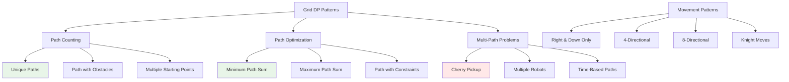

# DP Grid & Path Patterns: Mastering 2D Dynamic Programming

Grid-based dynamic programming problems are fundamental in robotics, game development, and pathfinding algorithms. This comprehensive guide covers essential 2D DP patterns from basic path counting to complex optimization problems.

## Table of Contents
1. [Grid DP Fundamentals](#grid-dp-fundamentals)
2. [Basic Path Problems](#basic-path-problems)
3. [Path Optimization Problems](#path-optimization)
4. [Advanced Grid Patterns](#advanced-grid-patterns)
5. [Multi-Constraint Grid Problems](#multi-constraint-problems)
6. [Real-World Applications](#real-world-applications)
7. [Problem Recognition Framework](#problem-recognition)

## Grid DP Fundamentals {#grid-dp-fundamentals}

Grid DP problems involve finding optimal paths, counting possibilities, or optimizing values across a 2D matrix with movement constraints.

### Core Grid DP Concepts



### Basic Grid DP Template

```go
// Generic grid DP template for path problems
func gridDP(grid [][]int) int {
    if len(grid) == 0 || len(grid[0]) == 0 {
        return 0
    }
    
    m, n := len(grid), len(grid[0])
    
    // dp[i][j] represents the optimal value at position (i, j)
    dp := make([][]int, m)
    for i := range dp {
        dp[i] = make([]int, n)
    }
    
    // Initialize base cases
    dp[0][0] = grid[0][0]  // Or appropriate initial value
    
    // Fill first row
    for j := 1; j < n; j++ {
        dp[0][j] = dp[0][j-1] + grid[0][j]  // Coming from left
    }
    
    // Fill first column
    for i := 1; i < m; i++ {
        dp[i][0] = dp[i-1][0] + grid[i][0]  // Coming from top
    }
    
    // Fill the rest of the grid
    for i := 1; i < m; i++ {
        for j := 1; j < n; j++ {
            // Choose optimal from possible previous positions
            dp[i][j] = min(dp[i-1][j], dp[i][j-1]) + grid[i][j]
        }
    }
    
    return dp[m-1][n-1]
}

func min(a, b int) int {
    if a < b {
        return a
    }
    return b
}

func max(a, b int) int {
    if a > b {
        return a
    }
    return b
}
```

### Direction Vectors for Grid Movement

```go
// Common movement patterns in grids
var (
    // 4-directional movement (up, right, down, left)
    directions4 = [][2]int{{-1, 0}, {0, 1}, {1, 0}, {0, -1}}
    
    // 8-directional movement
    directions8 = [][2]int{
        {-1, -1}, {-1, 0}, {-1, 1},
        {0, -1},           {0, 1},
        {1, -1},  {1, 0},  {1, 1},
    }
    
    // Knight moves (chess)
    knightMoves = [][2]int{
        {-2, -1}, {-2, 1}, {-1, -2}, {-1, 2},
        {1, -2},  {1, 2},  {2, -1},  {2, 1},
    }
)

// Check if position is valid in grid
func isValid(row, col, m, n int) bool {
    return row >= 0 && row < m && col >= 0 && col < n
}
```

## Basic Path Problems {#basic-path-problems}

### Unique Paths

```go
// Count unique paths from top-left to bottom-right (right and down moves only)
func uniquePaths(m, n int) int {
    // dp[i][j] = number of ways to reach (i, j)
    dp := make([][]int, m)
    for i := range dp {
        dp[i] = make([]int, n)
    }
    
    // Initialize edges - only one way to reach any cell in first row/column
    for i := 0; i < m; i++ {
        dp[i][0] = 1
    }
    for j := 0; j < n; j++ {
        dp[0][j] = 1
    }
    
    // Fill the DP table
    for i := 1; i < m; i++ {
        for j := 1; j < n; j++ {
            dp[i][j] = dp[i-1][j] + dp[i][j-1]
        }
    }
    
    return dp[m-1][n-1]
}

// Space-optimized version using only O(n) space
func uniquePathsOptimized(m, n int) int {
    dp := make([]int, n)
    
    // Initialize first row
    for j := 0; j < n; j++ {
        dp[j] = 1
    }
    
    // Process each row
    for i := 1; i < m; i++ {
        for j := 1; j < n; j++ {
            dp[j] += dp[j-1]  // dp[j] is from above, dp[j-1] is from left
        }
    }
    
    return dp[n-1]
}

// Mathematical solution using combinations
func uniquePathsMath(m, n int) int {
    // Total moves needed: (m-1) down + (n-1) right = (m+n-2) moves
    // Choose (m-1) positions for down moves: C(m+n-2, m-1)
    return combination(m+n-2, m-1)
}

func combination(n, r int) int {
    if r > n-r {
        r = n - r  // Take advantage of C(n,r) = C(n,n-r)
    }
    
    result := 1
    for i := 0; i < r; i++ {
        result = result * (n - i) / (i + 1)
    }
    
    return result
}
```

### Unique Paths with Obstacles

```go
// Count paths when some cells are blocked
func uniquePathsWithObstacles(obstacleGrid [][]int) int {
    if len(obstacleGrid) == 0 || obstacleGrid[0][0] == 1 {
        return 0
    }
    
    m, n := len(obstacleGrid), len(obstacleGrid[0])
    dp := make([][]int, m)
    for i := range dp {
        dp[i] = make([]int, n)
    }
    
    // Initialize starting position
    dp[0][0] = 1
    
    // Initialize first row
    for j := 1; j < n; j++ {
        if obstacleGrid[0][j] == 0 {
            dp[0][j] = dp[0][j-1]
        }
        // Obstacle blocks this path, dp[0][j] remains 0
    }
    
    // Initialize first column
    for i := 1; i < m; i++ {
        if obstacleGrid[i][0] == 0 {
            dp[i][0] = dp[i-1][0]
        }
        // Obstacle blocks this path, dp[i][0] remains 0
    }
    
    // Fill the rest
    for i := 1; i < m; i++ {
        for j := 1; j < n; j++ {
            if obstacleGrid[i][j] == 0 {
                dp[i][j] = dp[i-1][j] + dp[i][j-1]
            }
            // If obstacle, dp[i][j] remains 0
        }
    }
    
    return dp[m-1][n-1]
}
```

### Paths with Multiple Starting Points

```go
// Count paths when you can start from any cell in the first column
func pathsFromFirstColumn(grid [][]int) []int {
    if len(grid) == 0 {
        return nil
    }
    
    m, n := len(grid), len(grid[0])
    result := make([]int, m)
    
    for startRow := 0; startRow < m; startRow++ {
        dp := make([][]int, m)
        for i := range dp {
            dp[i] = make([]int, n)
        }
        
        // Start from (startRow, 0)
        dp[startRow][0] = 1
        
        // Fill the DP table
        for j := 1; j < n; j++ {
            for i := 0; i < m; i++ {
                if grid[i][j] == 1 {  // Obstacle
                    continue
                }
                
                // Can come from left
                if j > 0 {
                    dp[i][j] += dp[i][j-1]
                }
                
                // Can come from up
                if i > 0 {
                    dp[i][j] += dp[i-1][j]
                }
                
                // Can come from down
                if i < m-1 {
                    dp[i][j] += dp[i+1][j]
                }
            }
        }
        
        // Sum all ways to reach the last column
        for i := 0; i < m; i++ {
            result[startRow] += dp[i][n-1]
        }
    }
    
    return result
}
```

## Path Optimization Problems {#path-optimization}

### Minimum Path Sum

```go
// Find minimum sum path from top-left to bottom-right
func minPathSum(grid [][]int) int {
    if len(grid) == 0 {
        return 0
    }
    
    m, n := len(grid), len(grid[0])
    
    // dp[i][j] = minimum sum to reach (i, j)
    dp := make([][]int, m)
    for i := range dp {
        dp[i] = make([]int, n)
    }
    
    // Initialize starting point
    dp[0][0] = grid[0][0]
    
    // Initialize first row
    for j := 1; j < n; j++ {
        dp[0][j] = dp[0][j-1] + grid[0][j]
    }
    
    // Initialize first column
    for i := 1; i < m; i++ {
        dp[i][0] = dp[i-1][0] + grid[i][0]
    }
    
    // Fill the DP table
    for i := 1; i < m; i++ {
        for j := 1; j < n; j++ {
            dp[i][j] = min(dp[i-1][j], dp[i][j-1]) + grid[i][j]
        }
    }
    
    return dp[m-1][n-1]
}

// Space-optimized version
func minPathSumOptimized(grid [][]int) int {
    if len(grid) == 0 {
        return 0
    }
    
    m, n := len(grid), len(grid[0])
    dp := make([]int, n)
    
    // Initialize first row
    dp[0] = grid[0][0]
    for j := 1; j < n; j++ {
        dp[j] = dp[j-1] + grid[0][j]
    }
    
    // Process remaining rows
    for i := 1; i < m; i++ {
        dp[0] += grid[i][0]  // First column
        
        for j := 1; j < n; j++ {
            dp[j] = min(dp[j], dp[j-1]) + grid[i][j]
        }
    }
    
    return dp[n-1]
}
```

### Maximum Path Sum with Direction Constraints

```go
// Maximum sum path where you can move right, down, or diagonally down-right
func maxPathSumThreeDirections(grid [][]int) int {
    if len(grid) == 0 {
        return 0
    }
    
    m, n := len(grid), len(grid[0])
    dp := make([][]int, m)
    for i := range dp {
        dp[i] = make([]int, n)
    }
    
    // Initialize starting point
    dp[0][0] = grid[0][0]
    
    // Initialize first row (can only come from left)
    for j := 1; j < n; j++ {
        dp[0][j] = dp[0][j-1] + grid[0][j]
    }
    
    // Initialize first column (can only come from above)
    for i := 1; i < m; i++ {
        dp[i][0] = dp[i-1][0] + grid[i][0]
    }
    
    // Fill the rest with three possible directions
    for i := 1; i < m; i++ {
        for j := 1; j < n; j++ {
            fromTop := dp[i-1][j]
            fromLeft := dp[i][j-1]
            fromDiagonal := dp[i-1][j-1]
            
            dp[i][j] = max(fromTop, max(fromLeft, fromDiagonal)) + grid[i][j]
        }
    }
    
    return dp[m-1][n-1]
}
```

### Minimum Path Sum with 4-Directional Movement

```go
// Minimum path sum with ability to move in all 4 directions (avoiding cycles)
func minPathSumFourDirections(grid [][]int) int {
    if len(grid) == 0 {
        return 0
    }
    
    m, n := len(grid), len(grid[0])
    
    // Use Dijkstra's algorithm for shortest path
    type Cell struct {
        row, col, dist int
    }
    
    // Min heap for Dijkstra
    pq := make([]*Cell, 0)
    pq = append(pq, &Cell{0, 0, grid[0][0]})
    
    // Distance matrix
    dist := make([][]int, m)
    for i := range dist {
        dist[i] = make([]int, n)
        for j := range dist[i] {
            dist[i][j] = math.MaxInt32
        }
    }
    dist[0][0] = grid[0][0]
    
    for len(pq) > 0 {
        // Extract minimum
        current := pq[0]
        pq = pq[1:]
        
        if current.row == m-1 && current.col == n-1 {
            return current.dist
        }
        
        // Skip if we've found a better path already
        if current.dist > dist[current.row][current.col] {
            continue
        }
        
        // Explore all 4 directions
        for _, dir := range directions4 {
            newRow, newCol := current.row+dir[0], current.col+dir[1]
            
            if isValid(newRow, newCol, m, n) {
                newDist := current.dist + grid[newRow][newCol]
                
                if newDist < dist[newRow][newCol] {
                    dist[newRow][newCol] = newDist
                    pq = append(pq, &Cell{newRow, newCol, newDist})
                    
                    // Keep heap property (simple insertion sort for small arrays)
                    for i := len(pq) - 1; i > 0 && pq[i].dist < pq[i-1].dist; i-- {
                        pq[i], pq[i-1] = pq[i-1], pq[i]
                    }
                }
            }
        }
    }
    
    return dist[m-1][n-1]
}
```

## Advanced Grid Patterns {#advanced-grid-patterns}

### Dungeon Game

```go
// Minimum initial health needed to rescue princess
func calculateMinimumHP(dungeon [][]int) int {
    if len(dungeon) == 0 {
        return 1
    }
    
    m, n := len(dungeon), len(dungeon[0])
    
    // dp[i][j] = minimum health needed when entering cell (i, j)
    dp := make([][]int, m)
    for i := range dp {
        dp[i] = make([]int, n)
    }
    
    // Work backwards from bottom-right
    // At princess cell, we need at least 1 HP after taking damage/healing
    dp[m-1][n-1] = max(1, 1-dungeon[m-1][n-1])
    
    // Fill last row (can only go right)
    for j := n - 2; j >= 0; j-- {
        dp[m-1][j] = max(1, dp[m-1][j+1]-dungeon[m-1][j])
    }
    
    // Fill last column (can only go down)
    for i := m - 2; i >= 0; i-- {
        dp[i][n-1] = max(1, dp[i+1][n-1]-dungeon[i][n-1])
    }
    
    // Fill the rest of the table
    for i := m - 2; i >= 0; i-- {
        for j := n - 2; j >= 0; j-- {
            // Minimum health needed if going right or down
            rightPath := max(1, dp[i][j+1]-dungeon[i][j])
            downPath := max(1, dp[i+1][j]-dungeon[i][j])
            
            dp[i][j] = min(rightPath, downPath)
        }
    }
    
    return dp[0][0]
}
```

### Cherry Pickup Problem

```go
// Two people collecting cherries simultaneously (classic 2-path problem)
func cherryPickup(grid [][]int) int {
    n := len(grid)
    
    // Instead of 2 forward paths, think of it as 1 forward + 1 backward path
    // Use 3D DP: dp[i1][j1][i2] where j2 = i1+j1-i2
    memo := make(map[string]int)
    
    result := cherryPickupHelper(grid, 0, 0, 0, memo)
    return max(0, result)
}

func cherryPickupHelper(grid [][]int, i1, j1, i2 int, memo map[string]int) int {
    j2 := i1 + j1 - i2  // Constraint: both paths take same number of steps
    n := len(grid)
    
    key := fmt.Sprintf("%d,%d,%d", i1, j1, i2)
    if result, exists := memo[key]; exists {
        return result
    }
    
    // Base cases
    if i1 >= n || j1 >= n || i2 >= n || j2 >= n || 
       grid[i1][j1] == -1 || grid[i2][j2] == -1 {
        memo[key] = math.MinInt32
        return math.MinInt32
    }
    
    if i1 == n-1 && j1 == n-1 {
        memo[key] = grid[i1][j1]
        return grid[i1][j1]
    }
    
    // Collect cherries
    cherries := grid[i1][j1]
    if i1 != i2 || j1 != j2 {  // Different positions
        cherries += grid[i2][j2]
    }
    
    // Try all possible moves for both paths
    result := math.MinInt32
    
    // Person 1: (i1,j1) -> (i1+1,j1) or (i1,j1+1)
    // Person 2: (i2,j2) -> (i2+1,j2) or (i2,j2+1)
    moves := [][]int{
        {1, 0, 1, 0}, // both go down
        {1, 0, 0, 1}, // person 1 down, person 2 right
        {0, 1, 1, 0}, // person 1 right, person 2 down
        {0, 1, 0, 1}, // both go right
    }
    
    for _, move := range moves {
        subResult := cherryPickupHelper(grid, i1+move[0], j1+move[1], i2+move[2], memo)
        if subResult != math.MinInt32 {
            result = max(result, cherries+subResult)
        }
    }
    
    memo[key] = result
    return result
}
```

### Robot Path with Energy Constraints

```go
// Robot movement with energy consumption and charging stations
type RobotPathfinder struct {
    grid   [][]int  // -1: obstacle, 0: empty, 1: charging station
    energy [][]int  // Energy cost to enter each cell
}

func NewRobotPathfinder(grid, energy [][]int) *RobotPathfinder {
    return &RobotPathfinder{grid: grid, energy: energy}
}

func (rp *RobotPathfinder) FindPath(startEnergy int) int {
    if len(rp.grid) == 0 {
        return -1
    }
    
    m, n := len(rp.grid), len(rp.grid[0])
    
    // State: (row, col, energy)
    type State struct {
        row, col, energy, steps int
    }
    
    // BFS with energy tracking
    queue := []*State{{0, 0, startEnergy, 0}}
    visited := make(map[string]bool)
    
    for len(queue) > 0 {
        current := queue[0]
        queue = queue[1:]
        
        // Reached destination
        if current.row == m-1 && current.col == n-1 {
            return current.steps
        }
        
        stateKey := fmt.Sprintf("%d,%d,%d", current.row, current.col, current.energy)
        if visited[stateKey] {
            continue
        }
        visited[stateKey] = true
        
        // Try all 4 directions
        for _, dir := range directions4 {
            newRow, newCol := current.row+dir[0], current.col+dir[1]
            
            if !isValid(newRow, newCol, m, n) || rp.grid[newRow][newCol] == -1 {
                continue
            }
            
            energyCost := rp.energy[newRow][newCol]
            newEnergy := current.energy - energyCost
            
            // Check if we have enough energy
            if newEnergy < 0 {
                continue
            }
            
            // If it's a charging station, restore energy
            if rp.grid[newRow][newCol] == 1 {
                newEnergy = startEnergy  // Full recharge
            }
            
            queue = append(queue, &State{
                row: newRow, 
                col: newCol, 
                energy: newEnergy, 
                steps: current.steps + 1,
            })
        }
    }
    
    return -1  // No path found
}
```

## Multi-Constraint Grid Problems {#multi-constraint-problems}

### Path with Alternating Colors

```go
// Find path where you must alternate between two colors
func alternatingColorPath(grid [][]int) int {
    // grid[i][j]: 0 = red, 1 = blue, -1 = obstacle
    if len(grid) == 0 {
        return -1
    }
    
    m, n := len(grid), len(grid[0])
    
    // State: (row, col, expectedColor)
    type State struct {
        row, col, expectedColor, steps int
    }
    
    // BFS with color constraint
    queue := []*State{{0, 0, grid[0][0], 0}}
    visited := make(map[string]bool)
    
    for len(queue) > 0 {
        current := queue[0]
        queue = queue[1:]
        
        if current.row == m-1 && current.col == n-1 {
            return current.steps
        }
        
        stateKey := fmt.Sprintf("%d,%d,%d", current.row, current.col, current.expectedColor)
        if visited[stateKey] {
            continue
        }
        visited[stateKey] = true
        
        // Current cell must match expected color
        if grid[current.row][current.col] != current.expectedColor {
            continue
        }
        
        // Next color must be different
        nextColor := 1 - current.expectedColor
        
        for _, dir := range directions4 {
            newRow, newCol := current.row+dir[0], current.col+dir[1]
            
            if isValid(newRow, newCol, m, n) && grid[newRow][newCol] != -1 {
                queue = append(queue, &State{
                    row: newRow,
                    col: newCol,
                    expectedColor: nextColor,
                    steps: current.steps + 1,
                })
            }
        }
    }
    
    return -1
}
```

### Grid with Time-Based Changes

```go
// Grid where obstacles appear/disappear based on time
func pathWithTimeChanges(initialGrid [][]int, obstacleSchedule map[int][][]int) int {
    // obstacleSchedule[time] = list of [row, col] positions that become obstacles
    
    m, n := len(initialGrid), len(initialGrid[0])
    
    type State struct {
        row, col, time int
    }
    
    queue := []*State{{0, 0, 0}}
    visited := make(map[string]bool)
    
    for len(queue) > 0 {
        current := queue[0]
        queue = queue[1:]
        
        if current.row == m-1 && current.col == n-1 {
            return current.time
        }
        
        stateKey := fmt.Sprintf("%d,%d,%d", current.row, current.col, current.time)
        if visited[stateKey] {
            continue
        }
        visited[stateKey] = true
        
        // Check if current position is blocked at current time
        if isBlockedAtTime(current.row, current.col, current.time, initialGrid, obstacleSchedule) {
            continue
        }
        
        // Try all 4 directions
        for _, dir := range directions4 {
            newRow, newCol := current.row+dir[0], current.col+dir[1]
            newTime := current.time + 1
            
            if isValid(newRow, newCol, m, n) &&
               !isBlockedAtTime(newRow, newCol, newTime, initialGrid, obstacleSchedule) {
                
                queue = append(queue, &State{newRow, newCol, newTime})
            }
        }
        
        // Option to wait (stay in same position)
        if !isBlockedAtTime(current.row, current.col, current.time+1, initialGrid, obstacleSchedule) {
            queue = append(queue, &State{current.row, current.col, current.time + 1})
        }
    }
    
    return -1
}

func isBlockedAtTime(row, col, time int, initialGrid [][]int, schedule map[int][][]int) bool {
    // Check initial grid state
    if initialGrid[row][col] == -1 {
        return true
    }
    
    // Check time-based obstacles
    for t := 0; t <= time; t++ {
        if obstacles, exists := schedule[t]; exists {
            for _, obstacle := range obstacles {
                if obstacle[0] == row && obstacle[1] == col {
                    // This cell becomes an obstacle at time t
                    // Check if it's still blocked at current time
                    if (time-t)%2 == 0 {  // Example: obstacle alternates every 2 time units
                        return true
                    }
                }
            }
        }
    }
    
    return false
}
```

### Multi-Robot Coordination

```go
// Multiple robots moving simultaneously without collision
func multiRobotPath(grid [][]int, robots [][2]int, targets [][2]int) int {
    if len(robots) != len(targets) {
        return -1
    }
    
    numRobots := len(robots)
    m, n := len(grid), len(grid[0])
    
    // State represents positions of all robots
    type State struct {
        positions [][]int  // positions[i] = [row, col] for robot i
        steps     int
    }
    
    // Initial state
    initialPositions := make([][]int, numRobots)
    for i, robot := range robots {
        initialPositions[i] = []int{robot[0], robot[1]}
    }
    
    queue := []*State{{initialPositions, 0}}
    visited := make(map[string]bool)
    
    for len(queue) > 0 {
        current := queue[0]
        queue = queue[1:]
        
        // Check if all robots reached their targets
        allReached := true
        for i := 0; i < numRobots; i++ {
            if current.positions[i][0] != targets[i][0] || 
               current.positions[i][1] != targets[i][1] {
                allReached = false
                break
            }
        }
        if allReached {
            return current.steps
        }
        
        stateKey := encodeState(current.positions)
        if visited[stateKey] {
            continue
        }
        visited[stateKey] = true
        
        // Generate all possible next states
        generateNextStates(current, grid, m, n, &queue)
    }
    
    return -1
}

func encodeState(positions [][]int) string {
    var key strings.Builder
    for i, pos := range positions {
        if i > 0 {
            key.WriteString(";")
        }
        key.WriteString(fmt.Sprintf("%d,%d", pos[0], pos[1]))
    }
    return key.String()
}

func generateNextStates(current *State, grid [][]int, m, n int, queue *[]*State) {
    numRobots := len(current.positions)
    
    // Each robot can move in 5 ways: stay, up, right, down, left
    moves := [][2]int{{0, 0}, {-1, 0}, {0, 1}, {1, 0}, {0, -1}}
    
    // Generate all combinations of moves
    generateMovesCombination(current, grid, m, n, 0, make([][]int, numRobots), moves, queue)
}

func generateMovesCombination(current *State, grid [][]int, m, n, robotIndex int, 
                            newPositions [][]int, moves [][2]int, queue *[]*State) {
    if robotIndex == len(current.positions) {
        // Check for collisions
        occupied := make(map[string]bool)
        for _, pos := range newPositions {
            key := fmt.Sprintf("%d,%d", pos[0], pos[1])
            if occupied[key] {
                return  // Collision detected
            }
            occupied[key] = true
        }
        
        // Create new state
        nextPositions := make([][]int, len(newPositions))
        for i, pos := range newPositions {
            nextPositions[i] = []int{pos[0], pos[1]}
        }
        
        *queue = append(*queue, &State{nextPositions, current.steps + 1})
        return
    }
    
    // Try all moves for current robot
    currentPos := current.positions[robotIndex]
    
    for _, move := range moves {
        newRow := currentPos[0] + move[0]
        newCol := currentPos[1] + move[1]
        
        if isValid(newRow, newCol, m, n) && grid[newRow][newCol] != -1 {
            newPositions[robotIndex] = []int{newRow, newCol}
            generateMovesCombination(current, grid, m, n, robotIndex+1, newPositions, moves, queue)
        }
    }
}
```

## Real-World Applications {#real-world-applications}

### Game Pathfinding System

```go
// Advanced pathfinding for game characters with different movement costs
type GamePathfinder struct {
    terrain     [][]int  // Different terrain types
    movementCost map[int]int  // Cost for each terrain type
    unitSize    int      // Size of the unit (for collision detection)
}

func NewGamePathfinder(terrain [][]int, costs map[int]int, size int) *GamePathfinder {
    return &GamePathfinder{
        terrain: terrain,
        movementCost: costs,
        unitSize: size,
    }
}

func (gp *GamePathfinder) FindPath(start, end [2]int) [][]int {
    m, n := len(gp.terrain), len(gp.terrain[0])
    
    type Node struct {
        pos  [2]int
        cost int
        path [][]int
    }
    
    // Priority queue (min-heap)
    pq := []*Node{{start, 0, [][]int{{start[0], start[1]}}}}
    visited := make(map[string]bool)
    
    for len(pq) > 0 {
        current := pq[0]
        pq = pq[1:]
        
        if current.pos[0] == end[0] && current.pos[1] == end[1] {
            return current.path
        }
        
        key := fmt.Sprintf("%d,%d", current.pos[0], current.pos[1])
        if visited[key] {
            continue
        }
        visited[key] = true
        
        // Try all 8 directions
        for _, dir := range directions8 {
            newRow := current.pos[0] + dir[0]
            newCol := current.pos[1] + dir[1]
            
            if gp.canPlace(newRow, newCol, m, n) {
                terrainType := gp.terrain[newRow][newCol]
                moveCost := gp.movementCost[terrainType]
                
                // Diagonal moves cost more
                if dir[0] != 0 && dir[1] != 0 {
                    moveCost = int(float64(moveCost) * 1.414)  // √2 approximation
                }
                
                newCost := current.cost + moveCost
                newPath := make([][]int, len(current.path)+1)
                copy(newPath, current.path)
                newPath[len(current.path)] = []int{newRow, newCol}
                
                // Insert in priority queue
                newNode := &Node{[2]int{newRow, newCol}, newCost, newPath}
                gp.insertPQ(&pq, newNode)
            }
        }
    }
    
    return nil  // No path found
}

func (gp *GamePathfinder) canPlace(row, col, m, n int) bool {
    // Check if unit of given size can be placed at this position
    for dr := 0; dr < gp.unitSize; dr++ {
        for dc := 0; dc < gp.unitSize; dc++ {
            newRow, newCol := row+dr, col+dc
            
            if !isValid(newRow, newCol, m, n) {
                return false
            }
            
            // Check if terrain is passable (assuming negative values are impassable)
            if gp.terrain[newRow][newCol] < 0 {
                return false
            }
        }
    }
    
    return true
}

func (gp *GamePathfinder) insertPQ(pq *[]*Node, node *Node) {
    *pq = append(*pq, node)
    
    // Bubble up to maintain min-heap property
    i := len(*pq) - 1
    for i > 0 {
        parent := (i - 1) / 2
        if (*pq)[i].cost >= (*pq)[parent].cost {
            break
        }
        (*pq)[i], (*pq)[parent] = (*pq)[parent], (*pq)[i]
        i = parent
    }
}
```

### Warehouse Robot Optimization

```go
// Warehouse robot path optimization with pickup and delivery
type WarehouseOptimizer struct {
    layout    [][]int  // 0: free, 1: shelf, 2: pickup, 3: delivery
    robots    []*Robot
    tasks     []*Task
}

type Robot struct {
    ID       int
    Position [2]int
    Capacity int
    Load     int
}

type Task struct {
    ID       int
    Pickup   [2]int
    Delivery [2]int
    Priority int
}

func NewWarehouseOptimizer(layout [][]int) *WarehouseOptimizer {
    return &WarehouseOptimizer{
        layout: layout,
        robots: make([]*Robot, 0),
        tasks:  make([]*Task, 0),
    }
}

func (wo *WarehouseOptimizer) AssignTasks() map[int][]int {
    // Assignment: robot ID -> list of task IDs
    assignment := make(map[int][]int)
    
    // Sort tasks by priority
    sort.Slice(wo.tasks, func(i, j int) bool {
        return wo.tasks[i].Priority > wo.tasks[j].Priority
    })
    
    for _, task := range wo.tasks {
        bestRobot := wo.findBestRobot(task)
        if bestRobot != -1 {
            assignment[bestRobot] = append(assignment[bestRobot], task.ID)
        }
    }
    
    return assignment
}

func (wo *WarehouseOptimizer) findBestRobot(task *Task) int {
    bestRobot := -1
    minCost := math.MaxInt32
    
    for _, robot := range wo.robots {
        if robot.Load >= robot.Capacity {
            continue  // Robot is full
        }
        
        // Calculate total cost: robot -> pickup -> delivery
        costToPickup := wo.calculatePath(robot.Position, task.Pickup)
        costToDelivery := wo.calculatePath(task.Pickup, task.Delivery)
        totalCost := costToPickup + costToDelivery
        
        if totalCost < minCost {
            minCost = totalCost
            bestRobot = robot.ID
        }
    }
    
    return bestRobot
}

func (wo *WarehouseOptimizer) calculatePath(start, end [2]int) int {
    if start[0] == end[0] && start[1] == end[1] {
        return 0
    }
    
    m, n := len(wo.layout), len(wo.layout[0])
    
    type State struct {
        pos  [2]int
        cost int
    }
    
    queue := []*State{{start, 0}}
    visited := make(map[string]bool)
    
    for len(queue) > 0 {
        current := queue[0]
        queue = queue[1:]
        
        if current.pos[0] == end[0] && current.pos[1] == end[1] {
            return current.cost
        }
        
        key := fmt.Sprintf("%d,%d", current.pos[0], current.pos[1])
        if visited[key] {
            continue
        }
        visited[key] = true
        
        for _, dir := range directions4 {
            newRow := current.pos[0] + dir[0]
            newCol := current.pos[1] + dir[1]
            
            if isValid(newRow, newCol, m, n) && wo.layout[newRow][newCol] != 1 {
                queue = append(queue, &State{
                    pos:  [2]int{newRow, newCol},
                    cost: current.cost + 1,
                })
            }
        }
    }
    
    return math.MaxInt32  // No path found
}
```

### Autonomous Vehicle Navigation

```go
// Autonomous vehicle path planning with traffic and road conditions
type VehicleNavigator struct {
    roadNetwork [][]RoadSegment
    traffic     map[string]float64  // segment ID -> traffic factor (1.0 = normal)
    weather     float64             // Weather impact factor
}

type RoadSegment struct {
    Type        int     // 1: highway, 2: city street, 3: residential
    SpeedLimit  int     // km/h
    Distance    float64 // km
    Conditions  int     // 1: good, 2: construction, 3: poor
}

func NewVehicleNavigator(network [][]RoadSegment) *VehicleNavigator {
    return &VehicleNavigator{
        roadNetwork: network,
        traffic:     make(map[string]float64),
        weather:     1.0,
    }
}

func (vn *VehicleNavigator) FindOptimalRoute(start, destination [2]int) ([][]int, float64) {
    m, n := len(vn.roadNetwork), len(vn.roadNetwork[0])
    
    type RouteNode struct {
        pos      [2]int
        time     float64
        path     [][]int
        distance float64
    }
    
    pq := []*RouteNode{{start, 0, [][]int{{start[0], start[1]}}, 0}}
    visited := make(map[string]bool)
    
    for len(pq) > 0 {
        current := pq[0]
        pq = pq[1:]
        
        if current.pos[0] == destination[0] && current.pos[1] == destination[1] {
            return current.path, current.time
        }
        
        key := fmt.Sprintf("%d,%d", current.pos[0], current.pos[1])
        if visited[key] {
            continue
        }
        visited[key] = true
        
        for _, dir := range directions4 {
            newRow := current.pos[0] + dir[0]
            newCol := current.pos[1] + dir[1]
            
            if isValid(newRow, newCol, m, n) {
                segment := vn.roadNetwork[newRow][newCol]
                travelTime := vn.calculateTravelTime(current.pos, [2]int{newRow, newCol}, segment)
                
                newPath := make([][]int, len(current.path)+1)
                copy(newPath, current.path)
                newPath[len(current.path)] = []int{newRow, newCol}
                
                newNode := &RouteNode{
                    pos:      [2]int{newRow, newCol},
                    time:     current.time + travelTime,
                    path:     newPath,
                    distance: current.distance + segment.Distance,
                }
                
                vn.insertRouteNode(&pq, newNode)
            }
        }
    }
    
    return nil, 0  // No route found
}

func (vn *VehicleNavigator) calculateTravelTime(from, to [2]int, segment RoadSegment) float64 {
    baseTime := segment.Distance / float64(segment.SpeedLimit) * 60  // minutes
    
    // Apply traffic factor
    segmentID := fmt.Sprintf("%d,%d->%d,%d", from[0], from[1], to[0], to[1])
    trafficFactor := vn.traffic[segmentID]
    if trafficFactor == 0 {
        trafficFactor = 1.0
    }
    
    // Apply weather factor
    weatherFactor := vn.weather
    
    // Apply road conditions factor
    conditionFactor := 1.0
    switch segment.Conditions {
    case 2:  // Construction
        conditionFactor = 1.5
    case 3:  // Poor conditions
        conditionFactor = 2.0
    }
    
    return baseTime * trafficFactor * weatherFactor * conditionFactor
}

func (vn *VehicleNavigator) insertRouteNode(pq *[]*RouteNode, node *RouteNode) {
    *pq = append(*pq, node)
    
    // Maintain min-heap based on travel time
    i := len(*pq) - 1
    for i > 0 {
        parent := (i - 1) / 2
        if (*pq)[i].time >= (*pq)[parent].time {
            break
        }
        (*pq)[i], (*pq)[parent] = (*pq)[parent], (*pq)[i]
        i = parent
    }
}

func (vn *VehicleNavigator) UpdateTraffic(segmentID string, factor float64) {
    vn.traffic[segmentID] = factor
}

func (vn *VehicleNavigator) UpdateWeather(factor float64) {
    vn.weather = factor
}
```

## Problem Recognition Framework {#problem-recognition}

### Grid DP Pattern Classification

```go
type GridDPClassifier struct {
    patterns map[string][]string
}

func NewGridDPClassifier() *GridDPClassifier {
    return &GridDPClassifier{
        patterns: map[string][]string{
            "basic_path_counting": {
                "unique paths", "count paths", "number of ways",
                "path counting", "grid traversal", "robot movement",
            },
            "path_optimization": {
                "minimum path sum", "maximum path", "shortest path",
                "optimal path", "minimum cost", "pathfinding",
            },
            "multi_path_problems": {
                "cherry pickup", "two robots", "multiple paths",
                "simultaneous movement", "collision avoidance",
            },
            "constrained_movement": {
                "obstacles", "blocked cells", "movement restrictions",
                "directional constraints", "forbidden moves",
            },
            "game_pathfinding": {
                "game", "character movement", "terrain cost",
                "unit pathfinding", "strategy game", "navigation",
            },
            "real_world_navigation": {
                "vehicle", "autonomous", "traffic", "warehouse",
                "robot coordination", "delivery optimization",
            },
        },
    }
}

func (gdc *GridDPClassifier) ClassifyProblem(description string) string {
    desc := strings.ToLower(description)
    maxScore := 0
    bestMatch := "basic_path_counting"
    
    for pattern, keywords := range gdc.patterns {
        score := 0
        for _, keyword := range keywords {
            if strings.Contains(desc, keyword) {
                score++
            }
        }
        
        if score > maxScore {
            maxScore = score
            bestMatch = pattern
        }
    }
    
    return bestMatch
}
```

### Algorithm Selection Guide

| Problem Type | Algorithm | Time | Space | Best Use Case |
|-------------|-----------|------|-------|---------------|
| **Basic Path Count** | 2D DP | O(mn) | O(mn) | Simple grid traversal |
| **Path Optimization** | 2D DP | O(mn) | O(mn) | Min/max path problems |
| **4-Direction Movement** | Dijkstra | O(mn log(mn)) | O(mn) | Unrestricted movement |
| **Multi-Robot** | BFS + State | O(4^k × mn) | O(4^k × mn) | k robots coordination |
| **Real-Time Constraints** | A* / Dijkstra | O(mn log(mn)) | O(mn) | Game pathfinding |

### Space Optimization Strategies

```go
// Space optimization techniques for grid DP problems
type GridDPOptimizer struct{}

// 1. Rolling array for row-by-row processing
func (opt *GridDPOptimizer) OptimizeSpace2D(grid [][]int) int {
    m, n := len(grid), len(grid[0])
    
    // Use only current and previous row
    prev := make([]int, n)
    curr := make([]int, n)
    
    // Initialize first row
    prev[0] = grid[0][0]
    for j := 1; j < n; j++ {
        prev[j] = prev[j-1] + grid[0][j]
    }
    
    // Process remaining rows
    for i := 1; i < m; i++ {
        curr[0] = prev[0] + grid[i][0]
        
        for j := 1; j < n; j++ {
            curr[j] = min(prev[j], curr[j-1]) + grid[i][j]
        }
        
        prev, curr = curr, prev
    }
    
    return prev[n-1]
}

// 2. In-place modification when input can be modified
func (opt *GridDPOptimizer) OptimizeInPlace(grid [][]int) int {
    m, n := len(grid), len(grid[0])
    
    // Initialize first row
    for j := 1; j < n; j++ {
        grid[0][j] += grid[0][j-1]
    }
    
    // Initialize first column
    for i := 1; i < m; i++ {
        grid[i][0] += grid[i-1][0]
    }
    
    // Fill remaining cells
    for i := 1; i < m; i++ {
        for j := 1; j < n; j++ {
            grid[i][j] += min(grid[i-1][j], grid[i][j-1])
        }
    }
    
    return grid[m-1][n-1]
}

// 3. Diagonal processing for memory efficiency
func (opt *GridDPOptimizer) DiagonalProcessing(grid [][]int) int {
    m, n := len(grid), len(grid[0])
    
    // Process diagonals to minimize memory usage
    dp := make(map[string]int)
    dp["0,0"] = grid[0][0]
    
    for sum := 1; sum < m+n-1; sum++ {
        for i := 0; i <= sum; i++ {
            j := sum - i
            if i < m && j < n {
                key := fmt.Sprintf("%d,%d", i, j)
                
                val := grid[i][j]
                if i > 0 {
                    prevKey := fmt.Sprintf("%d,%d", i-1, j)
                    if prev, exists := dp[prevKey]; exists {
                        val += prev
                    }
                }
                if j > 0 {
                    prevKey := fmt.Sprintf("%d,%d", i, j-1)
                    if prev, exists := dp[prevKey]; exists {
                        if i == 0 {
                            val += prev
                        } else {
                            val = min(val, grid[i][j]+prev)
                        }
                    }
                }
                
                dp[key] = val
                
                // Clean up old entries to save memory
                if sum > 1 {
                    oldKey := fmt.Sprintf("%d,%d", i, j-2)
                    delete(dp, oldKey)
                }
            }
        }
    }
    
    return dp[fmt.Sprintf("%d,%d", m-1, n-1)]
}
```

## Conclusion

Grid dynamic programming patterns form the foundation for solving complex 2D optimization problems. From basic path counting to advanced multi-robot coordination, these patterns appear throughout computer science and real-world applications.

### Grid DP Mastery Framework:

**🔍 Core Patterns**
- **Path counting** - Fundamental combinatorial problems
- **Path optimization** - Min/max path sum variations
- **Multi-constraint** - Complex real-world scenarios

**⚡ Optimization Techniques**
- **Space optimization** - Rolling arrays and in-place modification
- **Algorithm selection** - Choose right approach based on constraints
- **State compression** - Efficient representation for complex states

**🚀 Advanced Applications**
- **Game development** - Character pathfinding and AI navigation
- **Robotics** - Multi-robot coordination and warehouse automation
- **Transportation** - Vehicle routing and traffic optimization

### Key Implementation Guidelines:

1. **Start with basic 2D DP** - Master fundamentals before advanced patterns
2. **Consider movement constraints** - Choose appropriate direction sets
3. **Optimize for scale** - Use space-efficient techniques for large grids
4. **Handle edge cases** - Boundary conditions and invalid states
5. **Real-world adaptation** - Customize for domain-specific requirements

**🎉 Phase 5 Complete!** You've mastered all essential dynamic programming patterns. Ready for advanced optimization techniques and putting it all together!

---

*Next in series: [DP Optimization Techniques](/blog/dsa/dp-optimization-techniques) | Previous: [Palindrome Patterns](/blog/dsa/dp-palindrome-patterns)*