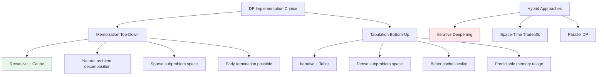

# DP Optimization Techniques: Advanced Performance and Space Strategies

Dynamic Programming optimization is crucial for scaling algorithms to handle real-world constraints. This comprehensive guide explores advanced techniques for optimizing both time and space complexity while maintaining correctness and readability.

## Table of Contents
1. [Memoization vs Tabulation Deep Dive](#memoization-vs-tabulation)
2. [Space Optimization Strategies](#space-optimization-strategies)
3. [Performance Analysis and Profiling](#performance-analysis)
4. [Advanced Optimization Patterns](#advanced-optimization-patterns)
5. [Memory Management Techniques](#memory-management)
6. [Scaling for Production Systems](#scaling-production)
7. [Benchmark Framework](#benchmark-framework)

## Memoization vs Tabulation Deep Dive {#memoization-vs-tabulation}

Understanding when to use top-down (memoization) versus bottom-up (tabulation) approaches is crucial for optimal performance.

### Comprehensive Comparison Framework



### Advanced Memoization Patterns

```go
// Generic memoization framework with advanced features
type Memoizer[K comparable, V any] struct {
    cache      map[K]V
    computeFunc func(K) V
    maxSize    int
    hits       int64
    misses     int64
    evictions  int64
}

func NewMemoizer[K comparable, V any](computeFunc func(K) V, maxSize int) *Memoizer[K, V] {
    return &Memoizer[K, V]{
        cache:      make(map[K]V),
        computeFunc: computeFunc,
        maxSize:    maxSize,
    }
}

func (m *Memoizer[K, V]) Get(key K) V {
    if value, exists := m.cache[key]; exists {
        atomic.AddInt64(&m.hits, 1)
        return value
    }
    
    atomic.AddInt64(&m.misses, 1)
    value := m.computeFunc(key)
    
    // Implement LRU eviction if cache is full
    if len(m.cache) >= m.maxSize {
        m.evictLRU()
    }
    
    m.cache[key] = value
    return value
}

func (m *Memoizer[K, V]) evictLRU() {
    // Simple random eviction for demonstration
    // In production, use proper LRU implementation
    for key := range m.cache {
        delete(m.cache, key)
        atomic.AddInt64(&m.evictions, 1)
        break
    }
}

func (m *Memoizer[K, V]) Stats() (hits, misses, evictions int64, hitRate float64) {
    h := atomic.LoadInt64(&m.hits)
    ms := atomic.LoadInt64(&m.misses)
    e := atomic.LoadInt64(&m.evictions)
    
    total := h + ms
    var rate float64
    if total > 0 {
        rate = float64(h) / float64(total)
    }
    
    return h, ms, e, rate
}
```

### Fibonacci: Performance Comparison

```go
// Naive recursive implementation (exponential time)
func fibNaive(n int) int {
    if n <= 1 {
        return n
    }
    return fibNaive(n-1) + fibNaive(n-2)
}

// Memoized version with detailed tracking
type FibMemo struct {
    cache    map[int]int
    calls    int
    cacheHits int
}

func NewFibMemo() *FibMemo {
    return &FibMemo{cache: make(map[int]int)}
}

func (fm *FibMemo) Compute(n int) int {
    fm.calls++
    
    if n <= 1 {
        return n
    }
    
    if val, exists := fm.cache[n]; exists {
        fm.cacheHits++
        return val
    }
    
    result := fm.Compute(n-1) + fm.Compute(n-2)
    fm.cache[n] = result
    return result
}

func (fm *FibMemo) Stats() (calls, hits int, hitRate float64) {
    if fm.calls > 0 {
        hitRate = float64(fm.cacheHits) / float64(fm.calls)
    }
    return fm.calls, fm.cacheHits, hitRate
}

// Tabulated version with space optimization
func fibTabulated(n int) int {
    if n <= 1 {
        return n
    }
    
    // Only need previous two values
    prev2, prev1 := 0, 1
    
    for i := 2; i <= n; i++ {
        current := prev1 + prev2
        prev2, prev1 = prev1, current
    }
    
    return prev1
}

// Matrix exponentiation for O(log n) solution
func fibMatrix(n int) int {
    if n <= 1 {
        return n
    }
    
    // [F(n+1)] = [1 1]^n [1]
    // [F(n)  ]   [1 0]   [0]
    
    base := [][]int{{1, 1}, {1, 0}}
    result := matrixPower(base, n)
    return result[0][1]
}

func matrixPower(matrix [][]int, n int) [][]int {
    if n == 1 {
        return matrix
    }
    
    if n%2 == 0 {
        half := matrixPower(matrix, n/2)
        return matrixMultiply(half, half)
    }
    
    return matrixMultiply(matrix, matrixPower(matrix, n-1))
}

func matrixMultiply(a, b [][]int) [][]int {
    return [][]int{
        {a[0][0]*b[0][0] + a[0][1]*b[1][0], a[0][0]*b[0][1] + a[0][1]*b[1][1]},
        {a[1][0]*b[0][0] + a[1][1]*b[1][0], a[1][0]*b[0][1] + a[1][1]*b[1][1]},
    }
}
```

### When to Choose Each Approach

```go
// Decision framework for memoization vs tabulation
type DPDecisionFramework struct {
    problemSize     int
    sparsityRatio   float64  // Ratio of used subproblems to total possible
    recursionDepth  int
    memoryBudget    int64    // bytes
    requiresEarlyExit bool
}

func (df *DPDecisionFramework) RecommendApproach() string {
    // High sparsity favors memoization
    if df.sparsityRatio < 0.3 {
        return "memoization"
    }
    
    // Deep recursion might cause stack overflow
    if df.recursionDepth > 10000 {
        return "tabulation"
    }
    
    // Memory constraints favor space-optimized tabulation
    estimatedMemory := int64(df.problemSize * df.problemSize * 8) // 8 bytes per int
    if estimatedMemory > df.memoryBudget {
        return "space_optimized_tabulation"
    }
    
    // Early exit requirements favor memoization
    if df.requiresEarlyExit {
        return "memoization"
    }
    
    // Default to tabulation for dense problems
    return "tabulation"
}
```

## Space Optimization Strategies {#space-optimization-strategies}

Space optimization is critical for handling large-scale problems and memory-constrained environments.

### Rolling Array Techniques

```go
// Generic rolling array implementation
type RollingArray[T any] struct {
    arrays [][]T
    size   int
    index  int
}

func NewRollingArray[T any](dimensions []int, rollSize int) *RollingArray[T] {
    ra := &RollingArray[T]{
        arrays: make([][]T, rollSize),
        size:   rollSize,
        index:  0,
    }
    
    for i := 0; i < rollSize; i++ {
        ra.arrays[i] = make([]T, dimensions[0])
    }
    
    return ra
}

func (ra *RollingArray[T]) Current() []T {
    return ra.arrays[ra.index]
}

func (ra *RollingArray[T]) Previous(steps int) []T {
    idx := (ra.index - steps + ra.size) % ra.size
    return ra.arrays[idx]
}

func (ra *RollingArray[T]) Advance() {
    ra.index = (ra.index + 1) % ra.size
}

// Example: Longest Common Subsequence with rolling array
func lcsOptimized(text1, text2 string) int {
    m, n := len(text1), len(text2)
    
    // Use only two rows instead of full m×n matrix
    prev := make([]int, n+1)
    curr := make([]int, n+1)
    
    for i := 1; i <= m; i++ {
        for j := 1; j <= n; j++ {
            if text1[i-1] == text2[j-1] {
                curr[j] = prev[j-1] + 1
            } else {
                curr[j] = max(prev[j], curr[j-1])
            }
        }
        prev, curr = curr, prev
    }
    
    return prev[n]
}
```

### State Compression Techniques

```go
// Bit manipulation for state compression
type BitDP struct {
    memo map[uint64]int
}

func NewBitDP() *BitDP {
    return &BitDP{memo: make(map[uint64]int)}
}

// Example: Traveling Salesman Problem with bitmask DP
func (bdp *BitDP) TSP(dist [][]int, mask uint64, pos int) int {
    n := len(dist)
    
    // All cities visited
    if mask == (1<<n)-1 {
        return dist[pos][0] // Return to start
    }
    
    // Create state key combining mask and position
    state := (mask << 8) | uint64(pos)
    
    if result, exists := bdp.memo[state]; exists {
        return result
    }
    
    minCost := math.MaxInt32
    
    for city := 0; city < n; city++ {
        if mask&(1<<city) == 0 { // City not visited
            newMask := mask | (1 << city)
            cost := dist[pos][city] + bdp.TSP(dist, newMask, city)
            minCost = min(minCost, cost)
        }
    }
    
    bdp.memo[state] = minCost
    return minCost
}

// Profile state compression efficiency
func (bdp *BitDP) AnalyzeCompression(originalStates, compressedStates int) {
    ratio := float64(compressedStates) / float64(originalStates)
    savedMemory := (originalStates - compressedStates) * 8 // bytes per state
    
    fmt.Printf("Compression Analysis:\n")
    fmt.Printf("Original states: %d\n", originalStates)
    fmt.Printf("Compressed states: %d\n", compressedStates)
    fmt.Printf("Compression ratio: %.2f\n", ratio)
    fmt.Printf("Memory saved: %d bytes\n", savedMemory)
}
```

### Memory Pool Management

```go
// Memory pool for DP table allocation
type DPMemoryPool struct {
    pools     map[string][][]int
    allocated int64
    freed     int64
    maxSize   int
}

func NewDPMemoryPool(maxSize int) *DPMemoryPool {
    return &DPMemoryPool{
        pools:   make(map[string][][]int),
        maxSize: maxSize,
    }
}

func (mp *DPMemoryPool) GetMatrix(rows, cols int) [][]int {
    key := fmt.Sprintf("%d×%d", rows, cols)
    
    if pool, exists := mp.pools[key]; exists && len(pool) > 0 {
        matrix := pool[len(pool)-1]
        mp.pools[key] = pool[:len(pool)-1]
        
        // Reset matrix
        for i := range matrix {
            for j := range matrix[i] {
                matrix[i][j] = 0
            }
        }
        
        atomic.AddInt64(&mp.freed, 1)
        return matrix
    }
    
    // Allocate new matrix
    matrix := make([][]int, rows)
    for i := range matrix {
        matrix[i] = make([]int, cols)
    }
    
    atomic.AddInt64(&mp.allocated, 1)
    return matrix
}

func (mp *DPMemoryPool) ReturnMatrix(matrix [][]int, rows, cols int) {
    key := fmt.Sprintf("%d×%d", rows, cols)
    
    if len(mp.pools[key]) < mp.maxSize {
        mp.pools[key] = append(mp.pools[key], matrix)
    }
}

func (mp *DPMemoryPool) Stats() (allocated, freed int64, poolSizes map[string]int) {
    poolSizes = make(map[string]int)
    for key, pool := range mp.pools {
        poolSizes[key] = len(pool)
    }
    
    return atomic.LoadInt64(&mp.allocated), atomic.LoadInt64(&mp.freed), poolSizes
}
```

## Performance Analysis and Profiling {#performance-analysis}

Systematic performance analysis helps identify bottlenecks and optimization opportunities.

### Comprehensive Benchmarking Framework

```go
// Advanced benchmarking framework for DP algorithms
type DPBenchmark struct {
    name        string
    algorithm   func(interface{}) interface{}
    inputs      []interface{}
    warmupRuns  int
    benchRuns   int
    results     []BenchmarkResult
}

type BenchmarkResult struct {
    InputSize    int
    Duration     time.Duration
    MemoryUsed   int64
    Allocations  int64
    CacheHits    int64
    CacheMisses  int64
}

func NewDPBenchmark(name string, alg func(interface{}) interface{}) *DPBenchmark {
    return &DPBenchmark{
        name:       name,
        algorithm:  alg,
        warmupRuns: 3,
        benchRuns:  10,
        results:    make([]BenchmarkResult, 0),
    }
}

func (db *DPBenchmark) AddInput(input interface{}) {
    db.inputs = append(db.inputs, input)
}

func (db *DPBenchmark) Run() {
    for _, input := range db.inputs {
        result := db.benchmarkSingle(input)
        db.results = append(db.results, result)
    }
}

func (db *DPBenchmark) benchmarkSingle(input interface{}) BenchmarkResult {
    // Warmup runs
    for i := 0; i < db.warmupRuns; i++ {
        db.algorithm(input)
    }
    
    // Force garbage collection
    runtime.GC()
    
    // Measure memory before
    var memBefore runtime.MemStats
    runtime.ReadMemStats(&memBefore)
    
    start := time.Now()
    
    // Actual benchmark runs
    for i := 0; i < db.benchRuns; i++ {
        db.algorithm(input)
    }
    
    duration := time.Since(start) / time.Duration(db.benchRuns)
    
    // Measure memory after
    var memAfter runtime.MemStats
    runtime.ReadMemStats(&memAfter)
    
    return BenchmarkResult{
        InputSize:   db.getInputSize(input),
        Duration:    duration,
        MemoryUsed:  int64(memAfter.TotalAlloc - memBefore.TotalAlloc),
        Allocations: int64(memAfter.Mallocs - memBefore.Mallocs),
    }
}

func (db *DPBenchmark) getInputSize(input interface{}) int {
    // Determine input size based on type
    switch v := input.(type) {
    case string:
        return len(v)
    case []int:
        return len(v)
    case [][]int:
        return len(v) * len(v[0])
    default:
        return 1
    }
}

func (db *DPBenchmark) GenerateReport() string {
    var report strings.Builder
    
    report.WriteString(fmt.Sprintf("Benchmark Report: %s\n", db.name))
    report.WriteString(strings.Repeat("=", 50) + "\n")
    
    for _, result := range db.results {
        report.WriteString(fmt.Sprintf("Input Size: %d\n", result.InputSize))
        report.WriteString(fmt.Sprintf("Duration: %v\n", result.Duration))
        report.WriteString(fmt.Sprintf("Memory: %d bytes\n", result.MemoryUsed))
        report.WriteString(fmt.Sprintf("Allocations: %d\n", result.Allocations))
        report.WriteString(strings.Repeat("-", 30) + "\n")
    }
    
    return report.String()
}

// Performance regression detection
func (db *DPBenchmark) DetectRegression(baseline *DPBenchmark, threshold float64) []string {
    var regressions []string
    
    for i, current := range db.results {
        if i < len(baseline.results) {
            baselineTime := baseline.results[i].Duration
            currentTime := current.Duration
            
            slowdown := float64(currentTime-baselineTime) / float64(baselineTime)
            
            if slowdown > threshold {
                regressions = append(regressions, fmt.Sprintf(
                    "Input size %d: %.2f%% slower than baseline",
                    current.InputSize, slowdown*100))
            }
        }
    }
    
    return regressions
}
```

### Cache Performance Analysis

```go
// Cache performance analyzer for DP algorithms
type CacheAnalyzer struct {
    accessPattern []string
    hitCount      map[string]int
    missCount     map[string]int
    accessOrder   []string
}

func NewCacheAnalyzer() *CacheAnalyzer {
    return &CacheAnalyzer{
        hitCount:    make(map[string]int),
        missCount:   make(map[string]int),
        accessOrder: make([]string, 0),
    }
}

func (ca *CacheAnalyzer) RecordAccess(key string, isHit bool) {
    ca.accessOrder = append(ca.accessOrder, key)
    
    if isHit {
        ca.hitCount[key]++
    } else {
        ca.missCount[key]++
    }
}

func (ca *CacheAnalyzer) AnalyzeLocality() map[string]float64 {
    analysis := make(map[string]float64)
    
    // Temporal locality: how often the same key is accessed consecutively
    temporalHits := 0
    for i := 1; i < len(ca.accessOrder); i++ {
        if ca.accessOrder[i] == ca.accessOrder[i-1] {
            temporalHits++
        }
    }
    analysis["temporal_locality"] = float64(temporalHits) / float64(len(ca.accessOrder))
    
    // Spatial locality: access to nearby keys (assuming numeric keys)
    spatialHits := 0
    for i := 1; i < len(ca.accessOrder); i++ {
        curr, _ := strconv.Atoi(ca.accessOrder[i])
        prev, _ := strconv.Atoi(ca.accessOrder[i-1])
        if abs(curr-prev) <= 1 {
            spatialHits++
        }
    }
    analysis["spatial_locality"] = float64(spatialHits) / float64(len(ca.accessOrder))
    
    return analysis
}

func abs(x int) int {
    if x < 0 {
        return -x
    }
    return x
}

func (ca *CacheAnalyzer) GenerateHeatmap() [][]float64 {
    // Generate access frequency heatmap for 2D problems
    maxKey := 0
    for key := range ca.hitCount {
        if k, err := strconv.Atoi(key); err == nil && k > maxKey {
            maxKey = k
        }
    }
    for key := range ca.missCount {
        if k, err := strconv.Atoi(key); err == nil && k > maxKey {
            maxKey = k
        }
    }
    
    size := int(math.Sqrt(float64(maxKey))) + 1
    heatmap := make([][]float64, size)
    for i := range heatmap {
        heatmap[i] = make([]float64, size)
    }
    
    for key := range ca.hitCount {
        if k, err := strconv.Atoi(key); err == nil {
            row, col := k/size, k%size
            if row < size && col < size {
                total := ca.hitCount[key] + ca.missCount[key]
                heatmap[row][col] = float64(ca.hitCount[key]) / float64(total)
            }
        }
    }
    
    return heatmap
}
```

## Advanced Optimization Patterns {#advanced-optimization-patterns}

Advanced patterns that combine multiple optimization techniques for maximum performance.

### Adaptive Memoization

```go
// Adaptive memoization that adjusts strategy based on access patterns
type AdaptiveMemoizer[K comparable, V any] struct {
    cache           map[K]V
    accessCount     map[K]int
    computeFunc     func(K) V
    maxSize         int
    adaptThreshold  int
    useCompression  bool
    compressionRatio float64
}

func NewAdaptiveMemoizer[K comparable, V any](computeFunc func(K) V, maxSize int) *AdaptiveMemoizer[K, V] {
    return &AdaptiveMemoizer[K, V]{
        cache:          make(map[K]V),
        accessCount:    make(map[K]int),
        computeFunc:    computeFunc,
        maxSize:        maxSize,
        adaptThreshold: 100,
        useCompression: false,
    }
}

func (am *AdaptiveMemoizer[K, V]) Get(key K) V {
    am.accessCount[key]++
    
    if value, exists := am.cache[key]; exists {
        return value
    }
    
    value := am.computeFunc(key)
    
    // Adaptive eviction based on access patterns
    if len(am.cache) >= am.maxSize {
        am.adaptiveEviction()
    }
    
    am.cache[key] = value
    
    // Check if we should enable compression
    if len(am.cache) > am.adaptThreshold && !am.useCompression {
        am.analyzeCompressionBenefit()
    }
    
    return value
}

func (am *AdaptiveMemoizer[K, V]) adaptiveEviction() {
    // Find key with lowest access frequency
    minAccess := math.MaxInt32
    var evictKey K
    
    for key := range am.cache {
        if am.accessCount[key] < minAccess {
            minAccess = am.accessCount[key]
            evictKey = key
        }
    }
    
    delete(am.cache, evictKey)
    delete(am.accessCount, evictKey)
}

func (am *AdaptiveMemoizer[K, V]) analyzeCompressionBenefit() {
    // Simulate compression benefit
    totalAccess := 0
    for _, count := range am.accessCount {
        totalAccess += count
    }
    
    // Enable compression if access pattern suggests benefit
    avgAccess := float64(totalAccess) / float64(len(am.accessCount))
    if avgAccess > 2.0 { // Frequently accessed items benefit from compression
        am.useCompression = true
        am.compressionRatio = 0.7 // Assume 30% compression
    }
}
```

### Parallel DP Implementation

```go
// Parallel dynamic programming for embarrassingly parallel subproblems
type ParallelDP struct {
    numWorkers int
    taskQueue  chan DPTask
    results    chan DPResult
    wg         sync.WaitGroup
}

type DPTask struct {
    ID       int
    Input    interface{}
    Compute  func(interface{}) interface{}
}

type DPResult struct {
    ID     int
    Output interface{}
    Error  error
}

func NewParallelDP(numWorkers int) *ParallelDP {
    return &ParallelDP{
        numWorkers: numWorkers,
        taskQueue:  make(chan DPTask, numWorkers*2),
        results:    make(chan DPResult, numWorkers*2),
    }
}

func (pdp *ParallelDP) Start() {
    for i := 0; i < pdp.numWorkers; i++ {
        pdp.wg.Add(1)
        go pdp.worker()
    }
}

func (pdp *ParallelDP) worker() {
    defer pdp.wg.Done()
    
    for task := range pdp.taskQueue {
        result := DPResult{ID: task.ID}
        
        func() {
            defer func() {
                if r := recover(); r != nil {
                    result.Error = fmt.Errorf("panic: %v", r)
                }
            }()
            
            result.Output = task.Compute(task.Input)
        }()
        
        pdp.results <- result
    }
}

func (pdp *ParallelDP) Submit(task DPTask) {
    pdp.taskQueue <- task
}

func (pdp *ParallelDP) GetResult() DPResult {
    return <-pdp.results
}

func (pdp *ParallelDP) Close() {
    close(pdp.taskQueue)
    pdp.wg.Wait()
    close(pdp.results)
}

// Example: Parallel Fibonacci computation for multiple inputs
func parallelFibonacci(inputs []int) []int {
    pdp := NewParallelDP(runtime.NumCPU())
    pdp.Start()
    
    // Submit tasks
    for i, input := range inputs {
        task := DPTask{
            ID:    i,
            Input: input,
            Compute: func(n interface{}) interface{} {
                return fibTabulated(n.(int))
            },
        }
        pdp.Submit(task)
    }
    
    // Collect results
    results := make([]int, len(inputs))
    for i := 0; i < len(inputs); i++ {
        result := pdp.GetResult()
        if result.Error == nil {
            results[result.ID] = result.Output.(int)
        }
    }
    
    pdp.Close()
    return results
}
```

### Incremental DP Updates

```go
// Incremental DP for problems where input changes slightly
type IncrementalDP struct {
    baseInput   interface{}
    baseResult  interface{}
    computeFunc func(interface{}) interface{}
    deltaFunc   func(interface{}, interface{}) interface{}
    threshold   float64 // Similarity threshold for using delta computation
}

func NewIncrementalDP(computeFunc, deltaFunc func(interface{}) interface{}) *IncrementalDP {
    return &IncrementalDP{
        computeFunc: computeFunc,
        threshold:   0.8, // 80% similarity threshold
    }
}

func (idp *IncrementalDP) Compute(input interface{}) interface{} {
    if idp.baseInput == nil {
        // First computation
        idp.baseInput = input
        idp.baseResult = idp.computeFunc(input)
        return idp.baseResult
    }
    
    similarity := idp.calculateSimilarity(idp.baseInput, input)
    
    if similarity >= idp.threshold {
        // Use incremental update
        return idp.deltaFunc(idp.baseResult)
    } else {
        // Recompute from scratch and update base
        idp.baseInput = input
        idp.baseResult = idp.computeFunc(input)
        return idp.baseResult
    }
}

func (idp *IncrementalDP) calculateSimilarity(a, b interface{}) float64 {
    // Simplified similarity calculation
    // In practice, this would be domain-specific
    
    switch va := a.(type) {
    case string:
        if vb, ok := b.(string); ok {
            return stringSimilarity(va, vb)
        }
    case []int:
        if vb, ok := b.([]int); ok {
            return sliceSimilarity(va, vb)
        }
    }
    
    return 0.0
}

func stringSimilarity(a, b string) float64 {
    if a == b {
        return 1.0
    }
    
    // Simple edit distance based similarity
    distance := editDistance(a, b)
    maxLen := max(len(a), len(b))
    
    if maxLen == 0 {
        return 1.0
    }
    
    return 1.0 - float64(distance)/float64(maxLen)
}

func sliceSimilarity(a, b []int) float64 {
    if len(a) != len(b) {
        return 0.0
    }
    
    matches := 0
    for i := 0; i < len(a); i++ {
        if a[i] == b[i] {
            matches++
        }
    }
    
    return float64(matches) / float64(len(a))
}

func editDistance(a, b string) int {
    m, n := len(a), len(b)
    dp := make([][]int, m+1)
    for i := range dp {
        dp[i] = make([]int, n+1)
    }
    
    for i := 0; i <= m; i++ {
        dp[i][0] = i
    }
    for j := 0; j <= n; j++ {
        dp[0][j] = j
    }
    
    for i := 1; i <= m; i++ {
        for j := 1; j <= n; j++ {
            if a[i-1] == b[j-1] {
                dp[i][j] = dp[i-1][j-1]
            } else {
                dp[i][j] = 1 + min(dp[i-1][j], min(dp[i][j-1], dp[i-1][j-1]))
            }
        }
    }
    
    return dp[m][n]
}
```

## Memory Management Techniques {#memory-management}

Advanced memory management strategies for large-scale DP problems.

### Smart Memory Allocation

```go
// Smart allocator that predicts memory needs
type SmartAllocator struct {
    pools        map[string]*sync.Pool
    usage        map[string]*UsageStats
    predictions  map[string]int
    gcThreshold  int64
    currentUsage int64
}

type UsageStats struct {
    allocations int64
    frees      int64
    avgSize    float64
    maxSize    int64
}

func NewSmartAllocator() *SmartAllocator {
    return &SmartAllocator{
        pools:       make(map[string]*sync.Pool),
        usage:       make(map[string]*UsageStats),
        predictions: make(map[string]int),
        gcThreshold: 100 * 1024 * 1024, // 100MB
    }
}

func (sa *SmartAllocator) AllocateMatrix(rows, cols int, category string) [][]int {
    key := fmt.Sprintf("%s_%dx%d", category, rows, cols)
    
    // Get or create pool
    if _, exists := sa.pools[key]; !exists {
        sa.pools[key] = &sync.Pool{
            New: func() interface{} {
                matrix := make([][]int, rows)
                for i := range matrix {
                    matrix[i] = make([]int, cols)
                }
                return matrix
            },
        }
        sa.usage[key] = &UsageStats{}
    }
    
    // Update statistics
    stats := sa.usage[key]
    atomic.AddInt64(&stats.allocations, 1)
    size := int64(rows * cols * 8) // 8 bytes per int64
    stats.avgSize = (stats.avgSize*float64(stats.allocations-1) + float64(size)) / float64(stats.allocations)
    if size > stats.maxSize {
        stats.maxSize = size
    }
    
    // Check if GC is needed
    atomic.AddInt64(&sa.currentUsage, size)
    if atomic.LoadInt64(&sa.currentUsage) > sa.gcThreshold {
        sa.triggerGC()
    }
    
    return sa.pools[key].Get().([][]int)
}

func (sa *SmartAllocator) FreeMatrix(matrix [][]int, category string) {
    rows, cols := len(matrix), len(matrix[0])
    key := fmt.Sprintf("%s_%dx%d", category, rows, cols)
    
    // Reset matrix
    for i := range matrix {
        for j := range matrix[i] {
            matrix[i][j] = 0
        }
    }
    
    if pool, exists := sa.pools[key]; exists {
        pool.Put(matrix)
        
        stats := sa.usage[key]
        atomic.AddInt64(&stats.frees, 1)
        atomic.AddInt64(&sa.currentUsage, -int64(rows*cols*8))
    }
}

func (sa *SmartAllocator) triggerGC() {
    runtime.GC()
    atomic.StoreInt64(&sa.currentUsage, 0)
}

func (sa *SmartAllocator) PredictMemoryNeeds(category string, inputSize int) int64 {
    if stats, exists := sa.usage[category]; exists {
        // Predict based on historical usage
        return int64(stats.avgSize * math.Pow(float64(inputSize), 2))
    }
    
    // Default prediction for new categories
    return int64(inputSize * inputSize * 8) // O(n²) assumption
}

func (sa *SmartAllocator) GetMemoryReport() string {
    var report strings.Builder
    
    report.WriteString("Memory Usage Report\n")
    report.WriteString("==================\n")
    
    totalAllocations := int64(0)
    totalFrees := int64(0)
    
    for category, stats := range sa.usage {
        allocs := atomic.LoadInt64(&stats.allocations)
        frees := atomic.LoadInt64(&stats.frees)
        
        totalAllocations += allocs
        totalFrees += frees
        
        report.WriteString(fmt.Sprintf("Category: %s\n", category))
        report.WriteString(fmt.Sprintf("  Allocations: %d\n", allocs))
        report.WriteString(fmt.Sprintf("  Frees: %d\n", frees))
        report.WriteString(fmt.Sprintf("  Avg Size: %.2f bytes\n", stats.avgSize))
        report.WriteString(fmt.Sprintf("  Max Size: %d bytes\n", stats.maxSize))
        report.WriteString(fmt.Sprintf("  Leak Ratio: %.2f%%\n", 
            float64(allocs-frees)/float64(allocs)*100))
        report.WriteString("\n")
    }
    
    report.WriteString(fmt.Sprintf("Total Allocations: %d\n", totalAllocations))
    report.WriteString(fmt.Sprintf("Total Frees: %d\n", totalFrees))
    report.WriteString(fmt.Sprintf("Current Usage: %d bytes\n", 
        atomic.LoadInt64(&sa.currentUsage)))
    
    return report.String()
}
```

## Scaling for Production Systems {#scaling-production}

Strategies for deploying DP algorithms in production environments with reliability and monitoring.

### Production-Ready DP Service

```go
// Production service for DP computations with monitoring
type DPService struct {
    allocator    *SmartAllocator
    benchmark    *DPBenchmark
    rateLimiter  *rate.Limiter
    metrics      *DPMetrics
    timeout      time.Duration
    maxInputSize int
}

type DPMetrics struct {
    requestCount     int64
    successCount     int64
    errorCount       int64
    avgResponseTime  float64
    maxResponseTime  time.Duration
    timeoutCount     int64
    memoryPeakUsage  int64
}

func NewDPService() *DPService {
    return &DPService{
        allocator:    NewSmartAllocator(),
        rateLimiter:  rate.NewLimiter(rate.Limit(100), 10), // 100 requests/second, burst 10
        metrics:      &DPMetrics{},
        timeout:      30 * time.Second,
        maxInputSize: 10000,
    }
}

func (ds *DPService) ComputeLCS(text1, text2 string) (int, error) {
    start := time.Now()
    
    // Rate limiting
    if !ds.rateLimiter.Allow() {
        atomic.AddInt64(&ds.metrics.errorCount, 1)
        return 0, fmt.Errorf("rate limit exceeded")
    }
    
    // Input validation
    if len(text1) > ds.maxInputSize || len(text2) > ds.maxInputSize {
        atomic.AddInt64(&ds.metrics.errorCount, 1)
        return 0, fmt.Errorf("input size exceeds limit")
    }
    
    atomic.AddInt64(&ds.metrics.requestCount, 1)
    
    // Create timeout context
    ctx, cancel := context.WithTimeout(context.Background(), ds.timeout)
    defer cancel()
    
    // Run computation with timeout
    result := make(chan int, 1)
    errChan := make(chan error, 1)
    
    go func() {
        defer func() {
            if r := recover(); r != nil {
                errChan <- fmt.Errorf("panic: %v", r)
            }
        }()
        
        lcs := ds.computeLCSInternal(text1, text2)
        result <- lcs
    }()
    
    select {
    case lcs := <-result:
        ds.updateMetrics(start, true, false)
        return lcs, nil
        
    case err := <-errChan:
        ds.updateMetrics(start, false, false)
        return 0, err
        
    case <-ctx.Done():
        ds.updateMetrics(start, false, true)
        return 0, fmt.Errorf("computation timeout")
    }
}

func (ds *DPService) computeLCSInternal(text1, text2 string) int {
    m, n := len(text1), len(text2)
    
    // Use smart allocator for memory management
    matrix := ds.allocator.AllocateMatrix(m+1, n+1, "lcs")
    defer ds.allocator.FreeMatrix(matrix, "lcs")
    
    // Standard LCS computation
    for i := 1; i <= m; i++ {
        for j := 1; j <= n; j++ {
            if text1[i-1] == text2[j-1] {
                matrix[i][j] = matrix[i-1][j-1] + 1
            } else {
                matrix[i][j] = max(matrix[i-1][j], matrix[i][j-1])
            }
        }
    }
    
    return matrix[m][n]
}

func (ds *DPService) updateMetrics(start time.Time, success, timeout bool) {
    duration := time.Since(start)
    
    if success {
        atomic.AddInt64(&ds.metrics.successCount, 1)
    } else {
        atomic.AddInt64(&ds.metrics.errorCount, 1)
    }
    
    if timeout {
        atomic.AddInt64(&ds.metrics.timeoutCount, 1)
    }
    
    // Update response time metrics
    total := atomic.LoadInt64(&ds.metrics.requestCount)
    ds.metrics.avgResponseTime = (ds.metrics.avgResponseTime*float64(total-1) + 
        duration.Seconds()) / float64(total)
    
    if duration > ds.metrics.maxResponseTime {
        ds.metrics.maxResponseTime = duration
    }
}

func (ds *DPService) GetHealthStatus() map[string]interface{} {
    total := atomic.LoadInt64(&ds.metrics.requestCount)
    success := atomic.LoadInt64(&ds.metrics.successCount)
    
    successRate := float64(0)
    if total > 0 {
        successRate = float64(success) / float64(total)
    }
    
    return map[string]interface{}{
        "status":           "healthy",
        "total_requests":   total,
        "success_rate":     successRate,
        "avg_response_time": ds.metrics.avgResponseTime,
        "max_response_time": ds.metrics.maxResponseTime,
        "timeout_count":    atomic.LoadInt64(&ds.metrics.timeoutCount),
        "memory_report":    ds.allocator.GetMemoryReport(),
    }
}

// Circuit breaker for fault tolerance
type CircuitBreaker struct {
    maxFailures     int
    resetTimeout    time.Duration
    currentFailures int
    lastFailureTime time.Time
    state          string // "closed", "open", "half-open"
    mutex          sync.RWMutex
}

func NewCircuitBreaker(maxFailures int, resetTimeout time.Duration) *CircuitBreaker {
    return &CircuitBreaker{
        maxFailures:  maxFailures,
        resetTimeout: resetTimeout,
        state:       "closed",
    }
}

func (cb *CircuitBreaker) Call(fn func() error) error {
    cb.mutex.RLock()
    state := cb.state
    cb.mutex.RUnlock()
    
    if state == "open" {
        cb.mutex.Lock()
        if time.Since(cb.lastFailureTime) > cb.resetTimeout {
            cb.state = "half-open"
            cb.mutex.Unlock()
        } else {
            cb.mutex.Unlock()
            return fmt.Errorf("circuit breaker is open")
        }
    }
    
    err := fn()
    
    cb.mutex.Lock()
    defer cb.mutex.Unlock()
    
    if err != nil {
        cb.currentFailures++
        cb.lastFailureTime = time.Now()
        
        if cb.currentFailures >= cb.maxFailures {
            cb.state = "open"
        }
        
        return err
    }
    
    // Success - reset circuit breaker
    cb.currentFailures = 0
    cb.state = "closed"
    
    return nil
}
```

## Benchmark Framework {#benchmark-framework}

Comprehensive benchmarking system for DP algorithm comparison and optimization validation.

### Advanced Benchmark Suite

```go
// Comprehensive benchmark suite for DP algorithms
type DPBenchmarkSuite struct {
    benchmarks map[string]*DPBenchmark
    baselines  map[string]*DPBenchmark
    configs    BenchmarkConfig
}

type BenchmarkConfig struct {
    WarmupRuns    int
    BenchmarkRuns int
    InputSizes    []int
    TimeLimit     time.Duration
    MemoryLimit   int64
}

func NewDPBenchmarkSuite() *DPBenchmarkSuite {
    return &DPBenchmarkSuite{
        benchmarks: make(map[string]*DPBenchmark),
        baselines:  make(map[string]*DPBenchmark),
        configs: BenchmarkConfig{
            WarmupRuns:    5,
            BenchmarkRuns: 10,
            InputSizes:    []int{10, 50, 100, 500, 1000},
            TimeLimit:     10 * time.Second,
            MemoryLimit:   1024 * 1024 * 1024, // 1GB
        },
    }
}

func (bs *DPBenchmarkSuite) RegisterAlgorithm(name string, alg func(interface{}) interface{}) {
    benchmark := NewDPBenchmark(name, alg)
    benchmark.warmupRuns = bs.configs.WarmupRuns
    benchmark.benchRuns = bs.configs.BenchmarkRuns
    
    bs.benchmarks[name] = benchmark
}

func (bs *DPBenchmarkSuite) SetBaseline(name string) error {
    if benchmark, exists := bs.benchmarks[name]; exists {
        bs.baselines[name] = benchmark
        return nil
    }
    return fmt.Errorf("algorithm %s not found", name)
}

func (bs *DPBenchmarkSuite) RunComparison(problemType string, inputGenerator func(int) interface{}) *ComparisonReport {
    report := &ComparisonReport{
        ProblemType: problemType,
        Results:     make(map[string][]BenchmarkResult),
        Timestamp:   time.Now(),
    }
    
    // Generate inputs
    inputs := make([]interface{}, len(bs.configs.InputSizes))
    for i, size := range bs.configs.InputSizes {
        inputs[i] = inputGenerator(size)
    }
    
    // Run benchmarks for all algorithms
    for name, benchmark := range bs.benchmarks {
        fmt.Printf("Running benchmark: %s\n", name)
        
        for _, input := range inputs {
            benchmark.AddInput(input)
        }
        
        start := time.Now()
        benchmark.Run()
        duration := time.Since(start)
        
        if duration > bs.configs.TimeLimit {
            fmt.Printf("Warning: %s exceeded time limit\n", name)
        }
        
        report.Results[name] = benchmark.results
        
        // Clear results for next run
        benchmark.results = benchmark.results[:0]
        benchmark.inputs = benchmark.inputs[:0]
    }
    
    return report
}

type ComparisonReport struct {
    ProblemType string
    Results     map[string][]BenchmarkResult
    Timestamp   time.Time
}

func (cr *ComparisonReport) GenerateAnalysis() string {
    var analysis strings.Builder
    
    analysis.WriteString(fmt.Sprintf("Performance Analysis Report: %s\n", cr.ProblemType))
    analysis.WriteString(fmt.Sprintf("Generated: %s\n", cr.Timestamp.Format(time.RFC3339)))
    analysis.WriteString(strings.Repeat("=", 60) + "\n\n")
    
    // Find input sizes
    var inputSizes []int
    for _, results := range cr.Results {
        for _, result := range results {
            inputSizes = append(inputSizes, result.InputSize)
        }
        break
    }
    
    // Performance comparison table
    analysis.WriteString("Performance Comparison:\n")
    analysis.WriteString("Input Size | Algorithm | Duration | Memory | Allocations\n")
    analysis.WriteString(strings.Repeat("-", 60) + "\n")
    
    for _, size := range inputSizes {
        for alg, results := range cr.Results {
            for _, result := range results {
                if result.InputSize == size {
                    analysis.WriteString(fmt.Sprintf("%10d | %9s | %8v | %6d | %11d\n",
                        result.InputSize, alg, result.Duration,
                        result.MemoryUsed, result.Allocations))
                }
            }
        }
        analysis.WriteString(strings.Repeat("-", 60) + "\n")
    }
    
    // Speed comparison
    analysis.WriteString("\nRelative Performance (vs fastest):\n")
    for _, size := range inputSizes {
        analysis.WriteString(fmt.Sprintf("Input Size %d:\n", size))
        
        fastest := time.Duration(math.MaxInt64)
        for _, results := range cr.Results {
            for _, result := range results {
                if result.InputSize == size && result.Duration < fastest {
                    fastest = result.Duration
                }
            }
        }
        
        for alg, results := range cr.Results {
            for _, result := range results {
                if result.InputSize == size {
                    ratio := float64(result.Duration) / float64(fastest)
                    analysis.WriteString(fmt.Sprintf("  %s: %.2fx\n", alg, ratio))
                }
            }
        }
        analysis.WriteString("\n")
    }
    
    return analysis.String()
}

func (cr *ComparisonReport) ExportCSV() string {
    var csv strings.Builder
    
    csv.WriteString("Algorithm,InputSize,Duration(ns),Memory(bytes),Allocations\n")
    
    for alg, results := range cr.Results {
        for _, result := range results {
            csv.WriteString(fmt.Sprintf("%s,%d,%d,%d,%d\n",
                alg, result.InputSize, result.Duration.Nanoseconds(),
                result.MemoryUsed, result.Allocations))
        }
    }
    
    return csv.String()
}

// Performance regression detection
func (bs *DPBenchmarkSuite) DetectRegressions(current, baseline *ComparisonReport) []string {
    var regressions []string
    
    for alg := range current.Results {
        if baselineResults, exists := baseline.Results[alg]; exists {
            currentResults := current.Results[alg]
            
            for i, currentResult := range currentResults {
                if i < len(baselineResults) {
                    baselineResult := baselineResults[i]
                    
                    timeRegression := float64(currentResult.Duration-baselineResult.Duration) /
                        float64(baselineResult.Duration)
                    
                    memoryRegression := float64(currentResult.MemoryUsed-baselineResult.MemoryUsed) /
                        float64(baselineResult.MemoryUsed)
                    
                    if timeRegression > 0.1 { // 10% slower
                        regressions = append(regressions, fmt.Sprintf(
                            "%s (size %d): %.1f%% slower than baseline",
                            alg, currentResult.InputSize, timeRegression*100))
                    }
                    
                    if memoryRegression > 0.2 { // 20% more memory
                        regressions = append(regressions, fmt.Sprintf(
                            "%s (size %d): %.1f%% more memory than baseline",
                            alg, currentResult.InputSize, memoryRegression*100))
                    }
                }
            }
        }
    }
    
    return regressions
}
```

## Conclusion

Advanced DP optimization techniques are essential for building scalable, production-ready algorithms. This comprehensive guide provides the tools and strategies needed to optimize both performance and resource usage.

### DP Optimization Mastery Framework:

**🔍 Core Optimization Strategies**
- **Algorithm selection** - Choose memoization vs tabulation based on problem characteristics
- **Space optimization** - Rolling arrays, state compression, memory pools
- **Performance analysis** - Systematic benchmarking and profiling

**⚡ Advanced Techniques**
- **Adaptive algorithms** - Self-tuning based on runtime characteristics
- **Parallel processing** - Leverage multiple cores for embarrassingly parallel subproblems
- **Incremental computation** - Optimize for changing inputs

**🚀 Production Deployment**
- **Service architecture** - Rate limiting, timeouts, circuit breakers
- **Memory management** - Smart allocation, leak detection, GC optimization
- **Monitoring and alerting** - Comprehensive metrics and regression detection

### Key Implementation Guidelines:

1. **Profile before optimizing** - Measure actual bottlenecks, not assumptions
2. **Consider the entire system** - Optimize for end-to-end performance, not just algorithm speed
3. **Plan for scale** - Design with growth in mind from the beginning
4. **Monitor in production** - Continuous performance tracking and regression detection
5. **Balance complexity** - Ensure optimizations don't compromise maintainability

**🎉 Phase 5 Complete!** You now have a comprehensive understanding of Dynamic Programming from fundamentals to advanced optimization techniques. This foundation will serve you well in solving complex algorithmic challenges and building scalable systems.

### What's Next:
- **Phase 6: Advanced Data Structures** - Trees, graphs, and specialized structures
- **Real-world applications** - Putting DP techniques into practice
- **Interview preparation** - DP patterns commonly seen in technical interviews

---

*Next in series: [Advanced Data Structures](/blog/dsa/advanced-data-structures) | Previous: [Grid Patterns](/blog/dsa/dp-grid-patterns)*