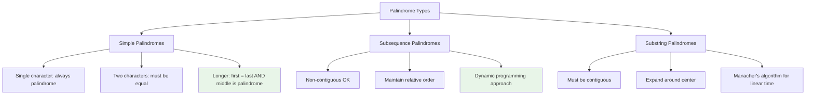

# Palindrome Patterns: Dynamic Programming for Symmetric Sequences

Palindromes represent one of the most elegant patterns in computer science. This comprehensive guide explores dynamic programming approaches to palindrome problems, from basic detection to advanced optimization techniques used in text processing and computational biology.

## Table of Contents
1. [Palindrome Fundamentals](#palindrome-fundamentals)
2. [Longest Palindromic Subsequence](#longest-palindromic-subsequence)
3. [Palindrome Partitioning](#palindrome-partitioning)
4. [Advanced Palindrome Problems](#advanced-palindrome-problems)
5. [Palindrome Tree & Optimization](#palindrome-tree-optimization)
6. [Real-World Applications](#real-world-applications)
7. [Problem Recognition](#problem-recognition)

## Palindrome Fundamentals {#palindrome-fundamentals}

A palindrome reads the same forwards and backwards. Understanding palindrome properties is crucial for efficient algorithm design.

### Core Palindrome Concepts



### Basic Palindrome Detection

```go
// Check if a string is a palindrome
func isPalindrome(s string) bool {
    left, right := 0, len(s)-1
    
    for left < right {
        if s[left] != s[right] {
            return false
        }
        left++
        right--
    }
    
    return true
}

// Check if substring s[i:j+1] is a palindrome
func isPalindromeRange(s string, i, j int) bool {
    for i < j {
        if s[i] != s[j] {
            return false
        }
        i++
        j--
    }
    return true
}

// Precompute palindrome matrix for all substrings
func buildPalindromeMatrix(s string) [][]bool {
    n := len(s)
    isPalin := make([][]bool, n)
    for i := range isPalin {
        isPalin[i] = make([]bool, n)
    }
    
    // Single characters are palindromes
    for i := 0; i < n; i++ {
        isPalin[i][i] = true
    }
    
    // Check for length 2
    for i := 0; i < n-1; i++ {
        isPalin[i][i+1] = (s[i] == s[i+1])
    }
    
    // Check for lengths 3 and above
    for length := 3; length <= n; length++ {
        for i := 0; i <= n-length; i++ {
            j := i + length - 1
            isPalin[i][j] = (s[i] == s[j]) && isPalin[i+1][j-1]
        }
    }
    
    return isPalin
}
```

## Longest Palindromic Subsequence {#longest-palindromic-subsequence}

### Basic LPS Algorithm

```go
// Find the length of the longest palindromic subsequence
func longestPalindromicSubsequence(s string) int {
    n := len(s)
    
    // dp[i][j] = length of LPS in substring s[i:j+1]
    dp := make([][]int, n)
    for i := range dp {
        dp[i] = make([]int, n)
    }
    
    // Single characters are palindromes of length 1
    for i := 0; i < n; i++ {
        dp[i][i] = 1
    }
    
    // Fill for lengths 2 and above
    for length := 2; length <= n; length++ {
        for i := 0; i <= n-length; i++ {
            j := i + length - 1
            
            if s[i] == s[j] {
                if length == 2 {
                    dp[i][j] = 2
                } else {
                    dp[i][j] = dp[i+1][j-1] + 2
                }
            } else {
                dp[i][j] = max(dp[i+1][j], dp[i][j-1])
            }
        }
    }
    
    return dp[0][n-1]
}

func max(a, b int) int {
    if a > b {
        return a
    }
    return b
}
```

### LPS with Actual Sequence Construction

```go
// Get the actual longest palindromic subsequence string
func getLongestPalindromicSubsequence(s string) string {
    n := len(s)
    
    dp := make([][]int, n)
    for i := range dp {
        dp[i] = make([]int, n)
    }
    
    // Build DP table
    for i := 0; i < n; i++ {
        dp[i][i] = 1
    }
    
    for length := 2; length <= n; length++ {
        for i := 0; i <= n-length; i++ {
            j := i + length - 1
            
            if s[i] == s[j] {
                if length == 2 {
                    dp[i][j] = 2
                } else {
                    dp[i][j] = dp[i+1][j-1] + 2
                }
            } else {
                dp[i][j] = max(dp[i+1][j], dp[i][j-1])
            }
        }
    }
    
    // Reconstruct the LPS
    return reconstructLPS(s, dp, 0, n-1)
}

func reconstructLPS(s string, dp [][]int, i, j int) string {
    if i > j {
        return ""
    }
    
    if i == j {
        return string(s[i])
    }
    
    if s[i] == s[j] {
        return string(s[i]) + reconstructLPS(s, dp, i+1, j-1) + string(s[j])
    }
    
    if dp[i+1][j] > dp[i][j-1] {
        return reconstructLPS(s, dp, i+1, j)
    }
    return reconstructLPS(s, dp, i, j-1)
}
```

### Space-Optimized LPS

```go
// Space-optimized longest palindromic subsequence using O(n) space
func longestPalindromicSubsequenceOptimized(s string) int {
    n := len(s)
    
    // Use only two arrays instead of full matrix
    prev := make([]int, n)
    curr := make([]int, n)
    
    // Single characters
    for i := 0; i < n; i++ {
        prev[i] = 1
    }
    
    for length := 2; length <= n; length++ {
        for i := 0; i <= n-length; i++ {
            j := i + length - 1
            
            if s[i] == s[j] {
                if length == 2 {
                    curr[i] = 2
                } else {
                    curr[i] = prev[i+1] + 2
                }
            } else {
                curr[i] = max(prev[i], curr[i+1])
            }
        }
        prev, curr = curr, prev
    }
    
    return prev[0]
}
```

### Count All Palindromic Subsequences

```go
// Count the total number of palindromic subsequences
func countPalindromicSubsequences(s string) int {
    n := len(s)
    const MOD = 1000000007
    
    // dp[i][j] = number of palindromic subsequences in s[i:j+1]
    dp := make([][]int, n)
    for i := range dp {
        dp[i] = make([]int, n)
    }
    
    // Single characters
    for i := 0; i < n; i++ {
        dp[i][i] = 1
    }
    
    // Fill for lengths 2 and above
    for length := 2; length <= n; length++ {
        for i := 0; i <= n-length; i++ {
            j := i + length - 1
            
            if s[i] == s[j] {
                dp[i][j] = (1 + dp[i+1][j] + dp[i][j-1]) % MOD
            } else {
                dp[i][j] = (dp[i+1][j] + dp[i][j-1] - dp[i+1][j-1] + MOD) % MOD
            }
        }
    }
    
    return dp[0][n-1]
}
```

## Palindrome Partitioning {#palindrome-partitioning}

### Minimum Palindrome Partitions

```go
// Find minimum cuts needed to partition string into palindromes
func minPalindromePartition(s string) int {
    n := len(s)
    
    // Precompute palindrome matrix
    isPalin := buildPalindromeMatrix(s)
    
    // dp[i] = minimum cuts needed for s[0:i]
    dp := make([]int, n+1)
    
    for i := 1; i <= n; i++ {
        dp[i] = i - 1  // Worst case: i-1 cuts (each character separate)
        
        for j := 0; j < i; j++ {
            if isPalin[j][i-1] {
                // s[j:i] is palindrome
                dp[i] = min(dp[i], dp[j] + 1)
            }
        }
    }
    
    return dp[n] - 1  // Number of cuts = partitions - 1
}

func min(a, b int) int {
    if a < b {
        return a
    }
    return b
}
```

### All Palindrome Partitions

```go
// Find all ways to partition string into palindromes
func allPalindromePartitions(s string) [][]string {
    var result [][]string
    var current []string
    
    isPalin := buildPalindromeMatrix(s)
    backtrackPartitions(s, 0, isPalin, current, &result)
    
    return result
}

func backtrackPartitions(s string, start int, isPalin [][]bool, 
                        current []string, result *[][]string) {
    if start == len(s) {
        // Make a copy of current partition
        partition := make([]string, len(current))
        copy(partition, current)
        *result = append(*result, partition)
        return
    }
    
    for end := start; end < len(s); end++ {
        if isPalin[start][end] {
            // s[start:end+1] is a palindrome
            current = append(current, s[start:end+1])
            backtrackPartitions(s, end+1, isPalin, current, result)
            current = current[:len(current)-1]  // Backtrack
        }
    }
}
```

### Palindrome Partitioning with DP Optimization

```go
// Advanced palindrome partitioning with memoization
type PartitionMemo struct {
    memo map[int][][]string
    isPalin [][]bool
    s string
}

func NewPartitionMemo(s string) *PartitionMemo {
    return &PartitionMemo{
        memo: make(map[int][][]string),
        isPalin: buildPalindromeMatrix(s),
        s: s,
    }
}

func (pm *PartitionMemo) GetPartitions(start int) [][]string {
    if cached, exists := pm.memo[start]; exists {
        return cached
    }
    
    var result [][]string
    
    if start == len(pm.s) {
        result = append(result, []string{})
        pm.memo[start] = result
        return result
    }
    
    for end := start; end < len(pm.s); end++ {
        if pm.isPalin[start][end] {
            palindrome := pm.s[start:end+1]
            
            // Get all partitions for the remaining string
            subPartitions := pm.GetPartitions(end + 1)
            
            // Add current palindrome to each sub-partition
            for _, partition := range subPartitions {
                newPartition := append([]string{palindrome}, partition...)
                result = append(result, newPartition)
            }
        }
    }
    
    pm.memo[start] = result
    return result
}
```

## Advanced Palindrome Problems {#advanced-palindrome-problems}

### Longest Palindromic Substring with Expansion

```go
// Find longest palindromic substring using center expansion
func longestPalindromicSubstring(s string) string {
    if len(s) == 0 {
        return ""
    }
    
    start, maxLen := 0, 1
    
    for i := 0; i < len(s); i++ {
        // Check for odd length palindromes (center at i)
        len1 := expandAroundCenter(s, i, i)
        
        // Check for even length palindromes (center between i and i+1)
        len2 := expandAroundCenter(s, i, i+1)
        
        currentMax := max(len1, len2)
        
        if currentMax > maxLen {
            maxLen = currentMax
            start = i - (currentMax-1)/2
        }
    }
    
    return s[start : start+maxLen]
}

func expandAroundCenter(s string, left, right int) int {
    for left >= 0 && right < len(s) && s[left] == s[right] {
        left--
        right++
    }
    return right - left - 1
}
```

### Palindrome with Character Insertions

```go
// Minimum insertions to make string palindrome
func minInsertionsToMakePalindrome(s string) int {
    n := len(s)
    
    // Find LCS of string with its reverse
    reverse := reverseString(s)
    lcs := longestCommonSubsequence(s, reverse)
    
    // Minimum insertions = n - LCS
    return n - lcs
}

func longestCommonSubsequence(text1, text2 string) int {
    m, n := len(text1), len(text2)
    
    dp := make([][]int, m+1)
    for i := range dp {
        dp[i] = make([]int, n+1)
    }
    
    for i := 1; i <= m; i++ {
        for j := 1; j <= n; j++ {
            if text1[i-1] == text2[j-1] {
                dp[i][j] = dp[i-1][j-1] + 1
            } else {
                dp[i][j] = max(dp[i-1][j], dp[i][j-1])
            }
        }
    }
    
    return dp[m][n]
}

func reverseString(s string) string {
    runes := []rune(s)
    for i, j := 0, len(runes)-1; i < j; i, j = i+1, j-1 {
        runes[i], runes[j] = runes[j], runes[i]
    }
    return string(runes)
}
```

### Palindrome with K Changes

```go
// Check if string can be made palindrome with at most k character changes
func canMakePalindromeWithKChanges(s string, k int) bool {
    n := len(s)
    changes := 0
    
    for i := 0; i < n/2; i++ {
        if s[i] != s[n-1-i] {
            changes++
        }
    }
    
    return changes <= k
}

// Find lexicographically largest palindrome with exactly k changes
func makeLargestPalindromeWithKChanges(s string, k int) string {
    chars := []byte(s)
    n := len(chars)
    changes := 0
    
    // Count required changes for palindrome
    for i := 0; i < n/2; i++ {
        if chars[i] != chars[n-1-i] {
            changes++
        }
    }
    
    if changes > k {
        return ""  // Impossible
    }
    
    extraChanges := k - changes
    
    // Make palindrome and maximize lexicographically
    for i := 0; i < n/2; i++ {
        if chars[i] != chars[n-1-i] {
            // Must change one: choose the larger
            if chars[i] > chars[n-1-i] {
                chars[n-1-i] = chars[i]
            } else {
                chars[i] = chars[n-1-i]
            }
        } else if extraChanges > 0 && chars[i] != '9' {
            // Optional change to make larger
            if extraChanges >= 2 || (extraChanges == 1 && n%2 == 1 && i == n/2) {
                chars[i] = '9'
                chars[n-1-i] = '9'
                if i != n-1-i {
                    extraChanges -= 2
                } else {
                    extraChanges -= 1
                }
            }
        }
    }
    
    // Handle middle character for odd length
    if n%2 == 1 && extraChanges > 0 {
        chars[n/2] = '9'
    }
    
    return string(chars)
}
```

## Palindrome Tree & Optimization {#palindrome-tree-optimization}

### Manacher's Algorithm for Linear Time

```go
// Manacher's algorithm for finding all palindromes in O(n) time
func manacher(s string) []int {
    // Transform string to handle even-length palindromes
    // "abc" becomes "^#a#b#c#$"
    transformed := "^"
    for _, ch := range s {
        transformed += "#" + string(ch)
    }
    transformed += "#$"
    
    n := len(transformed)
    palindromes := make([]int, n)
    center, right := 0, 0
    
    for i := 1; i < n-1; i++ {
        mirror := 2*center - i
        
        if i < right {
            palindromes[i] = min(right-i, palindromes[mirror])
        }
        
        // Try to expand palindrome centered at i
        for transformed[i+1+palindromes[i]] == transformed[i-1-palindromes[i]] {
            palindromes[i]++
        }
        
        // If palindrome centered at i extends past right, adjust center and right
        if i+palindromes[i] > right {
            center, right = i, i+palindromes[i]
        }
    }
    
    return palindromes
}

// Get all palindromic substrings using Manacher's result
func getAllPalindromes(s string) []string {
    palindromes := manacher(s)
    var result []string
    
    for i := 1; i < len(palindromes)-1; i++ {
        if palindromes[i] > 0 {
            // Convert back to original indices
            start := (i - palindromes[i]) / 2
            length := palindromes[i]
            result = append(result, s[start:start+length])
        }
    }
    
    return result
}
```

### Palindromic Tree Data Structure

```go
// Palindromic Tree (Eertree) for efficient palindrome processing
type PalindromicTreeNode struct {
    edges    map[byte]*PalindromicTreeNode
    len      int  // Length of palindrome
    suffLink *PalindromicTreeNode  // Suffix link
}

type PalindromicTree struct {
    nodes   []*PalindromicTreeNode
    s       string
    n       int
    ptr     int  // Current node
}

func NewPalindromicTree() *PalindromicTree {
    pt := &PalindromicTree{
        nodes: make([]*PalindromicTreeNode, 2),
    }
    
    // Create root nodes: even and odd length roots
    pt.nodes[0] = &PalindromicTreeNode{
        edges:    make(map[byte]*PalindromicTreeNode),
        len:      -1,  // Even root
        suffLink: nil,
    }
    
    pt.nodes[1] = &PalindromicTreeNode{
        edges:    make(map[byte]*PalindromicTreeNode),
        len:      0,   // Odd root
        suffLink: pt.nodes[0],
    }
    
    pt.ptr = 1
    return pt
}

func (pt *PalindromicTree) AddCharacter(ch byte) {
    pt.s += string(ch)
    pt.n++
    
    // Find the longest palindrome suffix
    cur := pt.nodes[pt.ptr]
    
    for pt.n-cur.len-2 < 0 || pt.s[pt.n-cur.len-2] != ch {
        cur = cur.suffLink
    }
    
    if _, exists := cur.edges[ch]; !exists {
        // Create new node
        newNode := &PalindromicTreeNode{
            edges: make(map[byte]*PalindromicTreeNode),
            len:   cur.len + 2,
        }
        
        pt.nodes = append(pt.nodes, newNode)
        cur.edges[ch] = newNode
        
        if newNode.len == 1 {
            newNode.suffLink = pt.nodes[1]  // Link to odd root
        } else {
            // Find suffix link
            tmp := cur.suffLink
            for pt.n-tmp.len-2 < 0 || pt.s[pt.n-tmp.len-2] != ch {
                tmp = tmp.suffLink
            }
            newNode.suffLink = tmp.edges[ch]
        }
    }
    
    pt.ptr = len(pt.nodes) - 1
}

func (pt *PalindromicTree) CountDistinctPalindromes() int {
    return len(pt.nodes) - 2  // Exclude the two root nodes
}
```

## Real-World Applications {#real-world-applications}

### DNA Palindrome Analysis

```go
// DNA palindrome analysis for restriction sites
type DNAPalindromeAnalyzer struct {
    sequence string
    minLength int
    maxLength int
}

type RestrictionSite struct {
    Start     int
    End       int
    Sequence  string
    Enzyme    string
    Frequency float64
}

func NewDNAPalindromeAnalyzer(sequence string) *DNAPalindromeAnalyzer {
    return &DNAPalindromeAnalyzer{
        sequence: strings.ToUpper(sequence),
        minLength: 4,  // Minimum restriction site length
        maxLength: 12, // Maximum restriction site length
    }
}

func (dna *DNAPalindromeAnalyzer) FindRestrictionSites() []RestrictionSite {
    var sites []RestrictionSite
    n := len(dna.sequence)
    
    for length := dna.minLength; length <= dna.maxLength; length++ {
        for i := 0; i <= n-length; i++ {
            substr := dna.sequence[i:i+length]
            if dna.isDNAPalindrome(substr) {
                sites = append(sites, RestrictionSite{
                    Start: i,
                    End: i + length - 1,
                    Sequence: substr,
                    Enzyme: dna.getEnzymeName(substr),
                    Frequency: dna.calculateFrequency(substr),
                })
            }
        }
    }
    
    return sites
}

func (dna *DNAPalindromeAnalyzer) isDNAPalindrome(s string) bool {
    // Check if sequence is palindromic considering DNA base pairing
    // A-T and G-C are complements
    complement := map[byte]byte{'A': 'T', 'T': 'A', 'G': 'C', 'C': 'G'}
    
    n := len(s)
    for i := 0; i < n/2; i++ {
        if complement[s[i]] != s[n-1-i] {
            return false
        }
    }
    return true
}

func (dna *DNAPalindromeAnalyzer) getEnzymeName(sequence string) string {
    // Map common restriction sites to enzyme names
    enzymes := map[string]string{
        "GAATTC": "EcoRI",
        "AAGCTT": "HindIII",
        "GGATCC": "BamHI",
        "CTGCAG": "PstI",
        "GTCGAC": "SalI",
    }
    
    if enzyme, exists := enzymes[sequence]; exists {
        return enzyme
    }
    return "Unknown"
}

func (dna *DNAPalindromeAnalyzer) calculateFrequency(sequence string) float64 {
    // Calculate expected frequency based on base composition
    baseCount := map[byte]int{'A': 0, 'T': 0, 'G': 0, 'C': 0}
    
    for i := 0; i < len(dna.sequence); i++ {
        baseCount[dna.sequence[i]]++
    }
    
    total := len(dna.sequence)
    freq := 1.0
    
    for _, base := range sequence {
        freq *= float64(baseCount[base]) / float64(total)
    }
    
    return freq * float64(total-len(sequence)+1)
}
```

### Text Processing with Palindromes

```go
// Text processing utility for palindrome-based operations
type TextProcessor struct {
    text string
    palindromes map[string][]int  // palindrome -> positions
}

func NewTextProcessor(text string) *TextProcessor {
    tp := &TextProcessor{
        text: strings.ToLower(text),
        palindromes: make(map[string][]int),
    }
    tp.indexPalindromes()
    return tp
}

func (tp *TextProcessor) indexPalindromes() {
    n := len(tp.text)
    
    // Find all palindromic substrings
    for i := 0; i < n; i++ {
        // Odd length palindromes
        tp.expandAndIndex(i, i)
        
        // Even length palindromes
        if i < n-1 {
            tp.expandAndIndex(i, i+1)
        }
    }
}

func (tp *TextProcessor) expandAndIndex(left, right int) {
    for left >= 0 && right < len(tp.text) && tp.text[left] == tp.text[right] {
        if right-left+1 >= 3 {  // Only index palindromes of length 3+
            palindrome := tp.text[left:right+1]
            tp.palindromes[palindrome] = append(tp.palindromes[palindrome], left)
        }
        left--
        right++
    }
}

func (tp *TextProcessor) GetPalindromeFrequency() map[string]int {
    freq := make(map[string]int)
    for palindrome, positions := range tp.palindromes {
        freq[palindrome] = len(positions)
    }
    return freq
}

func (tp *TextProcessor) FindOverlappingPalindromes() [][]string {
    var overlapping [][]string
    
    for palindrome1, positions1 := range tp.palindromes {
        for palindrome2, positions2 := range tp.palindromes {
            if palindrome1 >= palindrome2 {
                continue
            }
            
            // Check for overlaps
            for _, pos1 := range positions1 {
                end1 := pos1 + len(palindrome1) - 1
                
                for _, pos2 := range positions2 {
                    end2 := pos2 + len(palindrome2) - 1
                    
                    // Check if they overlap
                    if (pos1 <= pos2 && end1 >= pos2) || (pos2 <= pos1 && end2 >= pos1) {
                        overlapping = append(overlapping, []string{palindrome1, palindrome2})
                        break
                    }
                }
            }
        }
    }
    
    return overlapping
}

func (tp *TextProcessor) GetLongestPalindromes(count int) []string {
    type PalindromePair struct {
        palindrome string
        length     int
    }
    
    var pairs []PalindromePair
    for palindrome := range tp.palindromes {
        pairs = append(pairs, PalindromePair{palindrome, len(palindrome)})
    }
    
    // Sort by length descending
    sort.Slice(pairs, func(i, j int) bool {
        return pairs[i].length > pairs[j].length
    })
    
    var result []string
    for i := 0; i < min(count, len(pairs)); i++ {
        result = append(result, pairs[i].palindrome)
    }
    
    return result
}
```

## Problem Recognition {#problem-recognition}

### Palindrome Pattern Classification

```go
type PalindromeClassifier struct {
    patterns map[string][]string
}

func NewPalindromeClassifier() *PalindromeClassifier {
    return &PalindromeClassifier{
        patterns: map[string][]string{
            "basic_detection": {
                "is palindrome", "check palindrome", "palindrome test",
                "symmetric string", "reads same forwards backwards",
            },
            "longest_palindrome": {
                "longest palindromic", "maximum palindrome", "find longest",
                "palindromic subsequence", "palindromic substring",
            },
            "palindrome_partitioning": {
                "partition", "cut", "split into palindromes", 
                "minimum cuts", "palindromic partitions",
            },
            "palindrome_construction": {
                "make palindrome", "form palindrome", "construct palindrome",
                "minimum insertions", "minimum changes",
            },
            "dna_analysis": {
                "DNA", "restriction site", "genetic", "sequence analysis",
                "complement", "base pair",
            },
        },
    }
}

func (pc *PalindromeClassifier) ClassifyProblem(description string) string {
    desc := strings.ToLower(description)
    maxScore := 0
    bestMatch := "basic_detection"
    
    for pattern, keywords := range pc.patterns {
        score := 0
        for _, keyword := range keywords {
            if strings.Contains(desc, keyword) {
                score++
            }
        }
        
        if score > maxScore {
            maxScore = score
            bestMatch = pattern
        }
    }
    
    return bestMatch
}
```

### Algorithm Selection Framework

| Problem Type | Algorithm | Time | Space | Best Use Case |
|-------------|-----------|------|-------|---------------|
| **Basic Detection** | Two pointers | O(n) | O(1) | Simple palindrome check |
| **All Substrings** | Center expansion | O(n²) | O(1) | Find all palindromic substrings |
| **Longest Subsequence** | 2D DP | O(n²) | O(n²) | Non-contiguous palindrome |
| **All Palindromes** | Manacher's | O(n) | O(n) | Linear time all palindromes |
| **Partitioning** | DP + Precompute | O(n²) | O(n²) | Minimum cuts problem |

## Conclusion

Palindrome problems demonstrate the power of dynamic programming in handling symmetric structures and have wide applications from text processing to bioinformatics.

### Palindrome Mastery Framework:

**🔍 Core Patterns**
- **Basic detection** - Two-pointer technique for simple cases
- **DP formulation** - Handle complex subsequence/substring problems
- **Center expansion** - Efficient for multiple palindrome detection

**⚡ Advanced Techniques**
- **Manacher's algorithm** - Linear time all palindromes
- **Palindromic tree** - Advanced data structure for streaming
- **Space optimization** - Reduce memory usage for large inputs

**💡 Real-World Applications**
- **Bioinformatics** - DNA restriction site analysis
- **Text processing** - Content analysis and pattern detection
- **Optimization** - Partitioning and structure problems

### Key Implementation Guidelines:

1. **Choose appropriate algorithm** - Match technique to problem constraints
2. **Precomputation strategy** - Build palindrome matrices when needed multiple times
3. **Space-time tradeoffs** - Optimize based on specific requirements
4. **Domain adaptation** - Customize for DNA, text, or other specific domains

**🚀 Congratulations!** You've now mastered the four core sequence DP patterns. You're ready to tackle any sequence-based dynamic programming problem with confidence!

---

*Previous: [Edit Distance Patterns](/blog/dsa/dp-edit-distance-patterns) | Series: [DSA Fundamentals](/blog/series/dsa-fundamentals)*