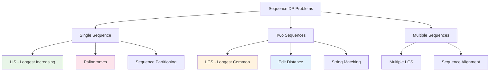

# Dynamic Programming Sequence Patterns: Mastering String and Array Analysis

Sequence-based dynamic programming problems are among the most elegant and widely applicable in computer science. These patterns deal with analyzing, comparing, and optimizing sequences - whether they're strings, arrays, or abstract sequences.

## Table of Contents
1. [Sequence DP Overview](#sequence-overview)
2. [Longest Increasing Subsequence (LIS)](#lis-patterns)
3. [Longest Common Subsequence (LCS)](#lcs-patterns)
4. [Edit Distance Family](#edit-distance)
5. [Palindromic Patterns](#palindromic-patterns)
6. [Substring vs Subsequence](#substring-vs-subsequence)
7. [Advanced Sequence Problems](#advanced-sequence)
8. [Optimization Techniques](#optimization-techniques)
9. [Real-World Applications](#real-world-applications)
10. [Problem Recognition Guide](#problem-recognition)

## Sequence DP Overview {#sequence-overview}

### Core Sequence Patterns



### The Sequence DP Framework

Each sequence problem follows a pattern:
- **State Definition**: What does dp[i] or dp[i][j] represent?
- **Transition Logic**: How do we build solutions from subproblems?
- **Base Cases**: What are the simplest sequences to handle?

## Longest Increasing Subsequence (LIS) {#lis-patterns}

### Basic LIS - O(n²) Solution

```go
// Classic LIS using DP - O(n²) time, O(n) space
func lengthOfLIS(nums []int) int {
    if len(nums) == 0 {
        return 0
    }
    
    n := len(nums)
    // dp[i] = length of LIS ending at position i
    dp := make([]int, n)
    
    // Every element is an LIS of length 1
    for i := range dp {
        dp[i] = 1
    }
    
    maxLength := 1
    
    for i := 1; i < n; i++ {
        for j := 0; j < i; j++ {
            if nums[j] < nums[i] {
                dp[i] = max(dp[i], dp[j]+1)
            }
        }
        maxLength = max(maxLength, dp[i])
    }
    
    return maxLength
}

// Track the actual LIS sequence
func findLIS(nums []int) []int {
    if len(nums) == 0 {
        return []int{}
    }
    
    n := len(nums)
    dp := make([]int, n)
    parent := make([]int, n)
    
    for i := range dp {
        dp[i] = 1
        parent[i] = -1
    }
    
    maxLength := 1
    maxIndex := 0
    
    for i := 1; i < n; i++ {
        for j := 0; j < i; j++ {
            if nums[j] < nums[i] && dp[j]+1 > dp[i] {
                dp[i] = dp[j] + 1
                parent[i] = j
            }
        }
        
        if dp[i] > maxLength {
            maxLength = dp[i]
            maxIndex = i
        }
    }
    
    // Reconstruct LIS
    lis := make([]int, maxLength)
    idx := maxIndex
    
    for i := maxLength - 1; i >= 0; i-- {
        lis[i] = nums[idx]
        idx = parent[idx]
    }
    
    return lis
}

func max(a, b int) int {
    if a > b {
        return a
    }
    return b
}
```

### Optimized LIS - O(n log n) Solution

```go
import (
    "sort"
)

// Binary search based LIS - O(n log n)
func lengthOfLISOptimized(nums []int) int {
    if len(nums) == 0 {
        return 0
    }
    
    // tails[i] = smallest ending element of LIS of length i+1
    tails := []int{}
    
    for _, num := range nums {
        // Binary search for insertion position
        pos := sort.SearchInts(tails, num)
        
        if pos == len(tails) {
            // num is larger than all elements in tails
            tails = append(tails, num)
        } else {
            // Replace the element at pos
            tails[pos] = num
        }
    }
    
    return len(tails)
}

// Custom binary search for more control
func lengthOfLISBinarySearch(nums []int) int {
    if len(nums) == 0 {
        return 0
    }
    
    tails := []int{}
    
    for _, num := range nums {
        left, right := 0, len(tails)
        
        // Find leftmost position where tails[pos] >= num
        for left < right {
            mid := left + (right-left)/2
            if tails[mid] < num {
                left = mid + 1
            } else {
                right = mid
            }
        }
        
        if left == len(tails) {
            tails = append(tails, num)
        } else {
            tails[left] = num
        }
    }
    
    return len(tails)
}
```

### LIS Variations

```go
// Longest Decreasing Subsequence
func lengthOfLDS(nums []int) int {
    if len(nums) == 0 {
        return 0
    }
    
    // Simply negate all numbers and find LIS
    negated := make([]int, len(nums))
    for i, num := range nums {
        negated[i] = -num
    }
    
    return lengthOfLISOptimized(negated)
}

// Number of LIS
func findNumberOfLIS(nums []int) int {
    if len(nums) == 0 {
        return 0
    }
    
    n := len(nums)
    // dp[i] = length of LIS ending at i
    // count[i] = number of LIS ending at i
    dp := make([]int, n)
    count := make([]int, n)
    
    for i := range dp {
        dp[i] = 1
        count[i] = 1
    }
    
    maxLength := 1
    
    for i := 1; i < n; i++ {
        for j := 0; j < i; j++ {
            if nums[j] < nums[i] {
                if dp[j]+1 > dp[i] {
                    dp[i] = dp[j] + 1
                    count[i] = count[j]
                } else if dp[j]+1 == dp[i] {
                    count[i] += count[j]
                }
            }
        }
        maxLength = max(maxLength, dp[i])
    }
    
    result := 0
    for i := 0; i < n; i++ {
        if dp[i] == maxLength {
            result += count[i]
        }
    }
    
    return result
}

// LIS with limited removals
func lengthOfLISWithRemovals(nums []int, k int) int {
    n := len(nums)
    // dp[i][j] = LIS ending at i with j removals used
    dp := make([][]int, n)
    for i := range dp {
        dp[i] = make([]int, k+1)
    }
    
    maxLength := 0
    
    for i := 0; i < n; i++ {
        // Base case: single element
        dp[i][0] = 1
        maxLength = max(maxLength, 1)
        
        for j := 0; j <= k; j++ {
            for prev := 0; prev < i; prev++ {
                if nums[prev] < nums[i] {
                    // Don't remove any elements between prev and i
                    dp[i][j] = max(dp[i][j], dp[prev][j]+1)
                }
                
                // Remove some elements between prev and i
                removeCount := i - prev - 1
                if j >= removeCount {
                    dp[i][j] = max(dp[i][j], dp[prev][j-removeCount]+1)
                }
            }
            maxLength = max(maxLength, dp[i][j])
        }
    }
    
    return maxLength
}
```

## Longest Common Subsequence (LCS) {#lcs-patterns}

### Basic LCS - Two Sequences

```go
// Classic LCS between two strings
func longestCommonSubsequence(text1, text2 string) int {
    m, n := len(text1), len(text2)
    
    // dp[i][j] = LCS length for text1[0:i] and text2[0:j]
    dp := make([][]int, m+1)
    for i := range dp {
        dp[i] = make([]int, n+1)
    }
    
    for i := 1; i <= m; i++ {
        for j := 1; j <= n; j++ {
            if text1[i-1] == text2[j-1] {
                dp[i][j] = dp[i-1][j-1] + 1
            } else {
                dp[i][j] = max(dp[i-1][j], dp[i][j-1])
            }
        }
    }
    
    return dp[m][n]
}

// Space-optimized LCS
func longestCommonSubsequenceOptimized(text1, text2 string) int {
    m, n := len(text1), len(text2)
    
    // Use only two rows
    prev := make([]int, n+1)
    curr := make([]int, n+1)
    
    for i := 1; i <= m; i++ {
        for j := 1; j <= n; j++ {
            if text1[i-1] == text2[j-1] {
                curr[j] = prev[j-1] + 1
            } else {
                curr[j] = max(prev[j], curr[j-1])
            }
        }
        prev, curr = curr, prev
    }
    
    return prev[n]
}

// Get the actual LCS string
func getLCS(text1, text2 string) string {
    m, n := len(text1), len(text2)
    dp := make([][]int, m+1)
    for i := range dp {
        dp[i] = make([]int, n+1)
    }
    
    // Fill DP table
    for i := 1; i <= m; i++ {
        for j := 1; j <= n; j++ {
            if text1[i-1] == text2[j-1] {
                dp[i][j] = dp[i-1][j-1] + 1
            } else {
                dp[i][j] = max(dp[i-1][j], dp[i][j-1])
            }
        }
    }
    
    // Backtrack to build LCS
    lcs := make([]byte, dp[m][n])
    i, j, k := m, n, dp[m][n]-1
    
    for i > 0 && j > 0 {
        if text1[i-1] == text2[j-1] {
            lcs[k] = text1[i-1]
            k--
            i--
            j--
        } else if dp[i-1][j] > dp[i][j-1] {
            i--
        } else {
            j--
        }
    }
    
    return string(lcs)
}
```

### LCS Variations

```go
// Longest Common Substring (contiguous)
func longestCommonSubstring(text1, text2 string) int {
    m, n := len(text1), len(text2)
    
    // dp[i][j] = length of common substring ending at i-1, j-1
    dp := make([][]int, m+1)
    for i := range dp {
        dp[i] = make([]int, n+1)
    }
    
    maxLength := 0
    
    for i := 1; i <= m; i++ {
        for j := 1; j <= n; j++ {
            if text1[i-1] == text2[j-1] {
                dp[i][j] = dp[i-1][j-1] + 1
                maxLength = max(maxLength, dp[i][j])
            } else {
                dp[i][j] = 0
            }
        }
    }
    
    return maxLength
}

// LCS of three strings
func longestCommonSubsequence3(text1, text2, text3 string) int {
    m, n, p := len(text1), len(text2), len(text3)
    
    // 3D DP: dp[i][j][k] = LCS for text1[0:i], text2[0:j], text3[0:k]
    dp := make([][][]int, m+1)
    for i := range dp {
        dp[i] = make([][]int, n+1)
        for j := range dp[i] {
            dp[i][j] = make([]int, p+1)
        }
    }
    
    for i := 1; i <= m; i++ {
        for j := 1; j <= n; j++ {
            for k := 1; k <= p; k++ {
                if text1[i-1] == text2[j-1] && text2[j-1] == text3[k-1] {
                    dp[i][j][k] = dp[i-1][j-1][k-1] + 1
                } else {
                    dp[i][j][k] = max(
                        dp[i-1][j][k],
                        max(dp[i][j-1][k], dp[i][j][k-1]),
                    )
                }
            }
        }
    }
    
    return dp[m][n][p]
}

// Shortest Common Supersequence
func shortestCommonSupersequence(str1, str2 string) string {
    m, n := len(str1), len(str2)
    
    // First find LCS length
    dp := make([][]int, m+1)
    for i := range dp {
        dp[i] = make([]int, n+1)
    }
    
    for i := 1; i <= m; i++ {
        for j := 1; j <= n; j++ {
            if str1[i-1] == str2[j-1] {
                dp[i][j] = dp[i-1][j-1] + 1
            } else {
                dp[i][j] = max(dp[i-1][j], dp[i][j-1])
            }
        }
    }
    
    // Build supersequence by backtracking
    var result []byte
    i, j := m, n
    
    for i > 0 && j > 0 {
        if str1[i-1] == str2[j-1] {
            result = append([]byte{str1[i-1]}, result...)
            i--
            j--
        } else if dp[i-1][j] > dp[i][j-1] {
            result = append([]byte{str1[i-1]}, result...)
            i--
        } else {
            result = append([]byte{str2[j-1]}, result...)
            j--
        }
    }
    
    // Add remaining characters
    for i > 0 {
        result = append([]byte{str1[i-1]}, result...)
        i--
    }
    for j > 0 {
        result = append([]byte{str2[j-1]}, result...)
        j--
    }
    
    return string(result)
}
```

## Edit Distance Family {#edit-distance}

### Classic Edit Distance (Levenshtein)

```go
// Classic edit distance with insert, delete, replace operations
func minDistance(word1, word2 string) int {
    m, n := len(word1), len(word2)
    
    // dp[i][j] = edit distance between word1[0:i] and word2[0:j]
    dp := make([][]int, m+1)
    for i := range dp {
        dp[i] = make([]int, n+1)
    }
    
    // Base cases
    for i := 0; i <= m; i++ {
        dp[i][0] = i  // Delete all characters from word1
    }
    for j := 0; j <= n; j++ {
        dp[0][j] = j  // Insert all characters to match word2
    }
    
    for i := 1; i <= m; i++ {
        for j := 1; j <= n; j++ {
            if word1[i-1] == word2[j-1] {
                dp[i][j] = dp[i-1][j-1]  // No operation needed
            } else {
                dp[i][j] = 1 + min(
                    dp[i-1][j],    // Delete from word1
                    min(
                        dp[i][j-1],    // Insert into word1
                        dp[i-1][j-1],  // Replace in word1
                    ),
                )
            }
        }
    }
    
    return dp[m][n]
}

// Track the actual edit operations
type Operation struct {
    Type string // "insert", "delete", "replace", "match"
    Char1 byte
    Char2 byte
    Pos1  int
    Pos2  int
}

func minDistanceWithOperations(word1, word2 string) (int, []Operation) {
    m, n := len(word1), len(word2)
    dp := make([][]int, m+1)
    for i := range dp {
        dp[i] = make([]int, n+1)
    }
    
    // Fill base cases
    for i := 0; i <= m; i++ {
        dp[i][0] = i
    }
    for j := 0; j <= n; j++ {
        dp[0][j] = j
    }
    
    // Fill DP table
    for i := 1; i <= m; i++ {
        for j := 1; j <= n; j++ {
            if word1[i-1] == word2[j-1] {
                dp[i][j] = dp[i-1][j-1]
            } else {
                dp[i][j] = 1 + min(dp[i-1][j], min(dp[i][j-1], dp[i-1][j-1]))
            }
        }
    }
    
    // Backtrack to find operations
    var operations []Operation
    i, j := m, n
    
    for i > 0 || j > 0 {
        if i > 0 && j > 0 && word1[i-1] == word2[j-1] {
            operations = append([]Operation{{
                Type: "match", Char1: word1[i-1], Char2: word2[j-1], Pos1: i-1, Pos2: j-1,
            }}, operations...)
            i--
            j--
        } else if i > 0 && j > 0 && dp[i][j] == dp[i-1][j-1]+1 {
            operations = append([]Operation{{
                Type: "replace", Char1: word1[i-1], Char2: word2[j-1], Pos1: i-1, Pos2: j-1,
            }}, operations...)
            i--
            j--
        } else if i > 0 && dp[i][j] == dp[i-1][j]+1 {
            operations = append([]Operation{{
                Type: "delete", Char1: word1[i-1], Pos1: i-1, Pos2: j,
            }}, operations...)
            i--
        } else {
            operations = append([]Operation{{
                Type: "insert", Char2: word2[j-1], Pos1: i, Pos2: j-1,
            }}, operations...)
            j--
        }
    }
    
    return dp[m][n], operations
}

func min(a, b int) int {
    if a < b {
        return a
    }
    return b
}
```

### Edit Distance Variations

```go
// Edit distance with custom costs
func minDistanceCustomCosts(word1, word2 string, insertCost, deleteCost, replaceCost int) int {
    m, n := len(word1), len(word2)
    dp := make([][]int, m+1)
    for i := range dp {
        dp[i] = make([]int, n+1)
    }
    
    // Base cases with custom costs
    for i := 1; i <= m; i++ {
        dp[i][0] = dp[i-1][0] + deleteCost
    }
    for j := 1; j <= n; j++ {
        dp[0][j] = dp[0][j-1] + insertCost
    }
    
    for i := 1; i <= m; i++ {
        for j := 1; j <= n; j++ {
            if word1[i-1] == word2[j-1] {
                dp[i][j] = dp[i-1][j-1]
            } else {
                dp[i][j] = min(
                    dp[i-1][j]+deleteCost,    // Delete
                    min(
                        dp[i][j-1]+insertCost,    // Insert
                        dp[i-1][j-1]+replaceCost, // Replace
                    ),
                )
            }
        }
    }
    
    return dp[m][n]
}

// One Edit Distance (check if exactly one edit apart)
func isOneEditDistance(s, t string) bool {
    m, n := len(s), len(t)
    
    // If length difference > 1, can't be one edit apart
    if abs(m-n) > 1 {
        return false
    }
    
    if m > n {
        return isOneEditDistance(t, s)  // Ensure s is shorter
    }
    
    for i := 0; i < m; i++ {
        if s[i] != t[i] {
            if m == n {
                // Must be a replacement
                return s[i+1:] == t[i+1:]
            } else {
                // Must be an insertion in t
                return s[i:] == t[i+1:]
            }
        }
    }
    
    // All characters match, check if exactly one insertion needed
    return n == m+1
}

// Edit distance allowing only insertions and deletions
func minDistanceInsertDelete(word1, word2 string) int {
    // This is equivalent to: len(word1) + len(word2) - 2*LCS(word1, word2)
    lcsLength := longestCommonSubsequence(word1, word2)
    return len(word1) + len(word2) - 2*lcsLength
}

func abs(x int) int {
    if x < 0 {
        return -x
    }
    return x
}
```

## Palindromic Patterns {#palindromic-patterns}

### Longest Palindromic Subsequence

```go
// Longest palindromic subsequence
func longestPalindromeSubseq(s string) int {
    n := len(s)
    // dp[i][j] = LPS length in s[i:j+1]
    dp := make([][]int, n)
    for i := range dp {
        dp[i] = make([]int, n)
    }
    
    // Single characters are palindromes of length 1
    for i := 0; i < n; i++ {
        dp[i][i] = 1
    }
    
    // Fill for substrings of length 2 to n
    for length := 2; length <= n; length++ {
        for i := 0; i <= n-length; i++ {
            j := i + length - 1
            
            if s[i] == s[j] {
                dp[i][j] = dp[i+1][j-1] + 2
            } else {
                dp[i][j] = max(dp[i+1][j], dp[i][j-1])
            }
        }
    }
    
    return dp[0][n-1]
}

// Count palindromic subsequences
func countPalindromicSubsequences(s string) int {
    const MOD = 1e9 + 7
    n := len(s)
    
    // dp[i][j] = count of distinct palindromic subsequences in s[i:j+1]
    dp := make([][]int, n)
    for i := range dp {
        dp[i] = make([]int, n)
    }
    
    // Single characters
    for i := 0; i < n; i++ {
        dp[i][i] = 1
    }
    
    for length := 2; length <= n; length++ {
        for i := 0; i <= n-length; i++ {
            j := i + length - 1
            
            if s[i] == s[j] {
                dp[i][j] = (2*dp[i+1][j-1] + 2) % MOD
            } else {
                dp[i][j] = (dp[i+1][j] + dp[i][j-1] - dp[i+1][j-1] + MOD) % MOD
            }
        }
    }
    
    return dp[0][n-1]
}

// Minimum insertions to make palindrome
func minInsertions(s string) int {
    n := len(s)
    lpsLength := longestPalindromeSubseq(s)
    return n - lpsLength
}
```

### Palindromic Substring Patterns

```go
// Longest palindromic substring (Manacher's algorithm - O(n))
func longestPalindrome(s string) string {
    if len(s) == 0 {
        return ""
    }
    
    // Transform string to handle even-length palindromes
    // "abc" -> "^#a#b#c#$"
    transformed := "^#"
    for _, c := range s {
        transformed += string(c) + "#"
    }
    transformed += "$"
    
    n := len(transformed)
    p := make([]int, n)  // p[i] = radius of palindrome centered at i
    center := 0          // center of rightmost palindrome
    right := 0          // right boundary of rightmost palindrome
    
    maxLen := 0
    centerIndex := 0
    
    for i := 1; i < n-1; i++ {
        // Mirror of i with respect to center
        mirror := 2*center - i
        
        if i < right {
            p[i] = min(right-i, p[mirror])
        }
        
        // Try to expand palindrome centered at i
        for transformed[i+p[i]+1] == transformed[i-p[i]-1] {
            p[i]++
        }
        
        // If palindrome centered at i extends past right, adjust center and right
        if i+p[i] > right {
            center = i
            right = i + p[i]
        }
        
        // Update maximum palindrome
        if p[i] > maxLen {
            maxLen = p[i]
            centerIndex = i
        }
    }
    
    // Extract the actual palindrome
    start := (centerIndex - maxLen) / 2
    return s[start : start+maxLen]
}

// Count all palindromic substrings
func countSubstrings(s string) int {
    n := len(s)
    count := 0
    
    // Check for palindromes centered at each position
    for center := 0; center < n; center++ {
        // Odd length palindromes
        left, right := center, center
        for left >= 0 && right < n && s[left] == s[right] {
            count++
            left--
            right++
        }
        
        // Even length palindromes
        left, right = center, center+1
        for left >= 0 && right < n && s[left] == s[right] {
            count++
            left--
            right++
        }
    }
    
    return count
}

// Palindromic partitioning
func partition(s string) [][]string {
    var result [][]string
    var current []string
    
    backtrackPartition(s, 0, current, &result)
    return result
}

func backtrackPartition(s string, start int, current []string, result *[][]string) {
    if start >= len(s) {
        // Make a copy of current path
        partition := make([]string, len(current))
        copy(partition, current)
        *result = append(*result, partition)
        return
    }
    
    for end := start; end < len(s); end++ {
        if isPalindrome(s, start, end) {
            current = append(current, s[start:end+1])
            backtrackPartition(s, end+1, current, result)
            current = current[:len(current)-1]  // Backtrack
        }
    }
}

func isPalindrome(s string, left, right int) bool {
    for left < right {
        if s[left] != s[right] {
            return false
        }
        left++
        right--
    }
    return true
}
```

## Substring vs Subsequence {#substring-vs-subsequence}

### Key Differences and Common Patterns

```go
// Comparison of substring vs subsequence problems
type SequenceAnalyzer struct {
    text string
}

func NewSequenceAnalyzer(text string) *SequenceAnalyzer {
    return &SequenceAnalyzer{text: text}
}

// Substring problems - contiguous characters
func (sa *SequenceAnalyzer) LongestRepeatingSubstring() string {
    n := len(sa.text)
    
    // dp[i][j] = length of common substring starting at i and j
    dp := make([][]int, n+1)
    for i := range dp {
        dp[i] = make([]int, n+1)
    }
    
    maxLength := 0
    endIndex := 0
    
    for i := 1; i <= n; i++ {
        for j := i + 1; j <= n; j++ {
            if sa.text[i-1] == sa.text[j-1] {
                dp[i][j] = dp[i-1][j-1] + 1
                if dp[i][j] > maxLength {
                    maxLength = dp[i][j]
                    endIndex = i
                }
            }
        }
    }
    
    if maxLength == 0 {
        return ""
    }
    
    return sa.text[endIndex-maxLength : endIndex]
}

// Subsequence problems - non-contiguous but order-preserving
func (sa *SequenceAnalyzer) LongestIncreasingSubsequence() []rune {
    runes := []rune(sa.text)
    n := len(runes)
    
    if n == 0 {
        return []rune{}
    }
    
    dp := make([]int, n)
    parent := make([]int, n)
    
    for i := range dp {
        dp[i] = 1
        parent[i] = -1
    }
    
    maxLength := 1
    maxIndex := 0
    
    for i := 1; i < n; i++ {
        for j := 0; j < i; j++ {
            if runes[j] < runes[i] && dp[j]+1 > dp[i] {
                dp[i] = dp[j] + 1
                parent[i] = j
            }
        }
        
        if dp[i] > maxLength {
            maxLength = dp[i]
            maxIndex = i
        }
    }
    
    // Reconstruct sequence
    result := make([]rune, maxLength)
    idx := maxIndex
    
    for i := maxLength - 1; i >= 0; i-- {
        result[i] = runes[idx]
        idx = parent[idx]
    }
    
    return result
}

// Sliding window for substring patterns
func (sa *SequenceAnalyzer) LongestSubstringWithoutRepeating() string {
    charIndex := make(map[rune]int)
    maxLength := 0
    start := 0
    bestStart := 0
    
    for end, char := range sa.text {
        if lastIndex, found := charIndex[char]; found && lastIndex >= start {
            start = lastIndex + 1
        }
        
        if end-start+1 > maxLength {
            maxLength = end - start + 1
            bestStart = start
        }
        
        charIndex[char] = end
    }
    
    return sa.text[bestStart : bestStart+maxLength]
}
```

## Advanced Sequence Problems {#advanced-sequence}

### Interleaving Sequences

```go
// Check if s3 is interleaving of s1 and s2
func isInterleave(s1, s2, s3 string) bool {
    m, n, p := len(s1), len(s2), len(s3)
    
    if m+n != p {
        return false
    }
    
    // dp[i][j] = can form s3[0:i+j] using s1[0:i] and s2[0:j]
    dp := make([][]bool, m+1)
    for i := range dp {
        dp[i] = make([]bool, n+1)
    }
    
    dp[0][0] = true
    
    // Fill first row (using only s2)
    for j := 1; j <= n; j++ {
        dp[0][j] = dp[0][j-1] && s2[j-1] == s3[j-1]
    }
    
    // Fill first column (using only s1)
    for i := 1; i <= m; i++ {
        dp[i][0] = dp[i-1][0] && s1[i-1] == s3[i-1]
    }
    
    // Fill the rest
    for i := 1; i <= m; i++ {
        for j := 1; j <= n; j++ {
            dp[i][j] = (dp[i-1][j] && s1[i-1] == s3[i+j-1]) ||
                      (dp[i][j-1] && s2[j-1] == s3[i+j-1])
        }
    }
    
    return dp[m][n]
}

// Distinct subsequences (count occurrences)
func numDistinct(s, t string) int {
    m, n := len(s), len(t)
    
    // dp[i][j] = number of ways to form t[0:j] using s[0:i]
    dp := make([][]int, m+1)
    for i := range dp {
        dp[i] = make([]int, n+1)
    }
    
    // Empty string can be formed in one way
    for i := 0; i <= m; i++ {
        dp[i][0] = 1
    }
    
    for i := 1; i <= m; i++ {
        for j := 1; j <= n; j++ {
            // Don't use s[i-1]
            dp[i][j] = dp[i-1][j]
            
            // Use s[i-1] if it matches t[j-1]
            if s[i-1] == t[j-1] {
                dp[i][j] += dp[i-1][j-1]
            }
        }
    }
    
    return dp[m][n]
}

// Regular expression matching with DP
func isMatch(s, p string) bool {
    m, n := len(s), len(p)
    
    // dp[i][j] = does s[0:i] match p[0:j]
    dp := make([][]bool, m+1)
    for i := range dp {
        dp[i] = make([]bool, n+1)
    }
    
    dp[0][0] = true
    
    // Handle patterns like a*b*c*
    for j := 1; j <= n; j++ {
        if p[j-1] == '*' {
            dp[0][j] = dp[0][j-2]
        }
    }
    
    for i := 1; i <= m; i++ {
        for j := 1; j <= n; j++ {
            if p[j-1] == s[i-1] || p[j-1] == '.' {
                dp[i][j] = dp[i-1][j-1]
            } else if p[j-1] == '*' {
                dp[i][j] = dp[i][j-2]  // Match zero occurrences
                
                if p[j-2] == s[i-1] || p[j-2] == '.' {
                    dp[i][j] = dp[i][j] || dp[i-1][j]  // Match one or more
                }
            }
        }
    }
    
    return dp[m][n]
}
```

## Optimization Techniques {#optimization-techniques}

### Space Optimization Strategies

```go
// Space-optimized LCS using rolling arrays
func lcsSpaceOptimized(text1, text2 string) int {
    m, n := len(text1), len(text2)
    
    // Ensure text1 is the shorter string for better space complexity
    if m > n {
        return lcsSpaceOptimized(text2, text1)
    }
    
    prev := make([]int, m+1)
    curr := make([]int, m+1)
    
    for j := 1; j <= n; j++ {
        for i := 1; i <= m; i++ {
            if text1[i-1] == text2[j-1] {
                curr[i] = prev[i-1] + 1
            } else {
                curr[i] = max(prev[i], curr[i-1])
            }
        }
        prev, curr = curr, prev
    }
    
    return prev[m]
}

// Memory-efficient edit distance
func editDistanceSpaceOptimized(word1, word2 string) int {
    m, n := len(word1), len(word2)
    
    if m > n {
        return editDistanceSpaceOptimized(word2, word1)
    }
    
    prev := make([]int, m+1)
    curr := make([]int, m+1)
    
    // Initialize first row
    for i := 0; i <= m; i++ {
        prev[i] = i
    }
    
    for j := 1; j <= n; j++ {
        curr[0] = j
        
        for i := 1; i <= m; i++ {
            if word1[i-1] == word2[j-1] {
                curr[i] = prev[i-1]
            } else {
                curr[i] = 1 + min(prev[i], min(curr[i-1], prev[i-1]))
            }
        }
        
        prev, curr = curr, prev
    }
    
    return prev[m]
}
```

### Memoization for Complex Patterns

```go
// Memoized solution for complex palindrome problems
type PalindromeMemo struct {
    memo map[string]int
    text string
}

func NewPalindromeMemo(text string) *PalindromeMemo {
    return &PalindromeMemo{
        memo: make(map[string]int),
        text: text,
    }
}

func (pm *PalindromeMemo) MinCutsForPalindrome() int {
    n := len(pm.text)
    
    // Precompute palindrome checks
    isPalin := make([][]bool, n)
    for i := range isPalin {
        isPalin[i] = make([]bool, n)
    }
    
    for i := n - 1; i >= 0; i-- {
        for j := i; j < n; j++ {
            if i == j {
                isPalin[i][j] = true
            } else if i == j-1 {
                isPalin[i][j] = pm.text[i] == pm.text[j]
            } else {
                isPalin[i][j] = pm.text[i] == pm.text[j] && isPalin[i+1][j-1]
            }
        }
    }
    
    return pm.minCutsMemo(0, n-1, isPalin)
}

func (pm *PalindromeMemo) minCutsMemo(i, j int, isPalin [][]bool) int {
    if i >= j || isPalin[i][j] {
        return 0
    }
    
    key := fmt.Sprintf("%d,%d", i, j)
    if result, exists := pm.memo[key]; exists {
        return result
    }
    
    minCuts := j - i  // Worst case: cut at every position
    
    for k := i; k < j; k++ {
        if isPalin[i][k] {
            cuts := 1 + pm.minCutsMemo(k+1, j, isPalin)
            minCuts = min(minCuts, cuts)
        }
    }
    
    pm.memo[key] = minCuts
    return minCuts
}
```

## Real-World Applications {#real-world-applications}

### DNA Sequence Analysis

```go
// Bioinformatics sequence alignment
type SequenceAligner struct {
    matchScore    int
    mismatchScore int
    gapPenalty    int
}

func NewSequenceAligner(match, mismatch, gap int) *SequenceAligner {
    return &SequenceAligner{
        matchScore:    match,
        mismatchScore: mismatch,
        gapPenalty:    gap,
    }
}

func (sa *SequenceAligner) GlobalAlignment(seq1, seq2 string) (int, string, string) {
    m, n := len(seq1), len(seq2)
    
    // DP table for scores
    dp := make([][]int, m+1)
    for i := range dp {
        dp[i] = make([]int, n+1)
    }
    
    // Initialize with gap penalties
    for i := 0; i <= m; i++ {
        dp[i][0] = i * sa.gapPenalty
    }
    for j := 0; j <= n; j++ {
        dp[0][j] = j * sa.gapPenalty
    }
    
    // Fill DP table
    for i := 1; i <= m; i++ {
        for j := 1; j <= n; j++ {
            match := dp[i-1][j-1]
            if seq1[i-1] == seq2[j-1] {
                match += sa.matchScore
            } else {
                match += sa.mismatchScore
            }
            
            delete1 := dp[i-1][j] + sa.gapPenalty
            delete2 := dp[i][j-1] + sa.gapPenalty
            
            dp[i][j] = max(match, max(delete1, delete2))
        }
    }
    
    // Backtrack to get alignment
    var aligned1, aligned2 strings.Builder
    i, j := m, n
    
    for i > 0 || j > 0 {
        if i > 0 && j > 0 {
            score := dp[i-1][j-1]
            if seq1[i-1] == seq2[j-1] {
                score += sa.matchScore
            } else {
                score += sa.mismatchScore
            }
            
            if dp[i][j] == score {
                aligned1.WriteByte(seq1[i-1])
                aligned2.WriteByte(seq2[j-1])
                i--
                j--
                continue
            }
        }
        
        if i > 0 && dp[i][j] == dp[i-1][j]+sa.gapPenalty {
            aligned1.WriteByte(seq1[i-1])
            aligned2.WriteByte('-')
            i--
        } else {
            aligned1.WriteByte('-')
            aligned2.WriteByte(seq2[j-1])
            j--
        }
    }
    
    // Reverse strings (built backwards)
    return dp[m][n], reverse(aligned1.String()), reverse(aligned2.String())
}

func reverse(s string) string {
    runes := []rune(s)
    for i, j := 0, len(runes)-1; i < j; i, j = i+1, j-1 {
        runes[i], runes[j] = runes[j], runes[i]
    }
    return string(runes)
}
```

### Text Diff Implementation

```go
// Text diff system using LCS
type TextDiff struct {
    lines1 []string
    lines2 []string
}

type DiffLine struct {
    Type    string // "add", "delete", "equal"
    Content string
    LineNum1 int
    LineNum2 int
}

func NewTextDiff(text1, text2 string) *TextDiff {
    return &TextDiff{
        lines1: strings.Split(text1, "\n"),
        lines2: strings.Split(text2, "\n"),
    }
}

func (td *TextDiff) ComputeDiff() []DiffLine {
    m, n := len(td.lines1), len(td.lines2)
    
    // Compute LCS table
    dp := make([][]int, m+1)
    for i := range dp {
        dp[i] = make([]int, n+1)
    }
    
    for i := 1; i <= m; i++ {
        for j := 1; j <= n; j++ {
            if td.lines1[i-1] == td.lines2[j-1] {
                dp[i][j] = dp[i-1][j-1] + 1
            } else {
                dp[i][j] = max(dp[i-1][j], dp[i][j-1])
            }
        }
    }
    
    // Backtrack to generate diff
    var diff []DiffLine
    i, j := m, n
    
    for i > 0 || j > 0 {
        if i > 0 && j > 0 && td.lines1[i-1] == td.lines2[j-1] {
            diff = append([]DiffLine{{
                Type: "equal",
                Content: td.lines1[i-1],
                LineNum1: i,
                LineNum2: j,
            }}, diff...)
            i--
            j--
        } else if i > 0 && (j == 0 || dp[i][j] == dp[i-1][j]) {
            diff = append([]DiffLine{{
                Type: "delete",
                Content: td.lines1[i-1],
                LineNum1: i,
                LineNum2: 0,
            }}, diff...)
            i--
        } else {
            diff = append([]DiffLine{{
                Type: "add",
                Content: td.lines2[j-1],
                LineNum1: 0,
                LineNum2: j,
            }}, diff...)
            j--
        }
    }
    
    return diff
}

func (td *TextDiff) GenerateUnifiedDiff() string {
    diff := td.ComputeDiff()
    var result strings.Builder
    
    for _, line := range diff {
        switch line.Type {
        case "add":
            result.WriteString("+ " + line.Content + "\n")
        case "delete":
            result.WriteString("- " + line.Content + "\n")
        case "equal":
            result.WriteString("  " + line.Content + "\n")
        }
    }
    
    return result.String()
}
```

## Problem Recognition Guide {#problem-recognition}

### Sequence Pattern Identification

```go
type SequencePatternMatcher struct {
    patterns map[string]PatternInfo
}

type PatternInfo struct {
    Keywords    []string
    Complexity  string
    Approach    string
    Examples    []string
}

func NewSequencePatternMatcher() *SequencePatternMatcher {
    return &SequencePatternMatcher{
        patterns: map[string]PatternInfo{
            "LIS": {
                Keywords:   []string{"increasing", "subsequence", "longest", "non-decreasing"},
                Complexity: "O(n²) or O(n log n)",
                Approach:   "DP or Binary Search + Greedy",
                Examples:   []string{"Stock prices", "Building heights", "Sequence optimization"},
            },
            "LCS": {
                Keywords:   []string{"common subsequence", "two strings", "alignment"},
                Complexity: "O(mn)",
                Approach:   "2D DP",
                Examples:   []string{"DNA alignment", "Diff tools", "Version control"},
            },
            "Edit Distance": {
                Keywords:   []string{"edit", "transform", "operations", "insert", "delete", "replace"},
                Complexity: "O(mn)",
                Approach:   "2D DP with operation tracking",
                Examples:   []string{"Spell checker", "DNA mutation", "Text correction"},
            },
            "Palindrome": {
                Keywords:   []string{"palindrome", "reverse", "symmetric"},
                Complexity: "O(n²)",
                Approach:   "Expand around center or DP",
                Examples:   []string{"DNA analysis", "String processing", "Data validation"},
            },
        },
    }
}

func (spm *SequencePatternMatcher) IdentifyPattern(description string) string {
    desc := strings.ToLower(description)
    maxScore := 0
    bestPattern := "unknown"
    
    for pattern, info := range spm.patterns {
        score := 0
        for _, keyword := range info.Keywords {
            if strings.Contains(desc, keyword) {
                score++
            }
        }
        
        if score > maxScore {
            maxScore = score
            bestPattern = pattern
        }
    }
    
    return bestPattern
}
```

### Decision Matrix

| Problem Type | Input Characteristics | DP State | Key Insight |
|-------------|----------------------|----------|-------------|
| **LIS** | Single sequence, ordering matters | `dp[i]` = LIS ending at i | Binary search optimization |
| **LCS** | Two sequences, common elements | `dp[i][j]` = LCS of prefixes | Character match vs skip |
| **Edit Distance** | Transform sequence A to B | `dp[i][j]` = min edits | Three operations: I/D/R |
| **Palindrome** | Single sequence, symmetry | `dp[i][j]` = palindrome in range | Center expansion or DP |

## Conclusion

Sequence-based dynamic programming problems form the backbone of many real-world applications, from bioinformatics to text processing. These patterns demonstrate the elegance and power of DP in solving complex optimization problems.

### Sequence DP Mastery Framework:

**🔍 Pattern Recognition**
- **Single vs Multiple sequences**: Determines DP dimensions
- **Contiguous vs Non-contiguous**: Substring vs subsequence approach
- **Optimization vs Counting**: Maximize/minimize vs enumerate solutions

**💡 Key Insights**
- **LIS**: Binary search optimization reduces O(n²) to O(n log n)
- **LCS**: Foundation for diff algorithms and sequence alignment
- **Edit Distance**: Models real-world transformation costs
- **Palindromes**: Symmetry properties enable efficient solutions

**⚡ Performance Considerations**
- **Space optimization**: Rolling arrays for 2D problems
- **Early termination**: When exact match found
- **Preprocessing**: Palindrome checks, character mappings

### Essential Takeaways:

1. **State definition is crucial** - Clear semantics lead to correct transitions
2. **Optimization techniques** can dramatically improve performance 
3. **Real-world applications** span from DNA analysis to version control
4. **Pattern combinations** often appear in complex problems
5. **Space-time tradeoffs** allow optimization for specific constraints

**🚀 Next Steps**: With sequence patterns mastered, you're ready to explore grid-based DP problems including unique paths, minimum path sum, and game theory applications!

---

*Next in series: [DP Grid Patterns](/blog/dsa/dp-grid-patterns) | Previous: [DP Knapsack Patterns](/blog/dsa/dp-knapsack-patterns)*