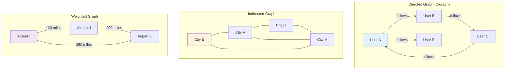
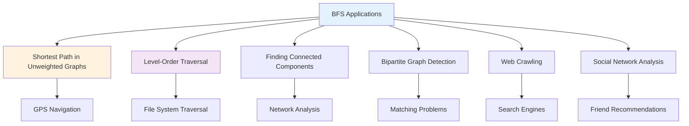
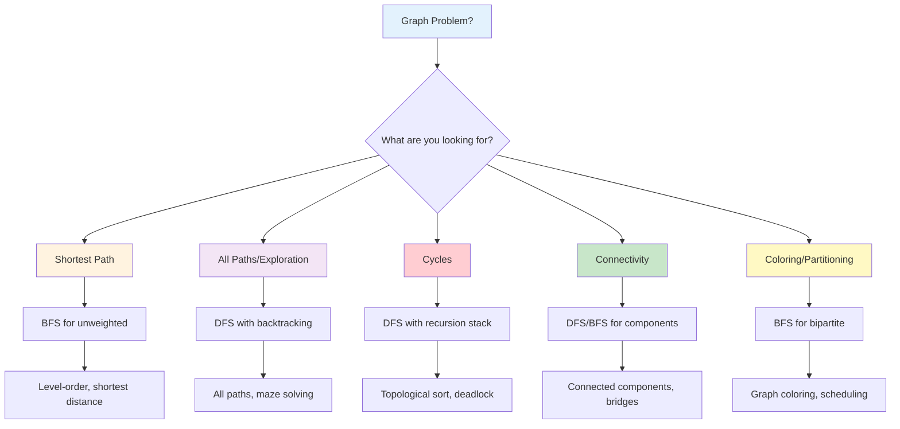

# Mastering Graph Traversal: BFS, DFS, and Cycle Detection Algorithms

*Published on November 10, 2024 • 50 min read*

## Table of Contents
1. [Introduction to Graph Algorithms](#introduction)
2. [Graph Representation](#graph-representation)
3. [Breadth-First Search (BFS)](#breadth-first-search)
4. [Depth-First Search (DFS)](#depth-first-search)
5. [Cycle Detection Algorithms](#cycle-detection)
6. [Advanced Graph Traversal Patterns](#advanced-patterns)
7. [Bidirectional Search](#bidirectional-search)
8. [Graph Coloring and Bipartite Detection](#graph-coloring)
9. [Connected Components](#connected-components)
10. [Problem-Solving Framework](#problem-solving)
11. [Practice Problems](#practice-problems)
12. [Tips and Memory Tricks](#tips-tricks)

## Introduction to Graph Algorithms {#introduction}

Imagine you're planning the **optimal route** through a city, detecting **friendship circles** in social networks, or finding **dependencies** in software projects. All these scenarios involve **graphs** – one of the most powerful and versatile data structures in computer science.

### What Makes Graphs Special?

Unlike linear structures (arrays, linked lists) or hierarchical ones (trees), graphs model **many-to-many relationships**:
- **Social networks**: People connected to multiple friends
- **Transportation**: Cities connected by multiple routes  
- **Web pages**: Links creating complex interconnections
- **Dependencies**: Tasks that depend on multiple prerequisites

### Graph Fundamentals

A graph G = (V, E) consists of:
- **Vertices (V)**: The nodes or entities
- **Edges (E)**: The connections between vertices

### Types of Graphs



### Real-World Applications

1. **Social Media**: Friend suggestions, influence propagation
2. **Navigation Systems**: Route finding, traffic optimization
3. **Compilers**: Dependency resolution, optimization
4. **Biology**: Protein interactions, genetic networks
5. **Internet**: Web crawling, link analysis
6. **Finance**: Risk assessment, transaction networks

## Graph Representation {#graph-representation}

Choosing the right representation affects algorithm efficiency and implementation complexity.

### Adjacency List (Most Common)

```go
type Graph struct {
    vertices int
    adjList  [][]int
}

func NewGraph(vertices int) *Graph {
    return &Graph{
        vertices: vertices,
        adjList:  make([][]int, vertices),
    }
}

func (g *Graph) AddEdge(u, v int) {
    g.adjList[u] = append(g.adjList[u], v)
    // For undirected graph, also add:
    // g.adjList[v] = append(g.adjList[v], u)
}

// Weighted graph with adjacency list
type WeightedGraph struct {
    vertices int
    adjList  [][]Edge
}

type Edge struct {
    to     int
    weight int
}

func (g *WeightedGraph) AddEdge(from, to, weight int) {
    g.adjList[from] = append(g.adjList[from], Edge{to, weight})
}
```

### Adjacency Matrix

```go
type MatrixGraph struct {
    vertices int
    matrix   [][]int
}

func NewMatrixGraph(vertices int) *MatrixGraph {
    matrix := make([][]int, vertices)
    for i := range matrix {
        matrix[i] = make([]int, vertices)
    }
    return &MatrixGraph{vertices, matrix}
}

func (g *MatrixGraph) AddEdge(u, v int) {
    g.matrix[u][v] = 1
    // For undirected: g.matrix[v][u] = 1
}

func (g *MatrixGraph) HasEdge(u, v int) bool {
    return g.matrix[u][v] == 1
}
```

### Edge List (Simple Implementation)

```go
type EdgeListGraph struct {
    vertices int
    edges    [][]int  // Each edge as [from, to] or [from, to, weight]
}

func (g *EdgeListGraph) AddEdge(u, v int) {
    g.edges = append(g.edges, []int{u, v})
}
```

### Representation Comparison

| Operation | Adjacency List | Adjacency Matrix | Edge List |
|-----------|---------------|------------------|-----------|
| Space | O(V + E) | O(V²) | O(E) |
| Add Edge | O(1) | O(1) | O(1) |
| Check Edge | O(degree) | O(1) | O(E) |
| Get Neighbors | O(degree) | O(V) | O(E) |
| Best For | Sparse graphs | Dense graphs, matrix operations | Simple algorithms |

## Breadth-First Search (BFS) {#breadth-first-search}

BFS explores graphs **level by level**, like **ripples spreading** in water. It's perfect for finding shortest paths in unweighted graphs and level-order traversal.

### Core BFS Algorithm

```go
func BFS(graph *Graph, start int) []int {
    if start >= graph.vertices {
        return nil
    }
    
    visited := make([]bool, graph.vertices)
    result := []int{}
    queue := []int{start}
    visited[start] = true
    
    for len(queue) > 0 {
        vertex := queue[0]
        queue = queue[1:]
        result = append(result, vertex)
        
        // Visit all unvisited neighbors
        for _, neighbor := range graph.adjList[vertex] {
            if !visited[neighbor] {
                visited[neighbor] = true
                queue = append(queue, neighbor)
            }
        }
    }
    
    return result
}
```

### BFS with Distance Tracking

```go
func BFSWithDistance(graph *Graph, start int) ([]int, []int) {
    visited := make([]bool, graph.vertices)
    distance := make([]int, graph.vertices)
    result := []int{}
    
    queue := []int{start}
    visited[start] = true
    distance[start] = 0
    
    for len(queue) > 0 {
        vertex := queue[0]
        queue = queue[1:]
        result = append(result, vertex)
        
        for _, neighbor := range graph.adjList[vertex] {
            if !visited[neighbor] {
                visited[neighbor] = true
                distance[neighbor] = distance[vertex] + 1
                queue = append(queue, neighbor)
            }
        }
    }
    
    return result, distance
}
```

### Shortest Path in Unweighted Graph

```go
func ShortestPath(graph *Graph, start, end int) []int {
    if start == end {
        return []int{start}
    }
    
    visited := make([]bool, graph.vertices)
    parent := make([]int, graph.vertices)
    queue := []int{start}
    visited[start] = true
    
    // Initialize parent array
    for i := range parent {
        parent[i] = -1
    }
    
    for len(queue) > 0 {
        vertex := queue[0]
        queue = queue[1:]
        
        for _, neighbor := range graph.adjList[vertex] {
            if !visited[neighbor] {
                visited[neighbor] = true
                parent[neighbor] = vertex
                queue = append(queue, neighbor)
                
                // Found target
                if neighbor == end {
                    return reconstructPath(parent, start, end)
                }
            }
        }
    }
    
    return nil // No path found
}

func reconstructPath(parent []int, start, end int) []int {
    path := []int{}
    current := end
    
    for current != -1 {
        path = append([]int{current}, path...)
        if current == start {
            break
        }
        current = parent[current]
    }
    
    return path
}
```

### Multi-Source BFS

```go
func MultiSourceBFS(graph *Graph, sources []int) []int {
    visited := make([]bool, graph.vertices)
    distance := make([]int, graph.vertices)
    queue := []int{}
    
    // Initialize all sources
    for _, source := range sources {
        queue = append(queue, source)
        visited[source] = true
        distance[source] = 0
    }
    
    for len(queue) > 0 {
        vertex := queue[0]
        queue = queue[1:]
        
        for _, neighbor := range graph.adjList[vertex] {
            if !visited[neighbor] {
                visited[neighbor] = true
                distance[neighbor] = distance[vertex] + 1
                queue = append(queue, neighbor)
            }
        }
    }
    
    return distance
}
```

### BFS for Level-Order Processing

```go
func BFSLevelOrder(graph *Graph, start int) [][]int {
    if start >= graph.vertices {
        return nil
    }
    
    visited := make([]bool, graph.vertices)
    levels := [][]int{}
    queue := []int{start}
    visited[start] = true
    
    for len(queue) > 0 {
        levelSize := len(queue)
        currentLevel := []int{}
        
        // Process all nodes at current level
        for i := 0; i < levelSize; i++ {
            vertex := queue[0]
            queue = queue[1:]
            currentLevel = append(currentLevel, vertex)
            
            // Add neighbors for next level
            for _, neighbor := range graph.adjList[vertex] {
                if !visited[neighbor] {
                    visited[neighbor] = true
                    queue = append(queue, neighbor)
                }
            }
        }
        
        levels = append(levels, currentLevel)
    }
    
    return levels
}
```

### Real-World BFS Applications



## Depth-First Search (DFS) {#depth-first-search}

DFS explores graphs by going **as deep as possible** before backtracking, like **exploring a maze** by following one path until you hit a dead end.

### Recursive DFS

```go
func DFS(graph *Graph, start int, visited []bool, result *[]int) {
    visited[start] = true
    *result = append(*result, start)
    
    for _, neighbor := range graph.adjList[start] {
        if !visited[neighbor] {
            DFS(graph, neighbor, visited, result)
        }
    }
}

func DFSTraversal(graph *Graph, start int) []int {
    visited := make([]bool, graph.vertices)
    result := []int{}
    DFS(graph, start, visited, &result)
    return result
}
```

### Iterative DFS (Using Stack)

```go
func DFSIterative(graph *Graph, start int) []int {
    if start >= graph.vertices {
        return nil
    }
    
    visited := make([]bool, graph.vertices)
    result := []int{}
    stack := []int{start}
    
    for len(stack) > 0 {
        vertex := stack[len(stack)-1]
        stack = stack[:len(stack)-1]
        
        if !visited[vertex] {
            visited[vertex] = true
            result = append(result, vertex)
            
            // Add neighbors in reverse order to maintain left-to-right traversal
            for i := len(graph.adjList[vertex]) - 1; i >= 0; i-- {
                neighbor := graph.adjList[vertex][i]
                if !visited[neighbor] {
                    stack = append(stack, neighbor)
                }
            }
        }
    }
    
    return result
}
```

### DFS with Path Tracking

```go
func DFSAllPaths(graph *Graph, start, end int) [][]int {
    var allPaths [][]int
    var currentPath []int
    visited := make([]bool, graph.vertices)
    
    var dfs func(int)
    dfs = func(vertex int) {
        visited[vertex] = true
        currentPath = append(currentPath, vertex)
        
        if vertex == end {
            // Found a path, make a copy
            path := make([]int, len(currentPath))
            copy(path, currentPath)
            allPaths = append(allPaths, path)
        } else {
            // Continue exploring
            for _, neighbor := range graph.adjList[vertex] {
                if !visited[neighbor] {
                    dfs(neighbor)
                }
            }
        }
        
        // Backtrack
        visited[vertex] = false
        currentPath = currentPath[:len(currentPath)-1]
    }
    
    dfs(start)
    return allPaths
}
```

### DFS with Timestamps (Discovery and Finish)

```go
type DFSResult struct {
    DiscoveryTime []int
    FinishTime    []int
    Parent        []int
}

func DFSWithTimestamps(graph *Graph) *DFSResult {
    visited := make([]bool, graph.vertices)
    discovery := make([]int, graph.vertices)
    finish := make([]int, graph.vertices)
    parent := make([]int, graph.vertices)
    time := 0
    
    // Initialize parent array
    for i := range parent {
        parent[i] = -1
    }
    
    var dfs func(int)
    dfs = func(vertex int) {
        visited[vertex] = true
        time++
        discovery[vertex] = time
        
        for _, neighbor := range graph.adjList[vertex] {
            if !visited[neighbor] {
                parent[neighbor] = vertex
                dfs(neighbor)
            }
        }
        
        time++
        finish[vertex] = time
    }
    
    // Run DFS from all unvisited vertices
    for i := 0; i < graph.vertices; i++ {
        if !visited[i] {
            dfs(i)
        }
    }
    
    return &DFSResult{
        DiscoveryTime: discovery,
        FinishTime:    finish,
        Parent:        parent,
    }
}
```

### DFS for Tree Edge Classification

```go
type EdgeType int

const (
    TreeEdge EdgeType = iota
    BackEdge
    ForwardEdge
    CrossEdge
)

type ClassifiedEdge struct {
    From, To int
    Type     EdgeType
}

func ClassifyEdges(graph *Graph) []ClassifiedEdge {
    visited := make([]bool, graph.vertices)
    discovery := make([]int, graph.vertices)
    finish := make([]int, graph.vertices)
    time := 0
    var edges []ClassifiedEdge
    
    var dfs func(int)
    dfs = func(vertex int) {
        visited[vertex] = true
        time++
        discovery[vertex] = time
        
        for _, neighbor := range graph.adjList[vertex] {
            if !visited[neighbor] {
                // Tree Edge
                edges = append(edges, ClassifiedEdge{vertex, neighbor, TreeEdge})
                dfs(neighbor)
            } else {
                // Classify based on timestamps
                if finish[neighbor] == 0 {
                    // Back Edge (to ancestor)
                    edges = append(edges, ClassifiedEdge{vertex, neighbor, BackEdge})
                } else if discovery[vertex] < discovery[neighbor] {
                    // Forward Edge (to descendant)
                    edges = append(edges, ClassifiedEdge{vertex, neighbor, ForwardEdge})
                } else {
                    // Cross Edge
                    edges = append(edges, ClassifiedEdge{vertex, neighbor, CrossEdge})
                }
            }
        }
        
        time++
        finish[vertex] = time
    }
    
    for i := 0; i < graph.vertices; i++ {
        if !visited[i] {
            dfs(i)
        }
    }
    
    return edges
}
```

## Cycle Detection Algorithms {#cycle-detection}

Detecting cycles is crucial for many applications: deadlock detection, dependency resolution, and graph validation.

### Cycle Detection in Directed Graph (DFS-based)

```go
type CycleDetector struct {
    graph     *Graph
    visited   []bool
    recStack  []bool  // Recursion stack for current path
    hasCycle  bool
    cyclePath []int
}

func DetectCycleDirected(graph *Graph) (bool, []int) {
    detector := &CycleDetector{
        graph:    graph,
        visited:  make([]bool, graph.vertices),
        recStack: make([]bool, graph.vertices),
    }
    
    // Check each component
    for i := 0; i < graph.vertices; i++ {
        if !detector.visited[i] {
            if detector.dfsDirected(i, []int{}) {
                return true, detector.cyclePath
            }
        }
    }
    
    return false, nil
}

func (cd *CycleDetector) dfsDirected(vertex int, path []int) bool {
    cd.visited[vertex] = true
    cd.recStack[vertex] = true
    path = append(path, vertex)
    
    for _, neighbor := range cd.graph.adjList[vertex] {
        if !cd.visited[neighbor] {
            if cd.dfsDirected(neighbor, path) {
                return true
            }
        } else if cd.recStack[neighbor] {
            // Found back edge - cycle detected
            cd.hasCycle = true
            // Extract cycle from path
            cycleStart := -1
            for i, v := range path {
                if v == neighbor {
                    cycleStart = i
                    break
                }
            }
            if cycleStart != -1 {
                cd.cyclePath = append(path[cycleStart:], neighbor)
            }
            return true
        }
    }
    
    cd.recStack[vertex] = false
    return false
}
```

### Cycle Detection in Undirected Graph

```go
func DetectCycleUndirected(graph *Graph) (bool, []int) {
    visited := make([]bool, graph.vertices)
    parent := make([]int, graph.vertices)
    
    // Initialize parent array
    for i := range parent {
        parent[i] = -1
    }
    
    var cyclePath []int
    
    var dfs func(int, int) bool
    dfs = func(vertex, par int) bool {
        visited[vertex] = true
        parent[vertex] = par
        
        for _, neighbor := range graph.adjList[vertex] {
            if !visited[neighbor] {
                if dfs(neighbor, vertex) {
                    return true
                }
            } else if neighbor != par {
                // Found cycle - reconstruct path
                cyclePath = []int{neighbor, vertex}
                current := vertex
                for parent[current] != neighbor && parent[current] != -1 {
                    current = parent[current]
                    cyclePath = append(cyclePath, current)
                }
                cyclePath = append(cyclePath, neighbor)
                return true
            }
        }
        return false
    }
    
    for i := 0; i < graph.vertices; i++ {
        if !visited[i] {
            if dfs(i, -1) {
                return true, cyclePath
            }
        }
    }
    
    return false, nil
}
```

### Union-Find for Cycle Detection

```go
type UnionFind struct {
    parent []int
    rank   []int
}

func NewUnionFind(n int) *UnionFind {
    uf := &UnionFind{
        parent: make([]int, n),
        rank:   make([]int, n),
    }
    
    for i := 0; i < n; i++ {
        uf.parent[i] = i
    }
    
    return uf
}

func (uf *UnionFind) Find(x int) int {
    if uf.parent[x] != x {
        uf.parent[x] = uf.Find(uf.parent[x]) // Path compression
    }
    return uf.parent[x]
}

func (uf *UnionFind) Union(x, y int) bool {
    rootX, rootY := uf.Find(x), uf.Find(y)
    
    if rootX == rootY {
        return false // Same component - would create cycle
    }
    
    // Union by rank
    if uf.rank[rootX] < uf.rank[rootY] {
        uf.parent[rootX] = rootY
    } else if uf.rank[rootX] > uf.rank[rootY] {
        uf.parent[rootY] = rootX
    } else {
        uf.parent[rootY] = rootX
        uf.rank[rootX]++
    }
    
    return true
}

func DetectCycleUnionFind(edges [][]int, vertices int) bool {
    uf := NewUnionFind(vertices)
    
    for _, edge := range edges {
        u, v := edge[0], edge[1]
        if !uf.Union(u, v) {
            return true // Cycle detected
        }
    }
    
    return false
}
```

### Advanced Cycle Detection Patterns

```go
// Floyd's Algorithm for Cycle Detection in Functional Graphs
func FloydCycleDetection(next []int, start int) (bool, int, int) {
    if len(next) == 0 {
        return false, -1, -1
    }
    
    slow, fast := start, start
    
    // Phase 1: Detect if cycle exists
    for {
        slow = next[slow]
        fast = next[next[fast]]
        if slow == fast {
            break
        }
    }
    
    // Phase 2: Find cycle start
    cycleStart := start
    for cycleStart != slow {
        cycleStart = next[cycleStart]
        slow = next[slow]
    }
    
    // Phase 3: Find cycle length
    cycleLength := 1
    current := next[cycleStart]
    for current != cycleStart {
        current = next[current]
        cycleLength++
    }
    
    return true, cycleStart, cycleLength
}

// Detect Negative Cycle using Bellman-Ford approach
func DetectNegativeCycle(graph *WeightedGraph, source int) bool {
    dist := make([]int, graph.vertices)
    
    // Initialize distances
    for i := range dist {
        dist[i] = math.MaxInt32
    }
    dist[source] = 0
    
    // Relax edges V-1 times
    for i := 0; i < graph.vertices-1; i++ {
        for u := 0; u < graph.vertices; u++ {
            if dist[u] == math.MaxInt32 {
                continue
            }
            
            for _, edge := range graph.adjList[u] {
                v, weight := edge.to, edge.weight
                if dist[u]+weight < dist[v] {
                    dist[v] = dist[u] + weight
                }
            }
        }
    }
    
    // Check for negative cycles
    for u := 0; u < graph.vertices; u++ {
        if dist[u] == math.MaxInt32 {
            continue
        }
        
        for _, edge := range graph.adjList[u] {
            v, weight := edge.to, edge.weight
            if dist[u]+weight < dist[v] {
                return true // Negative cycle detected
            }
        }
    }
    
    return false
}
```

## Advanced Graph Traversal Patterns {#advanced-patterns}

### Parallel BFS (Multi-threaded)

```go
import (
    "sync"
    "runtime"
)

func ParallelBFS(graph *Graph, start int) []int {
    visited := make([]bool, graph.vertices)
    visitedMutex := &sync.RWMutex{}
    result := []int{}
    resultMutex := &sync.Mutex{}
    
    queue := []int{start}
    visited[start] = true
    
    for len(queue) > 0 {
        levelSize := len(queue)
        nextLevel := make([]int, 0)
        levelMutex := &sync.Mutex{}
        
        // Process current level in parallel
        numWorkers := min(levelSize, runtime.NumCPU())
        workChan := make(chan int, levelSize)
        var wg sync.WaitGroup
        
        // Start workers
        for i := 0; i < numWorkers; i++ {
            wg.Add(1)
            go func() {
                defer wg.Done()
                for vertex := range workChan {
                    // Process vertex
                    resultMutex.Lock()
                    result = append(result, vertex)
                    resultMutex.Unlock()
                    
                    // Add unvisited neighbors
                    for _, neighbor := range graph.adjList[vertex] {
                        visitedMutex.Lock()
                        if !visited[neighbor] {
                            visited[neighbor] = true
                            levelMutex.Lock()
                            nextLevel = append(nextLevel, neighbor)
                            levelMutex.Unlock()
                        }
                        visitedMutex.Unlock()
                    }
                }
            }()
        }
        
        // Send work to workers
        for _, vertex := range queue {
            workChan <- vertex
        }
        close(workChan)
        
        wg.Wait()
        queue = nextLevel
    }
    
    return result
}

func min(a, b int) int {
    if a < b {
        return a
    }
    return b
}
```

### Bounded DFS (Depth-Limited)

```go
func BoundedDFS(graph *Graph, start, maxDepth int) []int {
    visited := make([]bool, graph.vertices)
    result := []int{}
    
    var dfs func(int, int)
    dfs = func(vertex, depth int) {
        if depth > maxDepth {
            return
        }
        
        visited[vertex] = true
        result = append(result, vertex)
        
        for _, neighbor := range graph.adjList[vertex] {
            if !visited[neighbor] {
                dfs(neighbor, depth+1)
            }
        }
    }
    
    dfs(start, 0)
    return result
}
```

### Iterative Deepening DFS

```go
func IterativeDeepeningDFS(graph *Graph, start, target int) []int {
    for depth := 0; depth < graph.vertices; depth++ {
        visited := make([]bool, graph.vertices)
        path := []int{}
        
        if depthLimitedSearch(graph, start, target, depth, visited, &path) {
            return path
        }
    }
    return nil
}

func depthLimitedSearch(graph *Graph, current, target, depth int, visited []bool, path *[]int) bool {
    *path = append(*path, current)
    visited[current] = true
    
    if current == target {
        return true
    }
    
    if depth <= 0 {
        *path = (*path)[:len(*path)-1]
        visited[current] = false
        return false
    }
    
    for _, neighbor := range graph.adjList[current] {
        if !visited[neighbor] {
            if depthLimitedSearch(graph, neighbor, target, depth-1, visited, path) {
                return true
            }
        }
    }
    
    *path = (*path)[:len(*path)-1]
    visited[current] = false
    return false
}
```

## Bidirectional Search {#bidirectional-search}

Bidirectional search can reduce the search space from O(b^d) to O(b^(d/2)) where b is branching factor and d is depth.

### Bidirectional BFS

```go
func BidirectionalBFS(graph *Graph, start, end int) []int {
    if start == end {
        return []int{start}
    }
    
    // Forward search from start
    visitedForward := make(map[int]int)
    parentForward := make(map[int]int)
    queueForward := []int{start}
    visitedForward[start] = 0
    
    // Backward search from end
    visitedBackward := make(map[int]int)
    parentBackward := make(map[int]int)
    queueBackward := []int{end}
    visitedBackward[end] = 0
    
    for len(queueForward) > 0 || len(queueBackward) > 0 {
        // Expand forward search
        if len(queueForward) > 0 {
            if path := expandSearch(graph, &queueForward, visitedForward, parentForward, visitedBackward, true); path != nil {
                return path
            }
        }
        
        // Expand backward search  
        if len(queueBackward) > 0 {
            if path := expandSearch(graph, &queueBackward, visitedBackward, parentBackward, visitedForward, false); path != nil {
                return path
            }
        }
    }
    
    return nil // No path found
}

func expandSearch(graph *Graph, queue *[]int, visited map[int]int, parent map[int]int, otherVisited map[int]int, isForward bool) []int {
    if len(*queue) == 0 {
        return nil
    }
    
    vertex := (*queue)[0]
    *queue = (*queue)[1:]
    
    for _, neighbor := range graph.adjList[vertex] {
        // Check if we've met the other search
        if _, found := otherVisited[neighbor]; found {
            // Reconstruct path
            if isForward {
                return reconstructBidirectionalPath(parent, map[int]int{}, vertex, neighbor, true)
            } else {
                return reconstructBidirectionalPath(map[int]int{}, parent, neighbor, vertex, false)
            }
        }
        
        // Continue search
        if _, found := visited[neighbor]; !found {
            visited[neighbor] = visited[vertex] + 1
            parent[neighbor] = vertex
            *queue = append(*queue, neighbor)
        }
    }
    
    return nil
}

func reconstructBidirectionalPath(forwardParent, backwardParent map[int]int, meetingPoint, otherPoint int, fromForward bool) []int {
    // Implementation depends on specific meeting point handling
    // This is a simplified version
    path := []int{meetingPoint}
    
    // Add forward path
    current := meetingPoint
    for parent, exists := forwardParent[current]; exists; parent, exists = forwardParent[current] {
        path = append([]int{parent}, path...)
        current = parent
    }
    
    // Add backward path
    current = otherPoint
    for parent, exists := backwardParent[current]; exists; parent, exists = backwardParent[current] {
        path = append(path, parent)
        current = parent
    }
    
    return path
}
```

## Graph Coloring and Bipartite Detection {#graph-coloring}

### Bipartite Graph Detection

```go
func IsBipartite(graph *Graph) bool {
    color := make([]int, graph.vertices)
    
    // Initialize all colors as uncolored (-1)
    for i := range color {
        color[i] = -1
    }
    
    // Check each component
    for i := 0; i < graph.vertices; i++ {
        if color[i] == -1 {
            if !isBipartiteUtil(graph, i, color) {
                return false
            }
        }
    }
    
    return true
}

func isBipartiteUtil(graph *Graph, start int, color []int) bool {
    queue := []int{start}
    color[start] = 0
    
    for len(queue) > 0 {
        vertex := queue[0]
        queue = queue[1:]
        
        for _, neighbor := range graph.adjList[vertex] {
            if color[neighbor] == -1 {
                // Color with opposite color
                color[neighbor] = 1 - color[vertex]
                queue = append(queue, neighbor)
            } else if color[neighbor] == color[vertex] {
                // Same color for adjacent vertices - not bipartite
                return false
            }
        }
    }
    
    return true
}

// DFS version
func IsBipartiteDFS(graph *Graph) bool {
    color := make([]int, graph.vertices)
    for i := range color {
        color[i] = -1
    }
    
    var dfs func(int, int) bool
    dfs = func(vertex, c int) bool {
        color[vertex] = c
        
        for _, neighbor := range graph.adjList[vertex] {
            if color[neighbor] == -1 {
                if !dfs(neighbor, 1-c) {
                    return false
                }
            } else if color[neighbor] == c {
                return false
            }
        }
        
        return true
    }
    
    for i := 0; i < graph.vertices; i++ {
        if color[i] == -1 {
            if !dfs(i, 0) {
                return false
            }
        }
    }
    
    return true
}
```

### Graph Coloring (Greedy Algorithm)

```go
func GreedyColoring(graph *Graph) []int {
    color := make([]int, graph.vertices)
    
    // Initialize all vertices as uncolored
    for i := range color {
        color[i] = -1
    }
    
    // Color first vertex with color 0
    color[0] = 0
    
    // Color remaining vertices
    for u := 1; u < graph.vertices; u++ {
        // Create availability array for colors
        available := make([]bool, graph.vertices)
        for i := range available {
            available[i] = true
        }
        
        // Mark colors of adjacent vertices as unavailable
        for _, neighbor := range graph.adjList[u] {
            if color[neighbor] != -1 {
                available[color[neighbor]] = false
            }
        }
        
        // Find first available color
        for c := 0; c < graph.vertices; c++ {
            if available[c] {
                color[u] = c
                break
            }
        }
    }
    
    return color
}

// Welsh-Powell Algorithm (improved greedy)
func WelshPowellColoring(graph *Graph) []int {
    // Create vertex list sorted by degree (descending)
    type VertexDegree struct {
        vertex int
        degree int
    }
    
    vertices := make([]VertexDegree, graph.vertices)
    for i := 0; i < graph.vertices; i++ {
        vertices[i] = VertexDegree{i, len(graph.adjList[i])}
    }
    
    // Sort by degree (descending)
    sort.Slice(vertices, func(i, j int) bool {
        return vertices[i].degree > vertices[j].degree
    })
    
    color := make([]int, graph.vertices)
    for i := range color {
        color[i] = -1
    }
    
    for _, vd := range vertices {
        u := vd.vertex
        if color[u] != -1 {
            continue
        }
        
        // Find available colors
        available := make([]bool, graph.vertices)
        for i := range available {
            available[i] = true
        }
        
        for _, neighbor := range graph.adjList[u] {
            if color[neighbor] != -1 {
                available[color[neighbor]] = false
            }
        }
        
        // Assign first available color
        for c := 0; c < graph.vertices; c++ {
            if available[c] {
                color[u] = c
                break
            }
        }
    }
    
    return color
}
```

## Connected Components {#connected-components}

### Find All Connected Components

```go
func FindConnectedComponents(graph *Graph) [][]int {
    visited := make([]bool, graph.vertices)
    components := [][]int{}
    
    for i := 0; i < graph.vertices; i++ {
        if !visited[i] {
            component := []int{}
            dfsComponent(graph, i, visited, &component)
            components = append(components, component)
        }
    }
    
    return components
}

func dfsComponent(graph *Graph, vertex int, visited []bool, component *[]int) {
    visited[vertex] = true
    *component = append(*component, vertex)
    
    for _, neighbor := range graph.adjList[vertex] {
        if !visited[neighbor] {
            dfsComponent(graph, neighbor, visited, component)
        }
    }
}

// Using Union-Find
func FindComponentsUnionFind(edges [][]int, vertices int) [][]int {
    uf := NewUnionFind(vertices)
    
    // Process all edges
    for _, edge := range edges {
        uf.Union(edge[0], edge[1])
    }
    
    // Group vertices by root
    componentMap := make(map[int][]int)
    for i := 0; i < vertices; i++ {
        root := uf.Find(i)
        componentMap[root] = append(componentMap[root], i)
    }
    
    // Convert to slice
    components := [][]int{}
    for _, component := range componentMap {
        components = append(components, component)
    }
    
    return components
}
```

### Bridge Detection (Tarjan's Algorithm)

```go
type BridgeFinder struct {
    graph     *Graph
    visited   []bool
    disc      []int  // Discovery time
    low       []int  // Low-link value
    parent    []int
    bridges   [][]int
    time      int
}

func FindBridges(graph *Graph) [][]int {
    bf := &BridgeFinder{
        graph:   graph,
        visited: make([]bool, graph.vertices),
        disc:    make([]int, graph.vertices),
        low:     make([]int, graph.vertices),
        parent:  make([]int, graph.vertices),
        bridges: [][]int{},
        time:    0,
    }
    
    // Initialize parent array
    for i := range bf.parent {
        bf.parent[i] = -1
    }
    
    // Run DFS from all unvisited vertices
    for i := 0; i < graph.vertices; i++ {
        if !bf.visited[i] {
            bf.bridgeUtil(i)
        }
    }
    
    return bf.bridges
}

func (bf *BridgeFinder) bridgeUtil(u int) {
    bf.visited[u] = true
    bf.disc[u] = bf.time
    bf.low[u] = bf.time
    bf.time++
    
    for _, v := range bf.graph.adjList[u] {
        if !bf.visited[v] {
            bf.parent[v] = u
            bf.bridgeUtil(v)
            
            // Update low-link value
            bf.low[u] = min(bf.low[u], bf.low[v])
            
            // Check if edge u-v is a bridge
            if bf.low[v] > bf.disc[u] {
                bf.bridges = append(bf.bridges, []int{u, v})
            }
        } else if v != bf.parent[u] {
            // Back edge
            bf.low[u] = min(bf.low[u], bf.disc[v])
        }
    }
}
```

### Articulation Points (Cut Vertices)

```go
func FindArticulationPoints(graph *Graph) []int {
    visited := make([]bool, graph.vertices)
    disc := make([]int, graph.vertices)
    low := make([]int, graph.vertices)
    parent := make([]int, graph.vertices)
    artPoints := make([]bool, graph.vertices)
    time := 0
    
    // Initialize parent array
    for i := range parent {
        parent[i] = -1
    }
    
    var articulationUtil func(int)
    articulationUtil = func(u int) {
        children := 0
        visited[u] = true
        disc[u] = time
        low[u] = time
        time++
        
        for _, v := range graph.adjList[u] {
            if !visited[v] {
                children++
                parent[v] = u
                articulationUtil(v)
                
                // Update low-link
                low[u] = min(low[u], low[v])
                
                // Check articulation point conditions
                if parent[u] == -1 && children > 1 {
                    // Root with more than one child
                    artPoints[u] = true
                }
                
                if parent[u] != -1 && low[v] >= disc[u] {
                    // Non-root vertex
                    artPoints[u] = true
                }
            } else if v != parent[u] {
                // Back edge
                low[u] = min(low[u], disc[v])
            }
        }
    }
    
    // Run for all components
    for i := 0; i < graph.vertices; i++ {
        if !visited[i] {
            articulationUtil(i)
        }
    }
    
    // Collect articulation points
    result := []int{}
    for i := 0; i < graph.vertices; i++ {
        if artPoints[i] {
            result = append(result, i)
        }
    }
    
    return result
}
```

## Problem-Solving Framework {#problem-solving}

### The Graph Traversal Method

**G**raph representation selection (adjacency list vs matrix)
**R**oute planning (BFS for shortest path, DFS for exploration)
**A**lgorithm choice (iterative vs recursive, cycle detection method)
**P**roblem-specific optimizations (bidirectional, pruning, memoization)
**H**andling disconnected components

### Graph Algorithm Decision Tree



### Pattern Recognition Guide

| Problem Pattern | Key Indicators | Best Approach |
|----------------|---------------|---------------|
| Shortest Path | "minimum steps", "shortest distance" | BFS (unweighted) |
| Path Finding | "find all paths", "maze solving" | DFS with backtracking |
| Cycle Detection | "circular dependency", "deadlock" | DFS with recursion stack |
| Level Processing | "level by level", "generation" | BFS level-order |
| Connected Components | "islands", "groups", "clusters" | DFS/BFS component finding |
| Bipartite Check | "two groups", "alternating", "matching" | BFS/DFS coloring |
| Topological Order | "dependencies", "prerequisites" | DFS + cycle detection |

## Practice Problems by Difficulty {#practice-problems}

### Beginner Level
1. **Number of Islands** (LeetCode 200)
2. **Clone Graph** (LeetCode 133)
3. **Pacific Atlantic Water Flow** (LeetCode 417)
4. **Is Graph Bipartite** (LeetCode 785)
5. **Find if Path Exists in Graph** (LeetCode 1971)

### Intermediate Level
1. **Course Schedule** (LeetCode 207)
2. **Course Schedule II** (LeetCode 210)
3. **Surrounded Regions** (LeetCode 130)
4. **Word Ladder** (LeetCode 127)
5. **Rotting Oranges** (LeetCode 994)

### Advanced Level
1. **Word Ladder II** (LeetCode 126)
2. **Alien Dictionary** (LeetCode 269)
3. **Graph Valid Tree** (LeetCode 261)
4. **Number of Connected Components** (LeetCode 323)
5. **Critical Connections in Network** (LeetCode 1192)

### Expert Level
1. **Reconstruct Itinerary** (LeetCode 332)
2. **Minimum Height Trees** (LeetCode 310)
3. **Accounts Merge** (LeetCode 721)
4. **Similar String Groups** (LeetCode 839)

## Tips and Memory Tricks {#tips-tricks}

### 🧠 Memory Techniques

1. **BFS = Breadth**: "**B**FS **B**ranches **B**efore going deeper"
2. **DFS = Depth**: "**D**FS **D**ives **D**eep before exploring siblings"
3. **Cycle Detection**: "**R**ecursion stack for **D**irected, **P**arent tracking for **U**ndirected"
4. **Bipartite**: "**T**wo **C**olors, **A**djacent **D**ifferent"

### 🔧 Implementation Best Practices

```go
// 1. Always check for empty or invalid graphs
func SafeBFS(graph *Graph, start int) []int {
    if graph == nil || start >= graph.vertices || start < 0 {
        return nil
    }
    // ... rest of BFS
}

// 2. Handle disconnected components
func CompleteTraversal(graph *Graph) [][]int {
    visited := make([]bool, graph.vertices)
    components := [][]int{}
    
    for i := 0; i < graph.vertices; i++ {
        if !visited[i] {
            component := BFSComponent(graph, i, visited)
            components = append(components, component)
        }
    }
    return components
}

// 3. Use appropriate data structures
func BFSWithQueue(graph *Graph, start int) []int {
    // Use slice as queue for simplicity
    queue := []int{start}
    // Use map for O(1) lookup when needed
    visited := make(map[int]bool)
    visited[start] = true
    
    result := []int{}
    
    for len(queue) > 0 {
        vertex := queue[0]
        queue = queue[1:]
        result = append(result, vertex)
        
        for _, neighbor := range graph.adjList[vertex] {
            if !visited[neighbor] {
                visited[neighbor] = true
                queue = append(queue, neighbor)
            }
        }
    }
    
    return result
}

// 4. Optimize for specific use cases
func BFSShortestDistance(graph *Graph, start, end int) int {
    if start == end {
        return 0
    }
    
    visited := make([]bool, graph.vertices)
    queue := [][]int{{start, 0}} // [vertex, distance]
    visited[start] = true
    
    for len(queue) > 0 {
        current := queue[0]
        queue = queue[1:]
        vertex, dist := current[0], current[1]
        
        for _, neighbor := range graph.adjList[vertex] {
            if neighbor == end {
                return dist + 1
            }
            
            if !visited[neighbor] {
                visited[neighbor] = true
                queue = append(queue, []int{neighbor, dist + 1})
            }
        }
    }
    
    return -1 // No path found
}
```

### ⚡ Performance Optimizations

1. **Choose Right Representation**:
   - Adjacency list for sparse graphs (E << V²)
   - Adjacency matrix for dense graphs or frequent edge queries

2. **Early Termination**:
   ```go
   // Stop BFS when target found
   if neighbor == target {
       return reconstructPath(parent, start, target)
   }
   ```

3. **Bidirectional Search**:
   - Use when both start and end are known
   - Reduces search space significantly

4. **Iterative vs Recursive**:
   - Iterative for deep graphs (avoid stack overflow)
   - Recursive for cleaner code when depth is manageable

### 🚨 Common Pitfalls

1. **Forgetting to Mark as Visited**
   ```go
   // Wrong: Can lead to infinite loops
   queue = append(queue, neighbor)
   
   // Right: Mark visited when adding to queue
   if !visited[neighbor] {
       visited[neighbor] = true
       queue = append(queue, neighbor)
   }
   ```

2. **Incorrect Cycle Detection**
   ```go
   // Wrong for directed graphs
   if visited[neighbor] && neighbor != parent {
       return true // This is for undirected graphs only
   }
   
   // Right for directed graphs
   if recStack[neighbor] {
       return true // Check recursion stack
   }
   ```

3. **Not Handling Disconnected Components**
   ```go
   // Wrong: Only explores one component
   return BFS(graph, 0)
   
   // Right: Check all vertices
   for i := 0; i < graph.vertices; i++ {
       if !visited[i] {
           BFS(graph, i)
       }
   }
   ```

4. **Memory Issues with Large Graphs**
   ```go
   // Use bitsets for visited arrays in memory-constrained environments
   type BitSet []uint64
   
   func (bs BitSet) Set(i int) {
       bs[i/64] |= 1 << (i % 64)
   }
   
   func (bs BitSet) IsSet(i int) bool {
       return bs[i/64]&(1<<(i%64)) != 0
   }
   ```

### 🧪 Testing Strategies

```go
func TestGraphTraversal() {
    tests := []struct {
        name     string
        edges    [][]int
        vertices int
        start    int
        expected []int
    }{
        {"empty", [][]int{}, 1, 0, []int{0}},
        {"disconnected", [][]int{{0, 1}, {2, 3}}, 4, 0, []int{0, 1}},
        {"cycle", [][]int{{0, 1}, {1, 2}, {2, 0}}, 3, 0, []int{0, 1, 2}},
    }
    
    for _, tt := range tests {
        graph := NewGraph(tt.vertices)
        for _, edge := range tt.edges {
            graph.AddEdge(edge[0], edge[1])
        }
        
        result := BFS(graph, tt.start)
        if !slicesEqual(result, tt.expected) {
            t.Errorf("%s: got %v, want %v", tt.name, result, tt.expected)
        }
    }
}

func TestCycleDetection() {
    cyclicGraph := NewGraph(3)
    cyclicGraph.AddEdge(0, 1)
    cyclicGraph.AddEdge(1, 2)
    cyclicGraph.AddEdge(2, 0)
    
    hasCycle, _ := DetectCycleDirected(cyclicGraph)
    if !hasCycle {
        t.Error("Expected cycle detection to return true")
    }
}
```

## Conclusion

Graph traversal algorithms form the foundation for solving complex network problems. Master these key concepts:

### Graph Traversal Mastery Checklist:
- ✅ **BFS for shortest paths** in unweighted graphs and level-order processing
- ✅ **DFS for exploration** and finding all possible paths
- ✅ **Cycle detection** using appropriate methods for directed/undirected graphs
- ✅ **Connected components** analysis and graph structure understanding
- ✅ **Bipartite detection** using graph coloring techniques
- ✅ **Advanced patterns** like bidirectional search and parallel processing

### Key Takeaways

1. **BFS guarantees shortest path** in unweighted graphs
2. **DFS is perfect for exploration** and finding all solutions
3. **Cycle detection varies** by graph type (directed vs undirected)
4. **Choose representation wisely** based on graph density
5. **Always handle disconnected components** in real applications

### Real-World Applications Recap

- **Social Networks**: Friend recommendations, influence analysis
- **Navigation**: GPS routing, traffic optimization
- **Dependency Management**: Build systems, task scheduling
- **Network Analysis**: Connectivity, fault tolerance
- **Game Development**: Pathfinding, AI decision trees

Graph traversal demonstrates how systematic exploration enables us to understand and navigate complex relationships in data structures.

**🎉 Phase 4 Started!** We've established the foundation of graph algorithms with traversal techniques. Ready to tackle topological sorting and Union-Find operations next?

---

*Next in series: [Topological Sort & Union Find: Dependency Resolution and Disjoint Set Operations](/blog/dsa/topological-sort-union-find)*