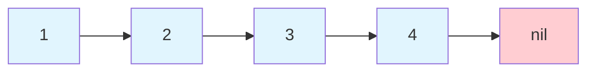
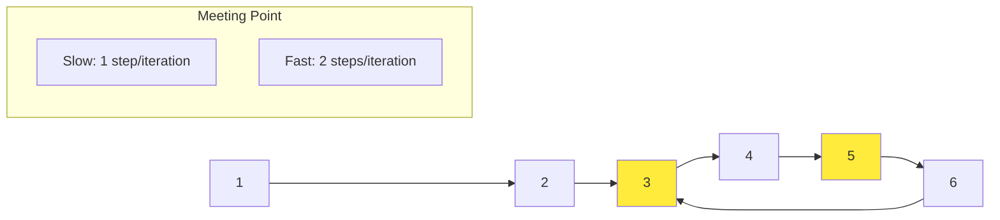
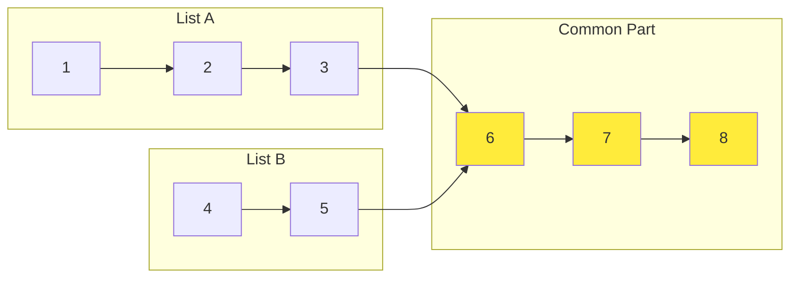

# Mastering Linked Lists: From Fast-Slow Pointers to Complex Manipulations

*Published on November 10, 2024 • 25 min read*

## Table of Contents
1. [Introduction to Linked Lists](#introduction)
2. [Why Linked Lists Matter](#why-matter)  
3. [Fast-Slow Pointer Pattern](#fast-slow-pattern)
4. [List Reversal Patterns](#reversal-patterns)
5. [Merging Linked Lists](#merging-patterns)
6. [Advanced Manipulation Techniques](#advanced-manipulation)
7. [Problem-Solving Framework](#problem-solving)
8. [Practice Problems](#practice-problems)
9. [Tips and Memory Tricks](#tips-tricks)

## Introduction to Linked Lists {#introduction}

Imagine you're organizing a treasure hunt where each clue leads to the next location. You start at point A, which gives you directions to point B, which then points to point C, and so on. This is exactly how a linked list works in computer science – it's a linear data structure where elements (nodes) are stored in sequence, but unlike arrays, they're not stored in contiguous memory locations.

### What Makes Linked Lists Special?

Think of an array as a row of houses on a street with consecutive addresses (1, 2, 3, 4...). You can quickly jump to house number 10 because you know exactly where it is. A linked list, however, is like a series of islands connected by bridges – to reach island 10, you must walk across bridges starting from island 1.

```go
// Basic Node Structure
type ListNode struct {
    Val  int
    Next *ListNode
}

// Creating a simple linked list: 1 -> 2 -> 3 -> nil
func createSampleList() *ListNode {
    head := &ListNode{Val: 1}
    head.Next = &ListNode{Val: 2}
    head.Next.Next = &ListNode{Val: 3}
    return head
}
```

### Visual Representation



## Why Linked Lists Matter in Real World {#why-matter}

### Real-World Applications

1. **Music Playlists**: Each song points to the next song
2. **Browser History**: Previous/next page navigation
3. **Undo Operations**: Each action links to the previous state
4. **Memory Management**: Operating systems use linked lists to manage free memory blocks

### When to Use Linked Lists vs Arrays

| Scenario | Linked List | Array |
|----------|-------------|-------|
| Frequent insertions/deletions | ✅ O(1) if you have the node | ❌ O(n) due to shifting |
| Random access needed | ❌ O(n) traversal required | ✅ O(1) direct indexing |
| Memory usage | ❌ Extra pointer storage | ✅ Contiguous memory |
| Cache performance | ❌ Poor locality | ✅ Excellent locality |

## Fast-Slow Pointer Pattern (Floyd's Algorithm) {#fast-slow-pattern}

### The Concept: Racing on a Circular Track

Imagine two runners on a track – one runs at normal speed, the other runs twice as fast. If the track is circular, the faster runner will eventually lap the slower one. If the track is straight with an end, the faster runner will reach the finish line first.

This is the essence of the fast-slow pointer pattern (also called Floyd's Cycle Detection or the "Tortoise and Hare" algorithm).

### Pattern Implementation

```go
// Fast-Slow pointer template
func hasCycle(head *ListNode) bool {
    if head == nil || head.Next == nil {
        return false
    }
    
    slow, fast := head, head
    
    for fast != nil && fast.Next != nil {
        slow = slow.Next      // Move 1 step
        fast = fast.Next.Next // Move 2 steps
        
        if slow == fast {
            return true // Cycle detected
        }
    }
    
    return false // No cycle
}
```

### Deep Dive: Why This Works

The mathematical proof is elegant:
- Let's say there's a cycle of length `C`
- When slow pointer enters the cycle, fast pointer is already `k` steps ahead
- In each iteration, fast pointer gains 1 step on slow pointer
- They'll meet after `C - k` iterations

### Advanced: Finding Cycle Start Position

```go
func detectCycle(head *ListNode) *ListNode {
    if head == nil || head.Next == nil {
        return nil
    }
    
    // Phase 1: Detect cycle
    slow, fast := head, head
    for fast != nil && fast.Next != nil {
        slow = slow.Next
        fast = fast.Next.Next
        if slow == fast {
            break
        }
    }
    
    // No cycle found
    if fast == nil || fast.Next == nil {
        return nil
    }
    
    // Phase 2: Find cycle start
    // Reset one pointer to head, keep other at meeting point
    slow = head
    for slow != fast {
        slow = slow.Next
        fast = fast.Next // Now move fast pointer 1 step at a time
    }
    
    return slow // This is the start of cycle
}
```

### Visual Understanding: Cycle Detection



### Memory Trick for Fast-Slow Pattern

**"The Tortoise and the Hare"**: 
- Tortoise = Slow pointer (1 step)
- Hare = Fast pointer (2 steps)  
- If there's a loop, the hare will eventually catch up to the tortoise

## List Reversal Patterns {#reversal-patterns}

### The Intuition: Flipping Arrows

Reversing a linked list is like flipping the direction of arrows on a one-way street. You need to:
1. Remember where you came from
2. Change the current arrow's direction
3. Move to the next position

### Basic Reversal (Iterative)

```go
func reverseList(head *ListNode) *ListNode {
    var prev *ListNode
    current := head
    
    for current != nil {
        // Store the next node before we lose it
        next := current.Next
        
        // Reverse the arrow
        current.Next = prev
        
        // Move forward
        prev = current
        current = next
    }
    
    return prev // prev is now the new head
}
```

### Visual Step-by-Step Reversal

```mermaid
graph TB
    subgraph "Original"
        A1[1] --> A2[2] --> A3[3] --> A4[nil]
    end
    
    subgraph "After Step 1"
        B1[nil] <-- B2[1]   B3[2] --> B4[3] --> B5[nil]
    end
    
    subgraph "After Step 2"  
        C1[nil] <-- C2[1] <-- C3[2]   C4[3] --> C5[nil]
    end
    
    subgraph "Final Result"
        D1[nil] <-- D2[1] <-- D3[2] <-- D4[3]
    end
```

### Recursive Reversal (Advanced)

```go
func reverseListRecursive(head *ListNode) *ListNode {
    // Base case
    if head == nil || head.Next == nil {
        return head
    }
    
    // Recursively reverse the rest
    newHead := reverseListRecursive(head.Next)
    
    // Reverse the current connection
    head.Next.Next = head
    head.Next = nil
    
    return newHead
}
```

### Partial Reversal: Reverse Between Positions

A more complex pattern – reversing only a portion of the list.

```go
func reverseBetween(head *ListNode, left int, right int) *ListNode {
    if head == nil || left == right {
        return head
    }
    
    // Create a dummy node to handle edge cases
    dummy := &ListNode{Next: head}
    prevStart := dummy
    
    // Move to the node before the reversal starts
    for i := 1; i < left; i++ {
        prevStart = prevStart.Next
    }
    
    // Start of reversal
    start := prevStart.Next
    
    // Reverse the sublist
    var prev *ListNode = prevStart
    current := start
    
    for i := left; i <= right; i++ {
        next := current.Next
        current.Next = prev
        prev = current
        current = next
    }
    
    // Connect the reversed part back
    prevStart.Next = prev
    start.Next = current
    
    return dummy.Next
}
```

### Memory Trick for Reversal

**"Three-Point Turn"**: Like making a U-turn in a car:
1. **Prev** = Where you came from
2. **Current** = Where you are now  
3. **Next** = Where you're going next

## Merging Linked Lists {#merging-patterns}

### The Concept: Merging Two Sorted Queues

Imagine two queues at a grocery store, each sorted by the number of items customers have. You want to merge them into one queue while maintaining the sorted order. You'd always pick the customer with fewer items from the front of either queue.

### Basic Merge of Two Sorted Lists

```go
func mergeTwoLists(l1 *ListNode, l2 *ListNode) *ListNode {
    // Create a dummy head to simplify logic
    dummy := &ListNode{}
    current := dummy
    
    // Compare and merge
    for l1 != nil && l2 != nil {
        if l1.Val <= l2.Val {
            current.Next = l1
            l1 = l1.Next
        } else {
            current.Next = l2
            l2 = l2.Next
        }
        current = current.Next
    }
    
    // Attach remaining nodes
    if l1 != nil {
        current.Next = l1
    } else {
        current.Next = l2
    }
    
    return dummy.Next
}
```

### Advanced: Merge K Sorted Lists

This is where the real magic happens – merging multiple sorted lists efficiently.

#### Approach 1: Divide and Conquer

```go
func mergeKLists(lists []*ListNode) *ListNode {
    if len(lists) == 0 {
        return nil
    }
    
    // Divide and conquer approach
    for len(lists) > 1 {
        var mergedLists []*ListNode
        
        // Merge pairs of lists
        for i := 0; i < len(lists); i += 2 {
            l1 := lists[i]
            var l2 *ListNode
            if i+1 < len(lists) {
                l2 = lists[i+1]
            }
            mergedLists = append(mergedLists, mergeTwoLists(l1, l2))
        }
        
        lists = mergedLists
    }
    
    return lists[0]
}
```

#### Approach 2: Priority Queue (Heap)

```go
import "container/heap"

type NodeHeap []*ListNode

func (h NodeHeap) Len() int           { return len(h) }
func (h NodeHeap) Less(i, j int) bool { return h[i].Val < h[j].Val }
func (h NodeHeap) Swap(i, j int)      { h[i], h[j] = h[j], h[i] }

func (h *NodeHeap) Push(x interface{}) {
    *h = append(*h, x.(*ListNode))
}

func (h *NodeHeap) Pop() interface{} {
    old := *h
    n := len(old)
    x := old[n-1]
    *h = old[0 : n-1]
    return x
}

func mergeKListsHeap(lists []*ListNode) *ListNode {
    if len(lists) == 0 {
        return nil
    }
    
    // Initialize heap with first node of each list
    h := &NodeHeap{}
    heap.Init(h)
    
    for _, list := range lists {
        if list != nil {
            heap.Push(h, list)
        }
    }
    
    dummy := &ListNode{}
    current := dummy
    
    for h.Len() > 0 {
        // Get the smallest node
        node := heap.Pop(h).(*ListNode)
        current.Next = node
        current = current.Next
        
        // Add the next node from the same list
        if node.Next != nil {
            heap.Push(h, node.Next)
        }
    }
    
    return dummy.Next
}
```

### Complexity Analysis

| Approach | Time Complexity | Space Complexity |
|----------|----------------|------------------|
| Brute Force (merge one by one) | O(k²n) | O(1) |
| Divide & Conquer | O(kn log k) | O(log k) |
| Priority Queue | O(kn log k) | O(k) |

### Memory Trick for Merging

**"Two Checkout Lines"**: Always serve the customer with fewer items first, then move to the next customer in that line.

## Advanced Manipulation Techniques {#advanced-manipulation}

### 1. Finding Middle of Linked List

```go
func findMiddle(head *ListNode) *ListNode {
    slow, fast := head, head
    
    // When fast reaches end, slow will be at middle
    for fast != nil && fast.Next != nil {
        slow = slow.Next
        fast = fast.Next.Next
    }
    
    return slow
}
```

### 2. Removing Nth Node from End

The trick: Use two pointers with a gap of n nodes.

```go
func removeNthFromEnd(head *ListNode, n int) *ListNode {
    dummy := &ListNode{Next: head}
    first, second := dummy, dummy
    
    // Move first pointer n+1 steps ahead
    for i := 0; i <= n; i++ {
        first = first.Next
    }
    
    // Move both pointers until first reaches end
    for first != nil {
        first = first.Next
        second = second.Next
    }
    
    // Remove the nth node from end
    second.Next = second.Next.Next
    
    return dummy.Next
}
```

### 3. Palindrome Check

```go
func isPalindrome(head *ListNode) bool {
    if head == nil || head.Next == nil {
        return true
    }
    
    // Find middle
    slow, fast := head, head
    for fast.Next != nil && fast.Next.Next != nil {
        slow = slow.Next
        fast = fast.Next.Next
    }
    
    // Reverse second half
    secondHalf := reverseList(slow.Next)
    
    // Compare first half with reversed second half
    firstHalf := head
    for secondHalf != nil {
        if firstHalf.Val != secondHalf.Val {
            return false
        }
        firstHalf = firstHalf.Next
        secondHalf = secondHalf.Next
    }
    
    return true
}
```

### 4. Intersection of Two Linked Lists

Beautiful mathematical insight: If two lists intersect, the sum of their lengths from start to intersection is equal.

```go
func getIntersectionNode(headA, headB *ListNode) *ListNode {
    if headA == nil || headB == nil {
        return nil
    }
    
    ptrA, ptrB := headA, headB
    
    // When one reaches end, switch to other list's head
    for ptrA != ptrB {
        if ptrA == nil {
            ptrA = headB
        } else {
            ptrA = ptrA.Next
        }
        
        if ptrB == nil {
            ptrB = headA
        } else {
            ptrB = ptrB.Next
        }
    }
    
    return ptrA // Will be intersection or nil
}
```

### Visual: List Intersection



## Problem-Solving Framework {#problem-solving}

### The CRAFT Method for Linked List Problems

**C**larify the problem
**R**ecognize the pattern
**A**pproach selection
**F**irst solution
**T**est and optimize

### Pattern Recognition Guide

| Problem Type | Key Indicators | Go-To Pattern |
|-------------|---------------|---------------|
| Cycle Detection | "Is there a loop?" | Fast-Slow Pointer |
| Finding Middle | "Get center element" | Fast-Slow Pointer |
| Reversal | "Reverse order" | Three-Pointer Technique |
| Merging | "Combine sorted lists" | Two-Pointer Merge |
| Nth from End | "Remove from end" | Two-Pointer with Gap |

### Common Edge Cases Checklist

```go
// Always handle these cases:
func handleEdgeCases(head *ListNode) {
    // 1. Empty list
    if head == nil {
        return
    }
    
    // 2. Single node
    if head.Next == nil {
        return
    }
    
    // 3. Two nodes (important for reversal)
    if head.Next.Next == nil {
        return
    }
}
```

## Practice Problems by Difficulty {#practice-problems}

### Beginner Level
1. **Reverse Linked List** (LeetCode 206)
2. **Middle of Linked List** (LeetCode 876)  
3. **Delete Node** (LeetCode 237)

### Intermediate Level
1. **Linked List Cycle** (LeetCode 141)
2. **Remove Nth Node From End** (LeetCode 19)
3. **Merge Two Sorted Lists** (LeetCode 21)
4. **Palindrome Linked List** (LeetCode 234)

### Advanced Level
1. **Merge k Sorted Lists** (LeetCode 23)
2. **Reverse Nodes in k-Group** (LeetCode 25)
3. **Copy List with Random Pointer** (LeetCode 138)
4. **LRU Cache** (LeetCode 146)

### Expert Level
1. **Reverse Between** (LeetCode 92)
2. **Reorder List** (LeetCode 143)
3. **Sort List** (LeetCode 148)

## Tips and Memory Tricks {#tips-tricks}

### 🧠 Memory Techniques

1. **Fast-Slow Pointer**: "Tortoise and Hare race"
2. **Reversal**: "Three-point turn in parking"
3. **Merging**: "Two checkout lines at store"
4. **Intersection**: "Two people taking different routes to same destination"

### 🔧 Coding Best Practices

```go
// 1. Always use dummy head for edge cases
dummy := &ListNode{Next: head}

// 2. Check for nil before accessing Next
if node != nil && node.Next != nil {
    // Safe to proceed
}

// 3. Store next before modifying pointers
next := current.Next
current.Next = prev
prev = current
current = next

// 4. Use meaningful variable names
slow, fast := head, head  // Better than p1, p2
```

### ⚡ Performance Tips

1. **Prefer iterative over recursive** for space efficiency
2. **Use dummy nodes** to simplify edge case handling
3. **Single pass when possible** instead of multiple traversals
4. **In-place operations** to minimize space complexity

### 🎯 Problem-Solving Strategies

1. **Draw it out**: Always visualize the problem
2. **Start simple**: Handle basic cases first
3. **Edge cases first**: Empty list, single node, two nodes
4. **Trace through**: Walk through your algorithm step by step

### 🚨 Common Pitfalls

1. **Losing references**: Always store `next` before modifying pointers
2. **Off-by-one errors**: Be careful with loop conditions
3. **Memory leaks**: In languages like C++, remember to free nodes
4. **Null pointer exceptions**: Always check for nil before dereferencing

## Conclusion

Linked lists might seem simple, but they're the foundation of many complex data structures and algorithms. The patterns we've covered – fast-slow pointers, reversal, and merging – appear in countless interview questions and real-world applications.

Remember:
- **Fast-slow pointer** solves cycle detection and middle finding
- **Three-pointer reversal** handles all reversal problems  
- **Merge techniques** work for combining and sorting
- **Always handle edge cases** like empty lists and single nodes

Practice these patterns until they become second nature. The key to mastering linked lists isn't memorizing solutions – it's understanding the underlying patterns and knowing when to apply them.

Ready for the next challenge? Let's move on to **Stacks and Queues** where we'll explore how these linear structures can solve complex problems with elegant patterns!

---

*Next in series: [Stacks & Queues: LIFO and FIFO Patterns Mastery](/blog/dsa/stacks-queues-mastery)*