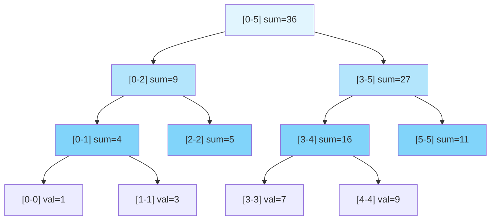
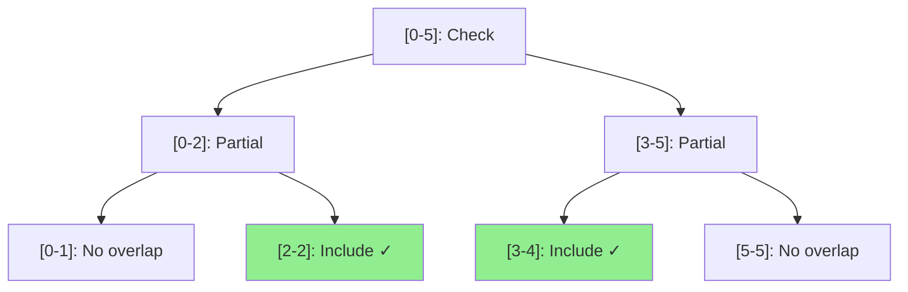

# Segment Tree Fundamentals: Mastering Range Queries and Updates

## Introduction

Imagine you're managing a hotel with 1000 rooms, and you need to answer questions like "What's the lowest room price between rooms 150-300?" or "How many rooms are vacant between floors 5-12?" multiple times per second. A simple array scan would take too long. This is where **segment trees** become your superpower.

A segment tree is a tree data structure that allows you to:
- **Query information over a range** in O(log n) time
- **Update values** in O(log n) time
- Handle operations like sum, min, max, GCD over ranges efficiently

Think of it as a smart way to pre-compute answers for all possible ranges in your data, organized in a tree structure that lets you combine smaller answers to get bigger ones quickly.

### Real-World Analogy 🏢

Think of a corporate hierarchy:
- **CEO** (root) knows the total sales of the entire company
- **Regional Managers** know sales for their regions (left/right subtrees)
- **Store Managers** know sales for individual stores (leaves)

When the CEO asks "What are sales for the Western region?", the Western Regional Manager already has that answer - no need to ask each store. Similarly, segment trees pre-compute range information at each level.

## Table of Contents

1. [Understanding Segment Trees](#understanding-segment-trees)
2. [Core Concepts & Terminology](#core-concepts)
3. [Building a Segment Tree](#building-segment-tree)
4. [Range Query Operations](#range-query)
5. [Point Update Operations](#point-update)
6. [Range Update with Lazy Propagation](#lazy-propagation)
7. [Common Patterns & Problem Types](#common-patterns)
8. [Complete Implementation in Go](#complete-implementation)
9. [Advanced Applications](#advanced-applications)
10. [Tips & Tricks for Interviews](#tips-tricks)
11. [Practice Problems](#practice-problems)

## Understanding Segment Trees {#understanding-segment-trees}

### What Problem Does It Solve?

Let's say you have an array: `[1, 3, 5, 7, 9, 11]`

**Without Segment Tree:**
- Range sum query (index 2-4): Scan 3 elements → O(n) per query
- Update element: Change 1 element → O(1) per update
- For Q queries and U updates: O(Q*n + U) total time

**With Segment Tree:**
- Range sum query: Traverse tree → O(log n) per query
- Update element: Update tree path → O(log n) per update
- For Q queries and U updates: O((Q+U) * log n) total time

For 1 million elements with 1 million queries: **1 trillion operations vs 20 million operations!**

### Visual Structure



**Key Insight:** Each node represents a segment (range) of the array. Internal nodes store aggregated information (sum, min, max) of their children.

## Core Concepts & Terminology {#core-concepts}

### 1. Segment Tree Properties

```go
// Core properties
type SegmentTree struct {
    tree []int      // Tree array storing segment info
    arr  []int      // Original array
    n    int        // Size of original array
    op   func(int, int) int  // Operation (sum, min, max, etc.)
}
```

**Key Properties:**
- **Complete Binary Tree**: Every level is fully filled except possibly the last
- **Size**: For array of size n, tree needs 4*n space (safe upper bound)
- **Height**: log₂(n), ensuring O(log n) operations
- **Index Mapping**: 
  - Parent at index i → Children at 2*i and 2*i+1
  - Child at index i → Parent at i/2

### 2. Segment Representation

Each node represents a segment `[L, R]`:
- **Leaf nodes**: Single element `[i, i]`
- **Internal nodes**: Range `[L, R]` where R > L
- **Left child**: `[L, mid]` where `mid = (L+R)/2`
- **Right child**: `[mid+1, R]`

### 3. Operations Supported

| Operation | Time Complexity | Space Complexity |
|-----------|----------------|------------------|
| Build Tree | O(n) | O(4n) = O(n) |
| Point Query | O(log n) | O(1) |
| Range Query | O(log n) | O(1) |
| Point Update | O(log n) | O(1) |
| Range Update (Lazy) | O(log n) | O(n) |

## Building a Segment Tree {#building-segment-tree}

### The Building Process (Layman's Terms)

Think of building a tournament bracket:
1. **Bottom level**: Individual players (array elements)
2. **Second level**: Winners of pairs
3. **Third level**: Winners of groups of 4
4. **Continue up**: Until you have the overall champion (root)

Each "match" (node) stores the result of combining two children.

### Implementation: Build Function

```go
package segmenttree

import "math"

// SegmentTree structure for range queries
type SegmentTree struct {
    tree []int
    n    int
    op   func(int, int) int
}

// NewSegmentTree creates a new segment tree
// op is the operation to perform (sum, min, max, etc.)
func NewSegmentTree(arr []int, op func(int, int) int) *SegmentTree {
    n := len(arr)
    st := &SegmentTree{
        tree: make([]int, 4*n), // 4*n is safe size for complete binary tree
        n:    n,
        op:   op,
    }
    
    if n > 0 {
        st.build(arr, 0, 0, n-1)
    }
    
    return st
}

// build recursively constructs the segment tree
// node: current position in tree array
// start, end: range [start, end] this node represents
func (st *SegmentTree) build(arr []int, node, start, end int) {
    // Base case: leaf node (single element)
    if start == end {
        st.tree[node] = arr[start]
        return
    }
    
    // Calculate middle point
    mid := start + (end-start)/2
    
    // Recursively build left and right subtrees
    leftChild := 2*node + 1
    rightChild := 2*node + 2
    
    st.build(arr, leftChild, start, mid)     // Left half
    st.build(arr, rightChild, mid+1, end)    // Right half
    
    // Combine results from children
    st.tree[node] = st.op(st.tree[leftChild], st.tree[rightChild])
}

// Common operations
func Sum(a, b int) int { return a + b }
func Min(a, b int) int {
    if a < b {
        return a
    }
    return b
}
func Max(a, b int) int {
    if a > b {
        return a
    }
    return b
}
func GCD(a, b int) int {
    for b != 0 {
        a, b = b, a%b
    }
    return a
}
```

### Build Process Visualization

For array `[1, 3, 5, 7]`:

```
Step 1: Start at root [0,3]
Step 2: Split into [0,1] and [2,3]
Step 3: Split [0,1] into [0,0] and [1,1] (leaves)
Step 4: Split [2,3] into [2,2] and [3,3] (leaves)
Step 5: Combine upwards (sum example)
        [0,0]=1 + [1,1]=3 = [0,1]=4
        [2,2]=5 + [3,3]=7 = [2,3]=12
        [0,1]=4 + [2,3]=12 = [0,3]=16
```

**Memory Tip:** Think "4n" as "four times the array size" - this ensures enough space even with padding in the complete binary tree.

## Range Query Operations {#range-query}

### The Query Strategy (Layman's Terms)

Imagine you want to know the minimum temperature between cities 15-42 in a list of 100 cities:

1. **Complete overlap**: If a segment is completely inside your range [15-42], use its pre-computed value
2. **No overlap**: If a segment is completely outside [15-42], ignore it
3. **Partial overlap**: If a segment partially overlaps, check both children

This divide-and-conquer approach touches only O(log n) nodes!

### Implementation: Range Query

```go
// Query returns the result of operation over range [left, right]
func (st *SegmentTree) Query(left, right int) int {
    if left < 0 || right >= st.n || left > right {
        panic("Invalid query range")
    }
    return st.query(0, 0, st.n-1, left, right)
}

// query is the recursive helper function
// node: current position in tree
// start, end: range this node represents
// left, right: query range
func (st *SegmentTree) query(node, start, end, left, right int) int {
    // Case 1: Complete overlap - [start,end] is completely inside [left,right]
    if left <= start && end <= right {
        return st.tree[node]
    }
    
    // Case 2: No overlap - [start,end] doesn't intersect [left,right]
    if end < left || start > right {
        return st.getIdentity() // Return identity element
    }
    
    // Case 3: Partial overlap - check both children
    mid := start + (end-start)/2
    leftChild := 2*node + 1
    rightChild := 2*node + 2
    
    leftResult := st.query(leftChild, start, mid, left, right)
    rightResult := st.query(rightChild, mid+1, end, left, right)
    
    return st.op(leftResult, rightResult)
}

// getIdentity returns the identity element for the operation
func (st *SegmentTree) getIdentity() int {
    // For sum: 0, for min: MaxInt, for max: MinInt
    // This is a simplified version - in practice, store this with the tree
    return 0 // For sum operation
}
```

### Query Visualization

Query sum for range [1, 3] in array [1, 3, 5, 7, 9, 11]:



**Result:** Include nodes [2-2]=5 and [3-4]=16 → Total = 21

### Pattern Recognition for Queries

**Pattern 1: Full Coverage**
```go
// Query covers entire array
result := st.Query(0, n-1) // Returns tree[0]
```

**Pattern 2: Single Element**
```go
// Query single element
val := st.Query(i, i) // O(log n) but could be O(1) with direct access
```

**Pattern 3: Multiple Disjoint Ranges**
```go
// For multiple ranges, query each separately
total := 0
for _, rng := range ranges {
    total += st.Query(rng.left, rng.right)
}
```

## Point Update Operations {#point-update}

### The Update Strategy (Layman's Terms)

When you update a single element (e.g., room 42 changes price):
1. **Update the leaf** node for that element
2. **Walk up the tree** updating all ancestors
3. Each ancestor recalculates by combining its two children

Only the path from root to leaf needs updating = O(log n) nodes!

### Implementation: Point Update

```go
// Update changes the value at index idx to newVal
func (st *SegmentTree) Update(idx, newVal int) {
    if idx < 0 || idx >= st.n {
        panic("Index out of bounds")
    }
    st.update(0, 0, st.n-1, idx, newVal)
}

// update is the recursive helper
func (st *SegmentTree) update(node, start, end, idx, newVal int) {
    // Base case: reached the leaf node
    if start == end {
        st.tree[node] = newVal
        return
    }
    
    mid := start + (end-start)/2
    leftChild := 2*node + 1
    rightChild := 2*node + 2
    
    // Decide which subtree contains idx
    if idx <= mid {
        st.update(leftChild, start, mid, idx, newVal)
    } else {
        st.update(rightChild, mid+1, end, idx, newVal)
    }
    
    // Update current node by combining children
    st.tree[node] = st.op(st.tree[leftChild], st.tree[rightChild])
}
```

### Update Visualization

Update index 2 to value 10 in array [1, 3, 5, 7]:

```
Initial tree (sum):     [16]
                       /    \
                     [4]    [12]
                    /  \    /  \
                  [1] [3] [5] [7]

After updating arr[2] = 10:
                       [21]  ← Updated: 4 + 17
                       /    \
                     [4]    [17]  ← Updated: 10 + 7
                    /  \    /  \
                  [1] [3] [10] [7]  ← Updated leaf
                              ↑
                          Updated
```

**Pattern:** Only nodes on the path from root to leaf are updated (height = log n).

## Range Update with Lazy Propagation {#lazy-propagation}

### The Problem with Naive Range Updates

Suppose you want to add 5 to all elements in range [100-900]:
- **Naive approach**: Update each element → 800 updates × O(log n) = O(n log n) 😱
- **Smart approach**: Mark the range for update, apply lazily → O(log n) ✅

### Lazy Propagation Concept (Layman's Terms)

Think of it like **postponing homework**:
- Parent tells children "add 5 to all your values"
- Children remember this note but don't do it immediately
- Only when someone asks for their value, they:
  1. Apply the pending update
  2. Pass the note to their children
  3. Answer the query

This is called **lazy propagation** - we delay updates until absolutely necessary!

### Implementation: Lazy Propagation

```go
// SegmentTreeLazy with lazy propagation support
type SegmentTreeLazy struct {
    tree []int  // Tree array
    lazy []int  // Lazy array for pending updates
    n    int
}

// NewSegmentTreeLazy creates a segment tree with lazy propagation
func NewSegmentTreeLazy(arr []int) *SegmentTreeLazy {
    n := len(arr)
    st := &SegmentTreeLazy{
        tree: make([]int, 4*n),
        lazy: make([]int, 4*n),
        n:    n,
    }
    if n > 0 {
        st.buildLazy(arr, 0, 0, n-1)
    }
    return st
}

func (st *SegmentTreeLazy) buildLazy(arr []int, node, start, end int) {
    if start == end {
        st.tree[node] = arr[start]
        return
    }
    mid := start + (end-start)/2
    leftChild := 2*node + 1
    rightChild := 2*node + 2
    
    st.buildLazy(arr, leftChild, start, mid)
    st.buildLazy(arr, rightChild, mid+1, end)
    st.tree[node] = st.tree[leftChild] + st.tree[rightChild]
}

// pushLazy propagates lazy value to children
func (st *SegmentTreeLazy) pushLazy(node, start, end int) {
    if st.lazy[node] == 0 {
        return // No pending update
    }
    
    // Apply pending update to current node
    st.tree[node] += st.lazy[node] * (end - start + 1) // For sum
    
    // If not a leaf, pass update to children
    if start != end {
        st.lazy[2*node+1] += st.lazy[node]
        st.lazy[2*node+2] += st.lazy[node]
    }
    
    // Clear lazy value
    st.lazy[node] = 0
}

// RangeUpdate adds val to all elements in range [left, right]
func (st *SegmentTreeLazy) RangeUpdate(left, right, val int) {
    st.rangeUpdate(0, 0, st.n-1, left, right, val)
}

func (st *SegmentTreeLazy) rangeUpdate(node, start, end, left, right, val int) {
    // Push any pending updates
    st.pushLazy(node, start, end)
    
    // No overlap
    if start > right || end < left {
        return
    }
    
    // Complete overlap
    if left <= start && end <= right {
        st.lazy[node] += val
        st.pushLazy(node, start, end)
        return
    }
    
    // Partial overlap
    mid := start + (end-start)/2
    st.rangeUpdate(2*node+1, start, mid, left, right, val)
    st.rangeUpdate(2*node+2, mid+1, end, left, right, val)
    
    // Update current node
    st.tree[node] = st.tree[2*node+1] + st.tree[2*node+2]
}

// QueryLazy returns sum of range [left, right]
func (st *SegmentTreeLazy) QueryLazy(left, right int) int {
    return st.queryLazy(0, 0, st.n-1, left, right)
}

func (st *SegmentTreeLazy) queryLazy(node, start, end, left, right int) int {
    // Push pending updates first
    st.pushLazy(node, start, end)
    
    // No overlap
    if start > right || end < left {
        return 0
    }
    
    // Complete overlap
    if left <= start && end <= right {
        return st.tree[node]
    }
    
    // Partial overlap
    mid := start + (end-start)/2
    leftSum := st.queryLazy(2*node+1, start, mid, left, right)
    rightSum := st.queryLazy(2*node+2, mid+1, end, left, right)
    
    return leftSum + rightSum
}
```

### Lazy Propagation Visualization

Update range [1-2] by adding 10:

```
Initial:         [16]
                /    \
              [4]    [12]
             /  \    /  \
           [1] [3] [5] [7]

After RangeUpdate(1, 2, 10):
              [36]         ← Updated: 4 + 32
              /    \
           [24]   [12]     ← lazy[left]=10 (not yet pushed down)
           /  \    /  \
         [1] [3] [5] [7]   ← Children not updated yet!

After Query(1, 1):
              [36]
              /    \
           [24]   [12]
           /  \    /  \
         [1] [13] [5] [7]  ← Now [1,1] is updated: 3+10=13
                ↑
              Lazy applied when needed
```

## Common Patterns & Problem Types {#common-patterns}

### Pattern 1: Range Sum Queries

**Problem:** Given an array, answer multiple queries for sum of elements in range [L, R].

```go
func rangeSumQuery(arr []int, queries [][2]int) []int {
    st := NewSegmentTree(arr, Sum)
    results := make([]int, len(queries))
    
    for i, q := range queries {
        results[i] = st.Query(q[0], q[1])
    }
    
    return results
}

// Example
arr := []int{1, 3, 5, 7, 9, 11}
queries := [][2]int{{1, 3}, {0, 2}, {2, 5}}
// Results: [15, 9, 32]
```

### Pattern 2: Range Minimum Query (RMQ)

**Problem:** Find minimum element in range [L, R].

```go
func rangeMinQuery(arr []int, queries [][2]int) []int {
    st := NewSegmentTree(arr, Min)
    results := make([]int, len(queries))
    
    for i, q := range queries {
        results[i] = st.Query(q[0], q[1])
    }
    
    return results
}

// Example: Find minimum in each range
arr := []int{5, 2, 8, 1, 9, 3}
queries := [][2]int{{0, 2}, {1, 4}, {3, 5}}
// Results: [2, 1, 1]
```

### Pattern 3: Range Updates with Queries

**Problem:** Update ranges and query ranges efficiently.

```go
func rangeUpdateQuery(arr []int, updates [][3]int, queries [][2]int) []int {
    st := NewSegmentTreeLazy(arr)
    
    // Process all updates
    for _, upd := range updates {
        left, right, val := upd[0], upd[1], upd[2]
        st.RangeUpdate(left, right, val)
    }
    
    // Process all queries
    results := make([]int, len(queries))
    for i, q := range queries {
        results[i] = st.QueryLazy(q[0], q[1])
    }
    
    return results
}

// Example
arr := []int{1, 2, 3, 4, 5}
updates := [][3]int{{0, 2, 10}, {1, 3, 5}} // [L, R, value]
queries := [][2]int{{0, 4}, {2, 3}}
// After updates: [11, 17, 18, 9, 5]
// Results: [60, 27]
```

### Pattern 4: Finding Maximum Subarray Sum

**Problem:** Find maximum sum of any subarray in range [L, R].

```go
type MaxSubarrayNode struct {
    maxSum    int // Maximum subarray sum
    totalSum  int // Total sum
    prefixSum int // Maximum prefix sum
    suffixSum int // Maximum suffix sum
}

func combineMaxSubarray(left, right MaxSubarrayNode) MaxSubarrayNode {
    return MaxSubarrayNode{
        maxSum: max(left.maxSum, right.maxSum, left.suffixSum+right.prefixSum),
        totalSum: left.totalSum + right.totalSum,
        prefixSum: max(left.prefixSum, left.totalSum+right.prefixSum),
        suffixSum: max(right.suffixSum, right.totalSum+left.suffixSum),
    }
}

func max(nums ...int) int {
    result := nums[0]
    for _, n := range nums[1:] {
        if n > result {
            result = n
        }
    }
    return result
}

// This pattern is useful for problems like:
// - Maximum sum in any subarray of range [L, R]
// - Kadane's algorithm with updates
```

### Pattern 5: Count Elements in Range

**Problem:** Count elements in range [L, R] that satisfy a condition.

```go
type CountNode struct {
    count int
    min   int
    max   int
}

// Count elements greater than threshold in range
func countGreaterThan(arr []int, threshold int, left, right int) int {
    // Build segment tree with count information
    // Query with threshold parameter
    // Use partial overlap to count selectively
    
    // Pseudocode pattern:
    // if node.min > threshold: return entire segment count
    // if node.max <= threshold: return 0
    // else: recurse to children
    return 0 // Implementation left as exercise
}
```

## Complete Implementation in Go {#complete-implementation}

Here's a production-ready, generic segment tree implementation:

```go
package segmenttree

import (
    "fmt"
    "math"
)

// Operation defines a binary operation
type Operation[T any] func(a, b T) T

// SegmentTree generic implementation
type SegmentTree[T any] struct {
    tree     []T
    n        int
    op       Operation[T]
    identity T // Identity element for operation
}

// NewSegmentTree creates a generic segment tree
func NewSegmentTree[T any](arr []T, op Operation[T], identity T) *SegmentTree[T] {
    n := len(arr)
    st := &SegmentTree[T]{
        tree:     make([]T, 4*n),
        n:        n,
        op:       op,
        identity: identity,
    }
    
    if n > 0 {
        st.build(arr, 0, 0, n-1)
    }
    
    return st
}

func (st *SegmentTree[T]) build(arr []T, node, start, end int) {
    if start == end {
        st.tree[node] = arr[start]
        return
    }
    
    mid := start + (end-start)/2
    leftChild := 2*node + 1
    rightChild := 2*node + 2
    
    st.build(arr, leftChild, start, mid)
    st.build(arr, rightChild, mid+1, end)
    
    st.tree[node] = st.op(st.tree[leftChild], st.tree[rightChild])
}

func (st *SegmentTree[T]) Query(left, right int) T {
    if left < 0 || right >= st.n || left > right {
        panic("Invalid range")
    }
    return st.query(0, 0, st.n-1, left, right)
}

func (st *SegmentTree[T]) query(node, start, end, left, right int) T {
    if left <= start && end <= right {
        return st.tree[node]
    }
    
    if end < left || start > right {
        return st.identity
    }
    
    mid := start + (end-start)/2
    leftResult := st.query(2*node+1, start, mid, left, right)
    rightResult := st.query(2*node+2, mid+1, end, left, right)
    
    return st.op(leftResult, rightResult)
}

func (st *SegmentTree[T]) Update(idx int, newVal T) {
    if idx < 0 || idx >= st.n {
        panic("Index out of bounds")
    }
    st.update(0, 0, st.n-1, idx, newVal)
}

func (st *SegmentTree[T]) update(node, start, end, idx int, newVal T) {
    if start == end {
        st.tree[node] = newVal
        return
    }
    
    mid := start + (end-start)/2
    if idx <= mid {
        st.update(2*node+1, start, mid, idx, newVal)
    } else {
        st.update(2*node+2, mid+1, end, idx, newVal)
    }
    
    st.tree[node] = st.op(st.tree[2*node+1], st.tree[2*node+2])
}

// String returns a string representation
func (st *SegmentTree[T]) String() string {
    return fmt.Sprintf("SegmentTree[n=%d]", st.n)
}

// Example usage with different types
func ExampleUsage() {
    // Integer sum tree
    arrInt := []int{1, 3, 5, 7, 9}
    sumTree := NewSegmentTree(arrInt, func(a, b int) int { return a + b }, 0)
    fmt.Println("Sum [1,3]:", sumTree.Query(1, 3)) // 15
    
    // Integer min tree
    minTree := NewSegmentTree(arrInt, Min, math.MaxInt)
    fmt.Println("Min [0,2]:", minTree.Query(0, 2)) // 1
    
    // String concatenation tree
    arrStr := []string{"Hello", " ", "World", "!"}
    strTree := NewSegmentTree(arrStr, 
        func(a, b string) string { return a + b }, "")
    fmt.Println("Concat [0,3]:", strTree.Query(0, 3)) // "Hello World!"
}
```

### Complete Example with Testing

```go
package main

import (
    "fmt"
    "testing"
)

func TestSegmentTreeSum(t *testing.T) {
    arr := []int{1, 3, 5, 7, 9, 11}
    st := NewSegmentTree(arr, Sum, 0)
    
    tests := []struct {
        left, right int
        expected    int
    }{
        {0, 5, 36},  // All elements
        {1, 3, 15},  // [3, 5, 7]
        {2, 4, 21},  // [5, 7, 9]
        {0, 0, 1},   // Single element
        {5, 5, 11},  // Last element
    }
    
    for _, tt := range tests {
        result := st.Query(tt.left, tt.right)
        if result != tt.expected {
            t.Errorf("Query(%d, %d) = %d; want %d", 
                tt.left, tt.right, result, tt.expected)
        }
    }
}

func TestSegmentTreeUpdate(t *testing.T) {
    arr := []int{1, 3, 5, 7, 9}
    st := NewSegmentTree(arr, Sum, 0)
    
    // Initial sum [0,4]
    if sum := st.Query(0, 4); sum != 25 {
        t.Errorf("Initial sum = %d; want 25", sum)
    }
    
    // Update index 2: 5 -> 10
    st.Update(2, 10)
    
    // New sum [0,4] should be 30
    if sum := st.Query(0, 4); sum != 30 {
        t.Errorf("After update sum = %d; want 30", sum)
    }
    
    // Sum [2,2] should be 10
    if val := st.Query(2, 2); val != 10 {
        t.Errorf("Updated value = %d; want 10", val)
    }
}

func BenchmarkSegmentTreeQuery(b *testing.B) {
    size := 100000
    arr := make([]int, size)
    for i := range arr {
        arr[i] = i + 1
    }
    
    st := NewSegmentTree(arr, Sum, 0)
    
    b.ResetTimer()
    for i := 0; i < b.N; i++ {
        st.Query(0, size-1)
    }
}

func BenchmarkSegmentTreeUpdate(b *testing.B) {
    size := 100000
    arr := make([]int, size)
    st := NewSegmentTree(arr, Sum, 0)
    
    b.ResetTimer()
    for i := 0; i < b.N; i++ {
        st.Update(i%size, i)
    }
}
```

## Advanced Applications {#advanced-applications}

### Application 1: Finding Kth Smallest in Range

```go
type CountTree struct {
    *SegmentTree[int]
}

func NewCountTree(maxVal int) *CountTree {
    arr := make([]int, maxVal+1)
    return &CountTree{
        SegmentTree: NewSegmentTree(arr, Sum, 0),
    }
}

// Insert value into the tree
func (ct *CountTree) Insert(val int) {
    current := ct.Query(val, val)
    ct.Update(val, current+1)
}

// FindKth finds kth smallest element
func (ct *CountTree) FindKth(k int) int {
    return ct.findKth(0, 0, ct.n-1, k)
}

func (ct *CountTree) findKth(node, start, end, k int) int {
    if start == end {
        return start
    }
    
    mid := start + (end-start)/2
    leftCount := ct.tree[2*node+1]
    
    if k <= leftCount {
        return ct.findKth(2*node+1, start, mid, k)
    }
    return ct.findKth(2*node+2, mid+1, end, k-leftCount)
}
```

### Application 2: Range GCD Query

```go
// Build GCD segment tree
func buildGCDTree(arr []int) *SegmentTree[int] {
    return NewSegmentTree(arr, GCD, 0)
}

// Query GCD in range
func rangeGCD(arr []int, left, right int) int {
    st := buildGCDTree(arr)
    return st.Query(left, right)
}

// Example
arr := []int{12, 18, 24, 36}
gcd := rangeGCD(arr, 0, 3) // Result: 6
```

### Application 3: 2D Range Sum Queries

```go
// 2D Segment Tree for matrix range sums
type SegmentTree2D struct {
    tree [][]int
    rows, cols int
}

// Build 2D segment tree (conceptual - simplified)
func New2DSegmentTree(matrix [][]int) *SegmentTree2D {
    rows, cols := len(matrix), len(matrix[0])
    st := &SegmentTree2D{
        tree: make([][]int, 4*rows),
        rows: rows,
        cols: cols,
    }
    
    for i := range st.tree {
        st.tree[i] = make([]int, 4*cols)
    }
    
    // Build logic here (each node stores a 1D segment tree)
    return st
}

// Query sum in rectangle (r1,c1) to (r2,c2)
func (st *SegmentTree2D) Query2D(r1, c1, r2, c2 int) int {
    // Query logic for 2D range
    return 0 // Simplified
}
```

### Application 4: Persistent Segment Tree

Useful for **version control** - answer queries about past versions of the array.

```go
type PersistentNode struct {
    left, right *PersistentNode
    value       int
}

type PersistentSegmentTree struct {
    roots []*PersistentNode // One root per version
}

// Each update creates a new version (only O(log n) new nodes!)
func (pst *PersistentSegmentTree) Update(version, idx, val int) int {
    newRoot := pst.updateNode(pst.roots[version], 0, pst.n-1, idx, val)
    pst.roots = append(pst.roots, newRoot)
    return len(pst.roots) - 1 // Return new version number
}

// Query any past version
func (pst *PersistentSegmentTree) QueryVersion(version, left, right int) int {
    return pst.query(pst.roots[version], 0, pst.n-1, left, right)
}
```

## Tips & Tricks for Interviews {#tips-tricks}

### 🧠 Pattern Recognition

**When to use Segment Tree:**
- ✅ Multiple range queries with updates
- ✅ Need O(log n) query AND update
- ✅ Data is in array form
- ✅ Operation is associative (a○(b○c) = (a○b)○c)

**When NOT to use Segment Tree:**
- ❌ Only need prefix sums (use prefix array instead)
- ❌ No updates after initial build (use sparse table)
- ❌ Operation is not associative
- ❌ Need very fast point queries (use array)

### 📝 Memory Tricks

1. **Size Calculation:** Always use `4*n` for tree size - safe and simple
2. **Index Mapping:** 
   - Left child: `2*i + 1`
   - Right child: `2*i + 2`
   - Parent: `(i-1)/2`

3. **Identity Elements:**
   - Sum: `0`
   - Product: `1`
   - Min: `MaxInt`
   - Max: `MinInt`
   - GCD: `0` (gcd(a, 0) = a)

### 🎯 Problem-Solving Template

```go
// Template for segment tree problems
func solveWithSegmentTree(arr []int, queries []Query) []int {
    // Step 1: Identify operation (sum, min, max, etc.)
    operation := func(a, b int) int { /* define */ return a + b }
    identity := 0
    
    // Step 2: Build tree
    st := NewSegmentTree(arr, operation, identity)
    
    // Step 3: Process queries
    results := make([]int, 0)
    for _, q := range queries {
        switch q.typ {
        case "query":
            results = append(results, st.Query(q.left, q.right))
        case "update":
            st.Update(q.idx, q.val)
        }
    }
    
    return results
}
```

### 🚀 Optimization Tips

1. **Iterative vs Recursive:** Iterative builds are faster (no function call overhead)
2. **Lazy Propagation:** Only use when you have range updates
3. **Bottom-Up Build:** Can be faster than top-down recursive
4. **Cache Locality:** Use 1-indexed trees for better cache performance

```go
// Iterative build (faster for large arrays)
func (st *SegmentTree[T]) buildIterative(arr []T) {
    n := len(arr)
    
    // Copy leaves
    for i := 0; i < n; i++ {
        st.tree[n+i] = arr[i]
    }
    
    // Build tree bottom-up
    for i := n - 1; i > 0; i-- {
        st.tree[i] = st.op(st.tree[2*i], st.tree[2*i+1])
    }
}
```

### 🎓 Interview Communication Tips

1. **Start with Brute Force:** Explain O(n) approach first
2. **Identify Bottleneck:** Show why repeated scans are slow
3. **Propose Segment Tree:** Explain the log(n) benefit
4. **Draw Diagram:** Sketch the tree structure
5. **Code Incrementally:** Build, query, then update
6. **Test with Examples:** Use small arrays (4-6 elements)

### 💡 Common Mistakes to Avoid

```go
// ❌ Wrong: Forgetting to handle edge cases
func (st *SegmentTree) Query(left, right int) int {
    return st.query(0, 0, st.n-1, left, right)
}

// ✅ Correct: Validate inputs
func (st *SegmentTree) Query(left, right int) int {
    if left < 0 || right >= st.n || left > right {
        panic("Invalid range")
    }
    return st.query(0, 0, st.n-1, left, right)
}

// ❌ Wrong: Not handling no-overlap correctly
if end < left || start > right {
    return 0 // Might not be correct identity!
}

// ✅ Correct: Return proper identity element
if end < left || start > right {
    return st.identity
}

// ❌ Wrong: Inefficient lazy propagation
func (st *SegmentTreeLazy) pushLazy(node int) {
    // Pushing even when lazy[node] == 0
}

// ✅ Correct: Check before pushing
func (st *SegmentTreeLazy) pushLazy(node, start, end int) {
    if st.lazy[node] == 0 {
        return // Early exit
    }
    // ... rest of push logic
}
```

## Practice Problems {#practice-problems}

### Beginner Level

1. **Range Sum Query - Mutable** (LeetCode 307)
   - Build segment tree for sum
   - Implement query and update

2. **Range Minimum Query** (LeetCode 2286)
   - Build segment tree for min
   - Handle point updates

3. **Count of Smaller Numbers After Self** (LeetCode 315)
   - Use segment tree for counting
   - Process array from right to left

### Intermediate Level

4. **Range Sum Query 2D - Mutable** (LeetCode 308)
   - 2D segment tree
   - Matrix range sums with updates

5. **My Calendar I/II/III** (LeetCode 729/731/732)
   - Segment tree for interval counting
   - Range updates for bookings

6. **Falling Squares** (LeetCode 699)
   - Track maximum height in ranges
   - Coordinate compression

### Advanced Level

7. **Count of Range Sum** (LeetCode 327)
   - Merge sort tree + segment tree
   - Count inversions variant

8. **Rectangle Area II** (LeetCode 850)
   - Sweep line + segment tree
   - Union of rectangles

9. **Number of Longest Increasing Subsequence** (LeetCode 673)
   - Segment tree with custom node
   - Track length and count

### Problem-Solving Strategy

```go
// General approach for segment tree problems

// 1. Identify what to store in nodes
type Node struct {
    value int    // Main value (sum, min, max)
    extra int    // Additional info if needed
}

// 2. Define merge operation
func merge(left, right Node) Node {
    return Node{
        value: left.value + right.value, // Or min, max, etc.
        extra: /* combine extra info */,
    }
}

// 3. Implement with clear structure
func solveSegmentTreeProblem(input []int) int {
    // Parse and preprocess
    // Build tree
    // Process queries/updates
    // Return result
    return 0
}
```

## Conclusion

Segment trees are powerful data structures that transform slow O(n) range queries into blazing O(log n) operations. The key insights:

1. **Tree Structure:** Pre-compute range information at every level
2. **Logarithmic Height:** Only log(n) nodes on any root-to-leaf path
3. **Lazy Propagation:** Postpone updates until necessary for efficiency
4. **Versatility:** Works with any associative operation (sum, min, max, GCD)

### Quick Reference Card

| Feature | Time | Space | When to Use |
|---------|------|-------|-------------|
| Build | O(n) | O(4n) | Initial setup |
| Point Query | O(log n) | O(1) | Get single value |
| Range Query | O(log n) | O(1) | Sum/min/max over range |
| Point Update | O(log n) | O(1) | Change one element |
| Range Update | O(log n) | O(n) | Update range (lazy) |

### Next Steps

- Practice with **LeetCode** segment tree problems
- Learn **Fenwick Trees** (Binary Indexed Trees) for simpler cases
- Explore **Persistent Segment Trees** for version control
- Study **2D Segment Trees** for matrix problems
- Understand **Lazy Propagation** edge cases thoroughly

Remember: Segment trees are all about **pre-computing smart answers** so you can combine them quickly later. Master this pattern, and you'll solve range query problems with confidence! 🚀

---

**Series Navigation:**
- Previous: [DP Optimization Techniques](./dp-optimization-techniques)
- Next: [Fenwick Tree Fundamentals](./fenwick-tree-fundamentals)

**Related Topics:**
- [Binary Indexed Tree](./fenwick-tree-fundamentals)
- [Sparse Table](./sparse-table)
- [Square Root Decomposition](./sqrt-decomposition)
