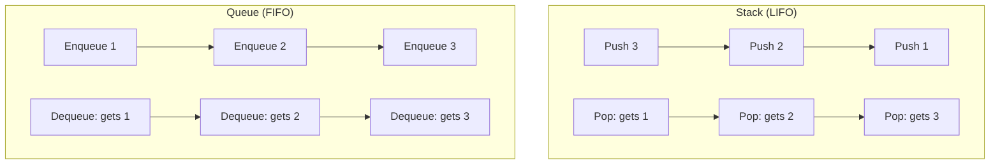
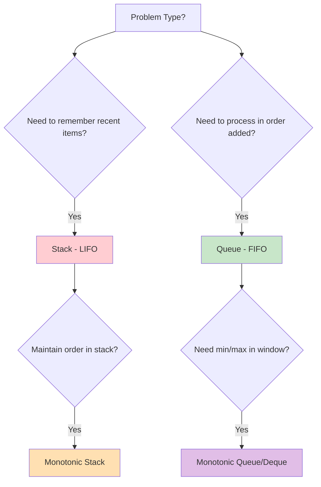

# Mastering Stacks & Queues: LIFO and FIFO Patterns for Problem Solving

*Published on November 10, 2024 • 30 min read*

## Table of Contents
1. [Introduction to Stacks and Queues](#introduction)
2. [Understanding LIFO vs FIFO](#lifo-fifo)
3. [Stack Patterns and Applications](#stack-patterns)
4. [Queue Patterns and Applications](#queue-patterns)
5. [Advanced Stack Techniques](#advanced-stack)
6. [Advanced Queue Techniques](#advanced-queue)
7. [Monotonic Stack and Queue](#monotonic)
8. [Problem-Solving Framework](#problem-solving)
9. [Practice Problems](#practice-problems)
10. [Tips and Memory Tricks](#tips-tricks)

## Introduction to Stacks and Queues {#introduction}

Imagine you're at a cafeteria during lunch rush. There are two serving systems:

1. **Stack of Plates**: You take from the top, add to the top (Last In, First Out - LIFO)
2. **Queue of Students**: First person in line gets served first (First In, First Out - FIFO)

These everyday examples perfectly illustrate two of the most fundamental data structures in computer science: **Stacks** and **Queues**. While they might seem simple, they're incredibly powerful tools for solving complex algorithmic problems.

### Why These Structures Matter

Stacks and queues aren't just academic concepts – they're everywhere:
- **Browser back button** (Stack)
- **Print job scheduling** (Queue)  
- **Function call management** (Stack)
- **CPU task scheduling** (Queue)
- **Undo operations** (Stack)
- **Breadth-first search** (Queue)

## Understanding LIFO vs FIFO {#lifo-fifo}

### Stack (LIFO - Last In, First Out)

Think of a stack of books on your desk. The last book you put on top is the first one you'll take off.

```go
type Stack struct {
    items []int
}

func (s *Stack) Push(item int) {
    s.items = append(s.items, item)
}

func (s *Stack) Pop() (int, bool) {
    if len(s.items) == 0 {
        return 0, false // Empty stack
    }
    index := len(s.items) - 1
    item := s.items[index]
    s.items = s.items[:index]
    return item, true
}

func (s *Stack) Peek() (int, bool) {
    if len(s.items) == 0 {
        return 0, false
    }
    return s.items[len(s.items)-1], true
}

func (s *Stack) IsEmpty() bool {
    return len(s.items) == 0
}
```

### Queue (FIFO - First In, First Out)

Think of a line at the bank. The first person to join the line is the first person to be served.

```go
type Queue struct {
    items []int
}

func (q *Queue) Enqueue(item int) {
    q.items = append(q.items, item)
}

func (q *Queue) Dequeue() (int, bool) {
    if len(q.items) == 0 {
        return 0, false // Empty queue
    }
    item := q.items[0]
    q.items = q.items[1:]
    return item, true
}

func (q *Queue) Front() (int, bool) {
    if len(q.items) == 0 {
        return 0, false
    }
    return q.items[0], true
}

func (q *Queue) IsEmpty() bool {
    return len(q.items) == 0
}
```

### Visual Comparison



## Stack Patterns and Applications {#stack-patterns}

### Pattern 1: Parentheses Matching

**Real-world analogy**: Checking if brackets in mathematical expressions are balanced, like ensuring every opening parenthesis has a matching closing one.

```go
func isValidParentheses(s string) bool {
    stack := []rune{}
    
    // Map of closing to opening brackets
    pairs := map[rune]rune{
        ')': '(',
        '}': '{',
        ']': '[',
    }
    
    for _, char := range s {
        switch char {
        case '(', '{', '[':
            // Push opening bracket
            stack = append(stack, char)
        case ')', '}', ']':
            // Check if stack is empty or doesn't match
            if len(stack) == 0 || stack[len(stack)-1] != pairs[char] {
                return false
            }
            // Pop matching opening bracket
            stack = stack[:len(stack)-1]
        }
    }
    
    return len(stack) == 0
}

// Example usage
func main() {
    fmt.Println(isValidParentheses("()[]{}"))     // true
    fmt.Println(isValidParentheses("([)]"))       // false
    fmt.Println(isValidParentheses("{[()]}"))     // true
}
```

### Pattern 2: Daily Temperatures (Next Greater Element)

**Problem**: Given daily temperatures, find how many days you have to wait for a warmer temperature.

**Intuition**: Use a stack to keep track of days waiting for warmer weather. When we find a warmer day, resolve all previous cooler days.

```go
func dailyTemperatures(temperatures []int) []int {
    n := len(temperatures)
    result := make([]int, n)
    stack := []int{} // Stack stores indices
    
    for i, temp := range temperatures {
        // While stack not empty and current temp > temp at stack top
        for len(stack) > 0 && temp > temperatures[stack[len(stack)-1]] {
            prevIndex := stack[len(stack)-1]
            stack = stack[:len(stack)-1]
            result[prevIndex] = i - prevIndex
        }
        stack = append(stack, i)
    }
    
    return result
}

// Example: [73,74,75,71,69,72,76,73]
// Result:  [1, 1, 4, 2, 1, 1, 0, 0]
```

### Pattern 3: Evaluate Postfix Expression

**Real-world analogy**: Calculator that processes operations in postfix notation (like old HP calculators).

```go
func evaluatePostfix(tokens []string) int {
    stack := []int{}
    
    for _, token := range tokens {
        switch token {
        case "+":
            b, a := stack[len(stack)-1], stack[len(stack)-2]
            stack = stack[:len(stack)-2]
            stack = append(stack, a+b)
        case "-":
            b, a := stack[len(stack)-1], stack[len(stack)-2]
            stack = stack[:len(stack)-2]
            stack = append(stack, a-b)
        case "*":
            b, a := stack[len(stack)-1], stack[len(stack)-2]
            stack = stack[:len(stack)-2]
            stack = append(stack, a*b)
        case "/":
            b, a := stack[len(stack)-1], stack[len(stack)-2]
            stack = stack[:len(stack)-2]
            stack = append(stack, a/b)
        default:
            // It's a number
            num, _ := strconv.Atoi(token)
            stack = append(stack, num)
        }
    }
    
    return stack[0]
}

// Example: ["2","1","+","3","*"] -> ((2+1)*3) = 9
```

### Pattern 4: Min Stack

**Problem**: Design a stack that supports push, pop, top, and retrieving minimum element in O(1).

```go
type MinStack struct {
    stack    []int
    minStack []int
}

func Constructor() MinStack {
    return MinStack{
        stack:    []int{},
        minStack: []int{},
    }
}

func (ms *MinStack) Push(val int) {
    ms.stack = append(ms.stack, val)
    
    // Update min stack
    if len(ms.minStack) == 0 || val <= ms.minStack[len(ms.minStack)-1] {
        ms.minStack = append(ms.minStack, val)
    }
}

func (ms *MinStack) Pop() {
    if len(ms.stack) == 0 {
        return
    }
    
    val := ms.stack[len(ms.stack)-1]
    ms.stack = ms.stack[:len(ms.stack)-1]
    
    // Update min stack if necessary
    if val == ms.minStack[len(ms.minStack)-1] {
        ms.minStack = ms.minStack[:len(ms.minStack)-1]
    }
}

func (ms *MinStack) Top() int {
    return ms.stack[len(ms.stack)-1]
}

func (ms *MinStack) GetMin() int {
    return ms.minStack[len(ms.minStack)-1]
}
```

## Queue Patterns and Applications {#queue-patterns}

### Pattern 1: Binary Tree Level Order Traversal (BFS)

**Real-world analogy**: Visiting all floors of a building level by level, from ground floor up.

```go
type TreeNode struct {
    Val   int
    Left  *TreeNode
    Right *TreeNode
}

func levelOrder(root *TreeNode) [][]int {
    if root == nil {
        return [][]int{}
    }
    
    var result [][]int
    queue := []*TreeNode{root}
    
    for len(queue) > 0 {
        levelSize := len(queue)
        var currentLevel []int
        
        // Process all nodes at current level
        for i := 0; i < levelSize; i++ {
            node := queue[0]
            queue = queue[1:]
            
            currentLevel = append(currentLevel, node.Val)
            
            // Add children to queue for next level
            if node.Left != nil {
                queue = append(queue, node.Left)
            }
            if node.Right != nil {
                queue = append(queue, node.Right)
            }
        }
        
        result = append(result, currentLevel)
    }
    
    return result
}
```

### Pattern 2: Sliding Window Maximum

**Problem**: Find the maximum element in each sliding window of size k.

**Approach**: Use a deque (double-ended queue) to maintain elements in decreasing order.

```go
func maxSlidingWindow(nums []int, k int) []int {
    if len(nums) == 0 || k == 0 {
        return []int{}
    }
    
    deque := []int{}  // Stores indices
    result := []int{}
    
    for i, num := range nums {
        // Remove elements outside window
        for len(deque) > 0 && deque[0] <= i-k {
            deque = deque[1:]
        }
        
        // Remove smaller elements from back
        for len(deque) > 0 && nums[deque[len(deque)-1]] <= num {
            deque = deque[:len(deque)-1]
        }
        
        deque = append(deque, i)
        
        // Add to result if window is formed
        if i >= k-1 {
            result = append(result, nums[deque[0]])
        }
    }
    
    return result
}

// Example: nums = [1,3,-1,-3,5,3,6,7], k = 3
// Result:  [3,3,5,5,6,7]
```

### Pattern 3: Task Scheduling

**Problem**: Schedule tasks with cooldown periods efficiently.

```go
func leastInterval(tasks []byte, n int) int {
    // Count frequency of each task
    freq := make(map[byte]int)
    maxFreq := 0
    
    for _, task := range tasks {
        freq[task]++
        if freq[task] > maxFreq {
            maxFreq = freq[task]
        }
    }
    
    // Count tasks with maximum frequency
    maxFreqCount := 0
    for _, f := range freq {
        if f == maxFreq {
            maxFreqCount++
        }
    }
    
    // Calculate minimum time needed
    partCount := maxFreq - 1
    partLength := n - (maxFreqCount - 1)
    emptySlots := partCount * partLength
    availableTasks := len(tasks) - maxFreq*maxFreqCount
    idles := max(0, emptySlots-availableTasks)
    
    return len(tasks) + idles
}

func max(a, b int) int {
    if a > b {
        return a
    }
    return b
}
```

## Advanced Stack Techniques {#advanced-stack}

### 1. Largest Rectangle in Histogram

**Problem**: Find the area of the largest rectangle in a histogram.

**Key Insight**: For each bar, find the previous and next smaller elements using a stack.

```go
func largestRectangleArea(heights []int) int {
    stack := []int{} // Stack of indices
    maxArea := 0
    
    for i, height := range heights {
        // While stack not empty and current height < stack top height
        for len(stack) > 0 && height < heights[stack[len(stack)-1]] {
            h := heights[stack[len(stack)-1]]
            stack = stack[:len(stack)-1]
            
            width := i
            if len(stack) > 0 {
                width = i - stack[len(stack)-1] - 1
            }
            
            area := h * width
            maxArea = max(maxArea, area)
        }
        stack = append(stack, i)
    }
    
    // Process remaining elements
    for len(stack) > 0 {
        h := heights[stack[len(stack)-1]]
        stack = stack[:len(stack)-1]
        
        width := len(heights)
        if len(stack) > 0 {
            width = len(heights) - stack[len(stack)-1] - 1
        }
        
        area := h * width
        maxArea = max(maxArea, area)
    }
    
    return maxArea
}
```

### 2. Trapping Rain Water

**Problem**: Calculate how much rainwater can be trapped after raining.

```go
func trap(height []int) int {
    if len(height) == 0 {
        return 0
    }
    
    stack := []int{} // Stack of indices
    water := 0
    
    for i, h := range height {
        for len(stack) > 0 && h > height[stack[len(stack)-1]] {
            top := stack[len(stack)-1]
            stack = stack[:len(stack)-1]
            
            if len(stack) == 0 {
                break
            }
            
            distance := i - stack[len(stack)-1] - 1
            boundedHeight := min(h, height[stack[len(stack)-1]]) - height[top]
            water += distance * boundedHeight
        }
        stack = append(stack, i)
    }
    
    return water
}

func min(a, b int) int {
    if a < b {
        return a
    }
    return b
}
```

## Advanced Queue Techniques {#advanced-queue}

### 1. Design Hit Counter

**Problem**: Design a hit counter that counts hits in the past 5 minutes.

```go
type HitCounter struct {
    times []int
    hits  []int
}

func Constructor() HitCounter {
    return HitCounter{
        times: make([]int, 300),  // 5 minutes * 60 seconds
        hits:  make([]int, 300),
    }
}

func (hc *HitCounter) Hit(timestamp int) {
    index := timestamp % 300
    if hc.times[index] != timestamp {
        hc.times[index] = timestamp
        hc.hits[index] = 1
    } else {
        hc.hits[index]++
    }
}

func (hc *HitCounter) GetHits(timestamp int) int {
    total := 0
    for i := 0; i < 300; i++ {
        if timestamp-hc.times[i] < 300 {
            total += hc.hits[i]
        }
    }
    return total
}
```

### 2. Implement Queue using Stacks

**Problem**: Implement a queue using only stack operations.

```go
type MyQueue struct {
    input  []int
    output []int
}

func Constructor() MyQueue {
    return MyQueue{
        input:  []int{},
        output: []int{},
    }
}

func (q *MyQueue) Push(x int) {
    q.input = append(q.input, x)
}

func (q *MyQueue) Pop() int {
    q.Peek()
    val := q.output[len(q.output)-1]
    q.output = q.output[:len(q.output)-1]
    return val
}

func (q *MyQueue) Peek() int {
    if len(q.output) == 0 {
        // Transfer all elements from input to output
        for len(q.input) > 0 {
            val := q.input[len(q.input)-1]
            q.input = q.input[:len(q.input)-1]
            q.output = append(q.output, val)
        }
    }
    return q.output[len(q.output)-1]
}

func (q *MyQueue) Empty() bool {
    return len(q.input) == 0 && len(q.output) == 0
}
```

## Monotonic Stack and Queue {#monotonic}

### Monotonic Stack

A monotonic stack maintains elements in either increasing or decreasing order. It's perfect for "next greater/smaller element" problems.

```go
// Next greater element to the right
func nextGreaterElements(nums []int) []int {
    n := len(nums)
    result := make([]int, n)
    stack := []int{} // Monotonic decreasing stack (indices)
    
    // Initialize result with -1
    for i := range result {
        result[i] = -1
    }
    
    // Process array twice for circular array
    for i := 0; i < 2*n; i++ {
        curr := nums[i%n]
        
        // Pop elements smaller than current
        for len(stack) > 0 && nums[stack[len(stack)-1]] < curr {
            idx := stack[len(stack)-1]
            stack = stack[:len(stack)-1]
            if result[idx] == -1 {
                result[idx] = curr
            }
        }
        
        if i < n {
            stack = append(stack, i)
        }
    }
    
    return result
}
```

### Monotonic Queue (Deque)

Perfect for sliding window problems where we need min/max in each window.

```go
type MonotonicQueue struct {
    deque []int
    nums  []int
}

func NewMonotonicQueue(nums []int) *MonotonicQueue {
    return &MonotonicQueue{
        deque: []int{},
        nums:  nums,
    }
}

// Add element, maintain decreasing order for max queue
func (mq *MonotonicQueue) Push(i int) {
    // Remove elements smaller than current from back
    for len(mq.deque) > 0 && mq.nums[mq.deque[len(mq.deque)-1]] <= mq.nums[i] {
        mq.deque = mq.deque[:len(mq.deque)-1]
    }
    mq.deque = append(mq.deque, i)
}

// Remove element from front if it's outside window
func (mq *MonotonicQueue) Pop(i int) {
    if len(mq.deque) > 0 && mq.deque[0] == i {
        mq.deque = mq.deque[1:]
    }
}

// Get maximum element in current window
func (mq *MonotonicQueue) Max() int {
    return mq.nums[mq.deque[0]]
}
```

## Problem-Solving Framework {#problem-solving}

### The STACK Method for Stack Problems

**S**imulate the process
**T**rack what you need to remember
**A**nalyze the order (LIFO nature)
**C**onsider edge cases
**K**eep it simple

### The QUEUE Method for Queue Problems

**Q**ueue up elements in order
**U**nderstand FIFO processing
**E**nsure level-by-level processing
**U**se BFS when exploring
**E**xamine sliding window patterns

### Pattern Recognition Guide

| Problem Pattern | Key Indicators | Data Structure |
|----------------|---------------|----------------|
| Bracket Matching | Nested structures | Stack |
| Expression Evaluation | Operators, precedence | Stack |
| Next Greater/Smaller | Array scanning | Monotonic Stack |
| Level Order Traversal | Tree/graph by levels | Queue |
| Sliding Window Max/Min | Window + min/max | Monotonic Queue |
| Task Scheduling | FIFO with conditions | Queue |

### Visual Decision Tree



## Practice Problems by Difficulty {#practice-problems}

### Beginner Level (Stack)
1. **Valid Parentheses** (LeetCode 20)
2. **Implement Stack using Queues** (LeetCode 225)
3. **Baseball Game** (LeetCode 682)

### Beginner Level (Queue)
1. **Implement Queue using Stacks** (LeetCode 232)
2. **Number of Recent Calls** (LeetCode 933)
3. **Design Circular Queue** (LeetCode 622)

### Intermediate Level (Stack)
1. **Daily Temperatures** (LeetCode 739)
2. **Min Stack** (LeetCode 155)
3. **Evaluate Reverse Polish Notation** (LeetCode 150)
4. **Next Greater Element** (LeetCode 496)

### Intermediate Level (Queue)
1. **Binary Tree Level Order Traversal** (LeetCode 102)
2. **Rotting Oranges** (LeetCode 994)
3. **Moving Average from Data Stream** (LeetCode 346)

### Advanced Level (Stack)
1. **Largest Rectangle in Histogram** (LeetCode 84)
2. **Trapping Rain Water** (LeetCode 42)
3. **Maximal Rectangle** (LeetCode 85)
4. **Remove Duplicate Letters** (LeetCode 316)

### Advanced Level (Queue)
1. **Sliding Window Maximum** (LeetCode 239)
2. **Task Scheduler** (LeetCode 621)
3. **Design Hit Counter** (LeetCode 362)
4. **Shortest Path in Binary Matrix** (LeetCode 1091)

### Expert Level
1. **Basic Calculator** (LeetCode 224)
2. **Maximum Frequency Stack** (LeetCode 895)
3. **Jump Game VI** (LeetCode 1696)
4. **Constrained Subsequence Sum** (LeetCode 1425)

## Tips and Memory Tricks {#tips-tricks}

### 🧠 Memory Techniques

1. **Stack = Cafeteria Plates**: Last plate placed is first taken
2. **Queue = Bank Line**: First person in line is first served
3. **Monotonic Stack = "Bouncer at Club"**: Only lets in people taller than everyone inside
4. **BFS with Queue = "Ripples in Pond"**: Expand level by level

### 🔧 Implementation Tips

```go
// Stack tips
type Stack []int

func (s *Stack) Push(v int) { *s = append(*s, v) }
func (s *Stack) Pop() int   { 
    old := *s
    v := old[len(old)-1]
    *s = old[:len(old)-1]
    return v
}
func (s *Stack) Peek() int  { return (*s)[len(*s)-1] }
func (s *Stack) Empty() bool { return len(*s) == 0 }

// Queue tips - use slice efficiently
type Queue []int

func (q *Queue) Enqueue(v int) { *q = append(*q, v) }
func (q *Queue) Dequeue() int  {
    old := *q
    v := old[0]
    *q = old[1:]
    return v
}
```

### ⚡ Performance Optimizations

1. **Pre-allocate slices** when size is known
2. **Use deque for better queue performance** in production
3. **Consider circular buffer** for fixed-size queues
4. **Batch operations** when possible

### 🎯 Problem-Solving Strategies

#### For Stack Problems:
1. **Think about what you need to "remember"**
2. **Consider if order matters** (usually recent first)
3. **Look for nested/recursive patterns**
4. **Check if you need to maintain some property**

#### For Queue Problems:
1. **Think about processing order** (first come, first served)
2. **Look for level-by-level patterns**
3. **Consider if it's a simulation problem**
4. **Check for sliding window patterns**

### 🚨 Common Pitfalls

1. **Empty structure checks**: Always verify before popping/dequeuing
2. **Index out of bounds**: Especially with slice-based implementations
3. **Memory leaks**: In languages with manual memory management
4. **Circular queue edge cases**: Full vs empty conditions

### 🧪 Testing Strategies

```go
func TestStackQueue() {
    // Test empty structure
    stack := Stack{}
    if !stack.Empty() {
        t.Error("New stack should be empty")
    }
    
    // Test single element
    stack.Push(1)
    if stack.Peek() != 1 {
        t.Error("Peek should return 1")
    }
    
    // Test multiple elements
    stack.Push(2)
    stack.Push(3)
    if stack.Pop() != 3 || stack.Pop() != 2 {
        t.Error("LIFO order not maintained")
    }
}
```

## Conclusion

Stacks and queues are the building blocks of many complex algorithms. Master these patterns:

**Stack Mastery Checklist:**
- ✅ Understand LIFO principle deeply
- ✅ Recognize bracket/expression problems
- ✅ Use monotonic stacks for next greater/smaller
- ✅ Apply to recursive simulation problems

**Queue Mastery Checklist:**
- ✅ Understand FIFO principle deeply  
- ✅ Use for BFS and level-order traversal
- ✅ Apply monotonic queues for sliding window
- ✅ Implement efficient task scheduling

### Key Takeaways

1. **Stacks solve "what happened recently"** problems
2. **Queues solve "what came first"** problems  
3. **Monotonic structures optimize min/max queries**
4. **Always handle empty structure edge cases**

The beauty of stacks and queues lies in their simplicity and power. Once you internalize their patterns, you'll recognize them everywhere in algorithmic problems.

Ready for the next challenge? Let's dive into **Binary Search** where we'll explore how to efficiently find answers in sorted spaces!

---

*Next in series: [Binary Search: From Basic Search to Search on Answer Space](/blog/dsa/binary-search-mastery)*