# Mastering Topological Sort & Union Find: Dependency Resolution and Disjoint Set Operations

*Published on November 10, 2024 • 48 min read*

## Table of Contents
1. [Introduction to Ordering and Grouping](#introduction)
2. [Topological Sort Fundamentals](#topological-sort)
3. [Kahn's Algorithm (BFS-based)](#kahns-algorithm)
4. [DFS-based Topological Sort](#dfs-topological)
5. [Union Find (Disjoint Set Union)](#union-find)
6. [Advanced Union Find Optimizations](#union-find-advanced)
7. [Dependency Resolution Patterns](#dependency-patterns)
8. [Course Scheduling Problems](#course-scheduling)
9. [Network Connectivity Applications](#network-connectivity)
10. [Problem-Solving Framework](#problem-solving)
11. [Practice Problems](#practice-problems)
12. [Tips and Memory Tricks](#tips-tricks)

## Introduction to Ordering and Grouping {#introduction}

Imagine you're **building a house** - you can't install the roof before building the walls, and you can't paint before the walls are dry. This is a **dependency problem** that requires **topological ordering**.

Now imagine you're **organizing a social network** - you need to quickly determine if two people are connected through mutual friends. This is a **connectivity problem** that Union Find solves elegantly.

### Two Fundamental Graph Problems

1. **Ordering Problem**: Given dependencies, find a valid sequence
   - Course prerequisites → graduation plan
   - Task dependencies → project timeline
   - Compilation order → build system

2. **Grouping Problem**: Efficiently manage disjoint sets
   - Social network components → friend circles
   - Network connectivity → redundancy analysis
   - Image segmentation → region grouping

### Why These Algorithms Matter

**Topological Sort** enables:
- **Build systems** (Maven, Gradle, Make)
- **Package managers** (npm, pip, apt)
- **Task schedulers** (workflow engines)
- **Database transactions** (conflict resolution)

**Union Find** powers:
- **Network protocols** (spanning tree, routing)
- **Image processing** (connected components)
- **Graph algorithms** (MST construction)
- **Competitive programming** (connectivity queries)

### Real-World Applications Overview


## Topological Sort Fundamentals {#topological-sort}

Topological sorting produces a **linear ordering** of vertices in a **Directed Acyclic Graph (DAG)** such that for every directed edge (u, v), vertex u comes before v in the ordering.

### Key Properties

1. **Only works on DAGs** - cycles make topological ordering impossible
2. **Multiple valid orderings** may exist for the same graph
3. **Prerequisite relationships** are preserved in the output
4. **Linear time complexity** O(V + E) for both major algorithms

### Prerequisites for Topological Sort

```go
// Graph structure for topological sort problems
type DirectedGraph struct {
    vertices int
    adjList  [][]int
    inDegree []int
}

func NewDirectedGraph(vertices int) *DirectedGraph {
    return &DirectedGraph{
        vertices: vertices,
        adjList:  make([][]int, vertices),
        inDegree: make([]int, vertices),
    }
}

func (g *DirectedGraph) AddEdge(from, to int) {
    g.adjList[from] = append(g.adjList[from], to)
    g.inDegree[to]++
}

// Check if graph has cycles (prerequisite for topological sort)
func (g *DirectedGraph) HasCycle() bool {
    WHITE, GRAY, BLACK := 0, 1, 2
    color := make([]int, g.vertices)
    
    var dfs func(int) bool
    dfs = func(vertex int) bool {
        color[vertex] = GRAY
        
        for _, neighbor := range g.adjList[vertex] {
            if color[neighbor] == GRAY {
                return true // Back edge found - cycle detected
            }
            if color[neighbor] == WHITE && dfs(neighbor) {
                return true
            }
        }
        
        color[vertex] = BLACK
        return false
    }
    
    for i := 0; i < g.vertices; i++ {
        if color[i] == WHITE {
            if dfs(i) {
                return true
            }
        }
    }
    
    return false
}
```

### Topological Sort Validation

```go
func IsValidTopologicalOrder(graph *DirectedGraph, order []int) bool {
    if len(order) != graph.vertices {
        return false
    }
    
    // Create position map
    position := make(map[int]int)
    for i, vertex := range order {
        position[vertex] = i
    }
    
    // Check all edges maintain order
    for u := 0; u < graph.vertices; u++ {
        for _, v := range graph.adjList[u] {
            if position[u] >= position[v] {
                return false // Dependency violation
            }
        }
    }
    
    return true
}
```

## Kahn's Algorithm (BFS-based) {#kahns-algorithm}

Kahn's algorithm uses **in-degree counting** and **level-by-level processing**, similar to BFS. It's intuitive and naturally handles cycle detection.

### Core Kahn's Algorithm

```go
func TopologicalSortKahn(graph *DirectedGraph) ([]int, bool) {
    inDegree := make([]int, len(graph.inDegree))
    copy(inDegree, graph.inDegree)
    
    queue := []int{}
    result := []int{}
    
    // Find all vertices with in-degree 0
    for i := 0; i < graph.vertices; i++ {
        if inDegree[i] == 0 {
            queue = append(queue, i)
        }
    }
    
    for len(queue) > 0 {
        vertex := queue[0]
        queue = queue[1:]
        result = append(result, vertex)
        
        // Reduce in-degree of neighbors
        for _, neighbor := range graph.adjList[vertex] {
            inDegree[neighbor]--
            if inDegree[neighbor] == 0 {
                queue = append(queue, neighbor)
            }
        }
    }
    
    // Check if all vertices were processed (no cycle)
    isValid := len(result) == graph.vertices
    return result, isValid
}
```

### Kahn's with Priority (Lexicographically Smallest)

```go
import "container/heap"

type IntHeap []int

func (h IntHeap) Len() int           { return len(h) }
func (h IntHeap) Less(i, j int) bool { return h[i] < h[j] }
func (h IntHeap) Swap(i, j int)      { h[i], h[j] = h[j], h[i] }

func (h *IntHeap) Push(x interface{}) {
    *h = append(*h, x.(int))
}

func (h *IntHeap) Pop() interface{} {
    old := *h
    n := len(old)
    x := old[n-1]
    *h = old[0 : n-1]
    return x
}

func TopologicalSortKahnLexical(graph *DirectedGraph) ([]int, bool) {
    inDegree := make([]int, len(graph.inDegree))
    copy(inDegree, graph.inDegree)
    
    pq := &IntHeap{}
    heap.Init(pq)
    result := []int{}
    
    // Add all zero in-degree vertices to priority queue
    for i := 0; i < graph.vertices; i++ {
        if inDegree[i] == 0 {
            heap.Push(pq, i)
        }
    }
    
    for pq.Len() > 0 {
        vertex := heap.Pop(pq).(int)
        result = append(result, vertex)
        
        // Process neighbors
        for _, neighbor := range graph.adjList[vertex] {
            inDegree[neighbor]--
            if inDegree[neighbor] == 0 {
                heap.Push(pq, neighbor)
            }
        }
    }
    
    isValid := len(result) == graph.vertices
    return result, isValid
}
```

### Kahn's with Level Information

```go
type LeveledTopoSort struct {
    Levels [][]int
    Order  []int
    IsDAG  bool
}

func TopologicalSortWithLevels(graph *DirectedGraph) *LeveledTopoSort {
    inDegree := make([]int, len(graph.inDegree))
    copy(inDegree, graph.inDegree)
    
    levels := [][]int{}
    order := []int{}
    queue := []int{}
    
    // Find initial zero in-degree vertices
    for i := 0; i < graph.vertices; i++ {
        if inDegree[i] == 0 {
            queue = append(queue, i)
        }
    }
    
    for len(queue) > 0 {
        levelSize := len(queue)
        currentLevel := []int{}
        
        // Process all vertices at current level
        for i := 0; i < levelSize; i++ {
            vertex := queue[0]
            queue = queue[1:]
            
            currentLevel = append(currentLevel, vertex)
            order = append(order, vertex)
            
            // Reduce in-degree of neighbors
            for _, neighbor := range graph.adjList[vertex] {
                inDegree[neighbor]--
                if inDegree[neighbor] == 0 {
                    queue = append(queue, neighbor)
                }
            }
        }
        
        levels = append(levels, currentLevel)
    }
    
    return &LeveledTopoSort{
        Levels: levels,
        Order:  order,
        IsDAG:  len(order) == graph.vertices,
    }
}
```

### Kahn's Algorithm Visualization

```mermaid
graph TD
    subgraph "Initial State"
        A[Course A<br/>InDegree: 0] 
        B[Course B<br/>InDegree: 1]
        C[Course C<br/>InDegree: 1]
        D[Course D<br/>InDegree: 2]
        
        A --> B
        A --> C
        B --> D
        C --> D
    end
    
    subgraph "Step 1: Process A (InDegree 0)"
        A1[A: Processed]
        B1[B: InDegree 0]
        C1[C: InDegree 0] 
        D1[D: InDegree 2]
        
        A1 -.-> B1
        A1 -.-> C1
        B1 --> D1
        C1 --> D1
    end
    
    subgraph "Final Order: A → B → C → D (or A → C → B → D)"
        E[Valid Topological Orders]
    end
    
    style A fill:#c8e6c9
    style A1 fill:#81c784
    style E fill:#4caf50
```



## DFS-based Topological Sort {#dfs-topological}

The DFS approach uses **finish times** - vertices are added to the result in **reverse order** of their DFS finish times.

### DFS Topological Sort Implementation

```go
func TopologicalSortDFS(graph *DirectedGraph) ([]int, bool) {
    WHITE, GRAY, BLACK := 0, 1, 2
    color := make([]int, graph.vertices)
    result := []int{}
    hasCycle := false
    
    var dfs func(int)
    dfs = func(vertex int) {
        color[vertex] = GRAY
        
        for _, neighbor := range graph.adjList[vertex] {
            if color[neighbor] == GRAY {
                hasCycle = true // Back edge - cycle detected
                return
            }
            if color[neighbor] == WHITE {
                dfs(neighbor)
            }
        }
        
        color[vertex] = BLACK
        // Add to result when finishing (post-order)
        result = append([]int{vertex}, result...)
    }
    
    // Process all vertices
    for i := 0; i < graph.vertices; i++ {
        if color[i] == WHITE {
            dfs(i)
        }
    }
    
    return result, !hasCycle
}
```

### DFS with Explicit Stack (Iterative)

```go
type StackFrame struct {
    vertex   int
    finished bool
}

func TopologicalSortDFSIterative(graph *DirectedGraph) ([]int, bool) {
    WHITE, GRAY, BLACK := 0, 1, 2
    color := make([]int, graph.vertices)
    result := []int{}
    
    for start := 0; start < graph.vertices; start++ {
        if color[start] != WHITE {
            continue
        }
        
        stack := []StackFrame{{start, false}}
        
        for len(stack) > 0 {
            frame := stack[len(stack)-1]
            stack = stack[:len(stack)-1]
            
            vertex := frame.vertex
            
            if frame.finished {
                // Post-processing: add to result
                color[vertex] = BLACK
                result = append([]int{vertex}, result...)
                continue
            }
            
            if color[vertex] == GRAY {
                return nil, false // Cycle detected
            }
            
            if color[vertex] == WHITE {
                color[vertex] = GRAY
                
                // Add finish frame
                stack = append(stack, StackFrame{vertex, true})
                
                // Add children
                for _, neighbor := range graph.adjList[vertex] {
                    if color[neighbor] == WHITE {
                        stack = append(stack, StackFrame{neighbor, false})
                    } else if color[neighbor] == GRAY {
                        return nil, false // Cycle detected
                    }
                }
            }
        }
    }
    
    return result, true
}
```

### DFS with Path Tracking

```go
type TopoSortWithPaths struct {
    Order []int
    Paths map[int][]int // vertex -> path that led to it
    IsDAG bool
}

func TopologicalSortWithPaths(graph *DirectedGraph) *TopoSortWithPaths {
    visited := make([]bool, graph.vertices)
    recStack := make([]bool, graph.vertices)
    result := []int{}
    paths := make(map[int][]int)
    isDAG := true
    
    var dfs func(int, []int)
    dfs = func(vertex int, currentPath []int) {
        visited[vertex] = true
        recStack[vertex] = true
        currentPath = append(currentPath, vertex)
        
        for _, neighbor := range graph.adjList[vertex] {
            if recStack[neighbor] {
                isDAG = false // Cycle detected
                return
            }
            
            if !visited[neighbor] {
                dfs(neighbor, currentPath)
            }
        }
        
        recStack[vertex] = false
        result = append([]int{vertex}, result...)
        
        // Store path for this vertex
        pathCopy := make([]int, len(currentPath))
        copy(pathCopy, currentPath)
        paths[vertex] = pathCopy
    }
    
    for i := 0; i < graph.vertices; i++ {
        if !visited[i] {
            dfs(i, []int{})
        }
    }
    
    return &TopoSortWithPaths{
        Order: result,
        Paths: paths,
        IsDAG: isDAG,
    }
}
```

### Algorithm Comparison

| Aspect | Kahn's Algorithm | DFS Algorithm |
|--------|------------------|---------------|
| Approach | BFS-based, in-degree counting | DFS-based, finish times |
| Cycle Detection | Natural (incomplete result) | Explicit (back edge detection) |
| Memory | O(V) extra for in-degrees | O(V) recursion stack |
| Implementation | Iterative, intuitive | Recursive or iterative |
| Level Information | Easy to extract | Requires modification |
| Lexicographical Order | Easy with priority queue | Complex |

## Union Find (Disjoint Set Union) {#union-find}

Union Find efficiently maintains a collection of **disjoint sets** and supports two main operations:
- **Find**: Determine which set an element belongs to
- **Union**: Merge two sets into one

### Basic Union Find Implementation

```go
type UnionFind struct {
    parent []int
    rank   []int
    count  int // Number of disjoint sets
}

func NewUnionFind(n int) *UnionFind {
    parent := make([]int, n)
    rank := make([]int, n)
    
    // Initially, each element is its own parent
    for i := 0; i < n; i++ {
        parent[i] = i
        rank[i] = 0
    }
    
    return &UnionFind{
        parent: parent,
        rank:   rank,
        count:  n,
    }
}

// Find with path compression
func (uf *UnionFind) Find(x int) int {
    if uf.parent[x] != x {
        uf.parent[x] = uf.Find(uf.parent[x]) // Path compression
    }
    return uf.parent[x]
}

// Union by rank
func (uf *UnionFind) Union(x, y int) bool {
    rootX, rootY := uf.Find(x), uf.Find(y)
    
    if rootX == rootY {
        return false // Already in same set
    }
    
    // Union by rank: attach smaller tree under root of larger tree
    if uf.rank[rootX] < uf.rank[rootY] {
        uf.parent[rootX] = rootY
    } else if uf.rank[rootX] > uf.rank[rootY] {
        uf.parent[rootY] = rootX
    } else {
        uf.parent[rootY] = rootX
        uf.rank[rootX]++
    }
    
    uf.count--
    return true
}

// Check if two elements are in same set
func (uf *UnionFind) Connected(x, y int) bool {
    return uf.Find(x) == uf.Find(y)
}

// Get number of disjoint sets
func (uf *UnionFind) Count() int {
    return uf.count
}

// Get size of set containing x
func (uf *UnionFind) GetSize(x int) int {
    root := uf.Find(x)
    size := 0
    for i := 0; i < len(uf.parent); i++ {
        if uf.Find(i) == root {
            size++
        }
    }
    return size
}
```

### Union Find with Size Tracking

```go
type UnionFindWithSize struct {
    parent []int
    size   []int
    count  int
}

func NewUnionFindWithSize(n int) *UnionFindWithSize {
    parent := make([]int, n)
    size := make([]int, n)
    
    for i := 0; i < n; i++ {
        parent[i] = i
        size[i] = 1
    }
    
    return &UnionFindWithSize{
        parent: parent,
        size:   size,
        count:  n,
    }
}

func (uf *UnionFindWithSize) Find(x int) int {
    if uf.parent[x] != x {
        uf.parent[x] = uf.Find(uf.parent[x])
    }
    return uf.parent[x]
}

func (uf *UnionFindWithSize) Union(x, y int) bool {
    rootX, rootY := uf.Find(x), uf.Find(y)
    
    if rootX == rootY {
        return false
    }
    
    // Union by size: attach smaller tree to larger tree
    if uf.size[rootX] < uf.size[rootY] {
        uf.parent[rootX] = rootY
        uf.size[rootY] += uf.size[rootX]
    } else {
        uf.parent[rootY] = rootX
        uf.size[rootX] += uf.size[rootY]
    }
    
    uf.count--
    return true
}

func (uf *UnionFindWithSize) GetSize(x int) int {
    return uf.size[uf.Find(x)]
}

func (uf *UnionFindWithSize) GetLargestComponentSize() int {
    maxSize := 0
    roots := make(map[int]bool)
    
    for i := 0; i < len(uf.parent); i++ {
        root := uf.Find(i)
        if !roots[root] {
            roots[root] = true
            if uf.size[root] > maxSize {
                maxSize = uf.size[root]
            }
        }
    }
    
    return maxSize
}
```

### Weighted Union Find

```go
type WeightedUnionFind struct {
    parent []int
    weight []int
}

func NewWeightedUnionFind(n int) *WeightedUnionFind {
    parent := make([]int, n)
    weight := make([]int, n)
    
    for i := 0; i < n; i++ {
        parent[i] = i
        weight[i] = 0
    }
    
    return &WeightedUnionFind{
        parent: parent,
        weight: weight,
    }
}

func (wuf *WeightedUnionFind) Find(x int) (int, int) {
    if wuf.parent[x] != x {
        root, w := wuf.Find(wuf.parent[x])
        wuf.weight[x] += w
        wuf.parent[x] = root
    }
    return wuf.parent[x], wuf.weight[x]
}

// Union with weight difference (weight[y] - weight[x] = diff)
func (wuf *WeightedUnionFind) Union(x, y, diff int) bool {
    rootX, weightX := wuf.Find(x)
    rootY, weightY := wuf.Find(y)
    
    if rootX == rootY {
        // Check consistency
        return weightY-weightX == diff
    }
    
    // Make rootX parent of rootY
    wuf.parent[rootY] = rootX
    wuf.weight[rootY] = weightX + diff - weightY
    
    return true
}

func (wuf *WeightedUnionFind) GetDiff(x, y int) (int, bool) {
    rootX, weightX := wuf.Find(x)
    rootY, weightY := wuf.Find(y)
    
    if rootX != rootY {
        return 0, false // Not connected
    }
    
    return weightY - weightX, true
}
```

## Advanced Union Find Optimizations {#union-find-advanced}

### Persistent Union Find

```go
type PersistentUnionFind struct {
    versions [][]int // Each version stores parent array
    current  int
}

func NewPersistentUnionFind(n int) *PersistentUnionFind {
    initial := make([]int, n)
    for i := range initial {
        initial[i] = i
    }
    
    return &PersistentUnionFind{
        versions: [][]int{initial},
        current:  0,
    }
}

func (puf *PersistentUnionFind) Union(x, y int) int {
    parent := make([]int, len(puf.versions[puf.current]))
    copy(parent, puf.versions[puf.current])
    
    rootX, rootY := puf.findInArray(parent, x), puf.findInArray(parent, y)
    if rootX != rootY {
        parent[rootY] = rootX
    }
    
    puf.versions = append(puf.versions, parent)
    puf.current++
    return puf.current
}

func (puf *PersistentUnionFind) Connected(x, y, version int) bool {
    if version >= len(puf.versions) {
        return false
    }
    
    parent := puf.versions[version]
    return puf.findInArray(parent, x) == puf.findInArray(parent, y)
}

func (puf *PersistentUnionFind) findInArray(parent []int, x int) int {
    if parent[x] != x {
        parent[x] = puf.findInArray(parent, parent[x])
    }
    return parent[x]
}
```

### Union Find with Rollback

```go
type RollbackUnionFind struct {
    parent    []int
    rank      []int
    count     int
    operations []Operation
}

type Operation struct {
    opType     string // "union" or "snapshot"
    x, y       int
    oldParentY int
    oldRankX   int
    oldCount   int
}

func NewRollbackUnionFind(n int) *RollbackUnionFind {
    parent := make([]int, n)
    rank := make([]int, n)
    
    for i := range parent {
        parent[i] = i
    }
    
    return &RollbackUnionFind{
        parent: parent,
        rank:   rank,
        count:  n,
    }
}

func (ruf *RollbackUnionFind) Find(x int) int {
    // No path compression in rollback version
    for ruf.parent[x] != x {
        x = ruf.parent[x]
    }
    return x
}

func (ruf *RollbackUnionFind) Union(x, y int) bool {
    rootX, rootY := ruf.Find(x), ruf.Find(y)
    
    if rootX == rootY {
        return false
    }
    
    // Record operation for rollback
    op := Operation{
        opType:     "union",
        x:          rootX,
        y:          rootY,
        oldParentY: ruf.parent[rootY],
        oldRankX:   ruf.rank[rootX],
        oldCount:   ruf.count,
    }
    
    // Perform union by rank
    if ruf.rank[rootX] < ruf.rank[rootY] {
        rootX, rootY = rootY, rootX
        op.x, op.y = op.y, op.x
    }
    
    ruf.parent[rootY] = rootX
    if ruf.rank[rootX] == ruf.rank[rootY] {
        ruf.rank[rootX]++
    }
    ruf.count--
    
    ruf.operations = append(ruf.operations, op)
    return true
}

func (ruf *RollbackUnionFind) Rollback() bool {
    if len(ruf.operations) == 0 {
        return false
    }
    
    op := ruf.operations[len(ruf.operations)-1]
    ruf.operations = ruf.operations[:len(ruf.operations)-1]
    
    if op.opType == "union" {
        ruf.parent[op.y] = op.oldParentY
        ruf.rank[op.x] = op.oldRankX
        ruf.count = op.oldCount
    }
    
    return true
}

func (ruf *RollbackUnionFind) Snapshot() {
    op := Operation{opType: "snapshot"}
    ruf.operations = append(ruf.operations, op)
}
```

## Dependency Resolution Patterns {#dependency-patterns}

### Package Dependency Resolution

```go
type Package struct {
    Name         string
    Version      string
    Dependencies []string
}

type DependencyResolver struct {
    packages map[string]*Package
    graph    *DirectedGraph
    nameToId map[string]int
    idToName map[int]string
}

func NewDependencyResolver() *DependencyResolver {
    return &DependencyResolver{
        packages: make(map[string]*Package),
        nameToId: make(map[string]int),
        idToName: make(map[int]string),
    }
}

func (dr *DependencyResolver) AddPackage(pkg *Package) {
    dr.packages[pkg.Name] = pkg
}

func (dr *DependencyResolver) ResolveDependencies() ([]string, error) {
    // Build graph
    dr.buildGraph()
    
    // Check for cycles
    if dr.graph.HasCycle() {
        return nil, fmt.Errorf("circular dependency detected")
    }
    
    // Get topological order
    order, valid := TopologicalSortKahn(dr.graph)
    if !valid {
        return nil, fmt.Errorf("invalid dependency graph")
    }
    
    // Convert back to package names
    result := make([]string, len(order))
    for i, id := range order {
        result[i] = dr.idToName[id]
    }
    
    return result, nil
}

func (dr *DependencyResolver) buildGraph() {
    // Assign IDs to packages
    id := 0
    for name := range dr.packages {
        dr.nameToId[name] = id
        dr.idToName[id] = name
        id++
    }
    
    // Create graph
    dr.graph = NewDirectedGraph(len(dr.packages))
    
    // Add edges for dependencies
    for name, pkg := range dr.packages {
        fromId := dr.nameToId[name]
        for _, dep := range pkg.Dependencies {
            if toId, exists := dr.nameToId[dep]; exists {
                dr.graph.AddEdge(toId, fromId) // Dependency points to dependent
            }
        }
    }
}

// Find packages that can be installed in parallel
func (dr *DependencyResolver) GetInstallationLevels() ([][]string, error) {
    dr.buildGraph()
    
    if dr.graph.HasCycle() {
        return nil, fmt.Errorf("circular dependency detected")
    }
    
    levels := TopologicalSortWithLevels(dr.graph)
    if !levels.IsDAG {
        return nil, fmt.Errorf("invalid dependency graph")
    }
    
    result := make([][]string, len(levels.Levels))
    for i, level := range levels.Levels {
        result[i] = make([]string, len(level))
        for j, id := range level {
            result[i][j] = dr.idToName[id]
        }
    }
    
    return result, nil
}
```

### Build System Dependencies

```go
type BuildTarget struct {
    Name         string
    Sources      []string
    Dependencies []string
    Command      string
}

type BuildSystem struct {
    targets    map[string]*BuildTarget
    graph      *DirectedGraph
    nameToId   map[string]int
    idToName   map[int]string
    buildOrder []string
}

func NewBuildSystem() *BuildSystem {
    return &BuildSystem{
        targets:  make(map[string]*BuildTarget),
        nameToId: make(map[string]int),
        idToName: make(map[int]string),
    }
}

func (bs *BuildSystem) AddTarget(target *BuildTarget) {
    bs.targets[target.Name] = target
}

func (bs *BuildSystem) GenerateBuildPlan() ([]string, error) {
    if err := bs.buildDependencyGraph(); err != nil {
        return nil, err
    }
    
    order, valid := TopologicalSortDFS(bs.graph)
    if !valid {
        return nil, fmt.Errorf("circular dependency in build targets")
    }
    
    // Convert to target names
    result := make([]string, len(order))
    for i, id := range order {
        result[i] = bs.idToName[id]
    }
    
    bs.buildOrder = result
    return result, nil
}

func (bs *BuildSystem) buildDependencyGraph() error {
    // Assign IDs
    id := 0
    for name := range bs.targets {
        bs.nameToId[name] = id
        bs.idToName[id] = name
        id++
    }
    
    bs.graph = NewDirectedGraph(len(bs.targets))
    
    // Add dependency edges
    for name, target := range bs.targets {
        fromId := bs.nameToId[name]
        for _, dep := range target.Dependencies {
            if _, exists := bs.targets[dep]; !exists {
                return fmt.Errorf("unknown dependency: %s", dep)
            }
            depId := bs.nameToId[dep]
            bs.graph.AddEdge(depId, fromId)
        }
    }
    
    return nil
}

// Incremental build: only rebuild affected targets
func (bs *BuildSystem) GetAffectedTargets(changedFiles []string) []string {
    if len(bs.buildOrder) == 0 {
        bs.GenerateBuildPlan()
    }
    
    affected := make(map[string]bool)
    
    // Find directly affected targets
    for _, file := range changedFiles {
        for name, target := range bs.targets {
            for _, source := range target.Sources {
                if source == file {
                    affected[name] = true
                    break
                }
            }
        }
    }
    
    // Find transitively affected targets
    for _, targetName := range bs.buildOrder {
        target := bs.targets[targetName]
        for _, dep := range target.Dependencies {
            if affected[dep] {
                affected[targetName] = true
            }
        }
    }
    
    // Return in topological order
    result := []string{}
    for _, targetName := range bs.buildOrder {
        if affected[targetName] {
            result = append(result, targetName)
        }
    }
    
    return result
}
```

## Course Scheduling Problems {#course-scheduling}

### Classic Course Schedule Problem

```go
func CanFinish(numCourses int, prerequisites [][]int) bool {
    graph := NewDirectedGraph(numCourses)
    
    for _, prereq := range prerequisites {
        course, prerequisite := prereq[0], prereq[1]
        graph.AddEdge(prerequisite, course)
    }
    
    _, isValid := TopologicalSortKahn(graph)
    return isValid
}

func FindOrder(numCourses int, prerequisites [][]int) []int {
    graph := NewDirectedGraph(numCourses)
    
    for _, prereq := range prerequisites {
        course, prerequisite := prereq[0], prereq[1]
        graph.AddEdge(prerequisite, course)
    }
    
    order, isValid := TopologicalSortKahn(graph)
    if !isValid {
        return []int{}
    }
    
    return order
}
```

### Course Schedule with Minimum Semesters

```go
func MinimumSemesters(n int, relations [][]int) int {
    graph := NewDirectedGraph(n + 1) // 1-indexed
    
    for _, relation := range relations {
        prev, next := relation[0], relation[1]
        graph.AddEdge(prev, next)
    }
    
    levels := TopologicalSortWithLevels(graph)
    if !levels.IsDAG {
        return -1 // Impossible due to cycle
    }
    
    // Skip empty level 0 (since we used 1-indexed)
    maxLevel := 0
    for _, level := range levels.Levels {
        if len(level) > 0 {
            maxLevel++
        }
    }
    
    return maxLevel
}
```

### Course Schedule with Locked Courses

```go
func CourseScheduleWithConstraints(numCourses int, prerequisites [][]int, locked []int) []int {
    graph := NewDirectedGraph(numCourses)
    
    for _, prereq := range prerequisites {
        course, prerequisite := prereq[0], prereq[1]
        graph.AddEdge(prerequisite, course)
    }
    
    // Check if schedule is possible
    _, isValid := TopologicalSortKahn(graph)
    if !isValid {
        return []int{} // Impossible
    }
    
    // Use priority queue to prefer locked courses
    inDegree := make([]int, len(graph.inDegree))
    copy(inDegree, graph.inDegree)
    
    isLocked := make(map[int]bool)
    for _, course := range locked {
        isLocked[course] = true
    }
    
    type CourseWithPriority struct {
        course   int
        priority int // 0 for locked, 1 for unlocked
    }
    
    pq := make([]CourseWithPriority, 0)
    
    // Custom priority queue implementation
    pushToPQ := func(course int) {
        priority := 1
        if isLocked[course] {
            priority = 0
        }
        
        item := CourseWithPriority{course, priority}
        
        // Insert in order
        inserted := false
        for i := 0; i < len(pq); i++ {
            if pq[i].priority > priority || 
               (pq[i].priority == priority && pq[i].course > course) {
                // Insert at position i
                pq = append(pq[:i], append([]CourseWithPriority{item}, pq[i:]...)...)
                inserted = true
                break
            }
        }
        if !inserted {
            pq = append(pq, item)
        }
    }
    
    popFromPQ := func() int {
        if len(pq) == 0 {
            return -1
        }
        course := pq[0].course
        pq = pq[1:]
        return course
    }
    
    // Initialize with zero in-degree courses
    for i := 0; i < numCourses; i++ {
        if inDegree[i] == 0 {
            pushToPQ(i)
        }
    }
    
    result := []int{}
    
    for len(pq) > 0 {
        course := popFromPQ()
        result = append(result, course)
        
        for _, neighbor := range graph.adjList[course] {
            inDegree[neighbor]--
            if inDegree[neighbor] == 0 {
                pushToPQ(neighbor)
            }
        }
    }
    
    return result
}
```

## Network Connectivity Applications {#network-connectivity}

### Network Redundancy Analysis

```go
type NetworkAnalyzer struct {
    uf          *UnionFindWithSize
    connections [][]int
    nodes       int
}

func NewNetworkAnalyzer(nodes int) *NetworkAnalyzer {
    return &NetworkAnalyzer{
        uf:          NewUnionFindWithSize(nodes),
        connections: [][]int{},
        nodes:       nodes,
    }
}

func (na *NetworkAnalyzer) AddConnection(from, to int) {
    na.connections = append(na.connections, []int{from, to})
    na.uf.Union(from, to)
}

func (na *NetworkAnalyzer) IsConnected() bool {
    return na.uf.Count() == 1
}

func (na *NetworkAnalyzer) GetComponentSizes() []int {
    sizes := make(map[int]int)
    
    for i := 0; i < na.nodes; i++ {
        root := na.uf.Find(i)
        sizes[root] = na.uf.GetSize(i)
    }
    
    result := make([]int, 0, len(sizes))
    for _, size := range sizes {
        result = append(result, size)
    }
    
    return result
}

func (na *NetworkAnalyzer) MinConnectionsForFullConnectivity() int {
    components := na.uf.Count()
    return components - 1
}

// Find connections that create cycles (redundant connections)
func (na *NetworkAnalyzer) FindRedundantConnections() [][]int {
    uf := NewUnionFind(na.nodes)
    redundant := [][]int{}
    
    for _, conn := range na.connections {
        from, to := conn[0], conn[1]
        if uf.Connected(from, to) {
            redundant = append(redundant, conn)
        } else {
            uf.Union(from, to)
        }
    }
    
    return redundant
}
```

### Dynamic Connectivity

```go
type DynamicConnectivity struct {
    uf      *UnionFindWithSize
    queries []Query
}

type Query struct {
    Type string // "add", "remove", "query"
    X, Y int
}

func NewDynamicConnectivity(n int, queries []Query) *DynamicConnectivity {
    return &DynamicConnectivity{
        uf:      NewUnionFindWithSize(n),
        queries: queries,
    }
}

// Process queries offline with union-find
func (dc *DynamicConnectivity) ProcessQueries() []bool {
    // For simplicity, assuming only add and query operations
    // Remove operations require more complex offline processing
    
    results := []bool{}
    
    for _, query := range dc.queries {
        switch query.Type {
        case "add":
            dc.uf.Union(query.X, query.Y)
        case "query":
            connected := dc.uf.Connected(query.X, query.Y)
            results = append(results, connected)
        }
    }
    
    return results
}

// Offline processing for queries with deletions
func (dc *DynamicConnectivity) ProcessQueriesWithDeletions() []bool {
    // This requires more complex algorithms like Link-Cut Trees
    // or offline processing with reverse operations
    
    // Simplified version: process in reverse order
    results := make([]bool, 0)
    
    // Count query operations
    queryCount := 0
    for _, q := range dc.queries {
        if q.Type == "query" {
            queryCount++
        }
    }
    
    results = make([]bool, queryCount)
    
    // Complex offline processing would go here
    // For now, returning placeholder
    return results
}
```

### Social Network Analysis

```go
type SocialNetwork struct {
    uf        *UnionFindWithSize
    people    int
    friendships [][]int
}

func NewSocialNetwork(people int) *SocialNetwork {
    return &SocialNetwork{
        uf:        NewUnionFindWithSize(people),
        people:    people,
        friendships: [][]int{},
    }
}

func (sn *SocialNetwork) AddFriendship(person1, person2 int) {
    sn.friendships = append(sn.friendships, []int{person1, person2})
    sn.uf.Union(person1, person2)
}

func (sn *SocialNetwork) AreFriends(person1, person2 int) bool {
    return sn.uf.Connected(person1, person2)
}

func (sn *SocialNetwork) GetFriendCircleSize(person int) int {
    return sn.uf.GetSize(person)
}

func (sn *SocialNetwork) GetLargestFriendCircle() int {
    return sn.uf.GetLargestComponentSize()
}

func (sn *SocialNetwork) GetNumberOfFriendCircles() int {
    return sn.uf.Count()
}

// Find mutual friends
func (sn *SocialNetwork) FindMutualFriends(person1, person2 int) []int {
    // This requires additional data structures beyond basic Union-Find
    // Would typically use adjacency list representation
    
    friends1 := sn.getFriends(person1)
    friends2 := sn.getFriends(person2)
    
    mutual := []int{}
    friendSet := make(map[int]bool)
    
    for _, friend := range friends1 {
        friendSet[friend] = true
    }
    
    for _, friend := range friends2 {
        if friendSet[friend] {
            mutual = append(mutual, friend)
        }
    }
    
    return mutual
}

func (sn *SocialNetwork) getFriends(person int) []int {
    friends := []int{}
    
    for _, friendship := range sn.friendships {
        if friendship[0] == person {
            friends = append(friends, friendship[1])
        } else if friendship[1] == person {
            friends = append(friends, friendship[0])
        }
    }
    
    return friends
}
```

## Problem-Solving Framework {#problem-solving}

### The Dependency Resolution Method

**T**opological sort for ordering problems (DAG required)
**U**nion Find for connectivity/grouping problems  
**N**o cycles check (prerequisite for topological sort)
**I**n-degree counting vs DFS finishing times
**O**ptimizations based on problem constraints
**N**etwork effects and component analysis

### Algorithm Selection Decision Tree


### Pattern Recognition Guide

| Problem Pattern | Key Indicators | Best Approach |
|----------------|---------------|---------------|
| Course Prerequisites | "finish before", "dependency" | Topological Sort |
| Build Dependencies | "compile order", "build system" | Topological Sort with levels |
| Social Networks | "friend circles", "connected people" | Union Find |
| Network Connectivity | "components", "islands" | Union Find with size tracking |
| Parallel Processing | "can do simultaneously" | Kahn's with levels |
| Lexicographical Order | "smallest sequence", "alphabetical" | Kahn's with priority queue |
| Dynamic Connections | "adding/removing edges" | Union Find with rollback |
| Redundancy Detection | "minimum connections", "cycles" | Union Find cycle detection |

## Practice Problems by Difficulty {#practice-problems}

### Beginner Level
1. **Course Schedule** (LeetCode 207)
2. **Course Schedule II** (LeetCode 210)
3. **Find if Path Exists in Graph** (LeetCode 1971)
4. **Number of Provinces** (LeetCode 547)
5. **Redundant Connection** (LeetCode 684)

### Intermediate Level
1. **Minimum Height Trees** (LeetCode 310)
2. **Parallel Courses** (LeetCode 1136)
3. **Accounts Merge** (LeetCode 721)
4. **Most Stones Removed with Same Row or Column** (LeetCode 947)
5. **Satisfiability of Equality Equations** (LeetCode 990)

### Advanced Level
1. **Alien Dictionary** (LeetCode 269)
2. **Sequence Reconstruction** (LeetCode 444)
3. **Redundant Connection II** (LeetCode 685)
4. **Number of Islands II** (LeetCode 305)
5. **Minimize Malware Spread** (LeetCode 924)

### Expert Level
1. **Optimize Water Distribution** (LeetCode 1168)
2. **Critical Connections in Network** (LeetCode 1192)
3. **Checking Existence of Edge Length Limited Paths** (LeetCode 1697)
4. **Process Tasks Using Servers** (LeetCode 1882)

## Tips and Memory Tricks {#tips-tricks}

### 🧠 Memory Techniques

1. **Topological Sort**: "**T**opo **O**rders **D**ependencies **A**scending"
2. **Kahn's Algorithm**: "**K**ahn **C**ounts **I**n-degrees, **Z**ero first"
3. **Union Find**: "**U**nite **F**ast, **F**ind with **P**ath compression"
4. **DAG Check**: "**D**AG = **D**ependencies **A**re **G**ood (no cycles)"

### 🔧 Implementation Best Practices

```go
// 1. Always validate DAG for topological sort
func SafeTopologicalSort(graph *DirectedGraph) ([]int, error) {
    if graph.HasCycle() {
        return nil, fmt.Errorf("graph has cycle - topological sort impossible")
    }
    
    order, valid := TopologicalSortKahn(graph)
    if !valid {
        return nil, fmt.Errorf("unexpected error in topological sort")
    }
    
    return order, nil
}

// 2. Use appropriate Union Find optimizations
func OptimizedUnionFind(n int) *UnionFind {
    uf := NewUnionFind(n)
    // Both path compression and union by rank are implemented
    return uf
}

// 3. Handle edge cases in dependency resolution
func ResolveDependencies(deps [][]int, n int) []int {
    if len(deps) == 0 {
        // No dependencies - any order works
        result := make([]int, n)
        for i := 0; i < n; i++ {
            result[i] = i
        }
        return result
    }
    
    // Build graph and solve
    graph := NewDirectedGraph(n)
    for _, dep := range deps {
        graph.AddEdge(dep[0], dep[1])
    }
    
    order, valid := TopologicalSortKahn(graph)
    if !valid {
        return []int{} // Impossible
    }
    
    return order
}

// 4. Efficient Union Find for large datasets
func EfficientUnionFind(operations [][]string) []string {
    // Pre-allocate based on expected size
    uf := NewUnionFindWithSize(100000)
    results := make([]string, 0, len(operations))
    
    for _, op := range operations {
        switch op[0] {
        case "union":
            x, _ := strconv.Atoi(op[1])
            y, _ := strconv.Atoi(op[2])
            uf.Union(x, y)
        case "connected":
            x, _ := strconv.Atoi(op[1])
            y, _ := strconv.Atoi(op[2])
            if uf.Connected(x, y) {
                results = append(results, "true")
            } else {
                results = append(results, "false")
            }
        }
    }
    
    return results
}
```

### ⚡ Performance Optimizations

1. **Topological Sort Choice**:
   ```go
   // Use Kahn's when you need level information
   levels := TopologicalSortWithLevels(graph)
   
   // Use DFS when you just need any valid order
   order, _ := TopologicalSortDFS(graph)
   ```

2. **Union Find Optimizations**:
   ```go
   // Path compression is crucial for performance
   func (uf *UnionFind) Find(x int) int {
       if uf.parent[x] != x {
           uf.parent[x] = uf.Find(uf.parent[x]) // Path compression
       }
       return uf.parent[x]
   }
   
   // Union by rank prevents tall trees
   if uf.rank[rootX] < uf.rank[rootY] {
       uf.parent[rootX] = rootY
   } else if uf.rank[rootX] > uf.rank[rootY] {
       uf.parent[rootY] = rootX
   } else {
       uf.parent[rootY] = rootX
       uf.rank[rootX]++
   }
   ```

3. **Early Termination**:
   ```go
   // Stop topological sort early if cycle detected
   if len(result) < graph.vertices {
       return nil, false // Cycle detected
   }
   ```

### 🚨 Common Pitfalls

1. **Forgetting Cycle Detection**
   ```go
   // Wrong: Assuming graph is always a DAG
   order, _ := TopologicalSortKahn(graph)
   
   // Right: Always check for cycles first
   if graph.HasCycle() {
       return nil, fmt.Errorf("circular dependency")
   }
   order, valid := TopologicalSortKahn(graph)
   ```

2. **Incorrect Union Find Operations**
   ```go
   // Wrong: Not using path compression
   func (uf *UnionFind) Find(x int) int {
       for uf.parent[x] != x {
           x = uf.parent[x]
       }
       return x
   }
   
   // Right: With path compression
   func (uf *UnionFind) Find(x int) int {
       if uf.parent[x] != x {
           uf.parent[x] = uf.Find(uf.parent[x])
       }
       return uf.parent[x]
   }
   ```

3. **Wrong Edge Direction in Dependencies**
   ```go
   // Wrong: Adding dependency edge backwards  
   graph.AddEdge(course, prerequisite) // course -> prerequisite
   
   // Right: Prerequisite must come before course
   graph.AddEdge(prerequisite, course) // prerequisite -> course
   ```

4. **Not Handling Disconnected Components**
   ```go
   // Wrong: Only processing one component
   dfs(0)
   
   // Right: Process all components
   for i := 0; i < vertices; i++ {
       if !visited[i] {
           dfs(i)
       }
   }
   ```

### 🧪 Testing Strategies

```go
func TestTopologicalSort() {
    tests := []struct {
        name     string
        vertices int
        edges    [][]int
        hasCycle bool
        expected []int
    }{
        {
            name:     "simple DAG",
            vertices: 4,
            edges:    [][]int{{0, 1}, {0, 2}, {1, 3}, {2, 3}},
            hasCycle: false,
            expected: []int{0, 1, 2, 3}, // One valid order
        },
        {
            name:     "cycle",
            vertices: 3,
            edges:    [][]int{{0, 1}, {1, 2}, {2, 0}},
            hasCycle: true,
            expected: nil,
        },
    }
    
    for _, tt := range tests {
        graph := NewDirectedGraph(tt.vertices)
        for _, edge := range tt.edges {
            graph.AddEdge(edge[0], edge[1])
        }
        
        hasCycle := graph.HasCycle()
        if hasCycle != tt.hasCycle {
            t.Errorf("%s: cycle detection got %v, want %v", tt.name, hasCycle, tt.hasCycle)
        }
        
        if !tt.hasCycle {
            order, valid := TopologicalSortKahn(graph)
            if !valid {
                t.Errorf("%s: topological sort failed", tt.name)
            }
            
            if !IsValidTopologicalOrder(graph, order) {
                t.Errorf("%s: invalid topological order %v", tt.name, order)
            }
        }
    }
}

func TestUnionFind() {
    uf := NewUnionFind(5)
    
    // Test initial state
    if uf.Count() != 5 {
        t.Errorf("Initial count: got %d, want 5", uf.Count())
    }
    
    // Test union operations
    uf.Union(0, 1)
    uf.Union(2, 3)
    
    if uf.Count() != 3 {
        t.Errorf("After unions: got %d, want 3", uf.Count())
    }
    
    // Test connectivity
    if !uf.Connected(0, 1) {
        t.Error("0 and 1 should be connected")
    }
    
    if uf.Connected(0, 2) {
        t.Error("0 and 2 should not be connected")
    }
}
```

## Conclusion

Topological Sort and Union Find are fundamental algorithms for dependency resolution and connectivity problems. Master these key concepts:

### Topological Sort & Union Find Mastery Checklist:
- ✅ **Topological ordering** for DAGs using Kahn's or DFS algorithms
- ✅ **Cycle detection** as prerequisite for valid topological sorts
- ✅ **Union Find operations** with path compression and union by rank
- ✅ **Dependency resolution** patterns for real-world applications
- ✅ **Network connectivity** analysis and component management
- ✅ **Performance optimizations** for large-scale problems

### Key Takeaways

1. **Topological sort only works on DAGs** - always check for cycles first
2. **Multiple valid orderings** may exist - choose algorithm based on requirements
3. **Union Find with optimizations** achieves nearly constant amortized time
4. **Level-based processing** enables parallel execution of independent tasks
5. **Real-world applications** span from build systems to social networks

### Real-World Applications Recap

- **Software Development**: Build systems, package management, dependency resolution
- **Project Management**: Task scheduling, resource allocation, timeline planning
- **Network Systems**: Connectivity analysis, fault tolerance, routing protocols
- **Social Media**: Friend circles, community detection, influence analysis
- **Database Systems**: Transaction ordering, deadlock prevention, optimization

These algorithms demonstrate how graph theory provides elegant solutions for organizing dependencies and managing connectivity in complex systems.

**🎉 Phase 4: 2/4 Complete!** We've now mastered graph traversal and dependency resolution. Ready to tackle shortest path algorithms next?

---

*Next in series: [Shortest Path Algorithms: Dijkstra, Bellman-Ford, and Floyd-Warshall](/blog/dsa/shortest-path-algorithms)*