# Mastering Tree Paths & Construction: From Path Sums to Tree Building

*Published on November 10, 2024 • 42 min read*

## Table of Contents
1. [Introduction to Tree Paths](#introduction)
2. [Path Sum Patterns](#path-sum-patterns)
3. [Root-to-Leaf Path Analysis](#root-to-leaf-paths)
4. [Any-Path Sum Problems](#any-path-sums)
5. [Tree Construction from Traversals](#tree-construction)
6. [Tree Construction from Special Arrays](#special-construction)
7. [Path Finding and Tracking](#path-finding)
8. [Advanced Path Algorithms](#advanced-paths)
9. [Problem-Solving Framework](#problem-solving)
10. [Practice Problems](#practice-problems)
11. [Tips and Memory Tricks](#tips-tricks)

## Introduction to Tree Paths {#introduction}

Imagine you're a GPS navigation system planning routes through a city where roads form a tree structure (no cycles). You need to:
- Find routes with **specific toll costs** (Path Sum)
- Discover **all possible paths** between points (Path Enumeration) 
- **Reconstruct the road network** from travel logs (Tree Construction)
- Find the **most expensive route** anywhere in the city (Maximum Path Sum)

These navigation challenges perfectly mirror the fundamental path and construction problems in tree data structures. Understanding these patterns is crucial for solving complex tree algorithms and building robust tree-based applications.

### Why Tree Paths Matter

Tree path algorithms power:
- **File system navigation** (finding files by path sum criteria)
- **Decision trees** (evaluating decision paths and outcomes)
- **Game AI** (exploring possible move sequences)
- **Network routing** (finding optimal paths in hierarchical networks)
- **Compiler design** (syntax tree analysis and transformation)

### Core Path Concepts


## Path Sum Patterns {#path-sum-patterns}

Path sum problems are among the most fundamental tree algorithms. They come in various flavors, each requiring different approaches.

### 1. Basic Path Sum (Root-to-Leaf)

**Problem**: Determine if there's a root-to-leaf path with a given sum.

**Intuition**: Think of it as spending money along a path - can you reach a leaf with exactly the target amount spent?

```go
type TreeNode struct {
    Val   int
    Left  *TreeNode
    Right *TreeNode
}

func hasPathSum(root *TreeNode, targetSum int) bool {
    if root == nil {
        return false
    }
    
    // If leaf node, check if remaining sum equals node value
    if root.Left == nil && root.Right == nil {
        return targetSum == root.Val
    }
    
    // Recursively check left and right subtrees with reduced sum
    remainingSum := targetSum - root.Val
    return hasPathSum(root.Left, remainingSum) || 
           hasPathSum(root.Right, remainingSum)
}

// Iterative version using stack
func hasPathSumIterative(root *TreeNode, targetSum int) bool {
    if root == nil {
        return false
    }
    
    type pair struct {
        node *TreeNode
        sum  int
    }
    
    stack := []pair{{root, targetSum}}
    
    for len(stack) > 0 {
        curr := stack[len(stack)-1]
        stack = stack[:len(stack)-1]
        
        node, sum := curr.node, curr.sum
        
        // If leaf node, check sum
        if node.Left == nil && node.Right == nil {
            if sum == node.Val {
                return true
            }
            continue
        }
        
        // Add children with updated sum
        if node.Left != nil {
            stack = append(stack, pair{node.Left, sum - node.Val})
        }
        if node.Right != nil {
            stack = append(stack, pair{node.Right, sum - node.Val})
        }
    }
    
    return false
}
```

### 2. Path Sum II (All Root-to-Leaf Paths)

**Problem**: Find all root-to-leaf paths that sum to target.

```go
func pathSum(root *TreeNode, targetSum int) [][]int {
    result := [][]int{}
    path := []int{}
    
    var dfs func(*TreeNode, int)
    dfs = func(node *TreeNode, remainingSum int) {
        if node == nil {
            return
        }
        
        // Add current node to path
        path = append(path, node.Val)
        
        // If leaf and sum matches, add path to result
        if node.Left == nil && node.Right == nil && remainingSum == node.Val {
            // Make a copy of current path
            pathCopy := make([]int, len(path))
            copy(pathCopy, path)
            result = append(result, pathCopy)
        } else {
            // Continue DFS
            newSum := remainingSum - node.Val
            dfs(node.Left, newSum)
            dfs(node.Right, newSum)
        }
        
        // Backtrack: remove current node from path
        path = path[:len(path)-1]
    }
    
    dfs(root, targetSum)
    return result
}
```

### 3. Path Sum III (Any Path)

**Problem**: Find number of paths (not necessarily root-to-leaf) that sum to target.

**Key Insight**: Use prefix sum technique with HashMap to track cumulative sums.

```go
func pathSumIII(root *TreeNode, targetSum int) int {
    // Map from prefix sum to count
    prefixSumCount := map[int]int{0: 1} // Empty path has sum 0
    
    var dfs func(*TreeNode, int) int
    dfs = func(node *TreeNode, currentSum int) int {
        if node == nil {
            return 0
        }
        
        currentSum += node.Val
        count := 0
        
        // Check if there's a path ending at current node with target sum
        if prevCount, exists := prefixSumCount[currentSum-targetSum]; exists {
            count += prevCount
        }
        
        // Add current sum to map
        prefixSumCount[currentSum]++
        
        // Recursively explore children
        count += dfs(node.Left, currentSum)
        count += dfs(node.Right, currentSum)
        
        // Backtrack: remove current sum from map
        prefixSumCount[currentSum]--
        
        return count
    }
    
    return dfs(root, 0)
}
```

### Visual Path Sum Example

```mermaid
graph TD
    A[5] --> B[4]
    A --> C[8]
    B --> D[11]
    B --> E[nil]
    D --> F[7]
    D --> G[2]
    C --> H[13]
    C --> I[4]
    I --> J[nil]
    I --> K[1]
    
    L["Target Sum = 22"]
    M["Path 1: 5→4→11→2 = 22 ✓"]
    N["Path 2: 5→8→4→1 = 18 ✗"]
    
    style A fill:#ffeb3b
    style B fill:#c8e6c9
    style D fill:#c8e6c9
    style G fill:#c8e6c9
```



## Root-to-Leaf Path Analysis {#root-to-leaf-paths}

Root-to-leaf paths represent complete journeys from tree root to any leaf. These are fundamental in many tree algorithms.

### 1. Sum Root-to-Leaf Numbers

**Problem**: Each root-to-leaf path represents a number. Find sum of all such numbers.

```go
func sumNumbers(root *TreeNode) int {
    return sumHelper(root, 0)
}

func sumHelper(node *TreeNode, currentNumber int) int {
    if node == nil {
        return 0
    }
    
    currentNumber = currentNumber*10 + node.Val
    
    // If leaf, return the number
    if node.Left == nil && node.Right == nil {
        return currentNumber
    }
    
    // Sum contributions from left and right subtrees
    return sumHelper(node.Left, currentNumber) + 
           sumHelper(node.Right, currentNumber)
}

// Alternative: collect all numbers first, then sum
func sumNumbersAlternative(root *TreeNode) int {
    numbers := []int{}
    collectNumbers(root, 0, &numbers)
    
    sum := 0
    for _, num := range numbers {
        sum += num
    }
    return sum
}

func collectNumbers(node *TreeNode, currentNum int, numbers *[]int) {
    if node == nil {
        return
    }
    
    currentNum = currentNum*10 + node.Val
    
    if node.Left == nil && node.Right == nil {
        *numbers = append(*numbers, currentNum)
        return
    }
    
    collectNumbers(node.Left, currentNum, numbers)
    collectNumbers(node.Right, currentNum, numbers)
}
```

### 2. Binary Tree Paths

**Problem**: Return all root-to-leaf paths as strings.

```go
func binaryTreePaths(root *TreeNode) []string {
    result := []string{}
    path := []string{}
    
    var dfs func(*TreeNode)
    dfs = func(node *TreeNode) {
        if node == nil {
            return
        }
        
        // Add current node to path
        path = append(path, strconv.Itoa(node.Val))
        
        // If leaf, add path to result
        if node.Left == nil && node.Right == nil {
            result = append(result, strings.Join(path, "->"))
        } else {
            // Continue DFS
            dfs(node.Left)
            dfs(node.Right)
        }
        
        // Backtrack
        path = path[:len(path)-1]
    }
    
    dfs(root)
    return result
}

// Alternative: build string during traversal
func binaryTreePathsString(root *TreeNode) []string {
    result := []string{}
    
    var dfs func(*TreeNode, string)
    dfs = func(node *TreeNode, path string) {
        if node == nil {
            return
        }
        
        // Build path string
        if path == "" {
            path = strconv.Itoa(node.Val)
        } else {
            path += "->" + strconv.Itoa(node.Val)
        }
        
        // If leaf, add to result
        if node.Left == nil && node.Right == nil {
            result = append(result, path)
        } else {
            dfs(node.Left, path)
            dfs(node.Right, path)
        }
    }
    
    dfs(root, "")
    return result
}
```

### 3. Insufficient Nodes in Root-to-Leaf Paths

**Problem**: Remove nodes where all root-to-leaf paths through that node have sum < limit.

```go
func sufficientSubset(root *TreeNode, limit int) *TreeNode {
    return removeInsufficientNodes(root, limit, 0)
}

func removeInsufficientNodes(node *TreeNode, limit int, currentSum int) *TreeNode {
    if node == nil {
        return nil
    }
    
    currentSum += node.Val
    
    // If leaf, check if path sum is sufficient
    if node.Left == nil && node.Right == nil {
        if currentSum < limit {
            return nil // Remove this leaf
        }
        return node // Keep this leaf
    }
    
    // Recursively process children
    node.Left = removeInsufficientNodes(node.Left, limit, currentSum)
    node.Right = removeInsufficientNodes(node.Right, limit, currentSum)
    
    // If both children were removed, remove this node too
    if node.Left == nil && node.Right == nil {
        return nil
    }
    
    return node
}
```

## Any-Path Sum Problems {#any-path-sums}

These problems consider paths that can start and end at any nodes, not just root-to-leaf paths.

### 1. Binary Tree Maximum Path Sum

**Problem**: Find the maximum sum of any path in the tree.

**Key Insight**: For each node, consider it as the "turning point" of a path.

```go
func maxPathSum(root *TreeNode) int {
    maxSum := math.MinInt32
    
    var maxGain func(*TreeNode) int
    maxGain = func(node *TreeNode) int {
        if node == nil {
            return 0
        }
        
        // Max gain from left and right subtrees (ignore negative gains)
        leftGain := max(maxGain(node.Left), 0)
        rightGain := max(maxGain(node.Right), 0)
        
        // Price of new path through current node
        newPathSum := node.Val + leftGain + rightGain
        
        // Update global maximum
        maxSum = max(maxSum, newPathSum)
        
        // Return max gain if we continue path through this node
        return node.Val + max(leftGain, rightGain)
    }
    
    maxGain(root)
    return maxSum
}

func max(a, b int) int {
    if a > b { return a }
    return b
}
```

### 2. Path Sum IV (Array Representation)

**Problem**: Given a tree in array format, find all path sums.

```go
func pathSumIV(nums []int) int {
    // Build tree from array representation
    tree := make(map[int]*TreeNode)
    
    for _, num := range nums {
        depth := num / 100
        pos := (num % 100) / 10
        val := num % 10
        
        nodeId := depth*10 + pos
        tree[nodeId] = &TreeNode{Val: val}
    }
    
    // Connect parent-child relationships
    for _, num := range nums {
        depth := num / 100
        pos := (num % 100) / 10
        nodeId := depth*10 + pos
        
        leftChildId := (depth+1)*10 + pos*2 - 1
        rightChildId := (depth+1)*10 + pos*2
        
        if leftChild, exists := tree[leftChildId]; exists {
            tree[nodeId].Left = leftChild
        }
        if rightChild, exists := tree[rightChildId]; exists {
            tree[nodeId].Right = rightChild
        }
    }
    
    // Find root and calculate path sum
    rootId := 11 // Depth 1, Position 1
    if root, exists := tree[rootId]; exists {
        return calculatePathSum(root)
    }
    
    return 0
}

func calculatePathSum(root *TreeNode) int {
    totalSum := 0
    
    var dfs func(*TreeNode, int)
    dfs = func(node *TreeNode, currentSum int) {
        if node == nil {
            return
        }
        
        currentSum += node.Val
        
        // If leaf, add to total
        if node.Left == nil && node.Right == nil {
            totalSum += currentSum
            return
        }
        
        dfs(node.Left, currentSum)
        dfs(node.Right, currentSum)
    }
    
    dfs(root, 0)
    return totalSum
}
```

## Tree Construction from Traversals {#tree-construction}

Building trees from traversal sequences is a fundamental skill that appears in many algorithms.

### 1. Build Tree from Preorder and Inorder

**Key Insight**: Preorder gives root, inorder gives left/right subtree division.

```go
func buildTreePreorderInorder(preorder []int, inorder []int) *TreeNode {
    if len(preorder) == 0 {
        return nil
    }
    
    // Build index map for quick inorder lookups
    inorderMap := make(map[int]int)
    for i, val := range inorder {
        inorderMap[val] = i
    }
    
    preorderIdx := 0
    
    var build func(int, int) *TreeNode
    build = func(inStart, inEnd int) *TreeNode {
        if inStart > inEnd {
            return nil
        }
        
        // Root is next element in preorder
        rootVal := preorder[preorderIdx]
        preorderIdx++
        
        root := &TreeNode{Val: rootVal}
        
        // Find root position in inorder
        rootIdx := inorderMap[rootVal]
        
        // Build left subtree first (preorder property)
        root.Left = build(inStart, rootIdx-1)
        root.Right = build(rootIdx+1, inEnd)
        
        return root
    }
    
    return build(0, len(inorder)-1)
}
```

### 2. Build Tree from Postorder and Inorder

```go
func buildTreePostorderInorder(inorder []int, postorder []int) *TreeNode {
    if len(postorder) == 0 {
        return nil
    }
    
    inorderMap := make(map[int]int)
    for i, val := range inorder {
        inorderMap[val] = i
    }
    
    postorderIdx := len(postorder) - 1
    
    var build func(int, int) *TreeNode
    build = func(inStart, inEnd int) *TreeNode {
        if inStart > inEnd {
            return nil
        }
        
        // Root is next element from end of postorder
        rootVal := postorder[postorderIdx]
        postorderIdx--
        
        root := &TreeNode{Val: rootVal}
        rootIdx := inorderMap[rootVal]
        
        // Build right subtree first (postorder property)
        root.Right = build(rootIdx+1, inEnd)
        root.Left = build(inStart, rootIdx-1)
        
        return root
    }
    
    return build(0, len(inorder)-1)
}
```

### 3. Build Tree from Preorder (BST)

**Key Insight**: For BST, we can build tree using only preorder due to ordering property.

```go
func bstFromPreorder(preorder []int) *TreeNode {
    idx := 0
    
    var build func(int, int) *TreeNode
    build = func(minVal, maxVal int) *TreeNode {
        if idx >= len(preorder) {
            return nil
        }
        
        val := preorder[idx]
        if val < minVal || val > maxVal {
            return nil
        }
        
        idx++
        root := &TreeNode{Val: val}
        
        root.Left = build(minVal, val)
        root.Right = build(val, maxVal)
        
        return root
    }
    
    return build(math.MinInt32, math.MaxInt32)
}

// Alternative: using stack
func bstFromPreorderStack(preorder []int) *TreeNode {
    if len(preorder) == 0 {
        return nil
    }
    
    root := &TreeNode{Val: preorder[0]}
    stack := []*TreeNode{root}
    
    for i := 1; i < len(preorder); i++ {
        val := preorder[i]
        node := &TreeNode{Val: val}
        
        if val < stack[len(stack)-1].Val {
            // Left child
            stack[len(stack)-1].Left = node
        } else {
            // Right child - find correct parent
            var parent *TreeNode
            for len(stack) > 0 && val > stack[len(stack)-1].Val {
                parent = stack[len(stack)-1]
                stack = stack[:len(stack)-1]
            }
            parent.Right = node
        }
        
        stack = append(stack, node)
    }
    
    return root
}
```

## Tree Construction from Special Arrays {#special-construction}

### 1. Maximum Binary Tree

**Problem**: Build tree where root is maximum element, left/right subtrees are built recursively from left/right subarrays.

```go
func constructMaximumBinaryTree(nums []int) *TreeNode {
    return buildMaxTree(nums, 0, len(nums)-1)
}

func buildMaxTree(nums []int, start, end int) *TreeNode {
    if start > end {
        return nil
    }
    
    // Find maximum element and its index
    maxIdx := start
    for i := start + 1; i <= end; i++ {
        if nums[i] > nums[maxIdx] {
            maxIdx = i
        }
    }
    
    root := &TreeNode{Val: nums[maxIdx]}
    root.Left = buildMaxTree(nums, start, maxIdx-1)
    root.Right = buildMaxTree(nums, maxIdx+1, end)
    
    return root
}

// Optimized O(n) solution using monotonic stack
func constructMaximumBinaryTreeOptimal(nums []int) *TreeNode {
    stack := []*TreeNode{}
    
    for _, num := range nums {
        node := &TreeNode{Val: num}
        
        // Find position for this node
        for len(stack) > 0 && stack[len(stack)-1].Val < num {
            node.Left = stack[len(stack)-1]
            stack = stack[:len(stack)-1]
        }
        
        if len(stack) > 0 {
            stack[len(stack)-1].Right = node
        }
        
        stack = append(stack, node)
    }
    
    return stack[0]
}
```

### 2. Binary Tree from Description

**Problem**: Build tree from parent-child relationships.

```go
func createBinaryTree(descriptions [][]int) *TreeNode {
    nodeMap := make(map[int]*TreeNode)
    children := make(map[int]bool)
    
    // Create all nodes and establish relationships
    for _, desc := range descriptions {
        parent, child, isLeft := desc[0], desc[1], desc[2] == 1
        
        // Create nodes if they don't exist
        if _, exists := nodeMap[parent]; !exists {
            nodeMap[parent] = &TreeNode{Val: parent}
        }
        if _, exists := nodeMap[child]; !exists {
            nodeMap[child] = &TreeNode{Val: child}
        }
        
        // Establish parent-child relationship
        if isLeft {
            nodeMap[parent].Left = nodeMap[child]
        } else {
            nodeMap[parent].Right = nodeMap[child]
        }
        
        children[child] = true
    }
    
    // Find root (node that is not a child of any other node)
    for _, desc := range descriptions {
        parent := desc[0]
        if !children[parent] {
            return nodeMap[parent]
        }
    }
    
    return nil
}
```

## Path Finding and Tracking {#path-finding}

### 1. Find All Paths from Root to Target

```go
func allPathsSourceTarget(graph [][]int) [][]int {
    target := len(graph) - 1
    result := [][]int{}
    path := []int{0}
    
    var dfs func(int)
    dfs = func(node int) {
        if node == target {
            // Make a copy of current path
            pathCopy := make([]int, len(path))
            copy(pathCopy, path)
            result = append(result, pathCopy)
            return
        }
        
        for _, neighbor := range graph[node] {
            path = append(path, neighbor)
            dfs(neighbor)
            path = path[:len(path)-1]
        }
    }
    
    dfs(0)
    return result
}
```

### 2. Path Between Two Nodes in Tree

```go
func findPath(root *TreeNode, start, end int) []int {
    path := []int{}
    
    if findPathHelper(root, start, end, &path) {
        return path
    }
    
    return []int{}
}

func findPathHelper(node *TreeNode, start, end int, path *[]int) bool {
    if node == nil {
        return false
    }
    
    *path = append(*path, node.Val)
    
    // If we found the start, look for end
    if node.Val == start {
        return findTarget(node, end, path)
    }
    
    // Continue searching in subtrees
    if findPathHelper(node.Left, start, end, path) ||
       findPathHelper(node.Right, start, end, path) {
        return true
    }
    
    // Backtrack
    *path = (*path)[:len(*path)-1]
    return false
}

func findTarget(node *TreeNode, target int, path *[]int) bool {
    if node == nil {
        return false
    }
    
    if node.Val == target {
        return true
    }
    
    // Try left
    if node.Left != nil {
        *path = append(*path, node.Left.Val)
        if findTarget(node.Left, target, path) {
            return true
        }
        *path = (*path)[:len(*path)-1]
    }
    
    // Try right
    if node.Right != nil {
        *path = append(*path, node.Right.Val)
        if findTarget(node.Right, target, path) {
            return true
        }
        *path = (*path)[:len(*path)-1]
    }
    
    return false
}
```

## Advanced Path Algorithms {#advanced-paths}

### 1. Longest Univalue Path

**Problem**: Find longest path where all nodes have the same value.

```go
func longestUnivaluePath(root *TreeNode) int {
    maxLength := 0
    
    var dfs func(*TreeNode) int
    dfs = func(node *TreeNode) int {
        if node == nil {
            return 0
        }
        
        leftLength := dfs(node.Left)
        rightLength := dfs(node.Right)
        
        // Reset lengths if values don't match
        if node.Left == nil || node.Left.Val != node.Val {
            leftLength = 0
        }
        if node.Right == nil || node.Right.Val != node.Val {
            rightLength = 0
        }
        
        // Update global maximum (path through current node)
        maxLength = max(maxLength, leftLength+rightLength)
        
        // Return max length extending from current node
        return max(leftLength, rightLength) + 1
    }
    
    dfs(root)
    return maxLength
}
```

### 2. Binary Tree Paths with Target Sum Count

```go
func pathSumCount(root *TreeNode, targetSum int) int {
    if root == nil {
        return 0
    }
    
    // Count paths starting from root + paths in subtrees
    return pathSumFromNode(root, targetSum) +
           pathSumCount(root.Left, targetSum) +
           pathSumCount(root.Right, targetSum)
}

func pathSumFromNode(node *TreeNode, targetSum int) int {
    if node == nil {
        return 0
    }
    
    count := 0
    if node.Val == targetSum {
        count = 1
    }
    
    count += pathSumFromNode(node.Left, targetSum-node.Val)
    count += pathSumFromNode(node.Right, targetSum-node.Val)
    
    return count
}
```

## Problem-Solving Framework {#problem-solving}

### The PATH Method

**P**ath type identification (root-to-leaf, any-path, specific nodes)
**A**lgorithm approach selection (DFS, BFS, prefix sum)
**T**racking strategy (backtracking, global variables, return values)
**H**andling edge cases (null nodes, single nodes, negative values)

### Tree Path Decision Tree


### Pattern Recognition Guide

| Problem Pattern | Key Indicators | Approach |
|----------------|---------------|----------|
| Root-to-Leaf Sum | "root to leaf", "path sum" | DFS with target tracking |
| Any Path Sum | "any path", "subarray sum" | Prefix sum + HashMap |
| Maximum Path | "maximum sum path" | DFS with global maximum |
| Tree Construction | "build tree from", "construct" | Recursive building |
| Path Finding | "path between", "route from A to B" | DFS with path tracking |

## Practice Problems by Difficulty {#practice-problems}

### Beginner Level
1. **Path Sum** (LeetCode 112)
2. **Path Sum II** (LeetCode 113)
3. **Binary Tree Paths** (LeetCode 257)
4. **Sum Root to Leaf Numbers** (LeetCode 129)
5. **Construct Binary Tree from Preorder and Inorder** (LeetCode 105)

### Intermediate Level
1. **Path Sum III** (LeetCode 437)
2. **Binary Tree Maximum Path Sum** (LeetCode 124)
3. **Construct Maximum Binary Tree** (LeetCode 654)
4. **Construct Binary Tree from Inorder and Postorder** (LeetCode 106)
5. **Construct BST from Preorder** (LeetCode 1008)

### Advanced Level
1. **Insufficient Nodes in Root to Leaf Paths** (LeetCode 1080)
2. **Longest Univalue Path** (LeetCode 687)
3. **Path Sum IV** (LeetCode 666)
4. **Maximum Binary Tree II** (LeetCode 998)
5. **Step-By-Step Directions from Binary Tree Node** (LeetCode 2096)

### Expert Level
1. **Binary Tree Cameras** (LeetCode 968)
2. **Distribute Coins in Binary Tree** (LeetCode 979)
3. **Sum of Distances in Tree** (LeetCode 834)
4. **Create Binary Tree From Descriptions** (LeetCode 2196)

## Tips and Memory Tricks {#tips-tricks}

### 🧠 Memory Techniques

1. **Path Sum**: "**P**ath **S**um = **P**ass down **S**um, check at leaves"
2. **Tree Construction**: "**T**raversal **C**ombination = **T**ree **C**onstruction"
3. **Backtracking**: "**B**acktrack = **B**uild path going down, **B**reak path coming up"
4. **Prefix Sum**: "**P**refix **S**um = **P**revious **S**ums help find target ranges"

### 🔧 Implementation Best Practices

```go
// 1. Always handle null nodes first
func pathAlgorithm(root *TreeNode) {
    if root == nil {
        return // appropriate null response
    }
    // Process non-null case
}

// 2. Use backtracking for path collection
func collectPaths(node *TreeNode, path []int, result *[][]int) {
    if node == nil {
        return
    }
    
    // Add to path
    path = append(path, node.Val)
    
    // Process (e.g., check if leaf)
    if node.Left == nil && node.Right == nil {
        pathCopy := make([]int, len(path))
        copy(pathCopy, path)
        *result = append(*result, pathCopy)
    }
    
    // Recurse
    collectPaths(node.Left, path, result)
    collectPaths(node.Right, path, result)
    
    // Backtrack (automatic with slice)
    // path = path[:len(path)-1] // if modifying slice in place
}

// 3. Use maps for O(1) lookups in construction
func buildTree(preorder, inorder []int) *TreeNode {
    inorderMap := make(map[int]int)
    for i, val := range inorder {
        inorderMap[val] = i
    }
    // Use map for O(1) position lookup
}

// 4. Prefix sum technique for any-path problems
func pathSumAny(root *TreeNode, target int) int {
    prefixSumCount := map[int]int{0: 1}
    
    var dfs func(*TreeNode, int) int
    dfs = func(node *TreeNode, currentSum int) int {
        if node == nil {
            return 0
        }
        
        currentSum += node.Val
        count := prefixSumCount[currentSum-target]
        
        prefixSumCount[currentSum]++
        count += dfs(node.Left, currentSum) + dfs(node.Right, currentSum)
        prefixSumCount[currentSum]-- // backtrack
        
        return count
    }
    
    return dfs(root, 0)
}
```

### ⚡ Performance Optimizations

1. **Index Maps**: Use HashMap for O(1) position lookups in construction
2. **Single Pass**: Combine multiple calculations in one traversal  
3. **Early Termination**: Return immediately when conditions met
4. **Iterative Approaches**: Use stacks to avoid recursion overhead for deep trees

### 🎯 Problem-Solving Strategies

#### For Path Sum Problems:
1. **Identify path type**: Root-to-leaf vs any path vs specific nodes
2. **Choose technique**: Simple DFS vs prefix sum vs backtracking
3. **Handle edge cases**: Empty tree, single node, negative values
4. **Optimize**: Single pass when possible

#### For Tree Construction:
1. **Understand traversal properties**: What each traversal tells us
2. **Use helper data structures**: Maps for quick lookups
3. **Handle recursion carefully**: Correct parameter passing
4. **Validate inputs**: Ensure traversals are consistent

#### For Path Finding:
1. **DFS with backtracking**: Build path going down, remove coming up
2. **Path copying**: Make copies when storing paths
3. **Multiple paths**: Use appropriate data structures for collection

### 🚨 Common Pitfalls

1. **Path Copying Issues**
   ```go
   // Wrong - all paths share same slice
   result = append(result, path)
   
   // Right - make independent copies
   pathCopy := make([]int, len(path))
   copy(pathCopy, path)
   result = append(result, pathCopy)
   ```

2. **Backtracking Mistakes**
   ```go
   // Remember to backtrack when using mutable structures
   prefixSumCount[currentSum]++
   // ... recursive calls ...
   prefixSumCount[currentSum]-- // Don't forget this!
   ```

3. **Construction Index Errors**
   ```go
   // Be careful with index bounds and updates
   rootIdx := inorderMap[rootVal]
   root.Left = build(inStart, rootIdx-1)   // rootIdx-1, not rootIdx
   root.Right = build(rootIdx+1, inEnd)    // rootIdx+1, not rootIdx
   ```

4. **Null Handling in Path Problems**
   ```go
   // Check for null before accessing children
   if node.Left == nil && node.Right == nil {
       // This is a leaf
   }
   ```

### 🧪 Testing Strategies

```go
func TestPathAlgorithms() {
    tests := []struct {
        name        string
        tree        *TreeNode
        target      int
        expectedSum bool
        expectedPaths [][]int
    }{
        {"empty tree", nil, 5, false, [][]int{}},
        {"single node match", &TreeNode{Val: 5}, 5, true, [][]int{{5}}},
        {"single node no match", &TreeNode{Val: 3}, 5, false, [][]int{}},
        {"complex tree", createTestTree(), 22, true, [][]int{{5,4,11,2}, {5,8,4,5}}},
    }
    
    for _, tt := range tests {
        hasSum := hasPathSum(tt.tree, tt.target)
        paths := pathSum(tt.tree, tt.target)
        
        if hasSum != tt.expectedSum {
            t.Errorf("%s hasPathSum: got %v, want %v", tt.name, hasSum, tt.expectedSum)
        }
        if !equalPaths(paths, tt.expectedPaths) {
            t.Errorf("%s pathSum: got %v, want %v", tt.name, paths, tt.expectedPaths)
        }
    }
}
```

## Conclusion

Tree paths and construction algorithms are fundamental building blocks for advanced tree manipulation. Master these key concepts:

### Tree Paths & Construction Mastery Checklist:
- ✅ **Master path sum variants** (root-to-leaf, any-path, count-based)
- ✅ **Understand prefix sum technique** for any-path problems
- ✅ **Build trees from traversals** efficiently with index maps
- ✅ **Handle backtracking correctly** for path collection
- ✅ **Optimize with single-pass algorithms** when possible
- ✅ **Apply appropriate techniques** based on problem type

### Key Takeaways

1. **Path sum problems** have distinct patterns based on path type
2. **Prefix sum + HashMap** solves any-path sum problems elegantly
3. **Tree construction** requires understanding traversal properties
4. **Backtracking** is essential for path collection and exploration
5. **Index maps** provide O(1) lookups for efficient construction

### Real-World Applications Recap

- **File systems**: Path-based file discovery and tree reconstruction
- **Decision trees**: Path evaluation and tree building from data
- **Network routing**: Optimal path finding in hierarchical networks
- **Game AI**: Move sequence exploration and game tree construction
- **Compiler design**: Syntax tree analysis and transformation

Tree paths and construction algorithms demonstrate the elegant relationship between recursive structure and algorithmic solutions. Once you master these patterns, complex tree problems become systematic exercises in pattern recognition and technique application.

Ready for the final tree topic? Let's explore **BST Operations** where we'll dive into the unique properties and operations of Binary Search Trees!

---

*Next in series: [BST Operations: Validation, Recovery, and Advanced BST Algorithms](/blog/dsa/bst-operations-mastery)*