# Mastering Tree Properties & LCA: From Diameter to Lowest Common Ancestor

*Published on November 10, 2024 • 38 min read*

## Table of Contents
1. [Introduction to Tree Properties](#introduction)
2. [Tree Diameter: Finding the Longest Path](#diameter)
3. [Balanced Trees: Height and Balance Factor](#balanced-trees)
4. [Symmetric Trees: Mirror Detection](#symmetric-trees)
5. [Lowest Common Ancestor (LCA)](#lca)
6. [Tree Height and Depth Properties](#height-depth)
7. [Tree Width and Level Analysis](#width-level)
8. [Advanced Tree Properties](#advanced-properties)
9. [Problem-Solving Framework](#problem-solving)
10. [Practice Problems](#practice-problems)
11. [Tips and Memory Tricks](#tips-tricks)

## Introduction to Tree Properties {#introduction}

Imagine you're a city planner analyzing the structure of a river system. You'd want to know:
- What's the **longest river path** from source to mouth? (Diameter)
- Are the tributaries **evenly distributed** on both sides? (Balance)
- Does the left side **mirror** the right side? (Symmetry)  
- Where do two rivers **first meet**? (Lowest Common Ancestor)

These questions perfectly parallel the fundamental properties we analyze in tree data structures. Understanding tree properties isn't just academic – it's essential for optimizing tree operations, ensuring balanced performance, and solving complex algorithmic problems.

### Why Tree Properties Matter

Tree properties help us:
- **Optimize performance**: Balanced trees ensure O(log n) operations
- **Validate structure**: Ensure trees meet specific requirements (BST, AVL, etc.)
- **Design algorithms**: Many problems depend on tree characteristics
- **Debug issues**: Property violations often indicate bugs

### Core Tree Properties


## Tree Diameter: Finding the Longest Path {#diameter}

The **diameter** of a tree is the longest path between any two nodes. Think of it as measuring the "width" of your tree when laid flat.

### Understanding Diameter

**Key Insight**: The diameter either:
1. Passes through the root (left subtree height + right subtree height + 2)
2. Is entirely within the left subtree
3. Is entirely within the right subtree

### Classic Diameter Algorithm

```go
type TreeNode struct {
    Val   int
    Left  *TreeNode
    Right *TreeNode
}

// Approach 1: O(n²) - Simple but inefficient
func diameterOfBinaryTreeSlow(root *TreeNode) int {
    if root == nil {
        return 0
    }
    
    // Diameter through root
    leftHeight := maxDepth(root.Left)
    rightHeight := maxDepth(root.Right)
    diameterThroughRoot := leftHeight + rightHeight
    
    // Diameter in subtrees
    leftDiameter := diameterOfBinaryTreeSlow(root.Left)
    rightDiameter := diameterOfBinaryTreeSlow(root.Right)
    
    return max(diameterThroughRoot, max(leftDiameter, rightDiameter))
}

func maxDepth(root *TreeNode) int {
    if root == nil {
        return 0
    }
    return 1 + max(maxDepth(root.Left), maxDepth(root.Right))
}

func max(a, b int) int {
    if a > b { return a }
    return b
}
```

### Optimized O(n) Diameter Algorithm

```go
func diameterOfBinaryTree(root *TreeNode) int {
    maxDiameter := 0
    
    var depth func(*TreeNode) int
    depth = func(node *TreeNode) int {
        if node == nil {
            return 0
        }
        
        leftDepth := depth(node.Left)
        rightDepth := depth(node.Right)
        
        // Update global maximum diameter
        currentDiameter := leftDepth + rightDepth
        maxDiameter = max(maxDiameter, currentDiameter)
        
        // Return depth of current subtree
        return 1 + max(leftDepth, rightDepth)
    }
    
    depth(root)
    return maxDiameter
}
```

### Diameter with Path Information

Sometimes we need the actual nodes in the diameter path:

```go
type DiameterResult struct {
    diameter int
    path     []*TreeNode
}

func diameterWithPath(root *TreeNode) DiameterResult {
    result := DiameterResult{diameter: 0, path: []*TreeNode{}}
    
    var dfs func(*TreeNode) (int, []*TreeNode)
    dfs = func(node *TreeNode) (int, []*TreeNode) {
        if node == nil {
            return 0, []*TreeNode{}
        }
        
        leftDepth, leftPath := dfs(node.Left)
        rightDepth, rightPath := dfs(node.Right)
        
        // Current diameter through this node
        currentDiameter := leftDepth + rightDepth
        
        if currentDiameter > result.diameter {
            result.diameter = currentDiameter
            
            // Construct path: reverse(leftPath) + [node] + rightPath
            result.path = []*TreeNode{}
            for i := len(leftPath) - 1; i >= 0; i-- {
                result.path = append(result.path, leftPath[i])
            }
            result.path = append(result.path, node)
            result.path = append(result.path, rightPath...)
        }
        
        // Return depth and path to furthest node
        if leftDepth > rightDepth {
            return leftDepth + 1, append([]*TreeNode{node}, leftPath...)
        }
        return rightDepth + 1, append([]*TreeNode{node}, rightPath...)
    }
    
    dfs(root)
    return result
}
```

### Visual Diameter Example

```mermaid
graph TD
    A[1] --> B[2]
    A --> C[3]
    B --> D[4]
    B --> E[5]
    D --> F[6]
    D --> G[7]
    
    H["Diameter = 4 edges"]
    I["Path: 6 → 4 → 2 → 1 → 3"]
    J["Length = 5 nodes = 4 edges"]
    
    style F fill:#ffeb3b
    style D fill:#ffeb3b
    style B fill:#ffeb3b
    style A fill:#ffeb3b
    style C fill:#ffeb3b
```



## Balanced Trees: Height and Balance Factor {#balanced-trees}

A **balanced tree** has roughly equal heights in left and right subtrees. This ensures optimal performance for search, insertion, and deletion operations.

### Understanding Balance

**Balance Factor** = |height(left) - height(right)|
- **Perfectly balanced**: Balance factor = 0
- **AVL balanced**: Balance factor ≤ 1
- **Unbalanced**: Balance factor > 1

### Check if Tree is Height-Balanced

```go
func isBalanced(root *TreeNode) bool {
    balanced := true
    
    var height func(*TreeNode) int
    height = func(node *TreeNode) int {
        if node == nil || !balanced {
            return 0
        }
        
        leftHeight := height(node.Left)
        rightHeight := height(node.Right)
        
        // Check balance condition
        if abs(leftHeight-rightHeight) > 1 {
            balanced = false
            return 0
        }
        
        return 1 + max(leftHeight, rightHeight)
    }
    
    height(root)
    return balanced
}

func abs(x int) int {
    if x < 0 { return -x }
    return x
}
```

### Enhanced Balance Check with Details

```go
type BalanceInfo struct {
    isBalanced bool
    height     int
    balanceFactor int
}

func detailedBalanceCheck(root *TreeNode) BalanceInfo {
    var check func(*TreeNode) BalanceInfo
    check = func(node *TreeNode) BalanceInfo {
        if node == nil {
            return BalanceInfo{isBalanced: true, height: 0, balanceFactor: 0}
        }
        
        leftInfo := check(node.Left)
        rightInfo := check(node.Right)
        
        currentHeight := 1 + max(leftInfo.height, rightInfo.height)
        currentBalanceFactor := abs(leftInfo.height - rightInfo.height)
        
        isCurrentBalanced := leftInfo.isBalanced && 
                            rightInfo.isBalanced && 
                            currentBalanceFactor <= 1
        
        return BalanceInfo{
            isBalanced:    isCurrentBalanced,
            height:        currentHeight,
            balanceFactor: currentBalanceFactor,
        }
    }
    
    return check(root)
}
```

### Convert Sorted Array to Balanced BST

```go
func sortedArrayToBST(nums []int) *TreeNode {
    if len(nums) == 0 {
        return nil
    }
    
    return buildBalanced(nums, 0, len(nums)-1)
}

func buildBalanced(nums []int, left, right int) *TreeNode {
    if left > right {
        return nil
    }
    
    mid := left + (right-left)/2
    root := &TreeNode{Val: nums[mid]}
    
    root.Left = buildBalanced(nums, left, mid-1)
    root.Right = buildBalanced(nums, mid+1, right)
    
    return root
}
```

## Symmetric Trees: Mirror Detection {#symmetric-trees}

A **symmetric tree** is a binary tree that's a mirror of itself around its center. It's like checking if the left and right subtrees are reflections of each other.

### Understanding Symmetry

For a tree to be symmetric:
1. Root's left and right subtrees must be mirrors
2. Two trees are mirrors if:
   - Their roots have the same value
   - Left subtree of first = Right subtree of second (as mirrors)
   - Right subtree of first = Left subtree of second (as mirrors)

### Recursive Symmetry Check

```go
func isSymmetric(root *TreeNode) bool {
    if root == nil {
        return true
    }
    
    return isMirror(root.Left, root.Right)
}

func isMirror(left, right *TreeNode) bool {
    // Both null - symmetric
    if left == nil && right == nil {
        return true
    }
    
    // One null, one not - not symmetric
    if left == nil || right == nil {
        return false
    }
    
    // Both exist - check value and recursive mirror condition
    return left.Val == right.Val &&
           isMirror(left.Left, right.Right) &&
           isMirror(left.Right, right.Left)
}
```

### Iterative Symmetry Check

```go
func isSymmetricIterative(root *TreeNode) bool {
    if root == nil {
        return true
    }
    
    queue := []*TreeNode{root.Left, root.Right}
    
    for len(queue) > 0 {
        left := queue[0]
        right := queue[1]
        queue = queue[2:]
        
        if left == nil && right == nil {
            continue
        }
        
        if left == nil || right == nil || left.Val != right.Val {
            return false
        }
        
        // Add in mirror order
        queue = append(queue, left.Left, right.Right)
        queue = append(queue, left.Right, right.Left)
    }
    
    return true
}
```

### Visual Symmetry Example


## Lowest Common Ancestor (LCA) {#lca}

The **Lowest Common Ancestor** of two nodes is the deepest node that is an ancestor of both nodes. It's like finding the "meeting point" in a family tree.

### LCA in Binary Tree (with Parent Pointers)

```go
type TreeNodeWithParent struct {
    Val    int
    Left   *TreeNodeWithParent
    Right  *TreeNodeWithParent
    Parent *TreeNodeWithParent
}

func lowestCommonAncestorWithParent(p, q *TreeNodeWithParent) *TreeNodeWithParent {
    // Get depths of both nodes
    depthP := getDepth(p)
    depthQ := getDepth(q)
    
    // Move deeper node up to same level
    for depthP > depthQ {
        p = p.Parent
        depthP--
    }
    for depthQ > depthP {
        q = q.Parent
        depthQ--
    }
    
    // Move both up until they meet
    for p != q {
        p = p.Parent
        q = q.Parent
    }
    
    return p
}

func getDepth(node *TreeNodeWithParent) int {
    depth := 0
    for node.Parent != nil {
        node = node.Parent
        depth++
    }
    return depth
}
```

### LCA in Binary Tree (without Parent Pointers)

```go
func lowestCommonAncestor(root, p, q *TreeNode) *TreeNode {
    if root == nil || root == p || root == q {
        return root
    }
    
    leftLCA := lowestCommonAncestor(root.Left, p, q)
    rightLCA := lowestCommonAncestor(root.Right, p, q)
    
    // If both sides found something, root is LCA
    if leftLCA != nil && rightLCA != nil {
        return root
    }
    
    // Return non-null result
    if leftLCA != nil {
        return leftLCA
    }
    return rightLCA
}
```

### LCA in Binary Search Tree

For BSTs, we can optimize using the ordering property:

```go
func lowestCommonAncestorBST(root, p, q *TreeNode) *TreeNode {
    if root == nil {
        return nil
    }
    
    // Both nodes are in left subtree
    if p.Val < root.Val && q.Val < root.Val {
        return lowestCommonAncestorBST(root.Left, p, q)
    }
    
    // Both nodes are in right subtree
    if p.Val > root.Val && q.Val > root.Val {
        return lowestCommonAncestorBST(root.Right, p, q)
    }
    
    // Nodes are on different sides, root is LCA
    return root
}

// Iterative version
func lowestCommonAncestorBSTIterative(root, p, q *TreeNode) *TreeNode {
    current := root
    
    for current != nil {
        if p.Val < current.Val && q.Val < current.Val {
            current = current.Left
        } else if p.Val > current.Val && q.Val > current.Val {
            current = current.Right
        } else {
            return current
        }
    }
    
    return nil
}
```

### LCA with Path Information

```go
func lowestCommonAncestorWithPath(root, p, q *TreeNode) (*TreeNode, []int, []int) {
    var pathToP, pathToQ []int
    
    findPath(root, p, &pathToP)
    findPath(root, q, &pathToQ)
    
    // Find divergence point
    lca := root
    i := 0
    for i < len(pathToP) && i < len(pathToQ) && pathToP[i] == pathToQ[i] {
        if pathToP[i] == 0 { // left
            lca = lca.Left
        } else { // right
            lca = lca.Right
        }
        i++
    }
    
    return lca, pathToP[i:], pathToQ[i:]
}

func findPath(root, target *TreeNode, path *[]int) bool {
    if root == nil {
        return false
    }
    
    if root == target {
        return true
    }
    
    // Try left path
    *path = append(*path, 0)
    if findPath(root.Left, target, path) {
        return true
    }
    *path = (*path)[:len(*path)-1]
    
    // Try right path
    *path = append(*path, 1)
    if findPath(root.Right, target, path) {
        return true
    }
    *path = (*path)[:len(*path)-1]
    
    return false
}
```

### LCA Visual Example


## Tree Height and Depth Properties {#height-depth}

Understanding the difference between height and depth is crucial for tree analysis.

### Definitions

- **Depth of node**: Distance from root to that node
- **Height of node**: Distance from that node to deepest leaf
- **Height of tree**: Height of root node

### Calculate Tree Height

```go
func maxDepth(root *TreeNode) int {
    if root == nil {
        return 0
    }
    
    return 1 + max(maxDepth(root.Left), maxDepth(root.Right))
}

// Iterative approach using level order
func maxDepthIterative(root *TreeNode) int {
    if root == nil {
        return 0
    }
    
    queue := []*TreeNode{root}
    depth := 0
    
    for len(queue) > 0 {
        levelSize := len(queue)
        depth++
        
        for i := 0; i < levelSize; i++ {
            node := queue[0]
            queue = queue[1:]
            
            if node.Left != nil {
                queue = append(queue, node.Left)
            }
            if node.Right != nil {
                queue = append(queue, node.Right)
            }
        }
    }
    
    return depth
}
```

### Minimum Depth of Tree

```go
func minDepth(root *TreeNode) int {
    if root == nil {
        return 0
    }
    
    // If only one subtree exists, go to that subtree
    if root.Left == nil {
        return 1 + minDepth(root.Right)
    }
    if root.Right == nil {
        return 1 + minDepth(root.Left)
    }
    
    // Both subtrees exist, take minimum
    return 1 + min(minDepth(root.Left), minDepth(root.Right))
}

func min(a, b int) int {
    if a < b { return a }
    return b
}
```

### Height of Each Node

```go
func calculateHeights(root *TreeNode) map[*TreeNode]int {
    heights := make(map[*TreeNode]int)
    
    var dfs func(*TreeNode) int
    dfs = func(node *TreeNode) int {
        if node == nil {
            return 0
        }
        
        leftHeight := dfs(node.Left)
        rightHeight := dfs(node.Right)
        
        height := max(leftHeight, rightHeight) + 1
        heights[node] = height
        
        return height
    }
    
    dfs(root)
    return heights
}
```

## Tree Width and Level Analysis {#width-level}

Tree width analysis helps understand the distribution of nodes across levels.

### Maximum Width of Binary Tree

```go
func widthOfBinaryTree(root *TreeNode) int {
    if root == nil {
        return 0
    }
    
    maxWidth := 0
    queue := []struct {
        node *TreeNode
        pos  int
    }{{root, 0}}
    
    for len(queue) > 0 {
        levelSize := len(queue)
        minPos := queue[0].pos
        
        var firstPos, lastPos int
        
        for i := 0; i < levelSize; i++ {
            item := queue[0]
            queue = queue[1:]
            
            // Normalize position to prevent overflow
            pos := item.pos - minPos
            
            if i == 0 {
                firstPos = pos
            }
            if i == levelSize-1 {
                lastPos = pos
            }
            
            if item.node.Left != nil {
                queue = append(queue, struct {
                    node *TreeNode
                    pos  int
                }{item.node.Left, pos*2})
            }
            if item.node.Right != nil {
                queue = append(queue, struct {
                    node *TreeNode
                    pos  int
                }{item.node.Right, pos*2 + 1})
            }
        }
        
        maxWidth = max(maxWidth, lastPos-firstPos+1)
    }
    
    return maxWidth
}
```

### Count Nodes at Each Level

```go
func countNodesAtEachLevel(root *TreeNode) []int {
    if root == nil {
        return []int{}
    }
    
    counts := []int{}
    queue := []*TreeNode{root}
    
    for len(queue) > 0 {
        levelSize := len(queue)
        counts = append(counts, levelSize)
        
        for i := 0; i < levelSize; i++ {
            node := queue[0]
            queue = queue[1:]
            
            if node.Left != nil {
                queue = append(queue, node.Left)
            }
            if node.Right != nil {
                queue = append(queue, node.Right)
            }
        }
    }
    
    return counts
}
```

## Advanced Tree Properties {#advanced-properties}

### Complete Binary Tree Check

```go
func isCompleteTree(root *TreeNode) bool {
    if root == nil {
        return true
    }
    
    queue := []*TreeNode{root}
    nullFound := false
    
    for len(queue) > 0 {
        node := queue[0]
        queue = queue[1:]
        
        if node == nil {
            nullFound = true
        } else {
            if nullFound {
                return false // Found node after null
            }
            queue = append(queue, node.Left)
            queue = append(queue, node.Right)
        }
    }
    
    return true
}
```

### Count Complete Tree Nodes (Optimized)

```go
func countNodes(root *TreeNode) int {
    if root == nil {
        return 0
    }
    
    leftHeight := getLeftHeight(root)
    rightHeight := getRightHeight(root)
    
    if leftHeight == rightHeight {
        // Perfect binary tree
        return (1 << leftHeight) - 1
    }
    
    // Recursively count
    return 1 + countNodes(root.Left) + countNodes(root.Right)
}

func getLeftHeight(node *TreeNode) int {
    height := 0
    for node != nil {
        height++
        node = node.Left
    }
    return height
}

func getRightHeight(node *TreeNode) int {
    height := 0
    for node != nil {
        height++
        node = node.Right
    }
    return height
}
```

### Tree Isomorphism Check

```go
func isIsomorphic(root1, root2 *TreeNode) bool {
    if root1 == nil && root2 == nil {
        return true
    }
    
    if root1 == nil || root2 == nil {
        return false
    }
    
    if root1.Val != root2.Val {
        return false
    }
    
    // Check if trees are isomorphic without flipping or with flipping
    return (isIsomorphic(root1.Left, root2.Left) && isIsomorphic(root1.Right, root2.Right)) ||
           (isIsomorphic(root1.Left, root2.Right) && isIsomorphic(root1.Right, root2.Left))
}
```

## Problem-Solving Framework {#problem-solving}

### The PROPERTY Method

**P**roblem type identification
**R**equired measurements  
**O**ptimal approach selection
**P**attern recognition
**E**dge case consideration
**R**ecursion vs iteration choice
**T**ime/space optimization
**Y**ield correct result

### Tree Property Decision Tree


### Common Pattern Recognition

| Property Type | Key Indicators | Approach |
|-------------|---------------|----------|
| Height/Depth | "Maximum/minimum depth", "levels" | DFS with height tracking |
| Balance | "Balanced", "AVL", "height difference" | Height calculation + comparison |
| Symmetry | "Mirror", "symmetric", "reflection" | Simultaneous traversal |
| Diameter | "Longest path", "width", "distance" | DFS with global maximum |
| LCA | "Common ancestor", "meeting point" | Path finding or recursive search |

## Practice Problems by Difficulty {#practice-problems}

### Beginner Level
1. **Maximum Depth of Binary Tree** (LeetCode 104)
2. **Symmetric Tree** (LeetCode 101)
3. **Balanced Binary Tree** (LeetCode 110)
4. **Minimum Depth of Binary Tree** (LeetCode 111)
5. **Same Tree** (LeetCode 100)

### Intermediate Level
1. **Diameter of Binary Tree** (LeetCode 543)
2. **Lowest Common Ancestor of BST** (LeetCode 235)
3. **Lowest Common Ancestor of Binary Tree** (LeetCode 236)
4. **Maximum Width of Binary Tree** (LeetCode 662)
5. **Count Complete Tree Nodes** (LeetCode 222)

### Advanced Level
1. **Subtree of Another Tree** (LeetCode 572)
2. **Complete Binary Tree Inserter** (LeetCode 919)
3. **Distribute Coins in Binary Tree** (LeetCode 979)
4. **Binary Tree Maximum Path Sum** (LeetCode 124)
5. **House Robber III** (LeetCode 337)

### Expert Level
1. **Serialize and Deserialize Binary Tree** (LeetCode 297)
2. **Binary Tree Cameras** (LeetCode 968)
3. **Sum of Distances in Tree** (LeetCode 834)
4. **Tree Diameter** (LeetCode 1245)

## Tips and Memory Tricks {#tips-tricks}

### 🧠 Memory Techniques

1. **Diameter**: "**D**iameter = **D**eepest **D**istance"
2. **Balance**: "**B**alance = **B**oth sides **B**asically equal"
3. **Symmetry**: "**S**ymmetry = **S**ame **S**tructure **S**idesways"
4. **LCA**: "**L**owest **C**ommon **A**ncestor = **L**ast **C**ommon **A**ncestor going up"

### 🔧 Implementation Best Practices

```go
// 1. Always handle null cases first
func treeProperty(root *TreeNode) int {
    if root == nil {
        return 0 // or appropriate null value
    }
    // Process non-null case
}

// 2. Use global variables for complex properties
func complexProperty(root *TreeNode) int {
    result := 0
    
    var dfs func(*TreeNode) int
    dfs = func(node *TreeNode) int {
        if node == nil {
            return 0
        }
        
        left := dfs(node.Left)
        right := dfs(node.Right)
        
        // Update global result
        result = max(result, someCalculation(left, right))
        
        return someValue
    }
    
    dfs(root)
    return result
}

// 3. Combine calculations for efficiency
func efficientProperties(root *TreeNode) (int, bool, int) {
    // Return (height, isBalanced, diameter) in one pass
    var dfs func(*TreeNode) (int, bool, int)
    dfs = func(node *TreeNode) (int, bool, int) {
        if node == nil {
            return 0, true, 0
        }
        
        leftH, leftBal, leftDiam := dfs(node.Left)
        rightH, rightBal, rightDiam := dfs(node.Right)
        
        height := 1 + max(leftH, rightH)
        balanced := leftBal && rightBal && abs(leftH-rightH) <= 1
        diameter := max(max(leftDiam, rightDiam), leftH+rightH)
        
        return height, balanced, diameter
    }
    
    return dfs(root)
}
```

### ⚡ Performance Optimizations

1. **Single Pass Calculations**: Combine multiple properties in one traversal
2. **Early Termination**: Return immediately when property violated
3. **Memoization**: Cache results for repeated subproblems
4. **Iterative Approaches**: Use explicit stacks to avoid recursion overhead

### 🎯 Problem-Solving Strategies

#### For Height/Depth Problems:
1. **Recursive pattern**: `height = 1 + max(left_height, right_height)`
2. **Base case**: `null node has height 0`
3. **BFS alternative**: Count levels for iterative solution

#### For Balance Problems:
1. **Calculate heights** of left and right subtrees
2. **Check balance condition** at each node
3. **Propagate balance status** up the tree

#### for Symmetry Problems:
1. **Compare mirror positions**: left.left with right.right
2. **Handle null cases** carefully
3. **Use BFS with paired queue** for iterative approach

#### For LCA Problems:
1. **BST optimization**: Use ordering property
2. **Path-based approach**: Find paths and compare
3. **Bottom-up search**: Return found nodes up the tree

### 🚨 Common Pitfalls

1. **Null Pointer Access**
   ```go
   // Wrong
   if root.Left.Val == target  // Crashes if Left is nil
   
   // Right  
   if root.Left != nil && root.Left.Val == target
   ```

2. **Height vs Depth Confusion**
   ```go
   // Height: distance to deepest leaf (bottom-up)
   // Depth: distance from root (top-down)
   ```

3. **Integer Overflow in Width Calculations**
   ```go
   // Normalize positions to prevent overflow
   pos := item.pos - minPos
   ```

4. **Balance Check Logic Errors**
   ```go
   // Must check both subtrees AND height difference
   balanced := leftBalanced && rightBalanced && abs(leftH-rightH) <= 1
   ```

### 🧪 Testing Strategies

```go
func TestTreeProperties() {
    tests := []struct {
        name     string
        tree     *TreeNode
        diameter int
        balanced bool
        height   int
    }{
        {"empty", nil, 0, true, 0},
        {"single", &TreeNode{Val: 1}, 0, true, 1},
        {"balanced", createBalanced(), 4, true, 3},
        {"skewed", createSkewed(), 3, false, 4},
    }
    
    for _, tt := range tests {
        diameter := diameterOfBinaryTree(tt.tree)
        balanced := isBalanced(tt.tree)
        height := maxDepth(tt.tree)
        
        if diameter != tt.diameter {
            t.Errorf("%s diameter: got %d, want %d", tt.name, diameter, tt.diameter)
        }
        if balanced != tt.balanced {
            t.Errorf("%s balance: got %v, want %v", tt.name, balanced, tt.balanced)
        }
        if height != tt.height {
            t.Errorf("%s height: got %d, want %d", tt.name, height, tt.height)
        }
    }
}
```

## Conclusion

Tree properties form the foundation of advanced tree algorithms and data structure design. Master these key concepts:

### Tree Properties Mastery Checklist:
- ✅ **Calculate diameter efficiently** in O(n) time
- ✅ **Check balance conditions** for AVL and other balanced trees
- ✅ **Detect symmetry** using mirror comparison techniques
- ✅ **Find LCA** in both general trees and BSTs
- ✅ **Measure tree dimensions** (height, width, depth)
- ✅ **Combine calculations** for optimal performance

### Key Takeaways

1. **Most tree properties** can be calculated in O(n) time with single traversal
2. **Combine multiple calculations** in one pass for efficiency
3. **BST properties** enable optimized algorithms (especially for LCA)
4. **Balance checking** is crucial for performance-critical applications
5. **Symmetry detection** uses elegant mirror comparison patterns

### Real-World Applications Recap

- **Database indexing**: Balanced tree maintenance for B-trees
- **File systems**: Directory tree analysis and optimization
- **Network routing**: Tree topology analysis for optimal paths  
- **Game AI**: Decision tree evaluation and pruning
- **Compiler design**: Abstract syntax tree property checking

The beauty of tree properties lies in their recursive nature – complex tree characteristics emerge from simple local conditions. Once you master these patterns, you can analyze any tree structure efficiently and design optimal tree-based algorithms.

Ready for the next challenge? Let's explore **Tree Paths & Construction** where we'll learn to find paths, calculate path sums, and build trees from various inputs!

---

*Next in series: [Tree Paths & Construction: Path Sum Patterns and Tree Building](/blog/dsa/tree-paths-construction)*