# Mastering Tree Traversal: DFS, BFS, and Morris Traversal Techniques

*Published on November 10, 2024 • 40 min read*

## Table of Contents
1. [Introduction to Tree Traversal](#introduction)
2. [Understanding Tree Structure](#tree-structure)
3. [Depth-First Search (DFS) Patterns](#dfs-patterns)
4. [Breadth-First Search (BFS) Patterns](#bfs-patterns)
5. [Morris Traversal: O(1) Space Magic](#morris-traversal)
6. [Advanced Traversal Techniques](#advanced-techniques)
7. [Tree Construction from Traversals](#tree-construction)
8. [Problem-Solving Framework](#problem-solving)
9. [Practice Problems](#practice-problems)
10. [Tips and Memory Tricks](#tips-tricks)

## Introduction to Tree Traversal {#introduction}

Imagine you're exploring a family tree at a reunion. How would you visit every family member systematically? You might:

1. **Go deep into one branch first** (visit grandpa, then his oldest child, then their oldest child...) - This is **Depth-First Search (DFS)**
2. **Visit everyone level by level** (grandparents first, then all parents, then all children) - This is **Breadth-First Search (BFS)**
3. **Use a special technique that doesn't require notes** to remember where you've been - This is **Morris Traversal**

Tree traversal is the systematic way of visiting every node in a tree exactly once. It's fundamental to almost every tree algorithm and forms the backbone of countless real-world applications.

### Why Tree Traversal Matters

Tree traversal isn't just academic - it powers:
- **File system navigation** (directory listing, searching files)
- **DOM manipulation** in web browsers
- **Expression evaluation** in compilers
- **Database indexing** (B-trees, B+ trees)
- **Decision trees** in machine learning
- **Syntax parsing** in programming languages

### Core Tree Traversal Types

```mermaid
graph TD
    A[Tree Traversal] --> B[Depth-First Search DFS]
    A --> C[Breadth-First Search BFS]
    A --> D[Morris Traversal]
    
    B --> E[Preorder: Root → Left → Right]
    B --> F[Inorder: Left → Root → Right]
    B --> G[Postorder: Left → Right → Root]
    
    C --> H[Level Order: Level by Level]
    
    D --> I[Inorder without Stack/Recursion]
    D --> J[Preorder without Stack/Recursion]
    
    style E fill:#ffcdd2
    style F fill:#c8e6c9
    style G fill:#ffe0b2
    style H fill:#e1bee7
    style I fill:#b3e5fc
    style J fill:#f8bbd9
```



## Understanding Tree Structure {#tree-structure}

Before diving into traversals, let's establish our tree foundation:

### Basic Tree Node Structure

```go
type TreeNode struct {
    Val   int
    Left  *TreeNode
    Right *TreeNode
}

// Helper function to create a new node
func newNode(val int) *TreeNode {
    return &TreeNode{Val: val}
}

// Create a sample tree for examples
func createSampleTree() *TreeNode {
    /*
        Tree structure:
             1
           /   \
          2     3
         / \   / \
        4   5 6   7
    */
    root := newNode(1)
    root.Left = newNode(2)
    root.Right = newNode(3)
    root.Left.Left = newNode(4)
    root.Left.Right = newNode(5)
    root.Right.Left = newNode(6)
    root.Right.Right = newNode(7)
    return root
}
```

### Visual Tree Representation


This tree will be our reference for all traversal examples. Notice how each node can have at most two children (left and right), making it a **binary tree**.

## Depth-First Search (DFS) Patterns {#dfs-patterns}

DFS explores as far as possible along each branch before backtracking. Think of it as following one path to its end before trying another path.

### 1. Preorder Traversal (Root → Left → Right)

**Intuition**: Visit the root first, then explore left subtree, finally right subtree.

**Real-world analogy**: Reading a book's table of contents - you see the chapter title first, then its subsections.

```go
// Recursive Preorder
func preorderRecursive(root *TreeNode) []int {
    result := []int{}
    
    var dfs func(*TreeNode)
    dfs = func(node *TreeNode) {
        if node == nil {
            return
        }
        
        // Process root first
        result = append(result, node.Val)
        
        // Then left subtree
        dfs(node.Left)
        
        // Finally right subtree
        dfs(node.Right)
    }
    
    dfs(root)
    return result
}

// Iterative Preorder using Stack
func preorderIterative(root *TreeNode) []int {
    if root == nil {
        return []int{}
    }
    
    result := []int{}
    stack := []*TreeNode{root}
    
    for len(stack) > 0 {
        // Pop from stack
        node := stack[len(stack)-1]
        stack = stack[:len(stack)-1]
        
        // Process current node
        result = append(result, node.Val)
        
        // Push right first (so left is processed first)
        if node.Right != nil {
            stack = append(stack, node.Right)
        }
        if node.Left != nil {
            stack = append(stack, node.Left)
        }
    }
    
    return result
}
```

**Output for sample tree**: `[1, 2, 4, 5, 3, 6, 7]`

### 2. Inorder Traversal (Left → Root → Right)

**Intuition**: Explore left subtree first, visit root, then right subtree.

**Real-world analogy**: Reading a mathematical expression with parentheses - you evaluate inner expressions first.

```go
// Recursive Inorder
func inorderRecursive(root *TreeNode) []int {
    result := []int{}
    
    var dfs func(*TreeNode)
    dfs = func(node *TreeNode) {
        if node == nil {
            return
        }
        
        // First left subtree
        dfs(node.Left)
        
        // Then process root
        result = append(result, node.Val)
        
        // Finally right subtree
        dfs(node.Right)
    }
    
    dfs(root)
    return result
}

// Iterative Inorder using Stack
func inorderIterative(root *TreeNode) []int {
    result := []int{}
    stack := []*TreeNode{}
    current := root
    
    for current != nil || len(stack) > 0 {
        // Go to the leftmost node
        for current != nil {
            stack = append(stack, current)
            current = current.Left
        }
        
        // Current must be nil here, process top of stack
        current = stack[len(stack)-1]
        stack = stack[:len(stack)-1]
        
        result = append(result, current.Val)
        
        // Move to right subtree
        current = current.Right
    }
    
    return result
}
```

**Output for sample tree**: `[4, 2, 5, 1, 6, 3, 7]`

**Special Property**: For Binary Search Trees (BST), inorder traversal gives sorted order!

### 3. Postorder Traversal (Left → Right → Root)

**Intuition**: Process children before parent.

**Real-world analogy**: Calculating directory sizes - you need to know the size of all files in subdirectories before calculating the parent directory size.

```go
// Recursive Postorder
func postorderRecursive(root *TreeNode) []int {
    result := []int{}
    
    var dfs func(*TreeNode)
    dfs = func(node *TreeNode) {
        if node == nil {
            return
        }
        
        // First left subtree
        dfs(node.Left)
        
        // Then right subtree
        dfs(node.Right)
        
        // Finally process root
        result = append(result, node.Val)
    }
    
    dfs(root)
    return result
}

// Iterative Postorder (More Complex)
func postorderIterative(root *TreeNode) []int {
    if root == nil {
        return []int{}
    }
    
    result := []int{}
    stack := []*TreeNode{}
    var lastVisited *TreeNode
    current := root
    
    for len(stack) > 0 || current != nil {
        if current != nil {
            stack = append(stack, current)
            current = current.Left
        } else {
            peekNode := stack[len(stack)-1]
            
            // If right child exists and hasn't been processed yet
            if peekNode.Right != nil && lastVisited != peekNode.Right {
                current = peekNode.Right
            } else {
                result = append(result, peekNode.Val)
                lastVisited = stack[len(stack)-1]
                stack = stack[:len(stack)-1]
            }
        }
    }
    
    return result
}

// Alternative: Reverse of modified preorder
func postorderIterativeAlt(root *TreeNode) []int {
    if root == nil {
        return []int{}
    }
    
    result := []int{}
    stack := []*TreeNode{root}
    
    for len(stack) > 0 {
        node := stack[len(stack)-1]
        stack = stack[:len(stack)-1]
        
        // Add to front (or reverse later)
        result = append([]int{node.Val}, result...)
        
        // Push left first (so right is processed first)
        if node.Left != nil {
            stack = append(stack, node.Left)
        }
        if node.Right != nil {
            stack = append(stack, node.Right)
        }
    }
    
    return result
}
```

**Output for sample tree**: `[4, 5, 2, 6, 7, 3, 1]`

### DFS Traversal Comparison


## Breadth-First Search (BFS) Patterns {#bfs-patterns}

BFS explores all nodes at the current depth before moving to nodes at the next depth. Think of it as exploring level by level.

### Level Order Traversal

**Intuition**: Visit all nodes at depth 0, then depth 1, then depth 2, etc.

**Real-world analogy**: Organizational hierarchy - CEO first, then VPs, then directors, then managers...

```go
// Basic Level Order Traversal
func levelOrder(root *TreeNode) [][]int {
    if root == nil {
        return [][]int{}
    }
    
    result := [][]int{}
    queue := []*TreeNode{root}
    
    for len(queue) > 0 {
        levelSize := len(queue)
        currentLevel := []int{}
        
        // Process all nodes at current level
        for i := 0; i < levelSize; i++ {
            node := queue[0]
            queue = queue[1:]
            
            currentLevel = append(currentLevel, node.Val)
            
            // Add children for next level
            if node.Left != nil {
                queue = append(queue, node.Left)
            }
            if node.Right != nil {
                queue = append(queue, node.Right)
            }
        }
        
        result = append(result, currentLevel)
    }
    
    return result
}

// Flattened Level Order
func levelOrderFlat(root *TreeNode) []int {
    if root == nil {
        return []int{}
    }
    
    result := []int{}
    queue := []*TreeNode{root}
    
    for len(queue) > 0 {
        node := queue[0]
        queue = queue[1:]
        
        result = append(result, node.Val)
        
        if node.Left != nil {
            queue = append(queue, node.Left)
        }
        if node.Right != nil {
            queue = append(queue, node.Right)
        }
    }
    
    return result
}
```

**Output for sample tree**: 
- Grouped: `[[1], [2, 3], [4, 5, 6, 7]]`
- Flat: `[1, 2, 3, 4, 5, 6, 7]`

### Advanced BFS Patterns

#### 1. Right Side View

See the tree from right side - rightmost node at each level.

```go
func rightSideView(root *TreeNode) []int {
    if root == nil {
        return []int{}
    }
    
    result := []int{}
    queue := []*TreeNode{root}
    
    for len(queue) > 0 {
        levelSize := len(queue)
        
        for i := 0; i < levelSize; i++ {
            node := queue[0]
            queue = queue[1:]
            
            // If it's the last node in this level
            if i == levelSize-1 {
                result = append(result, node.Val)
            }
            
            if node.Left != nil {
                queue = append(queue, node.Left)
            }
            if node.Right != nil {
                queue = append(queue, node.Right)
            }
        }
    }
    
    return result
}
```

#### 2. Zigzag Level Order

Alternate between left-to-right and right-to-left for each level.

```go
func zigzagLevelOrder(root *TreeNode) [][]int {
    if root == nil {
        return [][]int{}
    }
    
    result := [][]int{}
    queue := []*TreeNode{root}
    leftToRight := true
    
    for len(queue) > 0 {
        levelSize := len(queue)
        currentLevel := make([]int, levelSize)
        
        for i := 0; i < levelSize; i++ {
            node := queue[0]
            queue = queue[1:]
            
            // Determine position based on direction
            index := i
            if !leftToRight {
                index = levelSize - 1 - i
            }
            currentLevel[index] = node.Val
            
            if node.Left != nil {
                queue = append(queue, node.Left)
            }
            if node.Right != nil {
                queue = append(queue, node.Right)
            }
        }
        
        result = append(result, currentLevel)
        leftToRight = !leftToRight
    }
    
    return result
}
```

#### 3. Bottom-Up Level Order

Process levels from bottom to top.

```go
func levelOrderBottom(root *TreeNode) [][]int {
    if root == nil {
        return [][]int{}
    }
    
    result := [][]int{}
    queue := []*TreeNode{root}
    
    for len(queue) > 0 {
        levelSize := len(queue)
        currentLevel := []int{}
        
        for i := 0; i < levelSize; i++ {
            node := queue[0]
            queue = queue[1:]
            
            currentLevel = append(currentLevel, node.Val)
            
            if node.Left != nil {
                queue = append(queue, node.Left)
            }
            if node.Right != nil {
                queue = append(queue, node.Right)
            }
        }
        
        // Insert at beginning to reverse order
        result = append([][]int{currentLevel}, result...)
    }
    
    return result
}
```

## Morris Traversal: O(1) Space Magic {#morris-traversal}

Morris traversal is a brilliant technique that achieves tree traversal without using extra space for stack or recursion. It temporarily modifies the tree structure to create "threads" that help navigate back to parent nodes.

### The Morris Inorder Algorithm

**Key Insight**: Use the right pointer of the rightmost node in the left subtree to point back to the current node.

```go
func morrisInorder(root *TreeNode) []int {
    result := []int{}
    current := root
    
    for current != nil {
        if current.Left == nil {
            // No left subtree, process current and go right
            result = append(result, current.Val)
            current = current.Right
        } else {
            // Find the inorder predecessor (rightmost node in left subtree)
            predecessor := current.Left
            for predecessor.Right != nil && predecessor.Right != current {
                predecessor = predecessor.Right
            }
            
            if predecessor.Right == nil {
                // Create thread: predecessor -> current
                predecessor.Right = current
                current = current.Left
            } else {
                // Thread already exists, remove it and process current
                predecessor.Right = nil
                result = append(result, current.Val)
                current = current.Right
            }
        }
    }
    
    return result
}
```

### Morris Preorder Traversal

```go
func morrisPreorder(root *TreeNode) []int {
    result := []int{}
    current := root
    
    for current != nil {
        if current.Left == nil {
            // No left subtree, process current and go right
            result = append(result, current.Val)
            current = current.Right
        } else {
            // Find the inorder predecessor
            predecessor := current.Left
            for predecessor.Right != nil && predecessor.Right != current {
                predecessor = predecessor.Right
            }
            
            if predecessor.Right == nil {
                // Create thread and process current (preorder!)
                result = append(result, current.Val)
                predecessor.Right = current
                current = current.Left
            } else {
                // Remove thread and move right
                predecessor.Right = nil
                current = current.Right
            }
        }
    }
    
    return result
}
```

### Morris Traversal Visualization


### Why Morris Traversal is Amazing

1. **Space Complexity**: O(1) instead of O(h) where h is tree height
2. **No Stack/Recursion**: Perfect for memory-constrained environments
3. **Elegant Algorithm**: Beautiful use of tree structure itself
4. **Temporary Modification**: Tree is restored to original state

**Trade-off**: Slightly more complex code and temporary tree modification.

## Advanced Traversal Techniques {#advanced-techniques}

### 1. Vertical Order Traversal

Group nodes by their vertical position (column).

```go
type NodeInfo struct {
    node   *TreeNode
    row    int
    col    int
}

func verticalTraversal(root *TreeNode) [][]int {
    if root == nil {
        return [][]int{}
    }
    
    // Map from column to list of (row, value) pairs
    columnMap := make(map[int][]NodeInfo)
    queue := []NodeInfo{{root, 0, 0}}
    
    minCol, maxCol := 0, 0
    
    // BFS to collect nodes by column
    for len(queue) > 0 {
        nodeInfo := queue[0]
        queue = queue[1:]
        
        node, row, col := nodeInfo.node, nodeInfo.row, nodeInfo.col
        
        columnMap[col] = append(columnMap[col], NodeInfo{node, row, col})
        
        if col < minCol {
            minCol = col
        }
        if col > maxCol {
            maxCol = col
        }
        
        if node.Left != nil {
            queue = append(queue, NodeInfo{node.Left, row + 1, col - 1})
        }
        if node.Right != nil {
            queue = append(queue, NodeInfo{node.Right, row + 1, col + 1})
        }
    }
    
    // Sort and collect results
    result := [][]int{}
    for col := minCol; col <= maxCol; col++ {
        nodes := columnMap[col]
        
        // Sort by row, then by value
        sort.Slice(nodes, func(i, j int) bool {
            if nodes[i].row != nodes[j].row {
                return nodes[i].row < nodes[j].row
            }
            return nodes[i].node.Val < nodes[j].node.Val
        })
        
        column := []int{}
        for _, nodeInfo := range nodes {
            column = append(column, nodeInfo.node.Val)
        }
        result = append(result, column)
    }
    
    return result
}
```

### 2. Boundary Traversal

Traverse the boundary of the tree (left boundary + leaves + right boundary).

```go
func boundaryTraversal(root *TreeNode) []int {
    if root == nil {
        return []int{}
    }
    
    result := []int{root.Val}
    
    if root.Left == nil && root.Right == nil {
        return result
    }
    
    // Add left boundary (excluding leaves)
    addLeftBoundary(root.Left, &result)
    
    // Add all leaves
    addLeaves(root, &result)
    
    // Add right boundary (excluding leaves, in reverse)
    addRightBoundary(root.Right, &result)
    
    return result
}

func addLeftBoundary(node *TreeNode, result *[]int) {
    if node == nil || (node.Left == nil && node.Right == nil) {
        return
    }
    
    *result = append(*result, node.Val)
    
    if node.Left != nil {
        addLeftBoundary(node.Left, result)
    } else {
        addLeftBoundary(node.Right, result)
    }
}

func addRightBoundary(node *TreeNode, result *[]int) {
    if node == nil || (node.Left == nil && node.Right == nil) {
        return
    }
    
    if node.Right != nil {
        addRightBoundary(node.Right, result)
    } else {
        addRightBoundary(node.Left, result)
    }
    
    *result = append(*result, node.Val)
}

func addLeaves(node *TreeNode, result *[]int) {
    if node == nil {
        return
    }
    
    if node.Left == nil && node.Right == nil {
        *result = append(*result, node.Val)
        return
    }
    
    addLeaves(node.Left, result)
    addLeaves(node.Right, result)
}
```

## Tree Construction from Traversals {#tree-construction}

Understanding traversals helps us reconstruct trees from their traversal sequences.

### 1. Build Tree from Preorder and Inorder

```go
func buildTreePreIn(preorder []int, inorder []int) *TreeNode {
    if len(preorder) == 0 {
        return nil
    }
    
    // Build index map for quick lookup
    inorderMap := make(map[int]int)
    for i, val := range inorder {
        inorderMap[val] = i
    }
    
    preorderIdx := 0
    
    var build func(int, int) *TreeNode
    build = func(inStart, inEnd int) *TreeNode {
        if inStart > inEnd {
            return nil
        }
        
        // Root is the next element in preorder
        rootVal := preorder[preorderIdx]
        preorderIdx++
        
        root := &TreeNode{Val: rootVal}
        
        // Find root position in inorder
        rootIdx := inorderMap[rootVal]
        
        // Build left subtree first (preorder property)
        root.Left = build(inStart, rootIdx-1)
        root.Right = build(rootIdx+1, inEnd)
        
        return root
    }
    
    return build(0, len(inorder)-1)
}
```

### 2. Build Tree from Postorder and Inorder

```go
func buildTreePostIn(inorder []int, postorder []int) *TreeNode {
    if len(postorder) == 0 {
        return nil
    }
    
    inorderMap := make(map[int]int)
    for i, val := range inorder {
        inorderMap[val] = i
    }
    
    postorderIdx := len(postorder) - 1
    
    var build func(int, int) *TreeNode
    build = func(inStart, inEnd int) *TreeNode {
        if inStart > inEnd {
            return nil
        }
        
        // Root is the next element from end of postorder
        rootVal := postorder[postorderIdx]
        postorderIdx--
        
        root := &TreeNode{Val: rootVal}
        rootIdx := inorderMap[rootVal]
        
        // Build right subtree first (postorder property)
        root.Right = build(rootIdx+1, inEnd)
        root.Left = build(inStart, rootIdx-1)
        
        return root
    }
    
    return build(0, len(inorder)-1)
}
```

### Key Insight for Tree Construction

- **Preorder/Postorder**: Tells us the root of each subtree
- **Inorder**: Tells us what belongs to left vs right subtree
- **Cannot build unique tree** from just preorder + postorder (need inorder)

## Problem-Solving Framework {#problem-solving}

### The TRAVERSE Method

**T**ype of traversal needed?
**R**ecursive or iterative approach?
**A**dditional data structures required?
**V**isit order matters?
**E**dge cases to consider?
**R**eturn format?
**S**pace/time optimization possible?
**E**rror handling needed?

### Traversal Decision Tree


### Common Pattern Recognition

| Problem Pattern | Traversal Choice | Key Insight |
|----------------|-----------------|-------------|
| Copy/Clone tree | Preorder | Process root, then children |
| Calculate tree properties | Postorder | Need children info first |
| Validate BST | Inorder | Should give sorted sequence |
| Print level by level | BFS | Natural level-order processing |
| Find path to node | Any DFS | Use recursion stack for path |
| Tree serialization | Preorder | Root first for reconstruction |

## Practice Problems by Difficulty {#practice-problems}

### Beginner Level
1. **Binary Tree Inorder Traversal** (LeetCode 94)
2. **Binary Tree Preorder Traversal** (LeetCode 144)  
3. **Binary Tree Postorder Traversal** (LeetCode 145)
4. **Binary Tree Level Order Traversal** (LeetCode 102)
5. **Maximum Depth of Binary Tree** (LeetCode 104)

### Intermediate Level
1. **Binary Tree Right Side View** (LeetCode 199)
2. **Binary Tree Zigzag Level Order** (LeetCode 103)
3. **Binary Tree Level Order Bottom** (LeetCode 107)
4. **Path Sum** (LeetCode 112)
5. **Symmetric Tree** (LeetCode 101)

### Advanced Level
1. **Construct Binary Tree from Preorder and Inorder** (LeetCode 105)
2. **Construct Binary Tree from Inorder and Postorder** (LeetCode 106)
3. **Binary Tree Vertical Order Traversal** (LeetCode 314)
4. **Boundary of Binary Tree** (LeetCode 545)
5. **Serialize and Deserialize Binary Tree** (LeetCode 297)

### Expert Level
1. **Binary Tree Maximum Path Sum** (LeetCode 124)
2. **Recover Binary Search Tree** (LeetCode 99)
3. **Binary Tree Cameras** (LeetCode 968)
4. **Vertical Order Traversal of Binary Tree** (LeetCode 987)

## Tips and Memory Tricks {#tips-tricks}

### 🧠 Memory Techniques

1. **DFS Orders**: 
   - **Pre**order = **Pre**fix = Root first = "**P**arent before kids"
   - **In**order = **In**-between = Root in middle = "**I**n the middle"
   - **Post**order = **Post**fix = Root last = "**P**ostpone parent"

2. **BFS Analogy**: "**L**evel by **L**evel **L**ike **L**adder climbing"

3. **Morris Magic**: "**T**hreading **T**rees **T**emporarily"

### 🔧 Implementation Best Practices

```go
// 1. Always check for nil nodes
func safeTraversal(root *TreeNode) {
    if root == nil {
        return
    }
    // Process node
}

// 2. Use helper functions for complex logic
func complexTraversal(root *TreeNode) []int {
    result := []int{}
    helper(root, &result)
    return result
}

func helper(node *TreeNode, result *[]int) {
    if node == nil {
        return
    }
    // Complex logic here
}

// 3. Prefer iterative for production (avoid stack overflow)
func robustTraversal(root *TreeNode) []int {
    // Use explicit stack instead of recursion
    // Better for very deep trees
}
```

### ⚡ Performance Optimizations

1. **Space Optimization**: Use Morris traversal when space is critical
2. **Early Termination**: Stop traversal when target found
3. **Batch Processing**: Process multiple nodes together when possible
4. **Memory Pooling**: Reuse node objects in frequent operations

### 🎯 Problem-Solving Strategies

#### For DFS Problems:
1. **Think recursively first** - what info do I need from children?
2. **Consider base cases** - what happens at leaves?
3. **Determine visit order** - when do I process current node?
4. **Handle return values** - what should each recursive call return?

#### For BFS Problems:
1. **Use queue for level processing**
2. **Track level size** when level info needed
3. **Consider multiple queues** for complex requirements
4. **Think about visit order** within each level

### 🚨 Common Pitfalls

1. **Null Pointer Issues**
   ```go
   // Wrong
   if root.Left.Val == target  // Crashes if Left is nil
   
   // Right
   if root.Left != nil && root.Left.Val == target
   ```

2. **Infinite Recursion**
   ```go
   // Always have base case
   func traverse(node *TreeNode) {
       if node == nil {  // Essential base case
           return
       }
       // Recursive calls
   }
   ```

3. **Stack Overflow on Deep Trees**
   ```go
   // For production code with deep trees, prefer iterative
   func iterativeApproach(root *TreeNode) {
       stack := []*TreeNode{root}
       // Use explicit stack
   }
   ```

4. **Modifying Tree During Morris Traversal**
   ```go
   // Always restore original tree structure
   // Morris temporarily modifies, but must restore
   ```

### 🧪 Testing Strategies

```go
func TestTraversals() {
    // Test cases
    tests := []struct {
        name     string
        tree     *TreeNode
        expected []int
    }{
        {"empty tree", nil, []int{}},
        {"single node", &TreeNode{Val: 1}, []int{1}},
        {"left skewed", createLeftSkewed(), []int{1, 2, 3}},
        {"right skewed", createRightSkewed(), []int{1, 2, 3}},
        {"balanced", createBalanced(), []int{4, 2, 5, 1, 6, 3, 7}},
    }
    
    for _, tt := range tests {
        result := inorderTraversal(tt.tree)
        if !equal(result, tt.expected) {
            t.Errorf("%s: got %v, want %v", tt.name, result, tt.expected)
        }
    }
}
```

## Conclusion

Tree traversal is the foundation of tree algorithms. Master these key concepts:

### Tree Traversal Mastery Checklist:
- ✅ **Understand all DFS orders** and when to use each
- ✅ **Master BFS for level-based problems**
- ✅ **Learn Morris traversal** for space optimization
- ✅ **Practice tree construction** from traversals
- ✅ **Recognize patterns** in tree problems
- ✅ **Handle edge cases** (null nodes, single nodes)

### Key Takeaways

1. **DFS goes deep, BFS goes wide** - choose based on problem requirements
2. **Inorder gives sorted sequence for BST** - powerful property to remember
3. **Preorder/Postorder useful for tree construction** and modification
4. **BFS perfect for level-based processing** and shortest path in unweighted trees
5. **Morris traversal achieves O(1) space** at cost of temporary tree modification

### Real-World Applications Recap

- **File systems**: Directory traversal (DFS), listing by depth (BFS)
- **Web crawling**: Deep crawling (DFS), breadth-first discovery (BFS)
- **Expression parsing**: Inorder for evaluation, preorder for syntax trees
- **Game AI**: Decision tree exploration, minimax algorithms

The beauty of tree traversal lies in its systematic approach to visiting every node. Once you master these patterns, complex tree problems become approachable by breaking them into traversal + processing steps.

Ready for more tree magic? Let's explore **Tree Properties & LCA** where we'll calculate tree characteristics and find common ancestors!

---

*Next in series: [Tree Properties & LCA: Diameter, Balance, and Lowest Common Ancestor](/blog/dsa/tree-properties-lca)*