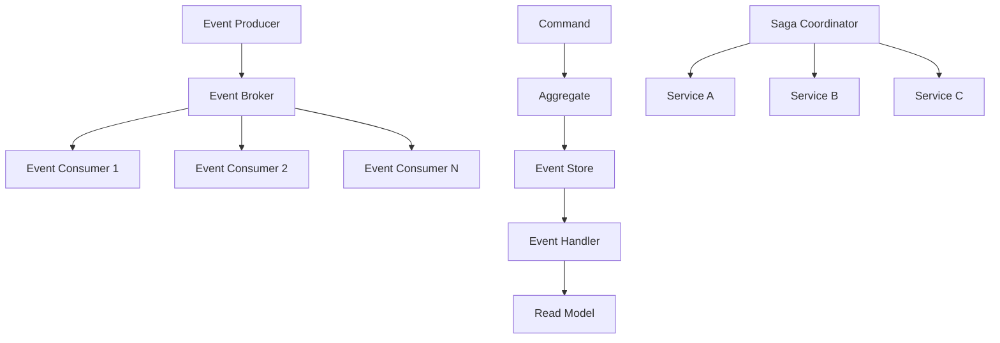

# Event-Driven Architecture: Building Reactive and Scalable Systems

Event-driven architecture (EDA) is a paradigm that promotes the production, detection, consumption, and reaction to events. This approach enables systems to be more responsive, resilient, and scalable by decoupling components and enabling asynchronous communication. This comprehensive guide explores EDA patterns, implementations, and best practices.

## Understanding Event-Driven Architecture

### Core Concepts



**Events** are immutable facts about something that happened in the system. Unlike commands (which express intent), events represent completed actions.

**Event Producers** generate events when state changes occur.

**Event Consumers** react to events by performing business logic, updating views, or triggering other events.

## Event Sourcing Implementation

Event Sourcing stores all changes as a sequence of events rather than just the current state.

```python
import uuid
import json
import time
from typing import Dict, List, Any, Optional, Type
from dataclasses import dataclass, asdict
from abc import ABC, abstractmethod
from datetime import datetime
from enum import Enum

# Base Event Classes
@dataclass
class Event:
    event_id: str
    aggregate_id: str
    event_type: str
    event_data: Dict[str, Any]
    timestamp: float
    version: int
    metadata: Dict[str, Any] = None
    
    def __post_init__(self):
        if self.metadata is None:
            self.metadata = {}
    
    def to_dict(self) -> Dict[str, Any]:
        return asdict(self)
    
    @classmethod
    def from_dict(cls, data: Dict[str, Any]) -> 'Event':
        return cls(**data)

# Domain Events
@dataclass
class UserRegistered(Event):
    def __init__(self, user_id: str, email: str, name: str, version: int):
        super().__init__(
            event_id=str(uuid.uuid4()),
            aggregate_id=user_id,
            event_type="UserRegistered",
            event_data={"email": email, "name": name},
            timestamp=time.time(),
            version=version
        )

@dataclass
class UserEmailChanged(Event):
    def __init__(self, user_id: str, old_email: str, new_email: str, version: int):
        super().__init__(
            event_id=str(uuid.uuid4()),
            aggregate_id=user_id,
            event_type="UserEmailChanged",
            event_data={"old_email": old_email, "new_email": new_email},
            timestamp=time.time(),
            version=version
        )

@dataclass
class UserDeactivated(Event):
    def __init__(self, user_id: str, reason: str, version: int):
        super().__init__(
            event_id=str(uuid.uuid4()),
            aggregate_id=user_id,
            event_type="UserDeactivated",
            event_data={"reason": reason},
            timestamp=time.time(),
            version=version
        )

# Event Store Interface
class EventStore(ABC):
    @abstractmethod
    def append_events(self, aggregate_id: str, events: List[Event], expected_version: int) -> None:
        pass
    
    @abstractmethod
    def get_events(self, aggregate_id: str, from_version: int = 0) -> List[Event]:
        pass
    
    @abstractmethod
    def get_all_events(self, from_timestamp: float = 0) -> List[Event]:
        pass

# In-Memory Event Store Implementation
class InMemoryEventStore(EventStore):
    def __init__(self):
        self.events: Dict[str, List[Event]] = {}
        self.global_events: List[Event] = []
        self.snapshots: Dict[str, Dict] = {}
        self._lock = threading.Lock()
    
    def append_events(self, aggregate_id: str, events: List[Event], expected_version: int) -> None:
        with self._lock:
            if aggregate_id not in self.events:
                self.events[aggregate_id] = []
            
            current_version = len(self.events[aggregate_id])
            if current_version != expected_version:
                raise ConcurrencyError(
                    f"Expected version {expected_version}, but current version is {current_version}"
                )
            
            # Append events
            for event in events:
                self.events[aggregate_id].append(event)
                self.global_events.append(event)
    
    def get_events(self, aggregate_id: str, from_version: int = 0) -> List[Event]:
        with self._lock:
            if aggregate_id not in self.events:
                return []
            
            return self.events[aggregate_id][from_version:]
    
    def get_all_events(self, from_timestamp: float = 0) -> List[Event]:
        with self._lock:
            return [event for event in self.global_events if event.timestamp >= from_timestamp]
    
    def create_snapshot(self, aggregate_id: str, version: int, snapshot_data: Dict) -> None:
        with self._lock:
            self.snapshots[aggregate_id] = {
                'version': version,
                'data': snapshot_data,
                'timestamp': time.time()
            }
    
    def get_snapshot(self, aggregate_id: str) -> Optional[Dict]:
        return self.snapshots.get(aggregate_id)

class ConcurrencyError(Exception):
    pass

# Aggregate Base Class
class AggregateRoot(ABC):
    def __init__(self, aggregate_id: str):
        self.aggregate_id = aggregate_id
        self.version = 0
        self.uncommitted_events: List[Event] = []
    
    def apply_event(self, event: Event):
        """Apply event to aggregate state"""
        self.version = event.version
        handler_name = f"_on_{event.event_type.lower()}"
        if hasattr(self, handler_name):
            getattr(self, handler_name)(event)
    
    def raise_event(self, event: Event):
        """Raise a new event"""
        event.version = self.version + 1
        self.apply_event(event)
        self.uncommitted_events.append(event)
    
    def mark_events_as_committed(self):
        """Mark uncommitted events as committed"""
        self.uncommitted_events.clear()
    
    def load_from_history(self, events: List[Event]):
        """Rebuild aggregate from event history"""
        for event in events:
            self.apply_event(event)

# User Aggregate Implementation
class User(AggregateRoot):
    def __init__(self, user_id: str):
        super().__init__(user_id)
        self.email = None
        self.name = None
        self.is_active = False
    
    @classmethod
    def register(cls, user_id: str, email: str, name: str) -> 'User':
        """Factory method to create new user"""
        user = cls(user_id)
        event = UserRegistered(user_id, email, name, version=1)
        user.raise_event(event)
        return user
    
    def change_email(self, new_email: str):
        """Change user email"""
        if not self.is_active:
            raise ValueError("Cannot change email of inactive user")
        
        if self.email == new_email:
            return  # No change needed
        
        event = UserEmailChanged(self.aggregate_id, self.email, new_email, self.version + 1)
        self.raise_event(event)
    
    def deactivate(self, reason: str):
        """Deactivate user"""
        if not self.is_active:
            return  # Already inactive
        
        event = UserDeactivated(self.aggregate_id, reason, self.version + 1)
        self.raise_event(event)
    
    # Event Handlers
    def _on_userregistered(self, event: Event):
        self.email = event.event_data['email']
        self.name = event.event_data['name']
        self.is_active = True
    
    def _on_useremailchanged(self, event: Event):
        self.email = event.event_data['new_email']
    
    def _on_userdeactivated(self, event: Event):
        self.is_active = False

# Repository Pattern for Aggregates
class Repository:
    def __init__(self, event_store: EventStore, aggregate_class: Type[AggregateRoot]):
        self.event_store = event_store
        self.aggregate_class = aggregate_class
    
    def save(self, aggregate: AggregateRoot) -> None:
        """Save aggregate changes to event store"""
        if aggregate.uncommitted_events:
            expected_version = aggregate.version - len(aggregate.uncommitted_events)
            self.event_store.append_events(
                aggregate.aggregate_id,
                aggregate.uncommitted_events,
                expected_version
            )
            aggregate.mark_events_as_committed()
    
    def get_by_id(self, aggregate_id: str) -> Optional[AggregateRoot]:
        """Load aggregate from event store"""
        events = self.event_store.get_events(aggregate_id)
        if not events:
            return None
        
        aggregate = self.aggregate_class(aggregate_id)
        aggregate.load_from_history(events)
        return aggregate

# Command Pattern
@dataclass
class Command:
    command_id: str
    timestamp: float = None
    
    def __post_init__(self):
        if self.timestamp is None:
            self.timestamp = time.time()

@dataclass
class RegisterUserCommand(Command):
    user_id: str
    email: str
    name: str

@dataclass
class ChangeUserEmailCommand(Command):
    user_id: str
    new_email: str

@dataclass
class DeactivateUserCommand(Command):
    user_id: str
    reason: str

# Command Handler
class UserCommandHandler:
    def __init__(self, user_repository: Repository):
        self.user_repository = user_repository
    
    def handle_register_user(self, command: RegisterUserCommand):
        """Handle user registration command"""
        # Check if user already exists
        existing_user = self.user_repository.get_by_id(command.user_id)
        if existing_user:
            raise ValueError(f"User {command.user_id} already exists")
        
        # Create new user
        user = User.register(command.user_id, command.email, command.name)
        self.user_repository.save(user)
    
    def handle_change_email(self, command: ChangeUserEmailCommand):
        """Handle change email command"""
        user = self.user_repository.get_by_id(command.user_id)
        if not user:
            raise ValueError(f"User {command.user_id} not found")
        
        user.change_email(command.new_email)
        self.user_repository.save(user)
    
    def handle_deactivate_user(self, command: DeactivateUserCommand):
        """Handle user deactivation command"""
        user = self.user_repository.get_by_id(command.user_id)
        if not user:
            raise ValueError(f"User {command.user_id} not found")
        
        user.deactivate(command.reason)
        self.user_repository.save(user)
```

## CQRS (Command Query Responsibility Segregation)

CQRS separates read and write operations, allowing for optimized data models for each.

```python
import threading
from typing import Dict, List, Any, Optional
from dataclasses import dataclass
from abc import ABC, abstractmethod

# Read Models (Query Side)
@dataclass
class UserReadModel:
    user_id: str
    email: str
    name: str
    is_active: bool
    registration_date: float
    last_updated: float
    profile_completion: int = 0
    
class ReadModelStore(ABC):
    @abstractmethod
    def save_user(self, user: UserReadModel) -> None:
        pass
    
    @abstractmethod
    def get_user(self, user_id: str) -> Optional[UserReadModel]:
        pass
    
    @abstractmethod
    def get_users_by_email(self, email: str) -> List[UserReadModel]:
        pass
    
    @abstractmethod
    def get_active_users(self) -> List[UserReadModel]:
        pass
    
    @abstractmethod
    def search_users(self, query: str) -> List[UserReadModel]:
        pass

class InMemoryReadModelStore(ReadModelStore):
    def __init__(self):
        self.users: Dict[str, UserReadModel] = {}
        self.email_index: Dict[str, List[str]] = {}
        self._lock = threading.Lock()
    
    def save_user(self, user: UserReadModel) -> None:
        with self._lock:
            # Update main store
            old_user = self.users.get(user.user_id)
            self.users[user.user_id] = user
            
            # Update email index
            if old_user and old_user.email != user.email:
                # Remove old email mapping
                if old_user.email in self.email_index:
                    self.email_index[old_user.email] = [
                        uid for uid in self.email_index[old_user.email]
                        if uid != user.user_id
                    ]
            
            # Add new email mapping
            if user.email not in self.email_index:
                self.email_index[user.email] = []
            
            if user.user_id not in self.email_index[user.email]:
                self.email_index[user.email].append(user.user_id)
    
    def get_user(self, user_id: str) -> Optional[UserReadModel]:
        return self.users.get(user_id)
    
    def get_users_by_email(self, email: str) -> List[UserReadModel]:
        user_ids = self.email_index.get(email, [])
        return [self.users[uid] for uid in user_ids if uid in self.users]
    
    def get_active_users(self) -> List[UserReadModel]:
        return [user for user in self.users.values() if user.is_active]
    
    def search_users(self, query: str) -> List[UserReadModel]:
        query_lower = query.lower()
        results = []
        
        for user in self.users.values():
            if (query_lower in user.name.lower() or 
                query_lower in user.email.lower()):
                results.append(user)
        
        return results

# Event Handlers (Projections)
class UserProjectionHandler:
    def __init__(self, read_model_store: ReadModelStore):
        self.read_model_store = read_model_store
    
    def handle_user_registered(self, event: Event):
        """Project UserRegistered event to read model"""
        user_data = event.event_data
        
        read_model = UserReadModel(
            user_id=event.aggregate_id,
            email=user_data['email'],
            name=user_data['name'],
            is_active=True,
            registration_date=event.timestamp,
            last_updated=event.timestamp
        )
        
        self.read_model_store.save_user(read_model)
    
    def handle_user_email_changed(self, event: Event):
        """Project UserEmailChanged event to read model"""
        user = self.read_model_store.get_user(event.aggregate_id)
        if user:
            user.email = event.event_data['new_email']
            user.last_updated = event.timestamp
            self.read_model_store.save_user(user)
    
    def handle_user_deactivated(self, event: Event):
        """Project UserDeactivated event to read model"""
        user = self.read_model_store.get_user(event.aggregate_id)
        if user:
            user.is_active = False
            user.last_updated = event.timestamp
            self.read_model_store.save_user(user)

# Query Handlers
class UserQueryHandler:
    def __init__(self, read_model_store: ReadModelStore):
        self.read_model_store = read_model_store
    
    def get_user_profile(self, user_id: str) -> Optional[Dict[str, Any]]:
        """Get complete user profile"""
        user = self.read_model_store.get_user(user_id)
        if not user:
            return None
        
        return {
            'user_id': user.user_id,
            'email': user.email,
            'name': user.name,
            'is_active': user.is_active,
            'registration_date': user.registration_date,
            'profile_completion': user.profile_completion
        }
    
    def search_users(self, query: str, active_only: bool = True) -> List[Dict[str, Any]]:
        """Search users by name or email"""
        users = self.read_model_store.search_users(query)
        
        if active_only:
            users = [user for user in users if user.is_active]
        
        return [
            {
                'user_id': user.user_id,
                'email': user.email,
                'name': user.name,
                'is_active': user.is_active
            }
            for user in users
        ]
    
    def get_user_statistics(self) -> Dict[str, Any]:
        """Get user statistics"""
        all_users = list(self.read_model_store.users.values())
        active_users = [user for user in all_users if user.is_active]
        
        return {
            'total_users': len(all_users),
            'active_users': len(active_users),
            'inactive_users': len(all_users) - len(active_users),
            'recent_registrations': len([
                user for user in all_users
                if time.time() - user.registration_date < 86400  # Last 24 hours
            ])
        }

# Event Bus for CQRS
class EventBus:
    def __init__(self):
        self.handlers: Dict[str, List[callable]] = {}
        self._lock = threading.Lock()
    
    def subscribe(self, event_type: str, handler: callable):
        """Subscribe handler to event type"""
        with self._lock:
            if event_type not in self.handlers:
                self.handlers[event_type] = []
            self.handlers[event_type].append(handler)
    
    def publish(self, event: Event):
        """Publish event to all subscribers"""
        with self._lock:
            handlers = self.handlers.get(event.event_type, [])
        
        for handler in handlers:
            try:
                handler(event)
            except Exception as e:
                print(f"Error handling event {event.event_type}: {e}")
                # In production, you'd want proper error handling/dead letter queues

# Complete CQRS System
class CQRSSystem:
    def __init__(self):
        self.event_store = InMemoryEventStore()
        self.read_model_store = InMemoryReadModelStore()
        self.event_bus = EventBus()
        
        # Set up repositories and handlers
        self.user_repository = Repository(self.event_store, User)
        self.command_handler = UserCommandHandler(self.user_repository)
        self.projection_handler = UserProjectionHandler(self.read_model_store)
        self.query_handler = UserQueryHandler(self.read_model_store)
        
        # Subscribe projection handlers to events
        self.event_bus.subscribe('UserRegistered', self.projection_handler.handle_user_registered)
        self.event_bus.subscribe('UserEmailChanged', self.projection_handler.handle_user_email_changed)
        self.event_bus.subscribe('UserDeactivated', self.projection_handler.handle_user_deactivated)
        
        # Set up event publishing from event store
        self._setup_event_publishing()
    
    def _setup_event_publishing(self):
        """Set up automatic event publishing when events are stored"""
        original_append = self.event_store.append_events
        
        def append_and_publish(aggregate_id: str, events: List[Event], expected_version: int):
            original_append(aggregate_id, events, expected_version)
            
            # Publish events to event bus
            for event in events:
                self.event_bus.publish(event)
        
        self.event_store.append_events = append_and_publish
    
    # Command Interface
    def execute_command(self, command: Command):
        """Execute command"""
        if isinstance(command, RegisterUserCommand):
            self.command_handler.handle_register_user(command)
        elif isinstance(command, ChangeUserEmailCommand):
            self.command_handler.handle_change_email(command)
        elif isinstance(command, DeactivateUserCommand):
            self.command_handler.handle_deactivate_user(command)
        else:
            raise ValueError(f"Unknown command type: {type(command)}")
    
    # Query Interface
    def execute_query(self, query_name: str, **params):
        """Execute query"""
        if query_name == 'get_user_profile':
            return self.query_handler.get_user_profile(params['user_id'])
        elif query_name == 'search_users':
            return self.query_handler.search_users(
                params['query'],
                params.get('active_only', True)
            )
        elif query_name == 'get_user_statistics':
            return self.query_handler.get_user_statistics()
        else:
            raise ValueError(f"Unknown query: {query_name}")
```

## Saga Pattern for Distributed Transactions

Sagas manage long-running transactions across multiple services using compensating actions.

```python
from enum import Enum
from typing import Dict, List, Any, Optional, Callable
import time
import threading

class SagaStepStatus(Enum):
    PENDING = "pending"
    COMPLETED = "completed"
    FAILED = "failed"
    COMPENSATING = "compensating"
    COMPENSATED = "compensated"

@dataclass
class SagaStep:
    step_id: str
    saga_id: str
    action: Callable
    compensation: Callable
    status: SagaStepStatus = SagaStepStatus.PENDING
    result: Any = None
    error: Optional[str] = None
    timestamp: float = None
    
    def __post_init__(self):
        if self.timestamp is None:
            self.timestamp = time.time()

class SagaOrchestrator:
    def __init__(self):
        self.sagas: Dict[str, Dict] = {}
        self.saga_definitions: Dict[str, List[SagaStep]] = {}
        self._lock = threading.Lock()
    
    def define_saga(self, saga_type: str, steps: List[SagaStep]):
        """Define a saga workflow"""
        self.saga_definitions[saga_type] = steps
    
    def start_saga(self, saga_type: str, saga_id: str, context: Dict[str, Any]) -> str:
        """Start a saga instance"""
        if saga_type not in self.saga_definitions:
            raise ValueError(f"Saga type {saga_type} not defined")
        
        with self._lock:
            self.sagas[saga_id] = {
                'saga_type': saga_type,
                'saga_id': saga_id,
                'context': context,
                'current_step': 0,
                'status': 'running',
                'steps': [],
                'start_time': time.time()
            }
        
        # Create step instances
        for i, step_template in enumerate(self.saga_definitions[saga_type]):
            step = SagaStep(
                step_id=f"{saga_id}_step_{i}",
                saga_id=saga_id,
                action=step_template.action,
                compensation=step_template.compensation
            )
            self.sagas[saga_id]['steps'].append(step)
        
        # Start execution
        threading.Thread(target=self._execute_saga, args=(saga_id,)).start()
        return saga_id
    
    def _execute_saga(self, saga_id: str):
        """Execute saga steps sequentially"""
        saga = self.sagas[saga_id]
        steps = saga['steps']
        context = saga['context']
        
        try:
            # Execute steps forward
            for i, step in enumerate(steps):
                saga['current_step'] = i
                step.status = SagaStepStatus.PENDING
                
                try:
                    # Execute step action
                    result = step.action(context)
                    step.result = result
                    step.status = SagaStepStatus.COMPLETED
                    
                    # Update context with result
                    if isinstance(result, dict):
                        context.update(result)
                        
                except Exception as e:
                    step.error = str(e)
                    step.status = SagaStepStatus.FAILED
                    
                    # Start compensation
                    self._compensate_saga(saga_id, i)
                    return
            
            # All steps completed successfully
            saga['status'] = 'completed'
            
        except Exception as e:
            saga['status'] = 'failed'
            saga['error'] = str(e)
    
    def _compensate_saga(self, saga_id: str, failed_step_index: int):
        """Compensate completed steps in reverse order"""
        saga = self.sagas[saga_id]
        steps = saga['steps']
        context = saga['context']
        
        saga['status'] = 'compensating'
        
        # Compensate completed steps in reverse order
        for i in range(failed_step_index - 1, -1, -1):
            step = steps[i]
            
            if step.status == SagaStepStatus.COMPLETED:
                step.status = SagaStepStatus.COMPENSATING
                
                try:
                    compensation_result = step.compensation(context, step.result)
                    step.status = SagaStepStatus.COMPENSATED
                    
                    # Update context with compensation result
                    if isinstance(compensation_result, dict):
                        context.update(compensation_result)
                        
                except Exception as e:
                    step.error = f"Compensation failed: {str(e)}"
                    saga['status'] = 'compensation_failed'
                    return
        
        saga['status'] = 'compensated'
    
    def get_saga_status(self, saga_id: str) -> Optional[Dict[str, Any]]:
        """Get current saga status"""
        saga = self.sagas.get(saga_id)
        if not saga:
            return None
        
        return {
            'saga_id': saga_id,
            'saga_type': saga['saga_type'],
            'status': saga['status'],
            'current_step': saga['current_step'],
            'steps': [
                {
                    'step_id': step.step_id,
                    'status': step.status.value,
                    'error': step.error
                }
                for step in saga['steps']
            ]
        }

# Example: E-commerce Order Saga
class OrderService:
    def __init__(self):
        self.orders = {}
    
    def create_order(self, context: Dict[str, Any]) -> Dict[str, Any]:
        order_id = context['order_id']
        user_id = context['user_id']
        items = context['items']
        
        order = {
            'order_id': order_id,
            'user_id': user_id,
            'items': items,
            'status': 'created',
            'total_amount': sum(item['price'] * item['quantity'] for item in items)
        }
        
        self.orders[order_id] = order
        print(f"Order {order_id} created")
        
        return {'total_amount': order['total_amount']}
    
    def cancel_order(self, context: Dict[str, Any], result: Any) -> Dict[str, Any]:
        order_id = context['order_id']
        if order_id in self.orders:
            self.orders[order_id]['status'] = 'cancelled'
            print(f"Order {order_id} cancelled")
        return {}

class PaymentService:
    def __init__(self):
        self.payments = {}
    
    def process_payment(self, context: Dict[str, Any]) -> Dict[str, Any]:
        order_id = context['order_id']
        user_id = context['user_id']
        amount = context['total_amount']
        
        # Simulate payment processing
        payment_id = f"payment_{order_id}"
        
        # Simulate payment failure for demonstration
        import random
        if random.random() < 0.3:  # 30% failure rate
            raise Exception("Payment processing failed")
        
        payment = {
            'payment_id': payment_id,
            'order_id': order_id,
            'user_id': user_id,
            'amount': amount,
            'status': 'completed'
        }
        
        self.payments[payment_id] = payment
        print(f"Payment {payment_id} processed for ${amount}")
        
        return {'payment_id': payment_id}
    
    def refund_payment(self, context: Dict[str, Any], result: Any) -> Dict[str, Any]:
        payment_id = result.get('payment_id') if result else None
        
        if payment_id and payment_id in self.payments:
            self.payments[payment_id]['status'] = 'refunded'
            print(f"Payment {payment_id} refunded")
        
        return {}

class InventoryService:
    def __init__(self):
        self.inventory = {
            'item1': 100,
            'item2': 50,
            'item3': 25
        }
        self.reservations = {}
    
    def reserve_items(self, context: Dict[str, Any]) -> Dict[str, Any]:
        order_id = context['order_id']
        items = context['items']
        
        reservations = []
        
        # Check and reserve items
        for item in items:
            item_id = item['item_id']
            quantity = item['quantity']
            
            if self.inventory.get(item_id, 0) < quantity:
                # Release already reserved items
                for reserved_item in reservations:
                    self.inventory[reserved_item['item_id']] += reserved_item['quantity']
                
                raise Exception(f"Insufficient inventory for item {item_id}")
            
            self.inventory[item_id] -= quantity
            reservations.append(item)
        
        self.reservations[order_id] = reservations
        print(f"Items reserved for order {order_id}: {reservations}")
        
        return {'reserved_items': reservations}
    
    def release_reservation(self, context: Dict[str, Any], result: Any) -> Dict[str, Any]:
        order_id = context['order_id']
        
        if order_id in self.reservations:
            reservations = self.reservations[order_id]
            
            # Release reserved items back to inventory
            for item in reservations:
                self.inventory[item['item_id']] += item['quantity']
            
            del self.reservations[order_id]
            print(f"Released reservations for order {order_id}")
        
        return {}

class ShippingService:
    def __init__(self):
        self.shipments = {}
    
    def create_shipment(self, context: Dict[str, Any]) -> Dict[str, Any]:
        order_id = context['order_id']
        items = context.get('reserved_items', [])
        
        shipment_id = f"shipment_{order_id}"
        
        shipment = {
            'shipment_id': shipment_id,
            'order_id': order_id,
            'items': items,
            'status': 'created'
        }
        
        self.shipments[shipment_id] = shipment
        print(f"Shipment {shipment_id} created")
        
        return {'shipment_id': shipment_id}
    
    def cancel_shipment(self, context: Dict[str, Any], result: Any) -> Dict[str, Any]:
        shipment_id = result.get('shipment_id') if result else None
        
        if shipment_id and shipment_id in self.shipments:
            self.shipments[shipment_id]['status'] = 'cancelled'
            print(f"Shipment {shipment_id} cancelled")
        
        return {}

# Set up Order Processing Saga
def setup_order_saga():
    order_service = OrderService()
    payment_service = PaymentService()
    inventory_service = InventoryService()
    shipping_service = ShippingService()
    
    orchestrator = SagaOrchestrator()
    
    # Define order processing saga steps
    steps = [
        SagaStep(
            step_id="create_order",
            saga_id="",  # Will be set when saga starts
            action=order_service.create_order,
            compensation=order_service.cancel_order
        ),
        SagaStep(
            step_id="reserve_inventory",
            saga_id="",
            action=inventory_service.reserve_items,
            compensation=inventory_service.release_reservation
        ),
        SagaStep(
            step_id="process_payment",
            saga_id="",
            action=payment_service.process_payment,
            compensation=payment_service.refund_payment
        ),
        SagaStep(
            step_id="create_shipment",
            saga_id="",
            action=shipping_service.create_shipment,
            compensation=shipping_service.cancel_shipment
        )
    ]
    
    orchestrator.define_saga("order_processing", steps)
    
    return orchestrator, {
        'order_service': order_service,
        'payment_service': payment_service,
        'inventory_service': inventory_service,
        'shipping_service': shipping_service
    }

# Usage Example
if __name__ == "__main__":
    orchestrator, services = setup_order_saga()
    
    # Start an order saga
    order_context = {
        'order_id': 'order_123',
        'user_id': 'user_456',
        'items': [
            {'item_id': 'item1', 'quantity': 2, 'price': 10.00},
            {'item_id': 'item2', 'quantity': 1, 'price': 25.00}
        ]
    }
    
    saga_id = orchestrator.start_saga("order_processing", "saga_123", order_context)
    
    # Wait for saga to complete
    time.sleep(2)
    
    # Check saga status
    status = orchestrator.get_saga_status(saga_id)
    print(f"Saga status: {json.dumps(status, indent=2)}")
```

## Event Streaming and Processing

### Real-time Event Processing

```python
import asyncio
from typing import AsyncIterator, Dict, Any, List, Callable
from dataclasses import dataclass
import json
import time

@dataclass
class StreamEvent:
    stream_id: str
    event_id: str
    event_type: str
    data: Dict[str, Any]
    timestamp: float
    partition_key: str = None
    
    def __post_init__(self):
        if self.partition_key is None:
            self.partition_key = str(hash(self.stream_id) % 10)

class EventStream:
    def __init__(self, stream_id: str, partition_count: int = 10):
        self.stream_id = stream_id
        self.partition_count = partition_count
        self.partitions: Dict[str, List[StreamEvent]] = {
            str(i): [] for i in range(partition_count)
        }
        self.subscribers: List[Callable] = []
        self.positions: Dict[str, int] = {}  # consumer_id -> position
        self._lock = asyncio.Lock()
    
    async def append(self, event: StreamEvent):
        """Append event to stream"""
        async with self._lock:
            partition = event.partition_key
            if partition not in self.partitions:
                partition = str(int(partition) % self.partition_count)
            
            self.partitions[partition].append(event)
            
            # Notify subscribers
            for subscriber in self.subscribers:
                asyncio.create_task(subscriber(event))
    
    async def read(self, consumer_id: str, from_position: int = 0) -> AsyncIterator[StreamEvent]:
        """Read events from stream"""
        position = max(from_position, self.positions.get(consumer_id, 0))
        
        while True:
            events_to_yield = []
            
            async with self._lock:
                # Collect events from all partitions
                all_events = []
                for partition_events in self.partitions.values():
                    all_events.extend(partition_events)
                
                # Sort by timestamp and get events after position
                all_events.sort(key=lambda x: x.timestamp)
                
                if position < len(all_events):
                    events_to_yield = all_events[position:]
                    self.positions[consumer_id] = len(all_events)
            
            for event in events_to_yield:
                yield event
            
            # Wait before checking for new events
            await asyncio.sleep(0.1)
    
    def subscribe(self, callback: Callable[[StreamEvent], None]):
        """Subscribe to real-time events"""
        self.subscribers.append(callback)

class EventProcessor:
    def __init__(self, processor_id: str):
        self.processor_id = processor_id
        self.handlers: Dict[str, Callable] = {}
        self.running = False
    
    def register_handler(self, event_type: str, handler: Callable):
        """Register event handler"""
        self.handlers[event_type] = handler
    
    async def process_stream(self, stream: EventStream, from_position: int = 0):
        """Process events from stream"""
        self.running = True
        
        async for event in stream.read(self.processor_id, from_position):
            if not self.running:
                break
            
            if event.event_type in self.handlers:
                try:
                    await self.handlers[event.event_type](event)
                except Exception as e:
                    print(f"Error processing event {event.event_id}: {e}")
            
            await asyncio.sleep(0.01)  # Small delay to prevent overwhelming
    
    def stop(self):
        """Stop processing"""
        self.running = False

# Complex Event Processing (CEP)
class EventPattern:
    def __init__(self, pattern_id: str):
        self.pattern_id = pattern_id
        self.conditions: List[Callable] = []
        self.window_size: float = 60.0  # 1 minute window
        self.action: Callable = None
    
    def add_condition(self, condition: Callable[[StreamEvent], bool]):
        """Add condition to pattern"""
        self.conditions.append(condition)
    
    def set_action(self, action: Callable[[List[StreamEvent]], None]):
        """Set action to execute when pattern matches"""
        self.action = action
    
    def matches(self, events: List[StreamEvent]) -> bool:
        """Check if events match pattern"""
        if not events:
            return False
        
        # Check time window
        now = time.time()
        window_events = [
            event for event in events
            if now - event.timestamp <= self.window_size
        ]
        
        if not window_events:
            return False
        
        # Check all conditions
        return all(
            any(condition(event) for event in window_events)
            for condition in self.conditions
        )

class ComplexEventProcessor:
    def __init__(self):
        self.patterns: Dict[str, EventPattern] = {}
        self.event_buffer: List[StreamEvent] = []
        self.buffer_size = 1000
        self._lock = asyncio.Lock()
    
    def add_pattern(self, pattern: EventPattern):
        """Add event pattern"""
        self.patterns[pattern.pattern_id] = pattern
    
    async def process_event(self, event: StreamEvent):
        """Process incoming event against patterns"""
        async with self._lock:
            # Add to buffer
            self.event_buffer.append(event)
            
            # Maintain buffer size
            if len(self.event_buffer) > self.buffer_size:
                self.event_buffer = self.event_buffer[-self.buffer_size:]
            
            # Check patterns
            for pattern in self.patterns.values():
                if pattern.matches(self.event_buffer):
                    if pattern.action:
                        # Get matching events for action
                        relevant_events = [
                            e for e in self.event_buffer
                            if time.time() - e.timestamp <= pattern.window_size
                        ]
                        await pattern.action(relevant_events)

# Real-time Analytics Engine
class AnalyticsEngine:
    def __init__(self):
        self.metrics: Dict[str, Any] = {}
        self.aggregations: Dict[str, Dict] = {}
        self.time_windows = [60, 300, 3600]  # 1min, 5min, 1hour
        self._lock = asyncio.Lock()
    
    async def process_event(self, event: StreamEvent):
        """Process event for analytics"""
        async with self._lock:
            now = time.time()
            event_type = event.event_type
            
            # Initialize metrics for event type
            if event_type not in self.aggregations:
                self.aggregations[event_type] = {
                    'count': 0,
                    'timestamps': [],
                    'values': []
                }
            
            agg = self.aggregations[event_type]
            agg['count'] += 1
            agg['timestamps'].append(event.timestamp)
            
            # Extract numeric values for aggregation
            if 'value' in event.data:
                agg['values'].append(event.data['value'])
            
            # Clean old data
            for window in self.time_windows:
                cutoff = now - window
                agg['timestamps'] = [ts for ts in agg['timestamps'] if ts > cutoff]
                if len(agg['values']) > len(agg['timestamps']):
                    agg['values'] = agg['values'][-len(agg['timestamps']):]
    
    def get_metrics(self, event_type: str, window: int = 60) -> Dict[str, Any]:
        """Get aggregated metrics for event type"""
        if event_type not in self.aggregations:
            return {}
        
        agg = self.aggregations[event_type]
        now = time.time()
        cutoff = now - window
        
        # Filter data within window
        recent_timestamps = [ts for ts in agg['timestamps'] if ts > cutoff]
        recent_values = agg['values'][-len(recent_timestamps):]
        
        metrics = {
            'count': len(recent_timestamps),
            'rate': len(recent_timestamps) / window if window > 0 else 0
        }
        
        if recent_values:
            metrics.update({
                'avg': sum(recent_values) / len(recent_values),
                'min': min(recent_values),
                'max': max(recent_values),
                'sum': sum(recent_values)
            })
        
        return metrics

# Example: Real-time User Activity Monitoring
async def user_activity_monitoring_example():
    # Set up event stream
    activity_stream = EventStream("user_activity")
    
    # Set up processors
    analytics = AnalyticsEngine()
    cep = ComplexEventProcessor()
    
    # Create fraud detection pattern
    fraud_pattern = EventPattern("fraud_detection")
    fraud_pattern.add_condition(lambda e: e.event_type == "login_attempt")
    fraud_pattern.add_condition(lambda e: e.event_type == "login_failed")
    fraud_pattern.window_size = 300  # 5 minutes
    
    async def fraud_action(events):
        login_attempts = [e for e in events if e.event_type == "login_attempt"]
        failed_attempts = [e for e in events if e.event_type == "login_failed"]
        
        if len(failed_attempts) > 5:  # More than 5 failed attempts
            print(f"FRAUD ALERT: {len(failed_attempts)} failed login attempts detected")
    
    fraud_pattern.set_action(fraud_action)
    cep.add_pattern(fraud_pattern)
    
    # Subscribe processors to stream
    activity_stream.subscribe(analytics.process_event)
    activity_stream.subscribe(cep.process_event)
    
    # Simulate user activity events
    user_events = [
        StreamEvent("user_activity", "1", "login_attempt", {"user_id": "user123", "ip": "192.168.1.1"}, time.time()),
        StreamEvent("user_activity", "2", "login_failed", {"user_id": "user123", "ip": "192.168.1.1"}, time.time()),
        StreamEvent("user_activity", "3", "page_view", {"user_id": "user456", "page": "/dashboard", "value": 1}, time.time()),
        StreamEvent("user_activity", "4", "login_failed", {"user_id": "user123", "ip": "192.168.1.1"}, time.time()),
    ]
    
    # Send events to stream
    for event in user_events:
        await activity_stream.append(event)
        await asyncio.sleep(0.1)
    
    # Wait for processing
    await asyncio.sleep(1)
    
    # Get analytics
    login_metrics = analytics.get_metrics("login_attempt", 300)
    print(f"Login metrics: {login_metrics}")

# Run example
if __name__ == "__main__":
    asyncio.run(user_activity_monitoring_example())
```

## Conclusion

Event-driven architecture provides powerful patterns for building scalable, resilient systems:

1. **Event Sourcing** enables complete audit trails and temporal queries
2. **CQRS** optimizes read and write operations separately
3. **Sagas** manage distributed transactions with compensating actions
4. **Event Streaming** enables real-time processing and analytics
5. **Complex Event Processing** detects patterns in event streams

Key benefits include:
- **Loose Coupling**: Components communicate through events
- **Scalability**: Easy to scale individual components
- **Resilience**: Natural error boundaries and recovery mechanisms
- **Auditability**: Complete history of state changes
- **Flexibility**: Easy to add new features without modifying existing code

When implementing EDA, consider:
- **Event Design**: Make events immutable and self-contained
- **Ordering**: Decide on global vs. per-partition ordering
- **Error Handling**: Implement proper retry and dead letter policies
- **Schema Evolution**: Plan for backward/forward compatibility
- **Monitoring**: Track event flow and processing latencies

Event-driven architecture is particularly well-suited for microservices, real-time systems, and applications requiring high scalability and resilience.