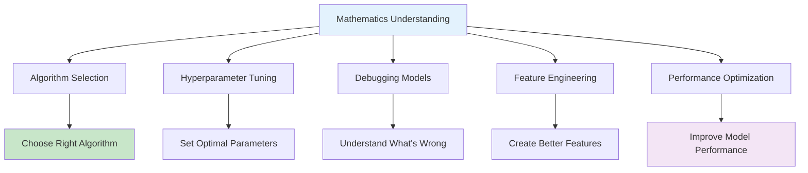

# Mathematical Prerequisites for Machine Learning: Linear Algebra, Calculus, and Statistics

Machine learning is fundamentally a mathematical discipline that transforms data into actionable insights through algorithmic processes. To truly understand and effectively apply machine learning techniques, a solid foundation in three core mathematical areas is essential: linear algebra, calculus, and statistics. These mathematical tools provide the language and framework for understanding how algorithms work, how they learn from data, and how to optimize their performance.

## Table of Contents
1. [Why Mathematics Matters in ML](#why-mathematics-matters-in-ml)
2. [Linear Algebra in Machine Learning](#linear-algebra-in-machine-learning)
3. [Calculus for Optimization](#calculus-for-optimization)
4. [Statistics and Probability](#statistics-and-probability)
5. [Mathematical Applications in ML Algorithms](#mathematical-applications-in-ml-algorithms)
6. [Essential Formulas and Notation](#essential-formulas-and-notation)
7. [Practical Implementation](#practical-implementation)
8. [Common Mathematical Operations in ML](#common-mathematical-operations-in-ml)
9. [Advanced Mathematical Concepts](#advanced-mathematical-concepts)
10. [Building Intuition](#building-intuition)

## Why Mathematics Matters in ML {#why-mathematics-matters-in-ml}

Mathematics isn't just academic rigor in machine learning—it's the language that describes how algorithms process data and make decisions. Understanding the mathematical underpinnings of ML algorithms provides several advantages:



Let's examine how mathematics drives machine learning through a practical example:

```python
import numpy as np
import matplotlib.pyplot as plt

def mathematical_foundations_example():
    """
    Example showing how mathematics underlies ML
    """
    print("Mathematics in Machine Learning:")
    print("1. Data representation through matrices and vectors")
    print("2. Optimization through calculus and gradients")
    print("3. Uncertainty modeling through probability and statistics")
    
    # Example: Linear regression using mathematical concepts
    # y = Xw + b (linear transformation)
    # Cost = (1/2m) * Σ(y_pred - y_true)² (calculus for optimization)
    # w_new = w_old - α * ∇Cost (gradient descent)
    
    # Generate data
    np.random.seed(42)
    X = 2 * np.random.rand(100, 1)
    y = 4 + 3 * X + np.random.randn(100, 1)  # y = 4 + 3x + noise
    
    # Manual implementation using mathematical concepts
    X_b = np.c_[np.ones((100, 1)), X]  # Add x0 = 1 to each instance
    
    # Normal equation: θ = (X^T * X)^(-1) * X^T * y
    theta_best = np.linalg.inv(X_b.T.dot(X_b)).dot(X_b.T).dot(y)
    
    print(f"\nActual parameters: [4, 3] (intercept, slope)")
    print(f"Learned parameters: [{theta_best[0,0]:.3f}, {theta_best[1,0]:.3f}]")
    
    return X, y, theta_best

X_data, y_data, parameters = mathematical_foundations_example()
```

### The Interdisciplinary Nature of ML Mathematics

```python
def interdisciplinary_math():
    """
    Show how different mathematical areas interconnect in ML
    """
    connections = {
        "Linear Algebra": {
            "connects_to": ["Calculus", "Statistics"],
            "role": "Data representation and transformations"
        },
        "Calculus": {
            "connects_to": ["Linear Algebra", "Statistics"],
            "role": "Optimization and gradient computation"
        },
        "Statistics": {
            "connects_to": ["Linear Algebra", "Probability"],
            "role": "Uncertainty quantification and inference"
        }
    }
    
    print("Interconnected Mathematical Disciplines in ML:")
    for area, details in connections.items():
        print(f"• {area}")
        print(f"  Role: {details['role']}")
        print(f"  Connected to: {', '.join(details['connects_to'])}")

interdisciplinary_math()
```

## Linear Algebra in Machine Learning {#linear-algebra-in-machine-learning}

Linear algebra is the cornerstone of machine learning, providing the mathematical framework for representing data, models, and computations efficiently.

### Vectors and Data Representation

In machine learning, data is typically represented as vectors:

```python
def vector_representation():
    """
    Demonstrate how data is represented as vectors
    """
    print("Vector Representation in ML:")
    
    # Single data point as vector
    sample_data = np.array([25, 65000, 3.5, 1])  # age, income, credit_score, employed
    print(f"Single sample vector: {sample_data}")
    print(f"Vector dimension: {sample_data.shape[0]}")
    
    # Multiple data points as matrix
    dataset = np.array([
        [25, 65000, 3.5, 1],
        [35, 80000, 7.2, 1],
        [45, 120000, 8.0, 1],
        [30, 45000, 2.1, 0]
    ])
    
    print(f"Dataset matrix shape: {dataset.shape}")
    print(f"Each row represents one sample")
    print(f"Each column represents one feature")
    
    # Vector operations in ML
    # Dot product for similarity
    sample1 = dataset[0]
    sample2 = dataset[1]
    similarity = np.dot(sample1, sample2)
    cosine_similarity = np.dot(sample1, sample2) / (np.linalg.norm(sample1) * np.linalg.norm(sample2))
    
    print(f"\nDot product of first two samples: {similarity:.2f}")
    print(f"Cosine similarity: {cosine_similarity:.3f}")
    
    return dataset

dataset = vector_representation()
```

### Matrices and Transformations

Matrices represent datasets and transformations in ML:

```python
def matrix_operations():
    """
    Demonstrate matrix operations fundamental to ML
    """
    print("\nMatrix Operations in ML:")
    
    # Data matrix: rows=samples, columns=features
    X = np.random.rand(100, 5)  # 100 samples, 5 features
    print(f"Data matrix X shape: {X.shape}")
    
    # Weight matrix for linear transformation
    W = np.random.rand(5, 3)  # Transform 5-dim to 3-dim space
    print(f"Weight matrix W shape: {W.shape}")
    
    # Linear transformation: X @ W
    transformed = X @ W
    print(f"Transformed matrix shape: {transformed.shape}")
    
    # Matrix properties important in ML
    print(f"\nMatrix properties:")
    print(f"Determinant of W: {np.linalg.det(W.T @ W):.3f}")
    print(f"Rank of X: {np.linalg.matrix_rank(X)}")
    print(f"Condition number: {np.linalg.cond(X):.3f} (measures numerical stability)")
    
    # Covariance matrix
    cov_matrix = np.cov(X.T)
    print(f"Covariance matrix shape: {cov_matrix.shape}")
    
    return X, W, transformed

data_matrix, weight_matrix, transformed_data = matrix_operations()
```

### Eigenvalues and Principal Component Analysis

Eigenvalues and eigenvectors are crucial for dimensionality reduction:

```python
def eigen_concepts():
    """
    Demonstrate eigenvalues and eigenvectors in PCA
    """
    # Generate correlated data
    np.random.seed(42)
    mean = [0, 0]
    cov = [[2, 1], [1, 2]]
    x, y = np.random.multivariate_normal(mean, cov, 200).T
    
    data = np.column_stack([x, y])
    
    # Compute covariance matrix
    cov_matrix = np.cov(data.T)
    
    # Find eigenvalues and eigenvectors
    eigenvalues, eigenvectors = np.linalg.eig(cov_matrix)
    
    print("Eigenvalue and Eigenvector Concepts:")
    print(f"Eigenvalues: {eigenvalues}")
    print(f"Eigenvectors:\n{eigenvectors}")
    print(f"Explained variance by PC1: {eigenvalues[0]/np.sum(eigenvalues):.3f}")
    print(f"Explained variance by PC2: {eigenvalues[1]/np.sum(eigenvalues):.3f}")
    
    # Visualize
    plt.figure(figsize=(12, 5))
    
    plt.subplot(1, 2, 1)
    plt.scatter(x, y, alpha=0.6)
    plt.title('Original Data')
    plt.xlabel('Feature 1')
    plt.ylabel('Feature 2')
    
    # Transform to principal components
    X_pca = data @ eigenvectors
    plt.subplot(1, 2, 2)
    plt.scatter(X_pca[:, 0], X_pca[:, 1], alpha=0.6)
    plt.title('Principal Components')
    plt.xlabel('PC1')
    plt.ylabel('PC2')
    plt.axis('equal')
    
    # Show eigenvectors on original data
    plt.figure(figsize=(8, 8))
    plt.scatter(x, y, alpha=0.6, label='Data')
    
    # Plot eigenvectors scaled by eigenvalues
    for i in range(len(eigenvalues)):
        start, end = mean, mean + np.sqrt(eigenvalues[i]) * eigenvectors[:, i]
        plt.arrow(start[0], start[1], end[0]-start[0], end[1]-start[1], 
                 head_width=0.2, head_length=0.2, fc='red', ec='red', 
                 label=f'PC{i+1}')
    
    plt.title('Data with Principal Components (Eigenvectors)')
    plt.legend()
    plt.axis('equal')
    plt.grid(True, alpha=0.3)
    plt.show()
    
    return eigenvalues, eigenvectors

eigenvals, eigenvects = eigen_concepts()
```

### Matrix Decomposition

Matrix decomposition is fundamental for many ML algorithms:

```python
from scipy.linalg import svd

def matrix_decomposition():
    """
    Matrix decomposition in ML applications
    """
    # Create a sample data matrix
    np.random.seed(42)
    X = np.random.rand(20, 10)  # 20 samples, 10 features
    
    # Singular Value Decomposition (SVD)
    U, s, Vt = svd(X)
    
    print("SVD in Machine Learning:")
    print(f"Original matrix shape: {X.shape}")
    print(f"U matrix shape: {U.shape}")
    print(f"Singular values shape: {s.shape}")
    print(f"Vt matrix shape: {Vt.shape}")
    
    # Low-rank approximation for dimensionality reduction
    k = 3  # reduced dimension
    X_reconstructed = U[:, :k] @ np.diag(s[:k]) @ Vt[:k, :]
    
    reconstruction_error = np.mean((X - X_reconstructed)**2)
    print(f"\nReconstruction error with {k} components: {reconstruction_error:.6f}")
    print(f"Compression ratio: {k/X.shape[1]:.2%}")
    
    # Show how SVD can be used for recommendation systems
    print("\nSVD Applications:")
    print("- Principal Component Analysis")
    print("- Latent Semantic Analysis") 
    print("- Recommender Systems")
    print("- Image Compression")
    print("- Noise Reduction")
    
    return U, s, Vt, X_reconstructed

U, s, Vt, X_rec = matrix_decomposition()
```

## Calculus for Optimization {#calculus-for-optimization}

Calculus is the engine that drives optimization in machine learning, enabling algorithms to learn by minimizing loss functions.

### Derivatives and Gradients

Gradients indicate the direction of steepest increase in a function:

```python
def gradient_concepts():
    """
    Understand gradients and their role in ML optimization
    """
    print("Gradients in Machine Learning:")
    
    # Simple function: f(x) = x^2 - 4x + 4
    def f(x):
        return x**2 - 4*x + 4
    
    def gradient_f(x):
        return 2*x - 4  # derivative of f(x)
    
    print("Function: f(x) = x² - 4x + 4")
    print("Gradient: f'(x) = 2x - 4")
    
    # Gradient descent optimization
    x = 10.0  # Starting point
    learning_rate = 0.1
    iterations = 20
    
    x_history = [x]
    f_history = [f(x)]
    
    print(f"\nGradient Descent from x={x}:")
    for i in range(iterations):
        grad = gradient_f(x)
        x = x - learning_rate * grad
        x_history.append(x)
        f_history.append(f(x))
        print(f"Step {i+1}: x={x:.3f}, f(x)={f(x):.3f}, grad={grad:.3f}")
    
    print(f"\nMinimum found at x = {x:.3f}, f(x) = {f(x):.3f}")
    print(f"True minimum at x = 2.0, f(x) = {f(2.0):.3f}")
    
    # Visualize the process
    x_range = np.linspace(-2, 12, 1000)
    y_range = [f(x) for x in x_range]
    
    plt.figure(figsize=(10, 6))
    plt.plot(x_range, y_range, 'b-', label='f(x) = x² - 4x + 4')
    plt.scatter(x_history, f_history, c='red', s=50, zorder=5, label='Gradient Descent Path')
    plt.plot(x_history, f_history, 'r--', alpha=0.5)
    plt.scatter([2.0], [f(2.0)], c='green', s=100, zorder=6, label='True Minimum')
    plt.title('Gradient Descent Optimization')
    plt.xlabel('x')
    plt.ylabel('f(x)')
    plt.legend()
    plt.grid(True, alpha=0.3)
    plt.show()
    
    return x_history, f_history

x_path, f_path = gradient_concepts()
```

### Partial Derivatives in Multivariate Functions

ML models often have multiple parameters to optimize:

```python
def multivariate_gradients():
    """
    Partial derivatives in multivariate ML functions
    """
    print("\nMultivariate Gradients in ML:")
    
    # Example: Linear regression cost function
    # J(w,b) = (1/2m) * Σ(h(x) - y)² where h(x) = wx + b
    def cost_function(X, y, w, b):
        m = len(X)
        predictions = w * X + b
        cost = (1/(2*m)) * np.sum((predictions - y)**2)
        return cost
    
    def gradients(X, y, w, b):
        m = len(X)
        predictions = w * X + b
        
        # Partial derivatives
        dw = (1/m) * np.sum((predictions - y) * X)
        db = (1/m) * np.sum(predictions - y)
        
        return dw, db
    
    # Generate data
    np.random.seed(42)
    X = 2 * np.random.rand(100)
    y = 3 * X + 1 + np.random.randn(100)  # y = 3x + 1 + noise
    
    # Starting parameters
    w, b = 0.0, 0.0
    learning_rate = 0.1
    iterations = 100
    
    w_history = [w]
    b_history = [b]
    cost_history = [cost_function(X, y, w, b)]
    
    for i in range(iterations):
        dw, db = gradients(X, y, w, b)
        w -= learning_rate * dw
        b -= learning_rate * db
        
        w_history.append(w)
        b_history.append(b)
        cost_history.append(cost_function(X, y, w, b))
    
    print(f"Final parameters: w={w:.3f}, b={b:.3f}")
    print(f"True parameters: w=3.0, b=1.0")
    print(f"Final cost: {cost_function(X, y, w, b):.6f}")
    
    # Visualize cost reduction
    plt.figure(figsize=(12, 4))
    
    plt.subplot(1, 3, 1)
    plt.plot(cost_history)
    plt.title('Cost Function Over Time')
    plt.xlabel('Iteration')
    plt.ylabel('Cost')
    plt.grid(True, alpha=0.3)
    
    plt.subplot(1, 3, 2)
    plt.plot(w_history)
    plt.title('Parameter w Over Time')
    plt.xlabel('Iteration')
    plt.ylabel('w')
    plt.grid(True, alpha=0.3)
    
    plt.subplot(1, 3, 3)
    plt.plot(b_history)
    plt.title('Parameter b Over Time')
    plt.xlabel('Iteration')
    plt.ylabel('b')
    plt.grid(True, alpha=0.3)
    
    plt.tight_layout()
    plt.show()
    
    return w_history, b_history, cost_history

w_hist, b_hist, cost_hist = multivariate_gradients()
```

### Jacobian and Hessian Matrices

For complex ML models, we need higher-order derivatives:

```python
def higher_order_derivatives():
    """
    Jacobian and Hessian in ML optimization
    """
    print("\nHigher-Order Derivatives:")
    
    # Example: Simple 2-parameter function
    def f(params):
        x, y = params
        return x**2 + 2*y**2 + 2*x*y  # Multivariate function
    
    def gradient(params):
        x, y = params
        return np.array([2*x + 2*y, 4*y + 2*x])  # Gradient
    
    def hessian(params):
        # Second-order partial derivatives
        x, y = params
        return np.array([[2, 2], [2, 4]])  # Hessian matrix
    
    # Newton's method (uses Hessian)
    params = np.array([5.0, 5.0])  # Starting point
    iterations = 10
    
    print("Newton's Method (uses Hessian):")
    print(f"Starting at: {params}")
    
    for i in range(iterations):
        grad = gradient(params)
        hess = hessian(params)
        
        # Newton update: params = params - H^(-1) * gradient
        try:
            params = params - np.linalg.inv(hess) @ grad
            cost = f(params)
            print(f"Step {i+1}: params={params}, cost={cost:.6f}")
        except np.linalg.LinAlgError:
            print("Hessian is singular, cannot update")
            break
    
    print(f"Converged to: {params} (should be [0, 0] for minimum)")
    print(f"Final cost: {f(params):.6f}")
    
    return params

converged_params = higher_order_derivatives()
```

### Convex Optimization

Many ML problems involve convex functions which have nice optimization properties:

```python
def convex_optimization():
    """
    Convex optimization in ML
    """
    print("\nConvex Optimization:")
    
    # Convex function: f(x) = x^4 + 2*x^2 + 1
    def convex_f(x):
        return x**4 + 2*x**2 + 1
    
    # Non-convex function: f(x) = x^4 - 4*x^2 + 1
    def non_convex_f(x):
        return x**4 - 4*x**2 + 1
    
    x = np.linspace(-3, 3, 1000)
    
    plt.figure(figsize=(12, 4))
    
    plt.subplot(1, 2, 1)
    plt.plot(x, convex_f(x))
    plt.title('Convex Function: f(x) = x⁴ + 2x² + 1')
    plt.xlabel('x')
    plt.ylabel('f(x)')
    plt.grid(True, alpha=0.3)
    
    plt.subplot(1, 2, 2)
    plt.plot(x, non_convex_f(x))
    plt.title('Non-Convex Function: f(x) = x⁴ - 4x² + 1')
    plt.xlabel('x')
    plt.ylabel('f(x)')
    plt.grid(True, alpha=0.3)
    
    plt.tight_layout()
    plt.show()
    
    print("Properties of Convex Optimization:")
    print("- Global minimum is the only local minimum")
    print("- Gradient descent will find global minimum")
    print("- Linear regression has convex loss function")
    print("- Many ML problems are formulated as convex optimization")
    
    return convex_f, non_convex_f

convex_func, non_convex_func = convex_optimization()
```

## Statistics and Probability {#statistics-and-probability}

Probability and statistics provide the framework for reasoning under uncertainty and making inferences from data.

### Probability Distributions

Different probability distributions model different types of data:

```python
from scipy import stats
import matplotlib.pyplot as plt

def probability_distributions():
    """
    Common probability distributions in ML
    """
    print("Probability Distributions in ML:")
    
    fig, axes = plt.subplots(2, 3, figsize=(15, 10))
    
    # Normal distribution
    x_norm = np.linspace(-4, 4, 1000)
    y_norm = stats.norm.pdf(x_norm, 0, 1)
    axes[0, 0].plot(x_norm, y_norm)
    axes[0, 0].set_title('Normal Distribution')
    axes[0, 0].set_xlabel('x')
    axes[0, 0].set_ylabel('Probability Density')
    axes[0, 0].grid(True, alpha=0.3)
    
    # Binomial distribution
    x_bin = np.arange(0, 21)
    y_bin = stats.binom.pmf(x_bin, n=20, p=0.3)
    axes[0, 1].bar(x_bin, y_bin)
    axes[0, 1].set_title('Binomial Distribution (n=20, p=0.3)')
    axes[0, 1].set_xlabel('k')
    axes[0, 1].set_ylabel('Probability')
    axes[0, 1].grid(True, alpha=0.3)
    
    # Poisson distribution
    x_pois = np.arange(0, 15)
    y_pois = stats.poisson.pmf(x_pois, mu=3)
    axes[0, 2].bar(x_pois, y_pois)
    axes[0, 2].set_title('Poisson Distribution (λ=3)')
    axes[0, 2].set_xlabel('k')
    axes[0, 2].set_ylabel('Probability')
    axes[0, 2].grid(True, alpha=0.3)
    
    # Exponential distribution
    x_exp = np.linspace(0, 5, 1000)
    y_exp = stats.expon.pdf(x_exp, scale=1)
    axes[1, 0].plot(x_exp, y_exp)
    axes[1, 0].set_title('Exponential Distribution')
    axes[1, 0].set_xlabel('x')
    axes[1, 0].set_ylabel('Probability Density')
    axes[1, 0].grid(True, alpha=0.3)
    
    # Uniform distribution
    x_unif = np.linspace(-1, 1, 1000)
    y_unif = stats.uniform.pdf(x_unif, loc=-1, scale=2)
    axes[1, 1].plot(x_unif, y_unif)
    axes[1, 1].set_title('Uniform Distribution')
    axes[1, 1].set_xlabel('x')
    axes[1, 1].set_ylabel('Probability Density')
    axes[1, 1].grid(True, alpha=0.3)
    
    # Beta distribution
    x_beta = np.linspace(0, 1, 1000)
    y_beta = stats.beta.pdf(x_beta, a=2, b=5)
    axes[1, 2].plot(x_beta, y_beta)
    axes[1, 2].set_title('Beta Distribution (α=2, β=5)')
    axes[1, 2].set_xlabel('x')
    axes[1, 2].set_ylabel('Probability Density')
    axes[1, 2].grid(True, alpha=0.3)
    
    plt.tight_layout()
    plt.show()
    
    # Applications in ML
    distributions_applications = {
        "Normal": "Modeling measurement errors, features in data",
        "Binomial": "Modeling success/failure experiments",
        "Poisson": "Modeling count data, event occurrences", 
        "Exponential": "Modeling time between events",
        "Uniform": "Modeling completely random processes",
        "Beta": "Modeling probabilities, Bayesian priors"
    }
    
    print("\nDistribution Applications in ML:")
    for dist, app in distributions_applications.items():
        print(f"• {dist}: {app}")

probability_distributions()
```

### Bayesian Statistics

Bayesian methods provide a principled way to incorporate prior knowledge:

```python
def bayesian_statistics():
    """
    Bayesian statistics concepts in ML
    """
    print("\nBayesian Statistics in ML:")
    
    # Bayes' theorem: P(A|B) = P(B|A) * P(A) / P(B)
    
    # Example: Medical testing
    # P(Disease|Positive) = P(Positive|Disease) * P(Disease) / P(Positive)
    
    # Prior probability of disease
    P_disease = 0.01  # 1% of population has the disease
    
    # Sensitivity (true positive rate)
    P_positive_given_disease = 0.99  # 99% chance of positive if you have disease
    
    # False positive rate
    P_positive_given_no_disease = 0.05  # 5% chance of positive if you don't have disease
    
    # Calculate P(Positive) using law of total probability
    P_no_disease = 1 - P_disease
    P_positive = (P_positive_given_disease * P_disease + 
                  P_positive_given_no_disease * P_no_disease)
    
    # Apply Bayes' theorem
    P_disease_given_positive = (P_positive_given_disease * P_disease) / P_positive
    
    print("Medical Testing Example (Bayes' Theorem):")
    print(f"Prior probability of disease: {P_disease:.3f}")
    print(f"Test sensitivity: {P_positive_given_disease:.3f}")
    print(f"False positive rate: {P_positive_given_no_disease:.3f}")
    print(f"P(Disease|Positive): {P_disease_given_positive:.3f}")
    print(f"This means only {P_disease_given_positive:.1%} of positive tests indicate actual disease!")
    
    # Bayesian inference in ML (conceptual)
    print(f"\nBayesian Inference in ML:")
    print(f"- Prior: Initial beliefs about model parameters")
    print(f"- Likelihood: Probability of data given parameters")
    print(f"- Posterior: Updated beliefs after observing data")
    print(f"- Applications: Bayesian regression, AB testing, uncertainty quantification")
    
    return P_disease_given_positive

bayes_result = bayesian_statistics()
```

### Statistical Inference

Statistical inference helps us make conclusions from data:

```python
def statistical_inference():
    """
    Statistical inference concepts in ML
    """
    print("\nStatistical Inference in ML:")
    
    # Generate sample data
    np.random.seed(42)
    sample_data = np.random.normal(50, 10, 100)  # mean=50, std=10, n=100
    
    # Calculate sample statistics
    sample_mean = np.mean(sample_data)
    sample_std = np.std(sample_data)
    sample_se = sample_std / np.sqrt(len(sample_data))  # Standard error
    
    print(f"Sample statistics:")
    print(f"Sample mean: {sample_mean:.3f}")
    print(f"Sample std: {sample_std:.3f}")
    print(f"Standard error: {sample_se:.3f}")
    
    # Confidence interval (95%)
    from scipy import stats
    t_critical = stats.t.ppf(0.975, df=len(sample_data)-1)  # 95% confidence
    margin_error = t_critical * sample_se
    ci_lower = sample_mean - margin_error
    ci_upper = sample_mean + margin_error
    
    print(f"\n95% Confidence Interval: [{ci_lower:.3f}, {ci_upper:.3f}]")
    print(f"This means we're 95% confident that the population mean is in this range")
    
    # Hypothesis testing example
    # H0: population mean = 50
    # H1: population mean ≠ 50
    hypothesized_mean = 50
    t_statistic = (sample_mean - hypothesized_mean) / sample_se
    p_value = 2 * (1 - stats.t.cdf(abs(t_statistic), df=len(sample_data)-1))
    
    print(f"\nHypothesis Test:")
    print(f"H0: Population mean = {hypothesized_mean}")
    print(f"Sample mean: {sample_mean:.3f}")
    print(f"t-statistic: {t_statistic:.3f}")
    print(f"p-value: {p_value:.3f}")
    
    if p_value < 0.05:
        print("Reject H0: The sample mean is significantly different from 50")
    else:
        print("Fail to reject H0: No significant difference from 50")
    
    return sample_mean, sample_std, (ci_lower, ci_upper)

inference_result = statistical_inference()
```

### Maximum Likelihood Estimation

ML algorithms often use maximum likelihood estimation to find parameters:

```python
def maximum_likelihood():
    """
    Maximum likelihood estimation in ML
    """
    print("\nMaximum Likelihood Estimation:")
    
    # Generate data from normal distribution
    np.random.seed(42)
    true_mean, true_std = 5, 2
    data = np.random.normal(true_mean, true_std, 100)
    
    # MLE for normal distribution parameters
    mle_mean = np.mean(data)
    mle_var = np.var(data, ddof=0)  # Population variance (MLE estimate)
    mle_std = np.sqrt(mle_var)
    
    print(f"True parameters: mean={true_mean}, std={true_std}")
    print(f"MLE estimates: mean={mle_mean:.3f}, std={mle_std:.3f}")
    
    # Show likelihood function
    mean_range = np.linspace(3, 7, 100)
    likelihoods = []
    
    for mu in mean_range:
        # Calculate log-likelihood for each mean (fixing std to MLE estimate)
        log_likelihood = np.sum(stats.norm.logpdf(data, loc=mu, scale=mle_std))
        likelihoods.append(log_likelihood)
    
    # Plot likelihood function
    plt.figure(figsize=(10, 6))
    plt.plot(mean_range, likelihoods)
    plt.axvline(mle_mean, color='red', linestyle='--', label=f'MLE: {mle_mean:.3f}')
    plt.axvline(true_mean, color='green', linestyle='--', label=f'True: {true_mean}')
    plt.title('Likelihood Function for Mean Parameter')
    plt.xlabel('Mean Parameter Value')
    plt.ylabel('Log-Likelihood')
    plt.legend()
    plt.grid(True, alpha=0.3)
    plt.show()
    
    print(f"\nMLE Properties in ML:")
    print(f"- Finds parameters that maximize probability of observed data")
    print(f"- Many ML algorithms use MLE (or variants) for parameter estimation")
    print(f"- Forms basis for logistic regression, neural networks, etc.")
    
    return mle_mean, mle_std

mle_result = maximum_likelihood()
```

## Mathematical Applications in ML Algorithms {#mathematical-applications-in-ml-algorithms}

### Linear Regression Math

Linear regression is a perfect example of mathematics in action:

```python
def linear_regression_math():
    """
    Mathematical concepts in linear regression
    """
    print("Mathematics in Linear Regression:")
    
    # Generate data
    np.random.seed(42)
    X = np.random.rand(100, 3)  # 3 features
    true_coefficients = np.array([2, -1, 0.5])
    y = X @ true_coefficients + 1 + np.random.normal(0, 0.1, 100)  # y = X*β + ε
    
    # Add bias term
    X_with_bias = np.column_stack([np.ones(len(X)), X])  # Add column of ones for intercept
    
    print(f"Data shape: {X.shape}")
    print(f"Target shape: {y.shape}")
    print(f"True coefficients: [{1}, {true_coefficients[0]:.3f}, {true_coefficients[1]:.3f}, {true_coefficients[2]:.3f}] (intercept first)")
    
    # 1. Normal Equation: β = (X^T * X)^(-1) * X^T * y
    coefficients_normal = np.linalg.inv(X_with_bias.T @ X_with_bias) @ X_with_bias.T @ y
    print(f"\nNormal equation coefficients: {coefficients_normal}")
    
    # 2. Alternative: Pseudo-inverse
    coefficients_pinv = np.linalg.pinv(X_with_bias) @ y
    print(f"Pseudo-inverse coefficients: {coefficients_pinv}")
    
    # 3. Cost function: J(θ) = (1/2m) * Σ(h(x) - y)²
    def compute_cost(X, y, theta):
        m = len(y)
        predictions = X @ theta
        cost = (1/(2*m)) * np.sum((predictions - y)**2)
        return cost
    
    cost = compute_cost(X_with_bias, y, coefficients_normal)
    print(f"Final cost: {cost:.6f}")
    
    # 4. Gradient: ∇J = (1/m) * X^T * (predictions - y)
    def compute_gradient(X, y, theta):
        m = len(y)
        predictions = X @ theta
        gradient = (1/m) * X.T @ (predictions - y)
        return gradient
    
    gradient = compute_gradient(X_with_bias, y, coefficients_normal)
    print(f"Gradient at minimum (should be close to 0): {gradient}")
    
    # Visualize results
    predictions = X_with_bias @ coefficients_normal
    plt.figure(figsize=(10, 6))
    plt.scatter(y, predictions, alpha=0.6)
    plt.plot([y.min(), y.max()], [y.min(), y.max()], 'r--', lw=2, label='Perfect prediction')
    plt.xlabel('True Values')
    plt.ylabel('Predicted Values')
    plt.title('Linear Regression: True vs Predicted')
    plt.legend()
    plt.grid(True, alpha=0.3)
    plt.show()
    
    return coefficients_normal

lr_coefficients = linear_regression_math()
```

### Logistic Regression Math

Logistic regression uses calculus and probability concepts:

```python
def logistic_regression_math():
    """
    Mathematical concepts in logistic regression
    """
    print("\nMathematics in Logistic Regression:")
    
    # Generate data
    np.random.seed(42)
    X = np.random.rand(100, 2)
    true_coefficients = np.array([0.5, -0.3, 0.8])  # [intercept, feature1, feature2]
    
    # Linear combination
    linear_combination = 1 * true_coefficients[0] + X @ true_coefficients[1:]
    
    # Apply sigmoid function
    probabilities = 1 / (1 + np.exp(-linear_combination))
    y = np.random.binomial(1, probabilities)  # Generate binary outcomes
    
    print(f"Data shape: {X.shape}")
    print(f"Target shape: {y.shape}")
    print(f"Proportion of class 1: {np.mean(y):.3f}")
    
    # Sigmoid function
    def sigmoid(z):
        return 1 / (1 + np.exp(-np.clip(z, -250, 250)))  # Clip to prevent overflow
    
    # Cost function (log-likelihood) for logistic regression
    def logistic_cost(X, y, theta):
        m = len(y)
        X_with_bias = np.column_stack([np.ones(len(X)), X])
        h = sigmoid(X_with_bias @ theta)
        # Clip h to prevent log(0)
        h = np.clip(h, 1e-15, 1 - 1e-15)
        cost = (-1/m) * (y @ np.log(h) + (1-y) @ np.log(1-h))
        return cost
    
    # Gradient of logistic cost function
    def logistic_gradient(X, y, theta):
        m = len(y)
        X_with_bias = np.column_stack([np.ones(len(X)), X])
        h = sigmoid(X_with_bias @ theta)
        gradient = (1/m) * X_with_bias.T @ (h - y)
        return gradient
    
    # Initialize parameters
    theta = np.random.randn(3) * 0.01  # Small random initialization
    
    # Gradient descent
    learning_rate = 0.1
    iterations = 1000
    costs = []
    
    for i in range(iterations):
        cost = logistic_cost(X, y, theta)
        costs.append(cost)
        gradient = logistic_gradient(X, y, theta)
        theta = theta - learning_rate * gradient
        
        if i % 100 == 0:
            print(f"Cost at iteration {i}: {cost:.6f}")
    
    print(f"\nFinal parameters: {theta}")
    print(f"True parameters: {true_coefficients}")
    
    # Plot cost function over time
    plt.figure(figsize=(10, 4))
    plt.plot(costs)
    plt.title('Logistic Regression Cost Function Over Time')
    plt.xlabel('Iteration')
    plt.ylabel('Cost')
    plt.grid(True, alpha=0.3)
    plt.show()
    
    return theta

logistic_params = logistic_regression_math()
```

### Support Vector Machines Math

SVMs use advanced mathematical concepts including optimization:

```python
def svm_math_concepts():
    """
    Mathematical concepts in Support Vector Machines
    """
    print("\nMathematics in Support Vector Machines:")
    
    # Generate sample data
    np.random.seed(42)
    X_class1 = np.random.multivariate_normal([2, 2], [[1, 0.5], [0.5, 1]], 50)
    X_class2 = np.random.multivariate_normal([-2, -2], [[1, 0.5], [0.5, 1]], 50)
    X = np.vstack([X_class1, X_class2])
    y = np.hstack([np.ones(50), -np.ones(50)])  # +1 and -1 labels
    
    print(f"SVM Mathematical Concepts:")
    print(f"1. Maximum margin classification")
    print(f"2. Support vectors (points closest to decision boundary)")
    print(f"3. Lagrange multipliers for constrained optimization")
    print(f"4. Kernel trick for non-linear problems")
    
    # The SVM optimization problem:
    # Minimize: (1/2)||w||² + C Σ ξᵢ
    # Subject to: yᵢ(w·xᵢ + b) ≥ 1 - ξᵢ, ξᵢ ≥ 0
    
    print(f"\nSVM Optimization Problem:")
    print(f"Minimize: (1/2)||w||² + C Σ ξᵢ")
    print(f"Subject to: yᵢ(w·xᵢ + b) ≥ 1 - ξᵢ, ξᵢ ≥ 0")
    print(f"where:")
    print(f"  w = weight vector")
    print(f"  b = bias term") 
    print(f"  ξᵢ = slack variables (for soft margin)")
    print(f"  C = regularization parameter")
    
    # Visualize the concept
    plt.figure(figsize=(10, 8))
    plt.scatter(X_class1[:, 0], X_class1[:, 1], c='red', marker='o', label='Class +1', alpha=0.7)
    plt.scatter(X_class2[:, 0], X_class2[:, 1], c='blue', marker='s', label='Class -1', alpha=0.7)
    
    # Plot the decision boundary (conceptual)
    x_line = np.linspace(-5, 5, 100)
    y_line = -x_line  # Conceptual linear boundary
    plt.plot(x_line, y_line, 'k-', label='Decision Boundary')
    
    # Plot margins (conceptual)
    plt.plot(x_line, y_line + 1, 'k--', alpha=0.3, label='Margins')
    plt.plot(x_line, y_line - 1, 'k--', alpha=0.3)
    
    # Highlight some support vectors (closest points to boundary)
    # (This is conceptual - real SVMs would use proper optimization)
    
    plt.title('Support Vector Machine Concept')
    plt.xlabel('Feature 1')
    plt.ylabel('Feature 2')
    plt.legend()
    plt.grid(True, alpha=0.3)
    plt.axis('equal')
    plt.show()
    
    print(f"\nSVM Kernel Trick:")
    print(f"Instead of computing dot products in high-dimensional space,")
    print(f"we use: K(xᵢ, xⱼ) = φ(xᵢ)·φ(xⱼ)")
    print(f"Common kernels:")
    print(f"  Linear: K(xᵢ, xⱼ) = xᵢ·xⱼ")
    print(f"  Polynomial: K(xᵢ, xⱼ) = (γxᵢ·xⱼ + r)ᵈ")
    print(f"  RBF: K(xᵢ, xⱼ) = exp(-γ||xᵢ-xⱼ||²)")
    
    return X, y

svm_data = svm_math_concepts()
```

## Essential Formulas and Notation {#essential-formulas-and-notation}

Having a reference for essential formulas is crucial for ML understanding:

```python
def essential_formulas():
    """
    Essential mathematical formulas in ML
    """
    formulas = {
        "Linear Algebra": {
            "Dot Product": "a·b = Σ aᵢbᵢ",
            "Matrix Multiplication": "Cᵢⱼ = Σₖ AᵢₖBₖⱼ",
            "Euclidean Norm": "||x||₂ = √(Σ xᵢ²)",
            "Covariance": "Cov(X,Y) = E[(X - μₓ)(Y - μᵧ)]",
            "Eigenvalue Equation": "Ax = λx"
        },
        "Calculus": {
            "Derivative": "f'(x) = lim[h→0] [f(x+h) - f(x)]/h",
            "Partial Derivative": "∂f/∂xᵢ = lim[h→0] [f(x₁,...,xᵢ+h,...,xₙ) - f(x₁,...,xₙ)]/h",
            "Gradient": "∇f = [∂f/∂x₁, ∂f/∂x₂, ..., ∂f/∂xₙ]",
            "Chain Rule": "dy/dx = (dy/du)(du/dx)",
            "Jacobian": "Jᵢⱼ = ∂fᵢ/∂xⱼ"
        },
        "Statistics": {
            "Mean": "μ = (1/n) Σ xᵢ",
            "Variance": "σ² = (1/n) Σ (xᵢ - μ)²",
            "Standard Deviation": "σ = √[(1/n) Σ (xᵢ - μ)²]",
            "Bayes' Theorem": "P(A|B) = P(B|A)P(A) / P(B)",
            "Pearson Correlation": "r = Σ(xᵢ-x̄)(yᵢ-ȳ) / √[Σ(xᵢ-x̄)²Σ(yᵢ-ȳ)²]"
        },
        "ML-Specific": {
            "Cost Function (Linear)": "J(θ) = (1/2m) Σ [h(xᵢ) - yᵢ]²",
            "Cost Function (Logistic)": "J(θ) = (-1/m) Σ [yᵢlog(h(xᵢ)) + (1-yᵢ)log(1-h(xᵢ))]",
            "Gradient Descent": "θ := θ - α ∇J(θ)",
            "Logistic Function": "g(z) = 1 / (1 + e^(-z))",
            "Softmax": "σ(z)ᵢ = e^(zᵢ) / Σⱼ e^(zⱼ)"
        }
    }
    
    print("Essential Mathematical Formulas in ML:")
    print("=" * 60)
    
    for category, formula_list in formulas.items():
        print(f"\n{category}:")
        print("-" * 20)
        for name, formula in formula_list.items():
            print(f"{name:20s}: {formula}")
    
    print("=" * 60)
    
    # LaTeX-style representations
    print("\nLaTeX-style representations for documentation:")
    latex_examples = [
        r"$\theta := \theta - \alpha \nabla J(\theta)$",
        r"$\sigma(z) = \frac{1}{1 + e^{-z}}$",
        r"$J(\theta) = \frac{1}{2m} \sum_{i=1}^{m} (h_\theta(x^{(i)}) - y^{(i)})^2$",
        r"$P(A|B) = \frac{P(B|A)P(A)}{P(B)}$",
        r"$\text{cov}(X,Y) = E[(X - \mu_X)(Y - \mu_Y)]$"
    ]
    
    for latex in latex_examples:
        print(f"{latex}")

essential_formulas()
```

## Practical Implementation {#practical-implementation}

Let's implement some mathematical concepts in practice:

```python
def practical_math_implementation():
    """
    Practical implementation of mathematical concepts
    """
    print("\nPractical Mathematical Implementation in ML:")
    
    # 1. Manual implementation of standardization
    def standardize_data(X):
        """
        Z-score normalization: (x - μ) / σ
        """
        mean = np.mean(X, axis=0)
        std = np.std(X, axis=0)
        # Avoid division by zero
        std[std == 0] = 1e-8
        return (X - mean) / std, mean, std
    
    # 2. Manual implementation of PCA
    def manual_pca(X, n_components):
        """
        Manual PCA implementation
        """
        # Center the data
        X_centered = X - np.mean(X, axis=0)
        
        # Compute covariance matrix
        cov_matrix = np.cov(X_centered.T)
        
        # Compute eigenvalues and eigenvectors
        eigenvalues, eigenvectors = np.linalg.eigh(cov_matrix)
        
        # Sort by eigenvalues (descending)
        idx = np.argsort(eigenvalues)[::-1]
        eigenvalues = eigenvalues[idx]
        eigenvectors = eigenvectors[:, idx]
        
        # Select top n components
        components = eigenvectors[:, :n_components]
        
        # Transform data
        X_transformed = X_centered @ components
        
        return X_transformed, components, eigenvalues
    
    # 3. Manual implementation of distance metrics
    def euclidean_distance(x1, x2):
        return np.sqrt(np.sum((x1 - x2)**2))
    
    def manhattan_distance(x1, x2):
        return np.sum(np.abs(x1 - x2))
    
    def cosine_distance(x1, x2):
        dot_product = np.dot(x1, x2)
        norms = np.linalg.norm(x1) * np.linalg.norm(x2)
        if norms == 0:
            return 0
        return 1 - (dot_product / norms)
    
    # Test with sample data
    sample_data = np.random.rand(20, 5)
    
    # Standardization
    standardized_data, mean, std = standardize_data(sample_data)
    print(f"Original data mean: {np.mean(sample_data, axis=0)[:3]}...")
    print(f"Standardized data mean: {np.mean(standardized_data, axis=0)[:3]}...")
    print(f"Original data std: {np.std(sample_data, axis=0)[:3]}...")
    print(f"Standardized data std: {np.std(standardized_data, axis=0)[:3]}...")
    
    # PCA
    X_pca, components, eigenvals = manual_pca(sample_data, n_components=2)
    print(f"\nPCA results:")
    print(f"Original shape: {sample_data.shape}")
    print(f"Transformed shape: {X_pca.shape}")
    print(f"Explained variance: {eigenvals[:2]/np.sum(eigenvals):.3f}")
    
    # Distance calculations
    point1 = standardized_data[0]
    point2 = standardized_data[1]
    
    euclidean_dist = euclidean_distance(point1, point2)
    manhattan_dist = manhattan_distance(point1, point2)
    cosine_dist = cosine_distance(point1, point2)
    
    print(f"\nDistance metrics between two points:")
    print(f"Euclidean: {euclidean_dist:.3f}")
    print(f"Manhattan: {manhattan_dist:.3f}")
    print(f"Cosine: {cosine_dist:.3f}")
    
    return standardized_data, X_pca

practical_results = practical_math_implementation()
```

## Common Mathematical Operations in ML {#common-mathematical-operations-in-ml}

```python
def common_ml_operations():
    """
    Common mathematical operations in ML
    """
    operations = {
        "Normalization": {
            "Min-Max Scaling": "(x - min) / (max - min)",
            "Z-score Standardization": "(x - μ) / σ",
            "Unit Vector Scaling": "x / ||x||"
        },
        "Distance Metrics": {
            "Euclidean": "√Σ(xᵢ - yᵢ)²",
            "Manhattan": "Σ|xᵢ - yᵢ|",
            "Cosine": "1 - (x·y)/(||x||||y||)",
            "Hamming": "Count of differing positions"
        },
        "Similarity Measures": {
            "Pearson Correlation": "r = Σ(xᵢ-x̄)(yᵢ-ȳ) / √(Σ(xᵢ-x̄)²Σ(yᵢ-ȳ)²)",
            "Jaccard Index": "|A∩B| / |A∪B|",
            "Dot Product": "Σ xᵢyᵢ"
        },
        "Information Theory": {
            "Entropy": "H(X) = -Σ p(x) log p(x)",
            "Cross-Entropy": "H(p,q) = -Σ p(x) log q(x)",
            "KL Divergence": "D-KL(P||Q) = Σ p(x) log(p(x)/q(x))"
        }
    }
    
    print("Common Mathematical Operations in ML:")
    print("=" * 50)
    
    for category, ops in operations.items():
        print(f"\n{category}:")
        print("-" * 20)
        for name, formula in ops.items():
            print(f"{name:20s}: {formula}")
    
    print("=" * 50)
    
    # Example implementation of some operations
    def entropy(probabilities):
        """Calculate entropy of a probability distribution"""
        probabilities = np.array(probabilities)
        # Remove zero probabilities to avoid log(0)
        probabilities = probabilities[probabilities > 0]
        return -np.sum(probabilities * np.log2(probabilities))
    
    def cross_entropy(p, q):
        """Calculate cross-entropy between two distributions"""
        p = np.array(p)
        q = np.array(q)
        # Clip q to avoid division by zero in log
        q = np.clip(q, 1e-15, 1 - 1e-15)
        return -np.sum(p * np.log2(q))
    
    # Example usage
    p_example = [0.5, 0.3, 0.2]
    entropy_val = entropy(p_example)
    cross_entropy_val = cross_entropy(p_example, [0.4, 0.4, 0.2])
    
    print(f"\nExample Calculations:")
    print(f"Entropy of {p_example}: {entropy_val:.3f}")
    print(f"Cross-entropy with [0.4, 0.4, 0.2]: {cross_entropy_val:.3f}")

common_ml_operations()
```

## Advanced Mathematical Concepts {#advanced-mathematical-concepts}

```python
def advanced_math_concepts():
    """
    Advanced mathematical concepts in ML
    """
    print("\nAdvanced Mathematical Concepts in ML:")
    
    # 1. Convex Optimization
    print("1. Convex Optimization:")
    print("   - Important for ensuring global minima")
    print("   - Used in linear regression, SVMs, logistic regression")
    print("   - Conditions: ∇²f(x) ≽ 0 (positive semidefinite)")
    
    # 2. Lagrange Multipliers
    print("\n2. Lagrange Multipliers:")
    print("   - Used in constrained optimization (SVMs)")
    print("   - Optimization with constraints: minimize f(x) subject to g(x) = 0")
    print("   - Lagrangian: L(x, λ) = f(x) - λg(x)")
    
    # 3. Information Theory
    print("\n3. Information Theory:")
    print("   - Entropy: H(X) = -Σ p(x) log p(x)")
    print("   - Cross-Entropy: H(p,q) = -Σ p(x) log q(x)")
    print("   - Applications: Loss functions, decision tree splitting")
    
    # 4. Functional Analysis
    print("\n4. Functional Analysis:")
    print("   - Kernel methods operate in function spaces")
    print("   - Reproducing Kernel Hilbert Space (RKHS)")
    
    # 5. Differential Geometry
    print("\n5. Differential Geometry:")
    print("   - Used in natural gradient methods")
    print("   - Manifold learning techniques")
    
    # 6. Probability Theory
    print("\n6. Probability Theory:")
    print("   - Bayesian inference")
    print("   - Markov Chain Monte Carlo (MCMC)")
    print("   - Variational inference")
    
    # 7. Numerical Methods
    print("\n7. Numerical Methods:")
    print("   - Gradient descent variants")
    print("   - Root finding methods")
    print("   - Numerical linear algebra")
    
    # Example: Information theory concepts
    def kl_divergence(p, q):
        """
        Kullback-Leibler divergence: D-KL(P||Q) = Σ p(x) log(p(x)/q(x))
        """
        p = np.array(p)
        q = np.clip(np.array(q), 1e-15, None)  # Avoid division by zero
        return np.sum(p * np.log(p / q))
    
    # Example distributions
    p = [0.4, 0.4, 0.2]
    q = [0.3, 0.3, 0.4]
    kl_div = kl_divergence(p, q)
    
    print(f"\nExample: KL divergence between {p} and {q}: {kl_div:.3f}")
    
    return kl_div

advanced_result = advanced_math_concepts()
```

## Building Intuition {#building-intuition}

Mathematical intuition is crucial for understanding and applying ML algorithms:

```python
def build_mathematical_intuition():
    """
    Building mathematical intuition for ML
    """
    print("\nBuilding Mathematical Intuition:")
    
    # 1. Linear Algebra Intuition
    print("1. Linear Algebra Intuition:")
    print("   - Vectors: points in space or directions")
    print("   - Matrices: transformations of space")
    print("   - Dot product: measure of similarity or projection")
    print("   - Matrix multiplication: composition of transformations")
    
    # 2. Calculus Intuition
    print("\n2. Calculus Intuition:")
    print("   - Derivative: rate of change or sensitivity")
    print("   - Gradient: direction of steepest increase")
    print("   - Integration: accumulation or area under curve")
    print("   - In optimization: gradients point toward improvement")
    
    # 3. Probability Intuition
    print("\n3. Probability Intuition:")
    print("   - Probability: degree of belief or frequency")
    print("   - Conditional probability: how knowledge changes belief")
    print("   - Bayes' rule: updating beliefs with evidence")
    print("   - Distributions: modeling uncertainty")
    
    # 4. Geometric Intuition
    print("\n4. Geometric Intuition:")
    print("   - High-dimensional spaces: hard to visualize but follow mathematical rules")
    print("   - Distance: measures similarity in feature space")
    print("   - Hyperplanes: decision boundaries in classification")
    print("   - Nearest neighbors: local patterns in data")
    
    # Practical visualization
    fig = plt.figure(figsize=(15, 5))
    
    # Linear transformation visualization
    ax1 = fig.add_subplot(1, 3, 1)
    # Original unit square
    original = np.array([[0, 0], [1, 0], [1, 1], [0, 1], [0, 0]]).T
    ax1.plot(original[0], original[1], 'b-', linewidth=2, label='Original')
    
    # Linear transformation matrix
    transform_matrix = np.array([[1.5, 0.5], [0.2, 1.2]])
    transformed = transform_matrix @ original
    ax1.plot(transformed[0], transformed[1], 'r-', linewidth=2, label='Transformed')
    
    ax1.set_title('Linear Transformation')
    ax1.grid(True, alpha=0.3)
    ax1.legend()
    ax1.axis('equal')
    
    # Gradient descent visualization
    ax2 = fig.add_subplot(1, 3, 2)
    x = np.linspace(-3, 3, 100)
    y = x**2 + 2*x + 1  # Parabola
    ax2.plot(x, y, 'b-', linewidth=2, label='Function')
    
    # Gradient descent path (conceptual)
    x_path = [-2, -1.2, -0.7, -0.4, -0.2, -0.1, 0]
    y_path = [x_val**2 + 2*x_val + 1 for x_val in x_path]
    ax2.scatter(x_path, y_path, c='red', s=50, zorder=5, label='Optimization Path')
    ax2.plot(x_path, y_path, 'r--', alpha=0.7)
    
    ax2.set_title('Gradient Descent')
    ax2.set_xlabel('Parameter Value')
    ax2.set_ylabel('Cost')
    ax2.legend()
    ax2.grid(True, alpha=0.3)
    
    # Probability distribution visualization
    ax3 = fig.add_subplot(1, 3, 3)
    x_norm = np.linspace(-3, 3, 1000)
    y_norm = stats.norm.pdf(x_norm, 0, 1)
    ax3.plot(x_norm, y_norm, 'b-', linewidth=2, label='Normal Distribution')
    
    # Show area under curve (probability)
    x_fill = np.linspace(-1, 1, 1000)
    y_fill = stats.norm.pdf(x_fill, 0, 1)
    ax3.fill_between(x_fill, y_fill, alpha=0.3, label='P(-1 < X < 1)')
    
    ax3.set_title('Probability Distribution')
    ax3.set_xlabel('x')
    ax3.set_ylabel('Probability Density')
    ax3.legend()
    ax3.grid(True, alpha=0.3)
    
    plt.tight_layout()
    plt.show()
    
    # Analogies for understanding
    analogies = [
        ("Matrix multiplication", "Applying a series of filters to a photo"),
        ("Gradient descent", "A hiker descending a mountain using compass directions"),
        ("Probability distribution", "A map showing where you're likely to find treasure"),
        ("Eigenvalues", "The natural frequencies of a bridge when vibrated"),
        ("Normalization", "Converting different measurement scales to a common standard"),
        ("Distance metrics", "Different ways to measure how far apart two cities are")
    ]
    
    print("\nHelpful Analogies:")
    for concept, analogy in analogies:
        print(f"   - {concept}: {analogy}")
    
    print("\nTips for Building Mathematical Intuition:")
    tips = [
        "Start with simple examples before moving to complex ones",
        "Visualize mathematical concepts when possible",
        "Connect mathematical formulas to real-world applications",
        "Practice deriving formulas from first principles",
        "Work through the mathematics of simple ML algorithms manually",
        "Use computational tools to verify mathematical understanding"
    ]
    
    for i, tip in enumerate(tips, 1):
        print(f"{i}. {tip}")

build_mathematical_intuition()
```

## Conclusion {#conclusion}

Mathematical foundations are the bedrock upon which all machine learning algorithms are built. Understanding these concepts provides deep insights into how algorithms work and why they're effective:

### Key Takeaways:
- **Linear Algebra**: Provides the language for representing and transforming data efficiently
- **Calculus**: Enables optimization algorithms that allow models to learn from data
- **Statistics & Probability**: Allow us to reason about uncertainty and make informed decisions

### Practical Benefits:
- Ability to implement algorithms from scratch
- Deeper understanding of algorithm limitations and assumptions
- Better ability to debug and optimize models
- Informed decision-making about algorithm selection

### Next Steps:
With a solid mathematical foundation, you're now prepared to explore the practical tools that implement these mathematical concepts. The next article will cover essential machine learning libraries and tools, showing how the mathematical principles translate into working code.

Mathematics in machine learning is not just about complex formulas—it's about understanding the fundamental principles that govern how data can be transformed into knowledge. As you continue your ML journey, continually revisit these mathematical concepts as they provide the theoretical framework for understanding more advanced techniques.

---

*Next in series: [ML Libraries and Tools Overview](/blog/machine-learning/introduction/ml-libraries) | Previous: [Types of Machine Learning](/blog/machine-learning/introduction/types-of-learning)*