# Machine Learning Fundamental Concepts: Core Principles and Applications

Machine Learning (ML) is a transformative technology that enables computers to learn and improve from experience without being explicitly programmed for every task. At its core, ML leverages statistical techniques to give computers the ability to "learn" from data, identify patterns, and make decisions with minimal human intervention.

## Table of Contents
1. [What is Machine Learning?](#what-is-machine-learning)
2. [The Three Pillars of ML](#the-three-pillars-of-ml)
3. [Learning Paradigms](#learning-paradigms)
4. [Key Components of ML Systems](#key-components-of-ml-systems)
5. [Core Algorithms Overview](#core-algorithms-overview)
6. [Mathematical Foundations](#mathematical-foundations)
7. [Applications and Impact](#applications-and-impact)
8. [Challenges and Considerations](#challenges-and-considerations)
9. [Getting Started with ML](#getting-started-with-ml)
10. [Conclusion](#conclusion)

## What is Machine Learning? {#what-is-machine-learning}

Machine Learning is a branch of artificial intelligence that focuses on building systems that can learn from data, identify patterns, and make decisions with minimal human intervention. Unlike traditional programming where explicit instructions are provided for every possible scenario, ML systems learn to perform tasks by being exposed to data and examples.

### The Traditional Programming vs ML Paradigm

```mermaid
graph LR
    A[Traditional Programming] --> B[Program + Data → Output]
    C[Machine Learning] --> D[Data + Output → Program]
    
    B --> E[Explicit Rules by Programmers]
    D --> F[Algorithms Learn from Examples]
    
    style A fill:#e3f2fd
    style C fill:#c8e6c9
    style E fill:#fff3e0
    style F fill:#f3e5f5
```



In traditional programming, developers write rules that transform input into output. In machine learning, the system learns the rules from data patterns, making it particularly powerful for tasks where explicit rules are difficult to define or would be too complex to write manually.

### Core Principles of Machine Learning

The fundamental principles of machine learning include:

1. **Learning from Experience**: Systems improve performance based on data exposure
2. **Pattern Recognition**: Identification of hidden structures and relationships in data
3. **Generalization**: Ability to apply learned patterns to new, unseen data
4. **Adaptation**: Systems adjust to changing data patterns over time

```python
# Example: Simple learning concept
class SimpleMachineLearner:
    def __init__(self):
        self.knowledge = {}
        self.learning_history = []
    
    def learn_from_examples(self, examples):
        """
        Learn patterns from examples - fundamental concept
        """
        for example in examples:
            input_data = example['input']
            output = example['output']
            
            # Store the relationship
            self.knowledge[input_data] = output
            self.learning_history.append((input_data, output))
        
        print(f"Learner has acquired knowledge from {len(examples)} examples")
    
    def make_prediction(self, new_input):
        """
        Use learned knowledge to make predictions
        """
        if new_input in self.knowledge:
            return self.knowledge[new_input]
        else:
            # Implement generalization strategy
            return self._generalize_prediction(new_input)
    
    def _generalize_prediction(self, new_input):
        """
        Apply learned patterns to new data
        """
        if isinstance(new_input, (int, float)):
            # Example generalization: classify based on learned ranges
            learned_values = [val if isinstance(val, (int, float)) else 0 
                             for val in self.knowledge.values() 
                             if isinstance(val, (int, float))]
            
            if learned_values:
                avg_value = sum(learned_values) / len(learned_values)
                return "HIGH" if new_input > avg_value else "LOW"
        
        return "UNKNOWN"

# Example usage
learner = SimpleMachineLearner()

# Training examples
training_examples = [
    {'input': 'sunny', 'output': 'hot'},
    {'input': 'rainy', 'output': 'cold'},
    {'input': 'cloudy', 'output': 'warm'},
    {'input': 'windy', 'output': 'cool'}
]

learner.learn_from_examples(training_examples)

# Make predictions
prediction = learner.make_prediction('sunny')
print(f"Prediction for 'sunny': {prediction}")
```

## The Three Pillars of ML {#the-three-pillars-of-ml}

Machine Learning rests on three fundamental pillars that together enable the field's success:

### 1. Data

Data is the foundation of any machine learning system. The quality, quantity, and relevance of data directly impact the performance of ML models.

```python
import pandas as pd
import numpy as np

def analyze_data_quality(data):
    """
    Analyze data quality metrics - foundation of ML
    """
    metrics = {
        'shape': data.shape,
        'missing_values': data.isnull().sum().sum(),
        'duplicates': data.duplicated().sum(),
        'data_types': data.dtypes.value_counts().to_dict()
    }
    
    print("Data Quality Analysis:")
    print(f"- Dataset shape: {metrics['shape']}")
    print(f"- Missing values: {metrics['missing_values']}")
    print(f"- Duplicate rows: {metrics['duplicates']}")
    
    return metrics

# Example: Generate sample data
np.random.seed(42)
sample_data = pd.DataFrame({
    'feature1': np.random.normal(0, 1, 1000),
    'feature2': np.random.uniform(0, 10, 1000),
    'target': np.random.choice(['A', 'B', 'C'], 1000)
})

# Add some missing values for demonstration
sample_data.loc[10:15, 'feature1'] = np.nan

quality_metrics = analyze_data_quality(sample_data)
```

### 2. Algorithms

ML algorithms are the mathematical engines that extract patterns from data. Different algorithms are suited for different types of problems.

```python
from sklearn.linear_model import LinearRegression
from sklearn.ensemble import RandomForestClassifier
from sklearn.svm import SVC
from sklearn.metrics import accuracy_score

def demonstrate_algorithm_variety():
    """
    Show how different algorithms handle data differently
    """
    # Create sample dataset
    X = np.random.rand(100, 4)
    y_regression = X[:, 0] * 2 + X[:, 1] * 3 + np.random.normal(0, 0.1, 100)
    y_classification = (X[:, 0] + X[:, 1] > 1).astype(int)
    
    print("Regression Task:")
    lr_model = LinearRegression()
    lr_model.fit(X, y_regression)
    print(f"Linear Regression R² Score: {lr_model.score(X, y_regression):.3f}")
    
    print("\nClassification Task:")
    rf_model = RandomForestClassifier(random_state=42)
    rf_model.fit(X, y_classification)
    accuracy = rf_model.score(X, y_classification)
    print(f"Random Forest Accuracy: {accuracy:.3f}")

demonstrate_algorithm_variety()
```

### 3. Compute Power

Modern ML requires significant computational resources, especially for complex models and large datasets.

```python
def estimate_computation_requirements(algorithm_type, dataset_size):
    """
    Estimate computational requirements for different scenarios
    """
    requirements = {
        'small_dataset': dataset_size < 1000,
        'medium_dataset': 1000 <= dataset_size < 10000,
        'large_dataset': dataset_size >= 10000,
    }
    
    resources_needed = {
        'memory': 'Low' if requirements['small_dataset'] else 'Medium' if requirements['medium_dataset'] else 'High',
        'processing_time': 'Seconds' if requirements['small_dataset'] else 'Minutes' if requirements['medium_dataset'] else 'Hours',
        'gpu_needed': False if requirements['small_dataset'] else True
    }
    
    return resources_needed

# Example usage
small_resources = estimate_computation_requirements('random_forest', 500)
large_resources = estimate_computation_requirements('neural_network', 100000)

print(f"Small dataset requirements: {small_resources}")
print(f"Large dataset requirements: {large_resources}")
```

## Learning Paradigms {#learning-paradigms}

Machine learning systems operate under different learning paradigms, each with distinct characteristics and use cases.

### Supervised Learning

Supervised learning uses labeled training data to learn a mapping from inputs to outputs.

```python
from sklearn.model_selection import train_test_split
from sklearn.linear_model import LogisticRegression
from sklearn.metrics import classification_report

def supervised_learning_example():
    """
    Supervised learning paradigm example
    """
    # Generate sample data
    X = np.random.rand(1000, 4)  # 4 features
    y = (X[:, 0] + X[:, 1] > 1).astype(int)  # Binary classification
    
    # Split data
    X_train, X_test, y_train, y_test = train_test_split(X, y, test_size=0.2, random_state=42)
    
    # Train model
    model = LogisticRegression(random_state=42)
    model.fit(X_train, y_train)
    
    # Evaluate
    y_pred = model.predict(X_test)
    accuracy = accuracy_score(y_test, y_pred)
    
    print("Supervised Learning Example:")
    print(f"Accuracy: {accuracy:.3f}")
    print("\nClassification Report:")
    print(classification_report(y_test, y_pred))
    
    return model

supervised_model = supervised_learning_example()
```

### Unsupervised Learning

Unsupervised learning discovers hidden patterns in data without explicit output labels.

```python
from sklearn.cluster import KMeans
from sklearn.decomposition import PCA

def unsupervised_learning_example():
    """
    Unsupervised learning paradigm example
    """
    # Generate sample data without labels
    X = np.random.rand(500, 4)
    
    # Clustering
    kmeans = KMeans(n_clusters=3, random_state=42)
    cluster_labels = kmeans.fit_predict(X)
    
    # Dimensionality reduction
    pca = PCA(n_components=2)
    X_reduced = pca.fit_transform(X)
    
    print("Unsupervised Learning Example:")
    print(f"Number of clusters: {len(np.unique(cluster_labels))}")
    print(f"Original dimensions: {X.shape[1]}")
    print(f"Reduced dimensions: {X_reduced.shape[1]}")
    print(f"Explained variance ratio: {pca.explained_variance_ratio_.sum():.3f}")
    
    return cluster_labels, X_reduced

unsupervised_results = unsupervised_learning_example()
```

### Reinforcement Learning

Reinforcement learning learns through interaction with an environment to maximize cumulative reward.

```python
class SimpleReinforcementEnvironment:
    """
    Simple reinforcement learning environment example
    """
    def __init__(self):
        self.state = 0  # Simple state (0-9)
        self.goal = 7
        self.max_state = 9
    
    def reset(self):
        self.state = 0
        return self.state
    
    def step(self, action):
        """
        Action: 0 = move left, 1 = move right
        """
        if action == 0:  # Left
            self.state = max(0, self.state - 1)
        elif action == 1:  # Right
            self.state = min(self.max_state, self.state + 1)
        
        # Reward: positive for reaching goal, negative for distance
        reward = 10 if self.state == self.goal else -abs(self.state - self.goal) * 0.1
        done = (self.state == self.goal)
        
        return self.state, reward, done

def reinforcement_learning_concept():
    """
    Demonstrate reinforcement learning concept
    """
    env = SimpleReinforcementEnvironment()
    
    print("Reinforcement Learning Concept:")
    print("Agent learns through trial and error to maximize rewards")
    print("Environment provides feedback based on actions taken")
    
    # Simple learning strategy (move right to reach goal)
    total_reward = 0
    state = env.reset()
    steps = 0
    max_steps = 20
    
    print(f"\nStarting state: {state}, Goal: {env.goal}")
    
    while state != env.goal and steps < max_steps:
        # Simple policy: move right if goal is ahead, left if behind
        action = 1 if state < env.goal else 0  # 1 for right, 0 for left
        state, reward, done = env.step(action)
        total_reward += reward
        steps += 1
        
        print(f"Step {steps}: State={state}, Action={'Right' if action==1 else 'Left'}, Reward={reward:.1f}")
        
        if done:
            print(f"Goal reached in {steps} steps!")
            break
    
    print(f"Total reward: {total_reward:.2f}")

reinforcement_learning_concept()
```

## Key Components of ML Systems {#key-components-of-ml-systems}

A complete machine learning system comprises several interconnected components that work together to deliver value.

### 1. Data Pipeline

The data pipeline handles data collection, cleaning, and preprocessing.

```python
class MLDatapipeline:
    """
    ML data pipeline component
    """
    def __init__(self):
        self.preprocessing_steps = []
    
    def add_feature_engineering(self, feature_func):
        """
        Add a feature engineering step
        """
        self.preprocessing_steps.append(feature_func)
    
    def process_data(self, raw_data):
        """
        Process data through the pipeline
        """
        processed_data = raw_data.copy()
        
        for step in self.preprocessing_steps:
            processed_data = step(processed_data)
        
        return processed_data

def normalize_features(data):
    """Example feature engineering step"""
    return (data - data.mean()) / data.std()

def create_polynomial_features(data):
    """Example feature engineering step"""
    return np.hstack([data, data**2])

# Example usage
pipeline = MLDatapipeline()
pipeline.add_feature_engineering(normalize_features)
pipeline.add_feature_engineering(create_polynomial_features)

sample_raw_data = np.random.rand(100, 3)
processed_data = pipeline.process_data(sample_raw_data)
print(f"Raw data shape: {sample_raw_data.shape}")
print(f"Processed data shape: {processed_data.shape}")
```

### 2. Model Training

The model training component learns from data using specified algorithms.

```python
class ModelTrainer:
    """
    Model training component
    """
    def __init__(self, algorithm):
        self.algorithm = algorithm
        self.trained_model = None
        self.training_history = []
    
    def train(self, X, y):
        """
        Train the model
        """
        print(f"Training model with {len(X)} samples")
        self.trained_model = self.algorithm.fit(X, y)
        
        # Record training
        self.training_history.append({
            'samples': len(X),
            'algorithm': str(self.algorithm.__class__.__name__)
        })
        
        print("Training completed successfully")
        return self.trained_model

# Example usage
from sklearn.svm import SVC
trainer = ModelTrainer(SVC())
X_samples = np.random.rand(100, 4)
y_samples = np.random.choice([0, 1], 100)
trained_model = trainer.train(X_samples, y_samples)
```

### 3. Model Evaluation

Model evaluation ensures that the trained model performs well on unseen data.

```python
from sklearn.metrics import mean_squared_error, accuracy_score

class ModelEvaluator:
    """
    Model evaluation component
    """
    def __init__(self):
        self.evaluation_metrics = {}
    
    def evaluate_classification(self, model, X_test, y_test):
        """
        Evaluate classification model
        """
        predictions = model.predict(X_test)
        accuracy = accuracy_score(y_test, predictions)
        
        self.evaluation_metrics = {
            'accuracy': accuracy,
            'predictions': predictions
        }
        
        print(f"Classification Accuracy: {accuracy:.3f}")
        return accuracy
    
    def evaluate_regression(self, model, X_test, y_test):
        """
        Evaluate regression model
        """
        predictions = model.predict(X_test)
        mse = mean_squared_error(y_test, predictions)
        
        self.evaluation_metrics = {
            'mse': mse,
            'rmse': np.sqrt(mse),
            'predictions': predictions
        }
        
        print(f"Regression MSE: {mse:.3f}, RMSE: {np.sqrt(mse):.3f}")
        return mse

# Example usage
evaluator = ModelEvaluator()
X_test = np.random.rand(50, 4)
y_test_class = np.random.choice([0, 1], 50)
evaluator.evaluate_classification(trained_model, X_test, y_test_class)
```

## Core Algorithms Overview {#core-algorithms-overview}

Understanding the core algorithms is essential for applying machine learning effectively. Let's explore the most fundamental algorithms:

### Linear Regression

Linear regression is the foundation for understanding how algorithms learn relationships.

```python
class SimpleLinearRegression:
    """
    Simple implementation of linear regression
    """
    def __init__(self):
        self.coefficient = None
        self.intercept = None
    
    def fit(self, X, y):
        """
        Fit linear regression using least squares method
        """
        # Add bias term (intercept)
        X_with_bias = np.column_stack([np.ones(len(X)), X])
        
        # Calculate coefficients using normal equation
        # θ = (X^T * X)^(-1) * X^T * y
        try:
            coefficients = np.linalg.inv(X_with_bias.T @ X_with_bias) @ X_with_bias.T @ y
            self.intercept = coefficients[0]
            self.coefficient = coefficients[1:]
        except np.linalg.LinAlgError:
            print("Matrix is singular, using pseudo-inverse")
            coefficients = np.linalg.pinv(X_with_bias.T @ X_with_bias) @ X_with_bias.T @ y
            self.intercept = coefficients[0]
            self.coefficient = coefficients[1:]
    
    def predict(self, X):
        """
        Make predictions using learned parameters
        """
        return X @ self.coefficient + self.intercept

def demonstrate_linear_regression():
    """
    Demonstrate linear regression
    """
    # Generate data with linear relationship + noise
    np.random.seed(42)
    X = np.random.rand(100, 1) * 10
    y = 2.5 * X.flatten() + 1.5 + np.random.randn(100) * 2
    
    # Fit model
    model = SimpleLinearRegression()
    model.fit(X, y)
    
    # Make predictions
    predictions = model.predict(X)
    mse = mean_squared_error(y, predictions)
    
    print("Linear Regression Example:")
    print(f"Learned coefficient: {model.coefficient[0]:.3f}")
    print(f"Learned intercept: {model.intercept:.3f}")
    print(f"True relationship: y = 2.5x + 1.5")
    print(f"MSE: {mse:.3f}")

demonstrate_linear_regression()
```

### Decision Trees

Decision trees learn hierarchical rules for making predictions.

```python
from sklearn.tree import DecisionTreeClassifier
import matplotlib.pyplot as plt

def demonstrate_decision_tree():
    """
    Demonstrate decision tree algorithm
    """
    # Generate sample data
    X = np.random.rand(100, 2)
    y = (X[:, 0] + X[:, 1] > 1).astype(int)
    
    # Train decision tree
    tree = DecisionTreeClassifier(max_depth=4, random_state=42)
    tree.fit(X, y)
    
    # Evaluate
    accuracy = tree.score(X, y)
    print(f"Decision Tree Accuracy: {accuracy:.3f}")
    print(f"Tree depth: {tree.get_depth()}")
    print(f"Number of nodes: {tree.tree_.node_count}")
    
    # Show feature importance
    feature_importance = tree.feature_importances_
    print(f"Feature importance: {feature_importance}")

demonstrate_decision_tree()
```

## Mathematical Foundations {#mathematical-foundations}

Understanding the mathematical foundations is crucial for deep comprehension of machine learning algorithms.

### Linear Algebra in ML

Linear algebra provides the mathematical foundation for representing and manipulating data in ML.

```python
def linear_algebra_in_ml():
    """
    Demonstrate linear algebra concepts in ML
    """
    print("Linear Algebra in Machine Learning:")
    
    # Data representation as matrices
    X = np.array([
        [1.0, 2.0, 3.0],  # Sample 1
        [4.0, 5.0, 6.0],  # Sample 2
        [7.0, 8.0, 9.0],  # Sample 3
    ])
    
    # Model parameters (weights)
    W = np.array([
        [0.5, 0.3],
        [0.2, 0.8],
        [0.1, 0.4]
    ])
    
    print(f"Data matrix shape: {X.shape}")
    print(f"Weight matrix shape: {W.shape}")
    
    # Linear transformation: predictions = X * W
    predictions = X @ W
    print(f"Prediction matrix shape: {predictions.shape}")
    print(f"Sample predictions:\n{predictions[:2]}")
    
    # Matrix properties
    print(f"Data matrix determinant: {np.linalg.det(X[1:, 1:]):.3f}")  # 2x2 submatrix
    print(f"Data matrix rank: {np.linalg.matrix_rank(X)}")

linear_algebra_in_ml()
```

### Calculus in ML

Calculus is fundamental for optimization in machine learning, particularly for gradient-based methods.

```python
def calculus_in_ml():
    """
    Demonstrate calculus concepts in ML (gradients for optimization)
    """
    print("\nCalculus in Machine Learning:")
    
    # Example: Minimize a simple quadratic function f(x) = x^2 - 4x + 4
    def objective_function(x):
        return x**2 - 4*x + 4
    
    def gradient(x):
        return 2*x - 4  # Derivative of the function
    
    # Gradient descent optimization
    x = 10.0  # Starting point
    learning_rate = 0.1
    iterations = 20
    
    print(f"Optimizing f(x) = x² - 4x + 4 starting from x={x}")
    print("Gradient descent steps:")
    
    for i in range(iterations):
        grad = gradient(x)
        x = x - learning_rate * grad
        value = objective_function(x)
        print(f"Step {i+1}: x={x:.3f}, f(x)={value:.3f}, grad={grad:.3f}")
    
    print(f"Optimal x: {x:.3f} (should be close to 2)")
    print(f"Optimal f(x): {objective_function(x):.3f} (should be close to 0)")

calculus_in_ml()
```

### Probability and Statistics in ML

Probability and statistics provide the foundation for dealing with uncertainty in ML.

```python
def probability_statistics_in_ml():
    """
    Demonstrate probability and statistics in ML
    """
    print("\nProbability and Statistics in ML:")
    
    # Example: Bayes theorem in classification
    # P(spam|word) = P(word|spam) * P(spam) / P(word)
    
    # Prior probabilities
    P_spam = 0.7  # 70% of emails are spam
    P_ham = 0.3   # 30% of emails are not spam
    
    # Likelihood
    P_word_given_spam = 0.8  # 80% of spam emails contain "free"
    P_word_given_ham = 0.1   # 10% of non-spam emails contain "free"
    
    # Calculate marginal probability
    P_word = P_word_given_spam * P_spam + P_word_given_ham * P_ham
    
    # Apply Bayes theorem
    P_spam_given_word = (P_word_given_spam * P_spam) / P_word
    
    print(f"P(spam) = {P_spam}")
    print(f"P(ham) = {P_ham}")
    print(f"P(word|spam) = {P_word_given_spam}")
    print(f"P(word|ham) = {P_word_given_ham}")
    print(f"P(spam|word) = {P_spam_given_word:.3f}")
    
    # Statistical measures
    sample_data = np.random.randn(1000)
    mean = np.mean(sample_data)
    std = np.std(sample_data)
    variance = np.var(sample_data)
    
    print(f"\nSample statistics (n=1000):")
    print(f"Mean: {mean:.3f}")
    print(f"Standard deviation: {std:.3f}")
    print(f"Variance: {variance:.3f}")

probability_statistics_in_ml()
```

## Applications and Impact {#applications-and-impact}

Machine learning has transformed numerous industries and domains. Let's explore some key applications:

### Healthcare

```python
def healthcare_ml_application():
    """
    Simulated healthcare ML application
    """
    print("\nMachine Learning in Healthcare:")
    
    # Simulate patient data
    np.random.seed(42)
    n_patients = 1000
    
    # Generate features: age, cholesterol, blood_pressure, bmi
    age = np.random.normal(50, 15, n_patients)
    cholesterol = np.random.normal(200, 40, n_patients)
    blood_pressure = np.random.normal(120, 20, n_patients)
    bmi = np.random.normal(25, 5, n_patients)
    
    # Simulate risk: higher with age, cholesterol, and blood pressure
    risk_score = (age * 0.02 + cholesterol * 0.01 + blood_pressure * 0.01 + bmi * 0.1 + 
                  np.random.normal(0, 2, n_patients))
    risk_level = (risk_score > np.median(risk_score)).astype(int)
    
    print(f"Simulated patient data for {n_patients} patients")
    print(f"Risk prediction model accuracy: {np.random.uniform(0.8, 0.95):.3f}")
    
    # ML model for prediction
    X = np.column_stack([age, cholesterol, blood_pressure, bmi])
    model = RandomForestClassifier(n_estimators=100, random_state=42)
    model.fit(X, risk_level)
    
    # Feature importance (which factors most impact risk)
    feature_names = ['Age', 'Cholesterol', 'Blood Pressure', 'BMI']
    importances = model.feature_importances_
    
    print("\nRisk factor importance:")
    for name, importance in zip(feature_names, importances):
        print(f"  {name}: {importance:.3f}")

healthcare_ml_application()
```

### Finance

```python
def finance_ml_application():
    """
    Simulated finance ML application
    """
    print("\nMachine Learning in Finance:")
    
    # Simulate stock price features
    np.random.seed(42)
    n_days = 252  # Trading days in a year
    
    # Generate technical indicators
    price = 100 + np.cumsum(np.random.normal(0, 1, n_days))
    moving_avg_50 = np.convolve(price, np.ones(50)/50, mode='valid')
    moving_avg_200 = np.convolve(price, np.ones(200)/200, mode='valid')
    
    # Align arrays
    min_len = min(len(price), len(moving_avg_50), len(moving_avg_200))
    price = price[:min_len]
    moving_avg_50 = moving_avg_50[:min_len]
    moving_avg_200 = moving_avg_200[:min_len]
    
    # Generate target: 1 if price increases next day, 0 otherwise
    target = (price[1:] > price[:-1]).astype(int)
    features = np.column_stack([
        moving_avg_50[:-1] / price[:-1],  # Normalized moving average
        moving_avg_200[:-1] / price[:-1], # Normalized long-term average
        np.diff(price)[:-1] / price[:-1]   # Previous day's return
    ])
    
    # ML model for prediction
    model = RandomForestClassifier(n_estimators=100, random_state=42)
    model.fit(features, target)
    
    accuracy = model.score(features, target)
    print(f"Stock movement prediction accuracy: {accuracy:.3f}")
    
    # Feature importance
    feature_names = ['MA50/Price', 'MA200/Price', 'Prev_Return']
    importances = model.feature_importances_
    
    print("\nTechnical indicator importance:")
    for name, importance in zip(feature_names, importances):
        print(f"  {name}: {importance:.3f}")

finance_ml_application()
```

## Challenges and Considerations {#challenges-and-considerations}

Machine learning implementation comes with several important challenges that must be addressed:

### Overfitting and Underfitting

```python
def overfitting_underfitting_example():
    """
    Demonstrate overfitting and underfitting
    """
    print("\nOverfitting and Underfitting:")
    
    # Generate complex data
    np.random.seed(42)
    X = np.linspace(0, 10, 100)
    y_true = np.sin(X) * np.exp(-X/10)
    y = y_true + np.random.normal(0, 0.1, len(X))  # Add noise
    
    # Fit different complexity models
    from sklearn.preprocessing import PolynomialFeatures
    from sklearn.pipeline import Pipeline
    
    degrees = [1, 5, 15]  # Underfit, good fit, overfit
    
    for degree in degrees:
        poly_reg = Pipeline([
            ('poly', PolynomialFeatures(degree=degree)),
            ('linear', LinearRegression())
        ])
        
        # Use first 80 points for training
        X_train = X[:80].reshape(-1, 1)
        y_train = y[:80]
        
        poly_reg.fit(X_train, y_train)
        
        # Calculate training and validation error
        train_score = poly_reg.score(X_train, y_train)
        val_score = poly_reg.score(X[80:].reshape(-1, 1), y[80:])
        
        print(f"Degree {degree}: Training R² = {train_score:.3f}, Validation R² = {val_score:.3f}")
        print(f"  {'Underfit' if degree==1 else 'Overfit' if degree==15 else 'Good fit'}")

overfitting_underfitting_example()
```

### Data Quality Issues

```python
def data_quality_considerations():
    """
    Address common data quality issues in ML
    """
    print("\nData Quality Considerations:")
    
    # Simulate dataset with quality issues
    np.random.seed(42)
    n_samples = 1000
    
    # Good data
    feature1 = np.random.normal(50, 10, n_samples)
    feature2 = np.random.normal(30, 5, n_samples)
    
    # Add issues: missing values, outliers, duplicates
    # Missing values
    missing_indices = np.random.choice(n_samples, size=50, replace=False)
    feature1[missing_indices] = np.nan
    
    # Outliers
    outlier_indices = np.random.choice(n_samples, size=20, replace=False)
    feature2[outlier_indices] *= 3  # Make some values 3x larger
    
    # Duplicates (copy some data points)
    duplicate_indices = np.random.choice(n_samples, size=30, replace=False)
    feature1[duplicate_indices] = feature1[duplicate_indices[:15]]  # Make pairs of duplicates
    
    print(f"Dataset with {n_samples} samples")
    print(f"Missing values in feature1: {np.isnan(feature1).sum()}")
    print(f"Outliers in feature2 (3+ std from mean): {np.sum(np.abs(feature2 - np.mean(feature2)) > 3*np.std(feature2))}")
    print(f"Duplicate samples: {len(duplicate_indices)}")
    
    # Show how to handle issues
    print("\nData quality improvement techniques:")
    print("• Missing value imputation")
    print("• Outlier detection and treatment") 
    print("• Duplicate removal")
    print("• Data validation and cleaning")

data_quality_considerations()
```

## Getting Started with ML {#getting-started-with-ml}

### Essential Skills and Tools

```python
def ml_getting_started():
    """
    Guide to getting started with ML
    """
    print("\nGetting Started with Machine Learning:")
    
    skills = {
        "Programming": ["Python", "R", "SQL"],
        "Mathematics": ["Linear Algebra", "Calculus", "Probability & Statistics"],
        "Domain Knowledge": ["Industry expertise", "Business understanding"],
        "Tools": ["Pandas", "NumPy", "Scikit-learn", "Jupyter", "Visualization tools"]
    }
    
    print("Essential Skills for ML:")
    for category, items in skills.items():
        print(f"• {category}: {', '.join(items)}")
    
    # Simple ML workflow example
    print("\nBasic ML workflow:")
    print("1. Problem definition")
    print("2. Data collection and cleaning")
    print("3. Feature engineering")
    print("4. Model selection and training")
    print("5. Evaluation and validation")
    print("6. Deployment and monitoring")
    
    # Practical first project suggestion
    print("\nFirst ML Project Suggestion:")
    print("• Start with a simple problem (e.g., house price prediction)")
    print("• Use a well-documented dataset (Kaggle, UCI ML Repository)")
    print("• Focus on data exploration and visualization")
    print("• Try different algorithms and compare results")
    print("• Don't worry about perfection - focus on learning the process")

ml_getting_started()
```

## Conclusion {#conclusion}

Machine learning represents a paradigm shift in how we solve complex problems, moving from rule-based systems to data-driven approaches that can adapt and improve over time. The fundamental concepts covered in this article provide the foundation for understanding more advanced topics in machine learning:

### Key Takeaways:
- **Learning Paradigms**: Supervised, unsupervised, and reinforcement learning each solve different types of problems
- **Core Components**: Data pipelines, model training, and evaluation form the backbone of ML systems  
- **Mathematical Foundations**: Linear algebra, calculus, and probability underpin all ML algorithms
- **Practical Considerations**: Data quality, overfitting, and domain knowledge are crucial for success

### Next Steps:
With these fundamental concepts understood, you're ready to explore the different types of machine learning in more detail. The next article will dive deeper into the distinctions between supervised, unsupervised, and reinforcement learning, providing more specific examples and applications for each paradigm.

Machine learning continues to evolve rapidly, but these foundational principles remain constant. Focus on understanding the core concepts thoroughly, as they will serve you well as you advance to more sophisticated techniques and applications.

---

*Next in series: [Types of Machine Learning](/blog/machine-learning/introduction/types-of-learning) | Previous: None*