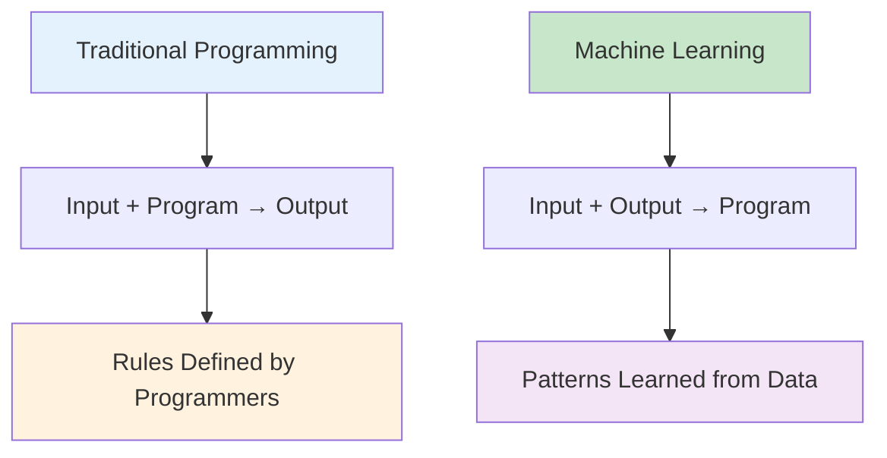
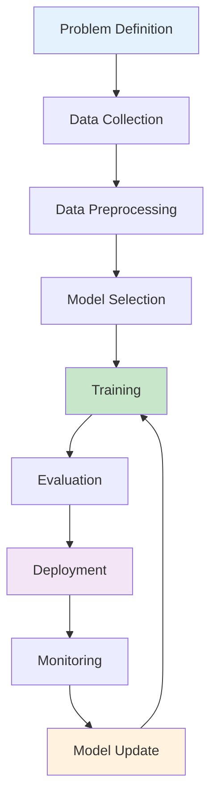

# Machine Learning Fundamentals: From Concept to Implementation

Machine Learning (ML) is a subset of artificial intelligence that enables systems to learn and improve from experience without being explicitly programmed. It's the science of getting computers to learn and act like humans do, and improve their learning over time in autonomous fashion, by feeding them data and information in the form of observations and real-world interactions.

## Table of Contents
1. [What is Machine Learning?](#what-is-machine-learning)
2. [Types of Machine Learning](#types-of-machine-learning)
3. [The ML Process](#the-ml-process)
4. [Key Algorithms Overview](#key-algorithms-overview)
5. [Mathematical Foundations](#mathematical-foundations)
6. [Model Evaluation](#model-evaluation)
7. [Machine Learning Libraries](#machine-learning-libraries)
8. [Implementation Example](#implementation-example)
9. [Common Challenges](#common-challenges)
10. [Future Directions](#future-directions)

## What is Machine Learning? {#what-is-machine-learning}

Machine learning is a method of data analysis that automates analytical model building. It's a branch of artificial intelligence based on the idea that systems can learn from data, identify patterns and make decisions with minimal human intervention.

### The Evolution of Machine Learning



Traditional programming follows a "input + program → output" approach, where humans write explicit instructions. Machine learning inverts this approach to "input + output → program", where the system learns the program from data.

### Key Characteristics of ML

1. **Learning from Data**: ML algorithms improve performance based on experience
2. **Automatic Pattern Recognition**: Systems identify patterns without explicit programming
3. **Generalization**: Models apply learned patterns to new, unseen data
4. **Adaptation**: Systems adjust to changing data patterns over time

```python
# Example: Simple learning concept
class SimpleLearner:
    def __init__(self):
        self.knowledge = {}
    
    def learn(self, data):
        """
        Learn patterns from data
        """
        for item in data:
            category = item['category']
            if category not in self.knowledge:
                self.knowledge[category] = []
            self.knowledge[category].append(item['value'])
    
    def predict(self, new_input):
        """
        Make predictions based on learned knowledge
        """
        # This is a simplified example
        for category, values in self.knowledge.items():
            if new_input in values:
                return category
        return "unknown"

# Example usage
learner = SimpleLearner()
training_data = [
    {'category': 'fruit', 'value': 'apple'},
    {'category': 'fruit', 'value': 'banana'},
    {'category': 'fruit', 'value': 'orange'},
    {'category': 'vegetable', 'value': 'carrot'},
    {'category': 'vegetable', 'value': 'broccoli'}
]

learner.learn(training_data)
prediction = learner.predict('apple')
print(f"Prediction for 'apple': {prediction}")
```

## Types of Machine Learning {#types-of-machine-learning}

### 1. Supervised Learning

Supervised learning uses labeled training data to learn a mapping from inputs to outputs.

- **Goal**: Learn a function that maps input to output based on example input-output pairs
- **Applications**: Classification, regression
- **Examples**: Email spam detection, house price prediction

```python
# Example: Supervised learning concept
import numpy as np
from sklearn.linear_model import LinearRegression
import matplotlib.pyplot as plt

# Generate sample data
np.random.seed(42)
X = np.random.rand(100, 1) * 10
y = 2.5 * X.flatten() + 1.5 + np.random.randn(100) * 2  # y = 2.5x + 1.5 + noise

# Supervised learning: learn from (X, y) pairs
model = LinearRegression()
model.fit(X, y)

# Make predictions
predictions = model.predict(X)

print(f"Learned slope: {model.coef_[0]:.2f}")
print(f"Learned intercept: {model.intercept_:.2f}")
print(f"True relationship: y = 2.5x + 1.5")

# Visualize
plt.figure(figsize=(10, 6))
plt.scatter(X, y, alpha=0.6, label='Training Data')
plt.plot(X, predictions, color='red', label='Learned Function')
plt.xlabel('Input (X)')
plt.ylabel('Output (y)')
plt.title('Supervised Learning: Learning a Function from Data')
plt.legend()
plt.show()
```

### 2. Unsupervised Learning

Unsupervised learning finds hidden patterns or intrinsic structures in data without labeled examples.

- **Goal**: Discover patterns in data without supervision
- **Applications**: Clustering, dimensionality reduction, anomaly detection
- **Examples**: Customer segmentation, anomaly detection

```python
# Example: Unsupervised learning concept
from sklearn.cluster import KMeans
from sklearn.datasets import make_blobs

# Generate sample data
X, _ = make_blobs(n_samples=300, centers=4, cluster_std=0.60, random_state=42)

# Unsupervised learning: find patterns without labels
kmeans = KMeans(n_clusters=4, random_state=42)
cluster_labels = kmeans.fit_predict(X)

# Visualize clusters
plt.figure(figsize=(10, 6))
plt.scatter(X[:, 0], X[:, 1], c=cluster_labels, cmap='viridis', alpha=0.6)
plt.scatter(kmeans.cluster_centers_[:, 0], kmeans.cluster_centers_[:, 1], 
            c='red', marker='x', s=200, linewidths=3, label='Centroids')
plt.title('Unsupervised Learning: Discovering Clusters in Data')
plt.legend()
plt.show()
```

### 3. Reinforcement Learning

Reinforcement learning learns to take actions in an environment to maximize cumulative reward.

- **Goal**: Learn optimal behavior through trial and error
- **Applications**: Gaming, robotics, autonomous systems
- **Examples**: Game playing, robot navigation

```python
# Example: Reinforcement learning concept
class SimpleEnvironment:
    def __init__(self):
        self.position = 0
        self.goal = 10
        self.rewards = {'move_left': -1, 'move_right': 1, 'reach_goal': 100}
    
    def move(self, action):
        if action == 'left':
            self.position -= 1
        elif action == 'right':
            self.position += 1
        
        # Calculate reward
        if self.position == self.goal:
            reward = self.rewards['reach_goal']
        elif action == 'right':
            reward = self.rewards['move_right']
        else:
            reward = self.rewards['move_left']
        
        return reward, self.position == self.goal  # return reward and if done

# Simple learning approach
env = SimpleEnvironment()
for episode in range(5):
    env.position = 0  # Reset position
    total_reward = 0
    
    for step in range(20):  # Max steps
        # Simple strategy: move right if not at goal
        action = 'right' if env.position < env.goal else 'left'
        reward, done = env.move(action)
        total_reward += reward
        
        if done:
            print(f"Episode {episode + 1}: Reached goal with total reward {total_reward}")
            break
    
    if not done:
        print(f"Episode {episode + 1}: Ended with total reward {total_reward}")
```

## The ML Process {#the-ml-process}

### The Machine Learning Lifecycle



### 1. Problem Definition
- Define clear, answerable questions
- Identify the type of ML problem (classification, regression, clustering)
- Establish success metrics and evaluation criteria

### 2. Data Collection
- Gather relevant data from various sources
- Ensure data quality and representativeness
- Document data sources and collection methods

### 3. Data Preprocessing
- Clean data (handle missing values, remove duplicates)
- Transform features (scaling, encoding)
- Split data (train, validation, test)

### 4. Model Selection
- Choose appropriate algorithms based on problem type
- Consider computational requirements and interpretability
- Start with simple models and increase complexity

### 5. Training
- Fit the model to training data
- Tune hyperparameters
- Validate on validation set

### 6. Evaluation
- Test on unseen test data
- Calculate performance metrics
- Analyze results and limitations

### 7. Deployment
- Integrate model into production system
- Set up monitoring and logging
- Plan for model updates

### 8. Monitoring and Updating
- Track model performance over time
- Detect concept drift
- Retrain as needed

```python
# Example: Complete ML process implementation
import pandas as pd
from sklearn.model_selection import train_test_split
from sklearn.preprocessing import StandardScaler
from sklearn.ensemble import RandomForestClassifier
from sklearn.metrics import accuracy_score, classification_report
from sklearn.datasets import load_iris

def ml_process_example():
    """
    Complete ML process example using Iris dataset
    """
    # 1. Problem Definition
    print("Problem: Classify iris species based on measurements")
    
    # 2. Data Collection
    iris = load_iris()
    X = pd.DataFrame(iris.data, columns=iris.feature_names)
    y = pd.Series(iris.target, name='species')
    
    print(f"Dataset shape: {X.shape}")
    print(f"Target classes: {iris.target_names}")
    
    # 3. Data Preprocessing
    # Split data
    X_train, X_test, y_train, y_test = train_test_split(
        X, y, test_size=0.2, random_state=42, stratify=y
    )
    
    # Scale features
    scaler = StandardScaler()
    X_train_scaled = scaler.fit_transform(X_train)
    X_test_scaled = scaler.transform(X_test)
    
    print(f"Training set shape: {X_train_scaled.shape}")
    print(f"Test set shape: {X_test_scaled.shape}")
    
    # 4. Model Selection and Training
    model = RandomForestClassifier(n_estimators=100, random_state=42)
    model.fit(X_train_scaled, y_train)
    
    # 5. Evaluation
    y_pred = model.predict(X_test_scaled)
    accuracy = accuracy_score(y_test, y_pred)
    
    print(f"Model Accuracy: {accuracy:.3f}")
    print("\nClassification Report:")
    print(classification_report(y_test, y_pred, target_names=iris.target_names))
    
    # 6. Feature Importance
    feature_importance = pd.DataFrame({
        'feature': X.columns,
        'importance': model.feature_importances_
    }).sort_values('importance', ascending=False)
    
    print("\nFeature Importance:")
    print(feature_importance)
    
    return model, scaler, accuracy

# Run the example
model, scaler, accuracy = ml_process_example()
```

## Key Algorithms Overview {#key-algorithms-overview}

### Supervised Learning Algorithms

```python
from sklearn.linear_model import LogisticRegression
from sklearn.tree import DecisionTreeClassifier
from sklearn.svm import SVC
from sklearn.neighbors import KNeighborsClassifier
import numpy as np

# Generate sample data
from sklearn.datasets import make_classification
X, y = make_classification(n_samples=1000, n_features=4, n_classes=2, 
                          n_redundant=0, n_informative=4, random_state=42)

X_train, X_test, y_train, y_test = train_test_split(X, y, test_size=0.2, random_state=42)

# Different algorithms comparison
algorithms = {
    'Logistic Regression': LogisticRegression(),
    'Decision Tree': DecisionTreeClassifier(random_state=42),
    'SVM': SVC(random_state=42),
    'K-NN': KNeighborsClassifier()
}

results = {}
for name, algorithm in algorithms.items():
    # Train
    algorithm.fit(X_train, y_train)
    # Predict
    y_pred = algorithm.predict(X_test)
    # Evaluate
    accuracy = accuracy_score(y_test, y_pred)
    results[name] = accuracy
    print(f"{name} Accuracy: {accuracy:.3f}")

# Best algorithm
best_algorithm = max(results, key=results.get)
print(f"\nBest algorithm: {best_algorithm} with accuracy {results[best_algorithm]:.3f}")
```

### Unsupervised Learning Algorithms

```python
from sklearn.cluster import KMeans, DBSCAN
from sklearn.decomposition import PCA
from sklearn.preprocessing import StandardScaler

# Generate sample data for clustering
X_cluster, _ = make_classification(n_samples=300, n_features=4, n_classes=3, 
                                  n_redundant=0, n_informative=4, random_state=42, 
                                  n_clusters_per_class=1)

# Standardize the data
scaler = StandardScaler()
X_cluster_scaled = scaler.fit_transform(X_cluster)

# Clustering algorithms
kmeans = KMeans(n_clusters=3, random_state=42)
dbscan = DBSCAN(eps=0.5, min_samples=5)

kmeans_labels = kmeans.fit_predict(X_cluster_scaled)
dbscan_labels = dbscan.fit_predict(X_cluster_scaled)

print(f"K-Means found {len(np.unique(kmeans_labels))} clusters")
print(f"DBSCAN found {len(np.unique(dbscan_labels))} clusters")

# Dimensionality reduction
pca = PCA(n_components=2)
X_pca = pca.fit_transform(X_cluster_scaled)

print(f"PCA explained variance ratio: {pca.explained_variance_ratio_}")
print(f"Total variance explained: {sum(pca.explained_variance_ratio_):.2f}")
```

## Mathematical Foundations {#mathematical-foundations}

### 1. Linear Algebra in ML

Linear algebra is fundamental to machine learning algorithms:

- **Vectors**: Represent data points
- **Matrices**: Represent datasets and transformations
- **Dot Product**: Measure similarity between vectors

```python
import numpy as np

# Example: Linear algebra concepts in ML
def linear_algebra_ml():
    # Data matrix: rows are samples, columns are features
    X = np.array([
        [1.0, 2.0, 3.0],  # Sample 1
        [4.0, 5.0, 6.0],  # Sample 2
        [7.0, 8.0, 9.0],  # Sample 3
    ])
    
    # Weight vector for a linear model
    w = np.array([0.5, 0.3, 0.2])
    
    # Predictions: X @ w (matrix multiplication)
    predictions = X @ w
    print(f"Predictions: {predictions}")
    
    # Mean calculation using matrix operations
    mean_vector = np.mean(X, axis=0)
    print(f"Feature means: {mean_vector}")
    
    # Covariance matrix
    X_centered = X - mean_vector
    cov_matrix = (X_centered.T @ X_centered) / (X.shape[0] - 1)
    print(f"Covariance matrix:\n{cov_matrix}")

linear_algebra_ml()
```

### 2. Calculus in ML

Calculus is used for optimization (finding model parameters):

- **Derivatives**: Calculate gradients for optimization
- **Gradient Descent**: Find minimum of loss function

```python
def gradient_descent_example():
    """
    Simple gradient descent example
    """
    # Define a simple quadratic loss function: f(x) = (x-3)^2
    def loss_function(x):
        return (x - 3) ** 2
    
    # Derivative: f'(x) = 2*(x-3)
    def gradient(x):
        return 2 * (x - 3)
    
    # Gradient descent
    x = 10.0  # Starting point
    learning_rate = 0.1
    iterations = 20
    
    print("Gradient Descent Optimization:")
    print(f"Starting x: {x}")
    
    for i in range(iterations):
        grad = gradient(x)
        x = x - learning_rate * grad
        loss = loss_function(x)
        print(f"Iteration {i+1}: x={x:.3f}, loss={loss:.3f}")
    
    print(f"Optimized x: {x:.3f} (should be close to 3)")
    print(f"Optimized loss: {loss_function(x):.3f} (should be close to 0)")

gradient_descent_example()
```

### 3. Probability and Statistics in ML

Probability and statistics provide the foundation for understanding uncertainty in ML:

```python
def probability_ml_concepts():
    """
    Probability concepts in ML
    """
    # Example: Naive Bayes classifier concept
    # P(class|features) = P(features|class) * P(class) / P(features)
    
    # Prior probabilities
    prior_positive = 0.7  # 70% of emails are spam
    prior_negative = 0.3  # 30% of emails are not spam
    
    # Likelihood: P(word|class)
    likelihood_spam = 0.8  # 80% of spam emails contain "free"
    likelihood_ham = 0.1   # 10% of non-spam emails contain "free"
    
    # If we see "free" in an email, what's the probability it's spam?
    # Using Bayes theorem: P(spam|free) = P(free|spam) * P(spam) / P(free)
    
    # P(free) = P(free|spam)*P(spam) + P(free|ham)*P(ham)
    prob_free = (likelihood_spam * prior_positive) + (likelihood_ham * prior_negative)
    
    # Posterior probability
    posterior = (likelihood_spam * prior_positive) / prob_free
    
    print("Bayesian Reasoning Example (Email Spam Detection):")
    print(f"Prior probability of spam: {prior_positive}")
    print(f"P(free|spam): {likelihood_spam}")
    print(f"P(free|ham): {likelihood_ham}")
    print(f"P(spam|free): {posterior:.3f}")
    
    return posterior

probability_ml_concepts()
```

## Model Evaluation {#model-evaluation}

### Classification Metrics

```python
from sklearn.metrics import confusion_matrix, precision_score, recall_score, f1_score
import matplotlib.pyplot as plt
import seaborn as sns

def classification_metrics_example():
    """
    Example of classification metrics
    """
    # Simulated predictions
    y_true = [0, 1, 1, 0, 1, 1, 0, 0, 1, 0]  # True labels
    y_pred = [0, 1, 0, 0, 1, 1, 0, 1, 1, 0]  # Predicted labels
    
    # Confusion matrix
    cm = confusion_matrix(y_true, y_pred)
    
    # Calculate metrics
    precision = precision_score(y_true, y_pred)
    recall = recall_score(y_true, y_pred)
    f1 = f1_score(y_true, y_pred)
    
    print("Classification Metrics:")
    print(f"Precision: {precision:.3f}")
    print(f"Recall: {recall:.3f}")
    print(f"F1-Score: {f1:.3f}")
    
    # Visualize confusion matrix
    plt.figure(figsize=(6, 4))
    sns.heatmap(cm, annot=True, fmt='d', cmap='Blues', 
                xticklabels=['Predicted 0', 'Predicted 1'],
                yticklabels=['Actual 0', 'Actual 1'])
    plt.title('Confusion Matrix')
    plt.show()
    
    return precision, recall, f1

classification_metrics_example()
```

### Regression Metrics

```python
from sklearn.metrics import mean_squared_error, mean_absolute_error, r2_score

def regression_metrics_example():
    """
    Example of regression metrics
    """
    # Simulated predictions
    y_true = [3, -0.5, 2, 7, 4.2]
    y_pred = [2.5, 0.0, 2, 8, 4.1]
    
    # Calculate metrics
    mse = mean_squared_error(y_true, y_pred)
    rmse = np.sqrt(mse)
    mae = mean_absolute_error(y_true, y_pred)
    r2 = r2_score(y_true, y_pred)
    
    print("Regression Metrics:")
    print(f"MSE: {mse:.3f}")
    print(f"RMSE: {rmse:.3f}")
    print(f"MAE: {mae:.3f}")
    print(f"R²: {r2:.3f}")
    
    # Visualize predictions vs actual
    plt.figure(figsize=(10, 6))
    plt.scatter(y_true, y_pred, alpha=0.6)
    plt.plot([min(y_true), max(y_true)], [min(y_true), max(y_true)], 'r--', lw=2)
    plt.xlabel('Actual Values')
    plt.ylabel('Predicted Values')
    plt.title(f'Actual vs Predicted Values (R² = {r2:.3f})')
    plt.show()
    
    return mse, rmse, mae, r2

regression_metrics_example()
```

## Machine Learning Libraries {#machine-learning-libraries}

### Scikit-learn: The Standard Library

```python
from sklearn.model_selection import cross_val_score
from sklearn.pipeline import Pipeline
from sklearn.preprocessing import StandardScaler
from sklearn.linear_model import LogisticRegression
from sklearn.ensemble import RandomForestClassifier

def sklearn_pipeline_example():
    """
    Example using scikit-learn pipeline
    """
    # Load data
    iris = load_iris()
    X, y = iris.data, iris.target
    
    # Create pipeline: scaling + modeling
    pipeline = Pipeline([
        ('scaler', StandardScaler()),
        ('classifier', RandomForestClassifier(n_estimators=100, random_state=42))
    ])
    
    # Cross-validation
    cv_scores = cross_val_score(pipeline, X, y, cv=5)
    
    print("Pipeline with Cross-Validation:")
    print(f"CV Scores: {cv_scores}")
    print(f"Mean CV Score: {cv_scores.mean():.3f} (+/- {cv_scores.std() * 2:.3f})")
    
    # Fit the pipeline
    pipeline.fit(X, y)
    
    # Make predictions
    sample_input = [[5.1, 3.5, 1.4, 0.2]]  # New flower measurements
    prediction = pipeline.predict(sample_input)
    prediction_proba = pipeline.predict_proba(sample_input)
    
    print(f"\nPrediction for sample: {iris.target_names[prediction[0]]}")
    print(f"Prediction probabilities: {prediction_proba[0]}")
    
    return pipeline

sklearn_pipeline_example()
```

## Implementation Example {#implementation-example}

Let's build a complete machine learning project from scratch:

```python
import pandas as pd
import numpy as np
from sklearn.model_selection import train_test_split, GridSearchCV
from sklearn.preprocessing import StandardScaler, LabelEncoder
from sklearn.ensemble import RandomForestClassifier
from sklearn.linear_model import LogisticRegression
from sklearn.metrics import classification_report, confusion_matrix
import matplotlib.pyplot as plt
import seaborn as sns

def complete_ml_project():
    """
    Complete machine learning project example
    """
    # Step 1: Load and explore data
    print("Step 1: Loading and exploring data")
    
    # Create a synthetic dataset (in practice, load from CSV, database, etc.)
    np.random.seed(42)
    n_samples = 1000
    
    # Features
    age = np.random.normal(35, 10, n_samples)
    income = np.random.normal(50000, 15000, n_samples)
    score = np.random.normal(70, 15, n_samples)
    
    # Target variable (based on features with some noise)
    target = ((age > 30) & (income > 45000) & (score > 60)).astype(int)
    target = np.random.binomial(1, target * 0.8 + 0.1, n_samples)  # Add noise
    
    # Create DataFrame
    df = pd.DataFrame({
        'age': age,
        'income': income,
        'score': score,
        'target': target
    })
    
    print(f"Dataset shape: {df.shape}")
    print(f"Target distribution:\n{df['target'].value_counts()}")
    
    # Step 2: Data preprocessing
    print("\nStep 2: Data preprocessing")
    
    # Handle outliers using IQR method
    Q1 = df.quantile(0.25)
    Q3 = df.quantile(0.75)
    IQR = Q3 - Q1
    
    # Remove outliers
    df_clean = df[~((df < (Q1 - 1.5 * IQR)) | (df > (Q3 + 1.5 * IQR))).any(axis=1)]
    print(f"Shape after outlier removal: {df_clean.shape}")
    
    # Separate features and target
    X = df_clean.drop('target', axis=1)
    y = df_clean['target']
    
    # Step 3: Split data
    X_train, X_test, y_train, y_test = train_test_split(
        X, y, test_size=0.2, random_state=42, stratify=y
    )
    
    # Step 4: Feature scaling
    scaler = StandardScaler()
    X_train_scaled = scaler.fit_transform(X_train)
    X_test_scaled = scaler.transform(X_test)
    
    # Step 5: Model training and hyperparameter tuning
    print("\nStep 5: Model training and tuning")
    
    # Define models and parameters to tune
    models = {
        'Logistic Regression': {
            'model': LogisticRegression(random_state=42),
            'params': {
                'C': [0.1, 1, 10, 100],
                'penalty': ['l1', 'l2'],
                'solver': ['liblinear']  # for l1 penalty
            }
        },
        'Random Forest': {
            'model': RandomForestClassifier(random_state=42),
            'params': {
                'n_estimators': [50, 100, 200],
                'max_depth': [3, 5, 7, None],
                'min_samples_split': [2, 5, 10]
            }
        }
    }
    
    best_models = {}
    for name, config in models.items():
        print(f"Tuning {name}...")
        grid_search = GridSearchCV(
            config['model'], 
            config['params'], 
            cv=5, 
            scoring='accuracy',
            n_jobs=-1
        )
        grid_search.fit(X_train_scaled, y_train)
        
        best_models[name] = {
            'model': grid_search.best_estimator_,
            'score': grid_search.best_score_,
            'params': grid_search.best_params_
        }
        
        print(f"Best {name} CV score: {grid_search.best_score_:.3f}")
    
    # Step 6: Model evaluation
    print("\nStep 6: Model evaluation on test set")
    
    for name, results in best_models.items():
        model = results['model']
        test_score = model.score(X_test_scaled, y_test)
        
        print(f"\n{name}:")
        print(f"CV Score: {results['score']:.3f}")
        print(f"Test Score: {test_score:.3f}")
        print(f"Best Parameters: {results['params']}")
        
        # Detailed classification report
        y_pred = model.predict(X_test_scaled)
        print("Classification Report:")
        print(classification_report(y_test, y_pred))
    
    # Step 7: Feature importance (for Random Forest)
    rf_model = best_models['Random Forest']['model']
    feature_importance = pd.DataFrame({
        'feature': X.columns,
        'importance': rf_model.feature_importances_
    }).sort_values('importance', ascending=False)
    
    print("\nFeature Importance (Random Forest):")
    print(feature_importance)
    
    # Visualize feature importance
    plt.figure(figsize=(10, 6))
    sns.barplot(data=feature_importance, x='importance', y='feature')
    plt.title('Feature Importance')
    plt.xlabel('Importance')
    plt.show()
    
    return best_models, scaler

# Run the complete project
best_models, scaler = complete_ml_project()
```

## Common Challenges {#common-challenges}

### 1. Overfitting and Underfitting

```python
from sklearn.model_selection import learning_curve
from sklearn.tree import DecisionTreeClassifier

def visualize_bias_variance():
    """
    Visualize overfitting and learning curves
    """
    from sklearn.datasets import make_classification
    
    # Generate dataset
    X, y = make_classification(n_samples=1000, n_features=20, 
                              n_informative=10, n_redundant=10, 
                              random_state=42)
    
    X_train, X_test, y_train, y_test = train_test_split(X, y, test_size=0.2, random_state=42)
    
    # Create models with different complexity
    models = {
        'Underfit': DecisionTreeClassifier(max_depth=2, random_state=42),
        'Good Fit': DecisionTreeClassifier(max_depth=5, random_state=42),
        'Overfit': DecisionTreeClassifier(max_depth=20, random_state=42)
    }
    
    fig, axes = plt.subplots(1, 3, figsize=(15, 5))
    
    for idx, (name, model) in enumerate(models.items()):
        # Calculate learning curves
        train_sizes, train_scores, val_scores = learning_curve(
            model, X_train, y_train, cv=5, 
            train_sizes=np.linspace(0.1, 1.0, 10)
        )
        
        # Calculate mean and std
        train_mean = np.mean(train_scores, axis=1)
        train_std = np.std(train_scores, axis=1)
        val_mean = np.mean(val_scores, axis=1)
        val_std = np.std(val_scores, axis=1)
        
        # Plot
        axes[idx].plot(train_sizes, train_mean, 'o-', color='blue', label='Training Score')
        axes[idx].fill_between(train_sizes, train_mean - train_std, train_mean + train_std, alpha=0.1, color='blue')
        
        axes[idx].plot(train_sizes, val_mean, 'o-', color='red', label='Validation Score')
        axes[idx].fill_between(train_sizes, val_mean - val_std, val_mean + val_std, alpha=0.1, color='red')
        
        axes[idx].set_title(f'{name} Model\nMax Depth: {model.max_depth}')
        axes[idx].set_xlabel('Training Size')
        axes[idx].set_ylabel('Score')
        axes[idx].legend()
        axes[idx].grid(True)
    
    plt.tight_layout()
    plt.show()

visualize_bias_variance()
```

### 2. Data Quality Issues

```python
def data_quality_check(df, target_column):
    """
    Check data quality issues
    """
    print("Data Quality Assessment:")
    print(f"Dataset shape: {df.shape}")
    
    # Missing values
    missing_data = df.isnull().sum()
    missing_percent = 100 * missing_data / len(df)
    missing_table = pd.DataFrame({
        'Missing Count': missing_data,
        'Missing Percentage': missing_percent
    })
    print("\nMissing Data Summary:")
    print(missing_table[missing_table['Missing Count'] > 0])
    
    # Duplicate rows
    duplicates = df.duplicated().sum()
    print(f"\nDuplicate rows: {duplicates}")
    
    # Data types
    print(f"\nData types:")
    print(df.dtypes)
    
    # Outliers (using IQR method)
    numeric_columns = df.select_dtypes(include=[np.number]).columns
    outliers_info = {}
    
    for col in numeric_columns:
        if col != target_column:
            Q1 = df[col].quantile(0.25)
            Q3 = df[col].quantile(0.75)
            IQR = Q3 - Q1
            lower_bound = Q1 - 1.5 * IQR
            upper_bound = Q3 + 1.5 * IQR
            outliers = df[(df[col] < lower_bound) | (df[col] > upper_bound)]
            outliers_info[col] = len(outliers)
    
    print(f"\nOutliers per column:")
    for col, count in outliers_info.items():
        print(f"{col}: {count}")
    
    return missing_table, duplicates, outliers_info

# Example usage with a sample dataset
sample_data = pd.DataFrame({
    'feature1': [1, 2, np.nan, 4, 5, 6, 7, 8, 9, 100],  # 100 is an outlier
    'feature2': [10, 20, 30, 40, 50, 60, 70, 80, 90, 100],
    'target': [0, 1, 0, 1, 0, 1, 0, 1, 0, 1]
})

data_quality_check(sample_data, 'target')
```

## Future Directions {#future-directions}

### 1. Automated Machine Learning (AutoML)

```python
def automl_concept():
    """
    Concept of AutoML - automated machine learning
    """
    print("AutoML automates the process of:")
    print("• Feature engineering")
    print("• Model selection") 
    print("• Hyperparameter tuning")
    print("• Model validation")
    print("• Model deployment")
    
    # Simplified AutoML process
    def simple_automl(X, y):
        from sklearn.ensemble import RandomForestClassifier, GradientBoostingClassifier
        from sklearn.svm import SVC
        from sklearn.linear_model import LogisticRegression
        from sklearn.model_selection import cross_val_score
        
        models = {
            'Random Forest': RandomForestClassifier(),
            'Gradient Boosting': GradientBoostingClassifier(),
            'SVM': SVC(),
            'Logistic Regression': LogisticRegression()
        }
        
        best_score = 0
        best_model = None
        
        for name, model in models.items():
            scores = cross_val_score(model, X, y, cv=5)
            avg_score = scores.mean()
            print(f"{name}: CV Score = {avg_score:.3f}")
            
            if avg_score > best_score:
                best_score = avg_score
                best_model = model
        
        print(f"\nBest model: {max(models.keys(), key=lambda x: cross_val_score(models[x], X, y, cv=5).mean())}")
        return best_model
    
    # Example usage
    from sklearn.datasets import make_classification
    X, y = make_classification(n_samples=1000, n_features=10, n_classes=2, random_state=42)
    best_model = simple_automl(X, y)

automl_concept()
```

### 2. Explainable AI (XAI)

```python
def explainable_ai_example():
    """
    Concept of explainable AI
    """
    # Use a simple interpretable model as an example
    from sklearn.linear_model import LogisticRegression
    from sklearn.datasets import make_classification
    
    # Generate data
    X, y = make_classification(n_samples=1000, n_features=4, n_classes=2, random_state=42)
    
    # Train interpretable model
    model = LogisticRegression()
    model.fit(X, y)
    
    # Feature importance (coefficients in logistic regression)
    feature_names = [f'Feature_{i}' for i in range(X.shape[1])]
    importance = pd.DataFrame({
        'feature': feature_names,
        'coefficient': model.coef_[0],
        'abs_coefficient': np.abs(model.coef_[0])
    }).sort_values('abs_coefficient', ascending=False)
    
    print("Feature Importance (Logistic Regression):")
    print(importance)
    print(f"\nIntercept: {model.intercept_[0]:.3f}")
    
    # Prediction explanation
    sample_idx = 0
    sample_features = X[sample_idx]
    prediction_prob = model.predict_proba([sample_features])[0]
    
    print(f"\nPrediction for sample {sample_idx}:")
    print(f"Class 0 probability: {prediction_prob[0]:.3f}")
    print(f"Class 1 probability: {prediction_prob[1]:.3f}")
    
    # Component-wise contribution
    contributions = sample_features * model.coef_[0]
    contrib_df = pd.DataFrame({
        'feature': feature_names,
        'value': sample_features,
        'coefficient': model.coef_[0],
        'contribution': contributions
    })
    
    print(f"\nFeature contributions to prediction:")
    print(contrib_df)

explainable_ai_example()
```

## Conclusion {#conclusion}

Machine learning is a powerful tool for extracting insights from data and making predictions. Key takeaways include:

### Core Concepts:
- **Learning Types**: Supervised, unsupervised, and reinforcement learning
- **ML Process**: Systematic approach from problem definition to deployment
- **Evaluation**: Critical for understanding model performance
- **Mathematical Foundation**: Essential for understanding how algorithms work

### Practical Considerations:
- **Data Quality**: High-quality data is crucial for ML success
- **Feature Engineering**: Often more important than model selection
- **Validation**: Proper validation prevents overfitting and ensures generalization
- **Interpretability**: Understanding model decisions is increasingly important

### Future Trends:
- **Automation**: AutoML is making ML more accessible
- **Explainability**: XAI is addressing the black-box problem
- **Specialization**: Domain-specific ML applications are growing
- **Ethics**: Responsible AI practices are becoming essential

**🎯 Next Steps**: With this foundation in ML fundamentals, you're ready to explore different types of machine learning in detail.

Machine learning continues to evolve rapidly, with new algorithms, techniques, and applications emerging regularly. Success in ML requires a balance of theoretical understanding and practical implementation skills.

---

*Next in series: [Types of Machine Learning](/blog/machine-learning/introduction/types-of-learning) | Previous: None*