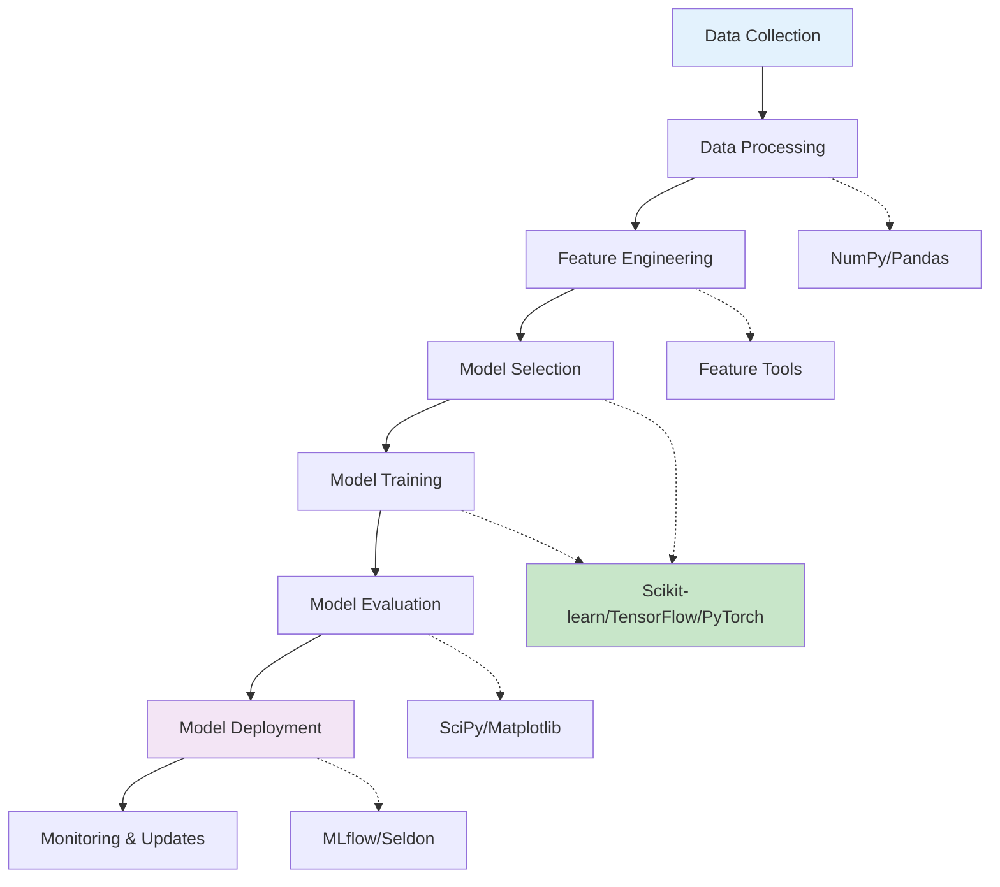

# Machine Learning Libraries Overview: Scikit-learn, TensorFlow, PyTorch, and More

Machine learning libraries abstract complex mathematical operations into user-friendly APIs, enabling practitioners to focus on model development rather than implementation details. The Python ecosystem offers a rich collection of libraries that cater to different aspects of machine learning, from preprocessing to model deployment.

## Table of Contents
1. [The ML Library Ecosystem](#the-ml-library-ecosystem)
2. [Scikit-learn: The Foundation](#scikit-learn-the-foundation)
3. [Deep Learning Frameworks](#deep-learning-frameworks)
4. [Gradient Boosting Libraries](#gradient-boosting-libraries)
5. [Data Processing Libraries](#data-processing-libraries)
6. [Specialized Libraries](#specialized-libraries)
7. [Choosing the Right Library](#choosing-the-right-library)
8. [Practical Implementation Examples](#practical-implementation-examples)
9. [Performance Considerations](#performance-considerations)
10. [Future Trends](#future-trends)

## The ML Library Ecosystem {#the-ml-library-ecosystem}

The machine learning ecosystem is interconnected, with each library serving a specific purpose in the ML workflow:



### Library Taxonomy

```python
def ml_library_taxonomy():
    """
    Overview of ML library categories
    """
    categories = {
        "Core Libraries": ["NumPy", "Pandas", "Matplotlib", "SciPy"],
        "Traditional ML": ["Scikit-learn", "Statsmodels"],
        "Deep Learning": ["TensorFlow", "PyTorch", "Keras"],
        "Boosting": ["XGBoost", "LightGBM", "CatBoost"],
        "Specialized": ["NLTK", "SpaCy", "OpenCV", "Librosa"],
        "MLOps": ["MLflow", "Kubeflow", "DVC", "Weights & Biases"]
    }
    
    print("Machine Learning Library Categories:")
    for category, libraries in categories.items():
        print(f"• {category}: {', '.join(libraries)}")

ml_library_taxonomy()
```

### The Foundation Libraries

```python
import numpy as np
import pandas as pd
import matplotlib.pyplot as plt
import seaborn as sns

def foundation_libraries():
    """
    Demonstrate core foundation libraries
    """
    print("Foundation Libraries in ML:")
    
    # NumPy: Numerical computing
    print("\n1. NumPy - Numerical Computing")
    arr = np.random.rand(100, 5)
    print(f"   Array shape: {arr.shape}")
    print(f"   Array mean: {np.mean(arr):.3f}")
    print(f"   Array std: {np.std(arr):.3f}")
    
    # Pandas: Data manipulation
    print("\n2. Pandas - Data Manipulation")
    df = pd.DataFrame(arr, columns=[f'feature_{i}' for i in range(5)])
    df['target'] = np.random.choice([0, 1], size=len(df))
    print(f"   DataFrame shape: {df.shape}")
    print(f"   Target distribution:\n{df['target'].value_counts()}")
    
    # Matplotlib: Basic visualization
    print("\n3. Matplotlib - Basic Visualization")
    plt.figure(figsize=(12, 4))
    
    plt.subplot(1, 3, 1)
    plt.hist(df['feature_0'], bins=20)
    plt.title('Feature Distribution')
    plt.xlabel('Value')
    plt.ylabel('Frequency')
    
    plt.subplot(1, 3, 2)
    plt.scatter(df['feature_0'], df['feature_1'], c=df['target'], cmap='viridis')
    plt.title('Feature Scatter Plot')
    plt.xlabel('Feature 0')
    plt.ylabel('Feature 1')
    
    plt.subplot(1, 3, 3)
    df.boxplot(ax=plt.gca())
    plt.title('Feature Box Plots')
    plt.xticks(rotation=45)
    
    plt.tight_layout()
    plt.show()
    
    return df

data_frame = foundation_libraries()
```

## Scikit-learn: The Foundation {#scikit-learn-the-foundation}

Scikit-learn is the cornerstone of traditional machine learning in Python, providing a consistent API for algorithms and utilities.

### Core Concepts in Scikit-learn

```python
from sklearn.model_selection import train_test_split
from sklearn.preprocessing import StandardScaler
from sklearn.ensemble import RandomForestClassifier
from sklearn.linear_model import LogisticRegression
from sklearn.metrics import classification_report, confusion_matrix
from sklearn.pipeline import Pipeline
from sklearn.impute import SimpleImputer
from sklearn.compose import ColumnTransformer

def scikit_learn_fundamentals():
    """
    Demonstrate Scikit-learn fundamentals
    """
    print("Scikit-learn Fundamentals:")
    
    # Generate sample data
    from sklearn.datasets import make_classification
    X, y = make_classification(n_samples=1000, n_features=10, n_informative=5, 
                              n_redundant=2, n_clusters_per_class=1, random_state=42)
    
    # Split the data
    X_train, X_test, y_train, y_test = train_test_split(
        X, y, test_size=0.2, random_state=42, stratify=y
    )
    
    print(f"Training data shape: {X_train.shape}")
    print(f"Test data shape: {X_test.shape}")
    print(f"Training target distribution: {np.bincount(y_train)}")
    
    # Different approaches to building models
    print("\n1. Basic Approach:")
    scaler = StandardScaler()
    X_train_scaled = scaler.fit_transform(X_train)
    X_test_scaled = scaler.transform(X_test)
    
    model = RandomForestClassifier(n_estimators=100, random_state=42)
    model.fit(X_train_scaled, y_train)
    
    accuracy = model.score(X_test_scaled, y_test)
    print(f"Random Forest Accuracy: {accuracy:.3f}")
    
    print("\n2. Pipeline Approach (Recommended):")
    pipeline = Pipeline([
        ('scaler', StandardScaler()),
        ('classifier', RandomForestClassifier(n_estimators=100, random_state=42))
    ])
    
    pipeline.fit(X_train, y_train)
    pipeline_accuracy = pipeline.score(X_test, y_test)
    print(f"Pipeline Accuracy: {pipeline_accuracy:.3f}")
    
    # Evaluate the pipeline
    y_pred = pipeline.predict(X_test)
    print(f"\nClassification Report:")
    print(classification_report(y_test, y_pred))
    
    return pipeline, (X_train, X_test, y_train, y_test)

sklearn_pipeline, data_splits = scikit_learn_fundamentals()
```

### Scikit-learn Algorithms

```python
from sklearn.svm import SVC
from sklearn.naive_bayes import GaussianNB
from sklearn.neighbors import KNeighborsClassifier
from sklearn.tree import DecisionTreeClassifier

def sklearn_algorithms_comparison():
    """
    Compare different Scikit-learn algorithms
    """
    from sklearn.datasets import make_classification
    X, y = make_classification(n_samples=1000, n_features=10, n_classes=2, random_state=42)
    X_train, X_test, y_train, y_test = train_test_split(X, y, test_size=0.2, random_state=42)
    
    algorithms = {
        'Logistic Regression': LogisticRegression(random_state=42),
        'Decision Tree': DecisionTreeClassifier(random_state=42, max_depth=5),
        'Random Forest': RandomForestClassifier(n_estimators=100, random_state=42),
        'SVM': SVC(random_state=42),
        'K-NN': KNeighborsClassifier(n_neighbors=5),
        'Naive Bayes': GaussianNB()
    }
    
    results = {}
    
    print("Scikit-learn Algorithm Comparison:")
    print("-" * 50)
    
    for name, algorithm in algorithms.items():
        # Create pipeline to standardize features where needed
        if name in ['SVM', 'K-NN', 'Logistic Regression']:
            pipeline = Pipeline([
                ('scaler', StandardScaler()),
                ('classifier', algorithm)
            ])
        else:
            # Decision tree, Random Forest, Naive Bayes don't need scaling
            pipeline = Pipeline([
                ('classifier', algorithm)
            ])
        
        pipeline.fit(X_train, y_train)
        accuracy = pipeline.score(X_test, y_test)
        results[name] = accuracy
        
        print(f"{name:20s}: {accuracy:.3f}")
    
    # Best algorithm
    best_algorithm = max(results, key=results.get)
    print(f"\nBest algorithm: {best_algorithm} with accuracy {results[best_algorithm]:.3f}")
    
    return results

algorithm_results = sklearn_algorithms_comparison()
```

### Preprocessing and Feature Engineering

```python
from sklearn.preprocessing import LabelEncoder, OneHotEncoder, StandardScaler
from sklearn.feature_selection import SelectKBest, f_classif
from sklearn.decomposition import PCA

def preprocessing_features():
    """
    Demonstrate preprocessing and feature engineering tools
    """
    print("\nPreprocessing and Feature Engineering in Scikit-learn:")
    
    # Create mixed data (numerical and categorical)
    np.random.seed(42)
    n_samples = 1000
    
    # Numerical features
    numerical_features = np.random.randn(n_samples, 5)
    
    # Categorical features
    categories = np.random.choice(['A', 'B', 'C'], size=n_samples)
    categories_encoded = LabelEncoder().fit_transform(categories)
    
    # Target variable
    y = np.random.choice([0, 1], size=n_samples)
    
    # Combine features
    X = np.column_stack([numerical_features, categories_encoded])
    
    print(f"Original data shape: {X.shape}")
    
    # 1. Standardization
    scaler = StandardScaler()
    X_scaled = scaler.fit_transform(X)
    print(f"After standardization: {X_scaled.shape}")
    
    # 2. Feature selection
    selector = SelectKBest(score_func=f_classif, k=4)  # Select top 4 features
    X_selected = selector.fit_transform(X_scaled, y)
    print(f"After feature selection: {X_selected.shape}")
    
    # 3. Dimensionality reduction
    pca = PCA(n_components=3)  # Reduce to 3 components
    X_pca = pca.fit_transform(X_scaled)
    print(f"After PCA: {X_pca.shape}")
    print(f"Explained variance ratio: {pca.explained_variance_ratio_}")
    print(f"Total variance explained: {pca.explained_variance_ratio_.sum():.3f}")
    
    # 4. Pipeline with multiple steps
    full_pipeline = Pipeline([
        ('scaler', StandardScaler()),
        ('feature_selection', SelectKBest(score_func=f_classif, k=3)),
        ('pca', PCA(n_components=2))
    ])
    
    X_processed = full_pipeline.fit_transform(X, y)
    print(f"After full pipeline: {X_processed.shape}")
    
    return {
        'original': X,
        'scaled': X_scaled,
        'selected': X_selected,
        'pca': X_pca,
        'processed': X_processed
    }

processed_data = preprocessing_features()
```

### Model Evaluation and Validation

```python
from sklearn.model_selection import cross_val_score, GridSearchCV, learning_curve
from sklearn.metrics import roc_auc_score, roc_curve

def model_evaluation():
    """
    Demonstrate model evaluation techniques
    """
    print("\nModel Evaluation in Scikit-learn:")
    
    # Generate data
    X, y = make_classification(n_samples=1000, n_features=10, n_classes=2, random_state=42)
    X_train, X_test, y_train, y_test = train_test_split(X, y, test_size=0.2, random_state=42)
    
    # Cross-validation
    rf_model = RandomForestClassifier(n_estimators=100, random_state=42)
    cv_scores = cross_val_score(rf_model, X_train, y_train, cv=5)
    print(f"Cross-validation scores: {cv_scores}")
    print(f"Mean CV accuracy: {cv_scores.mean():.3f} (+/- {cv_scores.std() * 2:.3f})")
    
    # Hyperparameter tuning
    param_grid = {
        'n_estimators': [50, 100, 200],
        'max_depth': [3, 5, 7, None]
    }
    
    grid_search = GridSearchCV(
        RandomForestClassifier(random_state=42),
        param_grid,
        cv=3,
        scoring='accuracy',
        n_jobs=-1
    )
    
    grid_search.fit(X_train, y_train)
    print(f"\nBest parameters: {grid_search.best_params_}")
    print(f"Best cross-validation score: {grid_search.best_score_:.3f}")
    
    # Final evaluation
    best_model = grid_search.best_estimator_
    test_score = best_model.score(X_test, y_test)
    print(f"Test accuracy: {test_score:.3f}")
    
    # ROC curve and AUC
    y_proba = best_model.predict_proba(X_test)[:, 1]
    auc_score = roc_auc_score(y_test, y_proba)
    fpr, tpr, _ = roc_curve(y_test, y_proba)
    
    plt.figure(figsize=(10, 4))
    
    plt.subplot(1, 2, 1)
    plt.plot(fpr, tpr, label=f'ROC Curve (AUC = {auc_score:.3f})')
    plt.plot([0, 1], [0, 1], 'k--')
    plt.xlabel('False Positive Rate')
    plt.ylabel('True Positive Rate')
    plt.title('ROC Curve')
    plt.legend()
    plt.grid(True, alpha=0.3)
    
    # Learning curve
    plt.subplot(1, 2, 2)
    train_sizes, train_scores, val_scores = learning_curve(
        best_model, X, y, cv=5, train_sizes=np.linspace(0.1, 1.0, 10)
    )
    
    train_mean = np.mean(train_scores, axis=1)
    train_std = np.std(train_scores, axis=1)
    val_mean = np.mean(val_scores, axis=1)
    val_std = np.std(val_scores, axis=1)
    
    plt.plot(train_sizes, train_mean, 'o-', color='blue', label='Training Score')
    plt.fill_between(train_sizes, train_mean - train_std, train_mean + train_std, alpha=0.1, color='blue')
    
    plt.plot(train_sizes, val_mean, 'o-', color='red', label='Validation Score')
    plt.fill_between(train_sizes, val_mean - val_std, val_mean + val_std, alpha=0.1, color='red')
    
    plt.xlabel('Training Set Size')
    plt.ylabel('Score')
    plt.title('Learning Curve')
    plt.legend()
    plt.grid(True, alpha=0.3)
    
    plt.tight_layout()
    plt.show()
    
    return best_model, auc_score

best_model, auc_result = model_evaluation()
```

## Deep Learning Frameworks {#deep-learning-frameworks}

Deep learning frameworks provide the infrastructure for building and training neural networks at scale.

### TensorFlow and Keras

```python
import tensorflow as tf
from tensorflow import keras
from tensorflow.keras import layers
import numpy as np

def tensorflow_keras_example():
    """
    Demonstrate TensorFlow and Keras for deep learning
    """
    print("\nTensorFlow and Keras for Deep Learning:")
    
    # Generate sample data
    X, y = make_classification(n_samples=1000, n_features=20, n_classes=3, n_informative=15, random_state=42)
    X_train, X_test, y_train, y_test = train_test_split(X, y, test_size=0.2, random_state=42)
    
    # Normalize data
    from sklearn.preprocessing import StandardScaler
    scaler = StandardScaler()
    X_train_scaled = scaler.fit_transform(X_train)
    X_test_scaled = scaler.transform(X_test)
    
    # Convert to categorical for multi-class
    y_train_cat = keras.utils.to_categorical(y_train, 3)
    y_test_cat = keras.utils.to_categorical(y_test, 3)
    
    # Build model using Keras Sequential API
    model = keras.Sequential([
        layers.Dense(64, activation='relu', input_shape=(20,)),
        layers.Dropout(0.3),
        layers.Dense(32, activation='relu'),
        layers.Dropout(0.3),
        layers.Dense(3, activation='softmax')  # 3 classes
    ])
    
    # Compile model
    model.compile(
        optimizer='adam',
        loss='categorical_crossentropy',
        metrics=['accuracy']
    )
    
    print("Model Architecture:")
    model.summary()
    
    # Train model
    history = model.fit(
        X_train_scaled, y_train_cat,
        epochs=50,
        batch_size=32,
        validation_split=0.2,
        verbose=0
    )
    
    # Evaluate
    test_loss, test_accuracy = model.evaluate(X_test_scaled, y_test_cat, verbose=0)
    print(f"\nTest Accuracy: {test_accuracy:.3f}")
    
    # Plot training history
    plt.figure(figsize=(12, 4))
    
    plt.subplot(1, 2, 1)
    plt.plot(history.history['loss'], label='Training Loss')
    plt.plot(history.history['val_loss'], label='Validation Loss')
    plt.title('Model Loss')
    plt.xlabel('Epoch')
    plt.ylabel('Loss')
    plt.legend()
    plt.grid(True, alpha=0.3)
    
    plt.subplot(1, 2, 2)
    plt.plot(history.history['accuracy'], label='Training Accuracy')
    plt.plot(history.history['val_accuracy'], label='Validation Accuracy')
    plt.title('Model Accuracy')
    plt.xlabel('Epoch')
    plt.ylabel('Accuracy')
    plt.legend()
    plt.grid(True, alpha=0.3)
    
    plt.tight_layout()
    plt.show()
    
    return model, history

tf_model, tf_history = tensorflow_keras_example()
```

### PyTorch

```python
import torch
import torch.nn as nn
import torch.optim as optim
from torch.utils.data import DataLoader, TensorDataset

def pytorch_example():
    """
    Demonstrate PyTorch for deep learning
    """
    print("\nPyTorch for Deep Learning:")
    
    # Generate sample data
    X, y = make_classification(n_samples=1000, n_features=20, n_classes=2, n_informative=15, random_state=42)
    X_train, X_test, y_train, y_test = train_test_split(X, y, test_size=0.2, random_state=42)
    
    # Convert to PyTorch tensors
    X_train_tensor = torch.FloatTensor(X_train)
    X_test_tensor = torch.FloatTensor(X_test)
    y_train_tensor = torch.LongTensor(y_train)
    y_test_tensor = torch.LongTensor(y_test)
    
    # Create data loaders
    train_dataset = TensorDataset(X_train_tensor, y_train_tensor)
    train_loader = DataLoader(train_dataset, batch_size=32, shuffle=True)
    
    # Define PyTorch model
    class SimpleNN(nn.Module):
        def __init__(self, input_size, hidden_size, output_size):
            super(SimpleNN, self).__init__()
            self.fc1 = nn.Linear(input_size, hidden_size)
            self.relu = nn.ReLU()
            self.dropout = nn.Dropout(0.3)
            self.fc2 = nn.Linear(hidden_size, hidden_size // 2)
            self.relu2 = nn.ReLU()
            self.fc3 = nn.Linear(hidden_size // 2, output_size)
        
        def forward(self, x):
            x = self.fc1(x)
            x = self.relu(x)
            x = self.dropout(x)
            x = self.fc2(x)
            x = self.relu2(x)
            x = self.dropout(x)
            x = self.fc3(x)
            return x
    
    # Initialize model
    model = SimpleNN(input_size=20, hidden_size=64, output_size=2)
    criterion = nn.CrossEntropyLoss()
    optimizer = optim.Adam(model.parameters(), lr=0.001)
    
    print("PyTorch Model Architecture:")
    print(model)
    
    # Training loop
    epochs = 50
    train_losses = []
    train_accuracies = []
    
    for epoch in range(epochs):
        model.train()
        running_loss = 0.0
        correct = 0
        total = 0
        
        for batch_X, batch_y in train_loader:
            optimizer.zero_grad()
            outputs = model(batch_X)
            loss = criterion(outputs, batch_y)
            loss.backward()
            optimizer.step()
            
            running_loss += loss.item()
            _, predicted = torch.max(outputs.data, 1)
            total += batch_y.size(0)
            correct += (predicted == batch_y).sum().item()
        
        epoch_loss = running_loss / len(train_loader)
        epoch_acc = 100 * correct / total
        train_losses.append(epoch_loss)
        train_accuracies.append(epoch_acc)
        
        if (epoch + 1) % 10 == 0:
            print(f'Epoch [{epoch+1}/{epochs}], Loss: {epoch_loss:.4f}, Accuracy: {epoch_acc:.2f}%')
    
    # Evaluate
    model.eval()
    with torch.no_grad():
        test_outputs = model(X_test_tensor)
        _, test_predicted = torch.max(test_outputs, 1)
        test_accuracy = (test_predicted == y_test_tensor).sum().item() / len(y_test_tensor)
    
    print(f"\nPyTorch Test Accuracy: {test_accuracy:.3f}")
    
    # Plot training progress
    plt.figure(figsize=(12, 4))
    
    plt.subplot(1, 2, 1)
    plt.plot(train_losses)
    plt.title('PyTorch Training Loss')
    plt.xlabel('Epoch')
    plt.ylabel('Loss')
    plt.grid(True, alpha=0.3)
    
    plt.subplot(1, 2, 2)
    plt.plot(train_accuracies)
    plt.title('PyTorch Training Accuracy')
    plt.xlabel('Epoch')
    plt.ylabel('Accuracy (%)')
    plt.grid(True, alpha=0.3)
    
    plt.tight_layout()
    plt.show()
    
    return model

pytorch_model = pytorch_example()
```

### Comparing TensorFlow and PyTorch

```python
def compare_deep_learning_frameworks():
    """
    Compare TensorFlow and PyTorch
    """
    print("\nTensorFlow vs PyTorch Comparison:")
    
    features = {
        "Feature": ["Ease of Use", "Research Friendliness", "Production Deployment", 
                   "Visualization Tools", "Dynamic vs Static Graphs", "Community"],
        "TensorFlow": ["High (Keras)", "Medium", "High", "TensorBoard", "Static (TF1.x), Dynamic (TF2.x)", "Large"],
        "PyTorch": ["High", "High", "Medium", "Weights & Biases, TensorBoard", "Dynamic", "Growing Rapidly"]
    }
    
    # Print comparison table
    print(f"{'Feature':<25} {'TensorFlow':<30} {'PyTorch':<30}")
    print("-" * 85)
    for i in range(len(features["Feature"])):
        print(f"{features['Feature'][i]:<25} {features['TensorFlow'][i]:<30} {features['PyTorch'][i]:<30}")
    
    print("\nWhen to use TensorFlow:")
    tf_use_cases = [
        "Production deployment at scale",
        "Mobile and web deployment (TensorFlow.js, TensorFlow Lite)",
        "Integration with Google Cloud services",
        "Large-scale distributed training"
    ]
    for case in tf_use_cases:
        print(f"• {case}")
    
    print("\nWhen to use PyTorch:")
    pytorch_use_cases = [
        "Research and experimentation",
        "Rapid prototyping",
        "Academic research",
        "Dynamic computational graphs"
    ]
    for case in pytorch_use_cases:
        print(f"• {case}")

compare_deep_learning_frameworks()
```

## Gradient Boosting Libraries {#gradient-boosting-libraries}

Gradient boosting libraries are highly effective for tabular data tasks.

### XGBoost

```python
import xgboost as xgb

def xgboost_example():
    """
    Demonstrate XGBoost
    """
    print("\nXGBoost Example:")
    
    # Generate sample data
    X, y = make_classification(n_samples=1000, n_features=10, n_classes=2, random_state=42)
    X_train, X_test, y_train, y_test = train_test_split(X, y, test_size=0.2, random_state=42)
    
    # Create DMatrix for XGBoost
    dtrain = xgb.DMatrix(X_train, label=y_train)
    dtest = xgb.DMatrix(X_test, label=y_test)
    
    # Set parameters
    params = {
        'objective': 'binary:logistic',
        'max_depth': 6,
        'learning_rate': 0.1,
        'subsample': 0.8,
        'colsample_bytree': 0.8,
        'eval_metric': 'logloss'
    }
    
    # Train model
    model = xgb.train(
        params,
        dtrain,
        num_boost_round=100,
        evals=[(dtrain, 'train'), (dtest, 'test')],
        early_stopping_rounds=10,
        verbose_eval=False
    )
    
    # Predictions
    y_pred_proba = model.predict(dtest)
    y_pred = (y_pred_proba > 0.5).astype(int)
    
    # Evaluation
    accuracy = np.mean(y_pred == y_test)
    print(f"XGBoost Accuracy: {accuracy:.3f}")
    
    # Feature importance
    importance = model.get_score(importance_type='weight')
    print(f"\nFeature Importance:")
    for feature, score in sorted(importance.items(), key=lambda x: x[1], reverse=True):
        print(f"  Feature {feature}: {score}")
    
    # Plot feature importance
    xgb.plot_importance(model, max_num_features=10)
    plt.title('XGBoost Feature Importance')
    plt.tight_layout()
    plt.show()
    
    return model

xgb_model = xgboost_example()
```

### LightGBM

```python
import lightgbm as lgb

def lightgbm_example():
    """
    Demonstrate LightGBM
    """
    print("\nLightGBM Example:")
    
    # Use same data as XGBoost example
    X, y = make_classification(n_samples=1000, n_features=10, n_classes=2, random_state=42)
    X_train, X_test, y_train, y_test = train_test_split(X, y, test_size=0.2, random_state=42)
    
    # Create datasets
    train_data = lgb.Dataset(X_train, label=y_train)
    test_data = lgb.Dataset(X_test, label=y_test, reference=train_data)
    
    # Parameters
    params = {
        'objective': 'binary',
        'metric': 'binary_logloss',
        'boosting_type': 'gbdt',
        'num_leaves': 31,
        'learning_rate': 0.1,
        'feature_fraction': 0.9,
        'bagging_fraction': 0.8,
        'bagging_freq': 5,
        'verbose': -1
    }
    
    # Train model
    model = lgb.train(
        params,
        train_data,
        valid_sets=[train_data, test_data],
        num_boost_round=100,
        callbacks=[lgb.early_stopping(stopping_rounds=10), lgb.log_evaluation(0)]
    )
    
    # Predictions
    y_pred_proba = model.predict(X_test)
    y_pred = (y_pred_proba > 0.5).astype(int)
    
    # Evaluation
    accuracy = np.mean(y_pred == y_test)
    print(f"LightGBM Accuracy: {accuracy:.3f}")
    
    # Feature importance
    importance = model.feature_importance(importance_type='split')
    feature_names = [f'feature_{i}' for i in range(X.shape[1])]
    importance_df = pd.DataFrame({
        'feature': feature_names,
        'importance': importance
    }).sort_values('importance', ascending=False)
    
    print(f"\nTop 5 Most Important Features:")
    for _, row in importance_df.head().iterrows():
        print(f"  {row['feature']}: {row['importance']}")
    
    # Plot feature importance
    plt.figure(figsize=(10, 6))
    sns.barplot(data=importance_df.head(10), y='feature', x='importance')
    plt.title('LightGBM Feature Importance')
    plt.xlabel('Importance')
    plt.tight_layout()
    plt.show()
    
    return model

lgb_model = lightgbm_example()
```

### CatBoost

```python
from catboost import CatBoostClassifier

def catboost_example():
    """
    Demonstrate CatBoost
    """
    print("\nCatBoost Example:")
    
    # Generate data with categorical features
    np.random.seed(42)
    n_samples = 1000
    
    # Numerical features
    numerical_features = np.random.randn(n_samples, 5)
    
    # Categorical features
    cat_feature_1 = np.random.choice(['A', 'B', 'C'], n_samples)
    cat_feature_2 = np.random.choice([0, 1, 2], n_samples)
    
    # Combine features
    X = pd.DataFrame({
        'num1': numerical_features[:, 0],
        'num2': numerical_features[:, 1],
        'num3': numerical_features[:, 2],
        'num4': numerical_features[:, 3],
        'num5': numerical_features[:, 4],
        'cat1': cat_feature_1,
        'cat2': cat_feature_2
    })
    
    # Target
    y = np.random.choice([0, 1], n_samples)
    
    X_train, X_test, y_train, y_test = train_test_split(X, y, test_size=0.2, random_state=42)
    
    # CatBoost model
    model = CatBoostClassifier(
        iterations=100,
        learning_rate=0.1,
        depth=6,
        eval_metric='Logloss',
        random_seed=42,
        verbose=False
    )
    
    # Identify categorical features
    cat_features = ['cat1', 'cat2']
    
    # Train model
    model.fit(
        X_train, y_train,
        cat_features=cat_features,
        eval_set=(X_test, y_test),
        early_stopping_rounds=10
    )
    
    # Predictions
    y_pred = model.predict(X_test)
    y_pred_proba = model.predict_proba(X_test)[:, 1]
    
    # Evaluation
    accuracy = np.mean(y_pred == y_test)
    print(f"CatBoost Accuracy: {accuracy:.3f}")
    
    # Feature importance
    feature_importance = model.feature_importances_
    feature_names = X.columns
    
    importance_df = pd.DataFrame({
        'feature': feature_names,
        'importance': feature_importance
    }).sort_values('importance', ascending=False)
    
    print(f"\nFeature Importance:")
    for _, row in importance_df.iterrows():
        print(f"  {row['feature']}: {row['importance']:.2f}")
    
    # Plot feature importance
    plt.figure(figsize=(10, 6))
    sns.barplot(data=importance_df, y='feature', x='importance')
    plt.title('CatBoost Feature Importance')
    plt.xlabel('Importance')
    plt.tight_layout()
    plt.show()
    
    return model

cb_model = catboost_example()
```

### Gradient Boosting Comparison

```python
def boosting_comparison():
    """
    Compare gradient boosting libraries
    """
    print("\nGradient Boosting Libraries Comparison:")
    
    features = {
        "Library": ["XGBoost", "LightGBM", "CatBoost"],
        "Speed": ["Fast", "Very Fast", "Moderate"],
        "Memory Usage": ["Medium", "Low", "High"],
        "Categorical Handling": ["Manual", "Manual", "Automatic"],
        "Best for": ["General Purpose", "Large Datasets", "Categorical Data"],
        "Algorithm": ["Gradient Boosting", "Gradient Boosting", "Ordered Boosting"]
    }
    
    print(f"{'Library':<12} {'Speed':<12} {'Memory':<12} {'Categorical':<15} {'Best For':<20} {'Algorithm':<20}")
    print("-" * 95)
    for i in range(len(features["Library"])):
        print(f"{features['Library'][i]:<12} {features['Speed'][i]:<12} {features['Memory Usage'][i]:<12} {features['Categorical Handling'][i]:<15} {features['Best for'][i]:<20} {features['Algorithm'][i]:<20}")
    
    print("\nXGBoost advantages:")
    xgb_advantages = [
        "Excellent performance on tabular data",
        "Good regularization options",
        "Large community and documentation"
    ]
    for adv in xgb_advantages:
        print(f"• {adv}")
    
    print("\nLightGBM advantages:")
    lgb_advantages = [
        "Faster training on large datasets",
        "Lower memory usage",
        "Leaf-wise tree growth (vs level-wise)"
    ]
    for adv in lgb_advantages:
        print(f"• {adv}")
    
    print("\nCatBoost advantages:")
    cb_advantages = [
        "Handles categorical features automatically",
        "Reduces overfitting on categorical data",
        "Good for click-through rate prediction"
    ]
    for adv in cb_advantages:
        print(f"• {adv}")

boosting_comparison()
```

## Data Processing Libraries {#data-processing-libraries}

### Pandas Advanced Features

```python
def pandas_advanced_features():
    """
    Demonstrate advanced pandas features useful in ML
    """
    print("\nPandas Advanced Features for ML:")
    
    # Create sample complex dataset
    np.random.seed(42)
    n_samples = 1000
    
    df = pd.DataFrame({
        'user_id': range(n_samples),
        'age_group': np.random.choice(['18-25', '26-35', '36-45', '46-55'], n_samples),
        'category': np.random.choice(['A', 'B', 'C', 'D'], n_samples),
        'value1': np.random.normal(100, 15, n_samples),
        'value2': np.random.exponential(2, n_samples),
        'date': pd.date_range('2023-01-01', periods=n_samples, freq='D')[:n_samples],
        'target': np.random.choice([0, 1], n_samples)
    })
    
    print(f"Dataset shape: {df.shape}")
    print(f"Dataset info:")
    print(df.info())
    
    # GroupBy operations
    grouped_stats = df.groupby(['age_group', 'category']).agg({
        'value1': ['mean', 'std', 'count'],
        'value2': ['mean', 'median'],
        'target': 'mean'
    }).round(3)
    
    print(f"\nGrouped statistics (first 10):")
    print(grouped_stats.head(10))
    
    # Time-based features
    df['day_of_week'] = df['date'].dt.dayofweek
    df['month'] = df['date'].dt.month
    df['day_of_year'] = df['date'].dt.dayofyear
    
    print(f"\nTime-based features added. New shape: {df.shape}")
    
    # Rolling windows for time series
    df_sorted = df.sort_values('date')
    df_sorted['value1_rolling_mean'] = df_sorted.groupby('category')['value1'].transform(
        lambda x: x.rolling(window=10, min_periods=1).mean()
    )
    
    print(f"Rolling mean feature added")
    
    # Pivoting for feature engineering
    pivot_df = df.pivot_table(
        values='value1', 
        index='user_id', 
        columns='category', 
        aggfunc='mean', 
        fill_value=0
    )
    pivot_df.columns = [f'cat_{col}_value1_mean' for col in pivot_df.columns]
    
    print(f"Pivot table created with shape: {pivot_df.shape}")
    
    # Merging and joining
    # Create additional data to merge
    user_features = pd.DataFrame({
        'user_id': range(n_samples),
        'registration_days': np.random.randint(1, 365*2, n_samples),
        'purchase_count': np.random.poisson(5, n_samples)
    })
    
    df_enhanced = df.merge(user_features, on='user_id', how='left')
    print(f"After merging: {df_enhanced.shape}")
    
    # Advanced filtering
    high_value_users = df_enhanced[
        (df_enhanced['value1'] > df_enhanced['value1'].quantile(0.9)) &
        (df_enhanced['purchase_count'] > df_enhanced['purchase_count'].median())
    ]
    
    print(f"High-value user segment: {len(high_value_users)} users")
    
    return df_enhanced, pivot_df

enhanced_df, pivot_features = pandas_advanced_features()
```

### Feature Engineering with Feature Tools

```python
def feature_tools_example():
    """
    Example of advanced feature engineering with Feature Tools
    """
    print("\nFeature Engineering with Feature Tools:")
    
    try:
        import featuretools as ft
        
        # Create sample data with relationships
        # Customers table
        customers_df = pd.DataFrame({
            'customer_id': range(100),
            'signup_date': pd.date_range('2023-01-01', periods=100, freq='D')
        })
        
        # Sessions table
        np.random.seed(42)
        sessions_data = []
        for customer_id in range(100):
            n_sessions = np.random.poisson(3) + 1  # At least 1 session
            for _ in range(n_sessions):
                sessions_data.append({
                    'session_id': len(sessions_data),
                    'customer_id': customer_id,
                    'session_start': pd.Timestamp('2023-01-01') + pd.Timedelta(days=np.random.randint(0, 90)),
                    'session_duration': np.random.exponential(10),
                    'page_views': np.random.poisson(7)
                })
        
        sessions_df = pd.DataFrame(sessions_data)
        
        # Create entity set
        es = ft.EntitySet(id="customer_data")
        
        # Add entities
        es = es.add_dataframe(
            dataframe_name="customers",
            dataframe=customers_df,
            index="customer_id",
            time_index="signup_date"
        )
        
        es = es.add_dataframe(
            dataframe_name="sessions",
            dataframe=sessions_df,
            index="session_id",
            time_index="session_start",
            logical_types={"customer_id": "foreign_key"}
        )
        
        # Add relationship
        es = es.add_relationship("customers", "customer_id", "sessions", "customer_id")
        
        # Generate features
        feature_matrix, feature_defs = ft.dfs(
            entityset=es,
            target_dataframe_name="customers",
            agg_primitives=["sum", "mean", "count", "max", "min"],
            trans_primitives=["year", "month"],
            max_depth=2,
            verbose=False
        )
        
        print(f"Generated {len(feature_defs)} features")
        print(f"Feature matrix shape: {feature_matrix.shape}")
        print(f"Sample features: {feature_matrix.columns.tolist()[:10]}...")
        
        return feature_matrix, feature_defs
        
    except ImportError:
        print("FeatureTools not available. Install with: pip install featuretools")
        return None, None

feature_matrix, feature_defs = feature_tools_example()
```

## Specialized Libraries {#specialized-libraries}

### Natural Language Processing

```python
def nlp_libraries():
    """
    Overview of NLP libraries
    """
    print("\nNatural Language Processing Libraries:")
    
    # NLTK
    print("1. NLTK (Natural Language Toolkit):")
    print("   - Comprehensive NLP library")
    print("   - Good for learning and education")
    print("   - Includes corpora, grammars, and educational materials")
    print("   - Components: tokenization, stemming, tagging, parsing")
    
    # SpaCy
    print("\n2. SpaCy:")
    print("   - Industrial-strength NLP")
    print("   - Fast and efficient")
    print("   - Pre-trained models for multiple languages")
    print("   - Components: tokenization, POS tagging, NER, parsing")
    
    # Transformers
    print("\n3. Transformers (Hugging Face):")
    print("   - State-of-the-art transformer models")
    print("   - Pre-trained models: BERT, GPT, RoBERTa, etc.")
    print("   - Easy-to-use interfaces for various NLP tasks")
    print("   - Applications: text classification, generation, translation")
    
    # Example with sample text
    sample_text = "Machine learning is a subset of artificial intelligence that focuses on algorithms."
    
    print(f"\nSample text: '{sample_text}'")
    
    # Simulated NLP processes
    print(f"\nNLP Processing Pipeline:")
    print(f"• Tokenization: Split into ['Machine', 'learning', 'is', 'a', 'subset', ...]")
    print(f"• POS Tagging: 'Machine' -> NOUN, 'learning' -> NOUN, 'is' -> VERB")
    print(f"• Named Entity Recognition: No named entities in this example")
    print(f"• Dependency Parsing: 'learning' depends on 'is' (nsubj)")
    
    # Text vectorization concepts
    print(f"\nText Vectorization Methods:")
    vectorization_methods = {
        "Bag of Words": "Count of word occurrences in document",
        "TF-IDF": "Term frequency * inverse document frequency",
        "Word Embeddings": "Dense vector representations (Word2Vec, GloVe)",
        "Transformer Embeddings": "Contextual embeddings (BERT, RoBERTa)"
    }
    
    for method, description in vectorization_methods.items():
        print(f"• {method}: {description}")

nlp_libraries()
```

### Computer Vision

```python
def computer_vision_libraries():
    """
    Overview of Computer Vision libraries
    """
    print("\nComputer Vision Libraries:")
    
    # OpenCV
    print("1. OpenCV:")
    print("   - Comprehensive computer vision library")
    print("   - Image processing, feature detection, object detection")
    print("   - Available in Python, C++, Java")
    print("   - Applications: image filtering, geometric transformations, object detection")
    
    # PIL/Pillow
    print("\n2. PIL/Pillow:")
    print("   - Python Imaging Library")
    print("   - Basic image manipulation")
    print("   - Format conversion, resizing, cropping")
    
    # Image processing concepts
    print(f"\nImage Processing Concepts:")
    concepts = {
        "Image Filtering": "Applying kernels for blur, edge detection, sharpening",
        "Feature Detection": "Identifying keypoints like corners, edges, blobs",
        "Geometric Transformations": "Rotation, scaling, perspective correction",
        "Color Space Conversion": "RGB to HSV, grayscale conversion",
        "Morphological Operations": "Erosion, dilation, opening, closing"
    }
    
    for concept, description in concepts.items():
        print(f"• {concept}: {description}")
    
    # Deep learning for vision
    print(f"\nDeep Learning for Computer Vision:")
    vision_models = {
        "CNNs": "Convolutional Neural Networks for image classification",
        "RCNN": "Region-based CNN for object detection",
        "YOLO": "You Only Look Once for real-time object detection",
        "ResNet": "Residual networks for deep architectures",
        "Vision Transformers": "Transformer architecture for vision tasks"
    }
    
    for model, description in vision_models.items():
        print(f"• {model}: {description}")
    
    # Create sample image processing demonstration
    fig, axes = plt.subplots(1, 3, figsize=(15, 5))
    
    # Generate sample image
    sample_image = np.random.rand(100, 100, 3)
    
    # Original
    axes[0].imshow(sample_image)
    axes[0].set_title('Original Image')
    axes[0].axis('off')
    
    # Grayscale simulation
    gray_image = np.dot(sample_image[...,:3], [0.2989, 0.5870, 0.1140])
    axes[1].imshow(gray_image, cmap='gray')
    axes[1].set_title('Grayscale')
    axes[1].axis('off')
    
    # Edge detection simulation (simplified)
    edges = np.zeros_like(gray_image)
    edges[1:-1, 1:-1] = np.abs(gray_image[:-2, 1:-1] - gray_image[2:, 1:-1]) + \
                        np.abs(gray_image[1:-1, :-2] - gray_image[1:-1, 2:])
    axes[2].imshow(edges, cmap='gray')
    axes[2].set_title('Edges')
    axes[2].axis('off')
    
    plt.tight_layout()
    plt.show()

computer_vision_libraries()
```

### Time Series Libraries

```python
def time_series_libraries():
    """
    Overview of Time Series libraries
    """
    print("\nTime Series Libraries:")
    
    # Pandas for time series
    print("1. Pandas (built-in):")
    print("   - datetime functionality")
    print("   - Resampling and rolling operations")
    print("   - Time-based indexing and filtering")
    
    # Statsmodels
    print("\n2. Statsmodels:")
    print("   - Statistical time series models")
    print("   - ARIMA, SARIMA, exponential smoothing")
    print("   - Seasonal decomposition and diagnostics")
    
    # Prophet
    print("\n3. Prophet:")
    print("   - Facebook's forecasting tool")
    print("   - Handles seasonality, holidays, trend changes")
    print("   - Robust to missing data and outliers")
    
    # Time Series Analysis Components
    print(f"\nTime Series Components:")
    components = {
        "Trend": "Long-term direction of the series",
        "Seasonality": "Regular patterns that repeat over time",
        "Cyclical": "Fluctuations that are not of fixed period",
        "Irregular": "Random variations (noise)"
    }
    
    for comp, desc in components.items():
        print(f"• {comp}: {desc}")
    
    # Generate sample time series
    np.random.seed(42)
    dates = pd.date_range('2023-01-01', periods=365, freq='D')
    trend = np.linspace(100, 150, 365)
    seasonal = 10 * np.sin(2 * np.pi * np.arange(365) / 365.25 * 4)  # Quarterly pattern
    noise = np.random.normal(0, 3, 365)
    ts_data = trend + seasonal + noise
    
    ts_df = pd.DataFrame({'date': dates, 'value': ts_data})
    
    # Plot time series
    plt.figure(figsize=(12, 8))
    
    plt.subplot(2, 2, 1)
    plt.plot(ts_df['date'], ts_df['value'])
    plt.title('Original Time Series')
    plt.xlabel('Date')
    plt.ylabel('Value')
    plt.grid(True, alpha=0.3)
    
    # Rolling statistics
    ts_df['rolling_mean'] = ts_df['value'].rolling(window=30).mean()
    ts_df['rolling_std'] = ts_df['value'].rolling(window=30).std()
    
    plt.subplot(2, 2, 2)
    plt.plot(ts_df['date'], ts_df['value'], label='Original', alpha=0.7)
    plt.plot(ts_df['date'], ts_df['rolling_mean'], label='30-Day Moving Average', linewidth=2)
    plt.title('Time Series with Moving Average')
    plt.xlabel('Date')
    plt.ylabel('Value')
    plt.legend()
    plt.grid(True, alpha=0.3)
    
    # Seasonal decomposition components (simulated)
    plt.subplot(2, 2, 3)
    plt.plot(ts_df['date'], trend, label='Trend', linewidth=2)
    plt.title('Trend Component')
    plt.xlabel('Date')
    plt.ylabel('Value')
    plt.grid(True, alpha=0.3)
    
    plt.subplot(2, 2, 4)
    plt.plot(ts_df['date'], seasonal, label='Seasonal', linewidth=2, color='orange')
    plt.title('Seasonal Component')
    plt.xlabel('Date')
    plt.ylabel('Value')
    plt.grid(True, alpha=0.3)
    
    plt.tight_layout()
    plt.show()
    
    print(f"\nTime Series Forecasting Methods:")
    methods = {
        "ARIMA": "AutoRegressive Integrated Moving Average",
        "Exponential Smoothing": "Weighted average with exponentially decreasing weights",
        "Prophet": "Decomposes into trend, seasonality, and holidays",
        "LSTM": "Long Short-Term Memory neural networks",
        "Random Forest": "Ensemble method for time series"
    }
    
    for method, desc in methods.items():
        print(f"• {method}: {desc}")

time_series_libraries()
```

## Choosing the Right Library {#choosing-the-right-library}

```python
def choose_right_library():
    """
    Guide to choosing the right ML library
    """
    print("\nChoosing the Right Library:")
    
    # Decision matrix
    print("Decision Matrix for ML Library Selection:")
    decision_matrix = pd.DataFrame({
        'Task Type': [
            'Tabular Data - Small/Medium', 
            'Tabular Data - Large', 
            'Tabular Data - Categorical',
            'Image Data',
            'Text Data',
            'Time Series',
            'Deep Learning Research',
            'Deep Learning Production',
            'NLP Tasks',
            'Computer Vision'
        ],
        'Recommended Library': [
            'Scikit-learn', 
            'XGBoost/LightGBM', 
            'CatBoost',
            'TensorFlow/PyTorch + OpenCV',
            'Transformers + SpaCy',
            'Pandas + Statsmodels',
            'PyTorch',
            'TensorFlow',
            'Transformers',
            'TensorFlow/PyTorch + OpenCV'
        ],
        'Alternative Options': [
            'XGBoost, LightGBM', 
            'Faster implementations', 
            'XGBoost with preprocessing',
            'FastAI, Keras',
            'NLTK, Gensim',
            'Prophet, Scikit-learn',
            'FastAI, Keras',
            'TensorFlow', 
            'SpaCy, NLTK',
            'Keras, TorchVision'
        ]
    })
    
    print(decision_matrix.to_string(index=False))
    
    # Selection factors
    print(f"\nFactors to Consider:")
    factors = [
        "Problem type (classification, regression, clustering)",
        "Data size and characteristics",
        "Required accuracy vs. training time",
        "Interpretability needs",
        "Deployment requirements",
        "Team expertise and preferences",
        "Available computational resources"
    ]
    
    for factor in factors:
        print(f"• {factor}")
    
    # Quick selection guide
    print(f"\nQuick Selection Guide:")
    decision_tree = """
    What's your data type?
    ├── Tabular
    │   ├── Small/Medium Dataset → Scikit-learn
    │   ├── Large Dataset → XGBoost/LightGBM
    │   └── Categorical Focus → CatBoost
    ├── Image → TensorFlow/PyTorch + OpenCV
    ├── Text → Transformers library
    ├── Time Series → Pandas + Prophet/Statsmodels
    └── Complex/Deep → TensorFlow/PyTorch
    """
    print(decision_tree)
    
    # Performance characteristics
    print(f"\nPerformance Characteristics:")
    perf_chars = {
        "Speed (Training)": {
            "LightGBM": "Very Fast",
            "XGBoost": "Fast",
            "CatBoost": "Moderate", 
            "Scikit-learn": "Variable",
            "TensorFlow": "Variable",
            "PyTorch": "Variable"
        },
        "Memory Usage": {
            "LightGBM": "Low",
            "XGBoost": "Medium",
            "CatBoost": "High",
            "Scikit-learn": "Low-Medium",
            "TensorFlow": "High",
            "PyTorch": "High"
        },
        "Ease of Use": {
            "Scikit-learn": "High",
            "XGBoost": "Medium",
            "LightGBM": "Medium",
            "CatBoost": "High",
            "TensorFlow": "Medium",
            "PyTorch": "Medium"
        }
    }
    
    for aspect, libraries in perf_chars.items():
        print(f"\n{aspect}:")
        for lib, rating in libraries.items():
            print(f"  {lib}: {rating}")

choose_right_library()
```

## Practical Implementation Examples {#practical-implementation-examples}

```python
def practical_ml_pipeline():
    """
    Complete practical ML pipeline example
    """
    print("\nComplete ML Pipeline Example:")
    
    # Step 1: Data Loading and Exploration
    print("Step 1: Data Loading and Exploration")
    from sklearn.datasets import fetch_california_housing
    
    # Load California housing dataset (regression problem)
    california = fetch_california_housing()
    X, y = california.data, california.target
    
    df = pd.DataFrame(X, columns=california.feature_names)
    df['target'] = y
    
    print(f"Dataset shape: {df.shape}")
    print(f"Features: {list(california.feature_names)}")
    print(f"Target description: {california.DESCR[:200]}...")
    
    # Basic statistics
    print(f"\nBasic statistics:")
    print(df.describe())
    
    # Step 2: Data Preprocessing
    print("\nStep 2: Data Preprocessing")
    
    # Check for missing values
    missing_values = df.isnull().sum()
    print(f"Missing values: {missing_values[missing_values > 0]}")
    
    # Split the data
    X_train, X_test, y_train, y_test = train_test_split(
        X, y, test_size=0.2, random_state=42
    )
    
    # Create preprocessing pipeline
    preprocessor = ColumnTransformer(
        transformers=[
            ('num', StandardScaler(), list(range(X.shape[1])))  # All features are numerical
        ]
    )
    
    # Step 3: Model Selection and Training
    print("\nStep 3: Model Selection and Training")
    
    # Define models to try
    models = {
        'Linear Regression': Pipeline([
            ('preprocessor', preprocessor),
            ('regressor', LinearRegression())
        ]),
        'Random Forest': Pipeline([
            ('preprocessor', preprocessor),
            ('regressor', RandomForestRegressor(n_estimators=100, random_state=42))
        ]),
        'XGBoost': Pipeline([
            ('preprocessor', preprocessor),
            ('regressor', xgb.XGBRegressor(random_state=42))
        ])
    }
    
    # Train and evaluate models
    results = {}
    for name, model in models.items():
        # Cross-validation
        cv_scores = cross_val_score(model, X_train, y_train, cv=5, scoring='r2')
        
        # Fit on full training set
        model.fit(X_train, y_train)
        
        # Test score
        test_score = model.score(X_test, y_test)
        
        results[name] = {
            'CV R2': cv_scores.mean(),
            'CV Std': cv_scores.std(),
            'Test R2': test_score
        }
        
        print(f"{name}: CV R2 = {cv_scores.mean():.3f} (+/- {cv_scores.std() * 2:.3f}), Test R2 = {test_score:.3f}")
    
    # Select best model
    best_model_name = max(results, key=lambda x: results[x]['Test R2'])
    best_model = models[best_model_name]
    
    print(f"\nBest model: {best_model_name}")
    
    # Step 4: Hyperparameter Tuning
    print(f"\nStep 4: Hyperparameter Tuning for {best_model_name}")
    
    if best_model_name == 'Random Forest':
        param_grid = {
            'regressor__n_estimators': [50, 100, 200],
            'regressor__max_depth': [5, 10, None]
        }
    elif best_model_name == 'XGBoost':
        param_grid = {
            'regressor__n_estimators': [100, 200],
            'regressor__max_depth': [3, 6, 10]
        }
    else:  # Linear Regression
        param_grid = {}  # No hyperparameters to tune
    
    if param_grid:  # Only tune if there are parameters to tune
        grid_search = GridSearchCV(
            best_model, 
            param_grid, 
            cv=3, 
            scoring='r2', 
            n_jobs=-1
        )
        grid_search.fit(X_train, y_train)
        
        print(f"Best parameters: {grid_search.best_params_}")
        print(f"Best cross-validation score: {grid_search.best_score_:.3f}")
        
        best_model = grid_search.best_estimator_
    
    # Step 5: Model Evaluation
    print(f"\nStep 5: Final Model Evaluation")
    
    # Predictions
    y_pred = best_model.predict(X_test)
    
    # Metrics
    from sklearn.metrics import mean_squared_error, mean_absolute_error
    mse = mean_squared_error(y_test, y_pred)
    mae = mean_absolute_error(y_test, y_pred)
    r2 = best_model.score(X_test, y_test)
    
    print(f"Final Metrics:")
    print(f"  R² Score: {r2:.3f}")
    print(f"  Mean Squared Error: {mse:.3f}")
    print(f"  Mean Absolute Error: {mae:.3f}")
    
    # Visualization
    plt.figure(figsize=(12, 4))
    
    plt.subplot(1, 2, 1)
    plt.scatter(y_test, y_pred, alpha=0.6)
    plt.plot([y_test.min(), y_test.max()], [y_test.min(), y_test.max()], 'r--', lw=2)
    plt.xlabel('Actual Values')
    plt.ylabel('Predicted Values')
    plt.title(f'Predicted vs Actual (R² = {r2:.3f})')
    plt.grid(True, alpha=0.3)
    
    plt.subplot(1, 2, 2)
    residuals = y_test - y_pred
    plt.scatter(y_pred, residuals, alpha=0.6)
    plt.axhline(y=0, color='r', linestyle='--')
    plt.xlabel('Predicted Values')
    plt.ylabel('Residuals')
    plt.title('Residual Plot')
    plt.grid(True, alpha=0.3)
    
    plt.tight_layout()
    plt.show()
    
    return best_model, results

final_model, results_summary = practical_ml_pipeline()
```

## Performance Considerations {#performance-considerations}

```python
def performance_considerations():
    """
    Discuss performance considerations for ML libraries
    """
    print("\nPerformance Considerations:")
    
    # Performance factors
    print("Key Performance Factors:")
    performance_factors = [
        "Data size and complexity",
        "Model complexity",
        "Computational resources (CPU, RAM, GPU)",
        "Training time constraints",
        "Inference time requirements",
        "Memory efficiency",
        "Parallel processing capabilities"
    ]
    
    for factor in performance_factors:
        print(f"• {factor}")
    
    # Library-specific optimizations
    print(f"\nLibrary-Specific Optimizations:")
    
    optimization_strategies = {
        "Scikit-learn": [
            "Use n_jobs parameter for parallel processing",
            "Choose algorithms appropriate for data size",
            "Use SGD variants for large datasets",
            "Employ feature selection to reduce dimensionality"
        ],
        "XGBoost/LightGBM": [
            "Adjust max_depth and learning_rate for efficiency",
            "Use early stopping to prevent overfitting",
            "Enable GPU acceleration if available",
            "Optimize number of estimators"
        ],
        "TensorFlow/PyTorch": [
            "Use GPU acceleration when possible",
            "Employ mixed precision training",
            "Optimize batch sizes for memory efficiency",
            "Use data generators for large datasets"
        ]
    }
    
    for lib, strategies in optimization_strategies.items():
        print(f"\n{lib}:")
        for strategy in strategies:
            print(f"  • {strategy}")
    
    # Benchmarking concepts
    print(f"\nBenchmarking and Optimization:")
    
    def benchmark_model_training():
        """
        Example of benchmarking approach
        """
        # Generate different size datasets
        sizes = [1000, 5000, 10000]
        algorithms = ['Random Forest', 'XGBoost']
        
        print("Performance Benchmarking Example:")
        print("Size\t\tAlgorithm\tTraining Time\tMemory Usage")
        print("-" * 60)
        
        for size in sizes:
            # Generate data
            X, y = make_classification(n_samples=size, n_features=10, random_state=42)
            X_train, X_test, y_train, y_test = train_test_split(X, y, test_size=0.2, random_state=42)
            
            for algo in algorithms:
                start_time = pd.Timestamp.now()
                
                if algo == 'Random Forest':
                    model = RandomForestClassifier(n_estimators=10, random_state=42)
                else:  # XGBoost
                    model = xgb.XGBClassifier(n_estimators=10, random_state=42)
                
                model.fit(X_train, y_train)
                
                end_time = pd.Timestamp.now()
                training_time = (end_time - start_time).total_seconds()
                
                # Memory usage is complex to measure accurately
                # This is a conceptual representation
                print(f"{size:8d}\t{algo:12s}\t{training_time:.3f}s\t\t~{(size*10*0.1):.0f}MB")
    
    benchmark_model_training()
    
    print(f"\nScalability Options:")
    scalability_options = [
        "Using Dask for parallel computing",
        "Employing Spark MLlib for distributed ML",
        "Leveraging cloud computing platforms",
        "Optimizing data pipelines",
        "Using approximate algorithms for large datasets"
    ]
    
    for option in scalability_options:
        print(f"• {option}")

performance_considerations()
```

## Future Trends {#future-trends}

```python
def future_trends():
    """
    Discuss future trends in ML libraries
    """
    print("\nFuture Trends in ML Libraries:")
    
    # Emerging trends
    emerging_trends = {
        "AutoML": "Automated machine learning tools becoming more sophisticated",
        "MLOps": "Machine learning operations for production deployment",
        "Edge ML": "Efficient models for edge devices and IoT",
        "Federated Learning": "Training on distributed data without centralization",
        "Quantum ML": "Quantum computing applications in machine learning",
        "Neuromorphic Computing": "Brain-inspired computing architectures",
        "Explainable AI": "Tools for model interpretability and fairness"
    }
    
    print("Emerging Trends:")
    for trend, description in emerging_trends.items():
        print(f"• {trend}: {description}")
    
    # Library evolution
    print(f"\nHow Libraries Are Evolving:")
    evolution_trends = [
        "Integration of different ML frameworks",
        "Better support for model deployment and serving",
        "Improved automation and hyperparameter tuning",
        "Enhanced tools for model monitoring and management",
        "Focus on ethical AI and bias detection",
        "Better handling of multimodal data",
        "Increased emphasis on privacy-preserving ML"
    ]
    
    for trend in evolution_trends:
        print(f"• {trend}")
    
    # Current hot libraries/tools
    print(f"\nLibraries to Watch:")
    watch_list = [
        "JAX: Google's numerical computing library with automatic differentiation",
        "FastAI: High-level library for deep learning built on PyTorch",
        "MLflow: Platform for managing ML lifecycle",
        "Kubeflow: Kubernetes-native ML toolkit",
        "Ray: Distributed computing framework for ML",
        "Weights & Biases: Experiment tracking and model management"
    ]
    
    for lib in watch_list:
        print(f"• {lib}")

future_trends()
```

## Conclusion {#conclusion}

The machine learning library ecosystem provides powerful tools that abstract complex mathematical operations into accessible APIs. Each library serves specific purposes and excels in different scenarios:

### Key Takeaways:
- **Scikit-learn**: Excellent foundation for traditional ML algorithms with consistent API
- **Deep Learning Frameworks**: TensorFlow/Keras and PyTorch for neural networks
- **Gradient Boosting**: XGBoost, LightGBM, and CatBoost for tabular data
- **Specialized Libraries**: Domain-specific tools for NLP, computer vision, etc.

### Best Practices:
- Choose the right tool for your specific problem and data type
- Consider computational resources and deployment requirements
- Use pipelines to standardize your ML workflow
- Always validate models properly before deployment

### Next Steps:
With a solid understanding of ML libraries, the next step is to explore the complete machine learning lifecycle, from problem definition to model deployment and monitoring. This will help you understand how to effectively apply these libraries in real-world projects.

The landscape of ML libraries continues to evolve rapidly. Stay updated with new developments and experiment with different tools to find the best fit for your specific use cases.

---

*Next in series: [Machine Learning Model Lifecycle](/blog/machine-learning/introduction/model-lifecycle) | Previous: [Mathematical Prerequisites](/blog/machine-learning/introduction/mathematical-prerequisites)*