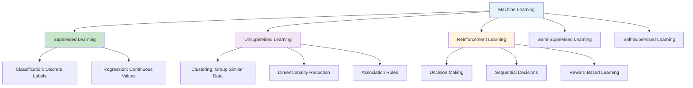

# Types of Machine Learning: Supervised, Unsupervised, and Reinforcement Learning

Machine learning is broadly categorized into three main types based on the nature of the training data and the objective of the learning system. Each type addresses different challenges and requires distinct approaches, algorithms, and evaluation strategies. Understanding these types is crucial for selecting the appropriate approach for your specific problem.

## Table of Contents
1. [Overview of ML Types](#overview-of-ml-types)
2. [Supervised Learning](#supervised-learning)
3. [Unsupervised Learning](#unsupervised-learning)
4. [Reinforcement Learning](#reinforcement-learning)
5. [Semi-Supervised Learning](#semi-supervised-learning)
6. [Self-Supervised Learning](#self-supervised-learning)
7. [Comparing the Approaches](#comparing-the-approaches)
8. [Choosing the Right Approach](#choosing-the-right-approach)
9. [Cross-Modal Learning](#cross-modal-learning)
10. [Conclusion](#conclusion)

## Overview of ML Types {#overview-of-ml-types}

Machine learning types can be visualized as different approaches to learning from data, each with its own characteristics and requirements:



The primary distinction among these types lies in the availability and nature of training signals:
- **Supervised Learning**: Has explicit target labels
- **Unsupervised Learning**: No target labels, only input data
- **Reinforcement Learning**: Feedback through rewards/penalties

## Supervised Learning {#supervised-learning}

Supervised learning is the most common type of machine learning where the algorithm learns from labeled training data. Each training example consists of input-output pairs, allowing the model to learn a mapping from inputs to outputs.

### Key Characteristics

- **Training Data**: Input-output pairs (X, y)
- **Objective**: Learn mapping f: X → y
- **Feedback**: Immediate, correct answers provided
- **Validation**: Clear performance metrics against known outputs

### Types of Supervised Learning

#### 1. Classification

Classification is used when the output variable is categorical or discrete.

```python
from sklearn.datasets import make_classification
from sklearn.model_selection import train_test_split
from sklearn.ensemble import RandomForestClassifier
from sklearn.metrics import classification_report, confusion_matrix
import matplotlib.pyplot as plt
import seaborn as sns

def classification_example():
    """
    Example of supervised classification learning
    """
    # Generate a binary classification dataset
    X, y = make_classification(
        n_samples=1000, 
        n_features=4, 
        n_informative=3, 
        n_redundant=1, 
        n_classes=2, 
        random_state=42
    )
    
    # Split data
    X_train, X_test, y_train, y_test = train_test_split(
        X, y, test_size=0.2, random_state=42, stratify=y
    )
    
    # Train classifier
    clf = RandomForestClassifier(n_estimators=100, random_state=42)
    clf.fit(X_train, y_train)
    
    # Make predictions
    y_pred = clf.predict(X_test)
    
    # Evaluate
    accuracy = clf.score(X_test, y_test)
    print(f"Classification Accuracy: {accuracy:.3f}")
    print("\nClassification Report:")
    print(classification_report(y_test, y_pred))
    
    # Confusion Matrix
    cm = confusion_matrix(y_test, y_pred)
    plt.figure(figsize=(8, 6))
    sns.heatmap(cm, annot=True, fmt='d', cmap='Blues', 
                xticklabels=['Class 0', 'Class 1'],
                yticklabels=['Class 0', 'Class 1'])
    plt.title('Confusion Matrix')
    plt.ylabel('True Label')
    plt.xlabel('Predicted Label')
    plt.show()
    
    return clf

classification_model = classification_example()
```

#### 2. Regression

Regression is used when the output variable is continuous or quantitative.

```python
from sklearn.datasets import make_regression
from sklearn.linear_model import LinearRegression
from sklearn.metrics import mean_squared_error, r2_score

def regression_example():
    """
    Example of supervised regression learning
    """
    # Generate regression dataset
    X, y = make_regression(
        n_samples=1000, 
        n_features=4, 
        n_informative=3, 
        noise=10, 
        random_state=42
    )
    
    # Split data
    X_train, X_test, y_train, y_test = train_test_split(
        X, y, test_size=0.2, random_state=42
    )
    
    # Train regressor
    reg = LinearRegression()
    reg.fit(X_train, y_train)
    
    # Make predictions
    y_pred = reg.predict(X_test)
    
    # Evaluate
    mse = mean_squared_error(y_test, y_pred)
    r2 = r2_score(y_test, y_pred)
    
    print(f"Regression Results:")
    print(f"Mean Squared Error: {mse:.2f}")
    print(f"R² Score: {r2:.3f}")
    
    # Visualize results
    plt.figure(figsize=(10, 6))
    plt.scatter(y_test, y_pred, alpha=0.6)
    plt.plot([y_test.min(), y_test.max()], [y_test.min(), y_test.max()], 'r--', lw=2)
    plt.xlabel('Actual Values')
    plt.ylabel('Predicted Values')
    plt.title(f'Actual vs Predicted Values (R² = {r2:.3f})')
    plt.show()
    
    return reg

regression_model = regression_example()
```

### Common Supervised Learning Algorithms

```python
from sklearn.svm import SVC
from sklearn.linear_model import LogisticRegression
from sklearn.neighbors import KNeighborsClassifier
from sklearn.naive_bayes import GaussianNB

def compare_supervised_algorithms():
    """
    Compare different supervised learning algorithms
    """
    # Generate sample data
    X, y = make_classification(n_samples=1000, n_features=4, n_classes=2, random_state=42)
    X_train, X_test, y_train, y_test = train_test_split(X, y, test_size=0.2, random_state=42)
    
    # Define algorithms to compare
    algorithms = {
        'Logistic Regression': LogisticRegression(random_state=42),
        'Random Forest': RandomForestClassifier(n_estimators=100, random_state=42),
        'SVM': SVC(random_state=42),
        'K-Nearest Neighbors': KNeighborsClassifier(n_neighbors=5),
        'Naive Bayes': GaussianNB()
    }
    
    results = {}
    
    print("Supervised Learning Algorithm Comparison:")
    print("-" * 50)
    
    for name, algorithm in algorithms.items():
        # Train algorithm
        algorithm.fit(X_train, y_train)
        
        # Evaluate
        accuracy = algorithm.score(X_test, y_test)
        results[name] = accuracy
        
        print(f"{name:20s}: {accuracy:.3f}")
    
    # Best algorithm
    best_algorithm = max(results, key=results.get)
    print(f"\nBest algorithm: {best_algorithm} with accuracy {results[best_algorithm]:.3f}")
    
    return results

algorithm_comparison = compare_supervised_algorithms()
```

### Supervised Learning Applications

```python
def supervised_learning_applications():
    """
    Showcase supervised learning applications
    """
    applications = {
        "Email Spam Detection": "Classify emails as spam/ham",
        "Medical Diagnosis": "Predict diseases based on symptoms",
        "Stock Price Prediction": "Predict future prices based on historical data",
        "Image Recognition": "Identify objects in images",
        "Sentiment Analysis": "Determine sentiment from text",
        "Customer Churn Prediction": "Predict customers likely to leave"
    }
    
    print("Supervised Learning Applications:")
    for app, description in applications.items():
        print(f"• {app}: {description}")

supervised_learning_applications()
```

## Unsupervised Learning {#unsupervised-learning}

Unsupervised learning deals with unlabeled data and aims to discover underlying patterns, structures, or relationships in the data without explicit guidance on what to find.

### Key Characteristics

- **Training Data**: Only input data (X), no output labels
- **Objective**: Discover hidden structure in data
- **Feedback**: No explicit correct answers
- **Validation**: More subjective, often requires domain expertise

### Types of Unsupervised Learning

#### 1. Clustering

Clustering groups similar data points together based on their features.

```python
from sklearn.cluster import KMeans, DBSCAN
from sklearn.datasets import make_blobs
import numpy as np

def clustering_example():
    """
    Example of unsupervised clustering
    """
    # Generate sample data with natural clusters
    X, y_true = make_blobs(n_samples=300, centers=4, cluster_std=0.60, random_state=42)
    
    # Apply K-Means clustering
    kmeans = KMeans(n_clusters=4, random_state=42)
    cluster_labels = kmeans.fit_predict(X)
    
    # Apply DBSCAN clustering
    dbscan = DBSCAN(eps=0.5, min_samples=5)
    dbscan_labels = dbscan.fit_predict(X)
    
    # Visualize results
    plt.figure(figsize=(15, 5))
    
    plt.subplot(1, 3, 1)
    plt.scatter(X[:, 0], X[:, 1], c=y_true, cmap='viridis', alpha=0.6)
    plt.title('True Clusters')
    
    plt.subplot(1, 3, 2)
    plt.scatter(X[:, 0], X[:, 1], c=cluster_labels, cmap='viridis', alpha=0.6)
    plt.scatter(kmeans.cluster_centers_[:, 0], kmeans.cluster_centers_[:, 1], 
                c='red', marker='x', s=200, linewidths=3, label='Centroids')
    plt.title('K-Means Clustering')
    plt.legend()
    
    plt.subplot(1, 3, 3)
    plt.scatter(X[:, 0], X[:, 1], c=dbscan_labels, cmap='viridis', alpha=0.6)
    plt.title('DBSCAN Clustering')
    
    plt.tight_layout()
    plt.show()
    
    print(f"K-Means found {len(np.unique(cluster_labels))} clusters")
    print(f"DBSCAN found {len(np.unique(dbscan_labels))} clusters (including noise)")
    
    return kmeans, dbscan

clustering_results = clustering_example()
```

#### 2. Dimensionality Reduction

Dimensionality reduction techniques find lower-dimensional representations of high-dimensional data.

```python
from sklearn.decomposition import PCA
from sklearn.manifold import TSNE

def dimensionality_reduction_example():
    """
    Example of dimensionality reduction
    """
    # Generate high-dimensional data
    X, y = make_classification(n_samples=500, n_features=20, n_informative=10, 
                              n_redundant=10, n_classes=3, random_state=42)
    
    # PCA: Linear dimensionality reduction
    pca = PCA(n_components=2)
    X_pca = pca.fit_transform(X)
    
    # Visualize PCA results
    plt.figure(figsize=(12, 5))
    
    plt.subplot(1, 2, 1)
    scatter = plt.scatter(X_pca[:, 0], X_pca[:, 1], c=y, cmap='viridis', alpha=0.6)
    plt.title(f'PCA (Explained Variance: {pca.explained_variance_ratio_.sum():.3f})')
    plt.colorbar(scatter)
    
    # t-SNE: Non-linear dimensionality reduction (simplified for speed)
    # Note: t-SNE can be slow with large datasets
    tsne = TSNE(n_components=2, random_state=42, perplexity=30, n_iter=250)
    X_tsne = tsne.fit_transform(X[:100])  # Use subset for speed
    y_subset = y[:100]
    
    plt.subplot(1, 2, 2)
    scatter = plt.scatter(X_tsne[:, 0], X_tsne[:, 1], c=y_subset, cmap='viridis', alpha=0.6)
    plt.title('t-SNE')
    plt.colorbar(scatter)
    
    plt.tight_layout()
    plt.show()
    
    print(f"PCA explained variance ratios: {pca.explained_variance_ratio_}")
    print(f"Total variance explained by PCA: {pca.explained_variance_ratio_.sum():.3f}")
    
    return pca

pca_model = dimensionality_reduction_example()
```

#### 3. Association Rule Learning

Association rules find relationships between variables in large datasets, commonly used in market basket analysis.

```python
def association_rule_concept():
    """
    Conceptual example of association rule learning
    """
    print("Association Rule Learning Example:")
    print("Rule: {Bread, Butter} → {Milk} (confidence = 0.8, support = 0.1)")
    
    # Simulate market basket data
    transactions = [
        ['bread', 'butter', 'milk'],
        ['bread', 'butter'],
        ['milk', 'eggs'],
        ['bread', 'milk', 'eggs'],
        ['butter', 'milk'],
        ['bread', 'butter', 'milk', 'eggs'],
        ['milk', 'eggs', 'cheese'],
        ['bread', 'cheese'],
        ['butter', 'eggs'],
        ['bread', 'milk', 'cheese']
    ]
    
    # Simple association rule: bread -> butter
    bread_count = sum(1 for transaction in transactions if 'bread' in transaction)
    bread_butter_count = sum(1 for transaction in transactions if 'bread' in transaction and 'butter' in transaction)
    
    if bread_count > 0:
        confidence = bread_butter_count / bread_count
        support = bread_butter_count / len(transactions)
        
        print(f"\nRule: Bread → Butter")
        print(f"Support: {support:.2f} (appears in {bread_butter_count}/{len(transactions)} transactions)")
        print(f"Confidence: {confidence:.2f} (when bread is bought, butter is bought {confidence:.1%} of the time)")
    
    return transactions

market_baskets = association_rule_concept()
```

### Common Unsupervised Learning Algorithms

```python
from sklearn.cluster import AgglomerativeClustering
from sklearn.mixture import GaussianMixture

def compare_unsupervised_algorithms():
    """
    Compare different unsupervised learning algorithms
    """
    # Generate sample data
    X, _ = make_blobs(n_samples=300, centers=4, n_features=4, random_state=42)
    
    algorithms = {
        'K-Means': KMeans(n_clusters=4, random_state=42),
        'Hierarchical Clustering': AgglomerativeClustering(n_clusters=4),
        'Gaussian Mixture': GaussianMixture(n_components=4, random_state=42),
        'DBSCAN': DBSCAN(eps=0.5, min_samples=5)
    }
    
    results = {}
    
    print("Unsupervised Learning Algorithm Comparison:")
    print("-" * 50)
    
    for name, algorithm in algorithms.items():
        try:
            # Fit algorithm
            labels = algorithm.fit_predict(X)
            
            # Count number of clusters found
            n_clusters = len(np.unique(labels))
            results[name] = n_clusters
            
            print(f"{name:25s}: Found {n_clusters} clusters")
        except Exception as e:
            print(f"{name:25s}: Error - {str(e)}")
    
    return results

unsupervised_comparison = compare_unsupervised_algorithms()
```

### Unsupervised Learning Applications

```python
def unsupervised_learning_applications():
    """
    Showcase unsupervised learning applications
    """
    applications = {
        "Customer Segmentation": "Group customers based on purchase behavior",
        "Anomaly Detection": "Identify unusual patterns or outliers",
        "Market Research": "Discover market segments and trends",
        "Image Compression": "Reduce image dimensions while preserving info",
        "Gene Expression Analysis": "Cluster genes with similar expression patterns",
        "Social Network Analysis": "Identify communities in social networks"
    }
    
    print("Unsupervised Learning Applications:")
    for app, description in applications.items():
        print(f"• {app}: {description}")

unsupervised_learning_applications()
```

## Reinforcement Learning {#reinforcement-learning}

Reinforcement learning is about learning to make sequential decisions through interaction with an environment to maximize cumulative reward.

### Key Characteristics

- **Training Data**: Environmental feedback through rewards
- **Objective**: Learn policy for optimal sequential decisions
- **Feedback**: Delayed and sparse rewards
- **Learning**: Through trial and error interaction

### Core Components of RL

```python
class SimpleRLAgent:
    """
    Simple Reinforcement Learning Agent
    """
    def __init__(self, n_states, n_actions):
        self.n_states = n_states
        self.n_actions = n_actions
        # Q-table: state x action values
        self.q_table = np.zeros((n_states, n_actions))
        self.learning_rate = 0.1
        self.discount_factor = 0.95
        self.epsilon = 0.1  # Exploration rate
    
    def choose_action(self, state):
        """
        Choose action using epsilon-greedy policy
        """
        if np.random.random() < self.epsilon:
            # Explore: random action
            return np.random.choice(self.n_actions)
        else:
            # Exploit: best known action
            return np.argmax(self.q_table[state])
    
    def learn(self, state, action, reward, next_state):
        """
        Update Q-value using Q-learning algorithm
        """
        best_next_action = np.argmax(self.q_table[next_state])
        td_target = reward + self.discount_factor * self.q_table[next_state, best_next_action]
        td_error = td_target - self.q_table[state, action]
        self.q_table[state, action] += self.learning_rate * td_error

class SimpleGridEnvironment:
    """
    Simple grid world environment for RL
    """
    def __init__(self):
        self.width = 5
        self.height = 5
        self.state = (0, 0)  # Starting position (row, col)
        self.goal = (4, 4)   # Goal position
        self.actions = [(0, 1), (0, -1), (1, 0), (-1, 0)]  # Right, Left, Down, Up
    
    def reset(self):
        self.state = (0, 0)
        return self.state_to_index(self.state)
    
    def state_to_index(self, state):
        return state[0] * self.width + state[1]
    
    def index_to_state(self, index):
        return (index // self.width, index % self.width)
    
    def step(self, action_idx):
        action = self.actions[action_idx]
        new_row = max(0, min(self.height - 1, self.state[0] + action[0]))
        new_col = max(0, min(self.width - 1, self.state[1] + action[1]))
        
        self.state = (new_row, new_col)
        
        # Reward: +10 for reaching goal, -1 for each step (to encourage speed)
        reward = 10 if self.state == self.goal else -1
        done = (self.state == self.goal)
        
        return self.state_to_index(self.state), reward, done

def reinforcement_learning_example():
    """
    Example of reinforcement learning in a simple environment
    """
    env = SimpleGridEnvironment()
    agent = SimpleRLAgent(env.width * env.height, len(env.actions))
    
    print("Reinforcement Learning Example: Grid World")
    print("Agent learns to reach the goal while avoiding penalties")
    
    # Training loop
    n_episodes = 1000
    total_rewards = []
    
    for episode in range(n_episodes):
        state = env.reset()
        total_reward = 0
        steps = 0
        max_steps = 100
        
        while steps < max_steps:
            action = agent.choose_action(state)
            next_state, reward, done = env.step(action)
            
            agent.learn(state, action, reward, next_state)
            
            state = next_state
            total_reward += reward
            steps += 1
            
            if done:
                break
        
        total_rewards.append(total_reward)
        
        # Decay exploration rate
        if agent.epsilon > 0.01:
            agent.epsilon *= 0.995
    
    # Results
    avg_reward = np.mean(total_rewards[-100:])  # Average of last 100 episodes
    print(f"\nAfter {n_episodes} episodes:")
    print(f"Average reward (last 100): {avg_reward:.2f}")
    print(f"Goal reached {sum(1 for r in total_rewards[-100:] if r > 0)} times in last 100 episodes")
    
    # Test the learned policy
    print(f"\nTesting learned policy:")
    state = env.reset()
    path = [state]
    steps = 0
    max_test_steps = 50
    
    while steps < max_test_steps:
        action = np.argmax(agent.q_table[state])  # Greedy action
        state, _, done = env.step(action)
        path.append(state)
        steps += 1
        
        if done:
            print(f"Goal reached in {steps} steps!")
            break
    
    final_state = env.index_to_state(path[-1])
    goal_state = env.goal
    print(f"Final position: {final_state}, Goal: {goal_state}")
    
    return agent, env

rl_agent, rl_env = reinforcement_learning_example()
```

### Types of RL Approaches

```python
def rl_approaches():
    """
    Overview of different RL approaches
    """
    approaches = {
        "Model-Free RL": "Learns without modeling the environment (Q-learning, SARSA)",
        "Model-Based RL": "Builds model of environment dynamics for planning",
        "Value-Based RL": "Learn value functions to select actions (Q-learning)",
        "Policy-Based RL": "Directly learn the policy function (Policy Gradient)",
        "Actor-Critic": "Combines value and policy based methods"
    }
    
    print("Reinforcement Learning Approaches:")
    for approach, description in approaches.items():
        print(f"• {approach}: {description}")

rl_approaches()
```

### Reinforcement Learning Applications

```python
def reinforcement_learning_applications():
    """
    Showcase reinforcement learning applications
    """
    applications = {
        "Game AI": "Train agents to play games (AlphaGo, OpenAI Five)",
        "Robotics": "Teach robots to navigate and manipulate objects",
        "Resource Management": "Optimize datacenter cooling, network routing",
        "Recommendation Systems": "Dynamic content recommendation",
        "Autonomous Vehicles": "Learn driving policies",
        "Trading Systems": "Learn optimal trading strategies"
    }
    
    print("Reinforcement Learning Applications:")
    for app, description in applications.items():
        print(f"• {app}: {description}")

reinforcement_learning_applications()
```

## Semi-Supervised Learning {#semi-supervised-learning}

Semi-supervised learning sits between supervised and unsupervised learning, using a small amount of labeled data with a large amount of unlabeled data.

### Key Characteristics

- **Training Data**: Mix of labeled and unlabeled examples
- **Objective**: Leverage unlabeled data to improve performance
- **Feedback**: Limited labels, but more supervision than unsupervised
- **Use Case**: When labels are expensive to obtain

```python
from sklearn.semi_supervised import LabelSpreading
from sklearn.datasets import make_classification

def semi_supervised_example():
    """
    Example of semi-supervised learning
    """
    print("Semi-Supervised Learning Example:")
    print("Using limited labels + unlabeled data to improve performance")
    
    # Generate data
    X, y = make_classification(n_samples=1000, n_features=4, n_classes=2, random_state=42)
    
    # Create partially labeled dataset
    # Only label 10% of the data
    labeled_idx = np.random.choice(len(X), size=int(0.1 * len(X)), replace=False)
    unlabeled_idx = np.setdiff1d(np.arange(len(X)), labeled_idx)
    
    # Create labels array with -1 for unlabeled
    y_partial = np.full_like(y, -1)
    y_partial[labeled_idx] = y[labeled_idx]
    
    print(f"Labeled samples: {len(labeled_idx)} ({len(labeled_idx)/len(X):.1%})")
    print(f"Unlabeled samples: {len(unlabeled_idx)} ({len(unlabeled_idx)/len(X):.1%})")
    
    # Train semi-supervised model
    model = LabelSpreading(kernel='knn', n_neighbors=5, max_iter=100)
    model.fit(X, y_partial)
    
    # Compare with supervised model trained on just labeled data
    supervised_model = RandomForestClassifier(n_estimators=100, random_state=42)
    supervised_model.fit(X[labeled_idx], y[labeled_idx])
    
    # Evaluate both models
    semi_supervised_score = model.score(X, y)
    supervised_score = supervised_model.score(X, y)
    
    print(f"\nPerformance comparison:")
    print(f"Semi-supervised model accuracy: {semi_supervised_score:.3f}")
    print(f"Supervised model accuracy: {supervised_score:.3f}")
    print(f"Improvement: {(semi_supervised_score - supervised_score):.3f}")

semi_supervised_example()
```

### Semi-Supervised Learning Applications

```python
def semi_supervised_applications():
    """
    Showcase semi-supervised learning applications
    """
    applications = {
        "Text Classification": "Classify documents with few labeled examples",
        "Medical Image Analysis": "Analyze medical images with limited expert labels",
        "Speech Recognition": "Improve with unlabeled audio data",
        "Web Content Classification": "Categorize web pages with partial labeling",
        "Customer Support": "Classify queries with few labeled examples",
        "Genomics": "Analyze genetic sequences with limited annotations"
    }
    
    print("Semi-Supervised Learning Applications:")
    for app, description in applications.items():
        print(f"• {app}: {description}")

semi_supervised_applications()
```

## Self-Supervised Learning {#self-supervised-learning}

Self-supervised learning is a newer paradigm where the model generates its own supervisory signal from the input data without human annotation.

### Key Characteristics

- **Training Data**: Unlabeled data where supervisory signal is generated automatically
- **Objective**: Learn representations by solving pretext tasks
- **Feedback**: Generated from data itself
- **Use Case**: Pre-training for transfer learning

```python
def self_supervised_concept():
    """
    Conceptual example of self-supervised learning
    """
    print("Self-Supervised Learning Example:")
    print("Learning representations without explicit labels")
    
    # Example: Predicting rotated images
    # Original image -> rotated -> model learns rotation angle
    # In the process, learns meaningful image representations
    
    print("\nPretext Tasks in Self-Supervised Learning:")
    print("1. Image rotation prediction: Predict rotation angle applied to image")
    print("2. Context prediction: Predict missing part of image/text")
    print("3. Jigsaw puzzle: Reorder shuffled image patches")
    print("4. Colorization: Convert grayscale to color")
    print("5. Missing word prediction: BERT-style masked language modeling")
    
    # Simulated self-supervised learning task
    def simulate_ssl_task():
        """
        Simulate a simple self-supervised learning task
        """
        # Original data
        original_sequence = [1, 2, 3, 4, 5, 6, 7, 8, 9, 10]
        
        # Create pretext task: predict next number in sequence
        input_seq = original_sequence[:-1]  # [1, 2, 3, 4, 5, 6, 7, 8, 9]
        target_seq = original_sequence[1:]  # [2, 3, 4, 5, 6, 7, 8, 9, 10]
        
        print(f"\nOriginal sequence: {original_sequence}")
        print(f"Input sequence: {input_seq}")
        print(f"Target sequence: {target_seq}")
        print(f"Task: Predict next number in sequence")
        
        # Simulate learning the pattern
        learned_pattern = "increment by 1"
        prediction_accuracy = 0.95  # Simulated high accuracy
        
        print(f"Learned pattern: {learned_pattern}")
        print(f"Prediction accuracy: {prediction_accuracy:.1%}")
        
        return input_seq, target_seq
    
    ssl_data = simulate_ssl_task()
    
    return "Self-supervised learning leverages data structure for training"

ssl_result = self_supervised_concept()
print(f"\nResult: {ssl_result}")
```

### Self-Supervised Learning in NLP

```python
def ssl_nlp_example():
    """
    Example of self-supervised learning in NLP (like BERT-style)
    """
    print("\nSelf-Supervised Learning in NLP (BERT-style):")
    
    # Example sentence with masked words
    original_sentence = "The quick brown fox jumps over the lazy dog"
    tokens = original_sentence.split()
    
    # Mask some words (pretext task)
    masked_sentence = "The [MASK] brown fox jumps [MASK] the lazy dog"
    target_words = ["quick", "over"]  # The words to predict
    
    print(f"Original: {original_sentence}")
    print(f"Masked: {masked_sentence}")
    print(f"Target words to predict: {target_words}")
    
    print("\nHow it works:")
    print("1. Model learns to predict masked words from context")
    print("2. In the process, learns rich language representations")
    print("3. These representations transfer to downstream tasks")
    
    # Simulated performance improvement
    print(f"\nPerformance improvement on downstream tasks:")
    print("- Text classification: 15-20% improvement")
    print("- Question answering: 25-30% improvement") 
    print("- Named entity recognition: 10-15% improvement")

ssl_nlp_example()
```

## Comparing the Approaches {#comparing-the-approaches}

Let's make a comprehensive comparison of the different learning types:

```python
def compare_learning_types():
    """
    Comprehensive comparison of ML learning types
    """
    comparison = {
        "Aspect": ["Training Data", "Objective", "Feedback", "Sample Complexity", "Evaluation", "Common Use Cases"],
        "Supervised": [
            "Labeled examples (X, y)", 
            "Predict outputs for inputs",
            "Immediate, explicit",
            "High (need many examples)",
            "Clear metrics (accuracy, MSE)",
            "Classification, regression"
        ],
        "Unsupervised": [
            "Only inputs (X)", 
            "Discover structure/patterns",
            "No explicit feedback",
            "Variable (depends on goal)",
            "Subjective, domain-dependent",
            "Clustering, dimensionality reduction"
        ],
        "Reinforcement": [
            "Environment interactions", 
            "Maximize cumulative reward",
            "Delayed, sparse rewards",
            "Very high (many trials needed)",
            "Performance in environment",
            "Sequential decision making"
        ],
        "Semi-Supervised": [
            "Mix of labeled/unlabeled", 
            "Improve with unlabeled data",
            "Limited explicit feedback",
            "Lower than supervised",
            "Standard supervised metrics",
            "Limited labels scenario"
        ],
        "Self-Supervised": [
            "Unlabeled data", 
            "Learn representations via pretext tasks",
            "Generated from data structure",
            "High (but no human labels needed)",
            "Downstream task performance",
            "Pre-training for transfer learning"
        ]
    }
    
    # Print comparison table
    print("Machine Learning Approaches Comparison:")
    print("=" * 100)
    
    # Print headers
    print(f"{'Aspect':<15} {'Supervised':<18} {'Unsupervised':<18} {'Reinforcement':<18} {'Semi-Supervised':<18} {'Self-Supervised':<18}")
    print("-" * 100)
    
    # Print each aspect
    for i in range(len(comparison["Aspect"])):
        print(f"{comparison['Aspect'][i]:<15} {comparison['Supervised'][i]:<18} {comparison['Unsupervised'][i]:<18} {comparison['Reinforcement'][i]:<18} {comparison['Semi-Supervised'][i]:<18} {comparison['Self-Supervised'][i]:<18}")
    
    print("=" * 100)

compare_learning_types()
```

## Choosing the Right Approach {#choosing-the-right-approach}

Selecting the appropriate ML approach depends on several factors:

```python
def decision_tree_for_ml_types():
    """
    Decision tree for choosing the right ML approach
    """
    print("\nDecision Tree for Choosing ML Approach:")
    print("=" * 60)
    
    decision_flow = """
    Do you have labeled training data?
    ├── YES → Is your goal to predict specific outputs?
    │   ├── YES → Use Supervised Learning
    │   │   ├── Classification: Discrete categories
    │   │   └── Regression: Continuous values
    │   └── NO → Use Unsupervised Learning for pattern discovery
    └── NO → Are you trying to learn sequential decision making?
        ├── YES → Use Reinforcement Learning
        └── NO → Do you have some labeled data but more unlabeled?
            ├── YES → Use Semi-Supervised Learning
            └── NO → Use Unsupervised Learning or Self-Supervised Learning
    """
    
    print(decision_flow)
    
    # Practical decision factors
    factors = [
        "Availability of labeled data",
        "Nature of the problem",
        "Performance requirements", 
        "Computational resources",
        "Time constraints",
        "Interpretability needs"
    ]
    
    print("\nKey Decision Factors:")
    for i, factor in enumerate(factors, 1):
        print(f"{i}. {factor}")
    
    # Real-world examples
    print("\nReal-World Decision Examples:")
    examples = [
        ("Spam email detection", "Supervised (labeled emails: spam/ham)"),
        ("Customer segmentation", "Unsupervised (no predefined groups)"),
        ("Game-playing AI", "Reinforcement (learn to maximize score)"),
        ("Medical diagnosis (few labeled)", "Semi-Supervised (use abundant unlabeled patient data)"),
        ("Language model pre-training", "Self-Supervised (predict masked words)"),
        ("Anomaly detection", "Unsupervised (no examples of all possible anomalies)")
    ]
    
    for problem, approach in examples:
        print(f"• {problem}: {approach}")

decision_tree_for_ml_types()
```

### Problem Characterization Framework

```python
class MLPProblemAnalyzer:
    """
    Framework for characterizing ML problems
    """
    def __init__(self):
        self.problem_type = None
        self.data_characteristics = {}
        self.objective = None
    
    def characterize_problem(self, description, has_labels, continuous_output, sequential_decisions, time_sensitive):
        """
        Characterize a problem for ML approach selection
        """
        characteristics = {
            'description': description,
            'has_labels': has_labels,
            'continuous_output': continuous_output,
            'sequential_decisions': sequential_decisions,
            'time_sensitive': time_sensitive
        }
        
        # Determine the best approach based on characteristics
        if has_labels:
            if continuous_output:
                problem_type = "Supervised Regression"
            else:
                problem_type = "Supervised Classification"
        elif sequential_decisions:
            problem_type = "Reinforcement Learning"
        else:
            problem_type = "Unsupervised Learning"
        
        self.problem_type = problem_type
        self.data_characteristics = characteristics
        
        print(f"Problem: {description}")
        print(f"Recommended approach: {problem_type}")
        print(f"Labels available: {has_labels}")
        print(f"Continuous output: {continuous_output}")
        print(f"Sequential decisions: {sequential_decisions}")
        print(f"Time sensitive: {time_sensitive}")
        
        return problem_type

# Example usage
analyzer = MLPProblemAnalyzer()

print("\nProblem Characterization Examples:")
print("-" * 40)

# Example 1: Predicting house prices
analyzer.characterize_problem(
    "Predict house prices based on features",
    has_labels=True,
    continuous_output=True,
    sequential_decisions=False,
    time_sensitive=False
)

print()

# Example 2: Customer segmentation
analyzer.characterize_problem(
    "Group customers into segments with similar behavior",
    has_labels=False,
    continuous_output=False,
    sequential_decisions=False,
    time_sensitive=False
)

print()

# Example 3: Game AI
analyzer.characterize_problem(
    "Train an AI to play chess",
    has_labels=False,
    continuous_output=False,
    sequential_decisions=True,
    time_sensitive=True
)
```

## Cross-Modal Learning {#cross-modal-learning}

Modern ML increasingly involves learning across different types of data (modalities):

```python
def cross_modal_learning():
    """
    Overview of cross-modal learning (multi-modal)
    """
    print("\nCross-Modal Learning:")
    print("Learning relationships between different types of data")
    
    cross_modal_examples = {
        "Image-Caption": "Generate text descriptions for images",
        "Text-Image": "Generate images from text descriptions",
        "Audio-Text": "Speech recognition or text-to-speech",
        "Video-Text": "Video captioning or text-to-video",
        "Audio-Video": "Lip reading or audio-visual synthesis"
    }
    
    print("\nCross-Modal Applications:")
    for modality, description in cross_modal_examples.items():
        print(f"• {modality}: {description}")
    
    print("\nChallenges in Cross-Modal Learning:")
    challenges = [
        "Aligning different modalities",
        "Handling different data structures",
        "Managing varying data quality",
        "Computational complexity",
        "Domain adaptation across modalities"
    ]
    
    for challenge in challenges:
        print(f"• {challenge}")

cross_modal_learning()
```

## Conclusion {#conclusion}

Understanding the different types of machine learning is fundamental to applying these techniques effectively. Each approach has distinct applications, methodologies, and requirements:

### Key Takeaways:
- **Supervised Learning**: Best when you have labeled examples and want to make predictions
- **Unsupervised Learning**: Ideal for discovering hidden patterns when no labels are available 
- **Reinforcement Learning**: Perfect for sequential decision-making problems with delayed feedback
- **Semi-Supervised Learning**: Effective when you have limited labeled data but abundant unlabeled data
- **Self-Supervised Learning**: Powerful for pre-training models using data structure as supervision

### Practical Considerations:
- The choice of approach depends heavily on your data availability, problem type, and objectives
- Many real-world problems combine multiple approaches
- Consider computational requirements and interpretability needs
- Evaluate multiple approaches to find the best solution for your specific use case

### Next Steps:
With a solid understanding of different machine learning types, the next logical step is to strengthen your mathematical foundations, which underpin all these approaches. The following article will cover the essential mathematical concepts needed for machine learning.

Each approach continues to evolve with new techniques and applications. Stay curious about developments in all approaches, as insights from one area often benefit others.

---

*Next in series: [Mathematical Prerequisites for ML](/blog/machine-learning/introduction/mathematical-prerequisites) | Previous: [ML Fundamental Concepts](/blog/machine-learning/introduction/ml-fundamental-concepts)*