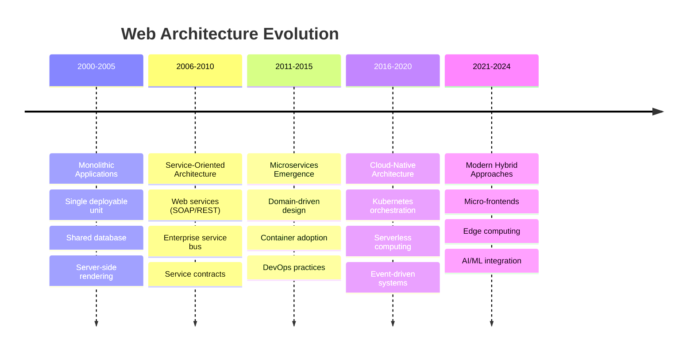
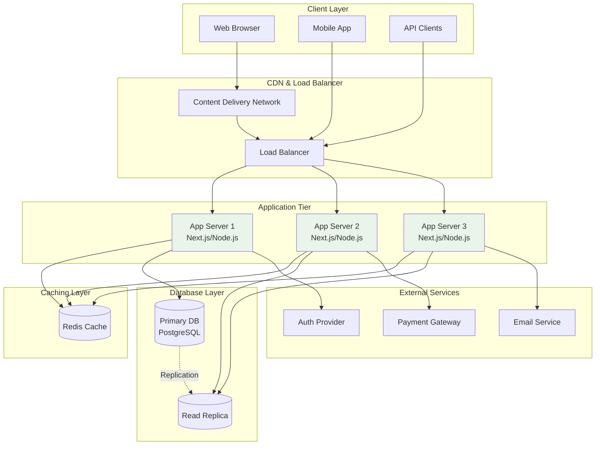
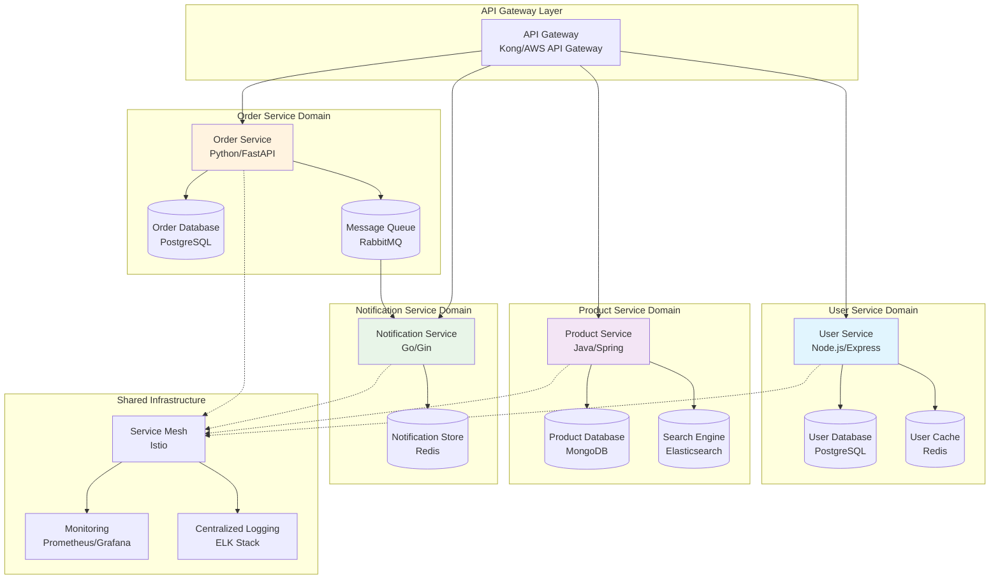
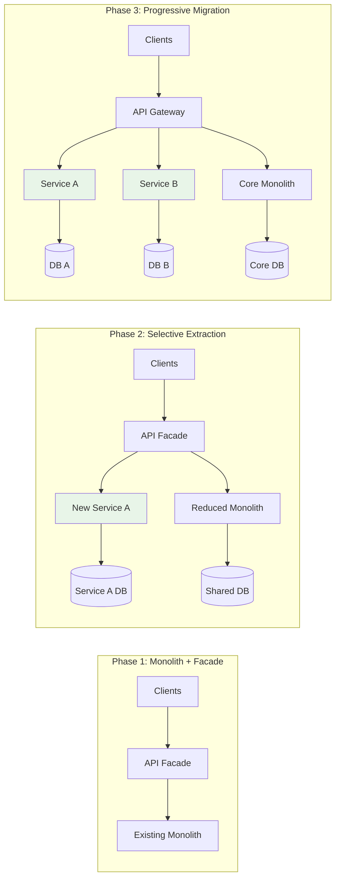

# Modern Web Development Architecture: From Monolith to Microservices

The landscape of web application architecture has evolved dramatically over the past decade. Understanding when and how to apply different architectural patterns is crucial for building scalable, maintainable systems.

## Architecture Evolution Timeline

Let's trace the journey of web architecture patterns:

## Architectural Decision Framework

When choosing an architecture, consider this decision tree:

```mermaid
flowchart TD
    Start([New Project Requirements]) --> Team{Team Size & Experience}
    
    Team -->|Small Team<br/>< 10 developers| Complexity{System Complexity}
    Team -->|Large Team<br/>> 10 developers| Domain{Clear Domain Boundaries?}
    
    Complexity -->|Simple<br/>CRUD operations| Monolith[Modular Monolith]
    Complexity -->|Complex<br/>Multiple domains| Scale{Scaling Requirements}
    
    Scale -->|Moderate<br/>< 1M users| Monolith
    Scale -->|High<br/>> 1M users| Micro[Microservices]
    
    Domain -->|Yes<br/>Well-defined| Micro
    Domain -->|No<br/>Unclear boundaries| Modular[Modular Monolith<br/>→ Future Migration]
    
    Monolith --> Deploy1[Single Deployment<br/>Shared Database<br/>Fast Development]
    Modular --> Deploy2[Single Deployment<br/>Modular Design<br/>Migration Path]
    Micro --> Deploy3[Independent Services<br/>Separate Databases<br/>Complex Operations]
    
    style Monolith fill:#e8f5e8
    style Modular fill:#fff3cd
    style Micro fill:#e1f5fe
```

## Monolithic Architecture

### When to Choose Monoliths

**✅ Perfect for:**
- Small to medium teams (< 10 developers)
- Well-understood domains
- Rapid prototyping and MVP development
- Limited operational complexity requirements

**Key Benefits:**
- **Simplified Development**: Single codebase, easy debugging
- **Easier Testing**: Integration testing is straightforward
- **Simple Deployment**: One artifact to deploy
- **Performance**: No network latency between components

### Modern Monolith Stack

## Microservices Architecture

### When Microservices Make Sense

**✅ Ideal for:**
- Large, experienced teams (> 10 developers)
- Complex domains with clear boundaries
- High-scale applications (> 1M users)
- Organizations with strong DevOps culture

### Microservices Ecosystem

## Migration Strategy: Strangler Fig Pattern

When evolving from monolith to microservices, use the strangler fig approach:

## Best Practices by Architecture Type

### Monolith Best Practices
- **Modular Design**: Organize code by domain boundaries
- **Database Per Module**: Logical separation even within shared DB
- **API-First**: Design internal APIs as if they were external
- **Monitoring**: Implement comprehensive logging and metrics

### Microservices Best Practices
- **Domain-Driven Design**: Align services with business domains
- **Database Per Service**: Complete data ownership
- **Asynchronous Communication**: Use events for inter-service communication
- **Circuit Breakers**: Implement resilience patterns
- **Distributed Tracing**: Essential for debugging across services

## Performance Comparison

| Aspect | Monolith | Microservices |
|--------|----------|---------------|
| **Development Speed** | ⚡ Fast (single codebase) | 🐌 Slower (coordination overhead) |
| **Deployment** | ⚡ Simple (single artifact) | 🔄 Complex (orchestration needed) |
| **Scaling** | 📈 Vertical scaling | 📊 Fine-grained horizontal scaling |
| **Technology Diversity** | 🔒 Single stack | 🎨 Technology per service |
| **Team Independence** | 👥 Shared codebase | 🎯 Independent teams |
| **Operational Complexity** | 📱 Low | 🛠️ High |

## Decision Checklist

Before choosing your architecture, ask:

**For Monoliths:**
- [ ] Is the team size manageable (< 10 developers)?
- [ ] Are domain boundaries still evolving?
- [ ] Is rapid development more important than independent scaling?
- [ ] Do you have limited operational expertise?

**For Microservices:**
- [ ] Do you have clear, stable domain boundaries?
- [ ] Is the team large enough to manage distributed complexity?
- [ ] Do you need independent scaling of different components?
- [ ] Is your organization ready for distributed system challenges?

## Conclusion

There's no universal "right" architecture. The best choice depends on your team, domain complexity, scaling requirements, and organizational maturity. Start simple with a well-structured monolith, and evolve to microservices when the benefits clearly outweigh the complexity costs.

Remember: **premature optimization is the root of all evil** - this applies to architecture too. Choose the simplest architecture that meets your current needs, with a clear path for future evolution.