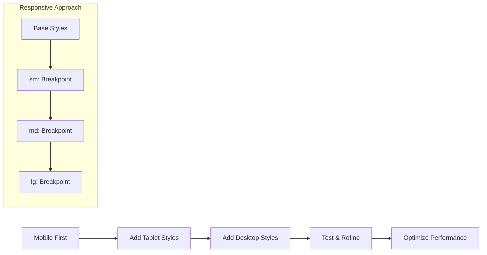

# Building Responsive UIs with Tailwind CSS

Tailwind CSS has revolutionized how we approach styling in modern web development. Let's explore how to create beautiful, responsive interfaces.

## Why Tailwind CSS?

- **Utility-first**: Build complex components from simple utility classes
- **Responsive**: Mobile-first responsive design system  
- **Customizable**: Easy to customize and extend
- **Performance**: Purge unused CSS for optimal bundle sizes

## Responsive Design Principles

Tailwind uses a mobile-first breakpoint system:

```html
<div class="w-full md:w-1/2 lg:w-1/3">
  <!-- Responsive card -->
</div>
```

### Breakpoints Overview

| Prefix | Min Width | CSS |
|--------|-----------|-----|
| `sm` | 640px | `@media (min-width: 640px)` |
| `md` | 768px | `@media (min-width: 768px)` |
| `lg` | 1024px | `@media (min-width: 1024px)` |
| `xl` | 1280px | `@media (min-width: 1280px)` |
| `2xl` | 1536px | `@media (min-width: 1536px)` |

## Component Design Flow

Here's how responsive components are typically designed:



## Practical Example

Let's build a responsive card component:

```html
<div class="max-w-sm mx-auto bg-white rounded-xl shadow-md overflow-hidden md:max-w-2xl">
  <div class="md:flex">
    <div class="md:shrink-0">
      
    </div>
    <div class="p-8">
      <div class="uppercase tracking-wide text-sm text-indigo-500 font-semibold">
        Company retreats
      </div>
      <a href="#" class="block mt-1 text-lg leading-tight font-medium text-black hover:underline">
        Incredible accommodation for your team
      </a>
      <p class="mt-2 text-slate-500">
        Looking to take your team away on a retreat to enjoy awesome food and take in some sunshine? 
        We have a list of places to do just that.
      </p>
    </div>
  </div>
</div>
```

## Custom Configuration

Extend Tailwind with custom utilities in your `tailwind.config.js`:

```javascript
module.exports = {
  theme: {
    extend: {
      fontFamily: {
        sans: ['Inter', 'sans-serif'],
      },
      colors: {
        brand: {
          50: '#eff6ff',
          500: '#3b82f6',
          900: '#1e3a8a',
        }
      }
    }
  }
}
```

With these techniques, you'll be building beautiful, responsive interfaces in no time!