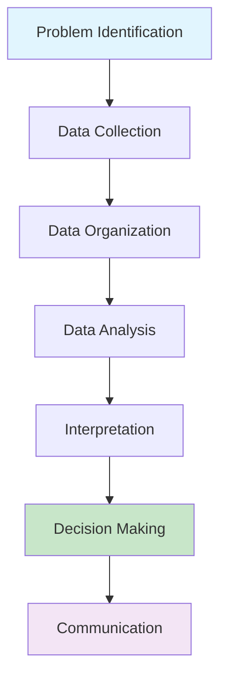

# Introduction to Statistics: Foundation for Data Analysis

Statistics is the science of collecting, analyzing, interpreting, and presenting data. In our data-driven world, statistical knowledge is essential for making informed decisions, conducting research, and building predictive models. This article introduces the fundamental concepts that form the foundation for more advanced statistical analysis and machine learning techniques.

## Table of Contents
1. [What is Statistics?](#what-is-statistics)
2. [Types of Data](#types-of-data)
3. [Levels of Measurement](#levels-of-measurement)
4. [Population vs Sample](#population-vs-sample)
5. [Descriptive vs Inferential Statistics](#descriptive-vs-inferential-statistics)
6. [Statistical Thinking in Practice](#statistical-thinking-in-practice)
7. [Applications in Data Science](#applications-in-data-science)
8. [Common Statistical Notation](#common-statistical-notation)
9. [Conclusion](#conclusion)

## What is Statistics? {#what-is-statistics}

Statistics is a branch of mathematics that provides methods for organizing and interpreting numerical data. It encompasses tools and techniques for:

- **Collecting Data**: Gathering information in a systematic way
- **Organizing Data**: Arranging data to facilitate analysis
- **Analyzing Data**: Using statistical methods to extract insights
- **Interpreting Results**: Drawing conclusions from data analysis
- **Presenting Findings**: Communicating results effectively

### The Statistical Process



Statistics serves as the backbone for evidence-based decision making across numerous fields:

- **Business**: Market research, quality control, forecasting
- **Medicine**: Clinical trials, epidemiology, drug development
- **Social Sciences**: Polling, behavioral studies, demographic analysis
- **Engineering**: Reliability testing, process control, optimization
- **Data Science**: Feature engineering, model evaluation, hypothesis testing

## Types of Data {#types-of-data}

Data comes in various forms, and understanding these types is crucial for selecting appropriate analytical techniques.

### Quantitative Data (Numerical)

Quantitative data represents measurable quantities and can be further divided into:

#### Discrete Data
- **Definition**: Countable items with distinct, separate values
- **Examples**: Number of children in a family, number of cars owned, test scores
- **Characteristics**: Can only take specific values, no intermediate values

```python
# Example: Discrete data
number_of_children = [0, 1, 2, 3, 4, 5]  # Discrete values
number_of_sales = [10, 15, 22, 18, 30]   # Cannot be 15.5 sales
```

#### Continuous Data
- **Definition**: Measurable quantities that can take any value within a range
- **Examples**: Height, weight, temperature, time
- **Characteristics**: Can take any value within a continuous range

```python
# Example: Continuous data
heights = [165.2, 170.8, 155.5, 180.1, 168.9]  # Can be any value
temperature = [23.4, 24.1, 22.8, 25.0, 23.9]  # Infinite possible values
```

### Qualitative Data (Categorical)

Qualitative data describes characteristics or properties and can be further divided into:

#### Nominal Data
- **Definition**: Categories with no natural order or ranking
- **Examples**: Gender, color, nationality, types of animals

```python
# Example: Nominal data
colors = ['Red', 'Blue', 'Green', 'Yellow']
categories = ['Electronics', 'Clothing', 'Food', 'Books']
```

#### Ordinal Data
- **Definition**: Categories with a meaningful order or ranking
- **Examples**: Education level, rating scales, customer satisfaction levels

```python
# Example: Ordinal data - ordered categories
education_levels = ['High School', 'Bachelor', 'Master', 'PhD']
satisfaction = ['Poor', 'Fair', 'Good', 'Very Good', 'Excellent']
```

## Levels of Measurement {#levels-of-measurement}

The level of measurement determines what statistical operations are meaningful to perform on the data.

### 1. Nominal Level
- **Characteristics**: Categories with no order
- **Operations**: Counting, mode calculation
- **Examples**: Gender (Male/Female), Types of vehicles (Car, Truck, Motorcycle)

### 2. Ordinal Level
- **Characteristics**: Categories with meaningful order but no consistent intervals
- **Operations**: Median, mode, percentiles
- **Examples**: Class rankings, T-shirt sizes (S, M, L, XL)

### 3. Interval Level
- **Characteristics**: Ordered categories with consistent intervals but no true zero
- **Operations**: Mean, standard deviation (but not ratios)
- **Examples**: Temperature in Celsius, IQ scores

### 4. Ratio Level
- **Characteristics**: All properties of interval data plus a true zero point
- **Operations**: All statistical operations including ratios
- **Examples**: Height, weight, distance, income

```python
# Example: Levels of measurement comparison

# Nominal
brands = ['Apple', 'Samsung', 'Google']  # No order

# Ordinal
quality_ratings = ['Low', 'Medium', 'High']  # Ordered but no consistent interval

# Interval
temperatures_c = [20, 25, 30, 35]  # Consistent intervals, but 0°C doesn't mean no temperature

# Ratio
heights_cm = [150, 160, 170, 180]  # True zero exists (0cm = no height)
```

## Population vs Sample {#population-vs-sample}

### Population
- **Definition**: The complete set of individuals, objects, or measurements of interest
- **Characteristics**: Includes every possible observation
- **Notation**: Typically represented by N (population size)
- **Example**: All registered voters in a country, all students in a university

### Sample
- **Definition**: A subset of the population selected for study
- **Characteristics**: Used to make inferences about the population
- **Notation**: Typically represented by n (sample size)
- **Example**: 1,000 randomly selected voters, 100 students from a university

### Why Sample?
- **Cost**: Studying the entire population is often expensive
- **Time**: Complete enumeration takes too long
- **Practicality**: Some studies would destroy the population (e.g., testing batteries)
- **Accuracy**: Proper sampling can yield accurate results

```python
# Example: Population vs Sample

# Population: All employees in a company (N=5000)
all_employees = range(5000)

# Sample: 500 randomly selected employees (n=500)
import random
sample_employees = random.sample(list(all_employees), 500)

print(f"Population size: {len(all_employees)}")
print(f"Sample size: {len(sample_employees)}")
print(f"Sample represents {(len(sample_employees)/len(all_employees))*100}% of population")
```

## Descriptive vs Inferential Statistics {#descriptive-vs-inferential-statistics}

### Descriptive Statistics
- **Purpose**: Summarize and describe the main features of a dataset
- **Methods**: Measures of central tendency, variability, and shape
- **Results**: Describe the actual sample data
- **Tools**: Tables, graphs, summary statistics

```python
import pandas as pd
import numpy as np

# Example: Descriptive statistics
data = [85, 90, 78, 92, 88, 76, 95, 89, 84, 91]
df = pd.Series(data)

print("Descriptive Statistics:")
print(f"Mean: {df.mean():.2f}")
print(f"Median: {df.median():.2f}")
print(f"Mode: {df.mode().values}")
print(f"Standard Deviation: {df.std():.2f}")
print(f"Range: {df.max() - df.min()}")
```

### Inferential Statistics
- **Purpose**: Make predictions or inferences about a population based on sample data
- **Methods**: Hypothesis testing, confidence intervals, regression analysis
- **Results**: Generalizable statements about the population
- **Tools**: Statistical tests, models, probability distributions

```python
# Example: Inferential statistics concept
sample_mean = 86.8  # from our sample
population_mean = 87.2  # estimated for the population

# We infer that the population mean is likely close to our sample mean
# with a certain level of confidence
confidence_interval = (84.5, 89.1)  # 95% confidence interval
print(f"We are 95% confident that the true population mean is between {confidence_interval[0]} and {confidence_interval[1]}")
```

## Statistical Thinking in Practice {#statistical-thinking-in-practice}

### Variation is Everywhere
Statistical thinking recognizes that variation exists in all processes and data. Understanding variation helps us:

- Detect true differences from random fluctuations
- Make better decisions based on evidence
- Plan for uncertainty

### The Statistical Problem-Solving Process
1. **Formulate Questions**: Define clear, answerable questions
2. **Collect Data**: Gather relevant data systematically
3. **Analyze Data**: Apply appropriate statistical methods
4. **Interpret Results**: Make sense of the analysis in context
5. **Communicate Findings**: Present results clearly and effectively

```python
# Example: Statistical problem-solving approach

def statistical_problem_solving(question, data_source):
    """
    Framework for statistical problem solving
    """
    print(f"1. Question: {question}")
    print(f"2. Data Collection: {data_source}")
    
    # Analysis would go here
    print("3. Analysis: Apply appropriate statistical methods")
    print("4. Interpretation: Draw conclusions from data")
    print("5. Communication: Present findings and recommendations")
    
    return "Statistical analysis completed"

# Example usage
question = "Is there a difference in average test scores between two teaching methods?"
data_source = "Test scores from 200 students using Method A and Method B"
result = statistical_problem_solving(question, data_source)
print(result)
```

## Applications in Data Science {#applications-in-data-science}

Statistics forms the foundation for many data science techniques:

### 1. Data Preprocessing
- Detecting outliers using statistical methods
- Handling missing data based on statistical patterns
- Feature scaling using statistical measures

### 2. Exploratory Data Analysis (EDA)
- Understanding data distribution through statistical summaries
- Identifying relationships between variables
- Detecting patterns and anomalies

### 3. Model Validation
- Statistical tests for model comparison
- Confidence intervals for predictions
- Hypothesis testing for feature significance

### 4. A/B Testing
- Statistical significance testing
- Power analysis and sample size determination
- Confidence intervals for treatment effects

```python
# Example: Statistical concepts in data science

import matplotlib.pyplot as plt
import seaborn as sns

# Load sample dataset for demonstration
np.random.seed(42)
sample_data = np.random.normal(loc=50, scale=15, size=1000)

# Descriptive statistics
print("Descriptive Statistics for Sample Data:")
print(f"Mean: {sample_data.mean():.2f}")
print(f"Standard Deviation: {sample_data.std():.2f}")
print(f"Min: {sample_data.min():.2f}")
print(f"Max: {sample_data.max():.2f}")

# Visualization
plt.figure(figsize=(10, 6))
plt.subplot(1, 2, 1)
plt.hist(sample_data, bins=30, edgecolor='black')
plt.title('Distribution of Sample Data')
plt.xlabel('Value')
plt.ylabel('Frequency')

plt.subplot(1, 2, 2)
plt.boxplot(sample_data)
plt.title('Box Plot of Sample Data')
plt.ylabel('Value')

plt.tight_layout()
plt.show()
```

## Common Statistical Notation {#common-statistical-notation}

Understanding statistical notation is essential for reading and applying statistical concepts:

| Symbol | Meaning | Example |
|--------|---------|---------|
| n | Sample size | n = 100 |
| N | Population size | N = 10,000 |
| x̄ | Sample mean | x̄ = 85.5 |
| μ | Population mean | μ = 87.2 |
| s | Sample standard deviation | s = 12.3 |
| σ | Population standard deviation | σ = 11.8 |
| p̂ | Sample proportion | p̂ = 0.65 |
| p | Population proportion | p = 0.63 |
| r | Sample correlation | r = 0.82 |
| α | Significance level | α = 0.05 |

## Conclusion {#conclusion}

Statistics provides the fundamental framework for understanding and working with data. Key takeaways include:

### Essential Concepts:
- **Data Types**: Understanding quantitative vs qualitative data
- **Levels of Measurement**: Choosing appropriate analysis methods
- **Population vs Sample**: Making inferences about larger groups
- **Descriptive vs Inferential**: Summarizing vs generalizing from data

### Statistical Thinking:
- Recognizing variation in all processes
- Following systematic problem-solving approaches
- Making evidence-based decisions

### Foundation for Advanced Topics:
- Statistical concepts are prerequisites for machine learning
- Understanding data distributions guides model selection
- Statistical inference enables confident decision making

**🎯 Next Steps**: With this foundation in statistical concepts, you're ready to explore measures of central tendency and understand how to summarize and describe data effectively.

Understanding these fundamental concepts is crucial for anyone working with data, whether in traditional statistics, data science, or machine learning applications. The terminology, concepts, and thinking patterns established here will be referenced throughout more advanced statistical techniques.

---

*Next in series: [Measures of Central Tendency](/blog/statistics/descriptive/measures-of-central-tendency) | Previous: None*