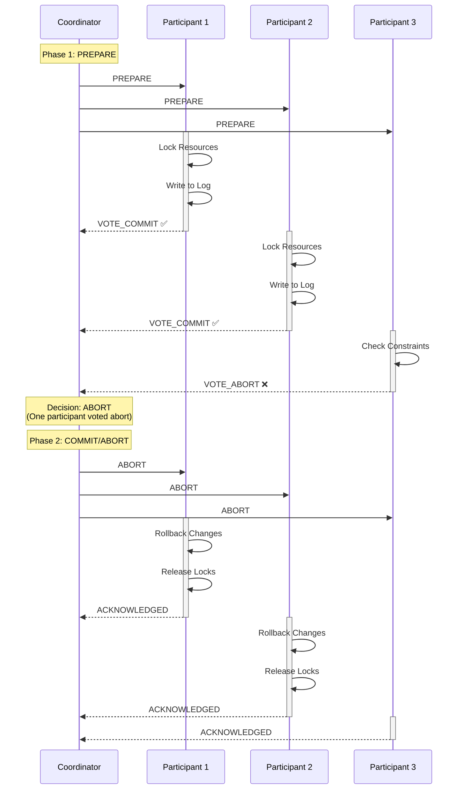
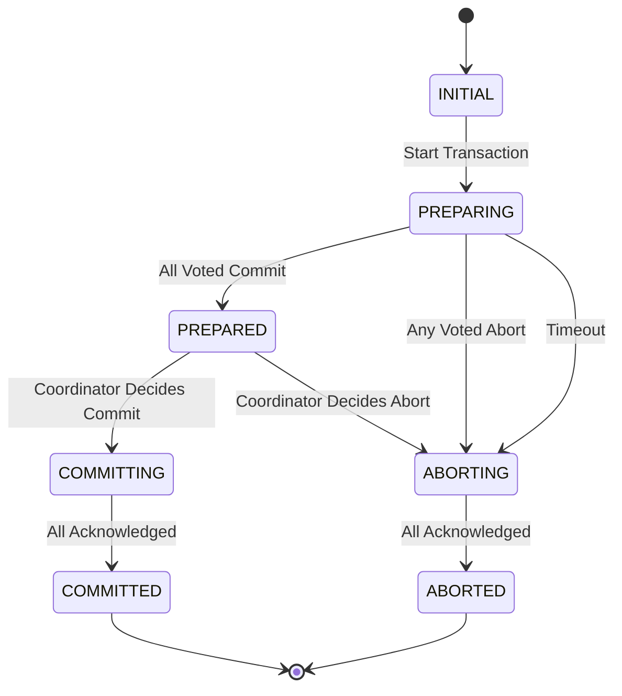

# System Design Fundamentals: Two-Phase Commit Protocol

Two-Phase Commit (2PC) is a distributed algorithm that coordinates all participants in a distributed transaction to ensure atomicity - either all participants commit or all abort. It provides strong consistency at the cost of availability.

## 2PC Protocol Flow



## Transaction States



## Transaction and Participant Types

```go
package main

import (
    "fmt"
    "sync"
    "time"
)

// TransactionState represents the state of a transaction
type TransactionState string

const (
    StateInitial    TransactionState = "INITIAL"
    StatePreparing  TransactionState = "PREPARING"
    StatePrepared   TransactionState = "PREPARED"
    StateCommitting TransactionState = "COMMITTING"
    StateCommitted  TransactionState = "COMMITTED"
    StateAborting   TransactionState = "ABORTING"
    StateAborted    TransactionState = "ABORTED"
)

// Vote represents a participant's vote
type Vote string

const (
    VoteCommit Vote = "COMMIT"
    VoteAbort  Vote = "ABORT"
)

// Message types
type MessageType string

const (
    MsgPrepare     MessageType = "PREPARE"
    MsgVoteCommit  MessageType = "VOTE_COMMIT"
    MsgVoteAbort   MessageType = "VOTE_ABORT"
    MsgCommit      MessageType = "COMMIT"
    MsgAbort       MessageType = "ABORT"
    MsgAck         MessageType = "ACK"
)

// Message for coordinator-participant communication
type Message struct {
    Type          MessageType
    TransactionID string
    ParticipantID string
    Timestamp     time.Time
}

// Transaction represents a distributed transaction
type Transaction struct {
    ID            string
    State         TransactionState
    Participants  []string
    Votes         map[string]Vote
    Acknowledged  map[string]bool
    StartTime     time.Time
    PrepareTime   time.Time
    CompleteTime  time.Time
    mutex         sync.RWMutex
}

func NewTransaction(id string, participants []string) *Transaction {
    return &Transaction{
        ID:           id,
        State:        StateInitial,
        Participants: participants,
        Votes:        make(map[string]Vote),
        Acknowledged: make(map[string]bool),
        StartTime:    time.Now(),
    }
}

func (t *Transaction) GetState() TransactionState {
    t.mutex.RLock()
    defer t.mutex.RUnlock()
    return t.State
}

func (t *Transaction) SetState(state TransactionState) {
    t.mutex.Lock()
    defer t.mutex.Unlock()
    
    t.State = state
    
    if state == StatePrepared {
        t.PrepareTime = time.Now()
    } else if state == StateCommitted || state == StateAborted {
        t.CompleteTime = time.Now()
    }
}

func (t *Transaction) RecordVote(participantID string, vote Vote) {
    t.mutex.Lock()
    defer t.mutex.Unlock()
    
    t.Votes[participantID] = vote
}

func (t *Transaction) RecordAck(participantID string) {
    t.mutex.Lock()
    defer t.mutex.Unlock()
    
    t.Acknowledged[participantID] = true
}

func (t *Transaction) AllVotedCommit() bool {
    t.mutex.RLock()
    defer t.mutex.RUnlock()
    
    if len(t.Votes) != len(t.Participants) {
        return false
    }
    
    for _, vote := range t.Votes {
        if vote == VoteAbort {
            return false
        }
    }
    
    return true
}

func (t *Transaction) AllAcknowledged() bool {
    t.mutex.RLock()
    defer t.mutex.RUnlock()
    
    return len(t.Acknowledged) == len(t.Participants)
}
```

## Coordinator Implementation

```go
// Coordinator manages the two-phase commit protocol
type Coordinator struct {
    id             string
    transactions   map[string]*Transaction
    participants   map[string]*ParticipantProxy
    msgChan        chan Message
    timeout        time.Duration
    mutex          sync.RWMutex
}

func NewCoordinator(id string, timeout time.Duration) *Coordinator {
    c := &Coordinator{
        id:           id,
        transactions: make(map[string]*Transaction),
        participants: make(map[string]*ParticipantProxy),
        msgChan:      make(chan Message, 100),
        timeout:      timeout,
    }
    
    // Start message handler
    go c.handleMessages()
    
    return c
}

func (c *Coordinator) RegisterParticipant(participantID string, proxy *ParticipantProxy) {
    c.mutex.Lock()
    defer c.mutex.Unlock()
    
    c.participants[participantID] = proxy
    
    fmt.Printf("📝 Coordinator registered participant: %s\n", participantID)
}

func (c *Coordinator) BeginTransaction(txID string, participantIDs []string) error {
    c.mutex.Lock()
    defer c.mutex.Unlock()
    
    // Verify all participants are registered
    for _, pid := range participantIDs {
        if _, exists := c.participants[pid]; !exists {
            return fmt.Errorf("participant not registered: %s", pid)
        }
    }
    
    tx := NewTransaction(txID, participantIDs)
    c.transactions[txID] = tx
    
    fmt.Printf("\n🚀 Coordinator started transaction: %s (participants: %v)\n", txID, participantIDs)
    
    return nil
}

func (c *Coordinator) Prepare(txID string) error {
    c.mutex.RLock()
    tx, exists := c.transactions[txID]
    c.mutex.RUnlock()
    
    if !exists {
        return fmt.Errorf("transaction not found: %s", txID)
    }
    
    fmt.Printf("\n📤 Phase 1: PREPARE (tx: %s)\n", txID)
    
    tx.SetState(StatePreparing)
    
    // Send PREPARE to all participants
    for _, participantID := range tx.Participants {
        c.mutex.RLock()
        proxy := c.participants[participantID]
        c.mutex.RUnlock()
        
        fmt.Printf("  → Sending PREPARE to %s\n", participantID)
        
        go func(pid string, p *ParticipantProxy) {
            msg := Message{
                Type:          MsgPrepare,
                TransactionID: txID,
                ParticipantID: pid,
                Timestamp:     time.Now(),
            }
            
            p.SendMessage(msg)
        }(participantID, proxy)
    }
    
    // Wait for all votes or timeout
    timer := time.NewTimer(c.timeout)
    ticker := time.NewTicker(100 * time.Millisecond)
    defer timer.Stop()
    defer ticker.Stop()
    
    for {
        select {
        case <-timer.C:
            fmt.Printf("⏰ Timeout waiting for votes (tx: %s)\n", txID)
            return c.Abort(txID)
            
        case <-ticker.C:
            tx.mutex.RLock()
            votesReceived := len(tx.Votes)
            allVoted := votesReceived == len(tx.Participants)
            tx.mutex.RUnlock()
            
            if allVoted {
                if tx.AllVotedCommit() {
                    fmt.Printf("✅ All participants voted COMMIT (tx: %s)\n", txID)
                    tx.SetState(StatePrepared)
                    return c.Commit(txID)
                } else {
                    fmt.Printf("❌ Some participants voted ABORT (tx: %s)\n", txID)
                    return c.Abort(txID)
                }
            }
        }
    }
}

func (c *Coordinator) Commit(txID string) error {
    c.mutex.RLock()
    tx, exists := c.transactions[txID]
    c.mutex.RUnlock()
    
    if !exists {
        return fmt.Errorf("transaction not found: %s", txID)
    }
    
    fmt.Printf("\n📤 Phase 2: COMMIT (tx: %s)\n", txID)
    
    tx.SetState(StateCommitting)
    
    // Send COMMIT to all participants
    for _, participantID := range tx.Participants {
        c.mutex.RLock()
        proxy := c.participants[participantID]
        c.mutex.RUnlock()
        
        fmt.Printf("  → Sending COMMIT to %s\n", participantID)
        
        go func(pid string, p *ParticipantProxy) {
            msg := Message{
                Type:          MsgCommit,
                TransactionID: txID,
                ParticipantID: pid,
                Timestamp:     time.Now(),
            }
            
            p.SendMessage(msg)
        }(participantID, proxy)
    }
    
    // Wait for acknowledgments
    timer := time.NewTimer(c.timeout)
    ticker := time.NewTicker(100 * time.Millisecond)
    defer timer.Stop()
    defer ticker.Stop()
    
    for {
        select {
        case <-timer.C:
            fmt.Printf("⏰ Timeout waiting for acknowledgments (tx: %s)\n", txID)
            return fmt.Errorf("timeout waiting for commit acknowledgments")
            
        case <-ticker.C:
            if tx.AllAcknowledged() {
                tx.SetState(StateCommitted)
                duration := tx.CompleteTime.Sub(tx.StartTime)
                fmt.Printf("✅ Transaction COMMITTED (tx: %s, duration: %v)\n", txID, duration)
                return nil
            }
        }
    }
}

func (c *Coordinator) Abort(txID string) error {
    c.mutex.RLock()
    tx, exists := c.transactions[txID]
    c.mutex.RUnlock()
    
    if !exists {
        return fmt.Errorf("transaction not found: %s", txID)
    }
    
    fmt.Printf("\n📤 Phase 2: ABORT (tx: %s)\n", txID)
    
    tx.SetState(StateAborting)
    
    // Send ABORT to all participants
    for _, participantID := range tx.Participants {
        c.mutex.RLock()
        proxy := c.participants[participantID]
        c.mutex.RUnlock()
        
        fmt.Printf("  → Sending ABORT to %s\n", participantID)
        
        go func(pid string, p *ParticipantProxy) {
            msg := Message{
                Type:          MsgAbort,
                TransactionID: txID,
                ParticipantID: pid,
                Timestamp:     time.Now(),
            }
            
            p.SendMessage(msg)
        }(participantID, proxy)
    }
    
    // Wait for acknowledgments
    timer := time.NewTimer(c.timeout)
    ticker := time.NewTicker(100 * time.Millisecond)
    defer timer.Stop()
    defer ticker.Stop()
    
    for {
        select {
        case <-timer.C:
            tx.SetState(StateAborted)
            fmt.Printf("⏰ Timeout, but transaction marked ABORTED (tx: %s)\n", txID)
            return nil
            
        case <-ticker.C:
            if tx.AllAcknowledged() {
                tx.SetState(StateAborted)
                duration := tx.CompleteTime.Sub(tx.StartTime)
                fmt.Printf("✅ Transaction ABORTED (tx: %s, duration: %v)\n", txID, duration)
                return nil
            }
        }
    }
}

func (c *Coordinator) handleMessages() {
    for msg := range c.msgChan {
        c.processMessage(msg)
    }
}

func (c *Coordinator) processMessage(msg Message) {
    c.mutex.RLock()
    tx, exists := c.transactions[msg.TransactionID]
    c.mutex.RUnlock()
    
    if !exists {
        return
    }
    
    switch msg.Type {
    case MsgVoteCommit:
        fmt.Printf("  ← Received VOTE_COMMIT from %s\n", msg.ParticipantID)
        tx.RecordVote(msg.ParticipantID, VoteCommit)
        
    case MsgVoteAbort:
        fmt.Printf("  ← Received VOTE_ABORT from %s\n", msg.ParticipantID)
        tx.RecordVote(msg.ParticipantID, VoteAbort)
        
    case MsgAck:
        fmt.Printf("  ← Received ACK from %s\n", msg.ParticipantID)
        tx.RecordAck(msg.ParticipantID)
    }
}

func (c *Coordinator) ReceiveMessage(msg Message) {
    c.msgChan <- msg
}
```

## Participant Implementation

```go
// Participant represents a participant in the distributed transaction
type Participant struct {
    id          string
    coordinator *Coordinator
    data        map[string]string
    prepared    map[string]map[string]string // txID -> prepared data
    locks       map[string]bool
    msgChan     chan Message
    mutex       sync.RWMutex
}

func NewParticipant(id string, coordinator *Coordinator) *Participant {
    p := &Participant{
        id:          id,
        coordinator: coordinator,
        data:        make(map[string]string),
        prepared:    make(map[string]map[string]string),
        locks:       make(map[string]bool),
        msgChan:     make(chan Message, 10),
    }
    
    // Start message handler
    go p.handleMessages()
    
    return p
}

func (p *Participant) handleMessages() {
    for msg := range p.msgChan {
        p.processMessage(msg)
    }
}

func (p *Participant) processMessage(msg Message) {
    switch msg.Type {
    case MsgPrepare:
        p.handlePrepare(msg)
    case MsgCommit:
        p.handleCommit(msg)
    case MsgAbort:
        p.handleAbort(msg)
    }
}

func (p *Participant) handlePrepare(msg Message) {
    fmt.Printf("  📥 %s: Received PREPARE (tx: %s)\n", p.id, msg.TransactionID)
    
    // Simulate checking if can commit
    canCommit := p.canPrepare(msg.TransactionID)
    
    var response Message
    
    if canCommit {
        // Lock resources and prepare data
        p.mutex.Lock()
        p.locks[msg.TransactionID] = true
        // Copy current state as prepared state
        p.prepared[msg.TransactionID] = make(map[string]string)
        for k, v := range p.data {
            p.prepared[msg.TransactionID][k] = v
        }
        p.mutex.Unlock()
        
        fmt.Printf("  ✅ %s: Voted COMMIT (tx: %s)\n", p.id, msg.TransactionID)
        
        response = Message{
            Type:          MsgVoteCommit,
            TransactionID: msg.TransactionID,
            ParticipantID: p.id,
            Timestamp:     time.Now(),
        }
    } else {
        fmt.Printf("  ❌ %s: Voted ABORT (tx: %s)\n", p.id, msg.TransactionID)
        
        response = Message{
            Type:          MsgVoteAbort,
            TransactionID: msg.TransactionID,
            ParticipantID: p.id,
            Timestamp:     time.Now(),
        }
    }
    
    // Send vote to coordinator
    p.coordinator.ReceiveMessage(response)
}

func (p *Participant) handleCommit(msg Message) {
    fmt.Printf("  📥 %s: Received COMMIT (tx: %s)\n", p.id, msg.TransactionID)
    
    p.mutex.Lock()
    
    // Apply prepared changes (already done, just confirm)
    // In real implementation, write to durable storage
    
    // Release locks
    delete(p.locks, msg.TransactionID)
    delete(p.prepared, msg.TransactionID)
    
    p.mutex.Unlock()
    
    fmt.Printf("  ✅ %s: Committed transaction (tx: %s)\n", p.id, msg.TransactionID)
    
    // Send acknowledgment
    response := Message{
        Type:          MsgAck,
        TransactionID: msg.TransactionID,
        ParticipantID: p.id,
        Timestamp:     time.Now(),
    }
    
    p.coordinator.ReceiveMessage(response)
}

func (p *Participant) handleAbort(msg Message) {
    fmt.Printf("  📥 %s: Received ABORT (tx: %s)\n", p.id, msg.TransactionID)
    
    p.mutex.Lock()
    
    // Discard prepared changes
    delete(p.prepared, msg.TransactionID)
    
    // Release locks
    delete(p.locks, msg.TransactionID)
    
    p.mutex.Unlock()
    
    fmt.Printf("  ↩️  %s: Aborted transaction (tx: %s)\n", p.id, msg.TransactionID)
    
    // Send acknowledgment
    response := Message{
        Type:          MsgAck,
        TransactionID: msg.TransactionID,
        ParticipantID: p.id,
        Timestamp:     time.Now(),
    }
    
    p.coordinator.ReceiveMessage(response)
}

func (p *Participant) canPrepare(txID string) bool {
    // Simulate constraint checking
    // In this demo, randomly fail 20% of the time
    return time.Now().UnixNano()%5 != 0
}

func (p *Participant) Set(key, value string) {
    p.mutex.Lock()
    defer p.mutex.Unlock()
    
    p.data[key] = value
}

func (p *Participant) Get(key string) (string, bool) {
    p.mutex.RLock()
    defer p.mutex.RUnlock()
    
    value, exists := p.data[key]
    return value, exists
}
```

## Participant Proxy

```go
// ParticipantProxy allows coordinator to communicate with participants
type ParticipantProxy struct {
    participant *Participant
}

func NewParticipantProxy(participant *Participant) *ParticipantProxy {
    return &ParticipantProxy{
        participant: participant,
    }
}

func (pp *ParticipantProxy) SendMessage(msg Message) {
    // Simulate network delay
    time.Sleep(10 * time.Millisecond)
    
    pp.participant.msgChan <- msg
}
```

## Transaction Log

```go
// TransactionLog provides durability for recovery
type TransactionLog struct {
    entries []LogEntry
    mutex   sync.RWMutex
}

type LogEntry struct {
    TransactionID string
    State         TransactionState
    Timestamp     time.Time
    Data          interface{}
}

func NewTransactionLog() *TransactionLog {
    return &TransactionLog{
        entries: make([]LogEntry, 0),
    }
}

func (tl *TransactionLog) Append(txID string, state TransactionState, data interface{}) {
    tl.mutex.Lock()
    defer tl.mutex.Unlock()
    
    entry := LogEntry{
        TransactionID: txID,
        State:         state,
        Timestamp:     time.Now(),
        Data:          data,
    }
    
    tl.entries = append(tl.entries, entry)
    
    fmt.Printf("📝 Log entry: tx=%s, state=%s\n", txID, state)
}

func (tl *TransactionLog) GetLastState(txID string) (TransactionState, bool) {
    tl.mutex.RLock()
    defer tl.mutex.RUnlock()
    
    // Search backwards for most recent entry
    for i := len(tl.entries) - 1; i >= 0; i-- {
        if tl.entries[i].TransactionID == txID {
            return tl.entries[i].State, true
        }
    }
    
    return "", false
}

func (tl *TransactionLog) GetEntries(txID string) []LogEntry {
    tl.mutex.RLock()
    defer tl.mutex.RUnlock()
    
    entries := make([]LogEntry, 0)
    
    for _, entry := range tl.entries {
        if entry.TransactionID == txID {
            entries = append(entries, entry)
        }
    }
    
    return entries
}
```

## Complete Demo

```go
func main() {
    fmt.Println("🚀 Starting Two-Phase Commit Demo\n")
    
    // Create coordinator
    coordinator := NewCoordinator("coordinator-1", 2*time.Second)
    
    // Create participants
    participant1 := NewParticipant("participant-1", coordinator)
    participant2 := NewParticipant("participant-2", coordinator)
    participant3 := NewParticipant("participant-3", coordinator)
    
    // Register participants with coordinator
    coordinator.RegisterParticipant("participant-1", NewParticipantProxy(participant1))
    coordinator.RegisterParticipant("participant-2", NewParticipantProxy(participant2))
    coordinator.RegisterParticipant("participant-3", NewParticipantProxy(participant3))
    
    // Test 1: Successful transaction
    fmt.Println("\n=== Test 1: Successful Transaction ===")
    
    txID1 := "tx-001"
    participants1 := []string{"participant-1", "participant-2"}
    
    err := coordinator.BeginTransaction(txID1, participants1)
    if err != nil {
        fmt.Printf("❌ Failed to begin transaction: %v\n", err)
        return
    }
    
    err = coordinator.Prepare(txID1)
    if err != nil {
        fmt.Printf("Transaction result: %v\n", err)
    }
    
    // Test 2: Transaction with abort
    fmt.Println("\n\n=== Test 2: Transaction with Participant Abort ===")
    
    txID2 := "tx-002"
    participants2 := []string{"participant-1", "participant-2", "participant-3"}
    
    err = coordinator.BeginTransaction(txID2, participants2)
    if err != nil {
        fmt.Printf("❌ Failed to begin transaction: %v\n", err)
        return
    }
    
    // Try multiple times until we get a failure (simulated random failures)
    for i := 0; i < 5; i++ {
        txID := fmt.Sprintf("tx-00%d", i+2)
        
        err = coordinator.BeginTransaction(txID, participants2)
        if err != nil {
            continue
        }
        
        err = coordinator.Prepare(txID)
        if err != nil {
            // Got an abort, this is what we wanted to demonstrate
            break
        }
        
        time.Sleep(200 * time.Millisecond)
    }
    
    // Test 3: Multiple concurrent transactions
    fmt.Println("\n\n=== Test 3: Concurrent Transactions ===")
    
    var wg sync.WaitGroup
    
    for i := 0; i < 3; i++ {
        wg.Add(1)
        
        go func(index int) {
            defer wg.Done()
            
            txID := fmt.Sprintf("tx-concurrent-%d", index)
            participants := []string{"participant-1", "participant-2"}
            
            err := coordinator.BeginTransaction(txID, participants)
            if err != nil {
                fmt.Printf("❌ Failed to begin transaction %s: %v\n", txID, err)
                return
            }
            
            err = coordinator.Prepare(txID)
            if err != nil {
                fmt.Printf("Transaction %s result: %v\n", txID, err)
            }
        }(i)
        
        time.Sleep(100 * time.Millisecond)
    }
    
    wg.Wait()
    
    fmt.Println("\n✅ Two-Phase Commit Demo completed!")
}
```

## 2PC Limitations

| Problem | Description | Impact |
|---------|-------------|--------|
| **Blocking** | Participants must wait for coordinator | Low availability |
| **Single Point of Failure** | Coordinator failure blocks all participants | System halt |
| **Performance** | Requires 2 network round trips | High latency |
| **Resource Locking** | Resources locked during protocol | Reduced concurrency |
| **No Partition Tolerance** | Cannot proceed with network partitions | CAP theorem trade-off |

## Recovery Scenarios

### 1. Coordinator Failure During Prepare
```go
// Participants stuck in prepared state
// Recovery: New coordinator queries participants
func (c *Coordinator) RecoverTransaction(txID string) error {
    // Query all participants for their state
    // If any participant voted abort or not prepared: ABORT
    // If all participants prepared: COMMIT
    return nil
}
```

### 2. Participant Failure During Prepare
```go
// Coordinator times out waiting for vote
// Recovery: Coordinator decides ABORT
func (c *Coordinator) handleTimeout(txID string) {
    c.Abort(txID)
}
```

### 3. Coordinator Failure During Commit
```go
// Some participants committed, some waiting
// Recovery: Check transaction log
func (c *Coordinator) recoverFromLog(txID string, log *TransactionLog) {
    state, exists := log.GetLastState(txID)
    if !exists {
        return
    }
    
    switch state {
    case StateCommitting:
        c.Commit(txID) // Continue commit
    case StateAborting:
        c.Abort(txID) // Continue abort
    }
}
```

## Best Practices

### 1. Use Timeouts
```go
// Prevent indefinite blocking
coordinator := NewCoordinator("coord", 2*time.Second)
```

### 2. Implement Transaction Logging
```go
// For recovery after failures
log := NewTransactionLog()
log.Append(txID, StatePreparing, nil)
```

### 3. Optimize for Read-Heavy Workloads
```go
// Use read replicas for queries
// Reserve 2PC for writes only
```

### 4. Consider Alternatives
- **Saga Pattern**: For long-running transactions
- **Eventual Consistency**: For high availability
- **Paxos/Raft**: For distributed consensus

## When to Use 2PC

### Good Use Cases
- **Financial transactions**: Strong consistency required
- **Inventory management**: Exact counts needed
- **Critical operations**: Cannot tolerate inconsistency
- **Small scale**: Few participants, low latency network

### Not Recommended For
- High availability requirements
- Geographically distributed systems
- High transaction volume
- Partition-tolerant systems

## Alternatives to 2PC

### 1. Three-Phase Commit (3PC)
- Adds "pre-commit" phase
- Non-blocking under certain failures
- Still vulnerable to network partitions

### 2. Saga Pattern
- Long-running transactions
- Eventual consistency
- Better availability

### 3. Paxos/Raft
- Distributed consensus
- Replicated state machines
- Better fault tolerance

## Conclusion

Two-Phase Commit provides strong consistency for distributed transactions:

- **Atomicity**: All-or-nothing guarantee
- **Consistency**: Ensures data integrity
- **Blocking Protocol**: Sacrifices availability
- **Coordinator-Based**: Single point of coordination

Key trade-offs: strong consistency vs availability, synchronous protocol with 2 round trips, resource locking reduces concurrency, coordinator is single point of failure. Use 2PC when strong consistency is critical and availability can be sacrificed. For high availability, consider Saga pattern or eventual consistency models.
