# System Design Fundamentals: Backpressure Handling Explained

Backpressure occurs when a system receives data faster than it can process. Without proper handling, this leads to memory exhaustion, cascading failures, and system crashes. Let's explore strategies to handle backpressure effectively.

## The Backpressure Problem

**Without Backpressure Handling:**

```mermaid
sequenceDiagram
    participant P as Producer<br/>(1000 msg/sec)
    participant Q as Queue
    participant C as Consumer<br/>(100 msg/sec)
    
    Note over P,C: Producer is 10x faster!
    
    P->>Q: Message 1-100
    P->>Q: Message 101-200
    P->>Q: Message 201-300
    Note over Q: Queue grows<br/>Memory usage ⬆️
    
    C->>Q: Process Message 1
    C->>Q: Process Message 2
    
    P->>Q: Message 301-1000
    Note over Q: Queue full!<br/>💥 Out of Memory
    
    Q--xC: System Crash
```



**With Backpressure Handling:**


## Backpressure Strategies Overview


## Basic Types

```go
package main

import (
    "errors"
    "fmt"
    "sync"
    "sync/atomic"
    "time"
)

// Message represents a message in the system
type Message struct {
    ID        int
    Data      string
    Timestamp time.Time
    Priority  int
}

// BackpressureStrategy defines how to handle backpressure
type BackpressureStrategy string

const (
    StrategyBlock      BackpressureStrategy = "BLOCK"       // Block producer
    StrategyDrop       BackpressureStrategy = "DROP"        // Drop new messages
    StrategyDropOldest BackpressureStrategy = "DROP_OLDEST" // Drop old messages
    StrategyRateLimit  BackpressureStrategy = "RATE_LIMIT"  // Rate limit producer
)

// Stats tracks backpressure statistics
type BackpressureStats struct {
    MessagesReceived  int64
    MessagesProcessed int64
    MessagesDropped   int64
    MessagesBlocked   int64
    QueueSize         int64
    MaxQueueSize      int
}
```

## Strategy 1: Buffering with Bounded Queue

**How it works:** Use a fixed-size buffer. When full, apply additional strategy (block, drop, etc.)


```go
// BoundedQueue implements a bounded buffer with backpressure
type BoundedQueue struct {
    buffer           chan Message
    maxSize          int
    strategy         BackpressureStrategy
    stats            BackpressureStats
    statsMutex       sync.RWMutex
    droppedMessages  []Message
    blockTimeout     time.Duration
}

func NewBoundedQueue(maxSize int, strategy BackpressureStrategy) *BoundedQueue {
    return &BoundedQueue{
        buffer:          make(chan Message, maxSize),
        maxSize:         maxSize,
        strategy:        strategy,
        droppedMessages: make([]Message, 0),
        blockTimeout:    5 * time.Second,
    }
}

// Enqueue adds a message to the queue with backpressure handling
func (bq *BoundedQueue) Enqueue(msg Message) error {
    atomic.AddInt64(&bq.stats.MessagesReceived, 1)
    
    switch bq.strategy {
    case StrategyBlock:
        return bq.enqueueBlocking(msg)
    case StrategyDrop:
        return bq.enqueueDrop(msg)
    case StrategyDropOldest:
        return bq.enqueueDropOldest(msg)
    default:
        return bq.enqueueBlocking(msg)
    }
}

// enqueueBlocking blocks the producer until space is available
func (bq *BoundedQueue) enqueueBlocking(msg Message) error {
    select {
    case bq.buffer <- msg:
        fmt.Printf("✅ Enqueued message %d (queue: %d/%d)\n", 
            msg.ID, len(bq.buffer), bq.maxSize)
        return nil
        
    case <-time.After(bq.blockTimeout):
        atomic.AddInt64(&bq.stats.MessagesBlocked, 1)
        return errors.New("timeout: queue full, producer blocked")
    }
}

// enqueueDrop drops new messages when queue is full
func (bq *BoundedQueue) enqueueDrop(msg Message) error {
    select {
    case bq.buffer <- msg:
        fmt.Printf("✅ Enqueued message %d (queue: %d/%d)\n", 
            msg.ID, len(bq.buffer), bq.maxSize)
        return nil
        
    default:
        // Queue full, drop new message
        atomic.AddInt64(&bq.stats.MessagesDropped, 1)
        bq.statsMutex.Lock()
        bq.droppedMessages = append(bq.droppedMessages, msg)
        bq.statsMutex.Unlock()
        
        fmt.Printf("❌ Dropped NEW message %d (queue full: %d/%d)\n", 
            msg.ID, len(bq.buffer), bq.maxSize)
        return errors.New("queue full: message dropped")
    }
}

// enqueueDropOldest drops oldest message when queue is full
func (bq *BoundedQueue) enqueueDropOldest(msg Message) error {
    select {
    case bq.buffer <- msg:
        fmt.Printf("✅ Enqueued message %d (queue: %d/%d)\n", 
            msg.ID, len(bq.buffer), bq.maxSize)
        return nil
        
    default:
        // Queue full, drop oldest message
        select {
        case oldMsg := <-bq.buffer:
            atomic.AddInt64(&bq.stats.MessagesDropped, 1)
            bq.statsMutex.Lock()
            bq.droppedMessages = append(bq.droppedMessages, oldMsg)
            bq.statsMutex.Unlock()
            
            fmt.Printf("❌ Dropped OLD message %d to make room\n", oldMsg.ID)
            
            // Now enqueue new message
            bq.buffer <- msg
            fmt.Printf("✅ Enqueued message %d after dropping old\n", msg.ID)
            return nil
            
        default:
            return errors.New("unable to drop oldest message")
        }
    }
}

// Dequeue removes and returns a message from the queue
func (bq *BoundedQueue) Dequeue() (Message, error) {
    select {
    case msg := <-bq.buffer:
        atomic.AddInt64(&bq.stats.MessagesProcessed, 1)
        fmt.Printf("📤 Dequeued message %d (queue: %d/%d)\n", 
            msg.ID, len(bq.buffer), bq.maxSize)
        return msg, nil
        
    case <-time.After(1 * time.Second):
        return Message{}, errors.New("timeout: no messages available")
    }
}

// GetStats returns current statistics
func (bq *BoundedQueue) GetStats() BackpressureStats {
    bq.statsMutex.RLock()
    defer bq.statsMutex.RUnlock()
    
    stats := bq.stats
    stats.QueueSize = int64(len(bq.buffer))
    stats.MaxQueueSize = bq.maxSize
    
    return stats
}
```

**Visual Comparison:**

```
Strategy: BLOCK (Producer waits)
Producer -> [Queue Full] -> ⏸️  Wait -> [Space Available] -> ✅ Enqueue

Strategy: DROP (Reject new)
Producer -> [Queue Full] -> ❌ Drop New Message

Strategy: DROP_OLDEST (Make space)
Producer -> [Queue Full] -> 🗑️  Drop Oldest -> ✅ Enqueue New
```

## Strategy 2: Rate Limiting

**How it works:** Control the rate at which messages are accepted using token bucket algorithm.


```go
// TokenBucket implements rate limiting using token bucket algorithm
type TokenBucket struct {
    capacity      int64         // Maximum tokens
    tokens        int64         // Current tokens
    refillRate    int64         // Tokens added per second
    lastRefill    time.Time
    mutex         sync.Mutex
    messagesAllowed int64
    messagesDenied  int64
}

func NewTokenBucket(capacity, refillRate int64) *TokenBucket {
    return &TokenBucket{
        capacity:   capacity,
        tokens:     capacity,
        refillRate: refillRate,
        lastRefill: time.Now(),
    }
}

// Allow checks if a request is allowed under rate limit
func (tb *TokenBucket) Allow() bool {
    tb.mutex.Lock()
    defer tb.mutex.Unlock()
    
    // Refill tokens based on time elapsed
    tb.refill()
    
    if tb.tokens > 0 {
        tb.tokens--
        atomic.AddInt64(&tb.messagesAllowed, 1)
        fmt.Printf("✅ Token consumed (tokens left: %d)\n", tb.tokens)
        return true
    }
    
    atomic.AddInt64(&tb.messagesDenied, 1)
    fmt.Printf("❌ Rate limited (no tokens available)\n")
    return false
}

// refill adds tokens based on time elapsed
func (tb *TokenBucket) refill() {
    now := time.Now()
    elapsed := now.Sub(tb.lastRefill)
    
    // Calculate tokens to add
    tokensToAdd := int64(elapsed.Seconds()) * tb.refillRate
    
    if tokensToAdd > 0 {
        tb.tokens += tokensToAdd
        if tb.tokens > tb.capacity {
            tb.tokens = tb.capacity
        }
        tb.lastRefill = now
        
        fmt.Printf("🔄 Refilled %d tokens (total: %d/%d)\n", 
            tokensToAdd, tb.tokens, tb.capacity)
    }
}

// GetStats returns rate limiting statistics
func (tb *TokenBucket) GetStats() (allowed, denied int64, tokens int64) {
    tb.mutex.Lock()
    defer tb.mutex.Unlock()
    
    tb.refill()
    return atomic.LoadInt64(&tb.messagesAllowed), 
           atomic.LoadInt64(&tb.messagesDenied),
           tb.tokens
}

// RateLimitedQueue combines queue with rate limiting
type RateLimitedQueue struct {
    queue       *BoundedQueue
    rateLimiter *TokenBucket
}

func NewRateLimitedQueue(queueSize int, rateLimit int64) *RateLimitedQueue {
    return &RateLimitedQueue{
        queue:       NewBoundedQueue(queueSize, StrategyBlock),
        rateLimiter: NewTokenBucket(rateLimit*2, rateLimit), // 2x burst capacity
    }
}

// Enqueue with rate limiting
func (rlq *RateLimitedQueue) Enqueue(msg Message) error {
    // Check rate limit first
    if !rlq.rateLimiter.Allow() {
        return errors.New("rate limit exceeded")
    }
    
    // Then enqueue
    return rlq.queue.Enqueue(msg)
}

// Dequeue from queue
func (rlq *RateLimitedQueue) Dequeue() (Message, error) {
    return rlq.queue.Dequeue()
}
```

**Token Bucket Visualization:**

```
Time 0s:  [🪙🪙🪙🪙🪙] 5 tokens (capacity: 5, rate: 2/sec)
          Request 1 → ✅ [🪙🪙🪙🪙] 4 tokens

Time 0.5s: [🪙🪙🪙🪙🪙] 5 tokens (refilled 1, capped at 5)
          Request 2 → ✅ [🪙🪙🪙🪙] 4 tokens
          Request 3 → ✅ [🪙🪙🪙] 3 tokens
          Request 4 → ✅ [🪙🪙] 2 tokens
          Request 5 → ✅ [🪙] 1 token
          Request 6 → ✅ [] 0 tokens
          Request 7 → ❌ Rate Limited!

Time 1s:  [🪙🪙] 2 tokens (refilled 2)
          Request 8 → ✅ [🪙] 1 token
```

## Strategy 3: Adaptive Backpressure

**How it works:** Dynamically adjust behavior based on system load.


```go
// AdaptiveBackpressure dynamically adjusts strategy based on load
type AdaptiveBackpressure struct {
    queue           *BoundedQueue
    rateLimiter     *TokenBucket
    lowThreshold    float64  // e.g., 0.3 (30%)
    mediumThreshold float64  // e.g., 0.7 (70%)
    highThreshold   float64  // e.g., 0.9 (90%)
    currentZone     string
    mutex           sync.RWMutex
}

func NewAdaptiveBackpressure(queueSize int, baseRateLimit int64) *AdaptiveBackpressure {
    return &AdaptiveBackpressure{
        queue:           NewBoundedQueue(queueSize, StrategyBlock),
        rateLimiter:     NewTokenBucket(baseRateLimit*2, baseRateLimit),
        lowThreshold:    0.3,
        mediumThreshold: 0.7,
        highThreshold:   0.9,
        currentZone:     "LOW",
    }
}

// Enqueue with adaptive backpressure
func (ab *AdaptiveBackpressure) Enqueue(msg Message) error {
    // Calculate current load
    stats := ab.queue.GetStats()
    load := float64(stats.QueueSize) / float64(stats.MaxQueueSize)
    
    // Determine zone and apply appropriate strategy
    zone := ab.determineZone(load)
    
    ab.mutex.Lock()
    ab.currentZone = zone
    ab.mutex.Unlock()
    
    switch zone {
    case "LOW":
        // Low load: accept immediately
        fmt.Printf("🟢 LOW load (%.1f%%) - accepting message %d\n", load*100, msg.ID)
        return ab.queue.Enqueue(msg)
        
    case "MEDIUM":
        // Medium load: accept with warning
        fmt.Printf("🟡 MEDIUM load (%.1f%%) - accepting message %d\n", load*100, msg.ID)
        return ab.queue.Enqueue(msg)
        
    case "HIGH":
        // High load: apply rate limiting
        fmt.Printf("🟠 HIGH load (%.1f%%) - rate limiting message %d\n", load*100, msg.ID)
        if !ab.rateLimiter.Allow() {
            return errors.New("rate limit applied due to high load")
        }
        return ab.queue.Enqueue(msg)
        
    case "CRITICAL":
        // Critical load: start dropping
        fmt.Printf("🔴 CRITICAL load (%.1f%%) - dropping message %d\n", load*100, msg.ID)
        return errors.New("system overloaded: message dropped")
        
    default:
        return ab.queue.Enqueue(msg)
    }
}

func (ab *AdaptiveBackpressure) determineZone(load float64) string {
    if load < ab.lowThreshold {
        return "LOW"
    } else if load < ab.mediumThreshold {
        return "MEDIUM"
    } else if load < ab.highThreshold {
        return "HIGH"
    }
    return "CRITICAL"
}

// Dequeue from queue
func (ab *AdaptiveBackpressure) Dequeue() (Message, error) {
    return ab.queue.Dequeue()
}

// GetCurrentZone returns the current load zone
func (ab *AdaptiveBackpressure) GetCurrentZone() string {
    ab.mutex.RLock()
    defer ab.mutex.RUnlock()
    return ab.currentZone
}
```

**Adaptive Behavior:**

```
Queue Load:  0%    30%    70%    90%   100%
             |------|------|------|------|
Zone:        LOW   MEDIUM  HIGH  CRITICAL
Strategy:    Accept Accept RateLimit Drop
Response:     Fast   Fast   Slower   Reject
```

## Strategy 4: Circuit Breaker with Backpressure

```go
// CircuitBreakerQueue combines circuit breaker with backpressure
type CircuitBreakerQueue struct {
    queue           *BoundedQueue
    failureCount    int64
    successCount    int64
    lastFailureTime time.Time
    state           string // CLOSED, OPEN, HALF_OPEN
    threshold       int64  // Failures before opening
    timeout         time.Duration // Time before trying again
    mutex           sync.RWMutex
}

func NewCircuitBreakerQueue(queueSize int, threshold int64) *CircuitBreakerQueue {
    return &CircuitBreakerQueue{
        queue:     NewBoundedQueue(queueSize, StrategyDrop),
        threshold: threshold,
        timeout:   10 * time.Second,
        state:     "CLOSED",
    }
}

// Enqueue with circuit breaker protection
func (cbq *CircuitBreakerQueue) Enqueue(msg Message) error {
    cbq.mutex.Lock()
    state := cbq.state
    
    // Check if circuit breaker should transition
    if state == "OPEN" {
        if time.Since(cbq.lastFailureTime) > cbq.timeout {
            cbq.state = "HALF_OPEN"
            state = "HALF_OPEN"
            fmt.Println("🔄 Circuit breaker: OPEN → HALF_OPEN")
        }
    }
    cbq.mutex.Unlock()
    
    switch state {
    case "OPEN":
        // Circuit open: reject immediately
        fmt.Printf("⛔ Circuit OPEN - rejecting message %d\n", msg.ID)
        return errors.New("circuit breaker open: system overloaded")
        
    case "HALF_OPEN":
        // Half open: try one request
        fmt.Printf("🔍 Circuit HALF_OPEN - trying message %d\n", msg.ID)
        err := cbq.queue.Enqueue(msg)
        
        if err != nil {
            cbq.recordFailure()
            return err
        }
        
        cbq.recordSuccess()
        return nil
        
    case "CLOSED":
        // Circuit closed: normal operation
        err := cbq.queue.Enqueue(msg)
        
        if err != nil {
            cbq.recordFailure()
            return err
        }
        
        cbq.recordSuccess()
        return nil
        
    default:
        return errors.New("unknown circuit breaker state")
    }
}

func (cbq *CircuitBreakerQueue) recordFailure() {
    cbq.mutex.Lock()
    defer cbq.mutex.Unlock()
    
    atomic.AddInt64(&cbq.failureCount, 1)
    cbq.lastFailureTime = time.Now()
    
    failures := atomic.LoadInt64(&cbq.failureCount)
    
    if failures >= cbq.threshold && cbq.state == "CLOSED" {
        cbq.state = "OPEN"
        fmt.Printf("⚠️  Circuit breaker OPENED after %d failures\n", failures)
    }
}

func (cbq *CircuitBreakerQueue) recordSuccess() {
    cbq.mutex.Lock()
    defer cbq.mutex.Unlock()
    
    atomic.AddInt64(&cbq.successCount, 1)
    
    if cbq.state == "HALF_OPEN" {
        cbq.state = "CLOSED"
        atomic.StoreInt64(&cbq.failureCount, 0)
        fmt.Println("✅ Circuit breaker CLOSED after success")
    }
}

// Dequeue from queue
func (cbq *CircuitBreakerQueue) Dequeue() (Message, error) {
    return cbq.queue.Dequeue()
}
```

**Circuit Breaker States:**


## Complete Demo

```go
func main() {
    fmt.Println("🚀 Starting Backpressure Handling Demo\n")
    
    fmt.Println("=== 1. Bounded Queue with Different Strategies ===\n")
    
    // Test BLOCK strategy
    fmt.Println("--- Strategy: BLOCK ---")
    blockQueue := NewBoundedQueue(3, StrategyBlock)
    
    for i := 1; i <= 5; i++ {
        msg := Message{ID: i, Data: fmt.Sprintf("msg-%d", i), Timestamp: time.Now()}
        go blockQueue.Enqueue(msg)
        time.Sleep(100 * time.Millisecond)
    }
    
    time.Sleep(500 * time.Millisecond)
    
    // Dequeue some messages
    for i := 0; i < 2; i++ {
        blockQueue.Dequeue()
    }
    
    stats := blockQueue.GetStats()
    fmt.Printf("\nBlock Queue Stats:\n")
    fmt.Printf("  Received: %d, Processed: %d, Dropped: %d, Blocked: %d\n",
        stats.MessagesReceived, stats.MessagesProcessed, 
        stats.MessagesDropped, stats.MessagesBlocked)
    
    // Test DROP strategy
    fmt.Println("\n--- Strategy: DROP (New Messages) ---")
    dropQueue := NewBoundedQueue(3, StrategyDrop)
    
    for i := 1; i <= 7; i++ {
        msg := Message{ID: i, Data: fmt.Sprintf("msg-%d", i), Timestamp: time.Now()}
        dropQueue.Enqueue(msg)
    }
    
    stats = dropQueue.GetStats()
    fmt.Printf("\nDrop Queue Stats:\n")
    fmt.Printf("  Received: %d, Processed: %d, Dropped: %d\n",
        stats.MessagesReceived, stats.MessagesProcessed, stats.MessagesDropped)
    
    // Test DROP_OLDEST strategy
    fmt.Println("\n--- Strategy: DROP_OLDEST ---")
    dropOldestQueue := NewBoundedQueue(3, StrategyDropOldest)
    
    for i := 1; i <= 7; i++ {
        msg := Message{ID: i, Data: fmt.Sprintf("msg-%d", i), Timestamp: time.Now()}
        dropOldestQueue.Enqueue(msg)
        time.Sleep(50 * time.Millisecond)
    }
    
    stats = dropOldestQueue.GetStats()
    fmt.Printf("\nDrop Oldest Queue Stats:\n")
    fmt.Printf("  Received: %d, Processed: %d, Dropped: %d\n",
        stats.MessagesReceived, stats.MessagesProcessed, stats.MessagesDropped)
    
    fmt.Println("\n\n=== 2. Rate Limiting with Token Bucket ===\n")
    
    rateLimitedQueue := NewRateLimitedQueue(10, 2) // 2 messages per second
    
    fmt.Println("Sending 10 messages rapidly:")
    for i := 1; i <= 10; i++ {
        msg := Message{ID: i, Data: fmt.Sprintf("msg-%d", i), Timestamp: time.Now()}
        err := rateLimitedQueue.Enqueue(msg)
        if err != nil {
            fmt.Printf("  ❌ Message %d: %v\n", i, err)
        }
        time.Sleep(100 * time.Millisecond)
    }
    
    allowed, denied, tokens := rateLimitedQueue.rateLimiter.GetStats()
    fmt.Printf("\nRate Limiter Stats:\n")
    fmt.Printf("  Allowed: %d, Denied: %d, Tokens: %d\n", allowed, denied, tokens)
    
    fmt.Println("\n\n=== 3. Adaptive Backpressure ===\n")
    
    adaptiveQueue := NewAdaptiveBackpressure(10, 5)
    
    // Slow consumer
    go func() {
        for {
            adaptiveQueue.Dequeue()
            time.Sleep(200 * time.Millisecond)
        }
    }()
    
    fmt.Println("Sending messages with slow consumer:")
    for i := 1; i <= 15; i++ {
        msg := Message{ID: i, Data: fmt.Sprintf("msg-%d", i), Timestamp: time.Now()}
        err := adaptiveQueue.Enqueue(msg)
        if err != nil {
            fmt.Printf("  ❌ Message %d: %v\n", i, err)
        }
        time.Sleep(50 * time.Millisecond)
    }
    
    fmt.Printf("\nFinal zone: %s\n", adaptiveQueue.GetCurrentZone())
    
    fmt.Println("\n\n=== 4. Circuit Breaker with Backpressure ===\n")
    
    cbQueue := NewCircuitBreakerQueue(3, 3) // Open after 3 failures
    
    // Fill queue to cause failures
    for i := 1; i <= 3; i++ {
        msg := Message{ID: i, Data: fmt.Sprintf("msg-%d", i), Timestamp: time.Now()}
        cbQueue.Enqueue(msg)
    }
    
    // These should fail and open circuit
    for i := 4; i <= 6; i++ {
        msg := Message{ID: i, Data: fmt.Sprintf("msg-%d", i), Timestamp: time.Now()}
        err := cbQueue.Enqueue(msg)
        if err != nil {
            fmt.Printf("  ❌ Message %d: %v\n", i, err)
        }
        time.Sleep(100 * time.Millisecond)
    }
    
    // Circuit should be open now
    fmt.Println("\nCircuit is now open, trying more messages:")
    for i := 7; i <= 9; i++ {
        msg := Message{ID: i, Data: fmt.Sprintf("msg-%d", i), Timestamp: time.Now()}
        err := cbQueue.Enqueue(msg)
        if err != nil {
            fmt.Printf("  ❌ Message %d: %v\n", i, err)
        }
    }
    
    fmt.Println("\n✅ Backpressure Handling Demo completed!")
}
```

## Strategy Comparison

| Strategy | Pros | Cons | Best For |
|----------|------|------|----------|
| **Blocking** | No data loss | Can slow producer | Critical data |
| **Drop New** | Simple, protects system | Loses recent data | Non-critical data |
| **Drop Old** | Keeps recent data | Loses history | Real-time data |
| **Rate Limiting** | Smooth throughput | May still overflow | API throttling |
| **Adaptive** | Dynamic adjustment | Complex logic | Variable loads |
| **Circuit Breaker** | Prevents cascading failure | May reject valid requests | Microservices |

## Best Practices

### 1. Choose Strategy Based on Data Criticality
```go
// Critical data: BLOCK
criticalQueue := NewBoundedQueue(100, StrategyBlock)

// Metrics/logs: DROP
metricsQueue := NewBoundedQueue(1000, StrategyDrop)

// Real-time events: DROP_OLDEST
eventsQueue := NewBoundedQueue(500, StrategyDropOldest)
```

### 2. Monitor Queue Depth
```go
// Alert when queue is filling up
stats := queue.GetStats()
utilization := float64(stats.QueueSize) / float64(stats.MaxQueueSize)

if utilization > 0.8 {
    log.Warn("Queue 80% full - backpressure imminent")
}
```

### 3. Combine Strategies
```go
// Use rate limiting + bounded queue + adaptive
type MultiLayerBackpressure struct {
    rateLimiter *TokenBucket
    adaptive    *AdaptiveBackpressure
    circuit     *CircuitBreakerQueue
}
```

### 4. Implement Graceful Degradation
```go
func (s *Service) HandleRequest(req Request) error {
    // Try fast path
    if err := s.fastQueue.Enqueue(req); err == nil {
        return nil
    }
    
    // Fall back to slower processing
    return s.slowQueue.Enqueue(req)
}
```

## Conclusion

Backpressure handling is critical for system stability:

- **Buffering**: Fixed-size queues with overflow strategies
- **Rate Limiting**: Control input rate with token bucket
- **Adaptive**: Dynamically adjust based on load
- **Circuit Breaker**: Prevent cascading failures

Choose the right strategy based on your requirements: use blocking for critical data, dropping for non-critical, rate limiting for APIs, and adaptive for variable loads. Always monitor queue depth and combine strategies for robust backpressure handling.
