# System Design Fundamentals: Bulkhead Pattern Explained

The bulkhead pattern isolates resources to prevent cascading failures. Like watertight compartments in a ship, if one section fails, others remain operational. Let's explore how to implement resource isolation for resilient systems.

## Why Bulkhead Pattern?

**Without Bulkheads (Single Thread Pool):**


**With Bulkheads (Isolated Pools):**


## Bulkhead Architecture


## Basic Types

```go
package main

import (
    "context"
    "errors"
    "fmt"
    "sync"
    "sync/atomic"
    "time"
)

// Task represents a unit of work
type Task struct {
    ID       int
    Name     string
    Execute  func() error
    Priority int
}

// BulkheadStats tracks resource usage
type BulkheadStats struct {
    TotalRequests   int64
    SuccessRequests int64
    FailedRequests  int64
    RejectedRequests int64
    ActiveWorkers   int64
    QueueSize       int64
    MaxWorkers      int
    MaxQueueSize    int
}

// WorkerStatus represents worker state
type WorkerStatus struct {
    ID         int
    Status     string // IDLE, BUSY
    CurrentTask *Task
    TasksCompleted int64
}
```

## Pattern 1: Semaphore-Based Bulkhead

**How it works:** Use semaphores to limit concurrent goroutines per service.

```mermaid
graph TD
    Start[Incoming Request] --> Acquire{Try Acquire<br/>Semaphore}
    
    Acquire -->|Success| Execute[Execute Task<br/>in Goroutine]
    Acquire -->|Timeout| Reject[❌ Reject Request<br/>Bulkhead Full]
    
    Execute --> Release[Release Semaphore]
    Release --> Done[✅ Complete]
    
    Reject --> Done
    
    style Execute fill:#e8f5e8
    style Reject fill:#ffcdd2
```



```go
// SemaphoreBulkhead limits concurrent goroutines using semaphore
type SemaphoreBulkhead struct {
    name        string
    semaphore   chan struct{}
    maxWorkers  int
    timeout     time.Duration
    stats       BulkheadStats
    statsMutex  sync.RWMutex
}

func NewSemaphoreBulkhead(name string, maxWorkers int, timeout time.Duration) *SemaphoreBulkhead {
    return &SemaphoreBulkhead{
        name:       name,
        semaphore:  make(chan struct{}, maxWorkers),
        maxWorkers: maxWorkers,
        timeout:    timeout,
    }
}

// Execute runs a task within the bulkhead
func (sb *SemaphoreBulkhead) Execute(ctx context.Context, task Task) error {
    atomic.AddInt64(&sb.stats.TotalRequests, 1)
    
    fmt.Printf("[%s] Task %d: Attempting to acquire worker (active: %d/%d)\n",
        sb.name, task.ID, len(sb.semaphore), sb.maxWorkers)
    
    // Try to acquire semaphore with timeout
    select {
    case sb.semaphore <- struct{}{}:
        // Acquired successfully
        atomic.AddInt64(&sb.stats.ActiveWorkers, 1)
        fmt.Printf("[%s] Task %d: ✅ Acquired worker\n", sb.name, task.ID)
        
        // Release semaphore when done
        defer func() {
            <-sb.semaphore
            atomic.AddInt64(&sb.stats.ActiveWorkers, -1)
            fmt.Printf("[%s] Task %d: Released worker\n", sb.name, task.ID)
        }()
        
        // Execute task
        err := task.Execute()
        
        if err != nil {
            atomic.AddInt64(&sb.stats.FailedRequests, 1)
            return err
        }
        
        atomic.AddInt64(&sb.stats.SuccessRequests, 1)
        return nil
        
    case <-time.After(sb.timeout):
        // Timeout waiting for worker
        atomic.AddInt64(&sb.stats.RejectedRequests, 1)
        fmt.Printf("[%s] Task %d: ❌ REJECTED - Bulkhead full (timeout)\n", sb.name, task.ID)
        return errors.New("bulkhead full: no workers available")
        
    case <-ctx.Done():
        // Context cancelled
        atomic.AddInt64(&sb.stats.RejectedRequests, 1)
        return ctx.Err()
    }
}

// GetStats returns current statistics
func (sb *SemaphoreBulkhead) GetStats() BulkheadStats {
    sb.statsMutex.RLock()
    defer sb.statsMutex.RUnlock()
    
    stats := sb.stats
    stats.MaxWorkers = sb.maxWorkers
    stats.ActiveWorkers = int64(len(sb.semaphore))
    
    return stats
}
```

**Visualization:**

```
Bulkhead: Payment Service (Max: 5 workers)

Time 0s:  [🟢🟢🟢🟢🟢] All idle
Request 1 → [🔴🟢🟢🟢🟢] Worker 1 busy
Request 2 → [🔴🔴🟢🟢🟢] Worker 2 busy
Request 3 → [🔴🔴🔴🟢🟢] Worker 3 busy
Request 4 → [🔴🔴🔴🔴🟢] Worker 4 busy
Request 5 → [🔴🔴🔴🔴🔴] All workers busy
Request 6 → ❌ REJECTED (bulkhead full)

Time 5s:  [🟢🔴🔴🔴🔴] Worker 1 completed
Request 6 → [🔴🔴🔴🔴🔴] ✅ Accepted
```

## Pattern 2: Worker Pool Bulkhead

**How it works:** Fixed pool of goroutines processing tasks from a queue.


```go
// WorkerPoolBulkhead uses fixed worker pool with task queue
type WorkerPoolBulkhead struct {
    name         string
    workers      int
    queue        chan Task
    queueSize    int
    stopChan     chan struct{}
    wg           sync.WaitGroup
    stats        BulkheadStats
    statsMutex   sync.RWMutex
    workerStatus []WorkerStatus
}

func NewWorkerPoolBulkhead(name string, workers, queueSize int) *WorkerPoolBulkhead {
    wpb := &WorkerPoolBulkhead{
        name:         name,
        workers:      workers,
        queue:        make(chan Task, queueSize),
        queueSize:    queueSize,
        stopChan:     make(chan struct{}),
        workerStatus: make([]WorkerStatus, workers),
    }
    
    // Initialize worker status
    for i := 0; i < workers; i++ {
        wpb.workerStatus[i] = WorkerStatus{
            ID:     i + 1,
            Status: "IDLE",
        }
    }
    
    return wpb
}

// Start initializes worker pool
func (wpb *WorkerPoolBulkhead) Start() {
    fmt.Printf("[%s] Starting %d workers\n", wpb.name, wpb.workers)
    
    for i := 0; i < wpb.workers; i++ {
        wpb.wg.Add(1)
        go wpb.worker(i)
    }
}

// worker processes tasks from queue
func (wpb *WorkerPoolBulkhead) worker(id int) {
    defer wpb.wg.Done()
    
    fmt.Printf("[%s] Worker %d: Started\n", wpb.name, id)
    
    for {
        select {
        case task := <-wpb.queue:
            // Update worker status
            wpb.updateWorkerStatus(id, "BUSY", &task)
            
            fmt.Printf("[%s] Worker %d: Processing task %d (%s)\n",
                wpb.name, id, task.ID, task.Name)
            
            // Execute task
            err := task.Execute()
            
            if err != nil {
                atomic.AddInt64(&wpb.stats.FailedRequests, 1)
                fmt.Printf("[%s] Worker %d: ❌ Task %d failed: %v\n",
                    wpb.name, id, task.ID, err)
            } else {
                atomic.AddInt64(&wpb.stats.SuccessRequests, 1)
                fmt.Printf("[%s] Worker %d: ✅ Task %d completed\n",
                    wpb.name, id, task.ID)
            }
            
            // Update worker status
            wpb.statsMutex.Lock()
            wpb.workerStatus[id].TasksCompleted++
            wpb.statsMutex.Unlock()
            
            wpb.updateWorkerStatus(id, "IDLE", nil)
            
        case <-wpb.stopChan:
            fmt.Printf("[%s] Worker %d: Stopped\n", wpb.name, id)
            return
        }
    }
}

// Submit adds a task to the queue
func (wpb *WorkerPoolBulkhead) Submit(ctx context.Context, task Task) error {
    atomic.AddInt64(&wpb.stats.TotalRequests, 1)
    
    select {
    case wpb.queue <- task:
        atomic.AddInt64(&wpb.stats.QueueSize, 1)
        fmt.Printf("[%s] Task %d: ✅ Queued (queue: %d/%d)\n",
            wpb.name, task.ID, len(wpb.queue), wpb.queueSize)
        return nil
        
    case <-ctx.Done():
        atomic.AddInt64(&wpb.stats.RejectedRequests, 1)
        return ctx.Err()
        
    default:
        // Queue full
        atomic.AddInt64(&wpb.stats.RejectedRequests, 1)
        fmt.Printf("[%s] Task %d: ❌ REJECTED - Queue full\n", wpb.name, task.ID)
        return errors.New("queue full: task rejected")
    }
}

func (wpb *WorkerPoolBulkhead) updateWorkerStatus(id int, status string, task *Task) {
    wpb.statsMutex.Lock()
    defer wpb.statsMutex.Unlock()
    
    wpb.workerStatus[id].Status = status
    wpb.workerStatus[id].CurrentTask = task
    
    if status == "BUSY" {
        atomic.AddInt64(&wpb.stats.ActiveWorkers, 1)
    } else {
        atomic.AddInt64(&wpb.stats.ActiveWorkers, -1)
    }
}

// Stop gracefully shuts down workers
func (wpb *WorkerPoolBulkhead) Stop() {
    fmt.Printf("[%s] Stopping workers...\n", wpb.name)
    close(wpb.stopChan)
    wpb.wg.Wait()
    fmt.Printf("[%s] All workers stopped\n", wpb.name)
}

// GetWorkerStatus returns status of all workers
func (wpb *WorkerPoolBulkhead) GetWorkerStatus() []WorkerStatus {
    wpb.statsMutex.RLock()
    defer wpb.statsMutex.RUnlock()
    
    status := make([]WorkerStatus, len(wpb.workerStatus))
    copy(status, wpb.workerStatus)
    return status
}

// GetStats returns current statistics
func (wpb *WorkerPoolBulkhead) GetStats() BulkheadStats {
    wpb.statsMutex.RLock()
    defer wpb.statsMutex.RUnlock()
    
    stats := wpb.stats
    stats.MaxWorkers = wpb.workers
    stats.MaxQueueSize = wpb.queueSize
    stats.QueueSize = int64(len(wpb.queue))
    
    return stats
}
```

**Worker Pool Visualization:**

```
Worker Pool: Search Service (3 workers, queue: 5)

Queue: [T1][T2][T3][  ][  ]  (3/5 full)

Worker 1: [BUSY] Processing T1
Worker 2: [BUSY] Processing T2  
Worker 3: [IDLE] Waiting...

New Task T4 arrives → Queue: [T1][T2][T3][T4][  ]
New Task T5 arrives → Queue: [T1][T2][T3][T4][T5]
New Task T6 arrives → ❌ REJECTED (queue full)

Worker 3 picks T3 → [BUSY] Processing T3
```

## Pattern 3: Multi-Service Bulkhead Router

**How it works:** Route requests to isolated bulkheads per service.


```go
// BulkheadRouter routes requests to service-specific bulkheads
type BulkheadRouter struct {
    bulkheads map[string]*WorkerPoolBulkhead
    mutex     sync.RWMutex
}

func NewBulkheadRouter() *BulkheadRouter {
    return &BulkheadRouter{
        bulkheads: make(map[string]*WorkerPoolBulkhead),
    }
}

// RegisterBulkhead adds a bulkhead for a service
func (br *BulkheadRouter) RegisterBulkhead(serviceName string, workers, queueSize int) {
    br.mutex.Lock()
    defer br.mutex.Unlock()
    
    bulkhead := NewWorkerPoolBulkhead(serviceName, workers, queueSize)
    bulkhead.Start()
    
    br.bulkheads[serviceName] = bulkhead
    
    fmt.Printf("Registered bulkhead for service '%s' with %d workers\n",
        serviceName, workers)
}

// Submit routes task to appropriate bulkhead
func (br *BulkheadRouter) Submit(ctx context.Context, serviceName string, task Task) error {
    br.mutex.RLock()
    bulkhead, exists := br.bulkheads[serviceName]
    br.mutex.RUnlock()
    
    if !exists {
        return fmt.Errorf("bulkhead not found for service: %s", serviceName)
    }
    
    return bulkhead.Submit(ctx, task)
}

// GetBulkheadStats returns stats for a service
func (br *BulkheadRouter) GetBulkheadStats(serviceName string) (BulkheadStats, error) {
    br.mutex.RLock()
    bulkhead, exists := br.bulkheads[serviceName]
    br.mutex.RUnlock()
    
    if !exists {
        return BulkheadStats{}, fmt.Errorf("bulkhead not found: %s", serviceName)
    }
    
    return bulkhead.GetStats(), nil
}

// GetAllStats returns stats for all bulkheads
func (br *BulkheadRouter) GetAllStats() map[string]BulkheadStats {
    br.mutex.RLock()
    defer br.mutex.RUnlock()
    
    stats := make(map[string]BulkheadStats)
    for name, bulkhead := range br.bulkheads {
        stats[name] = bulkhead.GetStats()
    }
    
    return stats
}

// Shutdown stops all bulkheads
func (br *BulkheadRouter) Shutdown() {
    br.mutex.Lock()
    defer br.mutex.Unlock()
    
    for name, bulkhead := range br.bulkheads {
        fmt.Printf("Shutting down bulkhead: %s\n", name)
        bulkhead.Stop()
    }
}
```

## Pattern 4: Bulkhead + Circuit Breaker

**How it works:** Combine bulkhead with circuit breaker for enhanced resilience.


```go
// ResilientBulkhead combines bulkhead with circuit breaker
type ResilientBulkhead struct {
    bulkhead        *WorkerPoolBulkhead
    circuitState    string // CLOSED, OPEN, HALF_OPEN
    failureCount    int64
    successCount    int64
    lastFailureTime time.Time
    threshold       int64
    timeout         time.Duration
    mutex           sync.RWMutex
}

func NewResilientBulkhead(name string, workers, queueSize int, threshold int64) *ResilientBulkhead {
    rb := &ResilientBulkhead{
        bulkhead:     NewWorkerPoolBulkhead(name, workers, queueSize),
        circuitState: "CLOSED",
        threshold:    threshold,
        timeout:      10 * time.Second,
    }
    
    rb.bulkhead.Start()
    return rb
}

// Submit with circuit breaker protection
func (rb *ResilientBulkhead) Submit(ctx context.Context, task Task) error {
    // Check circuit breaker state
    state := rb.getState()
    
    switch state {
    case "OPEN":
        // Circuit open: reject immediately
        fmt.Printf("[Circuit OPEN] Rejecting task %d\n", task.ID)
        return errors.New("circuit breaker open: service unavailable")
        
    case "HALF_OPEN":
        // Half open: allow one request to test
        fmt.Printf("[Circuit HALF_OPEN] Testing with task %d\n", task.ID)
        err := rb.submitTask(ctx, task)
        
        if err != nil {
            rb.recordFailure()
            return err
        }
        
        rb.recordSuccess()
        return nil
        
    case "CLOSED":
        // Normal operation
        err := rb.submitTask(ctx, task)
        
        if err != nil {
            rb.recordFailure()
            return err
        }
        
        rb.recordSuccess()
        return nil
        
    default:
        return errors.New("unknown circuit state")
    }
}

func (rb *ResilientBulkhead) submitTask(ctx context.Context, task Task) error {
    return rb.bulkhead.Submit(ctx, task)
}

func (rb *ResilientBulkhead) getState() string {
    rb.mutex.RLock()
    defer rb.mutex.RUnlock()
    
    // Check if should transition from OPEN to HALF_OPEN
    if rb.circuitState == "OPEN" && time.Since(rb.lastFailureTime) > rb.timeout {
        rb.mutex.RUnlock()
        rb.mutex.Lock()
        rb.circuitState = "HALF_OPEN"
        rb.mutex.Unlock()
        rb.mutex.RLock()
        
        fmt.Println("🔄 Circuit breaker: OPEN → HALF_OPEN")
    }
    
    return rb.circuitState
}

func (rb *ResilientBulkhead) recordFailure() {
    rb.mutex.Lock()
    defer rb.mutex.Unlock()
    
    atomic.AddInt64(&rb.failureCount, 1)
    rb.lastFailureTime = time.Now()
    
    failures := atomic.LoadInt64(&rb.failureCount)
    
    if failures >= rb.threshold && rb.circuitState == "CLOSED" {
        rb.circuitState = "OPEN"
        fmt.Printf("⚠️  Circuit breaker OPENED after %d failures\n", failures)
    }
}

func (rb *ResilientBulkhead) recordSuccess() {
    rb.mutex.Lock()
    defer rb.mutex.Unlock()
    
    atomic.AddInt64(&rb.successCount, 1)
    
    if rb.circuitState == "HALF_OPEN" {
        rb.circuitState = "CLOSED"
        atomic.StoreInt64(&rb.failureCount, 0)
        fmt.Println("✅ Circuit breaker CLOSED after success")
    }
}

// Stop gracefully shuts down
func (rb *ResilientBulkhead) Stop() {
    rb.bulkhead.Stop()
}
```

## Complete Demo

```go
func main() {
    fmt.Println("🚀 Starting Bulkhead Pattern Demo\n")
    
    fmt.Println("=== 1. Semaphore-Based Bulkhead ===\n")
    
    semBulkhead := NewSemaphoreBulkhead("Payment Service", 3, 2*time.Second)
    
    // Simulate multiple requests
    var wg sync.WaitGroup
    for i := 1; i <= 8; i++ {
        wg.Add(1)
        go func(id int) {
            defer wg.Done()
            
            task := Task{
                ID:   id,
                Name: fmt.Sprintf("payment-%d", id),
                Execute: func() error {
                    time.Sleep(time.Duration(500+id*100) * time.Millisecond)
                    return nil
                },
            }
            
            ctx := context.Background()
            semBulkhead.Execute(ctx, task)
        }(i)
        
        time.Sleep(100 * time.Millisecond)
    }
    
    wg.Wait()
    
    stats := semBulkhead.GetStats()
    fmt.Printf("\nSemaphore Bulkhead Stats:\n")
    fmt.Printf("  Total: %d, Success: %d, Failed: %d, Rejected: %d\n",
        stats.TotalRequests, stats.SuccessRequests, 
        stats.FailedRequests, stats.RejectedRequests)
    
    fmt.Println("\n\n=== 2. Worker Pool Bulkhead ===\n")
    
    workerPool := NewWorkerPoolBulkhead("Search Service", 3, 5)
    workerPool.Start()
    
    // Submit tasks
    for i := 1; i <= 10; i++ {
        task := Task{
            ID:   i,
            Name: fmt.Sprintf("search-%d", i),
            Execute: func() error {
                time.Sleep(500 * time.Millisecond)
                return nil
            },
        }
        
        ctx := context.Background()
        workerPool.Submit(ctx, task)
        time.Sleep(100 * time.Millisecond)
    }
    
    // Wait for processing
    time.Sleep(3 * time.Second)
    
    // Show worker status
    fmt.Println("\nWorker Status:")
    for _, ws := range workerPool.GetWorkerStatus() {
        fmt.Printf("  Worker %d: %s (completed: %d)\n",
            ws.ID, ws.Status, ws.TasksCompleted)
    }
    
    stats = workerPool.GetStats()
    fmt.Printf("\nWorker Pool Stats:\n")
    fmt.Printf("  Total: %d, Success: %d, Rejected: %d\n",
        stats.TotalRequests, stats.SuccessRequests, stats.RejectedRequests)
    
    workerPool.Stop()
    
    fmt.Println("\n\n=== 3. Multi-Service Bulkhead Router ===\n")
    
    router := NewBulkheadRouter()
    
    // Register bulkheads for different services
    router.RegisterBulkhead("payment", 3, 5)    // Critical: small pool
    router.RegisterBulkhead("search", 5, 10)    // High traffic: larger pool
    router.RegisterBulkhead("analytics", 2, 3)  // Low priority: tiny pool
    
    // Submit tasks to different services
    services := []string{"payment", "search", "analytics"}
    
    for i := 1; i <= 15; i++ {
        service := services[i%len(services)]
        
        task := Task{
            ID:   i,
            Name: fmt.Sprintf("%s-task-%d", service, i),
            Execute: func() error {
                time.Sleep(300 * time.Millisecond)
                return nil
            },
        }
        
        ctx := context.Background()
        router.Submit(ctx, service, task)
        time.Sleep(50 * time.Millisecond)
    }
    
    // Wait for processing
    time.Sleep(2 * time.Second)
    
    // Show stats for all bulkheads
    fmt.Println("\nAll Bulkhead Stats:")
    for service, stats := range router.GetAllStats() {
        fmt.Printf("  %s: Total=%d, Success=%d, Rejected=%d\n",
            service, stats.TotalRequests, stats.SuccessRequests, stats.RejectedRequests)
    }
    
    router.Shutdown()
    
    fmt.Println("\n\n=== 4. Resilient Bulkhead (with Circuit Breaker) ===\n")
    
    resilient := NewResilientBulkhead("API Service", 2, 3, 3)
    
    // Submit tasks, some will fail
    for i := 1; i <= 10; i++ {
        task := Task{
            ID:   i,
            Name: fmt.Sprintf("api-task-%d", i),
            Execute: func() error {
                time.Sleep(200 * time.Millisecond)
                // Simulate failures for tasks 4-6
                if i >= 4 && i <= 6 {
                    return errors.New("simulated failure")
                }
                return nil
            },
        }
        
        ctx := context.Background()
        err := resilient.Submit(ctx, task)
        if err != nil {
            fmt.Printf("Task %d error: %v\n", i, err)
        }
        
        time.Sleep(100 * time.Millisecond)
    }
    
    resilient.Stop()
    
    fmt.Println("\n✅ Bulkhead Pattern Demo completed!")
}
```

## Pattern Comparison

| Pattern | Isolation Level | Resource Usage | Complexity | Best For |
|---------|----------------|----------------|------------|----------|
| **Semaphore** | Per-request | On-demand goroutines | Low | Simple limiting |
| **Worker Pool** | Fixed workers | Predictable | Medium | Steady workload |
| **Multi-Service** | Per-service | Partitioned | High | Microservices |
| **Resilient** | With circuit breaker | Self-protecting | High | Critical services |

## Best Practices

### 1. Size Bulkheads Appropriately
```go
// Critical services: smaller, dedicated pools
paymentBulkhead := NewWorkerPoolBulkhead("payment", 5, 10)

// High-traffic services: larger pools
searchBulkhead := NewWorkerPoolBulkhead("search", 20, 50)

// Background tasks: small pools
analyticsBulkhead := NewWorkerPoolBulkhead("analytics", 2, 5)
```

### 2. Monitor Bulkhead Health
```go
// Alert when rejection rate is high
stats := bulkhead.GetStats()
rejectionRate := float64(stats.RejectedRequests) / float64(stats.TotalRequests)

if rejectionRate > 0.1 {
    log.Warn("High rejection rate: %.1f%% - consider scaling", rejectionRate*100)
}
```

### 3. Combine with Other Patterns
```go
// Bulkhead + Circuit Breaker + Retry
type RobustService struct {
    bulkhead       *ResilientBulkhead
    retryPolicy    *RetryPolicy
    rateLimiter    *TokenBucket
}
```

### 4. Graceful Degradation
```go
func (s *Service) HandleRequest(req Request) error {
    // Try primary bulkhead
    if err := s.primaryBulkhead.Submit(req); err == nil {
        return nil
    }
    
    // Fall back to degraded service
    return s.degradedBulkhead.Submit(req)
}
```

## Conclusion

The bulkhead pattern provides fault isolation for resilient systems:

- **Semaphore**: Simple concurrency limiting per service
- **Worker Pool**: Fixed workers with task queuing
- **Multi-Service Router**: Isolated bulkheads per service
- **Resilient**: Combined with circuit breaker for enhanced protection

Use bulkheads to prevent cascading failures. Size pools based on service criticality and traffic patterns. Monitor rejection rates and combine with circuit breakers for robust fault tolerance.