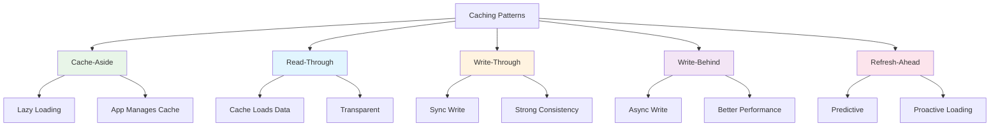

# System Design Fundamentals: Advanced Caching Strategies

Caching is one of the most effective techniques for improving system performance. This guide covers advanced caching patterns, eviction policies, and distributed caching strategies.

## Caching Patterns Overview



## Cache-Aside Pattern

```go
// Cache-Aside (Lazy Loading) Implementation
package main

import (
    "fmt"
    "sync"
    "time"
)

type DataStore struct {
    data  map[string]string
    mutex sync.RWMutex
}

func NewDataStore() *DataStore {
    return &DataStore{
        data: make(map[string]string),
    }
}

func (ds *DataStore) Get(key string) (string, error) {
    ds.mutex.RLock()
    defer ds.mutex.RUnlock()
    
    // Simulate database latency
    time.Sleep(50 * time.Millisecond)
    
    value, exists := ds.data[key]
    if !exists {
        return "", fmt.Errorf("key not found: %s", key)
    }
    
    fmt.Printf("📀 Database read: %s\n", key)
    return value, nil
}

func (ds *DataStore) Set(key, value string) error {
    ds.mutex.Lock()
    defer ds.mutex.Unlock()
    
    // Simulate database latency
    time.Sleep(100 * time.Millisecond)
    
    ds.data[key] = value
    fmt.Printf("📀 Database write: %s\n", key)
    
    return nil
}

// Cache-Aside Cache
type CacheAsideCache struct {
    cache     map[string]*CacheEntry
    dataStore *DataStore
    ttl       time.Duration
    mutex     sync.RWMutex
    stats     struct {
        Hits   int64
        Misses int64
    }
}

type CacheEntry struct {
    Value     string
    ExpiresAt time.Time
}

func NewCacheAsideCache(dataStore *DataStore, ttl time.Duration) *CacheAsideCache {
    return &CacheAsideCache{
        cache:     make(map[string]*CacheEntry),
        dataStore: dataStore,
        ttl:       ttl,
    }
}

func (c *CacheAsideCache) Get(key string) (string, error) {
    // Check cache first
    c.mutex.RLock()
    entry, exists := c.cache[key]
    c.mutex.RUnlock()
    
    if exists && time.Now().Before(entry.ExpiresAt) {
        c.stats.Hits++
        fmt.Printf("✅ Cache HIT: %s\n", key)
        return entry.Value, nil
    }
    
    // Cache miss - load from database
    c.stats.Misses++
    fmt.Printf("⚠️  Cache MISS: %s\n", key)
    
    value, err := c.dataStore.Get(key)
    if err != nil {
        return "", err
    }
    
    // Store in cache
    c.Set(key, value)
    
    return value, nil
}

func (c *CacheAsideCache) Set(key, value string) {
    c.mutex.Lock()
    defer c.mutex.Unlock()
    
    c.cache[key] = &CacheEntry{
        Value:     value,
        ExpiresAt: time.Now().Add(c.ttl),
    }
    
    fmt.Printf("💾 Cached: %s\n", key)
}

func (c *CacheAsideCache) Write(key, value string) error {
    // Write to database
    err := c.dataStore.Set(key, value)
    if err != nil {
        return err
    }
    
    // Invalidate cache
    c.Invalidate(key)
    
    return nil
}

func (c *CacheAsideCache) Invalidate(key string) {
    c.mutex.Lock()
    defer c.mutex.Unlock()
    
    delete(c.cache, key)
    fmt.Printf("🗑️  Cache invalidated: %s\n", key)
}

func (c *CacheAsideCache) GetHitRate() float64 {
    total := c.stats.Hits + c.stats.Misses
    if total == 0 {
        return 0
    }
    return float64(c.stats.Hits) / float64(total) * 100
}
```

## Read-Through and Write-Through Cache

```go
// Read-Through Cache
package main

import (
    "fmt"
    "sync"
    "time"
)

type ReadThroughCache struct {
    cache     map[string]*CacheEntry
    dataStore *DataStore
    ttl       time.Duration
    mutex     sync.RWMutex
}

func NewReadThroughCache(dataStore *DataStore, ttl time.Duration) *ReadThroughCache {
    return &ReadThroughCache{
        cache:     make(map[string]*CacheEntry),
        dataStore: dataStore,
        ttl:       ttl,
    }
}

func (rtc *ReadThroughCache) Get(key string) (string, error) {
    rtc.mutex.Lock()
    defer rtc.mutex.Unlock()
    
    // Check cache
    entry, exists := rtc.cache[key]
    if exists && time.Now().Before(entry.ExpiresAt) {
        fmt.Printf("✅ Read-through cache HIT: %s\n", key)
        return entry.Value, nil
    }
    
    // Cache automatically loads from data store
    fmt.Printf("📥 Read-through loading: %s\n", key)
    
    value, err := rtc.dataStore.Get(key)
    if err != nil {
        return "", err
    }
    
    // Cache the value
    rtc.cache[key] = &CacheEntry{
        Value:     value,
        ExpiresAt: time.Now().Add(rtc.ttl),
    }
    
    return value, nil
}

// Write-Through Cache
type WriteThroughCache struct {
    cache     map[string]*CacheEntry
    dataStore *DataStore
    ttl       time.Duration
    mutex     sync.RWMutex
}

func NewWriteThroughCache(dataStore *DataStore, ttl time.Duration) *WriteThroughCache {
    return &WriteThroughCache{
        cache:     make(map[string]*CacheEntry),
        dataStore: dataStore,
        ttl:       ttl,
    }
}

func (wtc *WriteThroughCache) Get(key string) (string, error) {
    wtc.mutex.RLock()
    entry, exists := wtc.cache[key]
    wtc.mutex.RUnlock()
    
    if exists && time.Now().Before(entry.ExpiresAt) {
        return entry.Value, nil
    }
    
    // Load from data store
    value, err := wtc.dataStore.Get(key)
    if err != nil {
        return "", err
    }
    
    return value, nil
}

func (wtc *WriteThroughCache) Set(key, value string) error {
    // Write to cache and database synchronously
    fmt.Printf("📤 Write-through: %s\n", key)
    
    // Write to database first
    err := wtc.dataStore.Set(key, value)
    if err != nil {
        return err
    }
    
    // Then update cache
    wtc.mutex.Lock()
    wtc.cache[key] = &CacheEntry{
        Value:     value,
        ExpiresAt: time.Now().Add(wtc.ttl),
    }
    wtc.mutex.Unlock()
    
    fmt.Printf("✅ Write-through complete: %s\n", key)
    
    return nil
}
```

## Write-Behind (Write-Back) Cache

```go
// Write-Behind Cache with Asynchronous Writes
package main

import (
    "context"
    "fmt"
    "sync"
    "time"
)

type WriteOperation struct {
    Key       string
    Value     string
    Timestamp time.Time
}

type WriteBehindCache struct {
    cache        map[string]*CacheEntry
    dataStore    *DataStore
    writeQueue   chan WriteOperation
    batchSize    int
    flushInterval time.Duration
    mutex        sync.RWMutex
    ctx          context.Context
    cancel       context.CancelFunc
}

func NewWriteBehindCache(dataStore *DataStore, batchSize int, flushInterval time.Duration) *WriteBehindCache {
    ctx, cancel := context.WithCancel(context.Background())
    
    wbc := &WriteBehindCache{
        cache:         make(map[string]*CacheEntry),
        dataStore:     dataStore,
        writeQueue:    make(chan WriteOperation, 1000),
        batchSize:     batchSize,
        flushInterval: flushInterval,
        ctx:           ctx,
        cancel:        cancel,
    }
    
    // Start background writer
    go wbc.backgroundWriter()
    
    return wbc
}

func (wbc *WriteBehindCache) Get(key string) (string, error) {
    wbc.mutex.RLock()
    entry, exists := wbc.cache[key]
    wbc.mutex.RUnlock()
    
    if exists {
        return entry.Value, nil
    }
    
    // Load from data store
    value, err := wbc.dataStore.Get(key)
    if err != nil {
        return "", err
    }
    
    return value, nil
}

func (wbc *WriteBehindCache) Set(key, value string) error {
    // Write to cache immediately
    wbc.mutex.Lock()
    wbc.cache[key] = &CacheEntry{
        Value:     value,
        ExpiresAt: time.Now().Add(5 * time.Minute),
    }
    wbc.mutex.Unlock()
    
    // Queue write operation for asynchronous processing
    select {
    case wbc.writeQueue <- WriteOperation{
        Key:       key,
        Value:     value,
        Timestamp: time.Now(),
    }:
        fmt.Printf("⏰ Write-behind queued: %s\n", key)
    default:
        fmt.Printf("⚠️  Write queue full for: %s\n", key)
    }
    
    return nil
}

func (wbc *WriteBehindCache) backgroundWriter() {
    batch := make([]WriteOperation, 0, wbc.batchSize)
    ticker := time.NewTicker(wbc.flushInterval)
    defer ticker.Stop()
    
    for {
        select {
        case <-wbc.ctx.Done():
            // Flush remaining operations
            wbc.flushBatch(batch)
            return
            
        case op := <-wbc.writeQueue:
            batch = append(batch, op)
            
            if len(batch) >= wbc.batchSize {
                wbc.flushBatch(batch)
                batch = make([]WriteOperation, 0, wbc.batchSize)
            }
            
        case <-ticker.C:
            if len(batch) > 0 {
                wbc.flushBatch(batch)
                batch = make([]WriteOperation, 0, wbc.batchSize)
            }
        }
    }
}

func (wbc *WriteBehindCache) flushBatch(batch []WriteOperation) {
    if len(batch) == 0 {
        return
    }
    
    fmt.Printf("📤 Flushing batch: %d operations\n", len(batch))
    
    for _, op := range batch {
        err := wbc.dataStore.Set(op.Key, op.Value)
        if err != nil {
            fmt.Printf("❌ Failed to write %s: %v\n", op.Key, err)
        }
    }
    
    fmt.Printf("✅ Batch flushed successfully\n")
}

func (wbc *WriteBehindCache) Close() {
    wbc.cancel()
}
```

## Multi-Level Cache

```go
// Multi-Level Cache (L1 + L2)
package main

import (
    "fmt"
    "sync"
    "time"
)

type MultiLevelCache struct {
    l1Cache   *LRUCache      // In-memory, fast
    l2Cache   *DistributedCache // Redis-like, shared
    dataStore *DataStore
    stats     struct {
        L1Hits int64
        L2Hits int64
        Misses int64
        mutex  sync.RWMutex
    }
}

func NewMultiLevelCache(l1Size int, l2Cache *DistributedCache, dataStore *DataStore) *MultiLevelCache {
    return &MultiLevelCache{
        l1Cache:   NewLRUCache(l1Size),
        l2Cache:   l2Cache,
        dataStore: dataStore,
    }
}

func (mlc *MultiLevelCache) Get(key string) (string, error) {
    // Check L1 cache (local memory)
    value, found := mlc.l1Cache.Get(key)
    if found {
        mlc.recordHit(1)
        fmt.Printf("⚡ L1 cache HIT: %s\n", key)
        return value, nil
    }
    
    // Check L2 cache (distributed)
    value, found = mlc.l2Cache.Get(key)
    if found {
        mlc.recordHit(2)
        fmt.Printf("🌐 L2 cache HIT: %s\n", key)
        
        // Promote to L1
        mlc.l1Cache.Put(key, value)
        
        return value, nil
    }
    
    // Cache miss - load from data store
    mlc.recordMiss()
    fmt.Printf("📀 Cache MISS: %s - loading from database\n", key)
    
    value, err := mlc.dataStore.Get(key)
    if err != nil {
        return "", err
    }
    
    // Store in both caches
    mlc.l1Cache.Put(key, value)
    mlc.l2Cache.Set(key, value, 1*time.Hour)
    
    return value, nil
}

func (mlc *MultiLevelCache) Set(key, value string) error {
    // Write to data store
    err := mlc.dataStore.Set(key, value)
    if err != nil {
        return err
    }
    
    // Update both cache levels
    mlc.l1Cache.Put(key, value)
    mlc.l2Cache.Set(key, value, 1*time.Hour)
    
    return nil
}

func (mlc *MultiLevelCache) recordHit(level int) {
    mlc.stats.mutex.Lock()
    defer mlc.stats.mutex.Unlock()
    
    if level == 1 {
        mlc.stats.L1Hits++
    } else {
        mlc.stats.L2Hits++
    }
}

func (mlc *MultiLevelCache) recordMiss() {
    mlc.stats.mutex.Lock()
    defer mlc.stats.mutex.Unlock()
    
    mlc.stats.Misses++
}

func (mlc *MultiLevelCache) GetStats() map[string]interface{} {
    mlc.stats.mutex.RLock()
    defer mlc.stats.mutex.RUnlock()
    
    total := mlc.stats.L1Hits + mlc.stats.L2Hits + mlc.stats.Misses
    
    return map[string]interface{}{
        "l1_hits":      mlc.stats.L1Hits,
        "l2_hits":      mlc.stats.L2Hits,
        "misses":       mlc.stats.Misses,
        "total":        total,
        "l1_hit_rate":  float64(mlc.stats.L1Hits) / float64(total) * 100,
        "overall_hit_rate": float64(mlc.stats.L1Hits+mlc.stats.L2Hits) / float64(total) * 100,
    }
}

// LRU Cache for L1
type LRUCache struct {
    capacity int
    cache    map[string]*LRUNode
    head     *LRUNode
    tail     *LRUNode
    mutex    sync.Mutex
}

type LRUNode struct {
    key   string
    value string
    prev  *LRUNode
    next  *LRUNode
}

func NewLRUCache(capacity int) *LRUCache {
    lru := &LRUCache{
        capacity: capacity,
        cache:    make(map[string]*LRUNode),
    }
    
    // Create dummy head and tail
    lru.head = &LRUNode{}
    lru.tail = &LRUNode{}
    lru.head.next = lru.tail
    lru.tail.prev = lru.head
    
    return lru
}

func (lru *LRUCache) Get(key string) (string, bool) {
    lru.mutex.Lock()
    defer lru.mutex.Unlock()
    
    node, exists := lru.cache[key]
    if !exists {
        return "", false
    }
    
    // Move to front (most recently used)
    lru.moveToFront(node)
    
    return node.value, true
}

func (lru *LRUCache) Put(key, value string) {
    lru.mutex.Lock()
    defer lru.mutex.Unlock()
    
    if node, exists := lru.cache[key]; exists {
        // Update existing node
        node.value = value
        lru.moveToFront(node)
        return
    }
    
    // Create new node
    newNode := &LRUNode{
        key:   key,
        value: value,
    }
    
    lru.cache[key] = newNode
    lru.addToFront(newNode)
    
    // Evict if over capacity
    if len(lru.cache) > lru.capacity {
        lru.evictLRU()
    }
}

func (lru *LRUCache) moveToFront(node *LRUNode) {
    lru.removeNode(node)
    lru.addToFront(node)
}

func (lru *LRUCache) addToFront(node *LRUNode) {
    node.next = lru.head.next
    node.prev = lru.head
    lru.head.next.prev = node
    lru.head.next = node
}

func (lru *LRUCache) removeNode(node *LRUNode) {
    node.prev.next = node.next
    node.next.prev = node.prev
}

func (lru *LRUCache) evictLRU() {
    lruNode := lru.tail.prev
    lru.removeNode(lruNode)
    delete(lru.cache, lruNode.key)
}

// Distributed Cache (Simulated Redis-like)
type DistributedCache struct {
    data  map[string]*DistributedCacheEntry
    mutex sync.RWMutex
}

type DistributedCacheEntry struct {
    Value     string
    ExpiresAt time.Time
}

func NewDistributedCache() *DistributedCache {
    return &DistributedCache{
        data: make(map[string]*DistributedCacheEntry),
    }
}

func (dc *DistributedCache) Get(key string) (string, bool) {
    dc.mutex.RLock()
    defer dc.mutex.RUnlock()
    
    entry, exists := dc.data[key]
    if !exists || time.Now().After(entry.ExpiresAt) {
        return "", false
    }
    
    return entry.Value, true
}

func (dc *DistributedCache) Set(key, value string, ttl time.Duration) {
    dc.mutex.Lock()
    defer dc.mutex.Unlock()
    
    dc.data[key] = &DistributedCacheEntry{
        Value:     value,
        ExpiresAt: time.Now().Add(ttl),
    }
}
```

## Cache Invalidation Strategies

```go
// Advanced Cache Invalidation
package main

import (
    "fmt"
    "sync"
    "time"
)

type InvalidationStrategy interface {
    Invalidate(cache *AdvancedCache, key string)
    GetName() string
}

// Time-Based Invalidation (TTL)
type TTLInvalidation struct {
    ttl time.Duration
}

func NewTTLInvalidation(ttl time.Duration) *TTLInvalidation {
    return &TTLInvalidation{ttl: ttl}
}

func (ttl *TTLInvalidation) Invalidate(cache *AdvancedCache, key string) {
    cache.mutex.Lock()
    defer cache.mutex.Unlock()
    
    if entry, exists := cache.data[key]; exists {
        entry.ExpiresAt = time.Now().Add(ttl.ttl)
    }
}

func (ttl *TTLInvalidation) GetName() string {
    return "TTL-based"
}

// Event-Based Invalidation
type EventBasedInvalidation struct {
    subscribers map[string][]func(string)
    mutex       sync.RWMutex
}

func NewEventBasedInvalidation() *EventBasedInvalidation {
    return &EventBasedInvalidation{
        subscribers: make(map[string][]func(string)),
    }
}

func (ebi *EventBasedInvalidation) Subscribe(event string, callback func(string)) {
    ebi.mutex.Lock()
    defer ebi.mutex.Unlock()
    
    ebi.subscribers[event] = append(ebi.subscribers[event], callback)
}

func (ebi *EventBasedInvalidation) Publish(event, key string) {
    ebi.mutex.RLock()
    callbacks := ebi.subscribers[event]
    ebi.mutex.RUnlock()
    
    fmt.Printf("📢 Event published: %s for key %s\n", event, key)
    
    for _, callback := range callbacks {
        go callback(key)
    }
}

func (ebi *EventBasedInvalidation) Invalidate(cache *AdvancedCache, key string) {
    ebi.Publish("invalidate", key)
}

func (ebi *EventBasedInvalidation) GetName() string {
    return "Event-based"
}

// Dependency-Based Invalidation
type DependencyInvalidation struct {
    dependencies map[string][]string // key -> dependent keys
    mutex        sync.RWMutex
}

func NewDependencyInvalidation() *DependencyInvalidation {
    return &DependencyInvalidation{
        dependencies: make(map[string][]string),
    }
}

func (di *DependencyInvalidation) AddDependency(key, dependentKey string) {
    di.mutex.Lock()
    defer di.mutex.Unlock()
    
    di.dependencies[key] = append(di.dependencies[key], dependentKey)
    fmt.Printf("🔗 Added dependency: %s -> %s\n", key, dependentKey)
}

func (di *DependencyInvalidation) Invalidate(cache *AdvancedCache, key string) {
    di.mutex.RLock()
    dependents := di.dependencies[key]
    di.mutex.RUnlock()
    
    // Invalidate the key
    cache.Delete(key)
    
    // Invalidate all dependent keys
    fmt.Printf("🗑️  Invalidating %s and %d dependents\n", key, len(dependents))
    
    for _, dependent := range dependents {
        cache.Delete(dependent)
    }
}

func (di *DependencyInvalidation) GetName() string {
    return "Dependency-based"
}

// Advanced Cache with Invalidation Strategies
type AdvancedCache struct {
    data     map[string]*AdvancedCacheEntry
    strategy InvalidationStrategy
    mutex    sync.RWMutex
}

type AdvancedCacheEntry struct {
    Value     string
    ExpiresAt time.Time
    Metadata  map[string]interface{}
}

func NewAdvancedCache(strategy InvalidationStrategy) *AdvancedCache {
    return &AdvancedCache{
        data:     make(map[string]*AdvancedCacheEntry),
        strategy: strategy,
    }
}

func (ac *AdvancedCache) Get(key string) (string, bool) {
    ac.mutex.RLock()
    defer ac.mutex.RUnlock()
    
    entry, exists := ac.data[key]
    if !exists || time.Now().After(entry.ExpiresAt) {
        return "", false
    }
    
    return entry.Value, true
}

func (ac *AdvancedCache) Set(key, value string, ttl time.Duration) {
    ac.mutex.Lock()
    defer ac.mutex.Unlock()
    
    ac.data[key] = &AdvancedCacheEntry{
        Value:     value,
        ExpiresAt: time.Now().Add(ttl),
        Metadata:  make(map[string]interface{}),
    }
}

func (ac *AdvancedCache) Delete(key string) {
    ac.mutex.Lock()
    defer ac.mutex.Unlock()
    
    delete(ac.data, key)
}

func (ac *AdvancedCache) InvalidateKey(key string) {
    ac.strategy.Invalidate(ac, key)
}
```

## Cache Stampede Prevention

```go
// Cache Stampede Prevention
package main

import (
    "context"
    "fmt"
    "sync"
    "time"
)

type StampedeProtectedCache struct {
    cache       map[string]*CacheEntry
    loadingKeys map[string]*sync.WaitGroup
    dataStore   *DataStore
    mutex       sync.RWMutex
    loadMutex   sync.Mutex
}

func NewStampedeProtectedCache(dataStore *DataStore) *StampedeProtectedCache {
    return &StampedeProtectedCache{
        cache:       make(map[string]*CacheEntry),
        loadingKeys: make(map[string]*sync.WaitGroup),
        dataStore:   dataStore,
    }
}

func (spc *StampedeProtectedCache) Get(ctx context.Context, key string) (string, error) {
    // Check cache first
    spc.mutex.RLock()
    entry, exists := spc.cache[key]
    spc.mutex.RUnlock()
    
    if exists && time.Now().Before(entry.ExpiresAt) {
        return entry.Value, nil
    }
    
    // Check if another goroutine is already loading this key
    spc.loadMutex.Lock()
    
    if wg, loading := spc.loadingKeys[key]; loading {
        // Another goroutine is loading, wait for it
        spc.loadMutex.Unlock()
        
        fmt.Printf("⏳ Waiting for key to be loaded: %s\n", key)
        wg.Wait()
        
        // Try cache again
        spc.mutex.RLock()
        entry, exists := spc.cache[key]
        spc.mutex.RUnlock()
        
        if exists {
            return entry.Value, nil
        }
        
        return "", fmt.Errorf("failed to load key: %s", key)
    }
    
    // This goroutine will load the key
    wg := &sync.WaitGroup{}
    wg.Add(1)
    spc.loadingKeys[key] = wg
    spc.loadMutex.Unlock()
    
    // Load from data store
    fmt.Printf("📥 Loading key (stampede protected): %s\n", key)
    
    value, err := spc.dataStore.Get(key)
    
    // Update cache
    if err == nil {
        spc.mutex.Lock()
        spc.cache[key] = &CacheEntry{
            Value:     value,
            ExpiresAt: time.Now().Add(5 * time.Minute),
        }
        spc.mutex.Unlock()
    }
    
    // Cleanup and notify waiters
    spc.loadMutex.Lock()
    delete(spc.loadingKeys, key)
    spc.loadMutex.Unlock()
    
    wg.Done()
    
    return value, err
}
```

## Complete Demo

```go
func main() {
    fmt.Println("🚀 Starting Advanced Caching Demo\n")
    
    // Setup data store
    dataStore := NewDataStore()
    for i := 1; i <= 10; i++ {
        dataStore.Set(fmt.Sprintf("key-%d", i), fmt.Sprintf("value-%d", i))
    }
    
    // 1. Cache-Aside Pattern
    fmt.Println("=== Cache-Aside Pattern ===")
    cacheAside := NewCacheAsideCache(dataStore, 5*time.Minute)
    
    for i := 1; i <= 3; i++ {
        key := fmt.Sprintf("key-%d", i)
        cacheAside.Get(key)
        cacheAside.Get(key) // Should hit cache
    }
    
    fmt.Printf("Cache hit rate: %.2f%%\n\n", cacheAside.GetHitRate())
    
    // 2. Write-Through Cache
    fmt.Println("=== Write-Through Cache ===")
    writeThrough := NewWriteThroughCache(dataStore, 5*time.Minute)
    
    writeThrough.Set("new-key", "new-value")
    value, _ := writeThrough.Get("new-key")
    fmt.Printf("Retrieved: %s\n\n", value)
    
    // 3. Write-Behind Cache
    fmt.Println("=== Write-Behind Cache ===")
    writeBehind := NewWriteBehindCache(dataStore, 3, 2*time.Second)
    
    for i := 1; i <= 5; i++ {
        writeBehind.Set(fmt.Sprintf("async-key-%d", i), fmt.Sprintf("async-value-%d", i))
    }
    
    time.Sleep(3 * time.Second)
    writeBehind.Close()
    fmt.Println()
    
    // 4. Multi-Level Cache
    fmt.Println("=== Multi-Level Cache ===")
    l2Cache := NewDistributedCache()
    multiLevel := NewMultiLevelCache(5, l2Cache, dataStore)
    
    // Access same keys multiple times
    for j := 0; j < 3; j++ {
        for i := 1; i <= 5; i++ {
            key := fmt.Sprintf("key-%d", i)
            multiLevel.Get(key)
        }
    }
    
    stats := multiLevel.GetStats()
    fmt.Printf("\nMulti-level cache stats:\n")
    fmt.Printf("  L1 hits: %d\n", stats["l1_hits"])
    fmt.Printf("  L2 hits: %d\n", stats["l2_hits"])
    fmt.Printf("  Misses: %d\n", stats["misses"])
    fmt.Printf("  Overall hit rate: %.2f%%\n\n", stats["overall_hit_rate"])
    
    // 5. Cache Invalidation
    fmt.Println("=== Cache Invalidation Strategies ===")
    
    // Dependency-based invalidation
    depInvalidation := NewDependencyInvalidation()
    advCache := NewAdvancedCache(depInvalidation)
    
    advCache.Set("user:1", "John Doe", 10*time.Minute)
    advCache.Set("user:1:profile", "Profile Data", 10*time.Minute)
    advCache.Set("user:1:settings", "Settings Data", 10*time.Minute)
    
    depInvalidation.AddDependency("user:1", "user:1:profile")
    depInvalidation.AddDependency("user:1", "user:1:settings")
    
    advCache.InvalidateKey("user:1")
    fmt.Println()
    
    // 6. Cache Stampede Protection
    fmt.Println("=== Cache Stampede Protection ===")
    stampedeCache := NewStampedeProtectedCache(dataStore)
    
    // Simulate concurrent requests for same key
    var wg sync.WaitGroup
    for i := 0; i < 5; i++ {
        wg.Add(1)
        go func(id int) {
            defer wg.Done()
            ctx := context.Background()
            value, _ := stampedeCache.Get(ctx, "popular-key")
            fmt.Printf("  Goroutine %d got: %s\n", id, value)
        }(i)
    }
    wg.Wait()
    
    fmt.Println("\n✅ Demo completed!")
}
```

## Caching Strategies Comparison

| Pattern | Consistency | Performance | Complexity | Best For |
|---------|-------------|-------------|------------|----------|
| Cache-Aside | Eventual | Good | Low | General purpose |
| Read-Through | Eventual | Good | Medium | Read-heavy |
| Write-Through | Strong | Moderate | Medium | Consistency critical |
| Write-Behind | Eventual | Excellent | High | Write-heavy |
| Multi-Level | Eventual | Excellent | High | Large scale |

## Best Practices

### 1. Choose Right Eviction Policy
- **LRU**: Most commonly used
- **LFU**: Frequency-based
- **TTL**: Time-based expiration
- **Random**: Simple, fast

### 2. Monitor Cache Metrics
- Hit rate (target: >80%)
- Eviction rate
- Memory usage
- Latency improvements

### 3. Handle Cache Failures
- Fallback to data store
- Circuit breaker pattern
- Graceful degradation
- Retry mechanisms

### 4. Prevent Common Issues
- Cache stampede
- Cache penetration
- Cache avalanche
- Hot key problems

## Conclusion

Effective caching requires:
- **Right pattern**: Match workload characteristics
- **Proper sizing**: Balance memory and hit rate
- **Smart invalidation**: Keep data fresh
- **Monitoring**: Track performance metrics

Well-implemented caching can reduce latency by 90%+ and significantly decrease database load.