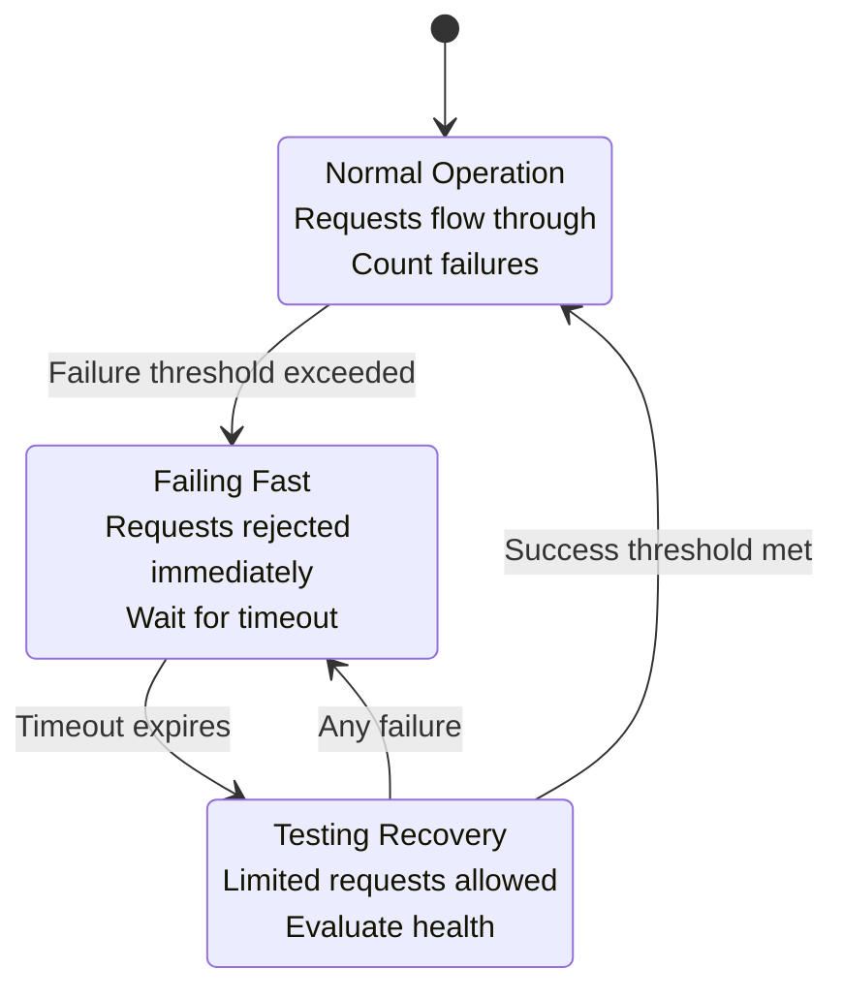

# System Design Fundamentals: Circuit Breaker Pattern

The circuit breaker pattern prevents cascading failures in distributed systems by failing fast when a service is unavailable, allowing it time to recover.

## Circuit Breaker States



## Basic Circuit Breaker Implementation

```go
// Circuit Breaker Implementation
package main

import (
    "context"
    "errors"
    "fmt"
    "sync"
    "time"
)

type State int

const (
    StateClosed State = iota
    StateOpen
    StateHalfOpen
)

func (s State) String() string {
    switch s {
    case StateClosed:
        return "CLOSED"
    case StateOpen:
        return "OPEN"
    case StateHalfOpen:
        return "HALF-OPEN"
    default:
        return "UNKNOWN"
    }
}

type CircuitBreaker struct {
    name                string
    state               State
    failureCount        int
    successCount        int
    failureThreshold    int
    successThreshold    int
    timeout             time.Duration
    lastFailureTime     time.Time
    lastStateChange     time.Time
    mutex               sync.RWMutex
    onStateChange       func(from, to State)
}

type Config struct {
    Name              string
    FailureThreshold  int
    SuccessThreshold  int
    Timeout           time.Duration
    OnStateChange     func(from, to State)
}

var (
    ErrCircuitOpen     = errors.New("circuit breaker is open")
    ErrTooManyRequests = errors.New("too many requests in half-open state")
)

func NewCircuitBreaker(config Config) *CircuitBreaker {
    return &CircuitBreaker{
        name:             config.Name,
        state:            StateClosed,
        failureThreshold: config.FailureThreshold,
        successThreshold: config.SuccessThreshold,
        timeout:          config.Timeout,
        lastStateChange:  time.Now(),
        onStateChange:    config.OnStateChange,
    }
}

func (cb *CircuitBreaker) Call(ctx context.Context, fn func() error) error {
    // Check if request can proceed
    if err := cb.beforeRequest(); err != nil {
        return err
    }
    
    // Execute the function
    start := time.Now()
    err := fn()
    duration := time.Since(start)
    
    // Handle result
    cb.afterRequest(err, duration)
    
    return err
}

func (cb *CircuitBreaker) beforeRequest() error {
    cb.mutex.Lock()
    defer cb.mutex.Unlock()
    
    switch cb.state {
    case StateClosed:
        // Allow request
        return nil
        
    case StateOpen:
        // Check if timeout has elapsed
        if time.Since(cb.lastFailureTime) > cb.timeout {
            cb.setState(StateHalfOpen)
            return nil
        }
        
        return ErrCircuitOpen
        
    case StateHalfOpen:
        // Allow limited requests to test recovery
        return nil
        
    default:
        return ErrCircuitOpen
    }
}

func (cb *CircuitBreaker) afterRequest(err error, duration time.Duration) {
    cb.mutex.Lock()
    defer cb.mutex.Unlock()
    
    if err != nil {
        cb.onFailure()
        fmt.Printf("❌ [%s] Request failed (state=%s, failures=%d/%d) - %v\n",
            cb.name, cb.state, cb.failureCount, cb.failureThreshold, err)
    } else {
        cb.onSuccess()
        fmt.Printf("✅ [%s] Request succeeded (state=%s, duration=%v)\n",
            cb.name, cb.state, duration)
    }
}

func (cb *CircuitBreaker) onSuccess() {
    switch cb.state {
    case StateClosed:
        cb.failureCount = 0
        
    case StateHalfOpen:
        cb.successCount++
        if cb.successCount >= cb.successThreshold {
            cb.setState(StateClosed)
            cb.failureCount = 0
            cb.successCount = 0
        }
    }
}

func (cb *CircuitBreaker) onFailure() {
    cb.lastFailureTime = time.Now()
    
    switch cb.state {
    case StateClosed:
        cb.failureCount++
        if cb.failureCount >= cb.failureThreshold {
            cb.setState(StateOpen)
        }
        
    case StateHalfOpen:
        cb.setState(StateOpen)
        cb.successCount = 0
    }
}

func (cb *CircuitBreaker) setState(newState State) {
    oldState := cb.state
    
    if oldState == newState {
        return
    }
    
    cb.state = newState
    cb.lastStateChange = time.Now()
    
    fmt.Printf("🔄 [%s] State transition: %s → %s\n", cb.name, oldState, newState)
    
    if cb.onStateChange != nil {
        cb.onStateChange(oldState, newState)
    }
}

func (cb *CircuitBreaker) GetState() State {
    cb.mutex.RLock()
    defer cb.mutex.RUnlock()
    return cb.state
}

func (cb *CircuitBreaker) GetStats() map[string]interface{} {
    cb.mutex.RLock()
    defer cb.mutex.RUnlock()
    
    return map[string]interface{}{
        "name":             cb.name,
        "state":            cb.state.String(),
        "failure_count":    cb.failureCount,
        "success_count":    cb.successCount,
        "last_state_change": cb.lastStateChange,
    }
}
```

## Circuit Breaker with Metrics

```go
// Circuit Breaker with Detailed Metrics
package main

import (
    "context"
    "fmt"
    "sync"
    "sync/atomic"
    "time"
)

type Metrics struct {
    TotalRequests     int64
    SuccessfulRequests int64
    FailedRequests    int64
    RejectedRequests  int64
    Timeouts          int64
    TotalDuration     int64 // nanoseconds
    StateChanges      int64
}

type MeteredCircuitBreaker struct {
    *CircuitBreaker
    metrics Metrics
    mutex   sync.RWMutex
}

func NewMeteredCircuitBreaker(config Config) *MeteredCircuitBreaker {
    cb := NewCircuitBreaker(config)
    
    mcb := &MeteredCircuitBreaker{
        CircuitBreaker: cb,
    }
    
    // Wrap state change callback
    originalCallback := config.OnStateChange
    cb.onStateChange = func(from, to State) {
        atomic.AddInt64(&mcb.metrics.StateChanges, 1)
        if originalCallback != nil {
            originalCallback(from, to)
        }
    }
    
    return mcb
}

func (mcb *MeteredCircuitBreaker) Call(ctx context.Context, fn func() error) error {
    atomic.AddInt64(&mcb.metrics.TotalRequests, 1)
    
    start := time.Now()
    err := mcb.CircuitBreaker.Call(ctx, fn)
    duration := time.Since(start)
    
    atomic.AddInt64(&mcb.metrics.TotalDuration, int64(duration))
    
    if err != nil {
        if err == ErrCircuitOpen || err == ErrTooManyRequests {
            atomic.AddInt64(&mcb.metrics.RejectedRequests, 1)
        } else if err == context.DeadlineExceeded {
            atomic.AddInt64(&mcb.metrics.Timeouts, 1)
            atomic.AddInt64(&mcb.metrics.FailedRequests, 1)
        } else {
            atomic.AddInt64(&mcb.metrics.FailedRequests, 1)
        }
    } else {
        atomic.AddInt64(&mcb.metrics.SuccessfulRequests, 1)
    }
    
    return err
}

func (mcb *MeteredCircuitBreaker) GetMetrics() Metrics {
    return Metrics{
        TotalRequests:      atomic.LoadInt64(&mcb.metrics.TotalRequests),
        SuccessfulRequests: atomic.LoadInt64(&mcb.metrics.SuccessfulRequests),
        FailedRequests:     atomic.LoadInt64(&mcb.metrics.FailedRequests),
        RejectedRequests:   atomic.LoadInt64(&mcb.metrics.RejectedRequests),
        Timeouts:           atomic.LoadInt64(&mcb.metrics.Timeouts),
        TotalDuration:      atomic.LoadInt64(&mcb.metrics.TotalDuration),
        StateChanges:       atomic.LoadInt64(&mcb.metrics.StateChanges),
    }
}

func (mcb *MeteredCircuitBreaker) PrintMetrics() {
    metrics := mcb.GetMetrics()
    
    fmt.Printf("\n📊 Circuit Breaker Metrics: %s\n", mcb.name)
    fmt.Printf("  Total Requests: %d\n", metrics.TotalRequests)
    fmt.Printf("  Successful: %d (%.2f%%)\n", 
        metrics.SuccessfulRequests, 
        float64(metrics.SuccessfulRequests)/float64(metrics.TotalRequests)*100)
    fmt.Printf("  Failed: %d (%.2f%%)\n", 
        metrics.FailedRequests,
        float64(metrics.FailedRequests)/float64(metrics.TotalRequests)*100)
    fmt.Printf("  Rejected: %d (%.2f%%)\n", 
        metrics.RejectedRequests,
        float64(metrics.RejectedRequests)/float64(metrics.TotalRequests)*100)
    fmt.Printf("  Timeouts: %d\n", metrics.Timeouts)
    fmt.Printf("  State Changes: %d\n", metrics.StateChanges)
    
    if metrics.TotalRequests > 0 {
        avgDuration := time.Duration(metrics.TotalDuration / metrics.TotalRequests)
        fmt.Printf("  Avg Duration: %v\n", avgDuration)
    }
    
    fmt.Printf("  Current State: %s\n", mcb.GetState())
    fmt.Println()
}
```

## Circuit Breaker with Fallback

```go
// Circuit Breaker with Fallback Strategy
package main

import (
    "context"
    "fmt"
)

type FallbackFunc func(error) error

type FallbackCircuitBreaker struct {
    *MeteredCircuitBreaker
    fallback FallbackFunc
}

func NewFallbackCircuitBreaker(config Config, fallback FallbackFunc) *FallbackCircuitBreaker {
    return &FallbackCircuitBreaker{
        MeteredCircuitBreaker: NewMeteredCircuitBreaker(config),
        fallback:              fallback,
    }
}

func (fcb *FallbackCircuitBreaker) CallWithFallback(ctx context.Context, fn func() error) error {
    err := fcb.Call(ctx, fn)
    
    if err != nil && fcb.fallback != nil {
        fmt.Printf("⚠️  [%s] Executing fallback due to error: %v\n", fcb.name, err)
        return fcb.fallback(err)
    }
    
    return err
}
```

## Adaptive Circuit Breaker

```go
// Adaptive Circuit Breaker with Dynamic Thresholds
package main

import (
    "context"
    "fmt"
    "sync"
    "time"
)

type AdaptiveCircuitBreaker struct {
    name                 string
    state                State
    windowSize           time.Duration
    requestWindow        []requestRecord
    minThroughput        int
    errorPercentThreshold float64
    timeout              time.Duration
    lastStateChange      time.Time
    mutex                sync.RWMutex
}

type requestRecord struct {
    timestamp time.Time
    success   bool
}

func NewAdaptiveCircuitBreaker(name string, windowSize time.Duration, minThroughput int, errorPercentThreshold float64, timeout time.Duration) *AdaptiveCircuitBreaker {
    return &AdaptiveCircuitBreaker{
        name:                  name,
        state:                 StateClosed,
        windowSize:            windowSize,
        requestWindow:         make([]requestRecord, 0),
        minThroughput:         minThroughput,
        errorPercentThreshold: errorPercentThreshold,
        timeout:               timeout,
        lastStateChange:       time.Now(),
    }
}

func (acb *AdaptiveCircuitBreaker) Call(ctx context.Context, fn func() error) error {
    if err := acb.beforeRequest(); err != nil {
        return err
    }
    
    start := time.Now()
    err := fn()
    
    acb.afterRequest(err, start)
    
    return err
}

func (acb *AdaptiveCircuitBreaker) beforeRequest() error {
    acb.mutex.Lock()
    defer acb.mutex.Unlock()
    
    acb.cleanOldRecords()
    
    switch acb.state {
    case StateClosed:
        return nil
        
    case StateOpen:
        if time.Since(acb.lastStateChange) > acb.timeout {
            acb.setState(StateHalfOpen)
            return nil
        }
        return ErrCircuitOpen
        
    case StateHalfOpen:
        return nil
        
    default:
        return ErrCircuitOpen
    }
}

func (acb *AdaptiveCircuitBreaker) afterRequest(err error, timestamp time.Time) {
    acb.mutex.Lock()
    defer acb.mutex.Unlock()
    
    // Record request
    acb.requestWindow = append(acb.requestWindow, requestRecord{
        timestamp: timestamp,
        success:   err == nil,
    })
    
    // Calculate error rate
    acb.evaluateState()
}

func (acb *AdaptiveCircuitBreaker) cleanOldRecords() {
    cutoff := time.Now().Add(-acb.windowSize)
    
    validRecords := make([]requestRecord, 0)
    for _, record := range acb.requestWindow {
        if record.timestamp.After(cutoff) {
            validRecords = append(validRecords, record)
        }
    }
    
    acb.requestWindow = validRecords
}

func (acb *AdaptiveCircuitBreaker) evaluateState() {
    totalRequests := len(acb.requestWindow)
    
    if totalRequests < acb.minThroughput {
        return
    }
    
    failedRequests := 0
    for _, record := range acb.requestWindow {
        if !record.success {
            failedRequests++
        }
    }
    
    errorRate := float64(failedRequests) / float64(totalRequests) * 100
    
    switch acb.state {
    case StateClosed:
        if errorRate > acb.errorPercentThreshold {
            acb.setState(StateOpen)
            fmt.Printf("⚠️  [%s] Error rate %.2f%% exceeds threshold %.2f%%, opening circuit\n",
                acb.name, errorRate, acb.errorPercentThreshold)
        }
        
    case StateHalfOpen:
        if errorRate > acb.errorPercentThreshold {
            acb.setState(StateOpen)
        } else if totalRequests >= acb.minThroughput {
            acb.setState(StateClosed)
            fmt.Printf("✅ [%s] Service recovered, error rate %.2f%%, closing circuit\n",
                acb.name, errorRate)
        }
    }
}

func (acb *AdaptiveCircuitBreaker) setState(newState State) {
    oldState := acb.state
    
    if oldState == newState {
        return
    }
    
    acb.state = newState
    acb.lastStateChange = time.Now()
    
    fmt.Printf("🔄 [%s] Adaptive state transition: %s → %s\n", acb.name, oldState, newState)
}

func (acb *AdaptiveCircuitBreaker) GetState() State {
    acb.mutex.RLock()
    defer acb.mutex.RUnlock()
    return acb.state
}

func (acb *AdaptiveCircuitBreaker) GetStats() map[string]interface{} {
    acb.mutex.RLock()
    defer acb.mutex.RUnlock()
    
    acb.cleanOldRecords()
    
    totalRequests := len(acb.requestWindow)
    successfulRequests := 0
    
    for _, record := range acb.requestWindow {
        if record.success {
            successfulRequests++
        }
    }
    
    errorRate := 0.0
    if totalRequests > 0 {
        errorRate = float64(totalRequests-successfulRequests) / float64(totalRequests) * 100
    }
    
    return map[string]interface{}{
        "name":               acb.name,
        "state":              acb.state.String(),
        "window_size":        acb.windowSize,
        "total_requests":     totalRequests,
        "successful_requests": successfulRequests,
        "error_rate":         errorRate,
        "threshold":          acb.errorPercentThreshold,
    }
}
```

## Circuit Breaker Manager

```go
// Circuit Breaker Manager for Multiple Services
package main

import (
    "context"
    "fmt"
    "sync"
)

type CircuitBreakerManager struct {
    breakers map[string]*MeteredCircuitBreaker
    mutex    sync.RWMutex
}

func NewCircuitBreakerManager() *CircuitBreakerManager {
    return &CircuitBreakerManager{
        breakers: make(map[string]*MeteredCircuitBreaker),
    }
}

func (cbm *CircuitBreakerManager) RegisterBreaker(name string, config Config) {
    cbm.mutex.Lock()
    defer cbm.mutex.Unlock()
    
    config.Name = name
    cbm.breakers[name] = NewMeteredCircuitBreaker(config)
    
    fmt.Printf("📋 Registered circuit breaker: %s\n", name)
}

func (cbm *CircuitBreakerManager) GetBreaker(name string) (*MeteredCircuitBreaker, bool) {
    cbm.mutex.RLock()
    defer cbm.mutex.RUnlock()
    
    breaker, exists := cbm.breakers[name]
    return breaker, exists
}

func (cbm *CircuitBreakerManager) Call(ctx context.Context, serviceName string, fn func() error) error {
    breaker, exists := cbm.GetBreaker(serviceName)
    
    if !exists {
        return fmt.Errorf("circuit breaker not found: %s", serviceName)
    }
    
    return breaker.Call(ctx, fn)
}

func (cbm *CircuitBreakerManager) GetAllStates() map[string]State {
    cbm.mutex.RLock()
    defer cbm.mutex.RUnlock()
    
    states := make(map[string]State)
    
    for name, breaker := range cbm.breakers {
        states[name] = breaker.GetState()
    }
    
    return states
}

func (cbm *CircuitBreakerManager) PrintAllMetrics() {
    cbm.mutex.RLock()
    defer cbm.mutex.RUnlock()
    
    fmt.Println("\n" + "="*60)
    fmt.Println("Circuit Breaker Manager - All Metrics")
    fmt.Println("="*60)
    
    for _, breaker := range cbm.breakers {
        breaker.PrintMetrics()
    }
}
```

## Complete Demo

```go
func main() {
    fmt.Println("🚀 Starting Circuit Breaker Demo\n")
    
    ctx := context.Background()
    
    // 1. Basic Circuit Breaker
    fmt.Println("=== Basic Circuit Breaker ===")
    
    cb := NewCircuitBreaker(Config{
        Name:             "payment-service",
        FailureThreshold: 3,
        SuccessThreshold: 2,
        Timeout:          5 * time.Second,
        OnStateChange: func(from, to State) {
            fmt.Printf("📢 State changed: %s → %s\n", from, to)
        },
    })
    
    // Simulate requests
    for i := 1; i <= 10; i++ {
        err := cb.Call(ctx, func() error {
            // Simulate failures
            if i >= 3 && i <= 7 {
                return fmt.Errorf("service unavailable")
            }
            return nil
        })
        
        if err != nil && err != ErrCircuitOpen {
            fmt.Printf("Request %d failed: %v\n", i, err)
        }
        
        time.Sleep(500 * time.Millisecond)
    }
    
    time.Sleep(2 * time.Second)
    
    // 2. Metered Circuit Breaker
    fmt.Println("\n=== Metered Circuit Breaker ===")
    
    mcb := NewMeteredCircuitBreaker(Config{
        Name:             "user-service",
        FailureThreshold: 5,
        SuccessThreshold: 3,
        Timeout:          3 * time.Second,
    })
    
    // Simulate load
    for i := 1; i <= 20; i++ {
        mcb.Call(ctx, func() error {
            // 30% failure rate
            if i%3 == 0 {
                return fmt.Errorf("temporary failure")
            }
            return nil
        })
        
        time.Sleep(200 * time.Millisecond)
    }
    
    mcb.PrintMetrics()
    
    // 3. Circuit Breaker with Fallback
    fmt.Println("=== Circuit Breaker with Fallback ===")
    
    fcb := NewFallbackCircuitBreaker(
        Config{
            Name:             "recommendation-service",
            FailureThreshold: 3,
            SuccessThreshold: 2,
            Timeout:          2 * time.Second,
        },
        func(err error) error {
            fmt.Println("  → Using cached recommendations as fallback")
            return nil // Fallback succeeded
        },
    )
    
    // Trigger failures
    for i := 1; i <= 5; i++ {
        fcb.CallWithFallback(ctx, func() error {
            return fmt.Errorf("service down")
        })
        time.Sleep(300 * time.Millisecond)
    }
    
    fcb.PrintMetrics()
    
    // 4. Adaptive Circuit Breaker
    fmt.Println("=== Adaptive Circuit Breaker ===")
    
    acb := NewAdaptiveCircuitBreaker(
        "analytics-service",
        10*time.Second, // window size
        10,             // min throughput
        25.0,           // 25% error threshold
        5*time.Second,  // timeout
    )
    
    // Simulate varying load
    for i := 1; i <= 30; i++ {
        acb.Call(ctx, func() error {
            // Gradually increase failure rate
            if i > 15 && i%2 == 0 {
                return fmt.Errorf("degraded service")
            }
            return nil
        })
        time.Sleep(100 * time.Millisecond)
    }
    
    stats := acb.GetStats()
    fmt.Printf("\n📊 Adaptive Circuit Breaker Stats:\n")
    fmt.Printf("  State: %s\n", stats["state"])
    fmt.Printf("  Total Requests: %d\n", stats["total_requests"])
    fmt.Printf("  Successful: %d\n", stats["successful_requests"])
    fmt.Printf("  Error Rate: %.2f%%\n", stats["error_rate"])
    fmt.Printf("  Threshold: %.2f%%\n", stats["threshold"])
    fmt.Println()
    
    // 5. Circuit Breaker Manager
    fmt.Println("=== Circuit Breaker Manager ===")
    
    manager := NewCircuitBreakerManager()
    
    // Register multiple services
    manager.RegisterBreaker("auth-service", Config{
        Name:             "auth-service",
        FailureThreshold: 3,
        SuccessThreshold: 2,
        Timeout:          3 * time.Second,
    })
    
    manager.RegisterBreaker("inventory-service", Config{
        Name:             "inventory-service",
        FailureThreshold: 5,
        SuccessThreshold: 3,
        Timeout:          5 * time.Second,
    })
    
    // Make requests to different services
    for i := 1; i <= 15; i++ {
        // Auth service calls
        manager.Call(ctx, "auth-service", func() error {
            if i%4 == 0 {
                return fmt.Errorf("auth failed")
            }
            return nil
        })
        
        // Inventory service calls
        manager.Call(ctx, "inventory-service", func() error {
            if i%6 == 0 {
                return fmt.Errorf("inventory unavailable")
            }
            return nil
        })
        
        time.Sleep(200 * time.Millisecond)
    }
    
    // Print all states
    states := manager.GetAllStates()
    fmt.Println("\nAll Circuit Breaker States:")
    for name, state := range states {
        fmt.Printf("  %s: %s\n", name, state)
    }
    
    manager.PrintAllMetrics()
    
    fmt.Println("✅ Demo completed!")
}
```

## Circuit Breaker Best Practices

### 1. Configure Appropriate Thresholds
```go
// Production-grade configuration
config := Config{
    Name:             "critical-service",
    FailureThreshold: 5,   // Trip after 5 consecutive failures
    SuccessThreshold: 3,   // Recover after 3 successful requests
    Timeout:          30 * time.Second, // Wait 30s before retry
}
```

### 2. Implement Proper Fallbacks
```go
// Cache-based fallback
fallback := func(err error) error {
    cachedData := cache.Get("key")
    if cachedData != nil {
        return nil // Use cached data
    }
    return err // No fallback available
}
```

### 3. Monitor Circuit Breaker States
```go
// Emit metrics for monitoring
func (cb *CircuitBreaker) emitMetrics() {
    metrics.Gauge("circuit_breaker.state", float64(cb.state), []string{
        "service:" + cb.name,
    })
    
    metrics.Counter("circuit_breaker.state_changes", 1, []string{
        "service:" + cb.name,
        "from:" + oldState.String(),
        "to:" + newState.String(),
    })
}
```

## Conclusion

Circuit breakers are essential for:
- **Preventing cascading failures** in distributed systems
- **Fast failure** instead of waiting for timeouts
- **Automatic recovery** testing
- **System resilience** under partial failures

Implement circuit breakers for all external service calls in production systems.