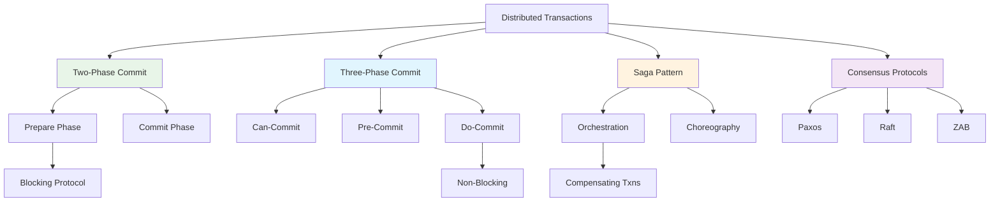

# System Design Fundamentals: Distributed Transactions & Consensus

Distributed transactions ensure data consistency across multiple services or databases. Understanding coordination protocols is essential for building reliable distributed systems.

## Transaction Protocols Overview



## Two-Phase Commit (2PC)

```go
// Two-Phase Commit Implementation
package main

import (
    "context"
    "fmt"
    "sync"
    "time"
)

type TransactionStatus int

const (
    TxnInitiated TransactionStatus = iota
    TxnPrepared
    TxnCommitted
    TxnAborted
)

type ParticipantResponse int

const (
    VoteCommit ParticipantResponse = iota
    VoteAbort
)

type Participant interface {
    Prepare(ctx context.Context, txnID string) (ParticipantResponse, error)
    Commit(ctx context.Context, txnID string) error
    Abort(ctx context.Context, txnID string) error
}

type TwoPhaseCoordinator struct {
    participants []Participant
    transactions map[string]*Transaction
    mutex        sync.RWMutex
}

type Transaction struct {
    ID        string
    Status    TransactionStatus
    StartTime time.Time
    Votes     map[int]ParticipantResponse
}

func NewTwoPhaseCoordinator() *TwoPhaseCoordinator {
    return &TwoPhaseCoordinator{
        participants: make([]Participant, 0),
        transactions: make(map[string]*Transaction),
    }
}

func (tpc *TwoPhaseCoordinator) RegisterParticipant(p Participant) {
    tpc.mutex.Lock()
    defer tpc.mutex.Unlock()
    
    tpc.participants = append(tpc.participants, p)
    fmt.Printf("✅ Registered participant: %d participants total\n", len(tpc.participants))
}

func (tpc *TwoPhaseCoordinator) BeginTransaction(txnID string) {
    tpc.mutex.Lock()
    defer tpc.mutex.Unlock()
    
    tpc.transactions[txnID] = &Transaction{
        ID:        txnID,
        Status:    TxnInitiated,
        StartTime: time.Now(),
        Votes:     make(map[int]ParticipantResponse),
    }
    
    fmt.Printf("🚀 Transaction initiated: %s\n", txnID)
}

func (tpc *TwoPhaseCoordinator) ExecuteTransaction(ctx context.Context, txnID string) error {
    fmt.Printf("\n=== Executing 2PC Transaction: %s ===\n", txnID)
    
    // Phase 1: Prepare
    if !tpc.preparePhase(ctx, txnID) {
        fmt.Printf("❌ Transaction %s: ABORTED in prepare phase\n", txnID)
        tpc.abortTransaction(ctx, txnID)
        return fmt.Errorf("transaction aborted")
    }
    
    // Phase 2: Commit
    if err := tpc.commitPhase(ctx, txnID); err != nil {
        fmt.Printf("❌ Transaction %s: FAILED in commit phase\n", txnID)
        return err
    }
    
    fmt.Printf("✅ Transaction %s: COMMITTED successfully\n", txnID)
    return nil
}

func (tpc *TwoPhaseCoordinator) preparePhase(ctx context.Context, txnID string) bool {
    fmt.Printf("\n📋 Phase 1: PREPARE\n")
    
    tpc.mutex.RLock()
    participants := tpc.participants
    tpc.mutex.RUnlock()
    
    var wg sync.WaitGroup
    votes := make(chan struct {
        index int
        vote  ParticipantResponse
        err   error
    }, len(participants))
    
    // Send prepare to all participants
    for i, participant := range participants {
        wg.Add(1)
        go func(index int, p Participant) {
            defer wg.Done()
            
            fmt.Printf("  → Sending PREPARE to participant %d\n", index)
            vote, err := p.Prepare(ctx, txnID)
            
            votes <- struct {
                index int
                vote  ParticipantResponse
                err   error
            }{index, vote, err}
        }(i, participant)
    }
    
    // Wait for all responses
    go func() {
        wg.Wait()
        close(votes)
    }()
    
    // Collect votes
    tpc.mutex.Lock()
    txn := tpc.transactions[txnID]
    tpc.mutex.Unlock()
    
    allVotedCommit := true
    
    for vote := range votes {
        if vote.err != nil {
            fmt.Printf("  ← Participant %d: ERROR - %v\n", vote.index, vote.err)
            allVotedCommit = false
        } else if vote.vote == VoteAbort {
            fmt.Printf("  ← Participant %d: VOTE ABORT\n", vote.index)
            allVotedCommit = false
        } else {
            fmt.Printf("  ← Participant %d: VOTE COMMIT\n", vote.index)
        }
        
        txn.Votes[vote.index] = vote.vote
    }
    
    if allVotedCommit {
        tpc.mutex.Lock()
        txn.Status = TxnPrepared
        tpc.mutex.Unlock()
        
        fmt.Printf("✅ Phase 1: All participants voted COMMIT\n")
        return true
    }
    
    fmt.Printf("❌ Phase 1: At least one participant voted ABORT\n")
    return false
}

func (tpc *TwoPhaseCoordinator) commitPhase(ctx context.Context, txnID string) error {
    fmt.Printf("\n📋 Phase 2: COMMIT\n")
    
    tpc.mutex.RLock()
    participants := tpc.participants
    tpc.mutex.RUnlock()
    
    var wg sync.WaitGroup
    errors := make(chan error, len(participants))
    
    // Send commit to all participants
    for i, participant := range participants {
        wg.Add(1)
        go func(index int, p Participant) {
            defer wg.Done()
            
            fmt.Printf("  → Sending COMMIT to participant %d\n", index)
            err := p.Commit(ctx, txnID)
            
            if err != nil {
                fmt.Printf("  ← Participant %d: COMMIT FAILED - %v\n", index, err)
                errors <- err
            } else {
                fmt.Printf("  ← Participant %d: COMMITTED\n", index)
            }
        }(i, participant)
    }
    
    wg.Wait()
    close(errors)
    
    // Check for any errors
    for err := range errors {
        if err != nil {
            return err
        }
    }
    
    tpc.mutex.Lock()
    tpc.transactions[txnID].Status = TxnCommitted
    tpc.mutex.Unlock()
    
    fmt.Printf("✅ Phase 2: All participants COMMITTED\n")
    return nil
}

func (tpc *TwoPhaseCoordinator) abortTransaction(ctx context.Context, txnID string) {
    fmt.Printf("\n📋 Aborting Transaction\n")
    
    tpc.mutex.RLock()
    participants := tpc.participants
    tpc.mutex.RUnlock()
    
    var wg sync.WaitGroup
    
    for i, participant := range participants {
        wg.Add(1)
        go func(index int, p Participant) {
            defer wg.Done()
            
            fmt.Printf("  → Sending ABORT to participant %d\n", index)
            p.Abort(ctx, txnID)
            fmt.Printf("  ← Participant %d: ABORTED\n", index)
        }(i, participant)
    }
    
    wg.Wait()
    
    tpc.mutex.Lock()
    tpc.transactions[txnID].Status = TxnAborted
    tpc.mutex.Unlock()
    
    fmt.Printf("✅ Transaction ABORTED\n")
}

// Example Participant: Database Service
type DatabaseService struct {
    name     string
    prepared map[string]bool
    mutex    sync.RWMutex
}

func NewDatabaseService(name string) *DatabaseService {
    return &DatabaseService{
        name:     name,
        prepared: make(map[string]bool),
    }
}

func (ds *DatabaseService) Prepare(ctx context.Context, txnID string) (ParticipantResponse, error) {
    ds.mutex.Lock()
    defer ds.mutex.Unlock()
    
    // Simulate prepare logic
    time.Sleep(50 * time.Millisecond)
    
    // 90% success rate
    if time.Now().UnixNano()%10 != 0 {
        ds.prepared[txnID] = true
        return VoteCommit, nil
    }
    
    return VoteAbort, nil
}

func (ds *DatabaseService) Commit(ctx context.Context, txnID string) error {
    ds.mutex.Lock()
    defer ds.mutex.Unlock()
    
    if !ds.prepared[txnID] {
        return fmt.Errorf("transaction not prepared")
    }
    
    // Simulate commit
    time.Sleep(30 * time.Millisecond)
    
    delete(ds.prepared, txnID)
    return nil
}

func (ds *DatabaseService) Abort(ctx context.Context, txnID string) error {
    ds.mutex.Lock()
    defer ds.mutex.Unlock()
    
    delete(ds.prepared, txnID)
    return nil
}
```

## Three-Phase Commit (3PC)

```go
// Three-Phase Commit Implementation
package main

import (
    "context"
    "fmt"
    "sync"
    "time"
)

type ThreePhaseState int

const (
    StateInit ThreePhaseState = iota
    StateCanCommit
    StatePreCommit
    StateCommitted
    StateAborted
)

type ThreePhaseParticipant interface {
    CanCommit(ctx context.Context, txnID string) (bool, error)
    PreCommit(ctx context.Context, txnID string) error
    DoCommit(ctx context.Context, txnID string) error
    DoAbort(ctx context.Context, txnID string) error
}

type ThreePhaseCoordinator struct {
    participants []ThreePhaseParticipant
    transactions map[string]*ThreePhaseTransaction
    mutex        sync.RWMutex
}

type ThreePhaseTransaction struct {
    ID        string
    State     ThreePhaseState
    StartTime time.Time
    timeout   time.Duration
}

func NewThreePhaseCoordinator() *ThreePhaseCoordinator {
    return &ThreePhaseCoordinator{
        participants: make([]ThreePhaseParticipant, 0),
        transactions: make(map[string]*ThreePhaseTransaction),
    }
}

func (tpc *ThreePhaseCoordinator) RegisterParticipant(p ThreePhaseParticipant) {
    tpc.mutex.Lock()
    defer tpc.mutex.Unlock()
    
    tpc.participants = append(tpc.participants, p)
}

func (tpc *ThreePhaseCoordinator) ExecuteTransaction(ctx context.Context, txnID string) error {
    fmt.Printf("\n=== Executing 3PC Transaction: %s ===\n", txnID)
    
    tpc.mutex.Lock()
    tpc.transactions[txnID] = &ThreePhaseTransaction{
        ID:        txnID,
        State:     StateInit,
        StartTime: time.Now(),
        timeout:   5 * time.Second,
    }
    tpc.mutex.Unlock()
    
    // Phase 1: Can-Commit
    if !tpc.canCommitPhase(ctx, txnID) {
        tpc.abortTransaction(ctx, txnID)
        return fmt.Errorf("transaction aborted in can-commit phase")
    }
    
    // Phase 2: Pre-Commit
    if err := tpc.preCommitPhase(ctx, txnID); err != nil {
        tpc.abortTransaction(ctx, txnID)
        return fmt.Errorf("transaction aborted in pre-commit phase: %v", err)
    }
    
    // Phase 3: Do-Commit
    if err := tpc.doCommitPhase(ctx, txnID); err != nil {
        return fmt.Errorf("transaction failed in do-commit phase: %v", err)
    }
    
    fmt.Printf("✅ Transaction %s: COMMITTED successfully\n", txnID)
    return nil
}

func (tpc *ThreePhaseCoordinator) canCommitPhase(ctx context.Context, txnID string) bool {
    fmt.Printf("\n📋 Phase 1: CAN-COMMIT\n")
    
    tpc.mutex.RLock()
    participants := tpc.participants
    tpc.mutex.RUnlock()
    
    var wg sync.WaitGroup
    responses := make(chan bool, len(participants))
    
    for i, participant := range participants {
        wg.Add(1)
        go func(index int, p ThreePhaseParticipant) {
            defer wg.Done()
            
            fmt.Printf("  → Sending CAN-COMMIT to participant %d\n", index)
            canCommit, err := p.CanCommit(ctx, txnID)
            
            if err != nil || !canCommit {
                fmt.Printf("  ← Participant %d: CANNOT COMMIT\n", index)
                responses <- false
            } else {
                fmt.Printf("  ← Participant %d: CAN COMMIT\n", index)
                responses <- true
            }
        }(i, participant)
    }
    
    go func() {
        wg.Wait()
        close(responses)
    }()
    
    allCanCommit := true
    for response := range responses {
        if !response {
            allCanCommit = false
        }
    }
    
    if allCanCommit {
        tpc.mutex.Lock()
        tpc.transactions[txnID].State = StateCanCommit
        tpc.mutex.Unlock()
        
        fmt.Printf("✅ Phase 1: All participants CAN COMMIT\n")
        return true
    }
    
    fmt.Printf("❌ Phase 1: At least one participant CANNOT COMMIT\n")
    return false
}

func (tpc *ThreePhaseCoordinator) preCommitPhase(ctx context.Context, txnID string) error {
    fmt.Printf("\n📋 Phase 2: PRE-COMMIT\n")
    
    tpc.mutex.RLock()
    participants := tpc.participants
    tpc.mutex.RUnlock()
    
    var wg sync.WaitGroup
    errors := make(chan error, len(participants))
    
    for i, participant := range participants {
        wg.Add(1)
        go func(index int, p ThreePhaseParticipant) {
            defer wg.Done()
            
            fmt.Printf("  → Sending PRE-COMMIT to participant %d\n", index)
            err := p.PreCommit(ctx, txnID)
            
            if err != nil {
                fmt.Printf("  ← Participant %d: PRE-COMMIT FAILED\n", index)
                errors <- err
            } else {
                fmt.Printf("  ← Participant %d: PRE-COMMITTED\n", index)
            }
        }(i, participant)
    }
    
    wg.Wait()
    close(errors)
    
    for err := range errors {
        if err != nil {
            return err
        }
    }
    
    tpc.mutex.Lock()
    tpc.transactions[txnID].State = StatePreCommit
    tpc.mutex.Unlock()
    
    fmt.Printf("✅ Phase 2: All participants PRE-COMMITTED\n")
    return nil
}

func (tpc *ThreePhaseCoordinator) doCommitPhase(ctx context.Context, txnID string) error {
    fmt.Printf("\n📋 Phase 3: DO-COMMIT\n")
    
    tpc.mutex.RLock()
    participants := tpc.participants
    tpc.mutex.RUnlock()
    
    var wg sync.WaitGroup
    errors := make(chan error, len(participants))
    
    for i, participant := range participants {
        wg.Add(1)
        go func(index int, p ThreePhaseParticipant) {
            defer wg.Done()
            
            fmt.Printf("  → Sending DO-COMMIT to participant %d\n", index)
            err := p.DoCommit(ctx, txnID)
            
            if err != nil {
                fmt.Printf("  ← Participant %d: COMMIT FAILED\n", index)
                errors <- err
            } else {
                fmt.Printf("  ← Participant %d: COMMITTED\n", index)
            }
        }(i, participant)
    }
    
    wg.Wait()
    close(errors)
    
    for err := range errors {
        if err != nil {
            return err
        }
    }
    
    tpc.mutex.Lock()
    tpc.transactions[txnID].State = StateCommitted
    tpc.mutex.Unlock()
    
    fmt.Printf("✅ Phase 3: All participants COMMITTED\n")
    return nil
}

func (tpc *ThreePhaseCoordinator) abortTransaction(ctx context.Context, txnID string) {
    fmt.Printf("\n📋 Aborting Transaction\n")
    
    tpc.mutex.RLock()
    participants := tpc.participants
    tpc.mutex.RUnlock()
    
    var wg sync.WaitGroup
    
    for i, participant := range participants {
        wg.Add(1)
        go func(index int, p ThreePhaseParticipant) {
            defer wg.Done()
            
            p.DoAbort(ctx, txnID)
            fmt.Printf("  ← Participant %d: ABORTED\n", index)
        }(i, participant)
    }
    
    wg.Wait()
    
    tpc.mutex.Lock()
    tpc.transactions[txnID].State = StateAborted
    tpc.mutex.Unlock()
}

// Example 3PC Participant
type ServiceNode struct {
    name         string
    canCommitMap map[string]bool
    preCommitMap map[string]bool
    mutex        sync.RWMutex
}

func NewServiceNode(name string) *ServiceNode {
    return &ServiceNode{
        name:         name,
        canCommitMap: make(map[string]bool),
        preCommitMap: make(map[string]bool),
    }
}

func (sn *ServiceNode) CanCommit(ctx context.Context, txnID string) (bool, error) {
    sn.mutex.Lock()
    defer sn.mutex.Unlock()
    
    time.Sleep(30 * time.Millisecond)
    
    sn.canCommitMap[txnID] = true
    return true, nil
}

func (sn *ServiceNode) PreCommit(ctx context.Context, txnID string) error {
    sn.mutex.Lock()
    defer sn.mutex.Unlock()
    
    if !sn.canCommitMap[txnID] {
        return fmt.Errorf("cannot pre-commit without can-commit")
    }
    
    time.Sleep(30 * time.Millisecond)
    
    sn.preCommitMap[txnID] = true
    return nil
}

func (sn *ServiceNode) DoCommit(ctx context.Context, txnID string) error {
    sn.mutex.Lock()
    defer sn.mutex.Unlock()
    
    if !sn.preCommitMap[txnID] {
        return fmt.Errorf("cannot commit without pre-commit")
    }
    
    time.Sleep(30 * time.Millisecond)
    
    delete(sn.canCommitMap, txnID)
    delete(sn.preCommitMap, txnID)
    
    return nil
}

func (sn *ServiceNode) DoAbort(ctx context.Context, txnID string) error {
    sn.mutex.Lock()
    defer sn.mutex.Unlock()
    
    delete(sn.canCommitMap, txnID)
    delete(sn.preCommitMap, txnID)
    
    return nil
}
```

## Saga Pattern (Choreography)

```go
// Saga Pattern - Choreography Implementation
package main

import (
    "context"
    "fmt"
    "sync"
    "time"
)

type SagaStatus int

const (
    SagaPending SagaStatus = iota
    SagaCompleted
    SagaCompensating
    SagaCompensated
    SagaFailed
)

type SagaStep struct {
    Name        string
    Execute     func(ctx context.Context, data map[string]interface{}) error
    Compensate  func(ctx context.Context, data map[string]interface{}) error
    Executed    bool
    Compensated bool
}

type Saga struct {
    ID       string
    Steps    []*SagaStep
    Status   SagaStatus
    Data     map[string]interface{}
    mutex    sync.RWMutex
    EventBus *EventBus
}

type Event struct {
    Type    string
    SagaID  string
    StepName string
    Data    map[string]interface{}
}

type EventBus struct {
    subscribers map[string][]chan Event
    mutex       sync.RWMutex
}

func NewEventBus() *EventBus {
    return &EventBus{
        subscribers: make(map[string][]chan Event),
    }
}

func (eb *EventBus) Subscribe(eventType string) chan Event {
    eb.mutex.Lock()
    defer eb.mutex.Unlock()
    
    ch := make(chan Event, 10)
    eb.subscribers[eventType] = append(eb.subscribers[eventType], ch)
    
    return ch
}

func (eb *EventBus) Publish(event Event) {
    eb.mutex.RLock()
    defer eb.mutex.RUnlock()
    
    if subscribers, ok := eb.subscribers[event.Type]; ok {
        for _, ch := range subscribers {
            select {
            case ch <- event:
            default:
                fmt.Printf("⚠️  Event bus full, dropping event: %s\n", event.Type)
            }
        }
    }
}

func NewSaga(id string, eventBus *EventBus) *Saga {
    return &Saga{
        ID:       id,
        Steps:    make([]*SagaStep, 0),
        Status:   SagaPending,
        Data:     make(map[string]interface{}),
        EventBus: eventBus,
    }
}

func (s *Saga) AddStep(step *SagaStep) {
    s.mutex.Lock()
    defer s.mutex.Unlock()
    
    s.Steps = append(s.Steps, step)
}

func (s *Saga) Execute(ctx context.Context) error {
    fmt.Printf("\n🚀 Starting Saga: %s\n", s.ID)
    
    s.mutex.Lock()
    s.Status = SagaPending
    s.mutex.Unlock()
    
    // Execute steps sequentially
    for i, step := range s.Steps {
        fmt.Printf("\n📋 Executing step %d: %s\n", i+1, step.Name)
        
        if err := step.Execute(ctx, s.Data); err != nil {
            fmt.Printf("❌ Step %s failed: %v\n", step.Name, err)
            
            // Publish failure event
            s.EventBus.Publish(Event{
                Type:     "step_failed",
                SagaID:   s.ID,
                StepName: step.Name,
                Data:     s.Data,
            })
            
            // Compensate
            return s.compensate(ctx, i)
        }
        
        step.Executed = true
        fmt.Printf("✅ Step %s completed\n", step.Name)
        
        // Publish success event
        s.EventBus.Publish(Event{
            Type:     "step_completed",
            SagaID:   s.ID,
            StepName: step.Name,
            Data:     s.Data,
        })
    }
    
    s.mutex.Lock()
    s.Status = SagaCompleted
    s.mutex.Unlock()
    
    fmt.Printf("\n✅ Saga %s COMPLETED\n", s.ID)
    return nil
}

func (s *Saga) compensate(ctx context.Context, failedStepIndex int) error {
    fmt.Printf("\n🔄 Starting compensation for Saga %s\n", s.ID)
    
    s.mutex.Lock()
    s.Status = SagaCompensating
    s.mutex.Unlock()
    
    // Compensate in reverse order
    for i := failedStepIndex; i >= 0; i-- {
        step := s.Steps[i]
        
        if !step.Executed {
            continue
        }
        
        fmt.Printf("  🔄 Compensating step: %s\n", step.Name)
        
        if err := step.Compensate(ctx, s.Data); err != nil {
            fmt.Printf("  ❌ Compensation failed for step %s: %v\n", step.Name, err)
            
            s.mutex.Lock()
            s.Status = SagaFailed
            s.mutex.Unlock()
            
            return fmt.Errorf("saga compensation failed")
        }
        
        step.Compensated = true
        fmt.Printf("  ✅ Step %s compensated\n", step.Name)
        
        // Publish compensation event
        s.EventBus.Publish(Event{
            Type:     "step_compensated",
            SagaID:   s.ID,
            StepName: step.Name,
            Data:     s.Data,
        })
    }
    
    s.mutex.Lock()
    s.Status = SagaCompensated
    s.mutex.Unlock()
    
    fmt.Printf("\n✅ Saga %s COMPENSATED\n", s.ID)
    return fmt.Errorf("saga compensated after failure")
}

// Example: E-commerce Order Saga
func createOrderSaga(eventBus *EventBus) *Saga {
    saga := NewSaga("order-123", eventBus)
    
    // Step 1: Reserve Inventory
    saga.AddStep(&SagaStep{
        Name: "Reserve Inventory",
        Execute: func(ctx context.Context, data map[string]interface{}) error {
            time.Sleep(100 * time.Millisecond)
            fmt.Println("  → Reserved 2x Product A")
            data["inventory_reserved"] = true
            return nil
        },
        Compensate: func(ctx context.Context, data map[string]interface{}) error {
            time.Sleep(50 * time.Millisecond)
            fmt.Println("  → Released inventory reservation")
            delete(data, "inventory_reserved")
            return nil
        },
    })
    
    // Step 2: Process Payment
    saga.AddStep(&SagaStep{
        Name: "Process Payment",
        Execute: func(ctx context.Context, data map[string]interface{}) error {
            time.Sleep(100 * time.Millisecond)
            fmt.Println("  → Charged $99.99 to card")
            data["payment_id"] = "pay_xyz789"
            return nil
        },
        Compensate: func(ctx context.Context, data map[string]interface{}) error {
            time.Sleep(50 * time.Millisecond)
            fmt.Println("  → Refunded $99.99")
            delete(data, "payment_id")
            return nil
        },
    })
    
    // Step 3: Update Inventory
    saga.AddStep(&SagaStep{
        Name: "Update Inventory",
        Execute: func(ctx context.Context, data map[string]interface{}) error {
            time.Sleep(100 * time.Millisecond)
            
            // Simulate failure
            if time.Now().UnixNano()%3 == 0 {
                return fmt.Errorf("inventory service unavailable")
            }
            
            fmt.Println("  → Updated inventory count")
            data["inventory_updated"] = true
            return nil
        },
        Compensate: func(ctx context.Context, data map[string]interface{}) error {
            time.Sleep(50 * time.Millisecond)
            fmt.Println("  → Reverted inventory update")
            delete(data, "inventory_updated")
            return nil
        },
    })
    
    // Step 4: Send Confirmation Email
    saga.AddStep(&SagaStep{
        Name: "Send Confirmation",
        Execute: func(ctx context.Context, data map[string]interface{}) error {
            time.Sleep(50 * time.Millisecond)
            fmt.Println("  → Sent order confirmation email")
            return nil
        },
        Compensate: func(ctx context.Context, data map[string]interface{}) error {
            time.Sleep(30 * time.Millisecond)
            fmt.Println("  → Sent order cancellation email")
            return nil
        },
    })
    
    return saga
}
```

## Saga Orchestrator

```go
// Saga Pattern - Orchestration Implementation
package main

import (
    "context"
    "fmt"
    "sync"
    "time"
)

type OrchestratedSaga struct {
    ID          string
    Steps       []*SagaStep
    Status      SagaStatus
    Data        map[string]interface{}
    CurrentStep int
    mutex       sync.RWMutex
}

type SagaOrchestrator struct {
    sagas map[string]*OrchestratedSaga
    mutex sync.RWMutex
}

func NewSagaOrchestrator() *SagaOrchestrator {
    return &SagaOrchestrator{
        sagas: make(map[string]*OrchestratedSaga),
    }
}

func (so *SagaOrchestrator) CreateSaga(id string) *OrchestratedSaga {
    so.mutex.Lock()
    defer so.mutex.Unlock()
    
    saga := &OrchestratedSaga{
        ID:     id,
        Steps:  make([]*SagaStep, 0),
        Status: SagaPending,
        Data:   make(map[string]interface{}),
    }
    
    so.sagas[id] = saga
    return saga
}

func (so *SagaOrchestrator) AddStep(sagaID string, step *SagaStep) {
    so.mutex.RLock()
    saga := so.sagas[sagaID]
    so.mutex.RUnlock()
    
    saga.mutex.Lock()
    defer saga.mutex.Unlock()
    
    saga.Steps = append(saga.Steps, step)
}

func (so *SagaOrchestrator) ExecuteSaga(ctx context.Context, sagaID string) error {
    so.mutex.RLock()
    saga := so.sagas[sagaID]
    so.mutex.RUnlock()
    
    if saga == nil {
        return fmt.Errorf("saga not found: %s", sagaID)
    }
    
    fmt.Printf("\n🎯 Orchestrator: Starting Saga %s\n", sagaID)
    
    // Execute steps
    for i, step := range saga.Steps {
        saga.mutex.Lock()
        saga.CurrentStep = i
        saga.mutex.Unlock()
        
        fmt.Printf("\n📋 Orchestrator: Executing step %d/%d: %s\n", 
            i+1, len(saga.Steps), step.Name)
        
        if err := step.Execute(ctx, saga.Data); err != nil {
            fmt.Printf("❌ Orchestrator: Step %s failed: %v\n", step.Name, err)
            return so.compensateSaga(ctx, saga, i)
        }
        
        step.Executed = true
        fmt.Printf("✅ Orchestrator: Step %s completed\n", step.Name)
    }
    
    saga.mutex.Lock()
    saga.Status = SagaCompleted
    saga.mutex.Unlock()
    
    fmt.Printf("\n✅ Orchestrator: Saga %s COMPLETED\n", sagaID)
    return nil
}

func (so *SagaOrchestrator) compensateSaga(ctx context.Context, saga *OrchestratedSaga, failedStep int) error {
    fmt.Printf("\n🔄 Orchestrator: Compensating Saga %s\n", saga.ID)
    
    saga.mutex.Lock()
    saga.Status = SagaCompensating
    saga.mutex.Unlock()
    
    for i := failedStep; i >= 0; i-- {
        step := saga.Steps[i]
        
        if !step.Executed {
            continue
        }
        
        fmt.Printf("  🔄 Orchestrator: Compensating step %d: %s\n", i+1, step.Name)
        
        if err := step.Compensate(ctx, saga.Data); err != nil {
            fmt.Printf("  ❌ Orchestrator: Compensation failed for %s\n", step.Name)
            
            saga.mutex.Lock()
            saga.Status = SagaFailed
            saga.mutex.Unlock()
            
            return fmt.Errorf("compensation failed")
        }
        
        step.Compensated = true
        fmt.Printf("  ✅ Orchestrator: Step %s compensated\n", step.Name)
    }
    
    saga.mutex.Lock()
    saga.Status = SagaCompensated
    saga.mutex.Unlock()
    
    fmt.Printf("\n✅ Orchestrator: Saga %s COMPENSATED\n", saga.ID)
    return fmt.Errorf("saga compensated after failure")
}

func (so *SagaOrchestrator) GetSagaStatus(sagaID string) SagaStatus {
    so.mutex.RLock()
    defer so.mutex.RUnlock()
    
    if saga, ok := so.sagas[sagaID]; ok {
        saga.mutex.RLock()
        defer saga.mutex.RUnlock()
        return saga.Status
    }
    
    return SagaFailed
}
```

## Complete Demo

```go
func main() {
    fmt.Println("🚀 Starting Distributed Transactions Demo\n")
    
    ctx := context.Background()
    
    // 1. Two-Phase Commit
    fmt.Println("=== Two-Phase Commit (2PC) ===")
    twoPC := NewTwoPhaseCoordinator()
    
    // Register participants
    twoPC.RegisterParticipant(NewDatabaseService("DB-1"))
    twoPC.RegisterParticipant(NewDatabaseService("DB-2"))
    twoPC.RegisterParticipant(NewDatabaseService("DB-3"))
    
    // Execute transaction
    twoPC.BeginTransaction("txn-001")
    if err := twoPC.ExecuteTransaction(ctx, "txn-001"); err != nil {
        fmt.Printf("Transaction failed: %v\n", err)
    }
    
    time.Sleep(1 * time.Second)
    
    // 2. Three-Phase Commit
    fmt.Println("\n=== Three-Phase Commit (3PC) ===")
    threePC := NewThreePhaseCoordinator()
    
    // Register participants
    threePC.RegisterParticipant(NewServiceNode("Service-A"))
    threePC.RegisterParticipant(NewServiceNode("Service-B"))
    threePC.RegisterParticipant(NewServiceNode("Service-C"))
    
    // Execute transaction
    if err := threePC.ExecuteTransaction(ctx, "txn-3pc-001"); err != nil {
        fmt.Printf("Transaction failed: %v\n", err)
    }
    
    time.Sleep(1 * time.Second)
    
    // 3. Saga Pattern - Choreography
    fmt.Println("\n=== Saga Pattern - Choreography ===")
    eventBus := NewEventBus()
    
    // Subscribe to events
    completedCh := eventBus.Subscribe("step_completed")
    failedCh := eventBus.Subscribe("step_failed")
    compensatedCh := eventBus.Subscribe("step_compensated")
    
    // Process events in background
    go func() {
        for {
            select {
            case event := <-completedCh:
                fmt.Printf("📢 Event: Step %s completed\n", event.StepName)
            case event := <-failedCh:
                fmt.Printf("📢 Event: Step %s failed\n", event.StepName)
            case event := <-compensatedCh:
                fmt.Printf("📢 Event: Step %s compensated\n", event.StepName)
            }
        }
    }()
    
    // Create and execute saga
    saga := createOrderSaga(eventBus)
    if err := saga.Execute(ctx); err != nil {
        fmt.Printf("Saga failed: %v\n", err)
    }
    
    time.Sleep(500 * time.Millisecond)
    
    // 4. Saga Pattern - Orchestration
    fmt.Println("\n=== Saga Pattern - Orchestration ===")
    orchestrator := NewSagaOrchestrator()
    
    // Create saga
    sagaID := "order-orchestrated-456"
    orchestrator.CreateSaga(sagaID)
    
    // Add steps
    orchestrator.AddStep(sagaID, &SagaStep{
        Name: "Create Order",
        Execute: func(ctx context.Context, data map[string]interface{}) error {
            time.Sleep(50 * time.Millisecond)
            fmt.Println("  → Order created")
            data["order_id"] = "ord_123"
            return nil
        },
        Compensate: func(ctx context.Context, data map[string]interface{}) error {
            time.Sleep(30 * time.Millisecond)
            fmt.Println("  → Order cancelled")
            return nil
        },
    })
    
    orchestrator.AddStep(sagaID, &SagaStep{
        Name: "Reserve Stock",
        Execute: func(ctx context.Context, data map[string]interface{}) error {
            time.Sleep(50 * time.Millisecond)
            fmt.Println("  → Stock reserved")
            return nil
        },
        Compensate: func(ctx context.Context, data map[string]interface{}) error {
            time.Sleep(30 * time.Millisecond)
            fmt.Println("  → Stock released")
            return nil
        },
    })
    
    orchestrator.AddStep(sagaID, &SagaStep{
        Name: "Charge Customer",
        Execute: func(ctx context.Context, data map[string]interface{}) error {
            time.Sleep(50 * time.Millisecond)
            fmt.Println("  → Customer charged")
            return nil
        },
        Compensate: func(ctx context.Context, data map[string]interface{}) error {
            time.Sleep(30 * time.Millisecond)
            fmt.Println("  → Customer refunded")
            return nil
        },
    })
    
    // Execute
    if err := orchestrator.ExecuteSaga(ctx, sagaID); err != nil {
        fmt.Printf("Orchestrated saga failed: %v\n", err)
    }
    
    status := orchestrator.GetSagaStatus(sagaID)
    fmt.Printf("\nFinal saga status: %d\n", status)
    
    fmt.Println("\n✅ Demo completed!")
}
```

## Protocol Comparison

| Protocol | Phases | Blocking | Failure Handling | Use Case |
|----------|--------|----------|------------------|----------|
| **2PC** | 2 | Yes | Coordinator failure blocks | Strong consistency, small clusters |
| **3PC** | 3 | No | Non-blocking with timeout | Avoiding coordinator blocking |
| **Saga** | N | No | Compensating transactions | Microservices, eventual consistency |

## Best Practices

### 1. Two-Phase Commit
```go
// Use timeouts to prevent indefinite blocking
ctx, cancel := context.WithTimeout(context.Background(), 5*time.Second)
defer cancel()

// Log all phase transitions for recovery
log.Printf("Transaction %s: Entering PREPARE phase", txnID)

// Implement coordinator recovery
func (tpc *TwoPhaseCoordinator) RecoverTransaction(txnID string) error {
    // Check transaction log
    // Resume from last known state
    // Send appropriate messages to participants
}
```

### 2. Saga Pattern
```go
// Design idempotent operations
func (step *SagaStep) Execute(ctx context.Context, data map[string]interface{}) error {
    // Check if already executed
    if data["step_completed"] == true {
        return nil
    }
    
    // Execute operation
    // Mark as completed
    data["step_completed"] = true
    return nil
}

// Store saga state for recovery
func (saga *Saga) Persist() error {
    // Save saga state to durable storage
    // Include executed steps, current position, data
}
```

### 3. Timeout Handling
```go
// Always use context with timeout
ctx, cancel := context.WithTimeout(context.Background(), 30*time.Second)
defer cancel()

// Implement retry with exponential backoff
func retryWithBackoff(operation func() error, maxRetries int) error {
    for i := 0; i < maxRetries; i++ {
        if err := operation(); err == nil {
            return nil
        }
        
        backoff := time.Duration(math.Pow(2, float64(i))) * time.Second
        time.Sleep(backoff)
    }
    
    return fmt.Errorf("operation failed after %d retries", maxRetries)
}
```

## Conclusion

Distributed transactions require careful protocol selection:
- **2PC**: Strong consistency, but blocking
- **3PC**: Non-blocking, but more complex
- **Saga**: Eventual consistency with compensation

Choose based on:
- Consistency requirements
- Failure tolerance
- Network partition handling
- System complexity

Implement proper timeout handling, logging, and recovery mechanisms for production systems.