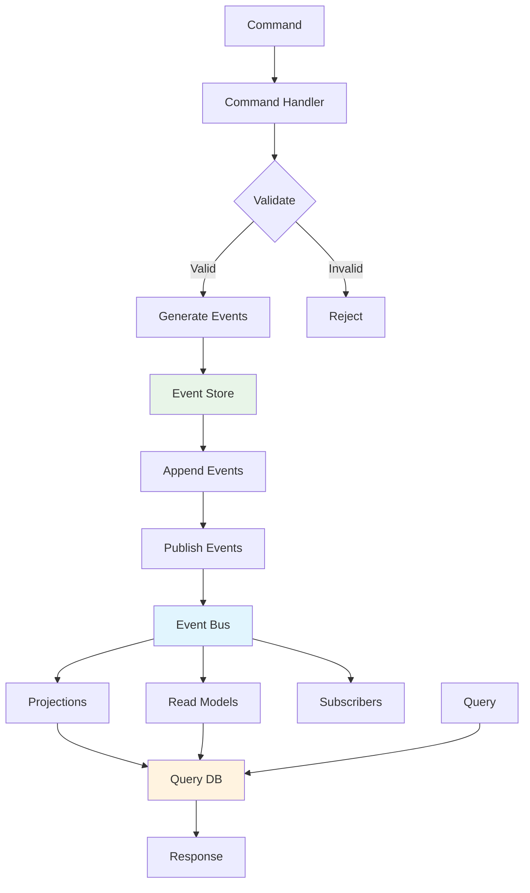

# System Design Fundamentals: Event Sourcing & Event Store

Event Sourcing is an architectural pattern where state changes are stored as a sequence of events rather than storing just the current state. This provides complete audit trails, temporal queries, and the ability to reconstruct any past state.

## Event Sourcing Architecture



## Event Store Core

```go
package main

import (
    "encoding/json"
    "fmt"
    "sync"
    "time"
)

// Event represents a domain event
type Event struct {
    ID            string                 `json:"id"`
    AggregateID   string                 `json:"aggregate_id"`
    AggregateType string                 `json:"aggregate_type"`
    EventType     string                 `json:"event_type"`
    EventData     map[string]interface{} `json:"event_data"`
    Version       int                    `json:"version"`
    Timestamp     time.Time              `json:"timestamp"`
    Metadata      map[string]interface{} `json:"metadata"`
}

// EventStore manages event persistence
type EventStore struct {
    events      []Event
    subscribers map[string][]EventHandler
    mutex       sync.RWMutex
    versionMap  map[string]int // aggregateID -> latest version
}

type EventHandler func(event Event) error

func NewEventStore() *EventStore {
    return &EventStore{
        events:      make([]Event, 0),
        subscribers: make(map[string][]EventHandler),
        versionMap:  make(map[string]int),
    }
}

// Append adds events to the store
func (es *EventStore) Append(aggregateID, aggregateType string, events []Event) error {
    es.mutex.Lock()
    defer es.mutex.Unlock()
    
    // Get current version
    currentVersion := es.versionMap[aggregateID]
    
    // Check optimistic concurrency
    if len(events) > 0 && events[0].Version != currentVersion+1 {
        return fmt.Errorf("concurrency conflict: expected version %d, got %d",
            currentVersion+1, events[0].Version)
    }
    
    // Append events
    for _, event := range events {
        event.ID = fmt.Sprintf("%s-%d", aggregateID, event.Version)
        event.AggregateID = aggregateID
        event.AggregateType = aggregateType
        event.Timestamp = time.Now()
        
        es.events = append(es.events, event)
        es.versionMap[aggregateID] = event.Version
        
        fmt.Printf("📝 Event appended: %s v%d - %s\n",
            aggregateID, event.Version, event.EventType)
    }
    
    // Publish events to subscribers
    go es.publishEvents(events)
    
    return nil
}

// GetEvents retrieves events for an aggregate
func (es *EventStore) GetEvents(aggregateID string, fromVersion int) ([]Event, error) {
    es.mutex.RLock()
    defer es.mutex.RUnlock()
    
    events := make([]Event, 0)
    
    for _, event := range es.events {
        if event.AggregateID == aggregateID && event.Version >= fromVersion {
            events = append(events, event)
        }
    }
    
    fmt.Printf("📚 Retrieved %d events for %s from version %d\n",
        len(events), aggregateID, fromVersion)
    
    return events, nil
}

// GetAllEvents retrieves all events (for projections)
func (es *EventStore) GetAllEvents() []Event {
    es.mutex.RLock()
    defer es.mutex.RUnlock()
    
    eventsCopy := make([]Event, len(es.events))
    copy(eventsCopy, es.events)
    
    return eventsCopy
}

// Subscribe registers an event handler
func (es *EventStore) Subscribe(eventType string, handler EventHandler) {
    es.mutex.Lock()
    defer es.mutex.Unlock()
    
    if es.subscribers[eventType] == nil {
        es.subscribers[eventType] = make([]EventHandler, 0)
    }
    
    es.subscribers[eventType] = append(es.subscribers[eventType], handler)
    
    fmt.Printf("🔔 Subscribed to event type: %s\n", eventType)
}

// publishEvents sends events to subscribers
func (es *EventStore) publishEvents(events []Event) {
    es.mutex.RLock()
    defer es.mutex.RUnlock()
    
    for _, event := range events {
        handlers := es.subscribers[event.EventType]
        
        for _, handler := range handlers {
            if err := handler(event); err != nil {
                fmt.Printf("❌ Error handling event %s: %v\n", event.ID, err)
            }
        }
    }
}

// GetVersion returns the current version of an aggregate
func (es *EventStore) GetVersion(aggregateID string) int {
    es.mutex.RLock()
    defer es.mutex.RUnlock()
    
    return es.versionMap[aggregateID]
}
```

## Aggregate Root with Event Sourcing

```go
// BankAccount aggregate root
type BankAccount struct {
    ID              string
    Owner           string
    Balance         float64
    IsActive        bool
    Version         int
    UncommittedEvents []Event
}

func NewBankAccount(id, owner string) *BankAccount {
    account := &BankAccount{
        ID:                id,
        UncommittedEvents: make([]Event, 0),
    }
    
    // Apply creation event
    account.applyEvent(Event{
        EventType: "AccountCreated",
        EventData: map[string]interface{}{
            "owner": owner,
        },
    }, true)
    
    return account
}

// LoadFromHistory reconstructs aggregate from events
func LoadBankAccountFromHistory(aggregateID string, events []Event) *BankAccount {
    account := &BankAccount{
        ID:                aggregateID,
        UncommittedEvents: make([]Event, 0),
    }
    
    for _, event := range events {
        account.applyEvent(event, false)
    }
    
    fmt.Printf("🔄 Loaded account %s from %d events (balance: $%.2f)\n",
        aggregateID, len(events), account.Balance)
    
    return account
}

// Deposit adds money to account
func (ba *BankAccount) Deposit(amount float64) error {
    if amount <= 0 {
        return fmt.Errorf("deposit amount must be positive")
    }
    
    if !ba.IsActive {
        return fmt.Errorf("account is not active")
    }
    
    event := Event{
        EventType: "MoneyDeposited",
        EventData: map[string]interface{}{
            "amount": amount,
        },
    }
    
    ba.applyEvent(event, true)
    
    return nil
}

// Withdraw removes money from account
func (ba *BankAccount) Withdraw(amount float64) error {
    if amount <= 0 {
        return fmt.Errorf("withdrawal amount must be positive")
    }
    
    if !ba.IsActive {
        return fmt.Errorf("account is not active")
    }
    
    if ba.Balance < amount {
        return fmt.Errorf("insufficient funds: balance $%.2f, requested $%.2f",
            ba.Balance, amount)
    }
    
    event := Event{
        EventType: "MoneyWithdrawn",
        EventData: map[string]interface{}{
            "amount": amount,
        },
    }
    
    ba.applyEvent(event, true)
    
    return nil
}

// Close closes the account
func (ba *BankAccount) Close() error {
    if !ba.IsActive {
        return fmt.Errorf("account is already closed")
    }
    
    if ba.Balance > 0 {
        return fmt.Errorf("cannot close account with balance $%.2f", ba.Balance)
    }
    
    event := Event{
        EventType: "AccountClosed",
        EventData: map[string]interface{}{},
    }
    
    ba.applyEvent(event, true)
    
    return nil
}

// applyEvent applies an event to the aggregate
func (ba *BankAccount) applyEvent(event Event, isNew bool) {
    switch event.EventType {
    case "AccountCreated":
        ba.Owner = event.EventData["owner"].(string)
        ba.Balance = 0
        ba.IsActive = true
        
    case "MoneyDeposited":
        amount := event.EventData["amount"].(float64)
        ba.Balance += amount
        
    case "MoneyWithdrawn":
        amount := event.EventData["amount"].(float64)
        ba.Balance -= amount
        
    case "AccountClosed":
        ba.IsActive = false
    }
    
    if isNew {
        ba.Version++
        event.Version = ba.Version
        ba.UncommittedEvents = append(ba.UncommittedEvents, event)
    } else {
        ba.Version = event.Version
    }
}

// GetUncommittedEvents returns events not yet persisted
func (ba *BankAccount) GetUncommittedEvents() []Event {
    return ba.UncommittedEvents
}

// ClearUncommittedEvents clears the uncommitted events list
func (ba *BankAccount) ClearUncommittedEvents() {
    ba.UncommittedEvents = make([]Event, 0)
}
```

## Snapshot System

```go
// Snapshot represents aggregate state at a point in time
type Snapshot struct {
    AggregateID   string                 `json:"aggregate_id"`
    AggregateType string                 `json:"aggregate_type"`
    Version       int                    `json:"version"`
    State         map[string]interface{} `json:"state"`
    Timestamp     time.Time              `json:"timestamp"`
}

// SnapshotStore manages snapshots
type SnapshotStore struct {
    snapshots       map[string]Snapshot // aggregateID -> latest snapshot
    mutex           sync.RWMutex
    snapshotInterval int // Take snapshot every N events
}

func NewSnapshotStore(snapshotInterval int) *SnapshotStore {
    return &SnapshotStore{
        snapshots:        make(map[string]Snapshot),
        snapshotInterval: snapshotInterval,
    }
}

// SaveSnapshot stores a snapshot
func (ss *SnapshotStore) SaveSnapshot(snapshot Snapshot) error {
    ss.mutex.Lock()
    defer ss.mutex.Unlock()
    
    snapshot.Timestamp = time.Now()
    ss.snapshots[snapshot.AggregateID] = snapshot
    
    fmt.Printf("📸 Snapshot saved: %s v%d\n", snapshot.AggregateID, snapshot.Version)
    
    return nil
}

// GetSnapshot retrieves the latest snapshot
func (ss *SnapshotStore) GetSnapshot(aggregateID string) (*Snapshot, error) {
    ss.mutex.RLock()
    defer ss.mutex.RUnlock()
    
    snapshot, exists := ss.snapshots[aggregateID]
    if !exists {
        return nil, fmt.Errorf("no snapshot found for %s", aggregateID)
    }
    
    fmt.Printf("📸 Snapshot loaded: %s v%d\n", aggregateID, snapshot.Version)
    
    return &snapshot, nil
}

// ShouldTakeSnapshot determines if a snapshot should be taken
func (ss *SnapshotStore) ShouldTakeSnapshot(version int) bool {
    return version%ss.snapshotInterval == 0
}

// CreateSnapshotFromAccount creates a snapshot from bank account
func CreateSnapshotFromAccount(account *BankAccount) Snapshot {
    return Snapshot{
        AggregateID:   account.ID,
        AggregateType: "BankAccount",
        Version:       account.Version,
        State: map[string]interface{}{
            "owner":     account.Owner,
            "balance":   account.Balance,
            "is_active": account.IsActive,
        },
    }
}

// LoadAccountFromSnapshot restores account from snapshot
func LoadAccountFromSnapshot(snapshot Snapshot) *BankAccount {
    return &BankAccount{
        ID:                snapshot.AggregateID,
        Owner:             snapshot.State["owner"].(string),
        Balance:           snapshot.State["balance"].(float64),
        IsActive:          snapshot.State["is_active"].(bool),
        Version:           snapshot.Version,
        UncommittedEvents: make([]Event, 0),
    }
}
```

## Projection System

```go
// Projection builds read models from events
type Projection interface {
    ProjectEvent(event Event) error
    GetReadModel() interface{}
}

// AccountBalanceProjection maintains account balance read model
type AccountBalanceProjection struct {
    balances map[string]float64
    mutex    sync.RWMutex
}

func NewAccountBalanceProjection() *AccountBalanceProjection {
    return &AccountBalanceProjection{
        balances: make(map[string]float64),
    }
}

func (abp *AccountBalanceProjection) ProjectEvent(event Event) error {
    abp.mutex.Lock()
    defer abp.mutex.Unlock()
    
    switch event.EventType {
    case "AccountCreated":
        abp.balances[event.AggregateID] = 0
        fmt.Printf("📊 Projection: Account %s created with balance $0\n", event.AggregateID)
        
    case "MoneyDeposited":
        amount := event.EventData["amount"].(float64)
        abp.balances[event.AggregateID] += amount
        fmt.Printf("📊 Projection: Account %s deposited $%.2f (new balance: $%.2f)\n",
            event.AggregateID, amount, abp.balances[event.AggregateID])
        
    case "MoneyWithdrawn":
        amount := event.EventData["amount"].(float64)
        abp.balances[event.AggregateID] -= amount
        fmt.Printf("📊 Projection: Account %s withdrew $%.2f (new balance: $%.2f)\n",
            event.AggregateID, amount, abp.balances[event.AggregateID])
        
    case "AccountClosed":
        delete(abp.balances, event.AggregateID)
        fmt.Printf("📊 Projection: Account %s closed\n", event.AggregateID)
    }
    
    return nil
}

func (abp *AccountBalanceProjection) GetReadModel() interface{} {
    abp.mutex.RLock()
    defer abp.mutex.RUnlock()
    
    // Return copy
    balancesCopy := make(map[string]float64)
    for k, v := range abp.balances {
        balancesCopy[k] = v
    }
    
    return balancesCopy
}

func (abp *AccountBalanceProjection) GetBalance(accountID string) (float64, bool) {
    abp.mutex.RLock()
    defer abp.mutex.RUnlock()
    
    balance, exists := abp.balances[accountID]
    return balance, exists
}

// TransactionHistoryProjection maintains transaction history
type TransactionHistoryProjection struct {
    transactions map[string][]Transaction
    mutex        sync.RWMutex
}

type Transaction struct {
    AccountID string
    Type      string
    Amount    float64
    Timestamp time.Time
    Version   int
}

func NewTransactionHistoryProjection() *TransactionHistoryProjection {
    return &TransactionHistoryProjection{
        transactions: make(map[string][]Transaction),
    }
}

func (thp *TransactionHistoryProjection) ProjectEvent(event Event) error {
    thp.mutex.Lock()
    defer thp.mutex.Unlock()
    
    var txn Transaction
    
    switch event.EventType {
    case "MoneyDeposited":
        txn = Transaction{
            AccountID: event.AggregateID,
            Type:      "DEPOSIT",
            Amount:    event.EventData["amount"].(float64),
            Timestamp: event.Timestamp,
            Version:   event.Version,
        }
        
    case "MoneyWithdrawn":
        txn = Transaction{
            AccountID: event.AggregateID,
            Type:      "WITHDRAWAL",
            Amount:    event.EventData["amount"].(float64),
            Timestamp: event.Timestamp,
            Version:   event.Version,
        }
        
    default:
        return nil // Ignore other events
    }
    
    if thp.transactions[event.AggregateID] == nil {
        thp.transactions[event.AggregateID] = make([]Transaction, 0)
    }
    
    thp.transactions[event.AggregateID] = append(thp.transactions[event.AggregateID], txn)
    
    fmt.Printf("📊 Projection: Transaction recorded for %s: %s $%.2f\n",
        event.AggregateID, txn.Type, txn.Amount)
    
    return nil
}

func (thp *TransactionHistoryProjection) GetReadModel() interface{} {
    thp.mutex.RLock()
    defer thp.mutex.RUnlock()
    
    // Return copy
    historyCopy := make(map[string][]Transaction)
    for k, v := range thp.transactions {
        historyCopy[k] = append([]Transaction{}, v...)
    }
    
    return historyCopy
}

func (thp *TransactionHistoryProjection) GetTransactions(accountID string) []Transaction {
    thp.mutex.RLock()
    defer thp.mutex.RUnlock()
    
    transactions := thp.transactions[accountID]
    if transactions == nil {
        return []Transaction{}
    }
    
    return append([]Transaction{}, transactions...)
}
```

## Event Versioning

```go
// EventUpgrader handles event schema evolution
type EventUpgrader struct {
    upgraders map[string]map[int]EventUpgradeFunc
}

type EventUpgradeFunc func(event Event) Event

func NewEventUpgrader() *EventUpgrader {
    return &EventUpgrader{
        upgraders: make(map[string]map[int]EventUpgradeFunc),
    }
}

// RegisterUpgrade registers an upgrade function
func (eu *EventUpgrader) RegisterUpgrade(eventType string, fromVersion int, upgradeFunc EventUpgradeFunc) {
    if eu.upgraders[eventType] == nil {
        eu.upgraders[eventType] = make(map[int]EventUpgradeFunc)
    }
    
    eu.upgraders[eventType][fromVersion] = upgradeFunc
    
    fmt.Printf("🔄 Registered upgrade for %s v%d\n", eventType, fromVersion)
}

// UpgradeEvent upgrades an event to the latest version
func (eu *EventUpgrader) UpgradeEvent(event Event) Event {
    // Check if event has schema version in metadata
    schemaVersion, ok := event.Metadata["schema_version"].(int)
    if !ok {
        schemaVersion = 1 // Default to version 1
    }
    
    // Apply upgrades sequentially
    upgradedEvent := event
    for version := schemaVersion; ; version++ {
        upgradeFunc, exists := eu.upgraders[event.EventType][version]
        if !exists {
            break
        }
        
        upgradedEvent = upgradeFunc(upgradedEvent)
        upgradedEvent.Metadata["schema_version"] = version + 1
        
        fmt.Printf("🔄 Upgraded event %s from v%d to v%d\n",
            event.EventType, version, version+1)
    }
    
    return upgradedEvent
}

// Example: Upgrade MoneyDeposited from v1 to v2
// v1: {"amount": 100}
// v2: {"amount": 100, "currency": "USD", "source": "ATM"}
func upgradeMoneyDepositedV1toV2(event Event) Event {
    // Add new fields with defaults
    event.EventData["currency"] = "USD"
    event.EventData["source"] = "UNKNOWN"
    
    return event
}
```

## Repository Pattern

```go
// Repository manages aggregate persistence
type BankAccountRepository struct {
    eventStore    *EventStore
    snapshotStore *SnapshotStore
}

func NewBankAccountRepository(eventStore *EventStore, snapshotStore *SnapshotStore) *BankAccountRepository {
    return &BankAccountRepository{
        eventStore:    eventStore,
        snapshotStore: snapshotStore,
    }
}

// Save persists an aggregate
func (repo *BankAccountRepository) Save(account *BankAccount) error {
    events := account.GetUncommittedEvents()
    
    if len(events) == 0 {
        return nil
    }
    
    // Append events to store
    err := repo.eventStore.Append(account.ID, "BankAccount", events)
    if err != nil {
        return fmt.Errorf("failed to append events: %w", err)
    }
    
    account.ClearUncommittedEvents()
    
    // Take snapshot if needed
    if repo.snapshotStore.ShouldTakeSnapshot(account.Version) {
        snapshot := CreateSnapshotFromAccount(account)
        repo.snapshotStore.SaveSnapshot(snapshot)
    }
    
    return nil
}

// Load retrieves an aggregate
func (repo *BankAccountRepository) Load(aggregateID string) (*BankAccount, error) {
    var account *BankAccount
    var fromVersion int
    
    // Try to load from snapshot first
    snapshot, err := repo.snapshotStore.GetSnapshot(aggregateID)
    if err == nil {
        account = LoadAccountFromSnapshot(*snapshot)
        fromVersion = snapshot.Version + 1
    } else {
        // No snapshot, load from beginning
        account = &BankAccount{
            ID:                aggregateID,
            UncommittedEvents: make([]Event, 0),
        }
        fromVersion = 0
    }
    
    // Load events after snapshot
    events, err := repo.eventStore.GetEvents(aggregateID, fromVersion)
    if err != nil {
        return nil, fmt.Errorf("failed to load events: %w", err)
    }
    
    // Apply events
    for _, event := range events {
        account.applyEvent(event, false)
    }
    
    return account, nil
}
```

## Event Replay System

```go
// EventReplayer replays events to rebuild projections
type EventReplayer struct {
    eventStore  *EventStore
    projections []Projection
}

func NewEventReplayer(eventStore *EventStore) *EventReplayer {
    return &EventReplayer{
        eventStore:  eventStore,
        projections: make([]Projection, 0),
    }
}

func (er *EventReplayer) RegisterProjection(projection Projection) {
    er.projections = append(er.projections, projection)
}

// ReplayAll replays all events to all projections
func (er *EventReplayer) ReplayAll() error {
    fmt.Println("\n🔄 Starting event replay...")
    
    events := er.eventStore.GetAllEvents()
    
    for i, event := range events {
        for _, projection := range er.projections {
            if err := projection.ProjectEvent(event); err != nil {
                return fmt.Errorf("error projecting event %d: %w", i, err)
            }
        }
    }
    
    fmt.Printf("✅ Replayed %d events to %d projections\n\n",
        len(events), len(er.projections))
    
    return nil
}

// ReplayFrom replays events from a specific timestamp
func (er *EventReplayer) ReplayFrom(fromTime time.Time) error {
    fmt.Printf("\n🔄 Replaying events from %s...\n", fromTime.Format(time.RFC3339))
    
    events := er.eventStore.GetAllEvents()
    replayedCount := 0
    
    for _, event := range events {
        if event.Timestamp.After(fromTime) {
            for _, projection := range er.projections {
                if err := projection.ProjectEvent(event); err != nil {
                    return fmt.Errorf("error projecting event: %w", err)
                }
            }
            replayedCount++
        }
    }
    
    fmt.Printf("✅ Replayed %d events\n\n", replayedCount)
    
    return nil
}
```

## Temporal Query Support

```go
// TemporalQuery provides time-travel queries
type TemporalQuery struct {
    eventStore *EventStore
}

func NewTemporalQuery(eventStore *EventStore) *TemporalQuery {
    return &TemporalQuery{
        eventStore: eventStore,
    }
}

// GetStateAt reconstructs aggregate state at a specific time
func (tq *TemporalQuery) GetStateAt(aggregateID string, atTime time.Time) (*BankAccount, error) {
    events, err := tq.eventStore.GetEvents(aggregateID, 0)
    if err != nil {
        return nil, err
    }
    
    account := &BankAccount{
        ID:                aggregateID,
        UncommittedEvents: make([]Event, 0),
    }
    
    // Apply only events before the specified time
    appliedCount := 0
    for _, event := range events {
        if event.Timestamp.Before(atTime) || event.Timestamp.Equal(atTime) {
            account.applyEvent(event, false)
            appliedCount++
        } else {
            break
        }
    }
    
    fmt.Printf("⏰ Reconstructed state at %s: applied %d events (balance: $%.2f)\n",
        atTime.Format("15:04:05"), appliedCount, account.Balance)
    
    return account, nil
}

// GetBalanceHistory returns balance over time
func (tq *TemporalQuery) GetBalanceHistory(aggregateID string) []BalanceSnapshot {
    events, _ := tq.eventStore.GetEvents(aggregateID, 0)
    
    history := make([]BalanceSnapshot, 0)
    balance := 0.0
    
    for _, event := range events {
        switch event.EventType {
        case "AccountCreated":
            balance = 0
        case "MoneyDeposited":
            balance += event.EventData["amount"].(float64)
        case "MoneyWithdrawn":
            balance -= event.EventData["amount"].(float64)
        }
        
        history = append(history, BalanceSnapshot{
            Timestamp: event.Timestamp,
            Balance:   balance,
            EventType: event.EventType,
        })
    }
    
    return history
}

type BalanceSnapshot struct {
    Timestamp time.Time
    Balance   float64
    EventType string
}
```

## Complete Demo

```go
func main() {
    fmt.Println("🚀 Starting Event Sourcing Demo\n")
    
    // Initialize components
    eventStore := NewEventStore()
    snapshotStore := NewSnapshotStore(5) // Snapshot every 5 events
    repository := NewBankAccountRepository(eventStore, snapshotStore)
    
    // Create projections
    balanceProjection := NewAccountBalanceProjection()
    historyProjection := NewTransactionHistoryProjection()
    
    // Subscribe projections to events
    eventStore.Subscribe("AccountCreated", balanceProjection.ProjectEvent)
    eventStore.Subscribe("MoneyDeposited", balanceProjection.ProjectEvent)
    eventStore.Subscribe("MoneyWithdrawn", balanceProjection.ProjectEvent)
    eventStore.Subscribe("AccountClosed", balanceProjection.ProjectEvent)
    
    eventStore.Subscribe("MoneyDeposited", historyProjection.ProjectEvent)
    eventStore.Subscribe("MoneyWithdrawn", historyProjection.ProjectEvent)
    
    fmt.Println("\n=== Creating Bank Account ===")
    
    // Create account
    account := NewBankAccount("account-123", "Alice")
    repository.Save(account)
    
    time.Sleep(100 * time.Millisecond)
    
    fmt.Println("\n=== Performing Transactions ===")
    
    // Load and perform operations
    account, _ = repository.Load("account-123")
    
    account.Deposit(1000)
    account.Withdraw(200)
    account.Deposit(500)
    repository.Save(account)
    
    time.Sleep(100 * time.Millisecond)
    
    account, _ = repository.Load("account-123")
    account.Withdraw(300)
    account.Deposit(100)
    repository.Save(account)
    
    time.Sleep(100 * time.Millisecond)
    
    fmt.Println("\n=== Query Read Models ===")
    
    // Query balance projection
    balance, _ := balanceProjection.GetBalance("account-123")
    fmt.Printf("💰 Current balance (from projection): $%.2f\n", balance)
    
    // Query transaction history
    transactions := historyProjection.GetTransactions("account-123")
    fmt.Printf("\n📋 Transaction history (%d transactions):\n", len(transactions))
    for i, txn := range transactions {
        fmt.Printf("  %d. %s: $%.2f at %s\n",
            i+1, txn.Type, txn.Amount, txn.Timestamp.Format("15:04:05"))
    }
    
    fmt.Println("\n=== Event Replay ===")
    
    // Create new projections and replay events
    newBalanceProjection := NewAccountBalanceProjection()
    newHistoryProjection := NewTransactionHistoryProjection()
    
    replayer := NewEventReplayer(eventStore)
    replayer.RegisterProjection(newBalanceProjection)
    replayer.RegisterProjection(newHistoryProjection)
    replayer.ReplayAll()
    
    newBalance, _ := newBalanceProjection.GetBalance("account-123")
    fmt.Printf("💰 Rebuilt balance: $%.2f\n", newBalance)
    
    fmt.Println("\n=== Temporal Queries ===")
    
    temporalQuery := NewTemporalQuery(eventStore)
    
    // Get balance history
    history := temporalQuery.GetBalanceHistory("account-123")
    fmt.Println("\n📈 Balance over time:")
    for _, snapshot := range history {
        fmt.Printf("  %s: $%.2f (%s)\n",
            snapshot.Timestamp.Format("15:04:05"),
            snapshot.Balance,
            snapshot.EventType)
    }
    
    // Time-travel query (get state at specific time)
    if len(history) > 2 {
        pastTime := history[2].Timestamp
        pastAccount, _ := temporalQuery.GetStateAt("account-123", pastTime)
        fmt.Printf("\n⏰ Account state at %s: $%.2f\n",
            pastTime.Format("15:04:05"), pastAccount.Balance)
    }
    
    fmt.Println("\n=== Snapshots ===")
    
    // Trigger more events to create snapshot
    account, _ = repository.Load("account-123")
    for i := 0; i < 5; i++ {
        account.Deposit(10)
    }
    repository.Save(account)
    
    time.Sleep(100 * time.Millisecond)
    
    // Load from snapshot
    fmt.Println("\nLoading account (should use snapshot):")
    loadedAccount, _ := repository.Load("account-123")
    fmt.Printf("Loaded account balance: $%.2f\n", loadedAccount.Balance)
    
    fmt.Println("\n=== Event Versioning ===")
    
    upgrader := NewEventUpgrader()
    upgrader.RegisterUpgrade("MoneyDeposited", 1, upgradeMoneyDepositedV1toV2)
    
    // Simulate old event (v1)
    oldEvent := Event{
        EventType: "MoneyDeposited",
        EventData: map[string]interface{}{
            "amount": 100.0,
        },
        Metadata: map[string]interface{}{
            "schema_version": 1,
        },
    }
    
    upgradedEvent := upgrader.UpgradeEvent(oldEvent)
    
    fmt.Println("\nUpgraded event data:")
    eventJSON, _ := json.MarshalIndent(upgradedEvent.EventData, "  ", "  ")
    fmt.Println(string(eventJSON))
    
    fmt.Println("\n✅ Event Sourcing Demo completed!")
}
```

## Event Sourcing vs Traditional CRUD

| Aspect | Event Sourcing | Traditional CRUD |
|--------|----------------|------------------|
| **State Storage** | Sequence of events | Current state only |
| **History** | Complete audit trail | Limited or none |
| **Temporal Queries** | Full time-travel support | Not possible |
| **Debugging** | Easy to replay and debug | Harder to trace issues |
| **Storage** | More storage needed | Less storage |
| **Complexity** | Higher complexity | Simpler |
| **Write Performance** | Append-only (fast) | Updates (slower) |
| **Read Performance** | Requires projection | Direct reads (fast) |

## When to Use Event Sourcing

### Good Use Cases
- **Financial systems**: Complete audit trail required
- **Compliance**: Need to prove system state at any point
- **Analytics**: Rich historical data for analysis
- **Debugging**: Ability to replay and debug issues
- **Complex domains**: Need to capture rich domain events

### Not Recommended For
- Simple CRUD applications
- Systems with minimal audit requirements
- Real-time read-heavy workloads without projections
- Teams unfamiliar with the pattern

## Best Practices

### 1. Event Design
```go
// Good: Explicit, past-tense, immutable
type OrderPlacedEvent struct {
    OrderID    string
    CustomerID string
    Items      []OrderItem
    TotalPrice float64
}

// Bad: Generic, present-tense, mutable
type OrderEvent struct {
    Action string // "place", "cancel", etc.
    Data   map[string]interface{}
}
```

### 2. Event Granularity
- Events should represent meaningful business facts
- Not too fine-grained (avoid excessive event count)
- Not too coarse-grained (avoid loss of information)

### 3. Eventual Consistency
- Accept that read models are eventually consistent
- Use appropriate projection strategies
- Handle duplicate events idempotently

### 4. Schema Evolution
- Version your events
- Maintain backward compatibility
- Provide upgrade paths for old events

### 5. Snapshots
- Use snapshots for long-lived aggregates
- Balance snapshot frequency vs rebuild cost
- Snapshot strategy: every N events or time-based

## Conclusion

Event Sourcing provides powerful capabilities for audit trails, temporal queries, and system analysis, but adds complexity. Key benefits include:

- **Complete History**: Never lose information about state changes
- **Audit Trail**: Full traceability for compliance
- **Temporal Queries**: Time-travel to any past state
- **Event-Driven**: Natural fit for event-driven architectures
- **Debugging**: Replay events to reproduce issues

Implement Event Sourcing when you need these capabilities and can handle the additional complexity. Combine with CQRS for optimal read/write performance.
