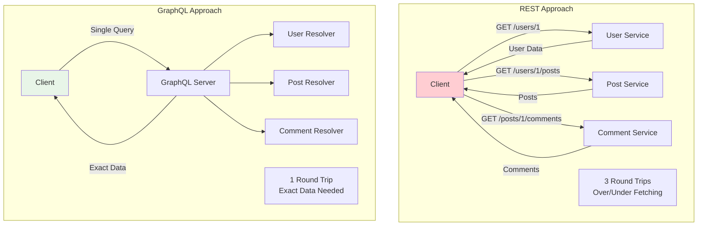

# System Design Fundamentals: GraphQL API Design Patterns

GraphQL is a query language for APIs that lets clients request exactly the data they need. It provides a type system, introspection, and real-time updates through subscriptions, making it powerful for complex data requirements.

## GraphQL vs REST



## Schema Definition

```go
package main

import (
    "fmt"
    "time"
)

// GraphQL Schema Types (represented as Go structs)

// User type
type User struct {
    ID        string    `json:"id"`
    Name      string    `json:"name"`
    Email     string    `json:"email"`
    Age       int       `json:"age"`
    Posts     []*Post   `json:"posts"`
    CreatedAt time.Time `json:"createdAt"`
}

// Post type
type Post struct {
    ID        string     `json:"id"`
    Title     string     `json:"title"`
    Content   string     `json:"content"`
    AuthorID  string     `json:"authorId"`
    Author    *User      `json:"author"`
    Comments  []*Comment `json:"comments"`
    Tags      []string   `json:"tags"`
    CreatedAt time.Time  `json:"createdAt"`
}

// Comment type
type Comment struct {
    ID        string    `json:"id"`
    Text      string    `json:"text"`
    PostID    string    `json:"postId"`
    AuthorID  string    `json:"authorId"`
    Author    *User     `json:"author"`
    CreatedAt time.Time `json:"createdAt"`
}

// Input types for mutations
type CreateUserInput struct {
    Name  string `json:"name"`
    Email string `json:"email"`
    Age   int    `json:"age"`
}

type CreatePostInput struct {
    Title    string   `json:"title"`
    Content  string   `json:"content"`
    AuthorID string   `json:"authorId"`
    Tags     []string `json:"tags"`
}

type UpdatePostInput struct {
    ID      string   `json:"id"`
    Title   *string  `json:"title"`
    Content *string  `json:"content"`
    Tags    []string `json:"tags"`
}

// GraphQL Schema (as string, for reference)
const Schema = `
type User {
  id: ID!
  name: String!
  email: String!
  age: Int!
  posts: [Post!]!
  createdAt: String!
}

type Post {
  id: ID!
  title: String!
  content: String!
  authorId: ID!
  author: User!
  comments: [Comment!]!
  tags: [String!]!
  createdAt: String!
}

type Comment {
  id: ID!
  text: String!
  postId: ID!
  authorId: ID!
  author: User!
  createdAt: String!
}

type Query {
  user(id: ID!): User
  users(limit: Int, offset: Int): [User!]!
  post(id: ID!): Post
  posts(authorId: ID, tag: String, limit: Int): [Post!]!
  search(query: String!): [SearchResult!]!
}

type Mutation {
  createUser(input: CreateUserInput!): User!
  updateUser(id: ID!, input: UpdateUserInput!): User!
  deleteUser(id: ID!): Boolean!
  
  createPost(input: CreatePostInput!): Post!
  updatePost(input: UpdatePostInput!): Post!
  deletePost(id: ID!): Boolean!
}

type Subscription {
  postCreated(authorId: ID): Post!
  commentAdded(postId: ID!): Comment!
}

input CreateUserInput {
  name: String!
  email: String!
  age: Int!
}

input CreatePostInput {
  title: String!
  content: String!
  authorId: ID!
  tags: [String!]
}

input UpdatePostInput {
  id: ID!
  title: String
  content: String
  tags: [String!]
}

union SearchResult = User | Post
`
```

## Data Store

```go
// DataStore manages all data
type DataStore struct {
    users    map[string]*User
    posts    map[string]*Post
    comments map[string]*Comment
}

func NewDataStore() *DataStore {
    return &DataStore{
        users:    make(map[string]*User),
        posts:    make(map[string]*Post),
        comments: make(map[string]*Comment),
    }
}

func (ds *DataStore) GetUser(id string) *User {
    return ds.users[id]
}

func (ds *DataStore) GetUsers(limit, offset int) []*User {
    users := make([]*User, 0)
    count := 0
    
    for _, user := range ds.users {
        if count >= offset && (limit == 0 || len(users) < limit) {
            users = append(users, user)
        }
        count++
    }
    
    return users
}

func (ds *DataStore) CreateUser(input CreateUserInput) *User {
    user := &User{
        ID:        fmt.Sprintf("user-%d", time.Now().UnixNano()),
        Name:      input.Name,
        Email:     input.Email,
        Age:       input.Age,
        Posts:     make([]*Post, 0),
        CreatedAt: time.Now(),
    }
    
    ds.users[user.ID] = user
    return user
}

func (ds *DataStore) GetPost(id string) *Post {
    return ds.posts[id]
}

func (ds *DataStore) GetPosts(authorID, tag string, limit int) []*Post {
    posts := make([]*Post, 0)
    
    for _, post := range ds.posts {
        if authorID != "" && post.AuthorID != authorID {
            continue
        }
        
        if tag != "" {
            hasTag := false
            for _, t := range post.Tags {
                if t == tag {
                    hasTag = true
                    break
                }
            }
            if !hasTag {
                continue
            }
        }
        
        posts = append(posts, post)
        
        if limit > 0 && len(posts) >= limit {
            break
        }
    }
    
    return posts
}

func (ds *DataStore) GetPostsByAuthor(authorID string) []*Post {
    posts := make([]*Post, 0)
    
    for _, post := range ds.posts {
        if post.AuthorID == authorID {
            posts = append(posts, post)
        }
    }
    
    return posts
}

func (ds *DataStore) CreatePost(input CreatePostInput) *Post {
    post := &Post{
        ID:        fmt.Sprintf("post-%d", time.Now().UnixNano()),
        Title:     input.Title,
        Content:   input.Content,
        AuthorID:  input.AuthorID,
        Tags:      input.Tags,
        Comments:  make([]*Comment, 0),
        CreatedAt: time.Now(),
    }
    
    ds.posts[post.ID] = post
    return post
}

func (ds *DataStore) GetCommentsByPost(postID string) []*Comment {
    comments := make([]*Comment, 0)
    
    for _, comment := range ds.comments {
        if comment.PostID == postID {
            comments = append(comments, comment)
        }
    }
    
    return comments
}
```

## Resolvers

```go
// Resolver handles GraphQL field resolution
type Resolver struct {
    store      *DataStore
    dataLoader *DataLoader
}

func NewResolver(store *DataStore) *Resolver {
    return &Resolver{
        store:      store,
        dataLoader: NewDataLoader(store),
    }
}

// Query Resolvers

func (r *Resolver) User(args struct{ ID string }) *User {
    fmt.Printf("🔍 Resolving User: id=%s\n", args.ID)
    return r.store.GetUser(args.ID)
}

func (r *Resolver) Users(args struct {
    Limit  *int
    Offset *int
}) []*User {
    limit := 10
    offset := 0
    
    if args.Limit != nil {
        limit = *args.Limit
    }
    if args.Offset != nil {
        offset = *args.Offset
    }
    
    fmt.Printf("🔍 Resolving Users: limit=%d, offset=%d\n", limit, offset)
    return r.store.GetUsers(limit, offset)
}

func (r *Resolver) Post(args struct{ ID string }) *Post {
    fmt.Printf("🔍 Resolving Post: id=%s\n", args.ID)
    return r.store.GetPost(args.ID)
}

func (r *Resolver) Posts(args struct {
    AuthorID *string
    Tag      *string
    Limit    *int
}) []*Post {
    authorID := ""
    tag := ""
    limit := 0
    
    if args.AuthorID != nil {
        authorID = *args.AuthorID
    }
    if args.Tag != nil {
        tag = *args.Tag
    }
    if args.Limit != nil {
        limit = *args.Limit
    }
    
    fmt.Printf("🔍 Resolving Posts: authorId=%s, tag=%s, limit=%d\n", authorID, tag, limit)
    return r.store.GetPosts(authorID, tag, limit)
}

// Field Resolvers (for nested fields)

func (r *Resolver) UserPosts(user *User) []*Post {
    fmt.Printf("🔍 Resolving User.posts: userId=%s\n", user.ID)
    
    // Use DataLoader to batch requests
    return r.dataLoader.LoadPostsByAuthor(user.ID)
}

func (r *Resolver) PostAuthor(post *Post) *User {
    fmt.Printf("🔍 Resolving Post.author: postId=%s\n", post.ID)
    
    // Use DataLoader to batch requests
    return r.dataLoader.LoadUser(post.AuthorID)
}

func (r *Resolver) PostComments(post *Post) []*Comment {
    fmt.Printf("🔍 Resolving Post.comments: postId=%s\n", post.ID)
    
    return r.dataLoader.LoadCommentsByPost(post.ID)
}

func (r *Resolver) CommentAuthor(comment *Comment) *User {
    fmt.Printf("🔍 Resolving Comment.author: commentId=%s\n", comment.ID)
    
    return r.dataLoader.LoadUser(comment.AuthorID)
}

// Mutation Resolvers

func (r *Resolver) CreateUser(args struct{ Input CreateUserInput }) *User {
    fmt.Printf("✏️  Mutation CreateUser: name=%s\n", args.Input.Name)
    
    user := r.store.CreateUser(args.Input)
    
    fmt.Printf("✅ User created: %s\n", user.ID)
    
    return user
}

func (r *Resolver) CreatePost(args struct{ Input CreatePostInput }) *Post {
    fmt.Printf("✏️  Mutation CreatePost: title=%s\n", args.Input.Title)
    
    post := r.store.CreatePost(args.Input)
    
    fmt.Printf("✅ Post created: %s\n", post.ID)
    
    // Trigger subscription
    r.notifyPostCreated(post)
    
    return post
}

func (r *Resolver) UpdatePost(args struct{ Input UpdatePostInput }) *Post {
    fmt.Printf("✏️  Mutation UpdatePost: id=%s\n", args.Input.ID)
    
    post := r.store.GetPost(args.Input.ID)
    if post == nil {
        return nil
    }
    
    if args.Input.Title != nil {
        post.Title = *args.Input.Title
    }
    if args.Input.Content != nil {
        post.Content = *args.Input.Content
    }
    if args.Input.Tags != nil {
        post.Tags = args.Input.Tags
    }
    
    fmt.Printf("✅ Post updated: %s\n", post.ID)
    
    return post
}

func (r *Resolver) DeletePost(args struct{ ID string }) bool {
    fmt.Printf("✏️  Mutation DeletePost: id=%s\n", args.ID)
    
    delete(r.store.posts, args.ID)
    
    fmt.Printf("✅ Post deleted: %s\n", args.ID)
    
    return true
}

// Subscription support (simplified)

type SubscriptionManager struct {
    postCreatedChannels map[string][]chan *Post
}

func NewSubscriptionManager() *SubscriptionManager {
    return &SubscriptionManager{
        postCreatedChannels: make(map[string][]chan *Post),
    }
}

func (r *Resolver) notifyPostCreated(post *Post) {
    // In production: send to all subscribed clients
    fmt.Printf("📢 Subscription: Post created notification for %s\n", post.ID)
}
```

## DataLoader Pattern

```go
// DataLoader batches and caches requests to avoid N+1 problem
type DataLoader struct {
    store           *DataStore
    userCache       map[string]*User
    postsByAuthor   map[string][]*Post
    commentsByPost  map[string][]*Comment
    batchedUserIDs  []string
    batchTimer      *time.Timer
}

func NewDataLoader(store *DataStore) *DataLoader {
    return &DataLoader{
        store:          store,
        userCache:      make(map[string]*User),
        postsByAuthor:  make(map[string][]*Post),
        commentsByPost: make(map[string][]*Comment),
        batchedUserIDs: make([]string, 0),
    }
}

// LoadUser batches user loading
func (dl *DataLoader) LoadUser(userID string) *User {
    // Check cache first
    if user, exists := dl.userCache[userID]; exists {
        fmt.Printf("  💾 DataLoader cache HIT: User %s\n", userID)
        return user
    }
    
    // Add to batch
    dl.batchedUserIDs = append(dl.batchedUserIDs, userID)
    
    // If this is the first in batch, schedule batch execution
    if len(dl.batchedUserIDs) == 1 {
        dl.batchTimer = time.AfterFunc(10*time.Millisecond, func() {
            dl.executeBatchUserLoad()
        })
    }
    
    // For simplicity, execute immediately in this demo
    // In production: wait for batch timer
    user := dl.store.GetUser(userID)
    dl.userCache[userID] = user
    
    return user
}

// executeBatchUserLoad loads all batched users at once
func (dl *DataLoader) executeBatchUserLoad() {
    if len(dl.batchedUserIDs) == 0 {
        return
    }
    
    fmt.Printf("  📦 DataLoader BATCH: Loading %d users\n", len(dl.batchedUserIDs))
    
    // Load all users in batch
    for _, userID := range dl.batchedUserIDs {
        user := dl.store.GetUser(userID)
        if user != nil {
            dl.userCache[userID] = user
        }
    }
    
    // Clear batch
    dl.batchedUserIDs = make([]string, 0)
}

// LoadPostsByAuthor caches posts by author
func (dl *DataLoader) LoadPostsByAuthor(authorID string) []*Post {
    // Check cache
    if posts, exists := dl.postsByAuthor[authorID]; exists {
        fmt.Printf("  💾 DataLoader cache HIT: Posts for author %s\n", authorID)
        return posts
    }
    
    fmt.Printf("  🔄 DataLoader: Loading posts for author %s\n", authorID)
    
    posts := dl.store.GetPostsByAuthor(authorID)
    dl.postsByAuthor[authorID] = posts
    
    return posts
}

// LoadCommentsByPost caches comments by post
func (dl *DataLoader) LoadCommentsByPost(postID string) []*Comment {
    // Check cache
    if comments, exists := dl.commentsByPost[postID]; exists {
        fmt.Printf("  💾 DataLoader cache HIT: Comments for post %s\n", postID)
        return comments
    }
    
    fmt.Printf("  🔄 DataLoader: Loading comments for post %s\n", postID)
    
    comments := dl.store.GetCommentsByPost(postID)
    dl.commentsByPost[postID] = comments
    
    return comments
}

// ClearCache clears all cached data
func (dl *DataLoader) ClearCache() {
    dl.userCache = make(map[string]*User)
    dl.postsByAuthor = make(map[string][]*Post)
    dl.commentsByPost = make(map[string][]*Comment)
    
    fmt.Println("🧹 DataLoader cache cleared")
}
```

## Query Executor

```go
// QueryExecutor parses and executes GraphQL queries
type QueryExecutor struct {
    resolver *Resolver
}

func NewQueryExecutor(resolver *Resolver) *QueryExecutor {
    return &QueryExecutor{
        resolver: resolver,
    }
}

// ExecuteQuery simulates GraphQL query execution
func (qe *QueryExecutor) ExecuteQuery(queryName string, args map[string]interface{}) interface{} {
    fmt.Printf("\n📨 Executing Query: %s\n", queryName)
    
    switch queryName {
    case "user":
        id := args["id"].(string)
        return qe.resolver.User(struct{ ID string }{ID: id})
        
    case "users":
        limit := 10
        offset := 0
        if l, ok := args["limit"]; ok {
            limit = l.(int)
        }
        if o, ok := args["offset"]; ok {
            offset = o.(int)
        }
        return qe.resolver.Users(struct {
            Limit  *int
            Offset *int
        }{Limit: &limit, Offset: &offset})
        
    case "post":
        id := args["id"].(string)
        return qe.resolver.Post(struct{ ID string }{ID: id})
        
    case "posts":
        var authorID, tag *string
        var limit *int
        
        if a, ok := args["authorId"]; ok {
            s := a.(string)
            authorID = &s
        }
        if t, ok := args["tag"]; ok {
            s := t.(string)
            tag = &s
        }
        if l, ok := args["limit"]; ok {
            i := l.(int)
            limit = &i
        }
        
        return qe.resolver.Posts(struct {
            AuthorID *string
            Tag      *string
            Limit    *int
        }{AuthorID: authorID, Tag: tag, Limit: limit})
        
    default:
        return nil
    }
}

// ExecuteMutation executes GraphQL mutations
func (qe *QueryExecutor) ExecuteMutation(mutationName string, args map[string]interface{}) interface{} {
    fmt.Printf("\n📝 Executing Mutation: %s\n", mutationName)
    
    switch mutationName {
    case "createUser":
        input := args["input"].(CreateUserInput)
        return qe.resolver.CreateUser(struct{ Input CreateUserInput }{Input: input})
        
    case "createPost":
        input := args["input"].(CreatePostInput)
        return qe.resolver.CreatePost(struct{ Input CreatePostInput }{Input: input})
        
    case "updatePost":
        input := args["input"].(UpdatePostInput)
        return qe.resolver.UpdatePost(struct{ Input UpdatePostInput }{Input: input})
        
    case "deletePost":
        id := args["id"].(string)
        return qe.resolver.DeletePost(struct{ ID string }{ID: id})
        
    default:
        return nil
    }
}

// ResolveFields resolves nested fields
func (qe *QueryExecutor) ResolveFields(obj interface{}, fields []string) interface{} {
    switch v := obj.(type) {
    case *User:
        for _, field := range fields {
            if field == "posts" {
                v.Posts = qe.resolver.UserPosts(v)
            }
        }
        return v
        
    case *Post:
        for _, field := range fields {
            if field == "author" {
                v.Author = qe.resolver.PostAuthor(v)
            } else if field == "comments" {
                v.Comments = qe.resolver.PostComments(v)
            }
        }
        return v
        
    case []*Post:
        for _, post := range v {
            qe.ResolveFields(post, fields)
        }
        return v
        
    case *Comment:
        for _, field := range fields {
            if field == "author" {
                v.Author = qe.resolver.CommentAuthor(v)
            }
        }
        return v
        
    default:
        return obj
    }
}
```

## Query Complexity Analysis

```go
// ComplexityAnalyzer prevents expensive queries
type ComplexityAnalyzer struct {
    maxComplexity int
    fieldCosts    map[string]int
}

func NewComplexityAnalyzer(maxComplexity int) *ComplexityAnalyzer {
    return &ComplexityAnalyzer{
        maxComplexity: maxComplexity,
        fieldCosts: map[string]int{
            "user":         1,
            "users":        5,
            "post":         1,
            "posts":        3,
            "user.posts":   10,
            "post.author":  1,
            "post.comments": 5,
        },
    }
}

// AnalyzeQuery calculates query complexity
func (ca *ComplexityAnalyzer) AnalyzeQuery(queryName string, fields []string, args map[string]interface{}) int {
    complexity := ca.fieldCosts[queryName]
    
    // Add field costs
    for _, field := range fields {
        fieldKey := queryName + "." + field
        if cost, exists := ca.fieldCosts[fieldKey]; exists {
            complexity += cost
        }
    }
    
    // Multiply by limit if present
    if limit, ok := args["limit"]; ok {
        complexity *= limit.(int)
    }
    
    return complexity
}

// ValidateQuery checks if query exceeds complexity limit
func (ca *ComplexityAnalyzer) ValidateQuery(queryName string, fields []string, args map[string]interface{}) error {
    complexity := ca.AnalyzeQuery(queryName, fields, args)
    
    fmt.Printf("📊 Query complexity: %d (max: %d)\n", complexity, ca.maxComplexity)
    
    if complexity > ca.maxComplexity {
        return fmt.Errorf("query too complex: %d > %d", complexity, ca.maxComplexity)
    }
    
    return nil
}
```

## Complete Demo

```go
func main() {
    fmt.Println("🚀 Starting GraphQL API Design Demo\n")
    
    // Initialize components
    store := NewDataStore()
    resolver := NewResolver(store)
    executor := NewQueryExecutor(resolver)
    analyzer := NewComplexityAnalyzer(100)
    
    fmt.Println("=== Setting Up Data ===\n")
    
    // Create users
    user1 := store.CreateUser(CreateUserInput{
        Name:  "Alice",
        Email: "alice@example.com",
        Age:   25,
    })
    fmt.Printf("Created user: %s\n", user1.Name)
    
    user2 := store.CreateUser(CreateUserInput{
        Name:  "Bob",
        Email: "bob@example.com",
        Age:   30,
    })
    fmt.Printf("Created user: %s\n", user2.Name)
    
    // Create posts
    post1 := store.CreatePost(CreatePostInput{
        Title:    "GraphQL Tutorial",
        Content:  "Learn GraphQL basics...",
        AuthorID: user1.ID,
        Tags:     []string{"graphql", "tutorial"},
    })
    fmt.Printf("Created post: %s\n", post1.Title)
    
    post2 := store.CreatePost(CreatePostInput{
        Title:    "Advanced GraphQL",
        Content:  "Deep dive into GraphQL...",
        AuthorID: user1.ID,
        Tags:     []string{"graphql", "advanced"},
    })
    fmt.Printf("Created post: %s\n", post2.Title)
    
    post3 := store.CreatePost(CreatePostInput{
        Title:    "System Design",
        Content:  "Scalable architecture...",
        AuthorID: user2.ID,
        Tags:     []string{"system-design"},
    })
    fmt.Printf("Created post: %s\n", post3.Title)
    
    fmt.Println("\n=== Query: Get User with Posts ===")
    
    // Simulate query: { user(id: "...") { name, posts { title } } }
    fields := []string{"posts"}
    
    // Validate complexity
    if err := analyzer.ValidateQuery("user", fields, map[string]interface{}{"id": user1.ID}); err != nil {
        fmt.Printf("❌ Query rejected: %v\n", err)
    } else {
        user := executor.ExecuteQuery("user", map[string]interface{}{"id": user1.ID})
        userWithPosts := executor.ResolveFields(user, fields).(*User)
        
        fmt.Printf("\nResult:\n")
        fmt.Printf("  User: %s\n", userWithPosts.Name)
        fmt.Printf("  Posts:\n")
        for _, post := range userWithPosts.Posts {
            fmt.Printf("    - %s\n", post.Title)
        }
    }
    
    fmt.Println("\n=== Query: Get Posts with Authors ===")
    
    // Simulate query: { posts { title, author { name } } }
    fields = []string{"author"}
    
    if err := analyzer.ValidateQuery("posts", fields, map[string]interface{}{}); err != nil {
        fmt.Printf("❌ Query rejected: %v\n", err)
    } else {
        posts := executor.ExecuteQuery("posts", map[string]interface{}{})
        postsWithAuthors := executor.ResolveFields(posts, fields).([]*Post)
        
        fmt.Printf("\nResult:\n")
        for _, post := range postsWithAuthors {
            fmt.Printf("  Post: %s\n", post.Title)
            if post.Author != nil {
                fmt.Printf("    Author: %s\n", post.Author.Name)
            }
        }
    }
    
    fmt.Println("\n=== Query: Filter Posts by Tag ===")
    
    tag := "graphql"
    posts = executor.ExecuteQuery("posts", map[string]interface{}{
        "tag": tag,
    }).([]*Post)
    
    fmt.Printf("\nPosts with tag '%s':\n", tag)
    for _, post := range posts {
        fmt.Printf("  - %s\n", post.Title)
    }
    
    fmt.Println("\n=== Mutation: Create Post ===")
    
    newPost := executor.ExecuteMutation("createPost", map[string]interface{}{
        "input": CreatePostInput{
            Title:    "GraphQL Best Practices",
            Content:  "Tips and tricks...",
            AuthorID: user2.ID,
            Tags:     []string{"graphql", "best-practices"},
        },
    }).(*Post)
    
    fmt.Printf("\nCreated post: %s (ID: %s)\n", newPost.Title, newPost.ID)
    
    fmt.Println("\n=== Mutation: Update Post ===")
    
    newTitle := "GraphQL Best Practices [Updated]"
    updatedPost := executor.ExecuteMutation("updatePost", map[string]interface{}{
        "input": UpdatePostInput{
            ID:    newPost.ID,
            Title: &newTitle,
        },
    }).(*Post)
    
    fmt.Printf("\nUpdated post: %s\n", updatedPost.Title)
    
    fmt.Println("\n=== DataLoader Demo (N+1 Problem) ===")
    
    fmt.Println("\nWithout DataLoader (N+1 problem):")
    fmt.Println("  Query: Get 3 posts with authors")
    fmt.Println("  Queries: 1 (posts) + 3 (authors) = 4 queries")
    
    fmt.Println("\nWith DataLoader:")
    fmt.Println("  Query: Get 3 posts with authors")
    fmt.Println("  Queries: 1 (posts) + 1 (batched authors) = 2 queries")
    
    // Demonstrate DataLoader caching
    resolver.dataLoader.ClearCache()
    posts = executor.ExecuteQuery("posts", map[string]interface{}{
        "limit": 2,
    }).([]*Post)
    
    postsWithAuthors := executor.ResolveFields(posts, []string{"author"}).([]*Post)
    
    fmt.Printf("\nDataLoader loaded %d posts with authors\n", len(postsWithAuthors))
    
    fmt.Println("\n=== Query Complexity Analysis ===")
    
    // Test expensive query
    expensiveFields := []string{"posts", "comments"}
    err := analyzer.ValidateQuery("users", expensiveFields, map[string]interface{}{
        "limit": 100,
    })
    
    if err != nil {
        fmt.Printf("❌ Expensive query blocked: %v\n", err)
    }
    
    // Test acceptable query
    simpleFields := []string{"posts"}
    err = analyzer.ValidateQuery("users", simpleFields, map[string]interface{}{
        "limit": 5,
    })
    
    if err == nil {
        fmt.Printf("✅ Simple query accepted\n")
    }
    
    fmt.Println("\n✅ GraphQL Demo completed!")
}
```

## GraphQL vs REST Comparison

| Feature | GraphQL | REST |
|---------|---------|------|
| **Data Fetching** | Exact data requested | Fixed endpoints |
| **Round Trips** | Single request | Multiple requests |
| **Over-fetching** | None | Common |
| **Under-fetching** | None | Common (requires multiple calls) |
| **Versioning** | No versioning needed | API versions (v1, v2) |
| **Type System** | Strong typing | Depends on documentation |
| **Caching** | Complex (field-level) | Simple (URL-based) |
| **Learning Curve** | Steeper | Gentler |

## Best Practices

### 1. Use DataLoader for N+1 Problem
```go
// Bad: N+1 queries
for _, post := range posts {
    post.Author = store.GetUser(post.AuthorID) // N queries
}

// Good: Batch with DataLoader
for _, post := range posts {
    post.Author = dataLoader.LoadUser(post.AuthorID) // 1 batched query
}
```

### 2. Implement Query Complexity Limits
```go
// Prevent expensive queries
if complexity > maxComplexity {
    return errors.New("query too complex")
}
```

### 3. Use Input Types for Mutations
```go
// Good: Structured input
type CreatePostInput struct {
    Title   string
    Content string
    Tags    []string
}

// Bad: Many arguments
func CreatePost(title, content string, tags []string)
```

### 4. Implement Pagination
```go
// Cursor-based pagination
type Connection struct {
    Edges    []Edge
    PageInfo PageInfo
}

type Edge struct {
    Node   interface{}
    Cursor string
}

type PageInfo struct {
    HasNextPage     bool
    HasPreviousPage bool
    StartCursor     string
    EndCursor       string
}
```

## When to Use GraphQL

### Good Use Cases
- **Mobile apps**: Reduce bandwidth with exact data
- **Complex data requirements**: Many related entities
- **Rapid iteration**: No backend changes for new UI needs
- **Multiple clients**: Different data needs per client
- **Real-time updates**: Built-in subscription support

### Not Recommended For
- Simple CRUD APIs
- File uploads (use REST)
- When HTTP caching is critical
- Team unfamiliar with GraphQL

## Conclusion

GraphQL provides powerful capabilities for modern APIs:

- **Efficient Data Fetching**: Get exactly what you need
- **Type Safety**: Strong schema with introspection
- **Flexibility**: Clients control data shape
- **Real-time**: Subscriptions for live updates
- **Developer Experience**: Excellent tooling

Key patterns: use DataLoader to avoid N+1 problems, implement query complexity analysis, leverage subscriptions for real-time features, and design clear, composable schemas. Combine with proper caching strategies and monitoring for production-ready GraphQL APIs.
