# System Design Fundamentals: Load Balancing Algorithms Explained

Load balancing distributes incoming requests across multiple servers to optimize resource utilization, maximize throughput, minimize response time, and avoid overload on any single server. 

## Why Load Balancing?

Without load balancing, a single server becomes a bottleneck:
- **Limited Capacity**: One server can only handle so many concurrent requests
- **Single Point of Failure**: If the server fails, the entire application goes down
- **No Horizontal Scaling**: Can't add more servers to increase capacity
- **Uneven Resource Usage**: Some servers idle while others are overloaded

With load balancing:
- **Increased Throughput**: Distribute load across multiple servers
- **High Availability**: If one server fails, others continue serving
- **Horizontal Scaling**: Add more servers as traffic grows
- **Better Resource Utilization**: Keep all servers busy but not overloaded

Let's explore different algorithms with detailed explanations.

## Load Balancer Architecture

```mermaid
graph TB
    Client1[Client 1] --> LB[Load Balancer]
    Client2[Client 2] --> LB
    Client3[Client 3] --> LB
    Client4[Client 4] --> LB
    
    LB --> |Algorithm Decision| S1[Server 1<br/>Load: 20%]
    LB --> |Algorithm Decision| S2[Server 2<br/>Load: 45%]
    LB --> |Algorithm Decision| S3[Server 3<br/>Load: 15%]
    LB --> |Algorithm Decision| S4[Server 4<br/>Load: 60%]
    
    S1 --> HC1[Health Check ✅]
    S2 --> HC2[Health Check ✅]
    S3 --> HC3[Health Check ✅]
    S4 --> HC4[Health Check ❌]
    
    style LB fill:#e8f5e8
    style S4 fill:#ffcdd2
    style HC4 fill:#ffcdd2
```



## Server and Request Types

```go
package main

import (
    "fmt"
    "sync"
    "sync/atomic"
    "time"
)

// Server represents a backend server
type Server struct {
    ID              string
    Host            string
    Port            int
    Weight          int           // For weighted algorithms
    ActiveRequests  int64         // For least connections
    TotalRequests   int64         // For statistics
    FailedRequests  int64         // For health tracking
    Healthy         bool
    LastHealthCheck time.Time
    ResponseTime    time.Duration // Average response time
    mutex           sync.RWMutex
}

func NewServer(id, host string, port, weight int) *Server {
    return &Server{
        ID:              id,
        Host:            host,
        Port:            port,
        Weight:          weight,
        Healthy:         true,
        LastHealthCheck: time.Now(),
    }
}

func (s *Server) IncrementActive() {
    atomic.AddInt64(&s.ActiveRequests, 1)
    atomic.AddInt64(&s.TotalRequests, 1)
}

func (s *Server) DecrementActive() {
    atomic.AddInt64(&s.ActiveRequests, -1)
}

func (s *Server) GetActiveRequests() int64 {
    return atomic.LoadInt64(&s.ActiveRequests)
}

func (s *Server) GetTotalRequests() int64 {
    return atomic.LoadInt64(&s.TotalRequests)
}

func (s *Server) MarkUnhealthy() {
    s.mutex.Lock()
    defer s.mutex.Unlock()
    s.Healthy = false
    atomic.AddInt64(&s.FailedRequests, 1)
}

func (s *Server) MarkHealthy() {
    s.mutex.Lock()
    defer s.mutex.Unlock()
    s.Healthy = true
}

func (s *Server) IsHealthy() bool {
    s.mutex.RLock()
    defer s.mutex.RUnlock()
    return s.Healthy
}

func (s *Server) Address() string {
    return fmt.Sprintf("%s:%d", s.Host, s.Port)
}

func (s *Server) UpdateResponseTime(duration time.Duration) {
    s.mutex.Lock()
    defer s.mutex.Unlock()
    
    // Calculate moving average
    if s.ResponseTime == 0 {
        s.ResponseTime = duration
    } else {
        s.ResponseTime = (s.ResponseTime*9 + duration) / 10
    }
}

// Request represents an incoming request
type Request struct {
    ID        string
    ClientIP  string
    Path      string
    Timestamp time.Time
}
```

## Round-Robin Algorithm

**How it works:** Distributes requests sequentially across all servers in rotation.


```go
// RoundRobinLoadBalancer implements round-robin algorithm
type RoundRobinLoadBalancer struct {
    servers []*Server
    current uint64
    mutex   sync.RWMutex
}

func NewRoundRobinLoadBalancer() *RoundRobinLoadBalancer {
    return &RoundRobinLoadBalancer{
        servers: make([]*Server, 0),
        current: 0,
    }
}

func (lb *RoundRobinLoadBalancer) AddServer(server *Server) {
    lb.mutex.Lock()
    defer lb.mutex.Unlock()
    
    lb.servers = append(lb.servers, server)
    fmt.Printf("✅ Added server to round-robin: %s\n", server.ID)
}

// GetNextServer returns the next server using round-robin
func (lb *RoundRobinLoadBalancer) GetNextServer() *Server {
    lb.mutex.RLock()
    defer lb.mutex.RUnlock()
    
    if len(lb.servers) == 0 {
        return nil
    }
    
    // Get healthy servers only
    healthyServers := make([]*Server, 0)
    for _, server := range lb.servers {
        if server.IsHealthy() {
            healthyServers = append(healthyServers, server)
        }
    }
    
    if len(healthyServers) == 0 {
        return nil
    }
    
    // Atomically increment and get server
    // Using modulo for wrap-around
    index := atomic.AddUint64(&lb.current, 1) - 1
    selectedIndex := index % uint64(len(healthyServers))
    
    server := healthyServers[selectedIndex]
    
    fmt.Printf("🔄 Round-Robin selected: %s (index: %d)\n", server.ID, selectedIndex)
    
    return server
}
```

**Visual Example:**


## Weighted Round-Robin Algorithm

**How it works:** Distributes requests based on server capacity/weight. Higher weight = more requests.


```go
// WeightedRoundRobinLoadBalancer implements weighted round-robin
type WeightedRoundRobinLoadBalancer struct {
    servers       []*Server
    currentWeight []int
    maxWeight     int
    gcd           int
    mutex         sync.Mutex
}

func NewWeightedRoundRobinLoadBalancer() *WeightedRoundRobinLoadBalancer {
    return &WeightedRoundRobinLoadBalancer{
        servers:       make([]*Server, 0),
        currentWeight: make([]int, 0),
    }
}

func (lb *WeightedRoundRobinLoadBalancer) AddServer(server *Server) {
    lb.mutex.Lock()
    defer lb.mutex.Unlock()
    
    lb.servers = append(lb.servers, server)
    lb.currentWeight = append(lb.currentWeight, 0)
    
    // Recalculate max weight and GCD
    lb.recalculate()
    
    fmt.Printf("✅ Added server to weighted round-robin: %s (weight: %d)\n", 
        server.ID, server.Weight)
}

func (lb *WeightedRoundRobinLoadBalancer) recalculate() {
    lb.maxWeight = 0
    weights := make([]int, 0)
    
    for _, server := range lb.servers {
        if server.Weight > lb.maxWeight {
            lb.maxWeight = server.Weight
        }
        weights = append(weights, server.Weight)
    }
    
    lb.gcd = gcd(weights)
}

// GetNextServer returns server based on weights
func (lb *WeightedRoundRobinLoadBalancer) GetNextServer() *Server {
    lb.mutex.Lock()
    defer lb.mutex.Unlock()
    
    if len(lb.servers) == 0 {
        return nil
    }
    
    // Smooth weighted round-robin algorithm
    // This ensures better distribution than simple weighted
    
    var selected *Server
    total := 0
    
    for i, server := range lb.servers {
        if !server.IsHealthy() {
            continue
        }
        
        // Increase current weight
        lb.currentWeight[i] += server.Weight
        total += server.Weight
        
        // Select server with highest current weight
        if selected == nil || lb.currentWeight[i] > lb.currentWeight[lb.indexOf(selected)] {
            selected = server
        }
    }
    
    if selected != nil {
        // Decrease selected server's current weight by total
        idx := lb.indexOf(selected)
        lb.currentWeight[idx] -= total
        
        fmt.Printf("⚖️  Weighted Round-Robin selected: %s (weight: %d, current: %d)\n", 
            selected.ID, selected.Weight, lb.currentWeight[idx])
    }
    
    return selected
}

func (lb *WeightedRoundRobinLoadBalancer) indexOf(server *Server) int {
    for i, s := range lb.servers {
        if s == server {
            return i
        }
    }
    return -1
}

// gcd calculates greatest common divisor of weights
func gcd(weights []int) int {
    if len(weights) == 0 {
        return 1
    }
    
    result := weights[0]
    for i := 1; i < len(weights); i++ {
        result = gcdTwo(result, weights[i])
    }
    
    return result
}

func gcdTwo(a, b int) int {
    for b != 0 {
        a, b = b, a%b
    }
    return a
}
```

**Step-by-Step Example:**

```
Initial: Server1(weight=3), Server2(weight=2), Server3(weight=1)

Step 1: Current weights: [3, 2, 1]
        Select: Server1 (highest=3)
        Update: [3-6, 2, 1] = [-3, 2, 1]

Step 2: Current weights: [0, 4, 2]  (added weights)
        Select: Server2 (highest=4)
        Update: [0, 4-6, 2] = [0, -2, 2]

Step 3: Current weights: [3, 0, 3]
        Select: Server1 (highest=3)
        Update: [3-6, 0, 3] = [-3, 0, 3]

Result over 6 requests: Server1=3, Server2=2, Server3=1
```

## Least Connections Algorithm

**How it works:** Routes requests to the server with the fewest active connections.

```mermaid
graph TB
    LB[Load Balancer<br/>Least Connections]
    
    S1[Server 1<br/>Active: 10<br/>✅ Available]
    S2[Server 2<br/>Active: 5<br/>✅ Available]
    S3[Server 3<br/>Active: 15<br/>✅ Available]
    
    NewReq[New Request] --> LB
    LB --> |Check Active<br/>Connections| S1
    LB --> |Check Active<br/>Connections| S2
    LB --> |Check Active<br/>Connections| S3
    
    LB -.->|Select Minimum<br/>Active: 5| S2
    
    style S2 fill:#e8f5e8
```



```go
// LeastConnectionsLoadBalancer implements least connections algorithm
type LeastConnectionsLoadBalancer struct {
    servers []*Server
    mutex   sync.RWMutex
}

func NewLeastConnectionsLoadBalancer() *LeastConnectionsLoadBalancer {
    return &LeastConnectionsLoadBalancer{
        servers: make([]*Server, 0),
    }
}

func (lb *LeastConnectionsLoadBalancer) AddServer(server *Server) {
    lb.mutex.Lock()
    defer lb.mutex.Unlock()
    
    lb.servers = append(lb.servers, server)
    fmt.Printf("✅ Added server to least connections: %s\n", server.ID)
}

// GetNextServer returns server with least active connections
func (lb *LeastConnectionsLoadBalancer) GetNextServer() *Server {
    lb.mutex.RLock()
    defer lb.mutex.RUnlock()
    
    if len(lb.servers) == 0 {
        return nil
    }
    
    var selected *Server
    minConnections := int64(-1)
    
    // Find server with minimum active connections
    for _, server := range lb.servers {
        if !server.IsHealthy() {
            continue
        }
        
        active := server.GetActiveRequests()
        
        if minConnections == -1 || active < minConnections {
            selected = server
            minConnections = active
        }
    }
    
    if selected != nil {
        fmt.Printf("📉 Least Connections selected: %s (active: %d)\n", 
            selected.ID, minConnections)
    }
    
    return selected
}

// GetServerStats returns statistics for all servers
func (lb *LeastConnectionsLoadBalancer) GetServerStats() map[string]int64 {
    lb.mutex.RLock()
    defer lb.mutex.RUnlock()
    
    stats := make(map[string]int64)
    
    for _, server := range lb.servers {
        stats[server.ID] = server.GetActiveRequests()
    }
    
    return stats
}
```

**Visual Example:**


## Consistent Hashing Algorithm

**How it works:** Uses hash ring to map requests to servers. Adding/removing servers affects only nearby keys.

```mermaid
graph TB
    subgraph "Hash Ring"
    direction TB
    Ring[Hash Ring 0-359°]
    
    S1[Server 1<br/>Hash: 45°]
    S2[Server 2<br/>Hash: 135°]
    S3[Server 3<br/>Hash: 225°]
    S4[Server 4<br/>Hash: 315°]
    
    R1[Request A<br/>Hash: 60°]
    R2[Request B<br/>Hash: 150°]
    R3[Request C<br/>Hash: 240°]
    R4[Request D<br/>Hash: 330°]
    end
    
    R1 -.->|Next server<br/>clockwise| S2
    R2 -.->|Next server<br/>clockwise| S3
    R3 -.->|Next server<br/>clockwise| S4
    R4 -.->|Next server<br/>clockwise| S1
    
    Note[Requests route to<br/>next server clockwise]
```



```go
// ConsistentHashLoadBalancer implements consistent hashing
type ConsistentHashLoadBalancer struct {
    ring        map[uint32]*Server
    sortedKeys  []uint32
    virtualNodes int
    mutex       sync.RWMutex
}

func NewConsistentHashLoadBalancer(virtualNodes int) *ConsistentHashLoadBalancer {
    return &ConsistentHashLoadBalancer{
        ring:        make(map[uint32]*Server),
        sortedKeys:  make([]uint32, 0),
        virtualNodes: virtualNodes,
    }
}

func (lb *ConsistentHashLoadBalancer) AddServer(server *Server) {
    lb.mutex.Lock()
    defer lb.mutex.Unlock()
    
    // Add virtual nodes for better distribution
    for i := 0; i < lb.virtualNodes; i++ {
        virtualKey := fmt.Sprintf("%s#%d", server.ID, i)
        hash := lb.hashKey(virtualKey)
        
        lb.ring[hash] = server
        lb.sortedKeys = append(lb.sortedKeys, hash)
    }
    
    // Sort keys for binary search
    lb.sortKeys()
    
    fmt.Printf("✅ Added server to consistent hash: %s (%d virtual nodes)\n", 
        server.ID, lb.virtualNodes)
}

func (lb *ConsistentHashLoadBalancer) RemoveServer(serverID string) {
    lb.mutex.Lock()
    defer lb.mutex.Unlock()
    
    // Remove virtual nodes
    for i := 0; i < lb.virtualNodes; i++ {
        virtualKey := fmt.Sprintf("%s#%d", serverID, i)
        hash := lb.hashKey(virtualKey)
        
        delete(lb.ring, hash)
        
        // Remove from sorted keys
        for idx, key := range lb.sortedKeys {
            if key == hash {
                lb.sortedKeys = append(lb.sortedKeys[:idx], lb.sortedKeys[idx+1:]...)
                break
            }
        }
    }
    
    fmt.Printf("🗑️  Removed server from consistent hash: %s\n", serverID)
}

// GetServer returns server for given key (e.g., client IP)
func (lb *ConsistentHashLoadBalancer) GetServer(key string) *Server {
    lb.mutex.RLock()
    defer lb.mutex.RUnlock()
    
    if len(lb.sortedKeys) == 0 {
        return nil
    }
    
    hash := lb.hashKey(key)
    
    // Binary search for the first server hash >= request hash
    idx := lb.search(hash)
    
    // Wrap around if necessary
    if idx >= len(lb.sortedKeys) {
        idx = 0
    }
    
    serverHash := lb.sortedKeys[idx]
    server := lb.ring[serverHash]
    
    fmt.Printf("🔐 Consistent Hash: key=%s → hash=%d → server=%s\n", 
        key, hash, server.ID)
    
    return server
}

func (lb *ConsistentHashLoadBalancer) hashKey(key string) uint32 {
    // Simple hash function (in production, use better hash like xxhash)
    h := uint32(0)
    for _, c := range key {
        h = h*31 + uint32(c)
    }
    return h
}

func (lb *ConsistentHashLoadBalancer) search(hash uint32) int {
    // Binary search
    left, right := 0, len(lb.sortedKeys)
    
    for left < right {
        mid := (left + right) / 2
        
        if lb.sortedKeys[mid] < hash {
            left = mid + 1
        } else {
            right = mid
        }
    }
    
    return left
}

func (lb *ConsistentHashLoadBalancer) sortKeys() {
    // Bubble sort (simple, for small arrays)
    n := len(lb.sortedKeys)
    for i := 0; i < n-1; i++ {
        for j := 0; j < n-i-1; j++ {
            if lb.sortedKeys[j] > lb.sortedKeys[j+1] {
                lb.sortedKeys[j], lb.sortedKeys[j+1] = lb.sortedKeys[j+1], lb.sortedKeys[j]
            }
        }
    }
}
```

**Adding Server Impact:**

```mermaid
graph LR
    subgraph "Before: 3 Servers"
    B1[Server 1: 45°]
    B2[Server 2: 135°]
    B3[Server 3: 270°]
    BR1[Keys: 46-135°] --> B2
    BR2[Keys: 136-270°] --> B3
    BR3[Keys: 271-45°] --> B1
    end
    
    subgraph "After: Add Server 4 at 200°"
    A1[Server 1: 45°]
    A2[Server 2: 135°]
    A3[Server 3: 270°]
    A4[Server 4: 200° NEW]
    AR1[Keys: 46-135°] --> A2
    AR2[Keys: 136-200°] --> A4
    AR3[Keys: 201-270°] --> A3
    AR4[Keys: 271-45°] --> A1
    end
    
    Note[Only keys 136-200°<br/>remapped to new server]
```



## Health Checker

```go
// HealthChecker monitors server health
type HealthChecker struct {
    servers  []*Server
    interval time.Duration
    timeout  time.Duration
    stopChan chan bool
}

func NewHealthChecker(interval, timeout time.Duration) *HealthChecker {
    return &HealthChecker{
        servers:  make([]*Server, 0),
        interval: interval,
        timeout:  timeout,
        stopChan: make(chan bool),
    }
}

func (hc *HealthChecker) AddServer(server *Server) {
    hc.servers = append(hc.servers, server)
}

func (hc *HealthChecker) Start() {
    ticker := time.NewTicker(hc.interval)
    
    go func() {
        for {
            select {
            case <-ticker.C:
                hc.checkAll()
            case <-hc.stopChan:
                ticker.Stop()
                return
            }
        }
    }()
    
    fmt.Printf("🏥 Health checker started (interval: %v)\n", hc.interval)
}

func (hc *HealthChecker) Stop() {
    hc.stopChan <- true
}

func (hc *HealthChecker) checkAll() {
    fmt.Println("\n🔍 Health check round...")
    
    for _, server := range hc.servers {
        healthy := hc.checkServer(server)
        
        if healthy {
            if !server.IsHealthy() {
                server.MarkHealthy()
                fmt.Printf("  ✅ %s is now HEALTHY\n", server.ID)
            }
        } else {
            if server.IsHealthy() {
                server.MarkUnhealthy()
                fmt.Printf("  ❌ %s is now UNHEALTHY\n", server.ID)
            }
        }
    }
}

func (hc *HealthChecker) checkServer(server *Server) bool {
    // Simulate health check (in production: HTTP GET /health)
    // For demo: randomly fail 10% of the time
    return time.Now().UnixNano()%10 != 0
}
```

## Complete Demo with All Algorithms

```go
func main() {
    fmt.Println("🚀 Starting Load Balancing Demo\n")
    
    // Create servers
    servers := []*Server{
        NewServer("server-1", "192.168.1.1", 8080, 5),
        NewServer("server-2", "192.168.1.2", 8080, 3),
        NewServer("server-3", "192.168.1.3", 8080, 2),
        NewServer("server-4", "192.168.1.4", 8080, 4),
    }
    
    fmt.Println("=== 1. Round-Robin Load Balancer ===\n")
    
    rrLB := NewRoundRobinLoadBalancer()
    for _, server := range servers[:3] {
        rrLB.AddServer(server)
    }
    
    fmt.Println("\nDistributing 9 requests:")
    for i := 1; i <= 9; i++ {
        server := rrLB.GetNextServer()
        if server != nil {
            fmt.Printf("Request %d → %s\n", i, server.ID)
        }
    }
    
    fmt.Println("\n\n=== 2. Weighted Round-Robin Load Balancer ===\n")
    
    wrrLB := NewWeightedRoundRobinLoadBalancer()
    for _, server := range servers {
        wrrLB.AddServer(server)
    }
    
    fmt.Println("\nDistributing 10 requests (weights: 5, 3, 2, 4):")
    distribution := make(map[string]int)
    
    for i := 1; i <= 14; i++ {
        server := wrrLB.GetNextServer()
        if server != nil {
            distribution[server.ID]++
            fmt.Printf("Request %d → %s\n", i, server.ID)
        }
    }
    
    fmt.Println("\nDistribution summary:")
    for serverID, count := range distribution {
        fmt.Printf("  %s: %d requests\n", serverID, count)
    }
    
    fmt.Println("\n\n=== 3. Least Connections Load Balancer ===\n")
    
    lcLB := NewLeastConnectionsLoadBalancer()
    for _, server := range servers[:3] {
        lcLB.AddServer(server)
    }
    
    // Simulate different load on servers
    servers[0].ActiveRequests = 5
    servers[1].ActiveRequests = 2
    servers[2].ActiveRequests = 8
    
    fmt.Println("Initial server loads:")
    fmt.Printf("  server-1: %d active\n", servers[0].GetActiveRequests())
    fmt.Printf("  server-2: %d active\n", servers[1].GetActiveRequests())
    fmt.Printf("  server-3: %d active\n", servers[2].GetActiveRequests())
    
    fmt.Println("\nDistributing 5 requests:")
    for i := 1; i <= 5; i++ {
        server := lcLB.GetNextServer()
        if server != nil {
            server.IncrementActive()
            fmt.Printf("Request %d → %s (active: %d)\n", 
                i, server.ID, server.GetActiveRequests())
            
            // Simulate request completion
            time.AfterFunc(100*time.Millisecond, func() {
                server.DecrementActive()
            })
        }
        
        time.Sleep(50 * time.Millisecond)
    }
    
    fmt.Println("\n\n=== 4. Consistent Hash Load Balancer ===\n")
    
    chLB := NewConsistentHashLoadBalancer(3) // 3 virtual nodes per server
    for _, server := range servers[:3] {
        chLB.AddServer(server)
    }
    
    fmt.Println("\nRouting requests by client IP:")
    clients := []string{
        "192.168.1.100",
        "192.168.1.101",
        "192.168.1.102",
        "192.168.1.100", // Same client
        "192.168.1.103",
        "192.168.1.101", // Same client
    }
    
    for i, clientIP := range clients {
        server := chLB.GetServer(clientIP)
        if server != nil {
            fmt.Printf("Request %d from %s → %s\n", i+1, clientIP, server.ID)
        }
    }
    
    fmt.Println("\n\n=== 5. Health Checking ===\n")
    
    healthChecker := NewHealthChecker(2*time.Second, 1*time.Second)
    for _, server := range servers[:3] {
        healthChecker.AddServer(server)
    }
    
    healthChecker.Start()
    
    // Run health checks
    time.Sleep(5 * time.Second)
    
    healthChecker.Stop()
    
    fmt.Println("\n✅ Load Balancing Demo completed!")
}
```

## Algorithm Comparison

| Algorithm | Pros | Cons | Best For |
|-----------|------|------|----------|
| **Round-Robin** | Simple, fair distribution | Ignores server load | Equal servers |
| **Weighted RR** | Handles different capacities | Static weights | Known capacities |
| **Least Connections** | Dynamic load balancing | Overhead tracking connections | Long requests |
| **Consistent Hashing** | Minimal redistribution | Complex implementation | Caching, sessions |

## Best Practices

### 1. Health Checking
```go
// Always monitor server health
healthChecker.Start()
defer healthChecker.Stop()
```

### 2. Graceful Degradation
```go
// Handle all servers down
server := lb.GetNextServer()
if server == nil {
    return errors.New("no healthy servers available")
}
```

### 3. Connection Draining
```go
// When removing server, wait for active connections
func (lb *LoadBalancer) RemoveServerGracefully(serverID string) {
    server := lb.GetServer(serverID)
    server.MarkUnhealthy() // Stop new requests
    
    // Wait for active connections to finish
    for server.GetActiveRequests() > 0 {
        time.Sleep(100 * time.Millisecond)
    }
    
    lb.RemoveServer(serverID)
}
```

### 4. Session Persistence
```go
// Use consistent hashing for session affinity
server := chLB.GetServer(sessionID)
```

## Conclusion

Load balancing algorithms distribute traffic efficiently:

- **Round-Robin**: Simple, equal distribution
- **Weighted Round-Robin**: Capacity-aware distribution  
- **Least Connections**: Dynamic load-aware routing
- **Consistent Hashing**: Minimal key redistribution

Choose based on your requirements: use round-robin for simple cases, weighted for mixed capacities, least connections for varying request durations, and consistent hashing for cache locality and session persistence.
