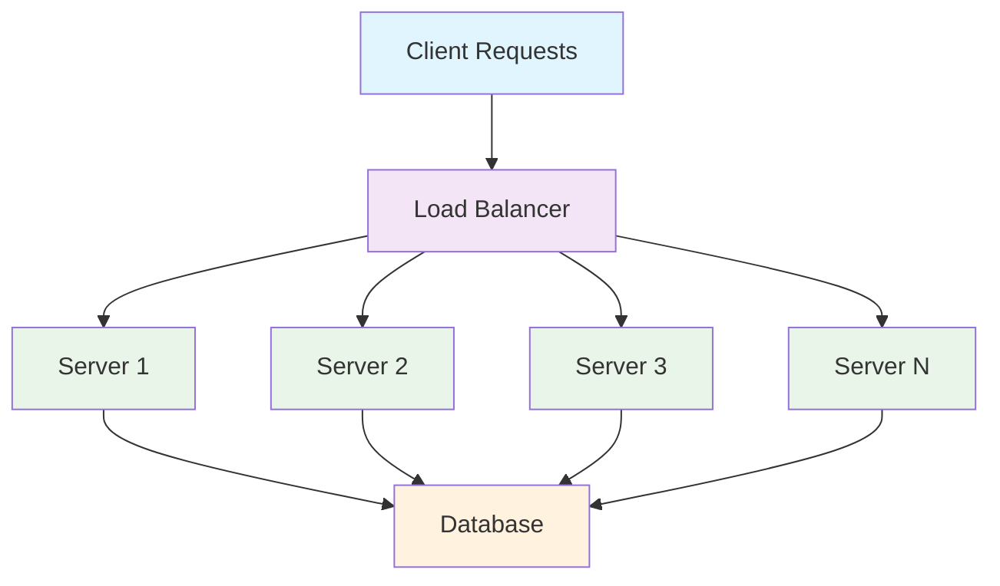
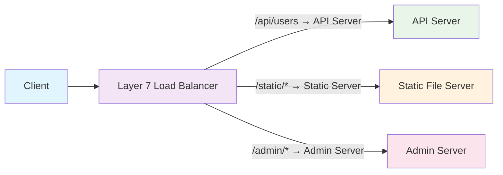
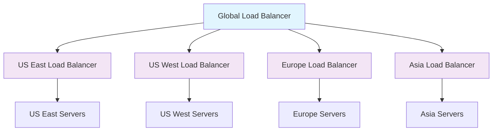
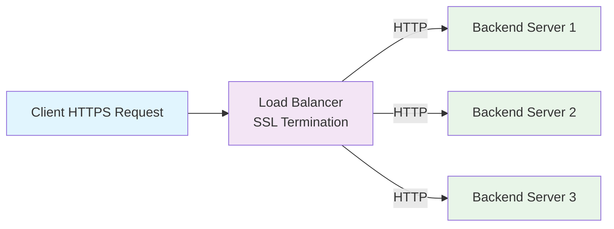

# System Design Fundamentals: Load Balancing

Load balancing is the practice of distributing incoming network traffic across multiple servers to ensure no single server bears too much demand. It's a critical component for building scalable, reliable, and high-performance systems.

## What is Load Balancing?

Load balancing sits between clients and servers, intelligently routing requests to ensure optimal resource utilization, minimize response time, and avoid overloading any single server.



## Types of Load Balancing

### 1. Layer 4 (Transport Layer) Load Balancing

Operates at the transport layer, making routing decisions based on IP and port information without inspecting packet content.

**Advantages:**
- Fast and efficient
- Protocol agnostic
- Lower latency
- Better performance

**Disadvantages:**
- Limited routing flexibility
- No content-based routing
- Less intelligent distribution

### 2. Layer 7 (Application Layer) Load Balancing

Operates at the application layer, making intelligent routing decisions based on content, headers, and application-specific data.

**Advantages:**
- Content-based routing
- SSL termination
- Advanced health checks
- Request modification

**Disadvantages:**
- Higher latency
- More resource intensive
- Protocol specific



## Load Balancing Algorithms

### 1. Round Robin

```python
# Simple Round Robin implementation in Python
class RoundRobinBalancer:
    def __init__(self, servers):
        self.servers = servers
        self.current = 0
    
    def get_server(self):
        """Get next server in round-robin fashion"""
        server = self.servers[self.current]
        self.current = (self.current + 1) % len(self.servers)
        return server
    
    def add_server(self, server):
        """Add new server to the pool"""
        self.servers.append(server)
    
    def remove_server(self, server):
        """Remove server from the pool"""
        if server in self.servers:
            # Adjust current index if needed
            server_index = self.servers.index(server)
            if server_index < self.current:
                self.current -= 1
            self.servers.remove(server)
            # Reset if we're at the end
            if self.current >= len(self.servers) and self.servers:
                self.current = 0

# Usage
servers = ["192.168.1.10:8080", "192.168.1.11:8080", "192.168.1.12:8080"]
balancer = RoundRobinBalancer(servers)

# Distribute requests
for i in range(10):
    server = balancer.get_server()
    print(f"Request {i+1} → {server}")
```

### 2. Weighted Round Robin

```go
// Weighted Round Robin implementation in Go
package main

import (
    "fmt"
    "sync"
)

type Server struct {
    Address       string
    Weight        int
    CurrentWeight int
}

type WeightedRoundRobinBalancer struct {
    servers []*Server
    mutex   sync.Mutex
}

func NewWeightedRoundRobinBalancer() *WeightedRoundRobinBalancer {
    return &WeightedRoundRobinBalancer{
        servers: make([]*Server, 0),
    }
}

func (wrr *WeightedRoundRobinBalancer) AddServer(address string, weight int) {
    wrr.mutex.Lock()
    defer wrr.mutex.Unlock()
    
    server := &Server{
        Address:       address,
        Weight:        weight,
        CurrentWeight: 0,
    }
    wrr.servers = append(wrr.servers, server)
}

func (wrr *WeightedRoundRobinBalancer) GetServer() string {
    wrr.mutex.Lock()
    defer wrr.mutex.Unlock()
    
    if len(wrr.servers) == 0 {
        return ""
    }
    
    var selected *Server
    totalWeight := 0
    
    // Calculate total weight and find server with highest current weight
    for _, server := range wrr.servers {
        server.CurrentWeight += server.Weight
        totalWeight += server.Weight
        
        if selected == nil || server.CurrentWeight > selected.CurrentWeight {
            selected = server
        }
    }
    
    // Decrease selected server's current weight
    selected.CurrentWeight -= totalWeight
    
    return selected.Address
}

func (wrr *WeightedRoundRobinBalancer) RemoveServer(address string) bool {
    wrr.mutex.Lock()
    defer wrr.mutex.Unlock()
    
    for i, server := range wrr.servers {
        if server.Address == address {
            wrr.servers = append(wrr.servers[:i], wrr.servers[i+1:]...)
            return true
        }
    }
    return false
}

func main() {
    balancer := NewWeightedRoundRobinBalancer()
    
    // Add servers with different weights
    balancer.AddServer("server1:8080", 3) // High capacity server
    balancer.AddServer("server2:8080", 2) // Medium capacity server
    balancer.AddServer("server3:8080", 1) // Low capacity server
    
    // Distribute 12 requests to see the weighted distribution
    fmt.Println("Weighted Round Robin Distribution:")
    for i := 1; i <= 12; i++ {
        server := balancer.GetServer()
        fmt.Printf("Request %2d → %s\n", i, server)
    }
}
```

### 3. Least Connections

```python
# Least Connections algorithm implementation
import threading
import time
from typing import Dict, List
from dataclasses import dataclass

@dataclass
class ServerInfo:
    address: str
    active_connections: int = 0
    total_requests: int = 0
    response_time_avg: float = 0.0
    is_healthy: bool = True

class LeastConnectionsBalancer:
    def __init__(self):
        self.servers: Dict[str, ServerInfo] = {}
        self.lock = threading.Lock()
    
    def add_server(self, address: str):
        """Add a new server to the pool"""
        with self.lock:
            self.servers[address] = ServerInfo(address=address)
    
    def remove_server(self, address: str):
        """Remove a server from the pool"""
        with self.lock:
            if address in self.servers:
                del self.servers[address]
    
    def get_server(self) -> str:
        """Get server with least active connections"""
        with self.lock:
            if not self.servers:
                return None
            
            # Filter healthy servers
            healthy_servers = {addr: info for addr, info in self.servers.items() 
                             if info.is_healthy}
            
            if not healthy_servers:
                return None
            
            # Find server with minimum connections
            selected_server = min(healthy_servers.values(), 
                                key=lambda s: s.active_connections)
            
            return selected_server.address
    
    def start_request(self, server_address: str):
        """Mark start of request on a server"""
        with self.lock:
            if server_address in self.servers:
                self.servers[server_address].active_connections += 1
                self.servers[server_address].total_requests += 1
    
    def end_request(self, server_address: str, response_time: float):
        """Mark end of request on a server"""
        with self.lock:
            if server_address in self.servers:
                server = self.servers[server_address]
                server.active_connections = max(0, server.active_connections - 1)
                
                # Update average response time (exponential moving average)
                alpha = 0.1  # Smoothing factor
                if server.response_time_avg == 0:
                    server.response_time_avg = response_time
                else:
                    server.response_time_avg = (alpha * response_time + 
                                              (1 - alpha) * server.response_time_avg)
    
    def mark_server_unhealthy(self, server_address: str):
        """Mark server as unhealthy"""
        with self.lock:
            if server_address in self.servers:
                self.servers[server_address].is_healthy = False
    
    def mark_server_healthy(self, server_address: str):
        """Mark server as healthy"""
        with self.lock:
            if server_address in self.servers:
                self.servers[server_address].is_healthy = True
    
    def get_server_stats(self) -> Dict[str, dict]:
        """Get statistics for all servers"""
        with self.lock:
            return {
                addr: {
                    'active_connections': info.active_connections,
                    'total_requests': info.total_requests,
                    'avg_response_time': info.response_time_avg,
                    'is_healthy': info.is_healthy
                }
                for addr, info in self.servers.items()
            }

# Simulation example
def simulate_requests():
    balancer = LeastConnectionsBalancer()
    
    # Add servers
    servers = ["server1:8080", "server2:8080", "server3:8080"]
    for server in servers:
        balancer.add_server(server)
    
    import random
    
    def process_request(request_id):
        server = balancer.get_server()
        if not server:
            return
        
        print(f"Request {request_id} → {server}")
        balancer.start_request(server)
        
        # Simulate processing time
        processing_time = random.uniform(0.1, 2.0)
        time.sleep(processing_time)
        
        balancer.end_request(server, processing_time)
    
    # Simulate concurrent requests
    threads = []
    for i in range(20):
        thread = threading.Thread(target=process_request, args=(i+1,))
        threads.append(thread)
        thread.start()
        time.sleep(0.1)  # Stagger request starts
    
    # Wait for all requests to complete
    for thread in threads:
        thread.join()
    
    # Print final statistics
    print("\nFinal Server Statistics:")
    stats = balancer.get_server_stats()
    for server, info in stats.items():
        print(f"{server}: {info}")

if __name__ == "__main__":
    simulate_requests()
```

### 4. Least Response Time

```go
// Least Response Time algorithm in Go
package main

import (
    "fmt"
    "math"
    "sync"
    "time"
)

type ResponseTimeServer struct {
    Address           string
    ActiveConnections int
    TotalRequests     int64
    TotalResponseTime time.Duration
    LastResponseTime  time.Duration
    IsHealthy         bool
}

func (s *ResponseTimeServer) AverageResponseTime() time.Duration {
    if s.TotalRequests == 0 {
        return 0
    }
    return s.TotalResponseTime / time.Duration(s.TotalRequests)
}

func (s *ResponseTimeServer) Score() float64 {
    // Lower score is better (less response time + fewer connections)
    avgResponseTime := s.AverageResponseTime().Seconds()
    if avgResponseTime == 0 {
        avgResponseTime = 0.001 // Avoid division by zero
    }
    return avgResponseTime * (1 + float64(s.ActiveConnections)*0.1)
}

type LeastResponseTimeBalancer struct {
    servers map[string]*ResponseTimeServer
    mutex   sync.RWMutex
}

func NewLeastResponseTimeBalancer() *LeastResponseTimeBalancer {
    return &LeastResponseTimeBalancer{
        servers: make(map[string]*ResponseTimeServer),
    }
}

func (lrt *LeastResponseTimeBalancer) AddServer(address string) {
    lrt.mutex.Lock()
    defer lrt.mutex.Unlock()
    
    lrt.servers[address] = &ResponseTimeServer{
        Address:   address,
        IsHealthy: true,
    }
}

func (lrt *LeastResponseTimeBalancer) RemoveServer(address string) {
    lrt.mutex.Lock()
    defer lrt.mutex.Unlock()
    
    delete(lrt.servers, address)
}

func (lrt *LeastResponseTimeBalancer) GetServer() string {
    lrt.mutex.RLock()
    defer lrt.mutex.RUnlock()
    
    var bestServer *ResponseTimeServer
    bestScore := math.Inf(1)
    
    for _, server := range lrt.servers {
        if !server.IsHealthy {
            continue
        }
        
        score := server.Score()
        if score < bestScore {
            bestScore = score
            bestServer = server
        }
    }
    
    if bestServer == nil {
        return ""
    }
    
    return bestServer.Address
}

func (lrt *LeastResponseTimeBalancer) StartRequest(address string) {
    lrt.mutex.Lock()
    defer lrt.mutex.Unlock()
    
    if server, exists := lrt.servers[address]; exists {
        server.ActiveConnections++
        server.TotalRequests++
    }
}

func (lrt *LeastResponseTimeBalancer) EndRequest(address string, responseTime time.Duration) {
    lrt.mutex.Lock()
    defer lrt.mutex.Unlock()
    
    if server, exists := lrt.servers[address]; exists {
        server.ActiveConnections = int(math.Max(0, float64(server.ActiveConnections-1)))
        server.LastResponseTime = responseTime
        server.TotalResponseTime += responseTime
    }
}

func (lrt *LeastResponseTimeBalancer) SetServerHealth(address string, healthy bool) {
    lrt.mutex.Lock()
    defer lrt.mutex.Unlock()
    
    if server, exists := lrt.servers[address]; exists {
        server.IsHealthy = healthy
    }
}

func (lrt *LeastResponseTimeBalancer) GetStats() map[string]map[string]interface{} {
    lrt.mutex.RLock()
    defer lrt.mutex.RUnlock()
    
    stats := make(map[string]map[string]interface{})
    
    for address, server := range lrt.servers {
        stats[address] = map[string]interface{}{
            "active_connections": server.ActiveConnections,
            "total_requests":     server.TotalRequests,
            "avg_response_time":  server.AverageResponseTime().Milliseconds(),
            "last_response_time": server.LastResponseTime.Milliseconds(),
            "score":             server.Score(),
            "is_healthy":        server.IsHealthy,
        }
    }
    
    return stats
}

func main() {
    balancer := NewLeastResponseTimeBalancer()
    
    // Add servers
    servers := []string{"server1:8080", "server2:8080", "server3:8080"}
    for _, server := range servers {
        balancer.AddServer(server)
    }
    
    // Simulate requests with different response times
    for i := 1; i <= 15; i++ {
        server := balancer.GetServer()
        if server == "" {
            continue
        }
        
        fmt.Printf("Request %2d → %s\n", i, server)
        balancer.StartRequest(server)
        
        // Simulate different response times for different servers
        var responseTime time.Duration
        switch server {
        case "server1:8080":
            responseTime = time.Duration(100+i*10) * time.Millisecond
        case "server2:8080":
            responseTime = time.Duration(150+i*5) * time.Millisecond
        case "server3:8080":
            responseTime = time.Duration(80+i*15) * time.Millisecond
        }
        
        balancer.EndRequest(server, responseTime)
        
        // Print stats every 5 requests
        if i%5 == 0 {
            fmt.Println("\nCurrent Server Stats:")
            stats := balancer.GetStats()
            for addr, info := range stats {
                fmt.Printf("  %s: Score=%.3f, AvgRT=%dms, Connections=%d\n",
                    addr, info["score"], info["avg_response_time"], info["active_connections"])
            }
            fmt.Println()
        }
    }
}
```

## Health Checking and Failover

### Implementing Health Checks

```python
# Comprehensive health checking system
import asyncio
import aiohttp
import time
import logging
from typing import Dict, List, Callable
from dataclasses import dataclass, field
from enum import Enum

class HealthStatus(Enum):
    HEALTHY = "healthy"
    UNHEALTHY = "unhealthy"
    UNKNOWN = "unknown"

@dataclass
class HealthCheckConfig:
    interval: int = 30  # seconds
    timeout: int = 5    # seconds
    healthy_threshold: int = 2  # consecutive successes to mark healthy
    unhealthy_threshold: int = 3  # consecutive failures to mark unhealthy
    check_path: str = "/health"

@dataclass
class ServerHealthInfo:
    address: str
    status: HealthStatus = HealthStatus.UNKNOWN
    consecutive_successes: int = 0
    consecutive_failures: int = 0
    last_check: float = 0
    last_response_time: float = 0
    error_message: str = ""

class HealthChecker:
    def __init__(self, config: HealthCheckConfig):
        self.config = config
        self.servers: Dict[str, ServerHealthInfo] = {}
        self.callbacks: List[Callable[[str, HealthStatus, HealthStatus], None]] = []
        self.running = False
        self.session = None
    
    async def __aenter__(self):
        self.session = aiohttp.ClientSession(
            timeout=aiohttp.ClientTimeout(total=self.config.timeout)
        )
        return self
    
    async def __aexit__(self, exc_type, exc_val, exc_tb):
        if self.session:
            await self.session.close()
    
    def add_server(self, address: str):
        """Add a server to health monitoring"""
        self.servers[address] = ServerHealthInfo(address=address)
    
    def remove_server(self, address: str):
        """Remove a server from health monitoring"""
        if address in self.servers:
            del self.servers[address]
    
    def add_status_change_callback(self, callback: Callable[[str, HealthStatus, HealthStatus], None]):
        """Add callback for health status changes"""
        self.callbacks.append(callback)
    
    async def check_server_health(self, server_info: ServerHealthInfo) -> bool:
        """Check health of a single server"""
        url = f"http://{server_info.address}{self.config.check_path}"
        
        try:
            start_time = time.time()
            async with self.session.get(url) as response:
                response_time = time.time() - start_time
                server_info.last_response_time = response_time
                server_info.last_check = time.time()
                
                if response.status == 200:
                    # Check response content for more detailed health info
                    try:
                        health_data = await response.json()
                        # Additional checks based on response content
                        if health_data.get('status') == 'ok':
                            return True
                    except:
                        # If we can't parse JSON, just check HTTP status
                        return True
                
                server_info.error_message = f"HTTP {response.status}"
                return False
                
        except asyncio.TimeoutError:
            server_info.error_message = "Timeout"
            server_info.last_check = time.time()
            return False
        except Exception as e:
            server_info.error_message = str(e)
            server_info.last_check = time.time()
            return False
    
    def update_server_status(self, server_info: ServerHealthInfo, is_healthy: bool):
        """Update server health status based on check result"""
        old_status = server_info.status
        
        if is_healthy:
            server_info.consecutive_successes += 1
            server_info.consecutive_failures = 0
            server_info.error_message = ""
            
            # Mark as healthy if we have enough consecutive successes
            if (server_info.consecutive_successes >= self.config.healthy_threshold and 
                server_info.status != HealthStatus.HEALTHY):
                server_info.status = HealthStatus.HEALTHY
        else:
            server_info.consecutive_failures += 1
            server_info.consecutive_successes = 0
            
            # Mark as unhealthy if we have enough consecutive failures
            if (server_info.consecutive_failures >= self.config.unhealthy_threshold and 
                server_info.status != HealthStatus.UNHEALTHY):
                server_info.status = HealthStatus.UNHEALTHY
        
        # Notify callbacks if status changed
        if old_status != server_info.status:
            for callback in self.callbacks:
                callback(server_info.address, old_status, server_info.status)
    
    async def health_check_loop(self):
        """Main health checking loop"""
        while self.running:
            tasks = []
            
            for server_info in self.servers.values():
                tasks.append(self.check_and_update_server(server_info))
            
            if tasks:
                await asyncio.gather(*tasks, return_exceptions=True)
            
            await asyncio.sleep(self.config.interval)
    
    async def check_and_update_server(self, server_info: ServerHealthInfo):
        """Check and update a single server's health status"""
        is_healthy = await self.check_server_health(server_info)
        self.update_server_status(server_info, is_healthy)
    
    async def start(self):
        """Start health checking"""
        self.running = True
        await self.health_check_loop()
    
    def stop(self):
        """Stop health checking"""
        self.running = False
    
    def get_healthy_servers(self) -> List[str]:
        """Get list of healthy server addresses"""
        return [
            addr for addr, info in self.servers.items() 
            if info.status == HealthStatus.HEALTHY
        ]
    
    def get_server_status(self, address: str) -> HealthStatus:
        """Get health status of a specific server"""
        if address in self.servers:
            return self.servers[address].status
        return HealthStatus.UNKNOWN
    
    def get_all_server_info(self) -> Dict[str, dict]:
        """Get detailed information about all servers"""
        return {
            addr: {
                'status': info.status.value,
                'consecutive_successes': info.consecutive_successes,
                'consecutive_failures': info.consecutive_failures,
                'last_check': info.last_check,
                'last_response_time': info.last_response_time,
                'error_message': info.error_message
            }
            for addr, info in self.servers.items()
        }

# Integration with load balancer
class HealthAwareLoadBalancer:
    def __init__(self, health_checker: HealthChecker):
        self.health_checker = health_checker
        self.round_robin_index = 0
        
        # Register for health status change notifications
        health_checker.add_status_change_callback(self.on_health_status_change)
    
    def on_health_status_change(self, address: str, old_status: HealthStatus, new_status: HealthStatus):
        """Handle server health status changes"""
        logging.info(f"Server {address} status changed: {old_status.value} → {new_status.value}")
        
        if new_status == HealthStatus.UNHEALTHY:
            logging.warning(f"Server {address} marked as unhealthy - removing from rotation")
        elif new_status == HealthStatus.HEALTHY and old_status == HealthStatus.UNHEALTHY:
            logging.info(f"Server {address} recovered - adding back to rotation")
    
    def get_server(self) -> str:
        """Get next healthy server using round-robin"""
        healthy_servers = self.health_checker.get_healthy_servers()
        
        if not healthy_servers:
            logging.error("No healthy servers available!")
            return None
        
        # Round-robin through healthy servers only
        server = healthy_servers[self.round_robin_index % len(healthy_servers)]
        self.round_robin_index += 1
        
        return server

# Usage example
async def main():
    config = HealthCheckConfig(
        interval=10,  # Check every 10 seconds
        timeout=3,    # 3 second timeout
        healthy_threshold=2,
        unhealthy_threshold=2,
        check_path="/health"
    )
    
    async with HealthChecker(config) as health_checker:
        # Add servers
        servers = ["server1:8080", "server2:8080", "server3:8080"]
        for server in servers:
            health_checker.add_server(server)
        
        # Create health-aware load balancer
        load_balancer = HealthAwareLoadBalancer(health_checker)
        
        # Start health checking in background
        health_task = asyncio.create_task(health_checker.start())
        
        # Simulate load balancing requests
        for i in range(20):
            server = load_balancer.get_server()
            if server:
                print(f"Request {i+1} → {server}")
            else:
                print(f"Request {i+1} → No healthy servers!")
            
            await asyncio.sleep(2)
        
        # Stop health checking
        health_checker.stop()
        health_task.cancel()
        
        # Print final health status
        print("\nFinal Health Status:")
        for addr, info in health_checker.get_all_server_info().items():
            print(f"  {addr}: {info}")

if __name__ == "__main__":
    logging.basicConfig(level=logging.INFO)
    asyncio.run(main())
```

## Load Balancer Implementation

### Complete HTTP Load Balancer in Go

```go
// Complete HTTP Load Balancer implementation
package main

import (
    "context"
    "fmt"
    "io"
    "log"
    "net"
    "net/http"
    "net/http/httputil"
    "net/url"
    "sync"
    "sync/atomic"
    "time"
)

type Backend struct {
    URL          *url.URL
    Alive        bool
    mutex        sync.RWMutex
    ReverseProxy *httputil.ReverseProxy
    
    // Health metrics
    RequestCount    int64
    ErrorCount      int64
    ResponseTimeSum int64 // in milliseconds
}

func (b *Backend) SetAlive(alive bool) {
    b.mutex.Lock()
    b.Alive = alive
    b.mutex.Unlock()
}

func (b *Backend) IsAlive() bool {
    b.mutex.RLock()
    alive := b.Alive
    b.mutex.RUnlock()
    return alive
}

func (b *Backend) IncrementRequestCount() {
    atomic.AddInt64(&b.RequestCount, 1)
}

func (b *Backend) IncrementErrorCount() {
    atomic.AddInt64(&b.ErrorCount, 1)
}

func (b *Backend) AddResponseTime(duration time.Duration) {
    atomic.AddInt64(&b.ResponseTimeSum, duration.Milliseconds())
}

func (b *Backend) GetStats() (int64, int64, float64) {
    requests := atomic.LoadInt64(&b.RequestCount)
    errors := atomic.LoadInt64(&b.ErrorCount)
    responseTimeSum := atomic.LoadInt64(&b.ResponseTimeSum)
    
    var avgResponseTime float64
    if requests > 0 {
        avgResponseTime = float64(responseTimeSum) / float64(requests)
    }
    
    return requests, errors, avgResponseTime
}

type LoadBalancer struct {
    backends []*Backend
    current  uint64
    mutex    sync.RWMutex
}

func NewLoadBalancer() *LoadBalancer {
    return &LoadBalancer{
        backends: make([]*Backend, 0),
    }
}

func (lb *LoadBalancer) AddBackend(serverURL string) error {
    url, err := url.Parse(serverURL)
    if err != nil {
        return err
    }
    
    rp := httputil.NewSingleHostReverseProxy(url)
    
    // Customize reverse proxy behavior
    rp.ErrorHandler = func(w http.ResponseWriter, r *http.Request, err error) {
        log.Printf("Reverse proxy error: %v", err)
        w.WriteHeader(http.StatusBadGateway)
        w.Write([]byte("Bad Gateway"))
    }
    
    backend := &Backend{
        URL:          url,
        Alive:        true,
        ReverseProxy: rp,
    }
    
    lb.mutex.Lock()
    lb.backends = append(lb.backends, backend)
    lb.mutex.Unlock()
    
    return nil
}

func (lb *LoadBalancer) NextIndex() int {
    return int(atomic.AddUint64(&lb.current, 1) % uint64(len(lb.backends)))
}

func (lb *LoadBalancer) GetNextPeer() *Backend {
    next := lb.NextIndex()
    l := len(lb.backends) + next
    
    for i := next; i < l; i++ {
        idx := i % len(lb.backends)
        if lb.backends[idx].IsAlive() {
            if i != next {
                atomic.StoreUint64(&lb.current, uint64(idx))
            }
            return lb.backends[idx]
        }
    }
    return nil
}

func (lb *LoadBalancer) ServeHTTP(w http.ResponseWriter, r *http.Request) {
    peer := lb.GetNextPeer()
    if peer != nil {
        start := time.Now()
        
        // Add request tracking
        peer.IncrementRequestCount()
        
        // Create a custom response writer to track errors
        wrappedWriter := &responseWriter{
            ResponseWriter: w,
            statusCode:     200,
        }
        
        peer.ReverseProxy.ServeHTTP(wrappedWriter, r)
        
        // Record response time
        duration := time.Since(start)
        peer.AddResponseTime(duration)
        
        // Track errors
        if wrappedWriter.statusCode >= 500 {
            peer.IncrementErrorCount()
        }
        
        log.Printf("%s %s → %s (Status: %d, Duration: %v)", 
            r.Method, r.URL.Path, peer.URL.Host, wrappedWriter.statusCode, duration)
        return
    }
    
    http.Error(w, "Service not available", http.StatusServiceUnavailable)
}

// Custom response writer to capture status codes
type responseWriter struct {
    http.ResponseWriter
    statusCode int
}

func (rw *responseWriter) WriteHeader(code int) {
    rw.statusCode = code
    rw.ResponseWriter.WriteHeader(code)
}

// Health checking functionality
func (lb *LoadBalancer) HealthCheck() {
    for _, backend := range lb.backends {
        status := "up"
        alive := isBackendAlive(backend.URL)
        backend.SetAlive(alive)
        if !alive {
            status = "down"
        }
        log.Printf("Health check - %s: %s", backend.URL.Host, status)
    }
}

func isBackendAlive(url *url.URL) bool {
    timeout := 2 * time.Second
    conn, err := net.DialTimeout("tcp", url.Host, timeout)
    if err != nil {
        return false
    }
    defer conn.Close()
    return true
}

func (lb *LoadBalancer) StartHealthCheck() {
    t := time.NewTicker(20 * time.Second)
    for {
        select {
        case <-t.C:
            log.Println("Starting health check...")
            lb.HealthCheck()
        }
    }
}

// Statistics endpoint
func (lb *LoadBalancer) GetStats() map[string]interface{} {
    lb.mutex.RLock()
    defer lb.mutex.RUnlock()
    
    stats := make(map[string]interface{})
    backends := make([]map[string]interface{}, len(lb.backends))
    
    for i, backend := range lb.backends {
        requests, errors, avgResponseTime := backend.GetStats()
        errorRate := float64(0)
        if requests > 0 {
            errorRate = float64(errors) / float64(requests) * 100
        }
        
        backends[i] = map[string]interface{}{
            "url":                backend.URL.String(),
            "alive":              backend.IsAlive(),
            "total_requests":     requests,
            "total_errors":       errors,
            "error_rate":         errorRate,
            "avg_response_time":  avgResponseTime,
        }
    }
    
    stats["backends"] = backends
    stats["total_backends"] = len(lb.backends)
    
    aliveCount := 0
    for _, backend := range lb.backends {
        if backend.IsAlive() {
            aliveCount++
        }
    }
    stats["healthy_backends"] = aliveCount
    
    return stats
}

func (lb *LoadBalancer) StatsHandler(w http.ResponseWriter, r *http.Request) {
    w.Header().Set("Content-Type", "application/json")
    
    stats := lb.GetStats()
    
    fmt.Fprintf(w, "{\n")
    fmt.Fprintf(w, "  \"total_backends\": %d,\n", stats["total_backends"])
    fmt.Fprintf(w, "  \"healthy_backends\": %d,\n", stats["healthy_backends"])
    fmt.Fprintf(w, "  \"backends\": [\n")
    
    backends := stats["backends"].([]map[string]interface{})
    for i, backend := range backends {
        fmt.Fprintf(w, "    {\n")
        fmt.Fprintf(w, "      \"url\": \"%s\",\n", backend["url"])
        fmt.Fprintf(w, "      \"alive\": %t,\n", backend["alive"])
        fmt.Fprintf(w, "      \"total_requests\": %d,\n", backend["total_requests"])
        fmt.Fprintf(w, "      \"total_errors\": %d,\n", backend["total_errors"])
        fmt.Fprintf(w, "      \"error_rate\": %.2f,\n", backend["error_rate"])
        fmt.Fprintf(w, "      \"avg_response_time\": %.2f\n", backend["avg_response_time"])
        if i < len(backends)-1 {
            fmt.Fprintf(w, "    },\n")
        } else {
            fmt.Fprintf(w, "    }\n")
        }
    }
    
    fmt.Fprintf(w, "  ]\n")
    fmt.Fprintf(w, "}\n")
}

func main() {
    lb := NewLoadBalancer()
    
    // Add backend servers
    serverList := []string{
        "http://localhost:8081",
        "http://localhost:8082",
        "http://localhost:8083",
    }
    
    for _, server := range serverList {
        err := lb.AddBackend(server)
        if err != nil {
            log.Fatalf("Error adding backend %s: %v", server, err)
        }
        log.Printf("Added backend: %s", server)
    }
    
    // Create HTTP server
    server := &http.Server{
        Addr:    ":8080",
        Handler: lb,
    }
    
    // Add stats endpoint
    http.HandleFunc("/stats", lb.StatsHandler)
    
    // Start health check routine
    go lb.StartHealthCheck()
    
    log.Printf("Load balancer starting on :8080")
    log.Printf("Stats available at http://localhost:8080/stats")
    
    // Perform initial health check
    lb.HealthCheck()
    
    if err := server.ListenAndServe(); err != nil {
        log.Fatalf("Server failed: %v", err)
    }
}
```

## Load Balancing Strategies

### Geographic Load Balancing



### Session Affinity (Sticky Sessions)

```python
# Session affinity implementation using consistent hashing
import hashlib
from typing import Dict, List, Optional

class ConsistentHashLoadBalancer:
    def __init__(self, virtual_nodes: int = 150):
        self.virtual_nodes = virtual_nodes
        self.ring: Dict[int, str] = {}
        self.servers: List[str] = []
        self.sorted_keys: List[int] = []
    
    def _hash(self, key: str) -> int:
        """Generate hash for a given key"""
        return int(hashlib.md5(key.encode('utf-8')).hexdigest(), 16)
    
    def add_server(self, server: str):
        """Add server to the consistent hash ring"""
        self.servers.append(server)
        
        # Add virtual nodes for better distribution
        for i in range(self.virtual_nodes):
            virtual_key = f"{server}:{i}"
            hash_value = self._hash(virtual_key)
            self.ring[hash_value] = server
        
        # Update sorted keys for binary search
        self.sorted_keys = sorted(self.ring.keys())
    
    def remove_server(self, server: str):
        """Remove server from the consistent hash ring"""
        if server in self.servers:
            self.servers.remove(server)
            
            # Remove all virtual nodes for this server
            keys_to_remove = []
            for hash_value, srv in self.ring.items():
                if srv == server:
                    keys_to_remove.append(hash_value)
            
            for key in keys_to_remove:
                del self.ring[key]
            
            # Update sorted keys
            self.sorted_keys = sorted(self.ring.keys())
    
    def get_server(self, session_id: str) -> Optional[str]:
        """Get server for a given session ID using consistent hashing"""
        if not self.ring:
            return None
        
        hash_value = self._hash(session_id)
        
        # Find the first server with hash >= session hash
        for key in self.sorted_keys:
            if key >= hash_value:
                return self.ring[key]
        
        # Wrap around to the first server
        return self.ring[self.sorted_keys[0]]
    
    def get_server_distribution(self, num_sessions: int = 10000) -> Dict[str, int]:
        """Analyze distribution of sessions across servers"""
        distribution = {server: 0 for server in self.servers}
        
        for i in range(num_sessions):
            session_id = f"session_{i}"
            server = self.get_server(session_id)
            if server:
                distribution[server] += 1
        
        return distribution

# Usage example with session affinity
class SessionAffinityLoadBalancer:
    def __init__(self):
        self.consistent_hash = ConsistentHashLoadBalancer()
        self.session_servers: Dict[str, str] = {}  # Fallback mapping
    
    def add_server(self, server: str):
        self.consistent_hash.add_server(server)
    
    def remove_server(self, server: str):
        self.consistent_hash.remove_server(server)
        # Remove sessions bound to this server
        sessions_to_remove = [
            session_id for session_id, srv in self.session_servers.items() 
            if srv == server
        ]
        for session_id in sessions_to_remove:
            del self.session_servers[session_id]
    
    def get_server_for_session(self, session_id: str) -> Optional[str]:
        """Get server for session with sticky routing"""
        # First check if we have explicit session mapping
        if session_id in self.session_servers:
            return self.session_servers[session_id]
        
        # Use consistent hashing for new sessions
        server = self.consistent_hash.get_server(session_id)
        if server:
            self.session_servers[session_id] = server
        
        return server
    
    def get_session_count_by_server(self) -> Dict[str, int]:
        """Get count of active sessions per server"""
        server_counts = {}
        for server in self.session_servers.values():
            server_counts[server] = server_counts.get(server, 0) + 1
        return server_counts

# Demonstration
if __name__ == "__main__":
    lb = SessionAffinityLoadBalancer()
    
    # Add servers
    servers = ["server1:8080", "server2:8080", "server3:8080", "server4:8080"]
    for server in servers:
        lb.add_server(server)
    
    # Test distribution
    print("Testing session distribution:")
    distribution = lb.consistent_hash.get_server_distribution(10000)
    
    total_sessions = sum(distribution.values())
    for server, count in distribution.items():
        percentage = (count / total_sessions) * 100
        print(f"{server}: {count} sessions ({percentage:.1f}%)")
    
    # Test session affinity
    print("\nTesting session affinity:")
    test_sessions = ["user123", "user456", "user789", "user123", "user456"]
    
    for session in test_sessions:
        server = lb.get_server_for_session(session)
        print(f"Session {session} → {server}")
    
    print("\nActive sessions per server:")
    session_counts = lb.get_session_count_by_server()
    for server, count in session_counts.items():
        print(f"{server}: {count} active sessions")
```

## Best Practices

### 1. Monitor Key Metrics

```python
# Load balancer monitoring metrics
class LoadBalancerMetrics:
    def __init__(self):
        self.request_count = 0
        self.error_count = 0
        self.response_times = []
        self.server_utilization = {}
    
    def record_request(self, server: str, response_time: float, is_error: bool):
        self.request_count += 1
        self.response_times.append(response_time)
        
        if is_error:
            self.error_count += 1
        
        # Track server utilization
        if server not in self.server_utilization:
            self.server_utilization[server] = {'requests': 0, 'errors': 0}
        
        self.server_utilization[server]['requests'] += 1
        if is_error:
            self.server_utilization[server]['errors'] += 1
    
    def get_metrics(self) -> dict:
        if not self.response_times:
            return {}
        
        sorted_times = sorted(self.response_times)
        length = len(sorted_times)
        
        return {
            'total_requests': self.request_count,
            'total_errors': self.error_count,
            'error_rate': (self.error_count / self.request_count) * 100 if self.request_count > 0 else 0,
            'avg_response_time': sum(self.response_times) / length,
            'p50_response_time': sorted_times[int(length * 0.5)],
            'p95_response_time': sorted_times[int(length * 0.95)],
            'p99_response_time': sorted_times[int(length * 0.99)],
            'server_utilization': self.server_utilization
        }
```

### 2. Graceful Degradation

- Implement circuit breakers
- Use timeouts and retries
- Provide fallback responses
- Monitor and alert on failures

### 3. SSL/TLS Termination

Load balancers often handle SSL termination to reduce CPU load on backend servers.



## Conclusion

Load balancing is essential for building scalable, reliable distributed systems. Key takeaways:

- **Choose the right algorithm** based on your traffic patterns and server characteristics
- **Implement proper health checking** to ensure requests go only to healthy servers
- **Monitor key metrics** like response time, error rate, and server utilization
- **Plan for failover scenarios** with circuit breakers and graceful degradation
- **Consider session affinity** when your application requires it
- **Use appropriate load balancing layers** (L4 vs L7) based on your needs

Modern load balancers like HAProxy, Nginx, and cloud solutions (AWS ALB, Google Cloud Load Balancing) provide these features out of the box, but understanding the underlying principles helps in proper configuration and troubleshooting.