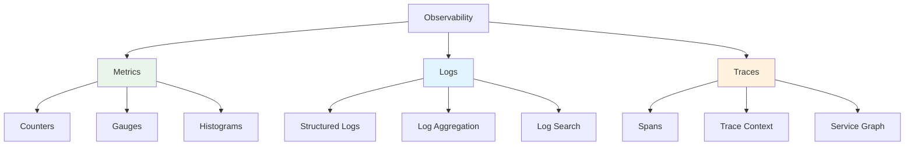

# System Design Fundamentals: Observability & Monitoring

Observability enables understanding system behavior through metrics, logs, and traces, essential for debugging and maintaining distributed systems.

## Three Pillars of Observability



## Metrics System Implementation

```go
// Metrics System Implementation
package main

import (
    "fmt"
    "sync"
    "sync/atomic"
    "time"
)

type MetricType int

const (
    Counter MetricType = iota
    Gauge
    Histogram
)

type Metric struct {
    Name      string
    Type      MetricType
    Value     int64
    Labels    map[string]string
    Timestamp time.Time
}

type MetricsCollector struct {
    counters   map[string]*int64
    gauges     map[string]*int64
    histograms map[string]*Histogram
    mutex      sync.RWMutex
}

func NewMetricsCollector() *MetricsCollector {
    return &MetricsCollector{
        counters:   make(map[string]*int64),
        gauges:     make(map[string]*int64),
        histograms: make(map[string]*Histogram),
    }
}

func (mc *MetricsCollector) IncrementCounter(name string, labels map[string]string) {
    key := mc.makeKey(name, labels)
    
    mc.mutex.Lock()
    if _, exists := mc.counters[key]; !exists {
        var val int64 = 0
        mc.counters[key] = &val
    }
    counter := mc.counters[key]
    mc.mutex.Unlock()
    
    atomic.AddInt64(counter, 1)
    
    fmt.Printf("📊 Counter incremented: %s = %d\n", key, atomic.LoadInt64(counter))
}

func (mc *MetricsCollector) AddCounter(name string, value int64, labels map[string]string) {
    key := mc.makeKey(name, labels)
    
    mc.mutex.Lock()
    if _, exists := mc.counters[key]; !exists {
        var val int64 = 0
        mc.counters[key] = &val
    }
    counter := mc.counters[key]
    mc.mutex.Unlock()
    
    atomic.AddInt64(counter, value)
}

func (mc *MetricsCollector) SetGauge(name string, value int64, labels map[string]string) {
    key := mc.makeKey(name, labels)
    
    mc.mutex.Lock()
    if _, exists := mc.gauges[key]; !exists {
        var val int64 = 0
        mc.gauges[key] = &val
    }
    gauge := mc.gauges[key]
    mc.mutex.Unlock()
    
    atomic.StoreInt64(gauge, value)
    
    fmt.Printf("📏 Gauge set: %s = %d\n", key, value)
}

func (mc *MetricsCollector) RecordHistogram(name string, value float64, labels map[string]string) {
    key := mc.makeKey(name, labels)
    
    mc.mutex.Lock()
    if _, exists := mc.histograms[key]; !exists {
        mc.histograms[key] = NewHistogram()
    }
    histogram := mc.histograms[key]
    mc.mutex.Unlock()
    
    histogram.Record(value)
    
    fmt.Printf("📈 Histogram recorded: %s = %.2f\n", key, value)
}

func (mc *MetricsCollector) makeKey(name string, labels map[string]string) string {
    key := name
    for k, v := range labels {
        key += fmt.Sprintf(",%s=%s", k, v)
    }
    return key
}

func (mc *MetricsCollector) GetAllMetrics() []Metric {
    mc.mutex.RLock()
    defer mc.mutex.RUnlock()
    
    metrics := make([]Metric, 0)
    now := time.Now()
    
    // Collect counters
    for key, counter := range mc.counters {
        metrics = append(metrics, Metric{
            Name:      key,
            Type:      Counter,
            Value:     atomic.LoadInt64(counter),
            Timestamp: now,
        })
    }
    
    // Collect gauges
    for key, gauge := range mc.gauges {
        metrics = append(metrics, Metric{
            Name:      key,
            Type:      Gauge,
            Value:     atomic.LoadInt64(gauge),
            Timestamp: now,
        })
    }
    
    return metrics
}

func (mc *MetricsCollector) PrintMetrics() {
    metrics := mc.GetAllMetrics()
    
    fmt.Println("\n📊 Current Metrics:")
    for _, metric := range metrics {
        typeStr := "COUNTER"
        if metric.Type == Gauge {
            typeStr = "GAUGE"
        }
        fmt.Printf("  [%s] %s = %d\n", typeStr, metric.Name, metric.Value)
    }
    
    mc.mutex.RLock()
    for key, hist := range mc.histograms {
        stats := hist.GetStats()
        fmt.Printf("  [HISTOGRAM] %s:\n", key)
        fmt.Printf("    Count: %d\n", stats["count"])
        fmt.Printf("    Min: %.2f\n", stats["min"])
        fmt.Printf("    Max: %.2f\n", stats["max"])
        fmt.Printf("    Mean: %.2f\n", stats["mean"])
        fmt.Printf("    P50: %.2f\n", stats["p50"])
        fmt.Printf("    P95: %.2f\n", stats["p95"])
        fmt.Printf("    P99: %.2f\n", stats["p99"])
    }
    mc.mutex.RUnlock()
    
    fmt.Println()
}
```

## Histogram Implementation

```go
// Histogram for latency tracking
package main

import (
    "math"
    "sort"
    "sync"
)

type Histogram struct {
    values []float64
    mutex  sync.RWMutex
}

func NewHistogram() *Histogram {
    return &Histogram{
        values: make([]float64, 0),
    }
}

func (h *Histogram) Record(value float64) {
    h.mutex.Lock()
    defer h.mutex.Unlock()
    
    h.values = append(h.values, value)
}

func (h *Histogram) GetStats() map[string]float64 {
    h.mutex.RLock()
    defer h.mutex.RUnlock()
    
    if len(h.values) == 0 {
        return map[string]float64{
            "count": 0,
            "min":   0,
            "max":   0,
            "mean":  0,
            "p50":   0,
            "p95":   0,
            "p99":   0,
        }
    }
    
    // Sort values
    sorted := make([]float64, len(h.values))
    copy(sorted, h.values)
    sort.Float64s(sorted)
    
    // Calculate statistics
    count := float64(len(sorted))
    min := sorted[0]
    max := sorted[len(sorted)-1]
    
    // Mean
    sum := 0.0
    for _, v := range sorted {
        sum += v
    }
    mean := sum / count
    
    // Percentiles
    p50 := percentile(sorted, 50)
    p95 := percentile(sorted, 95)
    p99 := percentile(sorted, 99)
    
    return map[string]float64{
        "count": count,
        "min":   min,
        "max":   max,
        "mean":  mean,
        "p50":   p50,
        "p95":   p95,
        "p99":   p99,
    }
}

func percentile(sorted []float64, p float64) float64 {
    if len(sorted) == 0 {
        return 0
    }
    
    index := (p / 100.0) * float64(len(sorted)-1)
    lower := int(math.Floor(index))
    upper := int(math.Ceil(index))
    
    if lower == upper {
        return sorted[lower]
    }
    
    // Linear interpolation
    weight := index - float64(lower)
    return sorted[lower]*(1-weight) + sorted[upper]*weight
}
```

## Structured Logging System

```go
// Structured Logging System
package main

import (
    "encoding/json"
    "fmt"
    "os"
    "sync"
    "time"
)

type LogLevel int

const (
    DEBUG LogLevel = iota
    INFO
    WARN
    ERROR
    FATAL
)

func (l LogLevel) String() string {
    switch l {
    case DEBUG:
        return "DEBUG"
    case INFO:
        return "INFO"
    case WARN:
        return "WARN"
    case ERROR:
        return "ERROR"
    case FATAL:
        return "FATAL"
    default:
        return "UNKNOWN"
    }
}

type LogEntry struct {
    Timestamp time.Time              `json:"timestamp"`
    Level     string                 `json:"level"`
    Message   string                 `json:"message"`
    Fields    map[string]interface{} `json:"fields,omitempty"`
    TraceID   string                 `json:"trace_id,omitempty"`
    SpanID    string                 `json:"span_id,omitempty"`
}

type StructuredLogger struct {
    level      LogLevel
    output     *os.File
    buffer     []LogEntry
    bufferSize int
    mutex      sync.Mutex
}

func NewStructuredLogger(level LogLevel, bufferSize int) *StructuredLogger {
    return &StructuredLogger{
        level:      level,
        output:     os.Stdout,
        buffer:     make([]LogEntry, 0, bufferSize),
        bufferSize: bufferSize,
    }
}

func (sl *StructuredLogger) Log(level LogLevel, message string, fields map[string]interface{}) {
    if level < sl.level {
        return
    }
    
    entry := LogEntry{
        Timestamp: time.Now(),
        Level:     level.String(),
        Message:   message,
        Fields:    fields,
    }
    
    sl.mutex.Lock()
    defer sl.mutex.Unlock()
    
    sl.buffer = append(sl.buffer, entry)
    
    // Flush if buffer is full
    if len(sl.buffer) >= sl.bufferSize {
        sl.flush()
    }
    
    // Always flush ERROR and FATAL
    if level >= ERROR {
        sl.flush()
    }
}

func (sl *StructuredLogger) Debug(message string, fields map[string]interface{}) {
    sl.Log(DEBUG, message, fields)
}

func (sl *StructuredLogger) Info(message string, fields map[string]interface{}) {
    sl.Log(INFO, message, fields)
}

func (sl *StructuredLogger) Warn(message string, fields map[string]interface{}) {
    sl.Log(WARN, message, fields)
}

func (sl *StructuredLogger) Error(message string, fields map[string]interface{}) {
    sl.Log(ERROR, message, fields)
}

func (sl *StructuredLogger) Fatal(message string, fields map[string]interface{}) {
    sl.Log(FATAL, message, fields)
    os.Exit(1)
}

func (sl *StructuredLogger) flush() {
    encoder := json.NewEncoder(sl.output)
    
    for _, entry := range sl.buffer {
        encoder.Encode(entry)
    }
    
    sl.buffer = sl.buffer[:0]
}

func (sl *StructuredLogger) Flush() {
    sl.mutex.Lock()
    defer sl.mutex.Unlock()
    
    sl.flush()
}

func (sl *StructuredLogger) WithTraceContext(traceID, spanID string) *ContextualLogger {
    return &ContextualLogger{
        logger:  sl,
        traceID: traceID,
        spanID:  spanID,
    }
}

type ContextualLogger struct {
    logger  *StructuredLogger
    traceID string
    spanID  string
}

func (cl *ContextualLogger) Log(level LogLevel, message string, fields map[string]interface{}) {
    if fields == nil {
        fields = make(map[string]interface{})
    }
    
    if cl.traceID != "" {
        fields["trace_id"] = cl.traceID
    }
    
    if cl.spanID != "" {
        fields["span_id"] = cl.spanID
    }
    
    cl.logger.Log(level, message, fields)
}

func (cl *ContextualLogger) Info(message string, fields map[string]interface{}) {
    cl.Log(INFO, message, fields)
}

func (cl *ContextualLogger) Error(message string, fields map[string]interface{}) {
    cl.Log(ERROR, message, fields)
}
```

## Distributed Tracing

```go
// Distributed Tracing Implementation
package main

import (
    "context"
    "crypto/rand"
    "encoding/hex"
    "fmt"
    "sync"
    "time"
)

type Span struct {
    TraceID      string
    SpanID       string
    ParentSpanID string
    OperationName string
    StartTime    time.Time
    EndTime      time.Time
    Duration     time.Duration
    Tags         map[string]string
    Logs         []SpanLog
    Status       SpanStatus
}

type SpanLog struct {
    Timestamp time.Time
    Message   string
    Fields    map[string]interface{}
}

type SpanStatus int

const (
    SpanStatusOK SpanStatus = iota
    SpanStatusError
)

type Tracer struct {
    spans      map[string]*Span
    mutex      sync.RWMutex
    serviceName string
}

func NewTracer(serviceName string) *Tracer {
    return &Tracer{
        spans:       make(map[string]*Span),
        serviceName: serviceName,
    }
}

func (t *Tracer) StartSpan(operationName string) *Span {
    span := &Span{
        TraceID:       generateID(),
        SpanID:        generateID(),
        OperationName: operationName,
        StartTime:     time.Now(),
        Tags:          make(map[string]string),
        Logs:          make([]SpanLog, 0),
        Status:        SpanStatusOK,
    }
    
    span.Tags["service"] = t.serviceName
    
    t.mutex.Lock()
    t.spans[span.SpanID] = span
    t.mutex.Unlock()
    
    fmt.Printf("🔍 Started span: %s [trace=%s, span=%s]\n", 
        operationName, span.TraceID[:8], span.SpanID[:8])
    
    return span
}

func (t *Tracer) StartChildSpan(parent *Span, operationName string) *Span {
    span := &Span{
        TraceID:       parent.TraceID,
        SpanID:        generateID(),
        ParentSpanID:  parent.SpanID,
        OperationName: operationName,
        StartTime:     time.Now(),
        Tags:          make(map[string]string),
        Logs:          make([]SpanLog, 0),
        Status:        SpanStatusOK,
    }
    
    span.Tags["service"] = t.serviceName
    
    t.mutex.Lock()
    t.spans[span.SpanID] = span
    t.mutex.Unlock()
    
    fmt.Printf("  🔍 Started child span: %s [span=%s, parent=%s]\n",
        operationName, span.SpanID[:8], parent.SpanID[:8])
    
    return span
}

func (s *Span) SetTag(key, value string) {
    s.Tags[key] = value
}

func (s *Span) LogEvent(message string, fields map[string]interface{}) {
    s.Logs = append(s.Logs, SpanLog{
        Timestamp: time.Now(),
        Message:   message,
        Fields:    fields,
    })
    
    fmt.Printf("    📝 Span log: %s\n", message)
}

func (s *Span) SetError(err error) {
    s.Status = SpanStatusError
    s.Tags["error"] = "true"
    s.LogEvent("error", map[string]interface{}{
        "error.message": err.Error(),
    })
}

func (s *Span) Finish() {
    s.EndTime = time.Now()
    s.Duration = s.EndTime.Sub(s.StartTime)
    
    status := "OK"
    if s.Status == SpanStatusError {
        status = "ERROR"
    }
    
    fmt.Printf("  ✅ Finished span: %s [%v, status=%s]\n", 
        s.OperationName, s.Duration, status)
}

func (t *Tracer) GetTrace(traceID string) []*Span {
    t.mutex.RLock()
    defer t.mutex.RUnlock()
    
    spans := make([]*Span, 0)
    
    for _, span := range t.spans {
        if span.TraceID == traceID {
            spans = append(spans, span)
        }
    }
    
    return spans
}

func (t *Tracer) PrintTrace(traceID string) {
    spans := t.GetTrace(traceID)
    
    if len(spans) == 0 {
        fmt.Printf("No spans found for trace: %s\n", traceID)
        return
    }
    
    fmt.Printf("\n🔍 Trace: %s\n", traceID)
    fmt.Printf("  Service: %s\n", t.serviceName)
    fmt.Printf("  Total Spans: %d\n\n", len(spans))
    
    // Build span tree
    spanMap := make(map[string]*Span)
    rootSpans := make([]*Span, 0)
    
    for _, span := range spans {
        spanMap[span.SpanID] = span
        
        if span.ParentSpanID == "" {
            rootSpans = append(rootSpans, span)
        }
    }
    
    // Print tree
    for _, root := range rootSpans {
        t.printSpanTree(root, spanMap, 0)
    }
}

func (t *Tracer) printSpanTree(span *Span, spanMap map[string]*Span, depth int) {
    indent := ""
    for i := 0; i < depth; i++ {
        indent += "  "
    }
    
    status := "✅"
    if span.Status == SpanStatusError {
        status = "❌"
    }
    
    fmt.Printf("%s%s %s [%v]\n", indent, status, span.OperationName, span.Duration)
    
    // Print tags
    for key, value := range span.Tags {
        if key != "service" {
            fmt.Printf("%s  • %s: %s\n", indent, key, value)
        }
    }
    
    // Print children
    for _, s := range spanMap {
        if s.ParentSpanID == span.SpanID {
            t.printSpanTree(s, spanMap, depth+1)
        }
    }
}

func generateID() string {
    b := make([]byte, 16)
    rand.Read(b)
    return hex.EncodeToString(b)
}

// Context propagation
type traceContextKey struct{}

func ContextWithSpan(ctx context.Context, span *Span) context.Context {
    return context.WithValue(ctx, traceContextKey{}, span)
}

func SpanFromContext(ctx context.Context) (*Span, bool) {
    span, ok := ctx.Value(traceContextKey{}).(*Span)
    return span, ok
}
```

## Alerting System

```go
// Alerting System
package main

import (
    "fmt"
    "sync"
    "time"
)

type AlertSeverity int

const (
    SeverityInfo AlertSeverity = iota
    SeverityWarning
    SeverityCritical
)

func (s AlertSeverity) String() string {
    switch s {
    case SeverityInfo:
        return "INFO"
    case SeverityWarning:
        return "WARNING"
    case SeverityCritical:
        return "CRITICAL"
    default:
        return "UNKNOWN"
    }
}

type Alert struct {
    ID          string
    Name        string
    Severity    AlertSeverity
    Message     string
    Labels      map[string]string
    Timestamp   time.Time
    Resolved    bool
    ResolvedAt  time.Time
}

type AlertRule struct {
    Name      string
    Condition func() bool
    Severity  AlertSeverity
    Message   string
    Cooldown  time.Duration
    lastFired time.Time
}

type AlertManager struct {
    rules       []AlertRule
    activeAlerts map[string]*Alert
    handlers    []AlertHandler
    mutex       sync.RWMutex
}

type AlertHandler interface {
    HandleAlert(alert *Alert)
}

func NewAlertManager() *AlertManager {
    am := &AlertManager{
        rules:        make([]AlertRule, 0),
        activeAlerts: make(map[string]*Alert),
        handlers:     make([]AlertHandler, 0),
    }
    
    go am.evaluateLoop()
    
    return am
}

func (am *AlertManager) AddRule(rule AlertRule) {
    am.mutex.Lock()
    defer am.mutex.Unlock()
    
    am.rules = append(am.rules, rule)
    
    fmt.Printf("📋 Registered alert rule: %s [%s]\n", rule.Name, rule.Severity)
}

func (am *AlertManager) AddHandler(handler AlertHandler) {
    am.mutex.Lock()
    defer am.mutex.Unlock()
    
    am.handlers = append(am.handlers, handler)
}

func (am *AlertManager) evaluateLoop() {
    ticker := time.NewTicker(10 * time.Second)
    defer ticker.Stop()
    
    for range ticker.C {
        am.evaluateRules()
    }
}

func (am *AlertManager) evaluateRules() {
    am.mutex.Lock()
    defer am.mutex.Unlock()
    
    for i := range am.rules {
        rule := &am.rules[i]
        
        // Check cooldown
        if time.Since(rule.lastFired) < rule.Cooldown {
            continue
        }
        
        // Evaluate condition
        if rule.Condition() {
            rule.lastFired = time.Now()
            am.fireAlert(rule)
        }
    }
}

func (am *AlertManager) fireAlert(rule *AlertRule) {
    alert := &Alert{
        ID:        generateID(),
        Name:      rule.Name,
        Severity:  rule.Severity,
        Message:   rule.Message,
        Labels:    make(map[string]string),
        Timestamp: time.Now(),
        Resolved:  false,
    }
    
    am.activeAlerts[alert.ID] = alert
    
    icon := "ℹ️"
    if rule.Severity == SeverityWarning {
        icon = "⚠️"
    } else if rule.Severity == SeverityCritical {
        icon = "🚨"
    }
    
    fmt.Printf("\n%s ALERT: %s [%s]\n", icon, rule.Name, rule.Severity)
    fmt.Printf("  Message: %s\n", rule.Message)
    fmt.Printf("  Time: %s\n\n", alert.Timestamp.Format(time.RFC3339))
    
    // Notify handlers
    for _, handler := range am.handlers {
        go handler.HandleAlert(alert)
    }
}

func (am *AlertManager) ResolveAlert(alertID string) {
    am.mutex.Lock()
    defer am.mutex.Unlock()
    
    if alert, exists := am.activeAlerts[alertID]; exists {
        alert.Resolved = true
        alert.ResolvedAt = time.Now()
        
        fmt.Printf("✅ Alert resolved: %s (duration: %v)\n", 
            alert.Name, alert.ResolvedAt.Sub(alert.Timestamp))
    }
}

func (am *AlertManager) GetActiveAlerts() []*Alert {
    am.mutex.RLock()
    defer am.mutex.RUnlock()
    
    alerts := make([]*Alert, 0)
    
    for _, alert := range am.activeAlerts {
        if !alert.Resolved {
            alerts = append(alerts, alert)
        }
    }
    
    return alerts
}

// Console Alert Handler
type ConsoleAlertHandler struct{}

func (cah *ConsoleAlertHandler) HandleAlert(alert *Alert) {
    fmt.Printf("📧 Console Handler: Alert %s sent\n", alert.Name)
}
```

## Complete Demo

```go
func main() {
    fmt.Println("🚀 Starting Observability Demo\n")
    
    // 1. Metrics Collection
    fmt.Println("=== Metrics Collection ===")
    metrics := NewMetricsCollector()
    
    // Simulate application metrics
    for i := 0; i < 10; i++ {
        metrics.IncrementCounter("http_requests_total", map[string]string{
            "method": "GET",
            "path":   "/api/users",
            "status": "200",
        })
        
        metrics.SetGauge("active_connections", int64(42+i), nil)
        
        latency := 10.0 + float64(i)*5.0
        metrics.RecordHistogram("request_duration_ms", latency, map[string]string{
            "endpoint": "/api/users",
        })
        
        time.Sleep(100 * time.Millisecond)
    }
    
    metrics.PrintMetrics()
    
    // 2. Structured Logging
    fmt.Println("=== Structured Logging ===")
    logger := NewStructuredLogger(INFO, 5)
    
    logger.Info("Application started", map[string]interface{}{
        "version": "1.0.0",
        "port":    8080,
    })
    
    logger.Info("User login", map[string]interface{}{
        "user_id":  "user123",
        "ip":       "192.168.1.1",
        "success":  true,
    })
    
    logger.Warn("High memory usage", map[string]interface{}{
        "memory_mb": 1024,
        "threshold": 800,
    })
    
    logger.Error("Database connection failed", map[string]interface{}{
        "error":    "connection timeout",
        "host":     "db.example.com",
        "attempts": 3,
    })
    
    logger.Flush()
    
    // 3. Distributed Tracing
    fmt.Println("\n=== Distributed Tracing ===")
    tracer := NewTracer("user-service")
    
    // Simulate a request flow
    rootSpan := tracer.StartSpan("handle_user_request")
    rootSpan.SetTag("http.method", "GET")
    rootSpan.SetTag("http.url", "/api/users/123")
    
    time.Sleep(50 * time.Millisecond)
    
    // Database query span
    dbSpan := tracer.StartChildSpan(rootSpan, "database_query")
    dbSpan.SetTag("db.type", "postgresql")
    dbSpan.SetTag("db.statement", "SELECT * FROM users WHERE id = $1")
    dbSpan.LogEvent("query_executed", map[string]interface{}{
        "rows_returned": 1,
    })
    time.Sleep(30 * time.Millisecond)
    dbSpan.Finish()
    
    // Cache check span
    cacheSpan := tracer.StartChildSpan(rootSpan, "cache_lookup")
    cacheSpan.SetTag("cache.key", "user:123")
    cacheSpan.LogEvent("cache_hit", nil)
    time.Sleep(5 * time.Millisecond)
    cacheSpan.Finish()
    
    // External API call span
    apiSpan := tracer.StartChildSpan(rootSpan, "external_api_call")
    apiSpan.SetTag("http.url", "https://api.example.com/user/profile")
    time.Sleep(100 * time.Millisecond)
    apiSpan.Finish()
    
    rootSpan.Finish()
    
    // Print trace
    tracer.PrintTrace(rootSpan.TraceID)
    
    // 4. Alerting
    fmt.Println("\n=== Alerting System ===")
    alertManager := NewAlertManager()
    alertManager.AddHandler(&ConsoleAlertHandler{})
    
    // Add alert rules
    errorCount := int64(0)
    
    alertManager.AddRule(AlertRule{
        Name: "HighErrorRate",
        Condition: func() bool {
            return atomic.LoadInt64(&errorCount) > 5
        },
        Severity: SeverityCritical,
        Message:  "Error rate exceeded threshold",
        Cooldown: 30 * time.Second,
    })
    
    alertManager.AddRule(AlertRule{
        Name: "HighLatency",
        Condition: func() bool {
            // Simulate latency check
            return false
        },
        Severity: SeverityWarning,
        Message:  "Average latency above 500ms",
        Cooldown: 1 * time.Minute,
    })
    
    // Simulate errors
    for i := 0; i < 10; i++ {
        atomic.AddInt64(&errorCount, 1)
        time.Sleep(500 * time.Millisecond)
    }
    
    time.Sleep(2 * time.Second)
    
    // Check active alerts
    activeAlerts := alertManager.GetActiveAlerts()
    fmt.Printf("\n📊 Active Alerts: %d\n", len(activeAlerts))
    for _, alert := range activeAlerts {
        fmt.Printf("  - %s [%s]: %s\n", alert.Name, alert.Severity, alert.Message)
    }
    
    // 5. Contextual Logging with Trace
    fmt.Println("\n=== Contextual Logging ===")
    span := tracer.StartSpan("process_payment")
    contextLogger := logger.WithTraceContext(span.TraceID, span.SpanID)
    
    contextLogger.Info("Payment processing started", map[string]interface{}{
        "amount":   99.99,
        "currency": "USD",
    })
    
    contextLogger.Info("Payment validated", map[string]interface{}{
        "validation_time_ms": 45,
    })
    
    span.Finish()
    logger.Flush()
    
    fmt.Println("\n✅ Demo completed!")
}
```

## Observability Best Practices

### 1. Structured Logging
```go
// Always use structured logging with fields
logger.Info("User action", map[string]interface{}{
    "user_id": "123",
    "action":  "login",
    "ip":      "192.168.1.1",
})
```

### 2. Metrics Naming
```go
// Use consistent naming conventions
// Format: <namespace>_<subsystem>_<metric>_<unit>
metrics.IncrementCounter("http_server_requests_total", labels)
metrics.RecordHistogram("http_server_request_duration_seconds", duration, labels)
```

### 3. Distributed Tracing
```go
// Propagate trace context across services
func handleRequest(w http.ResponseWriter, r *http.Request) {
    span := tracer.StartSpan("handle_request")
    defer span.Finish()
    
    ctx := ContextWithSpan(r.Context(), span)
    
    // Pass context to downstream calls
    result := callDownstream(ctx)
}
```

### 4. Alert Fatigue Prevention
```go
// Use cooldowns and thresholds
alertManager.AddRule(AlertRule{
    Name:     "HighErrorRate",
    Condition: func() bool {
        return errorRate > 0.05 // 5% threshold
    },
    Cooldown: 15 * time.Minute, // Don't spam
})
```

## Conclusion

Observability enables:
- **Metrics**: Real-time system health monitoring
- **Logs**: Detailed event tracking and debugging
- **Traces**: Request flow visualization across services
- **Alerts**: Proactive issue detection

Essential for maintaining production systems at scale. Implement all three pillars for complete observability.