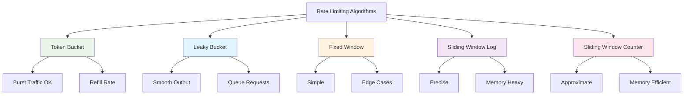

# System Design Fundamentals: Rate Limiting & Throttling

Rate limiting controls the rate at which users can make requests to prevent abuse, ensure fair resource allocation, and maintain system stability under load.

## Rate Limiting Algorithms Overview



## Token Bucket Algorithm

```go
// Token Bucket Rate Limiter
package main

import (
    "fmt"
    "sync"
    "time"
)

type TokenBucket struct {
    capacity     int           // Maximum tokens
    tokens       float64       // Current tokens
    refillRate   float64       // Tokens per second
    lastRefill   time.Time     // Last refill timestamp
    mutex        sync.Mutex
}

func NewTokenBucket(capacity int, refillRate float64) *TokenBucket {
    return &TokenBucket{
        capacity:   capacity,
        tokens:     float64(capacity),
        refillRate: refillRate,
        lastRefill: time.Now(),
    }
}

func (tb *TokenBucket) Allow(tokensNeeded int) bool {
    tb.mutex.Lock()
    defer tb.mutex.Unlock()
    
    // Refill tokens based on elapsed time
    tb.refill()
    
    if tb.tokens >= float64(tokensNeeded) {
        tb.tokens -= float64(tokensNeeded)
        return true
    }
    
    return false
}

func (tb *TokenBucket) refill() {
    now := time.Now()
    elapsed := now.Sub(tb.lastRefill).Seconds()
    
    // Calculate tokens to add
    tokensToAdd := elapsed * tb.refillRate
    tb.tokens = min(tb.tokens+tokensToAdd, float64(tb.capacity))
    
    tb.lastRefill = now
}

func (tb *TokenBucket) AvailableTokens() int {
    tb.mutex.Lock()
    defer tb.mutex.Unlock()
    
    tb.refill()
    return int(tb.tokens)
}

func (tb *TokenBucket) WaitForToken(tokensNeeded int) time.Duration {
    tb.mutex.Lock()
    defer tb.mutex.Unlock()
    
    tb.refill()
    
    if tb.tokens >= float64(tokensNeeded) {
        return 0
    }
    
    deficit := float64(tokensNeeded) - tb.tokens
    waitTime := time.Duration(deficit/tb.refillRate) * time.Second
    
    return waitTime
}

func min(a, b float64) float64 {
    if a < b {
        return a
    }
    return b
}

// Distributed Token Bucket for multiple clients
type DistributedTokenBucket struct {
    buckets map[string]*TokenBucket
    mutex   sync.RWMutex
    config  TokenBucketConfig
}

type TokenBucketConfig struct {
    Capacity   int
    RefillRate float64
}

func NewDistributedTokenBucket(config TokenBucketConfig) *DistributedTokenBucket {
    dtb := &DistributedTokenBucket{
        buckets: make(map[string]*TokenBucket),
        config:  config,
    }
    
    // Start cleanup goroutine
    go dtb.cleanup()
    
    return dtb
}

func (dtb *DistributedTokenBucket) Allow(clientID string, tokensNeeded int) bool {
    bucket := dtb.getBucket(clientID)
    allowed := bucket.Allow(tokensNeeded)
    
    if !allowed {
        fmt.Printf("⛔ Rate limit exceeded for client: %s\n", clientID)
    }
    
    return allowed
}

func (dtb *DistributedTokenBucket) getBucket(clientID string) *TokenBucket {
    dtb.mutex.RLock()
    bucket, exists := dtb.buckets[clientID]
    dtb.mutex.RUnlock()
    
    if exists {
        return bucket
    }
    
    // Create new bucket
    dtb.mutex.Lock()
    defer dtb.mutex.Unlock()
    
    // Double-check after acquiring write lock
    if bucket, exists := dtb.buckets[clientID]; exists {
        return bucket
    }
    
    bucket = NewTokenBucket(dtb.config.Capacity, dtb.config.RefillRate)
    dtb.buckets[clientID] = bucket
    
    return bucket
}

func (dtb *DistributedTokenBucket) cleanup() {
    ticker := time.NewTicker(5 * time.Minute)
    defer ticker.Stop()
    
    for range ticker.C {
        dtb.mutex.Lock()
        
        for clientID, bucket := range dtb.buckets {
            // Remove inactive buckets (no activity for 10 minutes)
            if time.Since(bucket.lastRefill) > 10*time.Minute {
                delete(dtb.buckets, clientID)
            }
        }
        
        dtb.mutex.Unlock()
    }
}
```

## Leaky Bucket Algorithm

```go
// Leaky Bucket Rate Limiter
package main

import (
    "context"
    "fmt"
    "sync"
    "time"
)

type LeakyBucket struct {
    capacity   int
    queue      chan Request
    leakRate   time.Duration
    processing bool
    mutex      sync.Mutex
    ctx        context.Context
    cancel     context.CancelFunc
}

type Request struct {
    ID        string
    Data      interface{}
    Timestamp time.Time
    Response  chan bool
}

func NewLeakyBucket(capacity int, leakRate time.Duration) *LeakyBucket {
    ctx, cancel := context.WithCancel(context.Background())
    
    lb := &LeakyBucket{
        capacity:   capacity,
        queue:      make(chan Request, capacity),
        leakRate:   leakRate,
        processing: false,
        ctx:        ctx,
        cancel:     cancel,
    }
    
    go lb.leak()
    
    return lb
}

func (lb *LeakyBucket) Allow(req Request) bool {
    select {
    case lb.queue <- req:
        fmt.Printf("✅ Request %s queued (queue size: %d/%d)\n", 
            req.ID, len(lb.queue), lb.capacity)
        return true
    default:
        fmt.Printf("⛔ Request %s rejected - bucket full\n", req.ID)
        return false
    }
}

func (lb *LeakyBucket) leak() {
    ticker := time.NewTicker(lb.leakRate)
    defer ticker.Stop()
    
    for {
        select {
        case <-lb.ctx.Done():
            return
        case <-ticker.C:
            select {
            case req := <-lb.queue:
                // Process request
                go lb.processRequest(req)
            default:
                // Queue empty, nothing to leak
            }
        }
    }
}

func (lb *LeakyBucket) processRequest(req Request) {
    fmt.Printf("🔄 Processing request: %s\n", req.ID)
    
    // Simulate processing
    time.Sleep(10 * time.Millisecond)
    
    if req.Response != nil {
        req.Response <- true
    }
}

func (lb *LeakyBucket) Stop() {
    lb.cancel()
    close(lb.queue)
}

func (lb *LeakyBucket) QueueSize() int {
    return len(lb.queue)
}
```

## Fixed Window Counter

```go
// Fixed Window Counter Rate Limiter
package main

import (
    "fmt"
    "sync"
    "time"
)

type FixedWindowCounter struct {
    limit       int
    window      time.Duration
    counters    map[string]*WindowCounter
    mutex       sync.RWMutex
}

type WindowCounter struct {
    count      int
    windowStart time.Time
}

func NewFixedWindowCounter(limit int, window time.Duration) *FixedWindowCounter {
    fwc := &FixedWindowCounter{
        limit:    limit,
        window:   window,
        counters: make(map[string]*WindowCounter),
    }
    
    go fwc.cleanup()
    
    return fwc
}

func (fwc *FixedWindowCounter) Allow(clientID string) bool {
    fwc.mutex.Lock()
    defer fwc.mutex.Unlock()
    
    now := time.Now()
    counter, exists := fwc.counters[clientID]
    
    if !exists || now.Sub(counter.windowStart) >= fwc.window {
        // New window
        fwc.counters[clientID] = &WindowCounter{
            count:       1,
            windowStart: now,
        }
        return true
    }
    
    if counter.count < fwc.limit {
        counter.count++
        return true
    }
    
    // Calculate reset time
    resetTime := counter.windowStart.Add(fwc.window)
    fmt.Printf("⛔ Rate limit exceeded for %s. Resets at: %v\n", 
        clientID, resetTime.Format(time.RFC3339))
    
    return false
}

func (fwc *FixedWindowCounter) GetRemaining(clientID string) (int, time.Time) {
    fwc.mutex.RLock()
    defer fwc.mutex.RUnlock()
    
    counter, exists := fwc.counters[clientID]
    if !exists {
        return fwc.limit, time.Now()
    }
    
    now := time.Now()
    if now.Sub(counter.windowStart) >= fwc.window {
        return fwc.limit, now
    }
    
    remaining := fwc.limit - counter.count
    resetTime := counter.windowStart.Add(fwc.window)
    
    return remaining, resetTime
}

func (fwc *FixedWindowCounter) cleanup() {
    ticker := time.NewTicker(fwc.window)
    defer ticker.Stop()
    
    for range ticker.C {
        fwc.mutex.Lock()
        
        now := time.Now()
        for clientID, counter := range fwc.counters {
            if now.Sub(counter.windowStart) >= fwc.window*2 {
                delete(fwc.counters, clientID)
            }
        }
        
        fwc.mutex.Unlock()
    }
}
```

## Sliding Window Log

```go
// Sliding Window Log Rate Limiter
package main

import (
    "fmt"
    "sync"
    "time"
)

type SlidingWindowLog struct {
    limit    int
    window   time.Duration
    logs     map[string][]time.Time
    mutex    sync.RWMutex
}

func NewSlidingWindowLog(limit int, window time.Duration) *SlidingWindowLog {
    swl := &SlidingWindowLog{
        limit:  limit,
        window: window,
        logs:   make(map[string][]time.Time),
    }
    
    go swl.cleanup()
    
    return swl
}

func (swl *SlidingWindowLog) Allow(clientID string) bool {
    swl.mutex.Lock()
    defer swl.mutex.Unlock()
    
    now := time.Now()
    cutoff := now.Add(-swl.window)
    
    // Get client's request log
    log := swl.logs[clientID]
    
    // Remove expired entries
    validLog := make([]time.Time, 0)
    for _, timestamp := range log {
        if timestamp.After(cutoff) {
            validLog = append(validLog, timestamp)
        }
    }
    
    // Check if limit exceeded
    if len(validLog) >= swl.limit {
        swl.logs[clientID] = validLog
        fmt.Printf("⛔ Rate limit exceeded for %s (%d/%d requests)\n", 
            clientID, len(validLog), swl.limit)
        return false
    }
    
    // Add current request
    validLog = append(validLog, now)
    swl.logs[clientID] = validLog
    
    fmt.Printf("✅ Request allowed for %s (%d/%d requests)\n", 
        clientID, len(validLog), swl.limit)
    
    return true
}

func (swl *SlidingWindowLog) GetRequestCount(clientID string) int {
    swl.mutex.RLock()
    defer swl.mutex.RUnlock()
    
    now := time.Now()
    cutoff := now.Add(-swl.window)
    
    log := swl.logs[clientID]
    count := 0
    
    for _, timestamp := range log {
        if timestamp.After(cutoff) {
            count++
        }
    }
    
    return count
}

func (swl *SlidingWindowLog) cleanup() {
    ticker := time.NewTicker(swl.window)
    defer ticker.Stop()
    
    for range ticker.C {
        swl.mutex.Lock()
        
        now := time.Now()
        cutoff := now.Add(-swl.window * 2)
        
        for clientID, log := range swl.logs {
            // Remove old entries
            validLog := make([]time.Time, 0)
            for _, timestamp := range log {
                if timestamp.After(cutoff) {
                    validLog = append(validLog, timestamp)
                }
            }
            
            if len(validLog) == 0 {
                delete(swl.logs, clientID)
            } else {
                swl.logs[clientID] = validLog
            }
        }
        
        swl.mutex.Unlock()
    }
}
```

## Sliding Window Counter

```go
// Sliding Window Counter (Hybrid Approach)
package main

import (
    "fmt"
    "sync"
    "time"
)

type SlidingWindowCounter struct {
    limit    int
    window   time.Duration
    windows  map[string]*WindowData
    mutex    sync.RWMutex
}

type WindowData struct {
    currentCount  int
    previousCount int
    currentStart  time.Time
}

func NewSlidingWindowCounter(limit int, window time.Duration) *SlidingWindowCounter {
    swc := &SlidingWindowCounter{
        limit:   limit,
        window:  window,
        windows: make(map[string]*WindowData),
    }
    
    go swc.cleanup()
    
    return swc
}

func (swc *SlidingWindowCounter) Allow(clientID string) bool {
    swc.mutex.Lock()
    defer swc.mutex.Unlock()
    
    now := time.Now()
    data, exists := swc.windows[clientID]
    
    if !exists {
        swc.windows[clientID] = &WindowData{
            currentCount:  1,
            previousCount: 0,
            currentStart:  now,
        }
        return true
    }
    
    elapsed := now.Sub(data.currentStart)
    
    // If we're in a new window
    if elapsed >= swc.window {
        windowsPassed := int(elapsed / swc.window)
        
        if windowsPassed > 1 {
            // Multiple windows passed, reset
            data.previousCount = 0
        } else {
            // Exactly one window passed
            data.previousCount = data.currentCount
        }
        
        data.currentCount = 1
        data.currentStart = now
        return true
    }
    
    // Calculate weighted count using sliding window
    progress := float64(elapsed) / float64(swc.window)
    previousWeight := 1 - progress
    estimatedCount := float64(data.previousCount)*previousWeight + float64(data.currentCount)
    
    if estimatedCount >= float64(swc.limit) {
        fmt.Printf("⛔ Rate limit exceeded for %s (estimated: %.2f/%d)\n", 
            clientID, estimatedCount, swc.limit)
        return false
    }
    
    data.currentCount++
    
    fmt.Printf("✅ Request allowed for %s (estimated: %.2f/%d)\n", 
        clientID, estimatedCount+1, swc.limit)
    
    return true
}

func (swc *SlidingWindowCounter) cleanup() {
    ticker := time.NewTicker(swc.window)
    defer ticker.Stop()
    
    for range ticker.C {
        swc.mutex.Lock()
        
        now := time.Now()
        for clientID, data := range swc.windows {
            if now.Sub(data.currentStart) >= swc.window*2 {
                delete(swc.windows, clientID)
            }
        }
        
        swc.mutex.Unlock()
    }
}
```

## Redis-Based Distributed Rate Limiter

```go
// Redis-Based Distributed Rate Limiter (Simulated)
package main

import (
    "fmt"
    "sync"
    "time"
)

// Simulated Redis client
type RedisClient struct {
    data  map[string]interface{}
    mutex sync.RWMutex
}

func NewRedisClient() *RedisClient {
    return &RedisClient{
        data: make(map[string]interface{}),
    }
}

func (rc *RedisClient) Incr(key string) int64 {
    rc.mutex.Lock()
    defer rc.mutex.Unlock()
    
    val, exists := rc.data[key]
    if !exists {
        rc.data[key] = int64(1)
        return 1
    }
    
    count := val.(int64) + 1
    rc.data[key] = count
    return count
}

func (rc *RedisClient) Expire(key string, expiration time.Duration) {
    time.AfterFunc(expiration, func() {
        rc.mutex.Lock()
        delete(rc.data, key)
        rc.mutex.Unlock()
    })
}

func (rc *RedisClient) Get(key string) (int64, bool) {
    rc.mutex.RLock()
    defer rc.mutex.RUnlock()
    
    val, exists := rc.data[key]
    if !exists {
        return 0, false
    }
    
    return val.(int64), true
}

// Distributed Rate Limiter using Redis
type RedisRateLimiter struct {
    redis  *RedisClient
    limit  int64
    window time.Duration
}

func NewRedisRateLimiter(redis *RedisClient, limit int64, window time.Duration) *RedisRateLimiter {
    return &RedisRateLimiter{
        redis:  redis,
        limit:  limit,
        window: window,
    }
}

func (rrl *RedisRateLimiter) Allow(clientID string) bool {
    // Generate key with current window
    currentWindow := time.Now().Unix() / int64(rrl.window.Seconds())
    key := fmt.Sprintf("rate_limit:%s:%d", clientID, currentWindow)
    
    // Increment counter
    count := rrl.redis.Incr(key)
    
    // Set expiration on first request in window
    if count == 1 {
        rrl.redis.Expire(key, rrl.window*2)
    }
    
    if count > rrl.limit {
        fmt.Printf("⛔ Rate limit exceeded for %s (count: %d/%d)\n", 
            clientID, count, rrl.limit)
        return false
    }
    
    fmt.Printf("✅ Request allowed for %s (count: %d/%d)\n", 
        clientID, count, rrl.limit)
    
    return true
}

func (rrl *RedisRateLimiter) GetRemaining(clientID string) int64 {
    currentWindow := time.Now().Unix() / int64(rrl.window.Seconds())
    key := fmt.Sprintf("rate_limit:%s:%d", clientID, currentWindow)
    
    count, exists := rrl.redis.Get(key)
    if !exists {
        return rrl.limit
    }
    
    remaining := rrl.limit - count
    if remaining < 0 {
        return 0
    }
    
    return remaining
}
```

## Adaptive Rate Limiting

```go
// Adaptive Rate Limiter (adjusts based on system load)
package main

import (
    "fmt"
    "runtime"
    "sync"
    "time"
)

type AdaptiveRateLimiter struct {
    baseLimit      int
    currentLimit   int
    minLimit       int
    maxLimit       int
    window         time.Duration
    counters       map[string]int
    mutex          sync.RWMutex
    adjustInterval time.Duration
    cpuThreshold   float64
}

func NewAdaptiveRateLimiter(baseLimit, minLimit, maxLimit int, window time.Duration) *AdaptiveRateLimiter {
    arl := &AdaptiveRateLimiter{
        baseLimit:      baseLimit,
        currentLimit:   baseLimit,
        minLimit:       minLimit,
        maxLimit:       maxLimit,
        window:         window,
        counters:       make(map[string]int),
        adjustInterval: 10 * time.Second,
        cpuThreshold:   0.8, // 80% CPU
    }
    
    go arl.adjustLimits()
    go arl.resetCounters()
    
    return arl
}

func (arl *AdaptiveRateLimiter) Allow(clientID string) bool {
    arl.mutex.Lock()
    defer arl.mutex.Unlock()
    
    count := arl.counters[clientID]
    
    if count >= arl.currentLimit {
        fmt.Printf("⛔ Adaptive rate limit exceeded for %s (%d/%d)\n", 
            clientID, count, arl.currentLimit)
        return false
    }
    
    arl.counters[clientID] = count + 1
    return true
}

func (arl *AdaptiveRateLimiter) adjustLimits() {
    ticker := time.NewTicker(arl.adjustInterval)
    defer ticker.Stop()
    
    for range ticker.C {
        cpuUsage := arl.getCPUUsage()
        
        arl.mutex.Lock()
        
        if cpuUsage > arl.cpuThreshold {
            // High load: reduce limit
            newLimit := int(float64(arl.currentLimit) * 0.8)
            if newLimit < arl.minLimit {
                newLimit = arl.minLimit
            }
            arl.currentLimit = newLimit
            fmt.Printf("🔻 Reduced rate limit to %d (CPU: %.2f%%)\n", 
                newLimit, cpuUsage*100)
        } else {
            // Normal load: increase limit back towards base
            if arl.currentLimit < arl.baseLimit {
                newLimit := int(float64(arl.currentLimit) * 1.2)
                if newLimit > arl.maxLimit {
                    newLimit = arl.maxLimit
                }
                arl.currentLimit = newLimit
                fmt.Printf("🔺 Increased rate limit to %d (CPU: %.2f%%)\n", 
                    newLimit, cpuUsage*100)
            }
        }
        
        arl.mutex.Unlock()
    }
}

func (arl *AdaptiveRateLimiter) getCPUUsage() float64 {
    // Simplified CPU usage calculation
    var m runtime.MemStats
    runtime.ReadMemStats(&m)
    
    // Use goroutine count as a proxy for load
    numGoroutines := runtime.NumGoroutine()
    
    // Simulate CPU usage based on goroutines
    usage := float64(numGoroutines) / 1000.0
    if usage > 1.0 {
        usage = 1.0
    }
    
    return usage
}

func (arl *AdaptiveRateLimiter) resetCounters() {
    ticker := time.NewTicker(arl.window)
    defer ticker.Stop()
    
    for range ticker.C {
        arl.mutex.Lock()
        arl.counters = make(map[string]int)
        arl.mutex.Unlock()
    }
}

func (arl *AdaptiveRateLimiter) GetCurrentLimit() int {
    arl.mutex.RLock()
    defer arl.mutex.RUnlock()
    return arl.currentLimit
}
```

## HTTP Middleware Implementation

```go
// HTTP Rate Limiting Middleware
package main

import (
    "encoding/json"
    "net/http"
    "strconv"
    "time"
)

type RateLimitMiddleware struct {
    limiter interface {
        Allow(string) bool
    }
    keyFunc func(*http.Request) string
}

func NewRateLimitMiddleware(limiter interface{ Allow(string) bool }) *RateLimitMiddleware {
    return &RateLimitMiddleware{
        limiter: limiter,
        keyFunc: defaultKeyFunc,
    }
}

func defaultKeyFunc(r *http.Request) string {
    // Use IP address as default key
    ip := r.Header.Get("X-Forwarded-For")
    if ip == "" {
        ip = r.RemoteAddr
    }
    return ip
}

func (rlm *RateLimitMiddleware) Middleware(next http.Handler) http.Handler {
    return http.HandlerFunc(func(w http.ResponseWriter, r *http.Request) {
        clientKey := rlm.keyFunc(r)
        
        if !rlm.limiter.Allow(clientKey) {
            rlm.sendRateLimitError(w, r, clientKey)
            return
        }
        
        next.ServeHTTP(w, r)
    })
}

func (rlm *RateLimitMiddleware) sendRateLimitError(w http.ResponseWriter, r *http.Request, clientKey string) {
    w.Header().Set("Content-Type", "application/json")
    w.Header().Set("X-RateLimit-Limit", "100")
    w.Header().Set("X-RateLimit-Remaining", "0")
    w.Header().Set("X-RateLimit-Reset", strconv.FormatInt(time.Now().Add(time.Minute).Unix(), 10))
    w.Header().Set("Retry-After", "60")
    
    w.WriteHeader(http.StatusTooManyRequests)
    
    response := map[string]interface{}{
        "error": "rate_limit_exceeded",
        "message": "Too many requests. Please try again later.",
        "retry_after": 60,
    }
    
    json.NewEncoder(w).Encode(response)
}

func (rlm *RateLimitMiddleware) WithKeyFunc(keyFunc func(*http.Request) string) *RateLimitMiddleware {
    rlm.keyFunc = keyFunc
    return rlm
}
```

## Complete Demo

```go
func main() {
    fmt.Println("🚀 Starting Rate Limiting Demo\n")
    
    // 1. Token Bucket
    fmt.Println("=== Token Bucket Algorithm ===")
    tokenBucket := NewTokenBucket(10, 2.0) // 10 capacity, 2 tokens/sec
    
    for i := 0; i < 15; i++ {
        allowed := tokenBucket.Allow(1)
        available := tokenBucket.AvailableTokens()
        fmt.Printf("Request %2d: %v (tokens: %d)\n", i+1, allowed, available)
        time.Sleep(100 * time.Millisecond)
    }
    fmt.Println()
    
    // 2. Leaky Bucket
    fmt.Println("=== Leaky Bucket Algorithm ===")
    leakyBucket := NewLeakyBucket(5, 200*time.Millisecond)
    
    for i := 0; i < 10; i++ {
        req := Request{
            ID:        fmt.Sprintf("req-%d", i+1),
            Timestamp: time.Now(),
        }
        leakyBucket.Allow(req)
        time.Sleep(50 * time.Millisecond)
    }
    
    time.Sleep(2 * time.Second)
    leakyBucket.Stop()
    fmt.Println()
    
    // 3. Fixed Window Counter
    fmt.Println("=== Fixed Window Counter ===")
    fixedWindow := NewFixedWindowCounter(5, 1*time.Second)
    
    for i := 0; i < 8; i++ {
        allowed := fixedWindow.Allow("client-1")
        remaining, resetTime := fixedWindow.GetRemaining("client-1")
        fmt.Printf("Request %d: %v (remaining: %d, resets: %v)\n", 
            i+1, allowed, remaining, resetTime.Format("15:04:05"))
        time.Sleep(200 * time.Millisecond)
    }
    fmt.Println()
    
    // 4. Sliding Window Log
    fmt.Println("=== Sliding Window Log ===")
    slidingLog := NewSlidingWindowLog(5, 2*time.Second)
    
    for i := 0; i < 8; i++ {
        slidingLog.Allow("client-2")
        time.Sleep(300 * time.Millisecond)
    }
    fmt.Println()
    
    // 5. Sliding Window Counter
    fmt.Println("=== Sliding Window Counter ===")
    slidingCounter := NewSlidingWindowCounter(10, 2*time.Second)
    
    for i := 0; i < 15; i++ {
        slidingCounter.Allow("client-3")
        time.Sleep(150 * time.Millisecond)
    }
    fmt.Println()
    
    // 6. Distributed Rate Limiter (Redis)
    fmt.Println("=== Redis-Based Distributed Rate Limiter ===")
    redis := NewRedisClient()
    redisLimiter := NewRedisRateLimiter(redis, 3, 1*time.Second)
    
    for i := 0; i < 6; i++ {
        redisLimiter.Allow("client-4")
        remaining := redisLimiter.GetRemaining("client-4")
        fmt.Printf("  Remaining: %d\n", remaining)
        time.Sleep(200 * time.Millisecond)
    }
    fmt.Println()
    
    // 7. Adaptive Rate Limiter
    fmt.Println("=== Adaptive Rate Limiter ===")
    adaptiveLimiter := NewAdaptiveRateLimiter(10, 5, 20, 1*time.Second)
    
    fmt.Printf("Initial limit: %d\n", adaptiveLimiter.GetCurrentLimit())
    
    for i := 0; i < 5; i++ {
        adaptiveLimiter.Allow("client-5")
        time.Sleep(100 * time.Millisecond)
    }
    
    fmt.Println("\n✅ Demo completed!")
}
```

## Algorithm Comparison

| Algorithm | Precision | Memory | Burst Support | Complexity | Best For |
|-----------|-----------|--------|---------------|------------|----------|
| Token Bucket | High | Low | ✅ Yes | Low | APIs, burst traffic |
| Leaky Bucket | High | Medium | ❌ No | Medium | Smooth output |
| Fixed Window | Low | Low | ⚠️ Edge issues | Very Low | Simple cases |
| Sliding Log | Very High | High | ✅ Yes | Medium | Precise limits |
| Sliding Counter | High | Low | ✅ Yes | Low | Best balance |

## Best Practices

### 1. Choose the Right Algorithm

- **Token Bucket**: API rate limiting with burst allowance
- **Leaky Bucket**: Message queue processing, smooth output
- **Sliding Window**: Precise rate limiting without edge cases
- **Adaptive**: Dynamic systems with variable load

### 2. Return Helpful Headers

```go
w.Header().Set("X-RateLimit-Limit", "100")
w.Header().Set("X-RateLimit-Remaining", "42")
w.Header().Set("X-RateLimit-Reset", "1640000000")
w.Header().Set("Retry-After", "60")
```

### 3. Implement Multiple Tiers

- Per-user limits
- Per-IP limits
- Global system limits
- Per-endpoint limits

### 4. Consider Distributed Systems

- Use Redis for shared state
- Implement eventual consistency
- Handle clock skew
- Plan for Redis failures

## Conclusion

Rate limiting is essential for:
- **Preventing abuse**: Stop malicious users
- **Ensuring fairness**: Equal resource access
- **System stability**: Prevent overload
- **Cost control**: Manage infrastructure costs

Choose algorithms based on your specific requirements for precision, memory usage, and burst handling capabilities.