# System Design Fundamentals: Read-Through and Cache-Aside Patterns Explained

Read-through and cache-aside are cache population strategies that determine how data is loaded into cache. Read-through loads automatically, while cache-aside requires explicit management. Let's explore both patterns for optimal cache usage.

## Why Read-Through and Cache-Aside?

**Problem: Cache Miss Handling**

```mermaid
sequenceDiagram
    participant App as Application
    participant Cache as Cache
    participant DB as Database
    
    Note over App,DB: Without Strategy
    
    App->>Cache: Get("user:1")
    Cache-->>App: ❌ Miss
    
    App->>App: What now?<br/>Who loads data?<br/>How to cache it?
    
    Note over App: 💭 Need a pattern!
```



**Cache-Aside (Manual):**


**Read-Through (Automatic):**

```mermaid
sequenceDiagram
    participant App as Application
    participant Cache as Cache<br/>+ Loader
    participant DB as Database
    
    Note over App,DB: Cache manages loading
    
    App->>Cache: Get("user:1")
    
    Cache->>Cache: Miss detected
    Cache->>DB: Auto-load
    DB-->>Cache: Data
    Cache->>Cache: Store in cache
    
    Cache-->>App: ✅ Data (transparent)
```



## Pattern Comparison



```mermaid
graph TB
    subgraph "Cache-Aside (Lazy Loading)"
        CA_App[Application] -->|1. Get| CA_Cache[Cache]
        CA_Cache -->|2. Miss| CA_App
        CA_App -->|3. Load| CA_DB[(Database)]
        CA_DB -->|4. Data| CA_App
        CA_App -->|5. Set| CA_Cache
        
        CA_Note[✅ Flexible control<br/>✅ Load only needed data<br/>❌ More code in app]
    end
    
    subgraph "Read-Through (Auto Loading)"
        RT_App[Application] -->|1. Get| RT_Cache[Cache + Loader]
        RT_Cache -->|2. Auto-load| RT_DB[(Database)]
        RT_DB -->|3. Data| RT_Cache
        RT_Cache -->|4. Data| RT_App
        
        RT_Note[✅ Transparent loading<br/>✅ Less app code<br/>❌ Less control]
    end
    
    style CA_Cache fill:#e3f2fd
    style RT_Cache fill:#e8f5e8
```

## Basic Types

```go
package main

import (
    "context"
    "errors"
    "fmt"
    "sync"
    "sync/atomic"
    "time"
)

// CacheEntry represents cached data
type CacheEntry struct {
    Key        string
    Value      interface{}
    LoadedAt   time.Time
    AccessedAt time.Time
    LoadTime   time.Duration
    HitCount   int64
}

// LoaderFunc loads data from source
type LoaderFunc func(ctx context.Context, key string) (interface{}, error)

// CacheStats tracks cache performance
type CacheStats struct {
    Hits          int64
    Misses        int64
    Loads         int64
    LoadErrors    int64
    TotalLoadTime int64
    Entries       int64
}
```

## Pattern 1: Cache-Aside (Lazy Loading)

**How it works:** Application explicitly manages cache loading.


```go
// CacheAsideCache implements lazy loading pattern
type CacheAsideCache struct {
    cache      map[string]*CacheEntry
    mutex      sync.RWMutex
    stats      CacheStats
    defaultTTL time.Duration
}

func NewCacheAsideCache(defaultTTL time.Duration) *CacheAsideCache {
    return &CacheAsideCache{
        cache:      make(map[string]*CacheEntry),
        defaultTTL: defaultTTL,
    }
}

// Get attempts to retrieve from cache
func (cac *CacheAsideCache) Get(key string) (interface{}, bool) {
    cac.mutex.RLock()
    entry, exists := cac.cache[key]
    cac.mutex.RUnlock()
    
    if exists {
        atomic.AddInt64(&cac.stats.Hits, 1)
        atomic.AddInt64(&entry.HitCount, 1)
        
        cac.mutex.Lock()
        entry.AccessedAt = time.Now()
        cac.mutex.Unlock()
        
        fmt.Printf("Cache-Aside: Cache HIT for '%s'\n", key)
        return entry.Value, true
    }
    
    atomic.AddInt64(&cac.stats.Misses, 1)
    fmt.Printf("Cache-Aside: Cache MISS for '%s'\n", key)
    return nil, false
}

// Set stores value in cache
func (cac *CacheAsideCache) Set(key string, value interface{}) {
    cac.mutex.Lock()
    defer cac.mutex.Unlock()
    
    now := time.Now()
    
    if _, exists := cac.cache[key]; !exists {
        atomic.AddInt64(&cac.stats.Entries, 1)
    }
    
    cac.cache[key] = &CacheEntry{
        Key:        key,
        Value:      value,
        LoadedAt:   now,
        AccessedAt: now,
    }
    
    fmt.Printf("Cache-Aside: Stored '%s' in cache\n", key)
}

// Application code using cache-aside
func (cac *CacheAsideCache) GetUser(ctx context.Context, userID string, loader LoaderFunc) (interface{}, error) {
    key := fmt.Sprintf("user:%s", userID)
    
    // Step 1: Try cache
    if value, hit := cac.Get(key); hit {
        return value, nil
    }
    
    // Step 2: Cache miss - load from source
    fmt.Printf("Cache-Aside: Loading '%s' from database...\n", key)
    startTime := time.Now()
    
    value, err := loader(ctx, userID)
    if err != nil {
        atomic.AddInt64(&cac.stats.LoadErrors, 1)
        return nil, fmt.Errorf("failed to load: %w", err)
    }
    
    loadTime := time.Since(startTime)
    atomic.AddInt64(&cac.stats.Loads, 1)
    atomic.AddInt64(&cac.stats.TotalLoadTime, loadTime.Milliseconds())
    
    fmt.Printf("Cache-Aside: Loaded '%s' in %dms\n", key, loadTime.Milliseconds())
    
    // Step 3: Store in cache
    cac.Set(key, value)
    
    return value, nil
}

// Delete removes from cache (for updates)
func (cac *CacheAsideCache) Delete(key string) {
    cac.mutex.Lock()
    defer cac.mutex.Unlock()
    
    if _, exists := cac.cache[key]; exists {
        delete(cac.cache, key)
        atomic.AddInt64(&cac.stats.Entries, -1)
        fmt.Printf("Cache-Aside: Deleted '%s' from cache\n", key)
    }
}

// GetStats returns current statistics
func (cac *CacheAsideCache) GetStats() CacheStats {
    cac.mutex.RLock()
    defer cac.mutex.RUnlock()
    
    stats := cac.stats
    stats.Entries = int64(len(cac.cache))
    return stats
}
```

**Cache-Aside Usage Example:**

```go
// Application code
func GetUserWithCacheAside(cache *CacheAsideCache, userID string) {
    ctx := context.Background()
    
    // Application explicitly manages cache
    user, err := cache.GetUser(ctx, userID, func(ctx context.Context, id string) (interface{}, error) {
        // Simulate database load
        time.Sleep(50 * time.Millisecond)
        return map[string]interface{}{
            "id":   id,
            "name": fmt.Sprintf("User %s", id),
        }, nil
    })
    
    if err != nil {
        fmt.Printf("Error: %v\n", err)
        return
    }
    
    fmt.Printf("Got user: %v\n", user)
}
```

## Pattern 2: Read-Through Cache

**How it works:** Cache automatically loads data on miss.


```go
// ReadThroughCache automatically loads on miss
type ReadThroughCache struct {
    cache      map[string]*CacheEntry
    loader     LoaderFunc
    mutex      sync.RWMutex
    stats      CacheStats
    defaultTTL time.Duration
    loading    map[string]*sync.Mutex // Prevents thundering herd
}

func NewReadThroughCache(loader LoaderFunc, defaultTTL time.Duration) *ReadThroughCache {
    return &ReadThroughCache{
        cache:      make(map[string]*CacheEntry),
        loader:     loader,
        defaultTTL: defaultTTL,
        loading:    make(map[string]*sync.Mutex),
    }
}

// Get automatically loads on miss
func (rtc *ReadThroughCache) Get(ctx context.Context, key string) (interface{}, error) {
    // Check cache first
    rtc.mutex.RLock()
    entry, exists := rtc.cache[key]
    rtc.mutex.RUnlock()
    
    if exists {
        atomic.AddInt64(&rtc.stats.Hits, 1)
        atomic.AddInt64(&entry.HitCount, 1)
        
        rtc.mutex.Lock()
        entry.AccessedAt = time.Now()
        rtc.mutex.Unlock()
        
        fmt.Printf("Read-Through: Cache HIT for '%s'\n", key)
        return entry.Value, nil
    }
    
    // Cache miss - auto load
    atomic.AddInt64(&rtc.stats.Misses, 1)
    fmt.Printf("Read-Through: Cache MISS for '%s' - auto-loading...\n", key)
    
    // Get or create loading mutex for this key (prevents duplicate loads)
    rtc.mutex.Lock()
    if rtc.loading[key] == nil {
        rtc.loading[key] = &sync.Mutex{}
    }
    loadMutex := rtc.loading[key]
    rtc.mutex.Unlock()
    
    // Serialize loads for same key
    loadMutex.Lock()
    defer loadMutex.Unlock()
    
    // Check again - might have been loaded by another goroutine
    rtc.mutex.RLock()
    entry, exists = rtc.cache[key]
    rtc.mutex.RUnlock()
    
    if exists {
        fmt.Printf("Read-Through: '%s' loaded by another goroutine\n", key)
        return entry.Value, nil
    }
    
    // Load from source
    startTime := time.Now()
    value, err := rtc.loader(ctx, key)
    loadTime := time.Since(startTime)
    
    if err != nil {
        atomic.AddInt64(&rtc.stats.LoadErrors, 1)
        return nil, fmt.Errorf("auto-load failed: %w", err)
    }
    
    atomic.AddInt64(&rtc.stats.Loads, 1)
    atomic.AddInt64(&rtc.stats.TotalLoadTime, loadTime.Milliseconds())
    
    // Store in cache
    rtc.mutex.Lock()
    rtc.cache[key] = &CacheEntry{
        Key:        key,
        Value:      value,
        LoadedAt:   time.Now(),
        AccessedAt: time.Now(),
        LoadTime:   loadTime,
    }
    atomic.AddInt64(&rtc.stats.Entries, 1)
    rtc.mutex.Unlock()
    
    fmt.Printf("Read-Through: Auto-loaded '%s' in %dms\n", key, loadTime.Milliseconds())
    
    return value, nil
}

// Set allows manual cache population (for writes)
func (rtc *ReadThroughCache) Set(key string, value interface{}) {
    rtc.mutex.Lock()
    defer rtc.mutex.Unlock()
    
    now := time.Now()
    rtc.cache[key] = &CacheEntry{
        Key:        key,
        Value:      value,
        LoadedAt:   now,
        AccessedAt: now,
    }
    
    atomic.AddInt64(&rtc.stats.Entries, 1)
    fmt.Printf("Read-Through: Manually set '%s'\n", key)
}

// Invalidate removes from cache
func (rtc *ReadThroughCache) Invalidate(key string) {
    rtc.mutex.Lock()
    defer rtc.mutex.Unlock()
    
    if _, exists := rtc.cache[key]; exists {
        delete(rtc.cache, key)
        atomic.AddInt64(&rtc.stats.Entries, -1)
        fmt.Printf("Read-Through: Invalidated '%s'\n", key)
    }
}

// GetStats returns statistics
func (rtc *ReadThroughCache) GetStats() CacheStats {
    rtc.mutex.RLock()
    defer rtc.mutex.RUnlock()
    
    stats := rtc.stats
    stats.Entries = int64(len(rtc.cache))
    return stats
}
```

**Read-Through Usage:**

```go
// Simple usage - no cache management in app code
func GetUserWithReadThrough(cache *ReadThroughCache, userID string) {
    ctx := context.Background()
    key := fmt.Sprintf("user:%s", userID)
    
    // Cache handles everything!
    user, err := cache.Get(ctx, key)
    if err != nil {
        fmt.Printf("Error: %v\n", err)
        return
    }
    
    fmt.Printf("Got user: %v\n", user)
}
```

## Pattern 3: Cache Warming Strategies

**How it works:** Proactively populate cache before requests.


```go
// WarmingReadThroughCache adds cache warming capabilities
type WarmingReadThroughCache struct {
    *ReadThroughCache
    warmingKeys []string
}

func NewWarmingReadThroughCache(loader LoaderFunc, defaultTTL time.Duration) *WarmingReadThroughCache {
    return &WarmingReadThroughCache{
        ReadThroughCache: NewReadThroughCache(loader, defaultTTL),
        warmingKeys:      make([]string, 0),
    }
}

// RegisterForWarming marks keys for warming
func (wrtc *WarmingReadThroughCache) RegisterForWarming(keys ...string) {
    wrtc.warmingKeys = append(wrtc.warmingKeys, keys...)
    fmt.Printf("Cache Warming: Registered %d keys for warming\n", len(keys))
}

// WarmCache preloads registered keys
func (wrtc *WarmingReadThroughCache) WarmCache(ctx context.Context) error {
    fmt.Printf("\n🔥 Cache Warming: Starting warm-up for %d keys...\n", len(wrtc.warmingKeys))
    startTime := time.Now()
    
    var wg sync.WaitGroup
    errors := make(chan error, len(wrtc.warmingKeys))
    
    // Load keys concurrently
    for _, key := range wrtc.warmingKeys {
        wg.Add(1)
        go func(k string) {
            defer wg.Done()
            
            _, err := wrtc.Get(ctx, k)
            if err != nil {
                errors <- fmt.Errorf("failed to warm '%s': %w", k, err)
            }
        }(key)
    }
    
    wg.Wait()
    close(errors)
    
    // Check for errors
    errorCount := 0
    for err := range errors {
        fmt.Printf("  ❌ Warming error: %v\n", err)
        errorCount++
    }
    
    duration := time.Since(startTime)
    successCount := len(wrtc.warmingKeys) - errorCount
    
    fmt.Printf("🔥 Cache Warming: Completed in %dms\n", duration.Milliseconds())
    fmt.Printf("   Success: %d, Errors: %d\n", successCount, errorCount)
    
    if errorCount > 0 {
        return fmt.Errorf("warming completed with %d errors", errorCount)
    }
    
    return nil
}

// ScheduledWarming performs periodic cache warming
func (wrtc *WarmingReadThroughCache) ScheduledWarming(ctx context.Context, interval time.Duration) {
    ticker := time.NewTicker(interval)
    defer ticker.Stop()
    
    fmt.Printf("Cache Warming: Scheduled warming every %v\n", interval)
    
    for {
        select {
        case <-ticker.C:
            fmt.Println("\n⏰ Scheduled warming triggered")
            wrtc.WarmCache(ctx)
            
        case <-ctx.Done():
            fmt.Println("Cache Warming: Stopped scheduled warming")
            return
        }
    }
}
```

**Warming Strategies:**

```
1. Eager Warming (Startup):
   Application Start
   → Load all critical data
   → Cache: [user:1, user:2, config:*, products:top100]
   → Ready to serve requests

2. Predictive Warming (Access Patterns):
   Analyze logs → Identify hot keys
   → Warm cache with top 1000 accessed keys
   → 80% of requests served from cache immediately

3. Scheduled Warming (Periodic):
   Every 1 hour:
   → Refresh top 100 products
   → Refresh user sessions
   → Refresh configuration

4. On-Demand Warming (Event-Based):
   New product added
   → Warm product:* cache entries
   → Warm category:* related entries
```

## Pattern 4: Multi-Level Cache

**How it works:** Cascade through multiple cache layers.

```go
// MultiLevelCache implements L1 (memory) + L2 (Redis) caching
type MultiLevelCache struct {
    l1Cache    *ReadThroughCache // Fast, small
    l2Loader   LoaderFunc        // Load from L2 (e.g., Redis)
    dbLoader   LoaderFunc        // Load from DB
    stats      CacheStats
}

func NewMultiLevelCache(l1TTL time.Duration, l2Loader, dbLoader LoaderFunc) *MultiLevelCache {
    mlc := &MultiLevelCache{
        l2Loader: l2Loader,
        dbLoader: dbLoader,
    }
    
    // L1 cache loads from L2 or DB
    mlc.l1Cache = NewReadThroughCache(mlc.cascadeLoader, l1TTL)
    
    return mlc
}

// cascadeLoader tries L2, then DB
func (mlc *MultiLevelCache) cascadeLoader(ctx context.Context, key string) (interface{}, error) {
    // Try L2 cache (e.g., Redis)
    fmt.Printf("Multi-Level: Checking L2 cache for '%s'...\n", key)
    value, err := mlc.l2Loader(ctx, key)
    
    if err == nil {
        fmt.Printf("Multi-Level: L2 HIT for '%s'\n", key)
        return value, nil
    }
    
    // L2 miss - load from database
    fmt.Printf("Multi-Level: L2 MISS for '%s' - loading from DB...\n", key)
    value, err = mlc.dbLoader(ctx, key)
    
    if err != nil {
        return nil, err
    }
    
    fmt.Printf("Multi-Level: Loaded '%s' from DB\n", key)
    
    // TODO: Store in L2 for future L1 misses
    
    return value, nil
}

// Get retrieves from multi-level cache
func (mlc *MultiLevelCache) Get(ctx context.Context, key string) (interface{}, error) {
    return mlc.l1Cache.Get(ctx, key)
}
```

**Multi-Level Flow:**

```
Request: Get("user:1")

L1 (Memory) Check:
  ├─ Hit → Return (< 1ms)
  └─ Miss ↓

L2 (Redis) Check:
  ├─ Hit → Store in L1 → Return (2-5ms)
  └─ Miss ↓

L3 (Database) Load:
  └─ Load → Store in L2 → Store in L1 → Return (20-50ms)

Hit Rates:
  L1: 90% (< 1ms)
  L2: 8%  (2-5ms)
  L3: 2%  (20-50ms)
  
Effective Latency: 0.9×1 + 0.08×3 + 0.02×30 = 1.74ms avg
```

## Complete Demo

```go
// Mock loaders
func mockDatabaseLoader(ctx context.Context, key string) (interface{}, error) {
    time.Sleep(50 * time.Millisecond) // Simulate DB latency
    return map[string]interface{}{
        "key":       key,
        "data":      fmt.Sprintf("Data for %s", key),
        "loaded_at": time.Now(),
    }, nil
}

func mockRedisLoader(ctx context.Context, key string) (interface{}, error) {
    time.Sleep(5 * time.Millisecond) // Simulate Redis latency
    // Simulate 70% hit rate in Redis
    if key == "user:1" || key == "user:2" {
        return map[string]interface{}{
            "key":  key,
            "data": fmt.Sprintf("Data for %s from Redis", key),
        }, nil
    }
    return nil, errors.New("not in Redis")
}

func main() {
    fmt.Println("🚀 Starting Read-Through & Cache-Aside Demo\n")
    
    ctx := context.Background()
    
    fmt.Println("=== 1. Cache-Aside Pattern ===\n")
    
    cacheAside := NewCacheAsideCache(5 * time.Minute)
    
    fmt.Println("--- First access (cache miss) ---")
    user1, _ := cacheAside.GetUser(ctx, "1", mockDatabaseLoader)
    fmt.Printf("Result: %v\n", user1)
    
    fmt.Println("\n--- Second access (cache hit) ---")
    user1Again, _ := cacheAside.GetUser(ctx, "1", mockDatabaseLoader)
    fmt.Printf("Result: %v\n", user1Again)
    
    stats := cacheAside.GetStats()
    fmt.Printf("\nCache-Aside Stats:\n")
    fmt.Printf("  Hits: %d, Misses: %d, Hit Rate: %.1f%%\n",
        stats.Hits, stats.Misses, float64(stats.Hits)/float64(stats.Hits+stats.Misses)*100)
    
    fmt.Println("\n\n=== 2. Read-Through Pattern ===\n")
    
    readThrough := NewReadThroughCache(mockDatabaseLoader, 5*time.Minute)
    
    fmt.Println("--- First access (auto-load) ---")
    val, _ := readThrough.Get(ctx, "user:1")
    fmt.Printf("Result: %v\n", val)
    
    fmt.Println("\n--- Second access (cached) ---")
    val, _ = readThrough.Get(ctx, "user:1")
    fmt.Printf("Result: %v\n", val)
    
    fmt.Println("\n--- Concurrent requests (thundering herd prevention) ---")
    var wg sync.WaitGroup
    for i := 0; i < 5; i++ {
        wg.Add(1)
        go func(id int) {
            defer wg.Done()
            readThrough.Get(ctx, "user:2")
        }(i)
    }
    wg.Wait()
    
    stats = readThrough.GetStats()
    fmt.Printf("\nRead-Through Stats:\n")
    fmt.Printf("  Hits: %d, Misses: %d, Loads: %d\n", 
        stats.Hits, stats.Misses, stats.Loads)
    fmt.Printf("  Avg Load Time: %dms\n", stats.TotalLoadTime/stats.Loads)
    
    fmt.Println("\n\n=== 3. Cache Warming ===\n")
    
    warmingCache := NewWarmingReadThroughCache(mockDatabaseLoader, 5*time.Minute)
    
    // Register keys for warming
    warmingCache.RegisterForWarming("user:1", "user:2", "user:3", "user:4", "user:5")
    
    // Warm cache
    warmingCache.WarmCache(ctx)
    
    fmt.Println("\n--- Access warmed data (instant hits) ---")
    for i := 1; i <= 3; i++ {
        key := fmt.Sprintf("user:%d", i)
        val, _ := warmingCache.Get(ctx, key)
        fmt.Printf("Access %d: %v\n", i, val)
    }
    
    stats = warmingCache.GetStats()
    fmt.Printf("\nWarming Cache Stats:\n")
    fmt.Printf("  Hit Rate: %.1f%%\n", 
        float64(stats.Hits)/float64(stats.Hits+stats.Misses)*100)
    
    fmt.Println("\n\n=== 4. Multi-Level Cache ===\n")
    
    multiLevel := NewMultiLevelCache(1*time.Minute, mockRedisLoader, mockDatabaseLoader)
    
    fmt.Println("--- Access user:1 (in L2/Redis) ---")
    val, _ = multiLevel.Get(ctx, "user:1")
    fmt.Printf("Result: %v\n", val)
    
    fmt.Println("\n--- Access user:3 (not in L2, load from DB) ---")
    val, _ = multiLevel.Get(ctx, "user:3")
    fmt.Printf("Result: %v\n", val)
    
    fmt.Println("\n--- Access user:1 again (now in L1/memory) ---")
    val, _ = multiLevel.Get(ctx, "user:1")
    fmt.Printf("Result: %v\n", val)
    
    fmt.Println("\n✅ Read-Through & Cache-Aside Demo completed!")
}
```

## Pattern Comparison

| Pattern | Code Complexity | Control | Consistency | Best For |
|---------|----------------|---------|-------------|----------|
| **Cache-Aside** | High | Full | Requires effort | Flexible caching |
| **Read-Through** | Low | Limited | Automatic | Simple read caching |
| **Warming** | Medium | Moderate | Proactive | Predictable loads |
| **Multi-Level** | High | Advanced | Tiered | High-traffic apps |

## Best Practices

### 1. Choose Based on Use Case
```go
// Cache-Aside: Need fine control over cache
cacheAside := NewCacheAsideCache(5 * time.Minute)

// Read-Through: Simple read-heavy workload
readThrough := NewReadThroughCache(loader, 5 * time.Minute)
```

### 2. Prevent Thundering Herd
```go
// Read-Through automatically prevents duplicate loads
// Multiple concurrent requests for same key = single DB load
```

### 3. Warm Critical Paths
```go
// Warm cache at startup
warmingCache.RegisterForWarming("config:*", "products:top100")
warmingCache.WarmCache(context.Background())
```

### 4. Invalidate on Writes
```go
// Cache-Aside: Invalidate on update
func UpdateUser(id string, data interface{}) {
    database.Update(id, data)
    cache.Delete(fmt.Sprintf("user:%s", id))
}

// Read-Through: Invalidate manually
func UpdateUser(id string, data interface{}) {
    database.Update(id, data)
    cache.Invalidate(fmt.Sprintf("user:%s", id))
}
```

## Conclusion

Read-through and cache-aside patterns handle cache population:

- **Cache-Aside**: Application explicitly manages cache (flexible but more code)
- **Read-Through**: Cache automatically loads on miss (transparent but less control)
- **Warming**: Proactively populate cache (eliminates cold start)
- **Multi-Level**: Cascade through cache tiers (optimizes hit rates)

Use cache-aside for flexibility, read-through for simplicity, warming for predictable loads, and multi-level for high traffic. Always handle writes with invalidation to maintain consistency.
