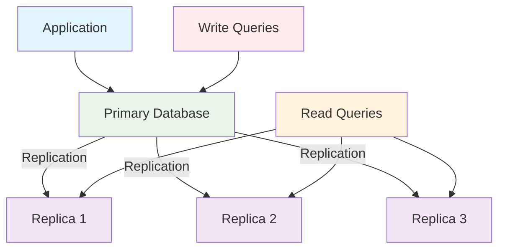
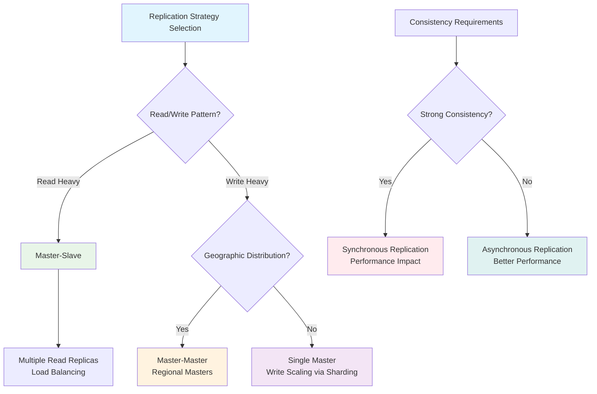

# System Design Fundamentals: Database Replication

Database replication is the process of copying and maintaining database objects across multiple database servers. It's essential for achieving high availability, fault tolerance, and improved read performance in distributed systems.

## What is Database Replication?

Replication creates and maintains identical copies of data across multiple database servers. This ensures data availability even when some servers fail and allows read operations to be distributed across multiple nodes.



## Types of Replication

### 1. Master-Slave (Primary-Secondary) Replication

One database serves as the master (accepts writes), while others serve as slaves (handle reads).

```python
# Master-Slave Replication Implementation
import threading
import time
import queue
import json
from typing import Dict, List, Any, Optional
from enum import Enum
from dataclasses import dataclass, asdict
from datetime import datetime

class ReplicationLogEntry:
    def __init__(self, operation: str, table: str, data: Dict, timestamp: float):
        self.operation = operation  # INSERT, UPDATE, DELETE
        self.table = table
        self.data = data
        self.timestamp = timestamp
        self.log_sequence_number = None

class MasterDatabase:
    def __init__(self, db_id: str):
        self.db_id = db_id
        self.data: Dict[str, Dict[str, Any]] = {}
        self.replication_log: List[ReplicationLogEntry] = []
        self.slaves: List['SlaveDatabase'] = []
        self.log_sequence_number = 0
        self.lock = threading.RLock()
    
    def add_slave(self, slave: 'SlaveDatabase'):
        """Register a slave database"""
        with self.lock:
            self.slaves.append(slave)
            slave.set_master(self)
            print(f"Slave {slave.db_id} registered with master {self.db_id}")
    
    def remove_slave(self, slave: 'SlaveDatabase'):
        """Unregister a slave database"""
        with self.lock:
            if slave in self.slaves:
                self.slaves.remove(slave)
                print(f"Slave {slave.db_id} removed from master {self.db_id}")
    
    def execute_write(self, operation: str, table: str, data: Dict) -> bool:
        """Execute write operation and replicate to slaves"""
        with self.lock:
            try:
                # Execute on master
                if operation == "INSERT":
                    if table not in self.data:
                        self.data[table] = {}
                    self.data[table][data['id']] = data.copy()
                
                elif operation == "UPDATE":
                    if table in self.data and data['id'] in self.data[table]:
                        self.data[table][data['id']].update(data)
                    else:
                        raise KeyError(f"Record {data['id']} not found in {table}")
                
                elif operation == "DELETE":
                    if table in self.data and data['id'] in self.data[table]:
                        del self.data[table][data['id']]
                    else:
                        raise KeyError(f"Record {data['id']} not found in {table}")
                
                # Create replication log entry
                log_entry = ReplicationLogEntry(
                    operation=operation,
                    table=table,
                    data=data.copy(),
                    timestamp=time.time()
                )
                
                self.log_sequence_number += 1
                log_entry.log_sequence_number = self.log_sequence_number
                self.replication_log.append(log_entry)
                
                print(f"Master {self.db_id}: Executed {operation} on {table}")
                
                # Replicate to slaves asynchronously
                self._replicate_to_slaves(log_entry)
                
                return True
                
            except Exception as e:
                print(f"Master {self.db_id}: Write operation failed: {e}")
                return False
    
    def _replicate_to_slaves(self, log_entry: ReplicationLogEntry):
        """Replicate log entry to all slaves"""
        failed_slaves = []
        
        for slave in self.slaves:
            try:
                slave.apply_replication_entry(log_entry)
            except Exception as e:
                print(f"Replication to slave {slave.db_id} failed: {e}")
                failed_slaves.append(slave)
        
        # Remove failed slaves (they need to be re-synchronized)
        for failed_slave in failed_slaves:
            self.remove_slave(failed_slave)
    
    def read(self, table: str, record_id: str) -> Optional[Dict]:
        """Read from master (for consistency guarantees)"""
        with self.lock:
            if table in self.data and record_id in self.data[table]:
                return self.data[table][record_id].copy()
            return None
    
    def get_replication_log(self, from_lsn: int = 0) -> List[ReplicationLogEntry]:
        """Get replication log entries from specific LSN"""
        with self.lock:
            return [entry for entry in self.replication_log 
                   if entry.log_sequence_number > from_lsn]
    
    def get_stats(self) -> Dict[str, Any]:
        """Get master database statistics"""
        with self.lock:
            total_records = sum(len(table_data) for table_data in self.data.values())
            return {
                'db_id': self.db_id,
                'role': 'master',
                'total_records': total_records,
                'log_entries': len(self.replication_log),
                'current_lsn': self.log_sequence_number,
                'active_slaves': len(self.slaves),
                'tables': list(self.data.keys())
            }

class SlaveDatabase:
    def __init__(self, db_id: str, replication_delay: float = 0.1):
        self.db_id = db_id
        self.data: Dict[str, Dict[str, Any]] = {}
        self.master: Optional[MasterDatabase] = None
        self.last_applied_lsn = 0
        self.replication_delay = replication_delay
        self.lock = threading.RLock()
        self.is_running = False
        self.sync_thread = None
    
    def set_master(self, master: MasterDatabase):
        """Set master database for this slave"""
        self.master = master
        self.start_sync()
    
    def start_sync(self):
        """Start background synchronization with master"""
        if not self.is_running and self.master:
            self.is_running = True
            self.sync_thread = threading.Thread(target=self._sync_loop, daemon=True)
            self.sync_thread.start()
            print(f"Slave {self.db_id}: Started synchronization with master")
    
    def stop_sync(self):
        """Stop background synchronization"""
        self.is_running = False
        if self.sync_thread:
            self.sync_thread.join()
    
    def _sync_loop(self):
        """Background loop to pull updates from master"""
        while self.is_running and self.master:
            try:
                # Get new log entries from master
                log_entries = self.master.get_replication_log(self.last_applied_lsn)
                
                for entry in log_entries:
                    self.apply_replication_entry(entry)
                    self.last_applied_lsn = entry.log_sequence_number
                
                time.sleep(self.replication_delay)
                
            except Exception as e:
                print(f"Slave {self.db_id}: Sync error: {e}")
                time.sleep(1)
    
    def apply_replication_entry(self, log_entry: ReplicationLogEntry):
        """Apply a replication log entry"""
        with self.lock:
            operation = log_entry.operation
            table = log_entry.table
            data = log_entry.data
            
            # Simulate replication delay
            time.sleep(self.replication_delay)
            
            if operation == "INSERT":
                if table not in self.data:
                    self.data[table] = {}
                self.data[table][data['id']] = data.copy()
            
            elif operation == "UPDATE":
                if table in self.data and data['id'] in self.data[table]:
                    self.data[table][data['id']].update(data)
            
            elif operation == "DELETE":
                if table in self.data and data['id'] in self.data[table]:
                    del self.data[table][data['id']]
            
            print(f"Slave {self.db_id}: Applied {operation} on {table} (LSN: {log_entry.log_sequence_number})")
    
    def read(self, table: str, record_id: str) -> Optional[Dict]:
        """Read from slave (eventual consistency)"""
        with self.lock:
            if table in self.data and record_id in self.data[table]:
                return self.data[table][record_id].copy()
            return None
    
    def get_stats(self) -> Dict[str, Any]:
        """Get slave database statistics"""
        with self.lock:
            total_records = sum(len(table_data) for table_data in self.data.values())
            replication_lag = 0
            if self.master:
                replication_lag = self.master.log_sequence_number - self.last_applied_lsn
            
            return {
                'db_id': self.db_id,
                'role': 'slave',
                'total_records': total_records,
                'last_applied_lsn': self.last_applied_lsn,
                'replication_lag': replication_lag,
                'is_syncing': self.is_running,
                'tables': list(self.data.keys())
            }

# Database cluster manager
class MasterSlaveCluster:
    def __init__(self, master_id: str):
        self.master = MasterDatabase(master_id)
        self.slaves: Dict[str, SlaveDatabase] = {}
        self.read_preference = "slave"  # "master", "slave", "both"
    
    def add_slave(self, slave_id: str, replication_delay: float = 0.1):
        """Add a new slave to the cluster"""
        slave = SlaveDatabase(slave_id, replication_delay)
        self.slaves[slave_id] = slave
        self.master.add_slave(slave)
        return slave
    
    def remove_slave(self, slave_id: str):
        """Remove a slave from the cluster"""
        if slave_id in self.slaves:
            slave = self.slaves[slave_id]
            slave.stop_sync()
            self.master.remove_slave(slave)
            del self.slaves[slave_id]
    
    def write(self, operation: str, table: str, data: Dict) -> bool:
        """Execute write operation (always goes to master)"""
        return self.master.execute_write(operation, table, data)
    
    def read(self, table: str, record_id: str, consistency: str = "eventual") -> Optional[Dict]:
        """Execute read operation with consistency preference"""
        if consistency == "strong" or not self.slaves:
            # Read from master for strong consistency
            return self.master.read(table, record_id)
        
        # Read from a slave for eventual consistency
        import random
        available_slaves = [slave for slave in self.slaves.values() if slave.is_running]
        
        if available_slaves:
            slave = random.choice(available_slaves)
            return slave.read(table, record_id)
        else:
            # Fallback to master if no slaves available
            return self.master.read(table, record_id)
    
    def get_cluster_stats(self) -> Dict[str, Any]:
        """Get statistics for the entire cluster"""
        stats = {
            'master': self.master.get_stats(),
            'slaves': {slave_id: slave.get_stats() 
                      for slave_id, slave in self.slaves.items()},
            'cluster_size': len(self.slaves) + 1,
            'total_replication_lag': sum(slave.get_stats()['replication_lag'] 
                                       for slave in self.slaves.values())
        }
        return stats

# Demonstration
def demonstrate_master_slave_replication():
    print("=== Master-Slave Replication Demo ===\n")
    
    # Create cluster
    cluster = MasterSlaveCluster("master-01")
    
    # Add slaves
    cluster.add_slave("slave-01", replication_delay=0.05)
    cluster.add_slave("slave-02", replication_delay=0.1)
    cluster.add_slave("slave-03", replication_delay=0.15)
    
    print("1. Cluster setup complete")
    print(f"Initial stats: {cluster.get_cluster_stats()}\n")
    
    # Perform write operations
    print("2. Performing write operations...")
    users_data = [
        {"id": "1", "name": "Alice", "email": "alice@example.com", "age": 30},
        {"id": "2", "name": "Bob", "email": "bob@example.com", "age": 25},
        {"id": "3", "name": "Charlie", "email": "charlie@example.com", "age": 35},
    ]
    
    for user in users_data:
        success = cluster.write("INSERT", "users", user)
        print(f"Insert user {user['name']}: {'Success' if success else 'Failed'}")
    
    # Wait for replication
    print("\n3. Waiting for replication to complete...")
    time.sleep(0.5)
    
    # Test read operations with different consistency levels
    print("\n4. Testing read operations...")
    
    # Strong consistency (from master)
    user = cluster.read("users", "1", consistency="strong")
    print(f"Strong consistency read (master): {user}")
    
    # Eventual consistency (from slave)
    user = cluster.read("users", "1", consistency="eventual")
    print(f"Eventual consistency read (slave): {user}")
    
    # Update operation
    print("\n5. Updating user...")
    cluster.write("UPDATE", "users", {"id": "1", "age": 31, "city": "New York"})
    
    # Check replication lag
    time.sleep(0.3)
    stats = cluster.get_cluster_stats()
    print(f"\nCluster statistics after update:")
    print(f"Master LSN: {stats['master']['current_lsn']}")
    for slave_id, slave_stats in stats['slaves'].items():
        print(f"{slave_id} - LSN: {slave_stats['last_applied_lsn']}, "
              f"Lag: {slave_stats['replication_lag']}")
    
    # Cleanup
    for slave_id in list(cluster.slaves.keys()):
        cluster.remove_slave(slave_id)
    
    print("\n6. Cluster shutdown complete")

if __name__ == "__main__":
    demonstrate_master_slave_replication()
```

### 2. Master-Master (Multi-Master) Replication

Multiple databases can accept writes and replicate to each other.

```go
// Master-Master Replication Implementation in Go
package main

import (
    "fmt"
    "sync"
    "time"
    "math/rand"
    "errors"
)

type Operation struct {
    ID        string
    Type      string // INSERT, UPDATE, DELETE
    Table     string
    Data      map[string]interface{}
    NodeID    string
    Timestamp time.Time
    VectorClock map[string]int
}

type ConflictResolver interface {
    Resolve(op1, op2 *Operation) *Operation
}

// Last Write Wins conflict resolution
type LastWriteWinsResolver struct{}

func (lwr *LastWriteWinsResolver) Resolve(op1, op2 *Operation) *Operation {
    if op1.Timestamp.After(op2.Timestamp) {
        return op1
    } else if op2.Timestamp.After(op1.Timestamp) {
        return op2
    }
    // Tie-breaker using node ID
    if op1.NodeID < op2.NodeID {
        return op1
    }
    return op2
}

// Application-specific conflict resolution
type ApplicationResolver struct{}

func (ar *ApplicationResolver) Resolve(op1, op2 *Operation) *Operation {
    // Example: For user updates, prefer operations with more fields
    if op1.Type == "UPDATE" && op2.Type == "UPDATE" {
        if len(op1.Data) > len(op2.Data) {
            return op1
        }
        return op2
    }
    
    // Default to last write wins
    lwr := &LastWriteWinsResolver{}
    return lwr.Resolve(op1, op2)
}

type MasterNode struct {
    NodeID          string
    Data            map[string]map[string]interface{} // table -> record_id -> data
    OperationLog    []*Operation
    VectorClock     map[string]int
    Peers           map[string]*MasterNode
    ConflictResolver ConflictResolver
    mutex           sync.RWMutex
    replicationQueue chan *Operation
}

func NewMasterNode(nodeID string) *MasterNode {
    return &MasterNode{
        NodeID:          nodeID,
        Data:            make(map[string]map[string]interface{}),
        OperationLog:    make([]*Operation, 0),
        VectorClock:     make(map[string]int),
        Peers:           make(map[string]*MasterNode),
        ConflictResolver: &LastWriteWinsResolver{},
        replicationQueue: make(chan *Operation, 1000),
    }
}

func (mn *MasterNode) AddPeer(peer *MasterNode) {
    mn.mutex.Lock()
    defer mn.mutex.Unlock()
    
    mn.Peers[peer.NodeID] = peer
    mn.VectorClock[peer.NodeID] = 0
    
    fmt.Printf("Node %s: Added peer %s\n", mn.NodeID, peer.NodeID)
}

func (mn *MasterNode) StartReplication() {
    go mn.replicationWorker()
}

func (mn *MasterNode) replicationWorker() {
    for op := range mn.replicationQueue {
        mn.replicateToAllPeers(op)
    }
}

func (mn *MasterNode) Execute(opType, table, recordID string, data map[string]interface{}) error {
    mn.mutex.Lock()
    defer mn.mutex.Unlock()
    
    // Increment local vector clock
    mn.VectorClock[mn.NodeID]++
    
    // Create operation
    op := &Operation{
        ID:          fmt.Sprintf("%s-%d", mn.NodeID, mn.VectorClock[mn.NodeID]),
        Type:        opType,
        Table:       table,
        Data:        make(map[string]interface{}),
        NodeID:      mn.NodeID,
        Timestamp:   time.Now(),
        VectorClock: make(map[string]int),
    }
    
    // Copy data and vector clock
    for k, v := range data {
        op.Data[k] = v
    }
    op.Data["id"] = recordID
    
    for k, v := range mn.VectorClock {
        op.VectorClock[k] = v
    }
    
    // Apply operation locally
    err := mn.applyOperation(op)
    if err != nil {
        return err
    }
    
    // Add to operation log
    mn.OperationLog = append(mn.OperationLog, op)
    
    // Queue for replication
    select {
    case mn.replicationQueue <- op:
        fmt.Printf("Node %s: Queued %s operation on %s.%s for replication\n", 
            mn.NodeID, opType, table, recordID)
    default:
        fmt.Printf("Node %s: Replication queue full, dropping operation\n", mn.NodeID)
    }
    
    return nil
}

func (mn *MasterNode) applyOperation(op *Operation) error {
    table := op.Table
    recordID := op.Data["id"].(string)
    
    switch op.Type {
    case "INSERT":
        if mn.Data[table] == nil {
            mn.Data[table] = make(map[string]interface{})
        }
        mn.Data[table][recordID] = make(map[string]interface{})
        for k, v := range op.Data {
            mn.Data[table][recordID].(map[string]interface{})[k] = v
        }
        
    case "UPDATE":
        if mn.Data[table] == nil || mn.Data[table][recordID] == nil {
            return errors.New("record not found for update")
        }
        record := mn.Data[table][recordID].(map[string]interface{})
        for k, v := range op.Data {
            record[k] = v
        }
        
    case "DELETE":
        if mn.Data[table] == nil || mn.Data[table][recordID] == nil {
            return errors.New("record not found for delete")
        }
        delete(mn.Data[table], recordID)
        
    default:
        return errors.New("unknown operation type")
    }
    
    fmt.Printf("Node %s: Applied %s on %s.%s\n", 
        mn.NodeID, op.Type, table, recordID)
    return nil
}

func (mn *MasterNode) ReceiveReplication(op *Operation) error {
    mn.mutex.Lock()
    defer mn.mutex.Unlock()
    
    // Check for conflicts
    conflict := mn.detectConflict(op)
    if conflict != nil {
        // Resolve conflict
        resolved := mn.ConflictResolver.Resolve(op, conflict)
        fmt.Printf("Node %s: Conflict detected for %s.%s, resolved using %s\n",
            mn.NodeID, op.Table, op.Data["id"], resolved.NodeID)
        op = resolved
    }
    
    // Update vector clock
    for nodeID, clock := range op.VectorClock {
        if clock > mn.VectorClock[nodeID] {
            mn.VectorClock[nodeID] = clock
        }
    }
    
    // Apply operation
    err := mn.applyOperation(op)
    if err != nil {
        return err
    }
    
    // Add to operation log
    mn.OperationLog = append(mn.OperationLog, op)
    
    return nil
}

func (mn *MasterNode) detectConflict(incomingOp *Operation) *Operation {
    recordID := incomingOp.Data["id"].(string)
    
    // Look for recent operations on the same record
    for i := len(mn.OperationLog) - 1; i >= 0; i-- {
        localOp := mn.OperationLog[i]
        
        if localOp.Table == incomingOp.Table && 
           localOp.Data["id"] == recordID &&
           !mn.isOperationCausallyOrdered(localOp, incomingOp) {
            return localOp
        }
    }
    
    return nil
}

func (mn *MasterNode) isOperationCausallyOrdered(op1, op2 *Operation) bool {
    // Check if op1 happened before op2 based on vector clocks
    for nodeID, clock1 := range op1.VectorClock {
        if clock2, exists := op2.VectorClock[nodeID]; !exists || clock1 > clock2 {
            return false
        }
    }
    return true
}

func (mn *MasterNode) replicateToAllPeers(op *Operation) {
    var wg sync.WaitGroup
    
    for _, peer := range mn.Peers {
        wg.Add(1)
        go func(p *MasterNode) {
            defer wg.Done()
            
            // Simulate network delay
            time.Sleep(time.Duration(rand.Intn(50)) * time.Millisecond)
            
            err := p.ReceiveReplication(op)
            if err != nil {
                fmt.Printf("Node %s: Failed to replicate to %s: %v\n", 
                    mn.NodeID, p.NodeID, err)
            }
        }(peer)
    }
    
    wg.Wait()
}

func (mn *MasterNode) Read(table, recordID string) (map[string]interface{}, error) {
    mn.mutex.RLock()
    defer mn.mutex.RUnlock()
    
    if mn.Data[table] == nil || mn.Data[table][recordID] == nil {
        return nil, errors.New("record not found")
    }
    
    // Return a copy of the data
    record := mn.Data[table][recordID].(map[string]interface{})
    result := make(map[string]interface{})
    for k, v := range record {
        result[k] = v
    }
    
    return result, nil
}

func (mn *MasterNode) GetStats() map[string]interface{} {
    mn.mutex.RLock()
    defer mn.mutex.RUnlock()
    
    totalRecords := 0
    for _, table := range mn.Data {
        totalRecords += len(table)
    }
    
    return map[string]interface{}{
        "node_id":       mn.NodeID,
        "total_records": totalRecords,
        "operations":    len(mn.OperationLog),
        "vector_clock":  mn.VectorClock,
        "peers":         len(mn.Peers),
    }
}

// Multi-Master Cluster
type MultiMasterCluster struct {
    Nodes map[string]*MasterNode
}

func NewMultiMasterCluster() *MultiMasterCluster {
    return &MultiMasterCluster{
        Nodes: make(map[string]*MasterNode),
    }
}

func (mmc *MultiMasterCluster) AddNode(nodeID string) *MasterNode {
    node := NewMasterNode(nodeID)
    mmc.Nodes[nodeID] = node
    
    // Connect to all existing nodes
    for _, existingNode := range mmc.Nodes {
        if existingNode.NodeID != nodeID {
            node.AddPeer(existingNode)
            existingNode.AddPeer(node)
        }
    }
    
    node.StartReplication()
    return node
}

func (mmc *MultiMasterCluster) GetNode(nodeID string) *MasterNode {
    return mmc.Nodes[nodeID]
}

func (mmc *MultiMasterCluster) GetClusterStats() map[string]interface{} {
    stats := make(map[string]interface{})
    
    for nodeID, node := range mmc.Nodes {
        stats[nodeID] = node.GetStats()
    }
    
    return stats
}

func main() {
    fmt.Println("=== Master-Master Replication Demo ===\n")
    
    // Create cluster
    cluster := NewMultiMasterCluster()
    
    // Add nodes
    node1 := cluster.AddNode("node-1")
    node2 := cluster.AddNode("node-2")
    node3 := cluster.AddNode("node-3")
    
    fmt.Println("1. Multi-master cluster created with 3 nodes\n")
    
    // Perform concurrent writes on different nodes
    fmt.Println("2. Performing concurrent writes...")
    
    // Node 1 writes
    go func() {
        node1.Execute("INSERT", "users", "1", map[string]interface{}{
            "name": "Alice", "email": "alice@example.com", "age": 30,
        })
        time.Sleep(100 * time.Millisecond)
        node1.Execute("UPDATE", "users", "1", map[string]interface{}{
            "age": 31, "city": "New York",
        })
    }()
    
    // Node 2 writes (potential conflict)
    go func() {
        time.Sleep(50 * time.Millisecond)
        node2.Execute("INSERT", "users", "1", map[string]interface{}{
            "name": "Alice Johnson", "email": "alice.j@example.com", "age": 29,
        })
        node2.Execute("INSERT", "users", "2", map[string]interface{}{
            "name": "Bob", "email": "bob@example.com", "age": 25,
        })
    }()
    
    // Node 3 writes
    go func() {
        time.Sleep(75 * time.Millisecond)
        node3.Execute("INSERT", "users", "3", map[string]interface{}{
            "name": "Charlie", "email": "charlie@example.com", "age": 35,
        })
        node3.Execute("UPDATE", "users", "1", map[string]interface{}{
            "department": "Engineering",
        })
    }()
    
    // Wait for replication to complete
    fmt.Println("\n3. Waiting for replication and conflict resolution...")
    time.Sleep(2 * time.Second)
    
    // Check final state on all nodes
    fmt.Println("\n4. Final state verification:")
    
    for _, nodeID := range []string{"node-1", "node-2", "node-3"} {
        node := cluster.GetNode(nodeID)
        fmt.Printf("\n%s data:\n", nodeID)
        
        for userID := range []string{"1", "2", "3"} {
            if user, err := node.Read("users", fmt.Sprintf("%d", userID+1)); err == nil {
                fmt.Printf("  User %d: %v\n", userID+1, user)
            }
        }
    }
    
    // Show cluster statistics
    fmt.Println("\n5. Cluster Statistics:")
    stats := cluster.GetClusterStats()
    for nodeID, nodeStats := range stats {
        fmt.Printf("%s: %v\n", nodeID, nodeStats)
    }
}
```

## Replication Lag and Consistency

### Monitoring Replication Lag

```python
# Replication lag monitoring and alerting system
import time
import threading
from typing import Dict, List, Optional
from dataclasses import dataclass
from datetime import datetime, timedelta
from enum import Enum

class AlertLevel(Enum):
    INFO = "info"
    WARNING = "warning"
    CRITICAL = "critical"

@dataclass
class ReplicationAlert:
    timestamp: datetime
    node_id: str
    message: str
    level: AlertLevel
    lag_seconds: float

class ReplicationMonitor:
    def __init__(self, warning_threshold: float = 5.0, critical_threshold: float = 15.0):
        self.warning_threshold = warning_threshold
        self.critical_threshold = critical_threshold
        self.alerts: List[ReplicationAlert] = []
        self.metrics_history: Dict[str, List[tuple]] = {}  # node_id -> [(timestamp, lag)]
        self.is_monitoring = False
        self.monitor_thread = None
    
    def start_monitoring(self, cluster, check_interval: float = 1.0):
        """Start monitoring replication lag"""
        self.cluster = cluster
        self.check_interval = check_interval
        self.is_monitoring = True
        self.monitor_thread = threading.Thread(target=self._monitor_loop, daemon=True)
        self.monitor_thread.start()
        print("Replication monitoring started")
    
    def stop_monitoring(self):
        """Stop monitoring"""
        self.is_monitoring = False
        if self.monitor_thread:
            self.monitor_thread.join()
    
    def _monitor_loop(self):
        """Main monitoring loop"""
        while self.is_monitoring:
            try:
                self._check_replication_lag()
                time.sleep(self.check_interval)
            except Exception as e:
                print(f"Monitoring error: {e}")
                time.sleep(self.check_interval)
    
    def _check_replication_lag(self):
        """Check replication lag for all slaves"""
        if not hasattr(self.cluster, 'slaves'):
            return
        
        current_time = datetime.now()
        
        for slave_id, slave in self.cluster.slaves.items():
            lag = self._calculate_lag(slave)
            
            # Store metrics
            if slave_id not in self.metrics_history:
                self.metrics_history[slave_id] = []
            
            self.metrics_history[slave_id].append((current_time, lag))
            
            # Keep only last 100 measurements
            if len(self.metrics_history[slave_id]) > 100:
                self.metrics_history[slave_id] = self.metrics_history[slave_id][-100:]
            
            # Check thresholds and create alerts
            self._check_thresholds(slave_id, lag)
    
    def _calculate_lag(self, slave) -> float:
        """Calculate replication lag in seconds"""
        if not slave.master:
            return 0.0
        
        master_lsn = slave.master.log_sequence_number
        slave_lsn = slave.last_applied_lsn
        lag_entries = master_lsn - slave_lsn
        
        # Estimate time lag based on recent log entries
        if lag_entries == 0:
            return 0.0
        
        # Simple estimation: assume 1 entry per second average
        return float(lag_entries) * 0.1  # Adjust based on your system
    
    def _check_thresholds(self, slave_id: str, lag: float):
        """Check if lag exceeds thresholds and create alerts"""
        current_time = datetime.now()
        
        if lag >= self.critical_threshold:
            alert = ReplicationAlert(
                timestamp=current_time,
                node_id=slave_id,
                message=f"Critical replication lag: {lag:.2f}s",
                level=AlertLevel.CRITICAL,
                lag_seconds=lag
            )
            self.alerts.append(alert)
            print(f"🚨 CRITICAL: {alert.message}")
            
        elif lag >= self.warning_threshold:
            alert = ReplicationAlert(
                timestamp=current_time,
                node_id=slave_id,
                message=f"High replication lag: {lag:.2f}s",
                level=AlertLevel.WARNING,
                lag_seconds=lag
            )
            self.alerts.append(alert)
            print(f"⚠️  WARNING: {alert.message}")
    
    def get_current_lag(self) -> Dict[str, float]:
        """Get current lag for all slaves"""
        current_lag = {}
        for slave_id, slave in self.cluster.slaves.items():
            current_lag[slave_id] = self._calculate_lag(slave)
        return current_lag
    
    def get_lag_history(self, slave_id: str, minutes: int = 10) -> List[tuple]:
        """Get lag history for a specific slave"""
        if slave_id not in self.metrics_history:
            return []
        
        cutoff_time = datetime.now() - timedelta(minutes=minutes)
        return [(ts, lag) for ts, lag in self.metrics_history[slave_id] 
                if ts >= cutoff_time]
    
    def get_recent_alerts(self, minutes: int = 60) -> List[ReplicationAlert]:
        """Get recent alerts"""
        cutoff_time = datetime.now() - timedelta(minutes=minutes)
        return [alert for alert in self.alerts if alert.timestamp >= cutoff_time]
    
    def get_health_summary(self) -> Dict[str, any]:
        """Get overall cluster health summary"""
        current_lag = self.get_current_lag()
        recent_alerts = self.get_recent_alerts(30)  # Last 30 minutes
        
        healthy_slaves = sum(1 for lag in current_lag.values() if lag < self.warning_threshold)
        warning_slaves = sum(1 for lag in current_lag.values() 
                           if self.warning_threshold <= lag < self.critical_threshold)
        critical_slaves = sum(1 for lag in current_lag.values() if lag >= self.critical_threshold)
        
        return {
            'timestamp': datetime.now(),
            'total_slaves': len(current_lag),
            'healthy_slaves': healthy_slaves,
            'warning_slaves': warning_slaves,
            'critical_slaves': critical_slaves,
            'max_lag': max(current_lag.values()) if current_lag else 0,
            'avg_lag': sum(current_lag.values()) / len(current_lag) if current_lag else 0,
            'recent_alerts': len(recent_alerts),
            'current_lag': current_lag
        }

# Replication healing and recovery
class ReplicationHealer:
    def __init__(self, monitor: ReplicationMonitor):
        self.monitor = monitor
        self.healing_strategies = {
            'restart_slave': self._restart_slave_sync,
            'increase_batch_size': self._increase_replication_batch,
            'parallel_sync': self._parallel_sync,
            'full_resync': self._full_resynchronization
        }
    
    def auto_heal(self, slave_id: str, lag: float) -> bool:
        """Automatically attempt to heal replication issues"""
        print(f"Attempting auto-heal for {slave_id} (lag: {lag:.2f}s)")
        
        if lag < 10.0:
            return self._restart_slave_sync(slave_id)
        elif lag < 30.0:
            return self._increase_replication_batch(slave_id)
        elif lag < 60.0:
            return self._parallel_sync(slave_id)
        else:
            return self._full_resynchronization(slave_id)
    
    def _restart_slave_sync(self, slave_id: str) -> bool:
        """Restart slave synchronization"""
        try:
            cluster = self.monitor.cluster
            if slave_id in cluster.slaves:
                slave = cluster.slaves[slave_id]
                slave.stop_sync()
                time.sleep(1)
                slave.start_sync()
                print(f"Restarted synchronization for {slave_id}")
                return True
        except Exception as e:
            print(f"Failed to restart sync for {slave_id}: {e}")
        return False
    
    def _increase_replication_batch(self, slave_id: str) -> bool:
        """Increase replication batch size for faster catch-up"""
        print(f"Increasing replication batch size for {slave_id}")
        # Implementation would modify replication parameters
        return True
    
    def _parallel_sync(self, slave_id: str) -> bool:
        """Enable parallel synchronization"""
        print(f"Enabling parallel sync for {slave_id}")
        # Implementation would enable parallel replication streams
        return True
    
    def _full_resynchronization(self, slave_id: str) -> bool:
        """Perform full resynchronization from master"""
        print(f"Performing full resync for {slave_id}")
        try:
            cluster = self.monitor.cluster
            if slave_id in cluster.slaves:
                slave = cluster.slaves[slave_id]
                master = cluster.master
                
                # Stop current sync
                slave.stop_sync()
                
                # Clear slave data
                slave.data.clear()
                slave.last_applied_lsn = 0
                
                # Copy all data from master
                with master.lock:
                    for table, table_data in master.data.items():
                        slave.data[table] = {}
                        for record_id, record_data in table_data.items():
                            slave.data[table][record_id] = record_data.copy()
                
                # Set LSN to current master LSN
                slave.last_applied_lsn = master.log_sequence_number
                
                # Restart sync
                slave.start_sync()
                
                print(f"Full resynchronization completed for {slave_id}")
                return True
        except Exception as e:
            print(f"Full resync failed for {slave_id}: {e}")
        return False

# Enhanced demonstration with monitoring
def demonstrate_replication_with_monitoring():
    print("=== Replication with Monitoring Demo ===\n")
    
    # Create cluster with monitoring
    from system_design_replication import MasterSlaveCluster  # Previous implementation
    
    cluster = MasterSlaveCluster("master-01")
    
    # Add slaves with different delays to simulate lag
    cluster.add_slave("slave-01", replication_delay=0.1)
    cluster.add_slave("slave-02", replication_delay=0.5)  # Slower slave
    cluster.add_slave("slave-03", replication_delay=0.2)
    
    # Setup monitoring
    monitor = ReplicationMonitor(warning_threshold=2.0, critical_threshold=5.0)
    healer = ReplicationHealer(monitor)
    
    monitor.start_monitoring(cluster, check_interval=0.5)
    
    print("1. Cluster with monitoring started\n")
    
    # Perform operations to create replication lag
    print("2. Creating workload to test replication...")
    
    for i in range(20):
        user_data = {
            "id": str(i + 1),
            "name": f"User {i + 1}",
            "email": f"user{i + 1}@example.com",
            "timestamp": time.time()
        }
        cluster.write("INSERT", "users", user_data)
        time.sleep(0.1)
    
    # Let monitoring collect data
    print("\n3. Monitoring replication lag...")
    time.sleep(5)
    
    # Show health summary
    health = monitor.get_health_summary()
    print(f"\nCluster Health Summary:")
    print(f"  Total slaves: {health['total_slaves']}")
    print(f"  Healthy: {health['healthy_slaves']}")
    print(f"  Warning: {health['warning_slaves']}")
    print(f"  Critical: {health['critical_slaves']}")
    print(f"  Max lag: {health['max_lag']:.2f}s")
    print(f"  Avg lag: {health['avg_lag']:.2f}s")
    
    # Show recent alerts
    alerts = monitor.get_recent_alerts()
    if alerts:
        print(f"\nRecent Alerts ({len(alerts)}):")
        for alert in alerts[-5:]:  # Show last 5 alerts
            print(f"  {alert.timestamp.strftime('%H:%M:%S')} - {alert.level.value.upper()}: {alert.message}")
    
    # Demonstrate auto-healing
    print(f"\n4. Testing auto-healing...")
    for slave_id, lag in health['current_lag'].items():
        if lag > monitor.warning_threshold:
            success = healer.auto_heal(slave_id, lag)
            print(f"Auto-heal for {slave_id}: {'Success' if success else 'Failed'}")
    
    # Final health check
    time.sleep(3)
    final_health = monitor.get_health_summary()
    print(f"\nFinal Health Summary:")
    print(f"  Max lag: {final_health['max_lag']:.2f}s")
    print(f"  Avg lag: {final_health['avg_lag']:.2f}s")
    
    monitor.stop_monitoring()
    print("\nMonitoring stopped")

if __name__ == "__main__":
    demonstrate_replication_with_monitoring()
```

## Best Practices and Trade-offs

### Replication Strategy Selection Matrix



### Key Considerations

1. **Consistency vs Performance Trade-off**
   - Synchronous replication: Strong consistency, higher latency
   - Asynchronous replication: Eventual consistency, better performance

2. **Conflict Resolution Strategies**
   - Last Write Wins (LWW)
   - Application-specific resolution
   - Vector clocks for causality
   - Operational transforms

3. **Monitoring and Alerting**
   - Replication lag thresholds
   - Failed replica detection
   - Automated healing procedures
   - Performance metrics

4. **Failure Scenarios**
   - Master failure: Promote slave to master
   - Slave failure: Remove from rotation, resync when recovered
   - Network partition: Split-brain prevention
   - Data corruption: Point-in-time recovery

## Conclusion

Database replication is essential for building resilient, scalable systems. Key takeaways:

- **Choose the right pattern**: Master-slave for read-heavy workloads, master-master for geographic distribution
- **Monitor replication lag**: Implement comprehensive monitoring and alerting
- **Plan for conflicts**: Design appropriate conflict resolution strategies
- **Handle failures gracefully**: Implement automated failover and recovery procedures
- **Balance consistency and performance**: Choose synchronous vs asynchronous replication based on requirements
- **Test failure scenarios**: Regularly test failover procedures and data consistency

Proper replication design ensures your system can handle failures while maintaining data availability and consistency according to your application's requirements.